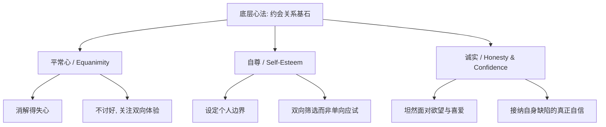

### 破除陈规：从对立情绪中寻找真诚沟通的可能

在当今的中文互联网生态中，“如何吸引异性”或“如何吸引女生”已经逐渐演变成一个极其敏感、甚至带有某种“流量自杀式”特质的话题。只要稍微观察就会发现，目前网络上探讨这一领域的言论基本呈现出两极分化的病态对立趋势：一类是充斥着各种投机取巧、试图通过心理操纵和欺骗手段来达到目的的 **PUA 话术**（Pick-up Artist: 运用心理学技巧进行诱导与操纵的搭讪艺术）；另一类则是以挑动男女对立、宣泄情绪、制造性别矛盾来博取眼球的极端言论。这两者都脱离了人与人之间真诚沟通的本质，不仅无法帮助人们建立健康、持久的亲密关系，反而加剧了群体之间的信任危机。

然而，人际交往与亲密关系的建立，其底层逻辑是互通的。在杨天楠老师主持的一档名为《为何我们无法从宏大叙事辩论中获得幸福》的播客节目中，嘉宾猫草老师提出了一个非常有启发性的观点。他指出，对于很多男生来说，**情商培训**（Emotional Intelligence Training: 识别、理解和管理自身及他人情绪的能力）其实是一项性价比极高的投资。相比于购买昂贵的奢侈品、豪车或进行高消费的社交活动，学习如何去理解他人、如何得体地与人沟通，所需的金钱消费其实非常少，但其带来的长远回报却是无可估量的。如果一个男性能够真正掌握并践行良好的情商与沟通能力，他在亲密关系的探索中往往能够游刃有余，这辈子都不会缺少高质量的伴侣。

这个观点非常值得我们深思。事实上，吸引女生的核心原则，与商业世界中的销售沟通、商务谈判以及任何需要与他人达成深度合作、建立信任的社会场合，在底层逻辑上是完全相通的。然而，在现实生活中，绝大多数人（包括我自己在早期探索阶段）都不可避免地采取了一些错误的方法。正如播客中所分析的那样，那些在人际交往和亲密关系中如鱼得水、极其擅长吸引异性的男性，很大一部分是属于“先天型”的。他们天生就具备极高的感知力和社交天赋，不需要经过刻意的训练就能让周围的人感到舒适。

比如我的儿子虽然只有两岁，但我能明显感觉到他身上就带有一种天然讨人喜欢的特质，能够轻松捕捉到大人的情绪变化并做出讨喜的回应。但这显然不是每个人都拥有的天赋，我很明确地知道自己并不属于这门“老天赏饭吃”的类型。在成长的道路上，我犯过无数次低级错误，遭遇过冷场、尴尬与挫败，如今我能拥有一个非常优秀、彼此高度契合的妻子，并在婚姻中保持幸福，完全得益于我后天对这些社交与情感沟通原则的刻意学习、自我反省以及对错误的不断修正。这是一种完全可以通过后天习得、系统训练来提升的底层社会化能力。

在播客中，当猫草老师抛出这个情商话题时，杨天楠老师开玩笑地回避了，表示自己不擅长也无法讲授这个主题。其实明眼人都能听得出来，楠师本身就是一个谈吐温雅、情商极高的人，如果他愿意分享，一定能给出非常深刻的洞察。但聪明人的做法往往是避开这类容易引发争议和误解的舆论漩涡。因为在不同的时代背景下，社会的道德尺度、两性关系的评价体系都在不断发生变化。也许在今天听起来完全合情合理的交往建议，在五年甚至十年之后，随着社会观念的演变，就可能被贴上落后的标签，从而变成所谓的“历史黑历史”。

但是，两性之间如何建立健康吸引力、如何进行高质量的约会交往，依然是每一个追求个人成长和生活幸福的个体无法绕过的核心课题。因此，即便这个话题充满争议，我依然希望能够剥离那些低俗的套路，从认知科学、心理学以及实践经验的角度，深层次地聊一聊如何通过认知升级和行为修正，实现人际关系中的自然吸引。如果你在收听或阅读过程中感到任何不适，随时可以关闭离开，我并不追求这期内容能获得多么庞大的流量，但我真诚地希望，那些能够沉下心来阅读并思考这些原则的人，能够从中获得启发，改善自己的亲密关系与社交现状。

---

### 认知跃迁：从“孔雀开屏”到“深度探寻”

要彻底解决在约会和社交中无法吸引对方的困局，首先必须纠正一个在绝大多数男性心中根深蒂固的认知偏差——我称之为**孔雀开屏**（Peacocking: 社交场合中过度、刻意地展示自身优势的行为）。

很多男性在面对自己心仪的异性或者重要的合作伙伴时，潜意识里的第一反应就是开始进行全方位的内容展示（Sales Pitch & Show Off）。他们会像一只急于求偶的孔雀一样，拼命地向对方展示自己的羽毛有多么美丽。在谈话中，他们急不可耐地抛出自己身上的各种标签：名校毕业、年薪百万、创业经历、买了什么车、去了哪些国家旅游、认识哪些行业大佬。他们把一次本该双向流动的约会，变成了一场个人的招商发布会和单向的价值宣讲。

我自己在早期约会时就频繁陷入这种自我感动的陷阱中。记得有一次在音频社交平台 Clubhouse 上，果壳网组织了一场类似于线上半相亲性质的嘉宾互动活动。当时轮到我自我介绍时，我由于紧张和心切，便将自己简历上的那些硬性标签——博士学位、工作成就、专业背景等——像报菜名一样巴拉巴拉全部抖了出来。结果可想而知，麦克风那一头是一片尴尬的死冷场。

在那个瞬间，我自己也产生了一种极其强烈的不适感与自我怀疑：我刚才到底在干什么？我为什么要把这些冰冷的、充满炫耀意味的标签强行塞给听众？这能代表我是一个有趣、值得交往的人吗？相反，当时活动中一些真正让人感觉如沐春风、心生好感的嘉宾，他们在介绍自己时非常低调，往往只是分享一两个日常生活中有趣的细节、一个带有幽默反转的小故事，绝不会去刻意堆砌任何闪光的社会标签，但他们的独特魅力却在不经意间自然流露。

这次尴尬的经历让我彻底醒悟：在人类的社会化大脑中，好感与吸引力的产生并不是通过逻辑计算和条件比对完成的。人脑的神经网络并不是这样被格式化的。你强行展示的硬性条件，很多时候只会在对方心里建立起一道防御的屏障，让人觉得你虚荣、浮夸且缺乏安全感。

后来我读到了美国著名畅销书作家罗伯特·格林（Robert Greene）的经典著作，他在书中对**主导诱惑者**（Master Seducer: 能够跨越心理防御、与他人建立深度情感联结的沟通大师）进行了深刻的剖析。格林指出，历史和现实中那些最具吸引力、最擅长建立深度人际联结的人，往往并不是那些拥有绝世容貌或掌握了高超搭讪套路的人。他们之所以能产生致命的吸引力，核心在于他们拥有一个共同的特质：**将注意力的焦点彻底从自己身上移开，转而投向对方。**

他们做到了对交往对象抱有极其充分的关心，想方设法地去了解对方。他们不急于表达自己，不急于证明自己的优秀，而是对对方身上的故事、内心深处的欲望、潜意识里的恐惧以及性格中的矛盾，抱有非常强烈、真诚且深刻的好奇心。

这里有四个至关重要的关键词：**故事、欲望、恐惧、矛盾**。

绝大多数不擅长社交的人，对异性的了解仅仅停留在肤浅的“查户口”层面。例如在约会时连续发问：“你是做什么工作的？”“你老家是哪里的？”“你家里有几口人？”“你是什么大学毕业的？”这种流水账式的提问不叫好奇心，这叫行政审查。这不仅无法拉近两人的距离，反而会让对方感到被冒犯和疲惫。

每个人在这个世界上都是一个独立的宇宙，都拥有自己独特的生命故事。在这些故事的背后，藏着他们真正渴望得到却尚未满足的欲望、让他们在深夜感到焦虑和无力的恐惧，以及他们在成长过程中妥协、挣扎所形成的性格矛盾。当一个女生在和你聊天时，发现你关注的不是她身上那些世俗的标签，而是真正听懂了她独特的挣扎，感知到了她的脆弱，理解了她的矛盾时，她会产生一种极度稀缺的心理体验——**“我被看见了，我被理解了”**。这种深度被理解的体验，才是两性交往中产生终极吸引力的核心磁场。因此，整个约会观念必须发生颠覆性的跃迁：**将以自我展示为中心的“推销模式”，转变为以理解对方为中心的“探寻模式”**。

---

### 三大支柱：构建吸引力的行为法则

在完成了底层的认知转变之后，为了能够将“理解对方”这一抽象概念切实落地，我们需要在具体的约会和交往行为中，构建起三大核心原则。这三大原则分别是：**好奇心、回应力以及带有反差的真实感**。

#### 原则一：无条件的纯粹好奇心

首先，我们来进一步拆解**好奇心**（Genuine Curiosity: 对外部世界及他人生命经验的不带偏见的探求欲）。在约会中，你必须在内心确立一个信念：**“了解眼前的这个人，是我今天晚上坐在这里的唯一目的。”**

很多人在交往时也会假装提问，但他们的好奇心是功利性的，是把提问当成了一种攻心防的武器。他们内心预设了强烈的目的性：我今天表现出对你感兴趣，是为了让你喜欢我，是为了今晚能把我们的关系推进到某个特定的亲密阶段。当你的心中写满了功利性的诉求时，你的眼神、语气和肢体语言就会把你的欲望暴露无遗。这种带有压迫感和企图心的“伪好奇”，会让敏感的异性立刻拉起警报，产生强烈的不适与防备心理。

相反，如果你的好奇心是纯粹的，仅仅是因为对方作为一个独特的生命个体出现在你的生命里，你渴望去阅读她这本独特的书，那么这种沟通的磁场就会完全不同。在现代社会中，每个人的注意力都是极其稀缺的资源，而人们愿意投射在他人身上的注意力更是微乎其微。当你能够心无旁骛地坐在一个人对面，暂时忘掉自己的利益得失，全神贯注地聆听她的倾诉，并在关键节点给出基于深度理解的提问时，你实际上是给对方奉献了一份极其珍贵的礼物——**稀缺的深度注意力**。

同时，我们必须将这种真诚的好奇心与软弱的“舔狗”行为严格区分开来。好奇心并不意味着在谈话中对方说什么你都去奉承、迎合和讨好。恰恰相反，迎合讨好是功利心驱使的表现，因为你有所图，所以才不敢表达真实的异议。

真正富有吸引力的好奇心是：**“我不一定完全赞同你的观点，但我对你为什么会形成这样的想法背后的成长故事，抱有极大的兴趣。”** 你可以大方、坦然地与对方讨论不同的看法，但在讨论时，你的态度是探求的、包容的，而不是说教的、审判的。这里存在一个微妙的人际关系悖论：在两性吸引中，你越是急迫地想要去取悦、打动（impress）对方，你展现出来的状态往往越做作，越无法打动对方；而当你放下取悦的执念，纯粹去倾听和理解时，你反而能够自然而然地打动对方。

#### 原则二：敏锐且即时的回应力

第二大原则是**回应力**（Responsiveness: 对他人反馈做出的敏锐察觉与积极行动力）。在人际交往中，语言上的承诺往往是廉价的，只有当你的行动能够与对方的言语产生即时的共振时，信任和吸引力才会呈指数级上升。

关于这一点，我可以用我自己当年追求我妻子时的真实案例来加以说明。在我们刚刚开始约会的那段时间，正值我人生的体重巅峰，大概有90公斤，整个人看起来非常臃肿，毫无运动活力。而我妻子当时比我小9岁，身材非常匀称健康（fit），是一个非常热爱户外运动、极具生命活力且审美标准很高的漂亮女生。

在我们的第一次约会结束之后，她对我的印象是：虽然这个人的谈吐和性格还不错，但体型实在太胖了，这说明他在生活中可能缺乏自律，不够积极活跃（active），也不够热爱运动（athletic），这与她对理想伴侣的审美预期相去甚远。

面对这种委婉的否定，我没有像很多自尊心脆弱的男生那样去强行辩解、愤怒或者冷战，而是选择把她的反馈真正听了进去，并立刻付诸行动。刚好当时我家里购置了一台 Peloton 智能健身单车，在约会结束后的第二天清晨，我就逼着自己坐上单车，高强度地踩了20分钟，直到大汗淋漓。运动结束后，我把显示消耗卡路里数据的屏幕以及我的运动session记录拍了一张照片，没有多余的肉麻情话，只是简单地发给了她。

我妻子在很久以后跟我回忆起这段往事时说，就是我发照片的那一个小小的举动，瞬间击中了她内心的柔软处。因为这向她传递了一个极其清晰的信号：**我非常认真地对待她所说的每一句话，并且我是一个拥有极强执行力和改变决心的行动派。** 这种敏锐、即时且用行动支撑的回应力，在两性交往中是一个巨大的加分项。它不仅消除了她对我“缺乏活力”的担忧，更证明了我对她的尊重与重视。虽然在婚后因为养娃的劳累，我的体重又有些反弹，但我依然会坚持运动，保持健康的生活状态，因为我深知这种即时响应对方需求的态度，是维系两性亲密关系基石的关键。

#### 原则三：带有反差效果的真实感

第三大原则是**真实感与预期反差**（Authenticity & Expectation Divergence: 展现真实复杂的自我，并用多维度的人格打破对方的单一刻板印象）。

在约会初期，千万不要试图去塑造一个完美无瑕的虚拟人设。人设越完美，细节就越紧绷，给人的感觉就越虚假。更重要的是，完美的人设是单薄且无趣的。真正的高级做法，是展现一个活生生的、有血有肉、甚至带有一些小瑕疵但非常立体的真实自我。并且，在这个真实自我的背后，最好能够包含一些让对方意想不到的反差感。

以我个人为例，我是一个从小卷到大的典型工科男、理工科博士，平时给人的第一印象可能是比较理智、刻板、学术甚至有些书呆子气。但同时，我有一个坚持了多年的硬核爱好——骑重型摩托车。从我在美国读博士期间开始，骑摩托车就是我释放压力的方式。后来在西雅图工作生活期间，虽然我有一辆性能不错的轿车，但我日常通勤、外出吃饭最主要的交通工具依然是我的摩托车。在西雅图阴雨绵绵或阳光明媚的日子里，穿上皮衣、戴上头盔，在道路上风驰电掣，这种充满力量感和野性的爱好，与我身上的博士学术标签，形成了一种极强的戏剧性反差。

当异性在逐渐深入了解你的过程中，发现你并不是一张能够被一眼看穿的白纸，也不是一个可以用单一职业标签（如“程序员”、“金融男”）定义的概念，而是发现你身上隐藏着许多与最初预期不一致的多样化兴趣时，这种**预期的反差感**会极大地激发她们探索你内心世界的欲望。

真实感的前提是，你自己在生活中是一个真正热爱生活、活得有意思、有生命力（vital）的人。你对这个世界拥有广泛的兴趣，你骑行、你阅读、你烹饪、或者你深度参与某种小众文化。这些真正融入你骨血的生命体验，会在你的一举一动中散发出独特的活力，这比你在约会时口若悬河地吹嘘自己的成就，要高级并且有效得多。

---

### 三大心法：维系健康关系的底层心态

在具体行为原则的支撑下，我们还需要在内心建立起支撑这些行为的“底层防线”，也就是在约会和社交中必须具备的三大底层心法：**平常心、自尊、以及不加伪装的诚实**。

#### 心法一：消解得失心的平常心

第一大心法是**平常心**（Equanimity: 面对社交结果时从容不迫、不患得患失的平和心态）。很多男生一遇到心仪的女生，整个人就会陷入高度的紧张和焦虑中。他们把每一次约会都看成是决定终身幸福的生死战，极度害怕说错话，极度渴望给对方留下好印象。这种过度的焦虑，必然会导致他们在交往中举止失常、反应过度。

你必须明白，约会最核心的目的，是让身处其中的两个人都获得一段愉快的时光。你没有义务去单方面讨好对方以换取她的认可。当你把对方放在一个比你高的位置，一味地通过奉承、降低底线来迎合对方时，你在女生眼里就已经失去了独立的人格魅力，瞬间沦为了毫无吸引力的“舔狗”。

坦白讲，在很长一段时间里，我也是一个在感情里非常卑微、容易变成“舔狗”的人。我不擅长网络聊天，在微信沟通中有着强烈的“秒回强迫症”，而且极其敏感，总是过度照顾对方的情绪，常常为了迎合对方而主动践踏自己的边界，结果反而让关系走向破裂。

在交往中，我们要做的不是去迎合这套“谁先回信息谁就输了”的无聊游戏规则。如果对方因为你回信息快就认为你价值低、是舔狗，那只能说明你们的价值观并不兼容，那就让她这么想好了。保持平常心，做真实的自己，不试图扮演任何人，你才能在谈话中展现出最自然、最松弛的一面。

#### 心法二：敢于走开的自尊

第二大心法是**自尊**（Self-esteem: 对自身价值的坚定认可，并设立不可侵犯的社交边界）。我们必须建立一个清晰的认知：**约会（Dating）本质上是一个互相对等、双向筛选的过程，而不是一场你作为应试者接受对方考评的面试。**

即便你表现得再得体，对对方再有好奇心，在交往中也总会遇到各种不可控的情况。如果对方在约会中态度傲慢，全程漫不经心地玩手机，对你的真诚互动毫无回应，或者表现出对你人格的不尊重，此时你最需要做出的选择不是继续加倍讨好，而是果断地保护自己的边界——体面地走开（walk away）。

你可以坦然地对她说：“谢谢你今晚的时间，但我感觉我们的沟通似乎不太在一个频段上，我想我们没有必要再继续耽误彼此的时间了。”然后买单离开，去寻找下一个真正懂得欣赏你的人。

自尊的核心在于，你做所有事情的底层动力，是为了让自己也拥有一段高质量的生命体验。如果一段关系让你感到憋屈、拧巴、自尊受挫，那它从一开始就是错误的。

当初我追求我妻子时，我也曾担心自己的秒回强迫症会让她反感。但幸运的是，她也是一个性格直爽、做事高效的人，我给她秒发信息，她同样会秒回我。这种畅快淋漓、毫无试探与拉扯的沟通体验，让我们彼此都感到极度的舒适和安全。这让我意识到，真正对的人，是不需要你通过自我折磨和放弃尊严去维系的。当你拥有坚定的自尊，把约会当成一种筛选机制，你就会明白，我们提升自己的社交能力，是为了在遇到那个真正契合的伴侣时，不会因为低级失误而错过，而不是为了去迎合、讨好这个世界上所有的人。

#### 心法三：坦荡与接纳缺陷的诚实

第三大心法是**诚实**（Honesty: 对内不自我欺骗，对外不饰粉饰，能够坦然展示真实欲望与接纳自身缺陷的勇气）。

在很多传统的交往观念中，男性被教育要隐瞒自己的真实意图，用各种拐弯抹角的借口来接近女生。然而这种伪装往往会适得其反，让女生觉得你虚伪、甚至带有某种猥琐的企图心。

相反，大方、坦荡地承认自己的喜爱，是一种极具雄性魅力的表现。如果你觉得一个女生的长相很吸引你，你完全可以大方地夸赞：“你今天看起来非常漂亮，我很喜欢你的状态。”如果你觉得她的身材管理得很好，也可以在适当的社交分寸下表达欣赏。你越是能够坦然地面对自己内心深处的本能与欲望，并且不带任何下流感地将其表达出来，你在异性眼中的魅力就会越发显得清澈与自信。

当然，诚实的前提是建立在真正的自信之上的。关于什么是**自信**（Self-confidence），很多人有着极大的误解。自信绝不是每天在镜子面前对自己进行自我催眠，大喊“我是最棒的，我是世界上无所不能的成功者”。这不叫自信，这叫自恋和逃避。

真正的自信，恰恰是一种**能够极度坦然地面对自身缺陷与不完美的状态**（Being comfortable with one's own flaws）。当你可以非常从容地面对自己的不完美，承认自己某些方面的无能，并且在别人提起你的缺点时能够淡然一笑、坦白承认“是的，我确实在这方面做得不够好，我就是这样一个人”时，你身上就会散发出一种坚不可摧的自信磁场。这种自信是诚实的自然产物。

不过在实践“诚实表达”时，我们也必须注意社交礼仪与文化适配的平衡。例如，在两性交往中，直接、粗鲁地评价女生的外貌和身材，即便你的本意是赞美，但在现代社会语境下，由于女性群体长期以来面临着巨大的“外貌焦虑”和“社会凝视”，这种评价极易被视作是不尊重和冒犯（不符合女性主义价值观）。

因此，你的诚实表达绝对不能以牺牲对方的舒适度为代价。更得体的做法是，通过赞美对方的整体状态、独特的审美穿搭或者散发出的活力，来传达你的好感。比如：“今天和你聊天，我觉得你的状态特别好，让人感到很放松。”这种在尊重前提下的诚实，才是最高级的社交润滑剂。

---

### 体验设计：人际吸引与商业逻辑的终极闭环

当我们把约会的所有原则和心法融会贯通之后，会发现整个吸引的过程，实际上可以提炼为两个字——**体验**（Experience Design: 以用户旅程为核心，通过对接触点的精心设计，创造超越预期的情感体验）。

两性交往的成败，往往不取决于那些硬性的、冰冷的技术指标。这就像我的好朋友高寒在和我聊起他的创业经历时所说的一样。高寒是一名资深餐饮主理人，在开餐馆的过程中，他曾花无数精力去钻研厨艺的改进、菜单的精细化设计、店面装潢的风格等。

但在经历了多年的餐饮行业洗礼后，高寒得出了一个极为深刻的结论：**对于一家高品质的餐馆来说，上述的所有硬性因素都不是最核心的，最核心的永远是顾客在用餐过程中的整体“体验”。**

如果一个顾客在进店时，就是抱着寻找问题、体验不佳的预判，或者他当时心情极其恶劣，那么无论你的菜肴有多么美味、装潢有多么奢华，他最终离开时依然会是不满意的。相反，如果你的店面能够营造出一种极其温暖、友好、流转顺畅的服务体验，让客人在每个细节都感受到被尊重、被理解、被呵护，即便菜品出现了一点小瑕疵，他们依然会愉快地消费并成为回头客。

两性约会也是同样的道理。在约会前，你不需要绞尽脑汁去预订最昂贵、最奢华的餐厅来证明自己的财力，也不用刻意去迎合网络上那些天花乱坠的消费主义指南。你需要做的是精心设计一场**丝滑、无压迫感、充满尊重与情绪价值的约会体验**：

* 确保约会的路线规划合理，没有繁琐漫长的等待；
* 确保在交谈时，对方能够收到来自你无私好奇心的“礼物”，感受到自己被深度倾听与理解；
* 确保谈话在真诚与尊重的氛围中自然流动，没有任何刻意的说教和炫耀。

只要你能给对方 deliver 一个超越预期的好体验，无论你今晚请她吃的是人均千元的大餐，还是街边烟火气十足的小吃，她都会在约会结束时带着愉悦的心情离开，而你也自然而然地完成了对她的吸引。

这种注重“体验”的思维，不仅在约会中有效，在商业产品的设计和教育服务的交付中也发挥着决定性的作用。以我们团队自己研发的课程为例，我们提供录播版（Self-paced Recorded Version）和直播版（Live Version）两种学习形式。

从知识内容的维度来看，录播课与直播课传授的内容几乎是完全一模一样的。但是，直播课的定价却比录播课整整贵了两倍，多出了将近一千元人民币。一开始，我从理性的逻辑出发，也曾对这种定价策略产生过深深的自我怀疑：同样的内容，我该如何向用户去 justify 这一千块钱的差价呢？

但当我们真正上线运营后发现，用户对于直播课的满意度和课程完成率要远远高于录播课。原因就在于，**直播课为学员提供了一种完全不同的“学习体验”**。在直播中，有实时的互动、有同频的陪伴、有即时的答疑，这种强烈的在场感和社区氛围，极大地降低了学习的孤独感和枯燥感。

这就像人们为什么愿意花费成千上万的票价，去拥挤的现场听一场演唱会一样。如果仅仅是为了“听歌”，你在手机音乐软件上听到的音质甚至比现场还要清晰，而且成本几乎为零。但人们之所以愿意为演唱会买单，是因为现场那种全方位官能震撼、万人合唱的情感共鸣，所构成的独特“现场体验”是无法被复制和替代的。

无论是设计一门课程、经营一家餐厅、策划一场演唱会，还是去进行一次浪漫的约会，其成功的秘诀都在于——**成为一个卓越的体验设计师，用心去创造那些让人感到温暖、被连接和被尊重的瞬间。**

回顾我们今天讨论的所有约会原则与底层心法：纯粹的好奇心、敏锐的回应力、多维度的反差真实感、消解得失心的平常心，以及敢于设定边界的自尊，它们没有一个是局限于男女情爱领域的雕虫小技。它们是人际交往中普适性的黄金法则。

这也正是我和 Leon 老师在之前那期《Influence Without Authority》（无权威的影响力）视频中所深入探讨的核心心法。在职场中，当你需要去影响你的老板、跨部门的同事、甚至你的下属，而你手中并没有行政指挥权时，你所能依靠的，恰恰是这种通过深度倾听、即时响应和真诚沟通来构建的非权力影响力。同样，在我们的亲密关系、家庭关系中，这些原则也是维系彼此爱意与信任的终极纽带。

人际吸引的终点不是操纵，而是理解；不是向外展示你有多完美，而是向内接纳自己的局限，并对世界和他人保持永不熄灭的温柔与好奇。希望今天的分享能够为你提供一些实用的视角。如果你对这些原则有任何疑问，或者在实践中遇到了具体的困惑，欢迎在下方留言，我们一起讨论。我们下期再见。