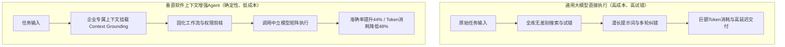
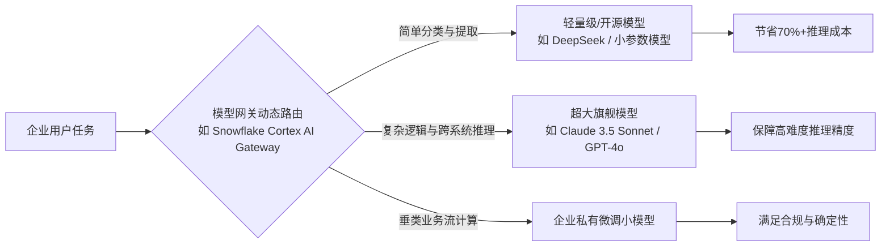
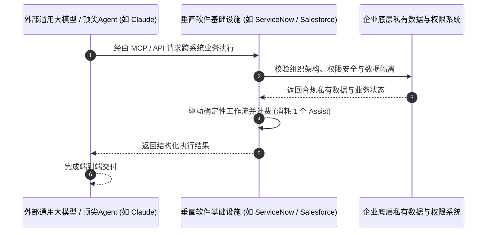

### 软件板块集体反转与财报季异动

在过去一段时间里，美股市场中最引人注目的板块轮动莫过于软件股的强势复苏。就在最近美股财报季接近尾声之际，表现最为亮眼的板块正是此前备受冷落的软件行业。代表整个软件板块的交易所交易基金 **IGV**（iShares Expanded Tech-Software Sector ETF）在短短一个月的时间内上涨了近百分之三十。其中，**Salesforce**、**Shopify**、**Atlassian**、**Snowflake** 等一众明星软件个股，在公布最新财报后动辄斩获百分之二十乃至三十的单日涨幅，其他表现不俗的中小市值软件股更是层出不穷。

回顾半年前的市场格局，彼时软件股还是整个美股市场上表现最糟糕的板块之一。由于 **AI Agent**（人工智能智能体：具备自主规划、工具调用与目标达成能力的自主AI系统）的异军突起，市场对传统软件正在被大模型与智能体颠覆的担忧甚嚣尘上，整个软件板块几乎遭遇了无差别的估值踩踏与抛售。市场普遍认为，大模型的快速进化将直接侵蚀传统软件公司的护城河，使得原有软件的座席（Seat-based）模式难以为继。

然而，本次财报季所披露的客观业务数据与财务表现，却打破了此前极度悲观的叙事预期。软件公司作为走在人工智能时代最前沿的群体，既是这波技术浪潮的积极拥抱者，又曾一度被视作颠覆浪潮的首要承受者。深入剖析本次财报季软件公司的经营转型，对于理解未来几年美股科技投资与人工智能落地的真实脉络具有决定性意义。经过对财报季中各家软件公司财报与管理层沟通纪要的全面梳理，不仅此前推演的多项行业趋势得到了真实商业数据的验证，同时许多全新的产业演进路径也随之浮出水面。

### 算力瓶颈约束与工作流定义的价值重估

理解本轮软件股重估的首要切入点，在于人工智能产业所面临的底层算力瓶颈以及 Token 成本的刚性约束。在整个人工智能基础设施向应用层推进的过程中，解决算力与成本瓶颈的关键往往不在于模型参数的单纯膨胀，而在于中间软件层的系统级优化。在当前技术环境下，软件公司的核心竞争壁垒并不单纯取决于最前沿的模型算法研发能力，而在于其长期积累的**定义业务需求与固化工作流的能力**。

当前 AI Agent 在实际执行企业复杂任务时之所以消耗极其庞大的 **Token**（大语言模型处理文本与上下文的最小计算计量单位），核心原因在于大量任务处于零上下文、零结构化流程的原始状态。智能体在没有预设行业规则与精准上下文的情况下，必须通过多次试错、反复检索以及冗长提示词的自我修正来逼近最终交付结果。这一漫长且发散的探索过程必然伴随着巨额的 Token 消耗与推理算力浪费。一旦某一特定业务场景的操作流程与上下文规范被软件固化下来，下一次重复执行相同任务时，系统便可通过精准检索与确定性逻辑剪枝，将 Token 消耗降低数倍乃至数十倍。



软件公司最擅长的核心本领，正是根据具体的企业应用场景去定义标准化工作流并构建业务闭环。从商业逻辑推导，这使得软件公司具备天然的杠杆优势，能够帮助终端客户实现算力使用效率的最大化，同时在客观上显著降低非专业技术人员应用 AI 技术的门槛。算力供给的相对紧缺与推理成本的高企是一个中长期持续存在的结构性现象，并不会因为单一半导体公司的芯片迭代或大语言模型的单点突破而迅速消失。当算力瓶颈与推理成本成为企业级 AI 普及的主要阻碍时，任何能够系统性降低 Token 成本、提升执行确定性的软件系统，都将创造巨大的商业价值。

### 上下文挂载与模型中立平台的效率壁垒

在本次财报季中，软件公司降低 Token 成本与提升落地效率的逻辑首次得到了财务与运营数据的双重确认。第一项显著的转变在于，大量软件公司不再仅仅满足于将自身接口封装为 **MCP**（Model Context Protocol: 模型上下文协议，用于将外部工具与数据源标准化连接至大模型的开放接口）供外部大模型调用，而是直接在自有的软件原生环境内构建并内嵌专属的 AI Agent。

这种内嵌智能体之所以能够大幅度降低推理成本，核心在于软件厂商掌握着极高密度的**业务上下文环境**（Context Grounding）。以专注于软件开发与协同管理工具的 **Atlassian** 为例，旗下拥有诸如 **Jira**（敏捷项目与问题跟踪管理系统）、**Confluence**（企业级协同知识库平台）以及 **Bitbucket**（代码托管与协作平台）等核心产品。如果一名软件工程师在通用的外部大模型界面（例如通用版 Claude）中提问“某个工程项目为何延期”，通用大模型由于缺乏对企业内部数据关系的先验知识，必须在庞杂的外部授权数据中进行大范围的暴力检索、关联分析与线索比对，消耗巨额 Token 且极易产生逻辑幻觉。

相反，如果用户直接在 Atlassian 原生内嵌的智能体中发起同一查询，由于该系统已完整记录团队所有的开发足迹、代码提交历史、任务依赖拓扑与人员协作关系，智能体能够精准定位核心阻塞点并直接给出结构化归因分析。Atlassian 管理层在本次财报电话会议中明确披露：当智能体利用公司内部的团队协作数据进行上下文挂载（Context Grounding）时，相较于缺乏专属上下文的通用 Agent，其回答准确率最高可提升百分之四十四，同时推理阶段的 Token 消耗最高可减少百分之四十八。这种在工程效能与成本控制上的双重突破，直接推动了 Atlassian 财报发布后单日股价暴涨百分之三十五。

这种依托私有上下文构建的成本与准确率壁垒，并非个别企业的专属特权。本次财报季中，包括客户关系管理软件 **HubSpot**、现代数据库平台 **MongoDB**、人力与财务管理平台 **Workday** 以及企业工作流平台 **ServiceNow** 在内的多家龙头企业，均展示了类似的上下文整合能力。

与之并行的另一大核心趋势，是软件厂商主导的**模型中立平台**（Model-Neutral Platform）架构。所谓模型中立平台，是指软件系统将自身解耦并构建为一个支持多模型调度的聚合中枢，允许系统或用户根据具体业务子任务的复杂度，在准确率、响应速度与推理成本之间进行动态权衡，自动分派最适合的模型执行计算。这一模式最早由微软在其 Copilot 体系中广泛推行，而在本季度已成为整个企业软件行业的标配架构。



例如，Workday 在本季度财报中披露，其最新推出的企业合同智能分析功能（Workday Contract Intelligence）已内嵌了由多个不同尺寸与特长模型组合而成的混合路由架构；数据云平台 Snowflake 也在本季度重磅推出了 **Cortex AI Gateway**，能够根据用户设定针对特定任务在延迟、成本与质量偏好之间实现自动化的模型智能调度。虽然通用大模型厂商自身也在推行不同尺寸的模型分级，但软件公司深耕垂直业务多年，对于数据分析、财税核算、人事流转等具体工作流的理解甚至超越终端用户自身。软件系统深谙在哪个环节调用轻量开源模型（如 DeepSeek 等低成本模型）即可满足需求，在哪个关键分支才需要调用顶尖大模型，从而在端到端交付中实现了远优于通用提示词工程的全局成本优化。

### 基础设施转型与非席位定价模式落地

在软件公司通过自建 Agent 与模型中立平台强化自身话语权的同时，本次财报季还展现出了一个看似截然相反但逻辑高度自洽的深层趋势：软件厂商正在主动将其核心能力下沉，转型为面向全行业 AI Agent 的**底层业务基础设施**。

在本季度的财报沟通中，各大软件巨头管理层的表态呈现出高度一致的战略转向。全球客户关系管理软件领军者 **Salesforce** 首席执行官明确指出，未来 Salesforce 将主动接入 Claude 与 ChatGPT 等主流大模型平台，软件不再强制要求占据用户的前端交互界面，用户完全可以在大模型的前端入口完成意图表达；电商基础设施巨头 **Shopify** 同样表态，无论未来的商业交易意图是由人类消费者还是由自主运行的 AI Agent 发起，Shopify 的战略核心是确保自身作为底层交易执行与履约系统的不可替代性；数据分析巨头 Snowflake 的管理层亦对外强调，公司的战略目标是成为全企业智能体的数据与逻辑控制中枢，负责在底层无缝连接数据资产、AI 模型与实际业务工作流。



这一集体“退居幕后”的策略不仅没有削弱软件公司的商业价值，反而成为其业绩与股价爆发的核心催化剂。Salesforce 在财报发布后股价出现罕见大涨，其核心推动力正是源于其与顶尖大模型研发机构 **Anthropic**（大语言模型 Claude 的开发公司）达成了底层业务流与数据的深度整合。

这一看似矛盾的现象背后，隐藏着软件商业模式从传统的“向人收费”向“向智能体收费”的根本性跃迁。以数字化工作流服务商 **ServiceNow** 为例，该公司通过底层架构升级，将其原本严格管控的私有数据架构、审批权限模型与工作流引擎全面向外部 AI Agent 开放。外部智能体若需要读取企业 IT 资产数据、发起系统变更申请或修改企业生产配置，均必须通过 ServiceNow 提供的标准接口进行安全鉴权与合规调用。

这一架构重组催生了全新的商业变现单元。ServiceNow 在其原有的软件坐席订阅之外，引入了名为 **Assist** 的非席位计量计费单元。外部或内部的 AI Agent 每成功调用并执行一次标准企业工作流，系统便会按任务复杂度计量并扣除相应数量的 Assist 额度。在维持原有员工坐席订阅收入保持稳定的基础上，ServiceNow 成功开辟了按 Agent 调用量计费的第二增长曲线。

在本季度的财务披露中，ServiceNow 管理层特别强调，公司已有高达百分之五十的净新增业务采用了非席位（Non-Seat-Based）的创新定价模式，其中来自 Assist 计费的贡献占据了核心权重。类似的商业模式升级在 Salesforce、Snowflake 与 Workday 的财务报表中也得到了高度一致的印证。软件公司牢牢掌控着企业数十年来沉淀的私有数据、组织架构权限、合规审计逻辑以及责任追溯链条，这些复杂的细分规则是通用大模型既无意愿也无能力进行端到端重构的。通过向模型开放接口并提供底层执行支撑，软件公司成功实现了用户粘性的深化与单客价值的二次扩张。

### 双向融合格局与软件板块的结构性分化

综合前述两大产业趋势，可以清晰地解构软件公司与通用大模型在当前技术周期中的真实共生关系。未来企业软件生态既非大模型彻底替代一切传统系统，亦非传统软件封闭自守对抗模型演进，而是一种深度的**双向价值嵌入与互补共存**。

| 核心维度 | 垂直软件原生 Agent 主导场景 | 通用大模型 / 跨系统 Agent 主导场景 |
| :--- | :--- | :--- |
| **主要定位** | 垂直业务深度执行中枢 | 跨系统统一意图入口与调度中枢 |
| **核心优势** | 掌握稠密垂直上下文、精细权限与业务逻辑 | 跨领域泛化推理、自然语言交互与复杂规划 |
| **成本特征** | 针对垂直任务优化，Token 消耗极低 | 跨系统调度消耗较大，适合高价值/低频决策 |
| **模型策略** | 采用模型中立平台，按需路由高低配模型 | 调用顶尖旗舰大模型，聚焦复杂多步推理 |
| **典型代表** | Atlassian (Jira), ServiceNow, Workday | Claude (Anthropic), ChatGPT (OpenAI) |

在这一双向融合的体系中，一方面，垂直软件公司在自身应用内部署高度优化的原生 Agent，专门负责处理垂直度高、上下文依赖极重且对 Token 成本极其敏感的高频业务；在此场景下，软件系统充当主导者，根据任务需要动态调用不同的底层模型。另一方面，通用顶尖大模型凭借其强大的自然语言理解与复杂推理能力，成为海量跨系统、跨部门大型长链条任务的统一发起入口；在此场景下，大模型作为顶层调度者，向下调用各大软件的基础设施 API 完成最终落地。

从资本市场的资产定价维度来看，大模型的长周期商品化（Commoditization）趋势正在显现，除少数拥有顶层生态与入口掌控力的寡头外，大部分纯模型层的定价权正在被激烈的开源与算力竞争所稀释。而拥有深厚业务壁垒的企业软件公司，则成功借由 AI 技术的赋能放大了自身的生产力杠杆。

然而，这并不意味着所有软件公司都能高枕无忧。当前软件板块正步入前所未有的**极端分化阶段**：
* **核心受益群体**：具备深厚工作流壁垒、掌握企业级任务核心入口、拥有不可替代的私有数据与权限管理体系的平台型企业（如 Microsoft、ServiceNow、Salesforce、Snowflake 等）。它们不仅能够自建高性价比 Agent，更能承接全网智能体基础设施的用量红利。
* **严重受损群体**：缺乏底层数据沉淀、业务链条过浅、仅仅依赖表层交互界面或单一功能工具的 C 端与弱 B 端软件。这类产品极易被大模型及其原生能力无情碾压，面临估值与用户流失的双重收缩。

### 投资逻辑复盘：以 Snowflake 穿越周期为例

为了将上述宏观与行业维度的逻辑推导转化为具体投资研究的实操框架，以数据分析基础设施龙头 **Snowflake** 的基本面演变与投资复盘作为典型案例具有极高的参考价值。作为此前遭受 AI 颠覆论冲击最为剧烈的代表性标的，Snowflake 的股价曾一度遭遇腰斩，但在随后的一个季度内，其股价自阶段性低点已实现了三倍的反弹幅度。

在市场悲观情绪达到顶点的时期，围绕 Snowflake 的主要看空论点集中于三点：其一，通用大模型具备强大的自动化代码生成与数据洞察能力，将彻底颠覆传统数据仓库与分析软件的护城河；其二，企业对于数据分析的总体 IT 预算是相对刚性的，由于 Snowflake 历史上绝大部分业绩增量依赖于既有客户的用量扩张，宏观预算紧缩将直接封死其增长上限；其三，来自同行业竞争对手 **Databricks**（专注于数据湖仓与机器学习平台的技术独角兽）等非上市巨头的激烈竞争。

```mermaid
graph TD
    subgraph 市场静态偏见 ["市场传统静态估值模型（悲观分析师视角）"]
        P1[静态传统软件] vs P2[未来超级AI]
        P1 --> F1[结论: 软件护城河彻底失效 / 必然被颠覆]
        P3[企业刚性财务预算] --> F2[结论: 数据分析属于成本中心 / 预算存在天花板]
    end

    subgraph 动态演进现实 ["动态工程演进与商业真实（企业决策者视角）"]
        R1[优秀技术团队 + 动态演进软件] vs R2[未来演进AI]
        R1 --> S1[事实: 软件主动融合AI成为中枢 / 颠覆风险大幅收敛]
        R3[探索性与增量价值创造] --> S2[事实: AI驱动全新洞察需求 / Token分析量呈指数级扩张]
    end
```

针对上述看空逻辑，从产业工程实践与企业真实决策机制出发，存在两个至关重要的认知预期差：

**第一，市场此前普遍采用“用现状软件对比未来 AI”的静态视角，严重高估了软件形态被颠覆的概率。** 
如果以固步自封的静态软件系统去硬抗高速演化的 AI 浪潮，任何传统工具确实都将面临灭顶之灾。但软件系统本身是由高水平工程人才驱动的动态演化组织。当优秀的管理团队与顶尖研发力量在第一线深刻洞察到 AI 浪潮的边界与机会时，软件产品形态本身会以极快的速度完成代际进化。

以未来的软件形态去对抗未来的 AI 演进，其真实被颠覆的风险远低于市场基于静态认知所设定的基准线。以 Snowflake 为例，其新任首席执行官 **Sridhar Ramaswamy** 拥有深厚的技术背景与 AI 初创项目实战经验，在其主导下，Snowflake 在极短时间内密集推出了针对大模型优化的全套基础设施（包括 Cortex 平台、向量搜索支持与模型网关路由），迅速将自身从一个单纯的数据存储与查询引擎，重塑为支撑企业部署私有化智能体的数据与模型控制中枢。

**第二，传统财务分析师的纯财务视角存在认知局限，显著低估了 AI 驱动下企业数据分析需求的无限延展性。**
证券分析师习惯于从历史财务报表上的收入、利润与短期预算约束出发，推导企业是否愿意为新的技术方案买单。然而在真实的企业经营中，高级决策者采购新型数字化工具的核心驱动力，从来不仅限于短期内是否能精准量化成本节约，而在于该工具能否解锁此前“想做却受限于技术无法实现”的全新商业探索空间。

企业数据分析的需求本质上是不存在天然物理边界的。在传统商业智能（BI）时代，受制于算力成本与建模复杂度，企业仅能对核心财务与业务指标进行离线、抽样分析；而在生成式 AI 与大模型推理时代，AI 系统能够自动化从原本未结构化的海量日志、客服录音、合规文档与交互轨迹中挖掘出前所未有的经营洞察。只要数据分析系统能够持续为企业提供高质量的决策依据与战略边界探索，企业对于此类计算的投入就不会被传统的成本预算所锁定。这也正是当前企业在 AI 数据分析场景中，Token 消耗量与计算调用频次呈现出指数级爆发式增长的底层驱动力。

通过对 Snowflake 投资案例的深度解构，可以提炼出适用于整个美股软件板块的核心研判法则：市场对于通用大模型造成的颠覆性威胁往往存在情绪化的高估，而对于深耕垂直产业、积极演进迭代的优质软件公司在 AI 赋能下所撬动的全新市场增量，则长期存在系统性的低估。在这一波由算力瓶颈约束与工作流重组驱动的软件价值重估周期中，真正掌握企业数据与流程底座的核心资产，正在迎来中长期的戴维斯双击（Davis Double Play: 业绩与估值倍数的同步提升）。