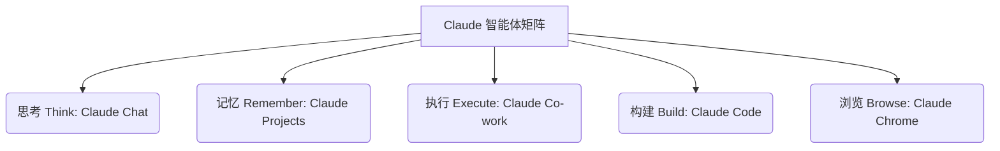
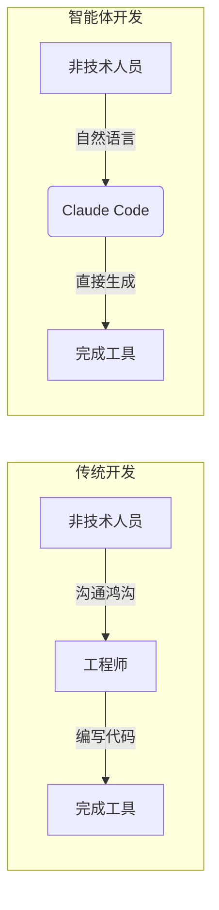

### 重构人机协同：超越99%的普通用户真正驾驭 Claude

将 **Claude** 交给两个人。一个人会用它来写一封稍微好一点的电子邮件；而另一个人则会用它来协助建立一家价值数亿美元的公司。同样的工具，在不同的使用者手中，会产生截然不同的结果。在未来的十年里，这种“使用 AI”与“驾驭 AI”之间的鸿沟，将会彻底重塑个人职业生涯、企业竞争格局、家庭生活乃至生命的轨迹。

AI 的真正威力不在于简单地替代劳动力，而在于与人类智慧产生深度共振。为了帮助用户跨越这一鸿沟，我们需要将 Claude 视为一个高度协同的智能体团队，而不是一个单一的聊天框。这个团队在不同工作场景下分工明确，共同构成了现代知识工作者的新型生产力基础。

<details>
<summary>Original English</summary>

Give Claude to two people. One will use it to build a better email. The other will use it to help build a hundred million dollar company. Same tool, different users. And that gap between people who use AI and people who wield it is about to reshape careers and companies and families and lives over the next decade. If you're new here, I've been a CEO, board member, investor in technology companies worth billions. And today I want to share with you how to use Claude better than 99% of people, from beginner to advanced. And it's way easier than you think. Claude is not just one app, it's a whole stack of tools built for a very different kind of work environment.

</details>

---

### 五维智能体矩阵：重构知识工作流

为了系统化地应用 Claude，我们可以将日常的智力活动抽象为五种核心行为：**思考**（Think）、**记忆**（Remember）、**执行**（Execute）、**构建**（Build）以及**浏览**（Browse）。



每个维度都对应着 Claude 工具栈中的特定组件，它们互为补充，共同支撑起复杂任务的闭环：

*   **思考（Think）—— Claude Chat**：这是最基础也是最直观的交互界面。用户通过输入 prompt 获得回复，适合用来梳理混乱的问题、打磨粗糙的想法或撰写草稿。
*   **记忆（Remember）—— Claude Projects**：通过创建项目，用户可以上传简历、行业报告、写作样本和设定特定语气。Claude 将以此作为上下文背景，让每一次新对话都不必从零开始，建立起长期而稳定的协作关系。
*   **执行（Execute）—— Claude Co-work**：作为桌面端应用程序，它能够直接读取本地文件、处理多步骤复杂任务，并将生成的结果直接写入本地目录，极大地缩短了云端与本地文件系统之间的物理距离。
*   **构建（Build）—— Claude Code**：打破“编程只属于软件工程师”的传统偏见。任何能够使用自然语言清晰描述逻辑的人，都可以利用它构建交互式仪表盘或特定的效率工具。
*   **浏览（Browse）—— Claude Chrome**：通过浏览器插件，让 Claude 实时融入用户的在线工作流中，无论是处理在线文档、填写表单还是分析实时网页内容。

在理解这一矩阵后，我们需要逐一攻克每个维度的应用痛点，首先是打破最基础的“思考”层面的思维局限。

<details>
<summary>Original English</summary>

For businesses, there's chat for thinking, Claude co-work to get work done, Claude code to build things, Claude Chrome to browse with a brain, Claude skills to make it all repeatable, and lots of tools. Once you understand how this team of agents work together, your output can change dramatically. The best way to visualize it is this: five activities, think, remember, execute, build, and browse. Let's go through each one of them. First is think. You go to Claude chat. And this is what most of us do when we think about chatbots. We input a prompt, we get a response. You bring a messy problem, a fuzzy idea, or a rough draft and work through it.

</details>

---

### 从命令到共创：重塑 Claude Chat 的思考深度

大多数人在使用 **Claude Chat** 时，习惯于简单粗暴地套用指令。例如直接输入“帮我写一篇关于领导力的社交媒体帖子”。这样得到的往往是一段看似流畅却毫无灵魂的陈词滥调。

真正的高效能用户会把 Claude 当作智力共创的伙伴。你可以采用**目标前置**（Aim before actor）的策略，将 prompt 重构为一种深度博弈：

> “你现在是一位商业分析专家。我正在写一篇文章，试图解释为什么有些领导者极具说服力，而另一些人却显得虚伪。我附上了我的粗糙想法大纲。你的任务是挑战我观点中的薄弱环节，指出逻辑漏洞，并帮我寻找支撑这一论点的权威研究数据。在我们完善了这一核心洞察之后，我们再来撰写最终的文案。”

当遭遇生成质量不佳的“机器摩擦”时，有三项关键的**赋能策略**（Power Moves）可以帮助你扭转局势：
1.  **接入丰富的上下文背景**：将 Claude 与你的文档管理系统、邮件或日历进行联动，直接挂载参考文件以提供信息源。
2.  **以研究为基准进行双重验证**：充分释放 Claude 检索外部信息的能力，但在获取结果后，务必增加一步追问：“这一结论的来源是否经过严谨的交叉验证？”
3.  **在实践中构建认知循环**：遇到未知的技术或财务概念（如 IRR 或自由现金流）时，不要停止当前主线，而是开启一个新的辅助会话窗口进行同步解惑，实现“在飞行的过程中组装飞机”。

<details>
<summary>Original English</summary>

But many of us just use AI to do all the work so they can copy and paste. We have all seen those LinkedIn posts. So, if you go to Claude chat and type write me a LinkedIn post about leadership, you'll get a very polished paragraph that says nothing. And we've talked about how to prompt better with things like aim before actor input mission. Try this prompt instead. You are a business school professor. I am trying to explain why some leaders sound credible and others don't. I'm attaching my notion page with a rough idea that talks about leadership and authenticity, leadership and humility. Your job is to push back on what's weak and sharpen what's real. Find me research that helps me create a strong insight and then we can write a LinkedIn post. You make Claude your thinking partner now. Of course, like all AI, it will not do what you tell it to do, not the first time around at least. And sometimes it's going to be super frustrating because you will give this detailed prompt and just crap will come back. So, there are three things that you can do that can become your power moves when that happens. First, give it rich context as much as you can. Connect the chatbot to your Google Drive, your email, your calendar, your notion app, anything else you can. That way you can attach files to that chat session. It will read it, it'll get context from it. Second, ground your insights with research. You can ask Claude to go out on the web and do deep research. It has already learned the entire internet during its training, so why not use it? But when you get the research back, always ask one more time, is this verified? And third, use AI to build your AI skill in real time. If you are patient and curious, you can literally build your engine while you're flying the plane. For instance, let's say you have no background in corporate finance and you're building a financial model. You get stuck on how to use a specific spreadsheet feature or even a financial concept like IRR or free cash flow. No problem. Just start another chat in another tab and ask away. So, you can learn and do. Do and learn. The cycle just continues.

</details>

---

### 项目级记忆：打造个性化专属智能体

在解决单次对话的思考深度后，我们必须面对更复杂的跨会话协作。传统的 AI 助手往往在每次开启新对话时就遗忘了过去的全部交互，这在处理长期任务时是低效的。

**Claude Projects** 正是为了解决“长效记忆”这一痛点而设计的核心组件。它避免了在全局账户层面进行千篇一律的自定义设置，转而在独立的“项目”维度进行精细的场景定制。以职业转型场景为例，你可以通过以下结构将 Claude 塑造成一位顶尖的职业顾问：

```
[知识库文件]
├── 个人完整简历 (Resume.pdf)
├── 领英个人主页配置 (LinkedIn_Profile.md)
├── 目标岗位描述 (Job_Descriptions.md)
└── 个人代表作及历史写作样本 (Writing_Samples.md)

[项目自定义指令 (System Instructions)]
“你是一位极其犀利的资深猎头与简历撰写专家。我的目标是向 [特定行业] 转型。
你的任务是评估我提供的素材，诚实地指出我经历中的薄弱环节，并以直接、自信且摒弃一切商业套话的语气，帮我量身定制求职信与简历要点。
当我要求你分析岗位时，请精准提炼其关键词，同时绝不能失去我本人的独特表达风格。”
```

通过这种方式，Claude 从一个一次性的聊天工具，正式升格为与你拥有共同上下文的长期合作伙伴。无论是规划度假还是规划退休方案，你都可以通过建立不同的 Project，为 AI 提供最纯净、最精准的上下文沙箱。

<details>
<summary>Original English</summary>

Now, let's go meet our second member of your team. This one helps you remember and it's called Claude Projects. We all know when we're creating something new or solving a complicated problem, the work doesn't end in one session or even in one chat. And that's why all three AI platforms nowadays have gotten better at maintaining memory across different chat sessions. Claude remembers a world through projects. A project is where you give the chatbot your files, your instructions, your tone, your ongoing work. You're not starting from zero every time you open it. And of course, I would be careful about sharing confidential documents from your office, but let's say you're actively or passively looking for a career change or a new job opportunity. You can create a project. You drop in your resume, your LinkedIn profile, the two or three job descriptions that you like or the company you're targeting, your writing samples, your professional bio, the other resumes that you like, anything you can think of. And you can customize this project with exactly what you need. So, you can add something like, "You're the world's most badass recruiter and resume writer who has placed candidates in top companies in my industry. I am a brand marketer with 5 years of experience at a large agency called WPP. Your job is to help me create a great story for my next adventure, for my next company, and make me desirable for the next role. I write in a direct, confident tone. I don't like corporate fillers. I hate buzzwords. When I ask you to tailor something, match the job description's language without losing my voice. When I ask you to do deep research, make sure you deliver only the relevant and verified data. Don't make it up. And when I ask you for feedback, be honest. Tell me what's weak and what I need to work on. Be my constructive partner and strengthen those areas." This is one way to provide instructions, but you can see that there are 100 ways to do it. And that's the kind of instruction that makes any project your own. Not a prompt that you're copying from some YouTuber, but a brief that you write for someone you actually know very well, yourself. From that point on, every time you come back, Claude already knows what you want and who you are. You can ask it to tailor a cover letter, craft a specific bullet of your resume for a specific role. A project turns Claude from a one-off conversation into an ongoing relationship between you and your AI. This is also why I don't customize Claude at the account level. I like customizing it at the project level, because that way I can give it specific context. Because using AI to plan your vacation is very different from using it to plan your retirement.

</details>

---

### 本地化执行：利用 MCP 协议打通工具生态

如果说 Chat 是想法诞生的地方，那么 **Claude Co-work** 就是将想法落地的执行平台。作为一款桌面客户端，它的核心价值在于直接与用户的本地文件系统进行交互。

更重要的是，Claude 支持 **模型上下文协议**（Model Context Protocol: 一种允许大语言模型安全、标准化地连接外部数据源和工具的开放协议）。这相当于给了 Claude 一把钥匙，去解锁并直接调用其他专业 AI 工具的超强能力。

例如，当你在本地目录中存放了大量的用户访谈录音、产品会议纪要和财务报表时，你可以直接对桌面端下达命令：“分析该文件夹下所有访谈记录，找出客户流失的前三个核心原因，并基于此生成一份可直接用于明早汇报的精美幻灯片大纲，保存在当前目录下。”

同时，你可以将 Claude 连接到外部的创意影像生成工具（例如 **Hicksfield**）。只需在连接器设置中配置好接口，Claude 就可以作为总协调器，自己编写提示词并调度 Hicksfield 渲染产品宣传图或发布会短视频，最终将所有生成的创意资产自动下载至你的本地指定目录。

> [!CAUTION]
> 在享受本地执行便利的同时，务必遵循 **沙箱化**（Sandboxing: 将敏感操作限制在隔离的目录中以保障系统安全）的原则。建议单独创建一个子文件夹，仅授权 Claude 访问该特定路径，确保你硬盘中的其他隐私数据绝对安全。

<details>
<summary>Original English</summary>

Now, let's go to execute. And for that, we have our third team member, Claude co-work. Chat is where the work begins. Co-work is where it gets done. You start in a prompt window, but finish it on your desktop. Co-work is a desktop application for Mac or Windows. Unfortunately, it's available only on Claude's paid plans right now, but with Claude Work, instead of asking a question, you give it a task. When do you use Claude Work versus chat? Well, you use Claude Work when you have a lot of assets already on your computer's hard drive, when the task needs multiple steps, and when you need that output to be on your local drive as a local file. So, for example, you can tell Claude Work to do the following. Take all of these customer interview transcripts from this folder, these spreadsheets of accounts, and notes from last week's product meeting, find top three reasons on why the customers are churning. Why are they leaving? Provide all the supporting data, create a very clean slide deck that I can use tomorrow. Put the slide deck in this folder. And here's what makes Claude Work even more interesting. It can reach out to other AI tools through a connector called MCP, the Model Context Protocol. Think of MCP as giving Claude a set of keys to other AI tools. It can knock on their door, unlock the capabilities of those tools, act with them, act through them to give you results. Let me show you what that means in a real example. Imagine you run a business selling handcrafted candles. You have a small business. You have a terrific product, but you're bootstrapping your business, right? And you don't have a huge marketing budget. In the old world, that would mean that you couldn't create any ads that looked super polished or professional. But now, look at what you can do when you can plug Claude into a creative AI tool called Hicksfield. They are the sponsor for this video. Now, Hicksfield is used by 18 million backed by tier one VCs like Excel and Menlo Ventures, and they've already crossed the billion-dollar valuation. And they were the first creative platform to ship an official MCP connector for Claude. Here's how you connect it. You have to do it once, and that's it. Go to settings, connectors, plus button, paste the Hexfield URL, and you're done. That's it. Now you can go into Co-work, and you tell it to do whatever you need to sell more products. For instance, you could say, "Generate 20 beautiful ad creatives for my new lavender candle line. Three ideas for Instagram, three editorial close-ups for the website, and a vertical video for the launch. Write a tagline for each." And that's it. It just runs. Claude Co-work writes the prompt and passes it on to Hicksfield. Hicksfield generates the images and the video, and the entire set of files land in your local folder without you needing to hire a creative agency and pay them thousands of dollars. That would have taken you 3 weeks of a professional shoot, a photographer, a stylist, and weeks of post-production, and of course thousands of dollars. But now, you can do it in a single session with Claude and Hexfield. This is how AI is leveling the playing field. A solo founder with the right set of tools today can now produce the kind of creative output that used to require a large team and a large budget. There's a link in the description below. They have a free tier. Take it for a spin. Try it. And you could build something very cool and interesting this weekend. Two things to keep in mind. First, the output will be a starting point. You'll still have to go through each and every slide and make sure it's good. But a lot of heavy lifting is done by Claude co-worker already. Second, give explicit permission for Claude co-work to access only specific directory and specific files. Claude is very conscious about security, but please be very mindful about what you give access to. And I usually create a subfolder and move all the files and data into that folder, and that's all Claude has access to. It's called sandboxing, so the rest of your hard drive remains secure. Claude can't get to it.

</details>

---

### 降维构建与实时解构：人人都是创造者

在思考、记忆和执行之上，Claude 的最后两项能力 —— **构建**（Build）与 **浏览**（Browse）进一步下放了技术特权。



使用 **Claude Code**，你不必具备深厚的计算机科学背景。如果你能用清晰的英文或中文来描述逻辑，你就直接具备了构建应用的能力。例如，你可以直接下达指令：

> “我需要一个业务跟进仪表盘。当我把销售漏斗表格和会议纪要拖进去时，它能立即帮我用可视化红绿灯标记出哪些项目面临流失风险，并给出下一步跟进的行动建议。”

而 **Claude Chrome** 插件则打破了网页静态阅读的局限。它伴随在你的浏览器侧边，当你面对一份长达几十页的行业分析报告，或者身处复杂的求职网站时，它能化身为你的“外挂大脑”，实时提取最具商业价值的洞察，或者根据当前页面信息即时撰写个性化的求职信。

这五大工具的咬合，彻底将 AI 从一个“被动的问答机器”转变为“主动的协同终端”。然而，要真正发挥这套系统的全部潜力，使用者必须掌握一套科学的驾驭框架。

<details>
<summary>Original English</summary>

Fourth is build, and this is where Claude code comes into play. This is the part that makes a lot of us nervous. It made me nervous. The moment we hear code, we're like, "Ah, I don't know." We assume that all that stuff is only for engineers, but that assumption is one of the biggest missed opportunities in AI right now. If you can type in English, you don't need a computer science background to code and build something cool and useful. Let's say you have a consulting business or a side hustle. Simple example, just go to Claude code and prompt, "I want a dashboard where I can drop in my sales pipeline and meeting notes and instantly see which deals are at risk, what's stuck, and what my next move should be." That's all you need. You don't need to think like an engineer to start using Claude code. You just need to be clear about the problem you want to solve and the thing you want to build. And of course, you have to have the right data so that dashboard you build is useful. And finally, the fifth team member is for browsing the internet. And for that, you can use Claude Chrome. And you're going to go, "Wait, what? Don't worry. Claude has this little extension that you can install in your Chrome browser. Google already has something like ask Gemini button baked into the browser now, but now you can let Claude see what you're looking at as well. Help you process it and act inside your workflow in real time. And I think about this a lot nowadays, because most of my work happens inside the browser, right? My files are on Google Drive or a Microsoft OneDrive, my emails, my scheduling, my team meetings, my research, filling out forms, making purchases, planning business trips, all of it is taking place using the browser. And now Claude is right there with you for all of it. You're on a job listing site, Claude can read it and help you tailor your outreach. You're reading a 40-page industry report, Claude can pull the three insights that matter the most in real time. So, that is your team. There are other team members, but these five are the most interesting and useful. This is your stack.

</details>

---

### PRIME 黄金法则：系统化驾驭 AI

即便手握最强大的工具栈，最终产出的质量依然取决于人类如何对 AI 进行“对齐与赋能”。为了确保每次生成的成果都达到专家级水准，你可以套用 **PRIME** 提示词架构：

| 维度 | 定义 (Definition) | 深度实践指南 (Actionable Guide) |
| :--- | :--- | :--- |
| **P**urpose (目的) | **明确目标** | 告诉 AI 它的最终交付物是什么，它的受众是谁，要达成什么商业或沟通目的。 |
| **R**esearch (研究) | **背景输入** | 提供尽可能详尽的事实数据、限制条件、参考资料，杜绝 AI 凭空捏造。 |
| **I**nterview (访谈) | **反向提问** | 显式要求 AI：“在回答之前，请先向我提出 3-5 个你认为最关键的问题来明确我的真实意图。” |
| **M**echanics (机制) | **输出格式** | 严格限制输出的字数、格式（如表格、Markdown 段落）、逻辑结构以及语气。 |
| **E**xamples (示例) | **样本对齐** | 给 AI 提供 1-2 个你认为完美的历史产出作为范例（Few-shot prompting）。 |

以准备一场至关重要的跨部门高管会议为例，你可以这样运用 PRIME 法则：

*   **Purpose**: 争取下季度 20% 的研发预算追加，受众是 CFO。
*   **Research**: 挂载当前的财务报表和竞品分析报告。
*   **Interview**: 强制要求 Claude 模拟 CFO 的视角对你进行 3 轮压力提问，拷问你的数据漏洞。
*   **Mechanics**: 最终输出一份 10 页 PPT 的逐字讲稿，语气要理性、数据导向，避免煽情。
*   **Examples**: 提供上一次成功申请到资金的项目汇报文案作为参考。

通过将 PRIME 融入你的工作流，AI 就不再只是一个敷衍了事的文字生成器，而是成为极具针对性的战略幕僚。

<details>
<summary>Original English</summary>

But even with the full team working with you, one gap can make all the difference between the average and the elite mode. That's where we go next. Any AI's results depend on you. Even with the full team of agents working for you, Claude is only as good as the input you give it. But the superusers who get exceptional output from Claude, they direct Claude the way they would direct a smart person they've just hired. And the easiest way to do that is a framework I call Prime. P is purpose. When you prompt Claude, give it a precise goal. Tell it what you need it to do, like help me turn this messy proposal into a five-part organized document that looks like a sharp client memo. R is research. We talked about it before. In many cases, you may need external research to ground the response. Ask it to go out and fetch it for you. Ask it to verify it. And sometimes the raw material may come from you, your notes, transcripts, files, examples, background, constraints, anything that Claude needs so that it can stop hallucinating or guessing. I is for interview. This is the hidden gem. I really like how Claude does it. In a lot of cases, you'll see that it will start asking you multiple-choice questions. And you pick the right choice, and based on what you clicked, it refines its approach to a specific way of responding to you. M is for mechanics. Here, you tell Claude how the output should look like. Do you want bullets or a paragraph? Do you want a document or a table? Do you want it concise or you want detail? Strategic or conversational? Anything you choose. And finally, E is for examples. Show Claude what good looks like, a format you liked or a tone reference or an outline that worked before. Examples are one of the fastest ways to quality. Let's go through an example. You have an important presentation coming up tomorrow. Run it through prime. Purpose. What is this meeting really for? Do you need an approval, alignment? Are you asking for resources? What is the outcome you really want? Research. Give Claude the context. What's the audience like, the risks, the data, what your team cares about, external resources, internal docs, anything you can get. Interview. So, tell Claude, "Interview me before you respond." Now, it will ask you questions that sharpen its own scope and your thinking mechanics. Now you know the output of that deliverable. You want a 10 slide deck and talking points. And finally, examples. Give it a past deck that you liked or style you admire. So that is prime. Once you start doing that, AI stops being a tool and starts becoming your edge. And by the way, if you want the frameworks like these in your inbox, subscribe to my newsletter. The link is below somewhere. I mean it's free.

</details>

---

### 回归好奇心：在 AI 时代保持人类的主体性

工具和框架都是外在的，技术平权带来的终极审判，是对人类自身“主动性”的终极考验。

在过去，建立一个复杂的商业模型、设计一套精美的视觉系统或开发一个应用，需要多年专业技能的沉淀（MBA、设计学位或计算机背景）。而今天，你只需要每月支付 20 美元，就能雇佣一个在逻辑推理、数据整合上不亚于大部分博士和商学院毕业生的 AI 协作系统。

此时，决定你终局的不再是你的技术短板或资源多寡，而是：
*   你是否拥有探索未知事物、不断追问本质的**好奇心**？
*   你是否拥有穿越技术磨合期、不断调试系统的**坚韧与耐心**？
*   还是你会在极致的便利中缴械投降，用 AI 的平庸输出逐步替代自己深度的思考，最终丧失对世界发问的本能？

AI 能够赋予你极高的效率起点，但无法赋予你开启一段探索的内在动机。正如那句古老的话所说：“你就是你一直在等待的那个人。”

<details>
<summary>Original English</summary>

The real edge is the human using it. Everyone watching this feels like someone else is getting ahead faster. That they are smarter or they are richer or they have better resources. I know I feel like that sometimes. That is the default condition of ambition. The question is not whether you were outgunned. The question is how you outshine when you are. You have been carrying labels for years. I am not technical. I'm not a designer. I don't have an MBA. But those are just labels. For $20 a month, you can hire something that is already better than most MBAs and PhDs now. You can think more sharply with it. You can design better. You can code. You can build. But do you have the curiosity to keep learning? The tenacity to get through that machine friction. The patience to build real capabilities. Or will you slowly replace real effort with convenience and lose your instinct to wonder? AI will give you a lot of things. But what AI can't give you is that innate curiosity that made you press play on this video. And you already have it. As one of my mentors used to say, "You are the one you've been waiting for." Thank you. And I love you.

</details>