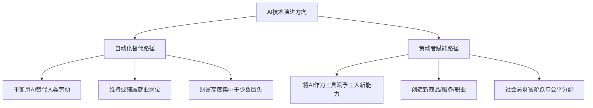

### 策略性临在：重构权力平衡

在过去两年中，整个科技行业与风险投资领域都在不遗余力地为公众描绘一幅极其绚烂且近乎乌托邦式的未来图景。在这幅宏大叙事的画卷里，**人工智能**（Artificial Intelligence: 模拟人类智能的计算机系统）被塑造成无所不能的终极引擎，宣称每年能够为全球带来超过10%的国内生产总值（Gross Domestic Product: 衡量国家经济活动总量的核心指标）增长。在狂热的舆论浪潮中，一场史无前例的生产力革命似乎触手可及，每周工作三天不再是遥不可及的梦想，人类仿佛即将从繁重的体力与脑力劳动中获得彻底的、终极的解放。然而，就在无数人为了这些充满了科技乐观主义色彩的宏大愿景而热血沸腾、慷慨解囊的时候，2024年诺贝尔经济学奖得主、麻省理工学院（MIT）教授**达龙·阿西莫格鲁**（Daron Acemoglu）却在两年前便以极其冷静甚至近乎冷酷的学术论文，为这种狂热注入了一剂强效退烧针。

阿西莫格鲁在其两年前发表的严谨经济学论文中指出，在未来的十年内，人工智能对宏观经济的实际贡献远没有想象中那么庞大，大约只能带来1%到1.5%的累积GDP增长。这个数字不仅让当时正处于极度亢奋状态的科技界感到错愕，也奠定了阿西莫格鲁作为AI发展冷思考代表人物的地位。近期，这位学术泰斗接受了一次长达57分钟的深度访谈，针对自己两年前所作出的预测进行了客观且全面的回望，并直言不讳地解剖了当前整个AI行业在商业化、技术瓶颈以及社会影响等维度的真实处境。他用深邃的经济学视角，带领我们剥离技术营销的层层包装，去审视那条隐藏在代码与芯片背后的真实经济规律。

在回顾技术发展的实际进程时，阿西莫格鲁坦言，有些领域的进展确实比他预想的要快，而有些领域则基本符合他当年的经济学预测。他指出，过去两年来最大的意外，莫过于**智能体**（Agentic AI: 具备自主规划、工具调用与执行任务能力的智能系统）技术的发展速度。阿西莫格鲁回忆道，当他在2023年撰写那篇引发广泛讨论的论文时，根据当时的数据和技术路径，他完全没有预料到智能体架构会如此迅速地走入现实。在2025年之前，整个AI应用层的发展相对平缓，但随后，**Claude**这一模型的推出成为了一次真正的分水岭，加速了这一进程。他强调，智能体技术的演进并不是一条平滑的、线性的上升曲线，而是呈现出一种突发性、跳跃式的状态。这种跳跃式的进步虽然给市场带来了极大的震撼，但也极易让人产生一种“技术将持续以指数级速度无限扩张”的认知偏差。

针对这种普遍存在的认知偏差，阿西莫格鲁在访谈中特别强调了一个极其关键的逻辑区别，即AI技术的技术进步本身，并不像许多业内专家和媒体渲染的那样遵循平滑的指数级增长定律。如果我们盲目地相信所谓的“超级指数增长”，就会在潜意识中产生一种技术可以被精确预测、并能够稳步向前推进的幻觉。阿西莫格鲁倾向于将AI的发展模式理解为一种零星的、间歇性的爆发。正如我们在实际中所观察到的那样，在2023年、2024年乃至2025年的大部分时间里，基础模型在底层架构上并没有发生颠覆性的质变，但随后却在智能体模型这一特定方向上迎来了瞬间的大爆发。在这场爆发之后，技术发展在接下来的一段时间内可能会陷入一段平台期甚至停滞期，而通往下一个真正突破的窗口，可能需要一年、两年、三年，甚至十年、二十年才会再度开启。

### 技术幻觉与真实瓶颈的交织

当讨论被引向“当前的智能体是否已经达到了通用人工智能的门槛”这一核心命题时，阿西莫格鲁给出了极其明确且毫无妥协余地的否定回答。他非常肯定地指出，无论是从技术原理还是从应用表现来看，我们都绝对还没有到达**通用人工智能**（General Artificial Intelligence: 能够像人类一样理解、学习和执行任何智力任务的AI系统）的阶段。其背后的核心逻辑在于，当前基于深度学习与大语言模型的技术路径在根本上缺乏人类的核心特质：它们没有真正的判断力，缺乏进行深层社交互动的共情与博弈能力，无法真正理解错综复杂的社会上下文关系，更致命的是，它们完全不具备物理行动能力，无法直接作用于复杂的实体物理世界。

不仅如此，阿西莫格鲁从宏观经济学的角度提出了一个更深层次的观点：即使在未来的某一天，技术层面的通用人工智能真的得以实现，这也不意味着人类社会会立刻迎来翻天覆地的经济影响。因为在任何技术转化为生产力的路径中，人类自身以及既有的社会组织架构体系，才是那个最难以逾越的瓶颈。在访谈中，阿西莫格鲁用一个高度凝练的定义对所谓的通用人工智能进行了框定——它指的是AI模型能够在几乎所有的人类工作任务上，都能无缝地达到该领域顶级人类专家的专业水平。如果以此为尺规来衡量当前的大语言模型，显而易见，它们距离这个标准还有着难以估量的物理与逻辑鸿沟。

在梳理完技术层面的虚实之后，阿西莫格鲁将话题引入了本次对话中最为核心的章节：对**生产力悖论**（Productivity Paradox: 尽管在信息技术上投入巨大，但宏观经济数据中的生产力增长却长期停滞的现象）的深度剖析。在日常生活中，许多知识工作者或企业管理人员都会产生一种直观的、微观的感受，认为自己因为引入了各类AI工具，日常的个人工作效率瞬间提升了三到四倍。对于这种广泛存在的微观体验，阿西莫格鲁在予以承认的同时，也毫不留情地泼了一盆冰冷的凉水。他指出，虽然确实有一些先行企业通过深度定制AI流程实现了局部的显著提效，但在宏观的经济统计视域中，这些案例仅仅是孤立的特例，绝大多数企业在引入AI系统后，其实并没有在财务报表上获得令人惊艳的投资回报率。

这种微观的高效感受与宏观生产力数据停滞之间的巨大落差，恰恰暴露了个人工作习惯与宏观经济运行之间被大众所忽视的鸿沟。在个人层面上，利用AI工具在撰写邮件、起草大纲或编写简单代码时省下一两个小时，与整个社会宏观经济总量的阶跃，完全是两个量级且性质迥异的概念。阿西莫格鲁以自身的日常学术工作为例进行了生动的说明。他表示，自己同样会使用AI来辅助进行一些前期的背景研究、搜集文献综述，甚至让AI扮演一位苛刻的审稿人来对自己的初稿提出尖锐的批评。这些工作虽然有了AI的辅助，但本质上都是他过去同样会去完成的事务，只不过过去的速度稍微慢一些。AI的加入，或许只是让他少看了一场世界杯足球比赛，腾出了一些空余时间，但对于他全年的学术总产出而言，并没有带来实质性、颠覆性的改变。

这一例证引发了我们对于社会总产出的深度思考。当普通白领、程序员或设计师通过AI省去了繁琐的事务性工作后，这些被节约出来的闲暇时间，究竟是转化成了更高维度、更具创造力且能创造全新社会价值的产出，还是仅仅被消耗在了更频繁的内部会议、更冗余的文件汇报中，甚至只是以一种无意义的摩擦形式被彻底浪费掉了？如果这些富余的生产力无法转化为新的、有效的市场供给与需求，那么这种局部的效率提升在宏观经济的大账本上就只能记为零。

### 算力贬值与商业模式困局

从经济学原理出发，阿西莫格鲁将这种“效率转化为产出”的困境归结为两条在底层逻辑上完全相悖的生产力提升路径：

* 第一条路径是**自动化替代**。在这种模式下，社会的总产出（GDP）并没有发生实质性的扩张，但因为引入了自动化技术，企业所需的就业人口和人工成本大幅缩减。虽然企业主在短期内获得了更高的利润率，但从整个宏观社会的视角来看，财富并没有实现总量上的增长，反而因为就业岗位的流失削弱了整体的消费基石，使得社会无法真正走向富裕。
* 第二条路径是**劳动者赋能**。在这种模式下，技术不仅没有将工人排挤出生产流程，反而通过赋予他们全新的知识维度与操作工具，使其能够发挥出前所未有的创造力。这种赋能催生了全新的商品品类、全新的服务业态以及更高效的组织协同形式，最终推动社会总GDP的实质性跃升，让社会各个阶层能够共同分享财富增长的红利。

遗憾的是，审视当前整个AI产业的投资方向与技术演进逻辑，几乎所有的巨头都在不约而同地偏向第一种——即以消灭人工成本为导向的自动化替代路径。阿西莫格鲁对此做出了直截了当的评判，他指出，这正是为什么像**Anthropic**的达里奥·阿莫代伊等行业领袖会频繁在公开场合宣称“AI将在极短的时间内摧毁入门级就业市场”。当这些科技巨头卸下公关辞令、进行坦率的行业交流时，他们非常清楚自己正在倾尽全力研发的，本质上就是一项旨在进行大规模人工替代的自动化技术。

这种以替代为导向的发展趋势，自然将全社会的焦虑引向了最为切身痛处的就业冲击议题。行业内曾有一个流传甚广的悲观预测，认为在五年之内，市场上高达50%的初级白领和程序员岗位将会彻底消失。而在现实的宏观招聘市场中，这一冰冷趋势的端倪似乎正在显现。根据英国知名招聘平台Adzuna披露的数据，自ChatGPT正式向公众发布以来，初级岗位的招聘广告发布量在两年内已经累计下滑了37%。这一数据似乎正在向外界宣告，关于技术失业的阵痛并不是发生在虚无飘渺的未来，而是以一种悄无声息但破坏力极强的方式在当下真实上演。

然而，作为一名长期与数据打交道的经济学家，阿西莫格鲁在此处表现出了高度的学术严谨性与审慎态度。他指出，在这套看似清晰的下滑趋势中，实际上充斥着极强的不确定性与复杂干扰因素。虽然确实有一些实证研究表明，在与AI技术高度重合的初级工作岗位上，企业的招人需求在持续缩减；但同时，也有另外一批同样权威的研究报告声称，由于AI生态的扩张，相关领域的整体用工需求反而呈现出了上升态势。在这场技术重塑的初期，两种看似截然相反的结论在宏观层面上可能都是局部真实的，甚至都还无法定论。

更为关键的是，阿西莫格鲁提出了一个不容忽视的时间线反驳。他指出，许多统计数据中显示的入门级岗位招聘放缓、萎缩的趋势，早在ChatGPT诞生之前的数年内就已经隐隐开始，这意味着技术替代与就业下滑之间并不存在绝对的、简单的直接因果关系。更需要引起公众警惕的，其实是一种被他称为**AI洗白**（AI Washing: 科技公司利用AI为自身管理决策、裁员或溢价行为进行借口包装的现象）的社会学现象。在疫情期间，各大科技公司在充裕的流动性刺激下进行了极具投机色彩的过度扩张与盲目招人。随着宏观经济周期的下行，这些公司迫切需要通过裁员来优化财务报表，以向华尔街和投资人交代。在这一背景下，“因为引入了AI所以裁员”成为了一个极其完美的公关叙事。如果公司宣称自己是因为经营不善或战略失误而不得不裁员，其股价必然重挫；但如果换一种说法，宣称自己是为了拥抱最前沿的AI技术、进行组织架构升级而精简人员，资本市场反而会视其为积极信号，推动股价飙升。AI，在某种程度上成为了掩盖企业自身经营决策失误的完美背锅侠。

在揭示了裁员背后的洗白把戏后，话题顺理成章地切入了当前金融市场最为敏感的痛点：AI行业的资产泡沫问题。阿西莫格鲁在此贡献了一个极具洞察力的历史对比，他将本轮AI热潮与2000年前后的互联网泡沫进行了深度的本质比对。在当年的互联网泡沫时期，虽然有无数投机性的网络公司灰飞烟灭，但当时全社会疯狂砸向互联网基建的资金，转化为了铺设在全球海底与大陆之下的庞大光纤网络。这些在当时显得极度过剩、甚至百分之九十的容量在十几年内都未被充分利用的光纤电缆，却在泡沫破灭后，成为了支撑起后来智能手机、移动支付、流媒体乃至今天数字经济最坚实、最持久的物理基础设施。

反观本轮AI大潮中所产生的基础设施投资，其物理与经济特性与当年的光纤网络有着云泥之别。当前AI巨头们近乎疯狂地投向英伟达GPU芯片、超大型集约化数据中心以及配套变电站的庞大资金，其买入的资产具有极高的贬值属性。在摩尔定律与快速迭代的架构演进下，一款GPU芯片的半衰期大约只有一年到一年半的时间。这意味着，如果一家科技公司在今天投入一亿美元买入了当时最先进的GPU算力设备，在五年之后，这批设备的物理性能与市场价值将会彻底归零。互联网泡沫为后代留下了可以享用数十年的“富余遗产”，而AI泡沫积攒下来的，可能只是大量在短短几年内便在物理上被淘汰、在财务上被折旧完毕的电子垃圾。

### 商业模式的“降维”陷阱

不仅如此，阿西莫格鲁还指出了另一个更为致命的底层差异：在互联网时代，即使在最疯狂的起步阶段，互联网的商业变现路径也是极其清晰直白的。比如当时蓬勃发展的色情产业和早期电商，在第一天就让企业明白了如何通过网络连接来向用户收钱。互联网的底层商业逻辑，是利用网络效应让亚马逊等平台成为连接供需双方的超级平台。而反观今天的生成式AI行业，其底层的商业模式与盈利路径在今天依然隐藏在漫无边际的迷雾之中。

用阿西莫格鲁最直接、最辛辣的话来说，当前AI公司的商业模式，本质上就是“用几分钱去卖价值一块钱的东西”。用户每个月向OpenAI支付区区20美元的订阅费，但他们使用GPT-4o等模型所消耗的底层推理算力成本、电力成本以及背后的研发折旧，折合出来的实际价值大约是这20美元的35倍到70倍。这也就意味着，这些估值千亿的明星科技巨头，每一天都在以极其惊人的速度亏钱运营。

当访谈将焦点死死锁在AI巨头们的真实账目上时，主持人给现场算了一笔极其沉重的账：当前包括Google、xAI、Meta、OpenAI、Anthropic在内的科技巨头，在算力、电力和模型研发上的投资规模是天文数字。若想支撑起如此庞大的资本开支并让投资人获得合理的回报，这些公司在未来需要产生大约一万亿美元的年收入。而在当前的市场上，有任何一种基于生成式AI的商业模式能够证明自己可以斩获如此巨额的年营收吗？答案是极其令人沮丧的，目前的市场规模连这个数字的零头都无法支撑。

阿西莫格鲁对这一财务层面的判断表示了完全的赞同。他进一步阐述道，即使我们在计算时极度宽容，将前期动辄数十亿美元的预训练成本（Pre-training Cost）视为沉没成本不予计入，仅仅是每一次用户提问所产生的实时推理成本（Inference Cost），都已经远远超出了AI公司目前向C端和B端用户收取的订阅费用。至于像Anthropic等公司近期在媒体上声称自己已经开始实现财务盈利的说法，阿西莫格鲁毫不客气地指出，这纯粹是精心设计过的会计游戏。他们只是通过高超的财务手段，将巨额的硬件折旧与研发成本分摊并腾挪到了前期的账目中，在当前的财报中只展示光鲜亮丽的营业收入，从而在纸面上营造出一种“盈利”的幻觉。

在这场资本狂欢与会计游戏的背后，隐藏着两个更令宏观经济学家感到担忧的深层系统性风险：

1. **AI服务的商品化与产业链破产**：即使生成式AI技术在未来真的证明了自己在实体经济中的价值，成功改造了某些行业的业务流程，由于各大巨头在技术上的高度同质化竞争，AI大模型服务在未来大概率会被彻底“商品化”和“白菜价化”。到那个时候，AI确实为社会创造了价值，但作为供给方的AI公司却因为丧失了定价权，不仅无法收回前期的巨额投资，反而会一个接一个地陷入破产泥潭。
2. **系统性金融连锁反应**：这些处于生态核心地位的AI巨头的破产，可能会在整个高科技产业与金融系统中引发灾难性的多米诺骨牌效应。由于当前科技行业内部存在着极其复杂的交叉持股、联合研发以及云服务信用额度捆绑（例如OpenAI与微软、甲骨文之间的深度财务与业务绑定），一旦某一家头部公司因为资金链断裂而无法支付庞大的算力账单，其上游的云服务商、算力提供商乃至为其提供融资支持的金融机构，都将被瞬间拖入崩溃的边缘。这种系统性的交叉性风险，在当前的狂热喧嚣中被选择性地忽视了。

### 监管困局与重返“工业革命”启示

然而，阿西莫格鲁话锋一转，指出OpenAI或Anthropic这些具体的企业在未来是破产还是暴富，在宏观经济与人类命运的尺度下，其实并不是最核心的问题。最重要、最紧迫的问题在于，作为人类社会整体，我们究竟该如何引导和发展AI这门技术？这便引出了贯穿他整场对话的核心思想：**赋能劳动者的AI**（Worker-Complementary AI: 旨在提升人类能力而非取代人类的AI技术）。

阿西莫格鲁将AI技术的未来演进方向清晰地切分为两条截然不同的路线：

他强调，在“彻底消灭人工的自动化”与“激发人类潜能的赋能”这两个极端之间，实际上存在着极其广阔的选择空间和政策施展余地。我们不应该将技术的演进视为一种不可抗拒的自然规律，而应该将社会讨论的焦点重新拉回到技术政治学的核心问题上来：什么样的企业激励机制与国家政策导向，才能够将AI的研发引向对社会整体更有用的轨道？政府在其中应当扮演怎样的监管角色？更重要的是，我们的社会共识是什么？我们能否通过民主的机制对这一进程做出理性的回应？

为了说明社会介入技术方向的必要性，阿西莫格鲁在访谈中回溯了**工业革命**（Industrial Revolution: 18世纪中期开始的由机器替代手工劳动的产业变革）时期的血泪史。他指出，如果当年的工业革命完全任由19世纪早期那些最贪婪、最冷酷的工厂主来主导，人类社会所经历的灾难将会比历史记载的要深重得多。历史之所以能够走向相对光明的结局，并不是因为资本家自发地展现了仁慈，而是因为政府、工人群体以及全社会各界力量的强力介入与博弈，最终改变了技术的演进方向。

在那个动荡的时代，面对恶劣的工厂环境与暴涨的城市人口，政府通过公共卫生法案清理了贫民窟；面对技术剥削带来的巨大社会不平等与阶级苦难，社会爆发了声势浩大的民主化运动，推动了选举权的扩大；工人群体则经历了漫长且流血的斗争，促使工会组织从最初的完全非法状态逐步走向合法化，从而能够坐在谈判桌前就工人的工资福利和安全工作条件与资本进行平等的博弈。直到1860年代和1870年代，卡莱尔笔下那些如同“撒旦般的磨坊”的恶劣工厂，才逐步退出了历史舞台。由此可见，认为“只要将技术交给一小群身处硅谷的技术天才，他们就会自然而然地将人类带向美好的明天”，这纯粹是缺乏历史常识的幼稚幻想，历史的真实运行规律从未如此。

谈及当前的AI行业监管，阿西莫格鲁更是直言不讳地表达了对当下全球政界被动局面的强烈批评。他指出，我们现在的所谓监管，在本质上只是在对Elon Musk、Sam Altman在YouTube视频或发布会上展示的新奇功能做出极其被动的防御性反应。社会应当做的，是先通过公共讨论决定我们希望AI为人类社会解决什么问题、实现什么目标，然后制定清晰的激励政策来引导技术朝着这个方向进发，而不是像现在这样，整天跟在科技巨头自吹自擂的公告屁股后面赛跑。

### 荒谬提议与去中心化未来的微光

在阿西莫格鲁的视野中，当前的全球AI监管格局可以用一个极其令人不安甚至有些讽刺的事实来概括：唯一拥有连贯、主动且具有实质执行力AI监管政策的国家，其实是**中国**；虽然其监管机制中融入了西方自由主义所无法认同的压制性工具，但其政策的连贯性与主动性是不容否认的。相比之下，**欧洲联盟**（European Union: 欧洲多国组成的政治与经济共同体）则长期陷入了一种虚妄的幻觉之中，以为自己可以在完全不具备AI产业主导权、没有任何本土科技巨头支撑的情况下，单靠出台法案来对全球产业进行有效监管，这在经济学逻辑上是根本无法成立的。而**美国**最近的一些监管动作，比如对Anthropic等公司特定大模型的下架或审查，在阿西莫格鲁看来完全是补救式的、缺乏长远规划的反应式举措。对于一门天然具备全球化流动属性的技术而言，单纯的本地化、碎片化监管其最终的效能极其有限，人类社会迫切需要的是建立全球性的多边协同监管框架。

阿西莫格鲁进一步撕开了硅谷科技巨头在监管议题上的虚伪面具。他指出，阻碍全球协同监管建立的最大阻力，恰恰来自硅谷本身。科技巨头们长期在游说中将特定国家的竞争作为逃避监管的完美挡箭牌——如果世界上没有一个强大的竞争对手，硅谷的公关团队也必须凭空发明一个出来，因为只有这样，他们才能用“监管将导致我们在科技竞争中落败”这一叙事，来恐吓立法者并阻碍任何实质性监管法案的落地。

在访谈的高潮阶段，主持人抛出了比尔·盖茨等科技大佬多次宣传的一个美好设想：随着AI带来生产力的飞跃，人类社会可以在未来实现每周仅工作三天，且保持工人工资水平不变。听到这一设想，阿西莫格鲁表现出了极其罕见的、不加掩饰的学术愤怒，他直接评判道：“那根本行不通。这完全是一个没有经过大脑思考的、愚蠢的提议。”

阿西莫格鲁从最基本的微观经济学逻辑解释了这一设想的荒谬性。如果你在技术变革的初期强行推行这种缩短工时且工资不变的政策，其在微观上产生的直接后果，就是让企业雇佣劳动力的人口成本变得极其昂贵。当人工成本被政策强行推高时，企业管理层不仅不会减少自动化替代的步伐，反而会获得前所未有的、极其强烈的财务激励去加速研发自动化技术，从而彻底消灭这些昂贵的人工岗位。主持人追问，如果政府通过强力的行政命令强制执行，并立法禁止企业因为引入AI而解雇员工呢？阿西莫格鲁的回应更加冷酷和现实：即使政府通过法律锁死了裁员通道，企业主也只会拥有更多、更迫切的理由去憎恨这些被政策保护的员工，并想方设法绕过法律去消灭这些岗位。在违背基本经济规律的强力扭曲下，这种看似温情的政策最终只会加速劳动者的退场。

在谈及近年来在科技界备受推崇的**全民基本收入**（Universal Basic Income: 无条件向所有公民定期发放等额现金的社会福利构想）计划时，阿西莫格鲁同样给出了极其尖锐的评价。他指出，在最极端、最糟糕的情况下，全民基本收入作为一种兜底的社会安全网，确实比什么保障都没有要好。但这绝不是一种构建健康、可持续社会安全网的有效方式，因为UBI在本质上并不能为社会创造任何有意义的就业岗位。

阿西莫格鲁强调，人类对工作的需求绝不仅仅是为了换取维持生理生存的钞票。人们渴望工作，是因为工作是人类融入公共生活、建立社会关系网络、确立自我价值认同并为整个社会社区做出贡献的最核心渠道。如果AI的技术议程——特别是当前由资本垄断所主导的通用人工智能（AGI）议程——在本质上是在剥夺人类的能动性、削弱人类的社会主体地位，那么每天发钱的UBI根本无法解决随之而来的精神幻灭、社会失序与政治极端化问题。解决这一困境的唯一出路，是走通“赋能劳动者的AI”这条路。只有将先进的技术作为一种放大器，与人类特有的创造力、同理心与手艺结合起来，去创造出前所未有的新职业、新任务与新服务，才能让工人在技术变革中重新获得尊严与体面的报酬。

在访谈的终局，主持人向这位忧心忡忡的学者提出了那个直击人类命运的终极发问：“我们现在是否还有时间去扭转AI的演进方向，还是说一切都已经太晚了？”阿西莫格鲁的回答在充满危机感的同时，也为人类保留了一丝微弱的希望。他坦言：“我认为我们还有时间，但我们当前极其缺乏高质量的、理性的公共讨论。”

阿西莫格鲁用最清晰的对比，为我们画出了AI未来的两条可能的分叉路：

* 在第一条分叉路上，AI被塑造成一门去中心化的、赋能个体的工具。技术源源不断地流入普通的劳动者手中，让他们变得更加高效、更有创造力，技术红利在全社会范围内实现相对公平的扩散。这无疑是一个更加民主、繁荣与温暖的未来。
* 在第二条分叉路上，AI演变为一门高度集中化的、由少数垄断巨头和强力机构所控制的自动化控制技术。权力和核心信息被死死锁在极少数人的保险箱里，人类被大面积、系统性地边缘化，社会滑向极端的反乌托邦深渊。

令人警醒的是，阿西莫格鲁在访谈的最后坦然承认，从当下的资本流向、政策环境和科技巨头的决策逻辑来看，我们正在以一种极其危险的惯性，一步步滑向后一种冷酷的反乌托邦未来。这正是为什么我们需要更多跳出技术崇拜、站在人类与劳动者立场的深度对话。技术从来不是独立于人类意志之外的客观规律，它的终点取决于我们今天的每一个决策、每一项监管立法，以及我们究竟想要一个怎样的社会未来。