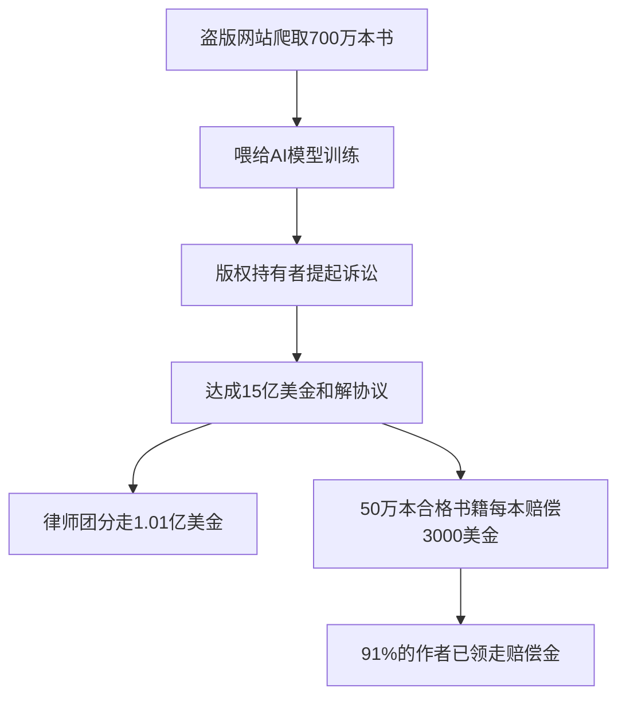
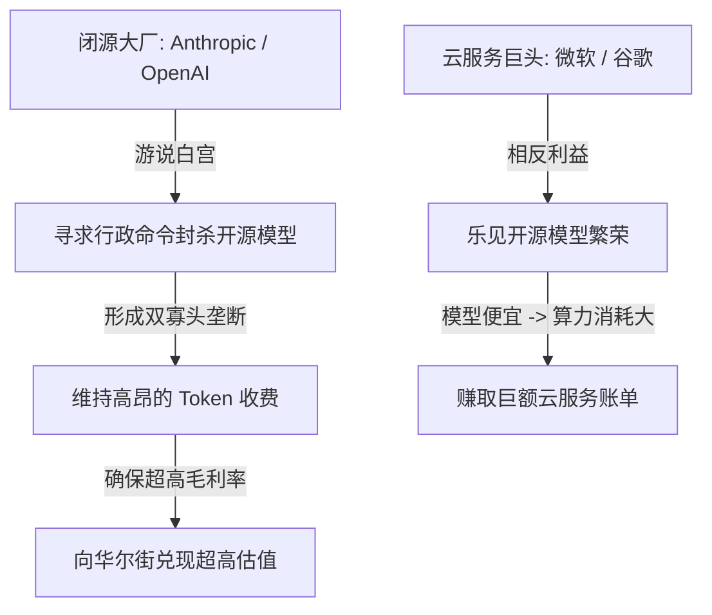
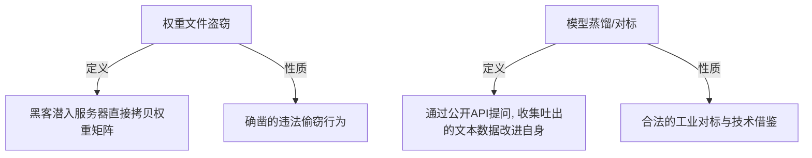
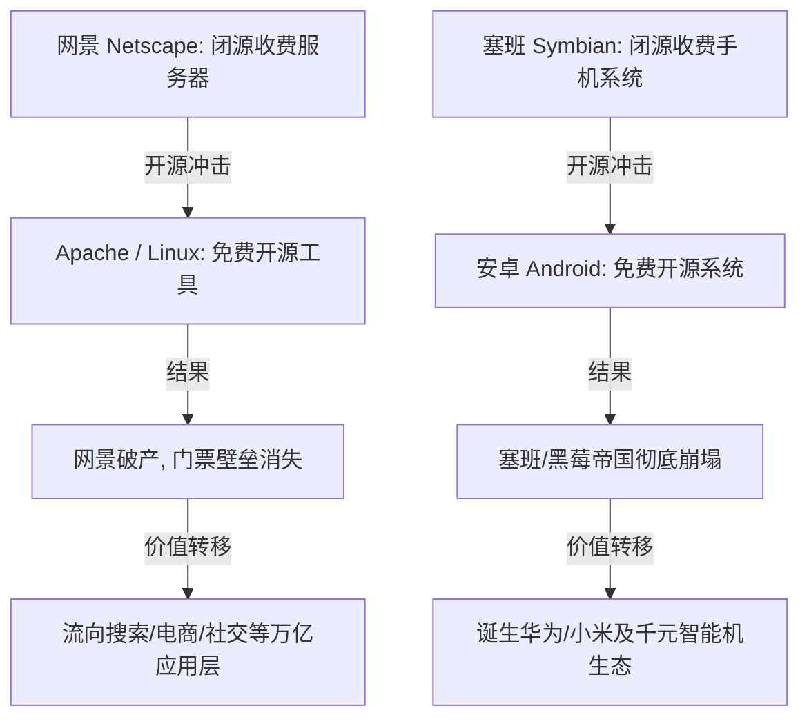

### 十五亿美金的和解支票与长尾创作者的悲歌

在**人工智能**（Artificial Intelligence: 模拟人类智能的计算机系统）狂飙突进的浪潮中，版权冲突正以史无前例的金融规模在法庭上展开清算。二零二零年七月的一个星期一，一家顶尖的生成式 AI 巨头默默签署了一张金额高达**十五亿美金**（折合人民币一百多个亿）的支票。这笔巨款不仅是一笔天文数字，更是美国司法历史上金额最大的一笔版权诉讼和解协议，没有任何“之一”，它直接刷新了版权侵权赔偿的最高纪录。

当公众第一次看到这个惊人的数字时，心中难免会升起疑问：这家人工智能公司究竟做了什么，竟然需要支付如此昂贵的代价？

答案极其简单，也极其粗暴：这家公司通过网络爬虫技术，从互联网上的盗版书籍网站中，强行爬取并下载了整整**七百万本书籍**。这些未经原作者授权的书籍，被直接喂进了其超大规模的深度学习模型中，用于训练其下一代人工智能系统的语言理解与生成能力。

在这场旷日持久的官司达成和解后，这笔百亿人民币的巨额资金分配方案被公之于众：
* 处于诉讼前线的**原告律师团**当场分走了其中一亿零一百万美元，成为了这场版权大战中最显眼的直接受益者。
* 处于长尾端的**书籍创作者**，按照和解协议的标准，每一本被侵权的书籍可以获得三千美金的赔偿金（折合人民币两万多元）。
* 最终被正式纳入赔偿名单的侵权书籍共计五十万本。

截至目前，在这五十万本书籍的作者中，已经有高达百分之九十一的人顺利把这笔钱领走。这起事件成为了人工智能发展史上第一起真正走到和解阶段、并支付了实质性巨额赔偿的 AI 训练版权案。



对于那些常年盘踞在畅销榜单顶部的知名作家而言，三千美金的版权费用或许微不足道，但对于图书市场上绝大多数处于金字塔底部的普通作者来说，这笔钱不仅不算打发人的小钱，甚至可能超过了他们图书出版以来所能拿到的全部版税总和。

书籍市场本身就是一个典型的**长尾市场**（Long Tail Market: 少数头部产品占据主流，但大量低销量非热门产品累积起来仍占有巨大市场份额的现象）。在传统出版业中，头部的极少数作家赚走了行业绝大部分的利润，而海量的长尾作家则仅仅能拿到微薄的辛苦钱。这笔迟来的版权和解金，在某种程度上成了这些普通作者的意外之财。

然而，这种对版权的侵蚀与利用，在科技圈的黑暗角落里远不止于文字书籍。在此之前，有行业新闻披露，科技巨头 **Meta**（前身为 Facebook 的社交与 AI 巨头）为了训练其多模态视频生成模型，曾直接从成人视频网站上大量抓取和下载未经授权的视频内容。这引起了舆论对未来版权诉讼的更广泛遐想。如果日本那些专门制作成人电影的机构，以及广大的女优群体也联合起来向 Meta 提起版权诉讼，那么以视频版权的单价和侵权规模来计算，Meta 所要面临的版权赔偿费用可能会是一个更加无法想象的无底洞。

---

### 白宫的蒸馏指控与技术原理的深度剖析

就在这笔十五亿美金和解案达成的同一个星期，华盛顿白宫的政治走廊里也掀起了另一场关于人工智能竞争与技术归属的巨浪。白宫科技政策办公室的现任人工智能事务负责人之一 **David Sacks** 在公开场合直接放话，声称美国政府已经掌握了确凿信息，指控中国知名人工智能独角兽公司**月之暗面**（Moonshot AI）在研发其最新的大语言模型时，投机取巧地采用了“蒸馏”技术。美方声称，月之暗面是通过将 Anthropic 的顶级闭源大模型 **Claude** 的输出数据进行工业化提取，才得以如此迅速地推出性能惊人的新一代模型。

为了理解白宫指控背后的技术语境，我们必须首先对**模型蒸馏**（Model Distillation: 将复杂、庞大的教师模型的知识转移到结构更简单、运行更轻量的学生模型中的一种训练方法）这一核心术语进行解构。

在传统的深度学习训练中，如果想要从零开始训练一个基座模型，科学家们必须使用网络爬虫在整个互联网的汪洋大海中捞针，抓取海量的原始文本数据。这些原始数据中充斥着大量的噪声、语法错误、垃圾广告和无意义的灌水贴，需要耗费极大的清洗算力和时间成本。

而“蒸馏”则是一种完全不同的走捷径的方式：
* 研发人员可以直接向成熟且顶尖的闭源模型（如 OpenAI 的 GPT-4o 或 Anthropic 的 Claude 3.5 Sonnet）发送大量的提问（Prompts）。
* 记录下这些顶级模型吐出来的、高质量且逻辑结构极其严密的回答。
* 将这些成千上万、甚至数千万条的“优质问答对”收集整理，直接组合成一个纯净度极高的黄金训练数据集。
* 最终，利用这个由顶级 AI 亲自生成的黄金数据集去喂养和训练自己的新模型。

通过这种方式训练出来的模型，其研发速度会得到成倍的提升。因为它的数据源并不是来自混乱的真实世界，而是来自于已经被前人提炼、加工、蒸馏过的“人造智慧”。这种高精度的训练数据，能让新模型在极短时间内掌握复杂的逻辑结构与语言规律，避免了海量无意义的试错。

```
[人类所有知识/书籍/网页]
       │ (Anthropic 爬取并进行初代训练)
       ▼
[Anthropic Claude 闭源模型]
       │
       ├─ (发出数千万次提问请求)
       ▼
[高质量问答输出数据 (蒸馏桶)]
       │
       ├─ (作为训练集喂给新模型)
       ▼
[其他公司/开源模型 (如 Kimi/DeepSeek)]
```

在硅谷的技术讨论中，有人为这种巧妙的“蒸馏”机制画了一幅极具讽刺意味的梗图：
1. 第一步，Anthropic 拿着一根精致的钓鱼竿，在人类历史积累的所有知识海洋（包括那五十万本被侵权作者的书籍）中垂钓，将知识转化为自己的模型财富。
2. 第二步，Anthropic 把钓上来的鱼装进了一个巨大的水桶里。
3. 第三步，其他开源大模型厂商（如中国的 **DeepSeek** 或月之暗面）则默默地拿着另一根钓鱼竿，直接伸进了 Anthropic 那个装满鱼的桶里开始钓鱼。

这种技术路径的冲突，随即引出了一个在法律、道德和商业层面的终极问题：
如果 Anthropic 在法庭上理直气壮地声称，自己把全世界创作者的书籍、网页和个人作品强行拿去训练模型，属于法律保护下的“合理使用”，甚至公开宣称“作者乐不乐意根本不重要”；那么，当其他公司用同样的逻辑，把 Anthropic 模型吐出来的公开文本拿去作为数据源训练自己的模型时，为什么 Anthropic 却可以通过游说管道向白宫状告对方，宣称这属于“盗窃行为”呢？

这种“我用你们人类所有的东西叫合理使用，你们用我的模型输出就叫盗窃”的双重标准，在最新一期的 All-in 播客（All-In Podcast: 由硅谷顶级投资人主持的、关于科技与商业博弈的标志性政经播客）中，遭到了四位美国本土主持人的强烈谴责与反思。

---

### 双标的底牌与闭源厂商的监管俘获

在 All-In 播客的讨论中，主持人们毫不客气地指责 Anthropic 的做法是“彻头彻尾的虚伪”。值得注意的是，这场讨论并不是一场关于中美科技竞争的宏大叙事，而更像是一场属于美国科技圈内部的“家务事”。

这四位在硅谷身价数亿、数十亿美元的顶级投资人，在数百万观众面前，直接把硅谷当前最炙手可热的独角兽企业 Anthropic 架在火上烤，剥离了其外表包裹的“技术安全”外衣，露出了底下残酷的利益博弈底牌。

在这场多方博弈中，不同主体的利益诉求呈现出了极大的分裂：

首先是以 Anthropic 和 OpenAI 为代表的**闭源大模型厂商**。它们真正想要推动的，是利用白宫和国会的政治力量，出台严厉的行政命令，将所有来自于境外的开源模型全盘封杀。如果能够达成这一战略意图，美国的生成式 AI 市场将直接演变成由它们两家主导的**双寡头**（Duopoly: 指市场上只有两个主要卖家提供某种商品或服务的市场结构）经济格局。

在这种双寡头的格局下，它们将拥有绝对的定价权，可以持续对每一个 API 调用（Token）收取高昂的税费，并将公司的毛利率维持在极高的水平。这与出行巨头 Uber 和 Lyft 联手扫清了其他本地竞争对手后，开始默契地抬高叫车价格的商业逻辑如出一辙。



然而，站在利益天平另一端的，则是以微软、谷歌以及亚马逊为代表的**云服务提供商**（Cloud Service Provider: 拥有海量算力服务器，对外租赁计算资源和数据服务的科技巨头）。

对于这些云巨头而言，它们的商业逻辑完全不同：它们根本不在乎具体的模型是谁做出来的，它们只在乎用户在它们的计算平台上跑了多少算力。

如果开发者们能够以极低的成本，在云端运行那些来自中国的、或者世界其他地方的免费开源模型，开发者就不用再向 OpenAI 或 Anthropic 支付昂贵的 Token 费用。这省下来的大笔资金，最终会全部转化为向微软 Azure 或谷歌云支付的计算服务器租用账单。

因此，开源模型的普及，对于云巨头来说实际上是巨大的红利。它们可以避开与闭源大厂的利润分成，直接通过售卖基础算力赚得盆满钵满。

这种隐秘的博弈在市场上早已露出了端倪。此前，中国的月之暗面发布了其全新一代的开源大模型 **Kimi K3**。在 Kimi K3 诞生之前，硅谷科技界的共识是：中国的开源模型在技术性能上，大约落后美国最顶尖的闭源模型八个月到一年的时间。

然而，Kimi K3 的横空出世彻底粉碎了这一认知。它不仅在技术指标上直接追平了 Anthropic 和 OpenAI 的第一梯队模型，而且在使用价格上便宜了绝大部分。更具有毁灭性的是，Kimi K3 是一个**开源权重**（Open Weights: 指大模型不仅开放使用接口，还将训练好的核心权重参数文件直接公开供外界下载部署）的模型。

开源权重意味着，任何企业或个人都可以直接把这个模型文件完整地下载到自己的本地服务器或者个人电脑上。一旦下载完成，即使拔掉网线、完全断绝与互联网的连接，这个模型依然可以在本地无障碍地运转，帮用户干活。

这种可以自由复制、无需按次付费的技术文件，彻底让白宫和硅谷闭源大厂感到焦虑。一旦这种高水平的开源大模型流向市场，就如同将一本印好的书发向全世界，一旦发出去，就再也无法收回，任何人都可以在自己的机器上免费运行它，闭源大厂依靠 API 接口收取“过路费”的商业幻想将被彻底粉碎。

针对这一技术格局的巨变，白宫内部在短短两天内就释放出了两种截然相反的声音，展现了政策制定者在不同利益集团游说下的分裂：
* 星期一，美国科技媒体 Axios 独家报道称，白宫正在紧急起草法案，考虑采取直接封杀中国开源大模型的极端手段。
* 星期三，著名科技媒体 Wired 则爆出相反消息，称现任商务部长卢特尼克对直接封杀持保留态度。他的观点是，与其在行政上围追堵截，不如美国政府自己砸下重金，逼着美国本土的实验室做出更强大的开源模型，以攻代守。

事实上，美国那些顶级的闭源实验室（如 OpenAI）完全有能力做出非常优秀的开源模型，但在商业利益的诱惑下，它们主动放弃了开源路径。因为一旦将顶级模型开源，就会直接对自己利润丰厚的闭源订阅制生意造成毁灭性打击。

在这个关键时刻，Polly Market 预测市场上关于“二零二六年美国政府是否会正式封杀某款开源模型”的预测盘口，在短短几天内，赔率概率就从百分之二十二一路飙升到了百分之四十五，资本市场对政策走向的担忧达到了顶点。

All-In 播客主持人 David Sacks 对 Anthropic 的这一游说行为给出了极其沉重的定性——**监管俘获**（Regulatory Capture: 私营企业通过游说和政治献金，将政府的监管机构转化为替自身谋取垄断利益、阻挡竞争对手的工具）。

Sacks 给出了具体的数据支撑：根据第三方机构的测算，Anthropic 在今年年初的年化收入估算约为一百亿美金，而到了七月份，短短半年的时间里，这一数字已经冲到了惊人的七百多亿美金。虽然这只是第三方的估算数据，但哪怕打个折，半年翻七倍的增长速度，也足以让其成为整个人类科技史上在同等体量下跑得最快的公司。

就是这样一家在市场竞争中已经占尽绝对优势、财富呈指数级爆发的公司，居然还要跑到白宫去扮演弱者进行政治“假摔”（Flopping），试图利用国家安全借口来拉拢政府，替自己关上竞争的大门。这种行为在硅谷投资人眼里，已经不是什么正常的企业自我保护，而是赤裸裸的行政碰瓷。

---

### 模型商品化趋势与白菜价的残酷现实

播客的另一位印度裔主持人陈马斯（Chamath Palihapitiya）则从纯粹的商业演进规律，对这场博弈给出了更加冷酷的评判。他指出，大语言模型这一技术，正在以远超所有人预期的速度走向**商品化**（Commoditization: 指某项曾经高利润的技术或产品，在竞争和普及下迅速失去溢价，变成像水和电一样利润微薄的标准化大路货的演进过程）。

在硅谷摸爬滚打二十五年的陈马斯感慨道，他从未在任何一个行业里见过如此诡异的景象：整个硅谷在短短两年内，往大模型赛道里砸进去了几千亿美元的真金白银。所有的投资人、创业者原本都以为，自己投资的是一个可以吃上几十年定价红利的绝对垄断生意。

然而残酷的现实是，任何一家顶尖公司在发布了自认为领先时代的模型性能指标后，仅仅需要几个礼拜的时间，就会有一大批来自全球各地的开源或闭源模型迅速追赶上来，甚至在某些维度上完成反超。闭源厂商精心筑起的技术壁垒，在开源大潮的冲刷下，维持的时间甚至超不过两个月。

```
[几千亿美元资本砸向模型层]
        │
        ▼ (技术开源与极速追赶)
[模型定价权快速崩塌 (白菜化)]
        │
        ├─► [价值向上转移] -> 垂直应用层 (解决具体业务痛点)
        │
        └─► [价值向下转移] -> 基础设施层 (显卡芯片 / 云算力)
```

在这种情况下，大模型本身越来越退化成一根没有任何品牌溢价的“管道”。在这场万亿级别的 AI 投资赌局中，最终的利润并不会留在模型层，而是会发生激烈的“搬家”：
* 资金向**应用层**（上游）移动：那些能够直接结合具体业务场景、解决用户痛点的应用端公司将赚取超额收益。
* 资金向**芯片与云算力层**（下游）移动：英伟达以及拥有海量数据中心的云服务商将持续收割电表和算力红利。

而夹在中间的大模型厂商，则面临着被开源彻底做成“白菜价”的绝境。

为了让听众理解开源被封杀对美国商业的实质性伤害，主持人们打了一个极其生动的比方：
假设你是一家像可口可乐这样的普通消费品公司，你希望引入人工智能技术来优化你庞大的供应链、提高财务和行政的办公效率。这本来是一个极其合理的商业升级诉求。

然而，如果美国政府听信了 Anthropic 的游说，强行查封了所有的免费开源模型，并出台行政命令规定：“由于国家安全原因，美国企业只能使用 Anthropic 和 OpenAI 这两家指定的闭源模型。”

这就意味着，你必须为每次 AI 调用支付高昂的 Token 费用。经过测算，这种闭源 API 的使用成本，比市场上原本可以使用的、免费下载的开源模型，贵了整整**五十倍到一百倍**。

这相当于，同样一瓶可乐，你的外国竞争对手可以用五毛钱的 AI 算力成本来完成设计、客服和运营；而你因为是美国公司，被政府强制只能购买价格高达五十块钱的美国本土 AI 算力。

在这种扭曲的成本结构下，美国企业的全球竞争力将被生硬地剥夺。资本市场对此的反应也极其简单粗暴：直接将所有受此影响的美国公司的股票估值拦腰砍断。因此，陈马斯断言，如果美国政府真的强行对开源模型下手，美国的股票市场将首先以一波剧烈的暴跌来回敬这一愚蠢的政治决策。

---

### 工业级蒸馏的本质与账号风控的失职

随着讨论的深入，主持人们将焦点对准了白宫指控中那个核心词汇的道德边界——**蒸馏到底是不是偷窃**？

在传统的软件工程和互联网发展史中，对于竞争对手产品的对标和研究，是一个早已被默认的行业惯例。播客中一位曾在早年加入谷歌的主持人分享了一段尘封的旧事：

在谷歌搜索引擎崛起的早期阶段，为了快速改进和优化谷歌自身的网页搜索排序算法，谷歌的工程师们曾经向当时的行业老大雅虎（Yahoo）以及微软的搜索引擎，一口气提交了高达几百万条的搜索关键词。

接着，谷歌将雅虎和微软返回的搜索结果页面一条一条地抓取下来，与谷歌自己的搜索结果进行极为细致的比对，找出对手在哪些词条下的排序更精准，并以此为依据来反向改进谷歌自己的算法。

这位主持人强调：“在当年的商业语境下，我们没有黑入雅虎的服务器，没有偷取任何一行的核心代码，我们只是观察并分析了它们向公众吐出来的公开搜索结果。这件事情在当年有一个冠冕堂皇的名字，叫做**对标**（Benchmarking）。”

这种行为在其他物理制造行业更是屡见不鲜：
* 手机行业中，国产手机厂商每次在苹果发布新 iPhone 后，都会在第一时间购买数十台真机拆解，研究其内部的主板排列、散热设计和摄像头结构。
* 汽车行业里，任何一家新能源车企在竞争对手推出新车型后，都会买来新车彻底拆成零件，分析底盘调教和电池布局。

在任何一个健康的工业社会中，拆解、研究、模仿并改进竞争对手的公开产品，都是推动行业技术进步的合法动力。而大模型的“蒸馏”，在技术本质上与拆车、拆手机没有任何区别。

在法律概念上，大模型的核心资产是其**权重参数文件**（Weights: 神经网络中决定信息传递强度的海量数字矩阵）。如果中国的研发人员通过黑客手段直接潜入 Anthropic 的服务器，将 Claude 的核心权重文件盗取出来，那毫无疑问属于刑事犯罪级别的盗窃，没有任何洗白的余地。

但现实情况是，至今在公开层面上没有任何证据表明有任何权重文件被盗。月之暗面等公司仅仅是通过付费或公开的 API 接口，向 Claude 发送提问，并根据其吐出来的回答来优化自己的权重。



如果这种通过 API 获取输出的行为大到被 Anthropic 冠以“工业级蒸馏攻击”的耸人听闻之词，那么 Anthropic 自身在系统安全和风控防御上的失职，才是最应该被追究责任的。

David Sacks 指出，如果 Anthropic 真的如此害怕自己的模型输出被别人拿去蒸馏，它在工程上有一万种简单的方法可以阻止这种行为。最直接的一招就是引入中国互联网行业早已普及的**实名认证**（Real-name Authentication: 绑定个人身份证件、人脸识别或高额信用卡额度以验证真实身份的机制）。

在中国，无论是注册一个普通的社交软件账号、玩网络游戏，还是去网吧上网，都必须强制绑定真实的身份证件和手机号。

如果 Anthropic 在其 API 注册页面上，不再允许用户仅凭一个简单的临时电子邮箱就能完成注册，而是强制要求绑定真实的身份信息，并且必须关联一张拥有高额预授权额度的实体信用卡，这一套简单的风控流程就能瞬间让百分之九十以上的恶意批量注册账号无处遁形，从根本上解决大规模爬虫蒸馏的问题。

然而，Anthropic 为什么迟迟不肯推行这种严格的身份风控？

答案依然回到了资本市场的游戏规则：**实名认证会极大地增加用户的注册门槛，进而严重拖慢其用户增长曲线**。

在 Anthropic 冲击上市、向华尔街展示其用户量和收入呈指数级上升的关键档口，任何可能阻碍增长曲线的防御措施，都会被管理层无情地推迟。它们宁愿忍受模型被别人蒸馏，也要维持那条好看的、一路向上的用户增长线。

不仅如此，播客中还披露了更多的地下产业细节：在东南亚的马尼拉以及南亚的印度，存在着大量专门从事“账号农场”代注册的灰色工作室。他们雇佣廉价的当地人工，批量注册成千上万个 Anthropic 和 OpenAI 的账号，然后将这些账号打包在暗网上低价转卖。这解释了为什么印度会成为 OpenAI 全球用户量最多的国家之一——其中有相当一部分账号在后台没日没夜地发送着高度一致的提问，源源不断地向外部导流蒸馏数据。

这种几千万个账号在同一时间、以完全相同的频率和节奏疯狂搬运数据的异常动静，在后台的流量监控日志中就像深夜里有人开着重型大卡车往你家别墅外面搬家具一样显眼。Anthropic 睁一只眼闭一只眼，任由这种行为发生，事后却跑到白宫哭诉自己遭到了“攻击”，这在商业逻辑上是完全站不住脚的。

作为一家毛利率高达百分之九十（甚至超过了贵州茅台）的暴利科技公司，Anthropic 宁可把所有的利润都拿去粉饰财报，也不愿意拿出一两个百分点的资金去组建专业的安全风控团队。这种在管理上的严重失职，如今却被包装成了地缘政治层面的“国家安全威胁”，其目的昭然若揭。

---

### 开源生态的唇亡齿寒与脏物反噬

在这场辩论中，主持人们还指出了一个极具黑色幽默的逻辑悖论：

如果 Anthropic 成功说服了美国政府，让白宫正式确立了“使用大模型输出数据进行训练等同于盗窃知识产权”的法律先例，那么这将成为砸向 Anthropic 自身头顶的巨大石头。

既然“未经授权使用他人数据训练模型是偷窃”，那么站在法庭对立面的出版商、唱片公司以及《纽约时报》的庞大律师团，将瞬间获得最致命的诉讼武器。

他们会直接在法庭上反问 Anthropic ：“既然你们自己都向白宫承认了这一逻辑，那你们之前在未经我们许可的情况下，强行扒走我们五十万本著作、几百万篇新闻报道来训练 Claude 模型的行为，是不是也是最彻底的偷窃？如果是，我们现在不要那微不足道的三千美元一本书的赔偿了，我们要拿走你们公司未来所有的营业收入！”

```
[若法律认定: 蒸馏输出 = 知识产权盗窃]
       │
       ├─► 闭源大厂自身立足根基崩塌 (其模型同样是未经许可抓取人类数据训练而成)
       │
       ├─► 出版商/版权方律师团将索要闭源大厂的“全部营业收入”而非微薄和解金
       │
       └─► 衍生产品被指控为“脏物的脏物” (如 Thinking Machines / Cursor 等)
```

这种法律逻辑的自我反噬，让闭源大厂在公开起草的游说博客中，甚至连“知识产权盗窃”这几个字都不敢直接写下来，只能生造出“工业级蒸馏攻击”这种语焉不详的新词，试图在蒙蔽政客的同时，避免引火烧身。

不仅如此，这一刀砍下去，受重伤的将是整个美国朝气蓬勃的开源初创生态。

在当前的硅谷创业圈中，大量的明星初创企业其实都在深度依赖开源模型。节目中列举了两个非常典型且瞩目的例子：

第一家是 **Thinking Machines**。这家公司的创办人正是大名鼎鼎的 **Mira Murati**（前 OpenAI 的首席技术官 CTO，曾与苏兹克维发起针对萨姆·奥特曼的董事会罢免风波）。她离职后创立的 Thinking Machines 如今手握全美性能最好的开源大模型之一。而这个模型的训练秘密，正是从中国的开源大模型 Kimi K2.5 上蒸馏并改进而来的。

第二家则是 **Cursor**（研发了当前硅谷最流行的 AI 辅助编程工具的明星企业）。其母公司最近刚刚被 SpaceX 以高达六百亿美元（60 Billion）的惊人估值完成了收购谈判。它们推出的核心新产品 **Composer 2**，在底座技术上同样是拿 Kimi K2.5 作为基础模型打底，再灌入自己积累的专有编程数据集进行后期微调。

如果按照 Anthropic 的游说逻辑，任何通过蒸馏中国开源模型而来的技术都属于“知识产权盗窃”，那么 Thinking Machines 的大模型以及 Cursor 最核心的编程工具，都将在法律层面上被直接定性为“赃物的赃物”。

这是一个极其荒谬但正在逼近的现实：一旦一个开源模型被公开发布到互联网上，它在物理属性上就变成了一个躺在本地硬盘里、纯粹由数字组成的本地文件。当美国的创业公司把它下载下来，部署在德克萨斯州的数据中心，并用美国本地的数据进行重新训练时，这个模型与中国之间已经没有任何物理上的数据包回传，也没有任何服务器的连接。

但如果白宫在意识形态的操弄下，强行给这个文件盖上一个“来路不正”的印章，那么所有在这个开源生态上繁育出来的美国初创企业，都将在一夜之间失去其技术合法性。

这也是为什么硅谷最著名的孵化器 **Y Combinator** 总裁 Gary Tan 动作如此迅猛，在第一时间就联合了超过两百家美国本土人工智能初创公司，联名向白宫写信抗议，要求政府绝对不能封杀开源模型。

这些初创公司急迫的心情并不是为了替中国的科技公司说话，而是它们切身感受到，闭源大厂递向白宫的那把行政尖刀，正在直勾勾地捅向整个美国开源创新生态的心脏。

---

### 历史的宿命回响与云巨头的隐秘棋局

纵观科技发展史，这场关于“开源与闭源”的生死决战并不是什么新鲜事，它曾在过去的半个世纪里数次上演，且每一次都遵循着完全相同的历史剧本。

主持人们在节目中动情地回忆起了互联网早期的经典战役：

二零零零年左右，互联网世界最风光的公司莫过于**网景**（Netscape）。它们凭借着闭源、收费的浏览器和 Web 服务器软件风光无限，上市后市值冲天。在那个时代，大家都认为网景将永远垄断整个互联网世界的“门票”生意。

然而，开源的力量悄然觉醒。免费、开源的 **Apache** 服务器软件横空出世。任何想要建站的程序员，只需要拥有一台普通的电脑，就可以免费下载 Apache 并搭建自己的网站，再也不需要向网景交纳哪怕一分钱的过路费。

短短几年时间，网景这个曾经不可一世的帝国就烟消云散了。但互联网的繁荣并没有因此停止，相反，随着建站门槛的彻底消失，整个互联网产业迎来了爆炸式的增长。原本被网景一家垄断的门票价值，彻底散落并溢出到了搜索（谷歌）、电商（亚马逊）、社交网络（Facebook）等千千万万个具体的应用层生意中。



同样的剧本在移动互联网时代再次上演。当年，诺基亚主导的塞班（Symbian）系统以及黑莓（BlackBerry）系统，都试图维持封闭且收费的操作系统生态。

直到谷歌做出了一个改变世界的决定：将**安卓**（Android）系统彻底开源，向全球所有的手机厂商免费开放。这一举措在短短几年内就将塞班和黑莓打入了历史尘埃。安卓的开源不仅造就了华为、小米等一大批硬件巨头的崛起，更让深圳华强北的低端硬件生态得以繁荣，让全球数以亿计的普通人以极低的价格第一次拥有了自己的智能手机。

如果当年谷歌没有开源安卓，而是将智能手机系统做成一个高额收费的闭源产品，那么我们今天所熟知的千元智能机以及移动互联网的全面普及，大概率将不复存在。

历史的韵脚告诉我们，闭源的门票生意总是短暂的，开源的生态繁荣才是历史不可阻挡的必然规律。

在这一规律下，谷歌和微软这两个巨头在当前 AI 算力投资上的动作，也就变得极其容易理解。

以谷歌为例，其最新的财报显示，谷歌的云服务年化营业规模已经冲到了一千亿美元的惊人高度。为了维持在这一赛道上的绝对统治地位，谷歌在今年给出的资本开支指引（主要是用于购买显卡芯片、建设数据中心和电网设施）已经达到了极其恐怖的**一千九百五十亿至二千零五十亿美元**。

这一数字究竟意味着什么？它整整相当于美国今年全部国家军事预算的百分之二十。

如此庞大的资本投入，其代价也是极其沉重的。在财报公布当天，由于如此高昂的算力建设投入导致谷歌自上市二十五年来，其账面上的自由现金流第一次出现了负值，股价在当天应声下跌了百分之七。

但如果我们理解了“模型通道化”的逻辑，就会明白谷歌为什么要在自由现金流转负的情况下依然疯狂砸钱建数据中心。

对于谷歌和微软而言，世界上冒出的 AI 大模型越多、越乱、越便宜，对它们的云服务生意就越有利。

当世界上有五百个免费的开源大模型在互相竞争、把 Token 价格打成白菜价时，全球成千上万的企业就会因为算力成本的极度低廉，疯狂地将业务迁移到云端运行。谷歌和微软不需要去赌哪一个大模型会赢，它们只需要坐在那里，像自来水公司和电网公司一样，为这些不知疲倦运转的大模型不断地收取水费和电费。

---

### 终局棋局：知识白菜化与物理实体的终极竞争

在 All-In 播客的最后，主持人们将讨论的时间尺度拉长到了未来五十年的宏观地缘政治维度，给出了一个极其震撼且富有远见的终极结论：

在过去的半个世纪中，美国及整个西方发达国家，其赖以维持高额福利与经济霸权的底层资产，实际上是**对比特的垄断**——即通过专利、版权、品牌和知识产权等虚拟资产，在产业链最顶端撬动全球数万亿美元的 GDP。而将高能耗、低利润的**原子制造**（指具体的工业制造和实物生产）全部搬迁并外包给了中国等东亚国家。

```
[过去50年西方霸权模式] -> 垄断知识与服务 (专利/版权/品牌) -> 赚取产业链最高利润
                                   │
                                   ▼ (AI 开源大潮冲刷)
[人工智能终极形态]     -> 知识成本趋近于零 (知识白菜化)
                                   │
                                   ▼ (竞争回归底层物理实体)
[未来地缘博弈焦点]     -> 分子转化能力 (电力能源 / 厂房面积 / 工业制造)
```

然而，当大语言模型和生成式 AI 以无可阻挡的势头将知识的生产和传播成本打到趋近于零时，西方过去五十年最引以为傲的“知识溢价”层，将被彻底抹平。

当一个普通的农民、工人和学生都可以通过免费的本地开源 AI，在几秒钟内获得相当于常春藤盟校教授、顶级执业律师或资深工程师的专业知识建议时，知识将不再拥有往日的定价权，它将彻底沦为像呼吸空气一样廉价的“白菜”。

当知识被抹平后，人类文明的竞争将不得不退回到最底层的物理规律——即**分子转化能力**（将一种物质以最少的能量、最快的速度转化为另一种实物的物理制造能力）。

说到底，整个人类文明的物质基础，并不是虚无缥缈的比特，而是你身下的沙发、你头顶的屋顶、你手中的芯片，以及维持它们运转的电能。

而在物理制造和能源基建这两个决定未来的物理维度上，中美之间的实力对比呈现出了令人窒息的差距：
* **发电能力**：美国当前的全国总发电能力大约是一太瓦（1 Terawatt），而中国正在以势不可挡的速度向八太瓦（8 Terawatts）的规模一路狂奔。
* **制造业厂房面积**：美国全部的工业厂房面积总计约为一百亿平方英尺，而中国的制造业厂房面积已经达到了惊人的两千亿平方英尺，两者之间存在着整整**二十倍**的物理鸿沟。

基于这两组数据，主持人们给出了一个充满地缘政治智慧的论断：

中国在人工智能领域的底层战略，或许根本不是在算法层面上死磕并超越美国那几个闭源实验室。相反，中国真正正在下的那一盘棋，是利用其无与伦比的工业规模和开源力量，将全球大模型的“知识成本”彻底打成白菜价。

当大模型的算力和使用成本无限趋近于零时，全球的产业竞争将被强行拖回到“电能与工厂”的物理世界战场。而在电力和工厂这两个核心战场上，谁才是真正的霸主，答案早已不言自明。

从光伏产业、锂电池、新能源汽车，再到如今的开源大模型，将原本高高在上、充满溢价的暴利行业，通过无可匹敌的工业组织力和规模效应彻底打成“白菜价”，这正是中国企业在过去数十年里最擅长、且屡试不爽的战略打法。

展望未来的政策走向，美国政府大概率不会出台极端的行政命令去全面封杀开源大模型。因为这不仅在技术实施层面上（挨家挨户搜查私人硬盘里的开源权重文件）完全不可行，更会在商业上彻底摧毁美国科技行业整体的竞争力和开源初创生态。

最终，开源与闭源将如同当年的 Linux 与 Windows、安卓与 iOS 一样，在人工智能的世界里走出两条完全不同的生态体系。而在这场博弈中，那些试图通过白宫行政力量来关门垄断的闭源大厂，注定无法抵挡开源大潮的滚滚向前。