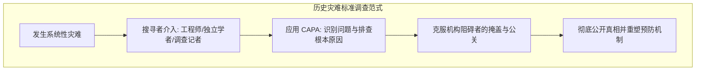

### 灾难应对范式：从监管俘获到系统性调查

在过去的科技与商业周期中，**比尔·格利**（Bill Gurley: 硅谷知名风险投资家，曾主导投资 Uber 与 Zillow）持续关注着制度与监管的运行机制。三年前，他曾就**监管俘获**（Regulatory Capture: 监管机构反被其监管的行业利益集团控制的现象）发表公开演讲，引发了公众层面的广泛讨论。然而，过去五六年来一直困扰他的另一个严峻议题，是人类社会在面对重大灾难时究竟如何展开应对与调查。

历史上每当巨灾发生，成熟的工程与现代社会治理体系都会启动严密的故障调查机制，以彻底厘清事故全貌并建立长效防范体系。然而，当灾难涉及复杂的机构利益与政治阻力时，这种科学追责与调查流程却可能遭遇前所未有的制度性失灵。

Original English Source

硅谷传奇人物、投资人比尔·格利。成绩斐然。这位传奇人物曾投资 Uber 和 Zillow，经历了 25 年来每一次重大的科技周期。你不只是个评论员，对吧？你曾是一名操作员。我非常希望能激发人类的这种潜在能力。在世界历史上，从未有过比现在学习速度更快的时代。你可以通过增加体表面积来获得好运。我不太喜欢这种反乌托邦题材的故事。现在最应该做的就是拼命跑。

欢迎比尔·格利。很高兴再次来到这里。三年前，我曾就监管俘获问题发表过演讲，这个群体对我的反应以及对那段视频的推广都非常友好。我很高兴我们把这个信息传递到了公众讨论中。显然，现在你经常会听到这样的说法。

今天想和你们谈的是另一个话题。并不是说我不打算谈论人工智能。这是一个严肃的话题，所以可能不会有很多轻松搞笑的部分。这件事在过去五六年里一直困扰着我，我很感激这里的团队允许我来和你们谈谈这件事，我也希望我们能通过宣传这件事产生影响。我首先要和大家谈谈世界上发生的一些灾难，以及人类通常如何应对这些灾难。

### 尚普兰大厦倒塌：多轨平行调查的制度标杆

以 2021 年 6 月发生在佛罗里达州瑟夫赛德的**尚普兰大厦**（Champlain Towers South）坍塌事故为例，该惨剧共造成 **98 人死亡**。事故由三重制度与工程失败共同导致：建筑自始存在的设计缺陷、不完善的长期维护保养计划，以及公寓管委会对先前明确指出结构隐患的检查报告视而不见。

在事故发生后，美国社会迅速启动了多轨并行的穷尽式调查：
* **深度调查报道**: 《纽约时报》调查团队通过精细的 3D 建模重构了坍塌过程——泳池平台长期暴露于盐雾环境中发生腐蚀，平台坍塌跌入地下室并压垮关键承重柱，最终引发连锁倒塌。
* **联邦工程事故调查**: **美国国家标准与技术研究院**（NIST: 9/11事件后被指定负责调查重大建筑倒塌原因的联邦科研机构）指派了包括马瑟尼（Metheny）、雷曼（Lehman）在内的资深科学家团队展开长达数年的深入调查。
* **独立法医工程鉴定**: 瑟夫赛德当地政府聘请了知名建筑倒塌法医鉴定专家**艾伦·基尔希默**（Allyn Kilsheimer）介入排查。
* **司法与民事诉讼调查**: 佛罗里达州大陪审团介入调查，法官将 17 起受害者民事诉讼合并为集体诉讼展开司法取证。
* **媒体普利策奖级监督**: 《迈阿密先驱报》在编辑**莫妮卡·理查森**（Monica Richardson）的带领下展开穷追猛打，最终凭借对大厦隐患与制度漏洞的深入调查荣获**普利策奖**（Pulitzer Prize）。

这一系列并行调查展示了一个健康社会面对灾难时的标准反应：不惜一切代价查明技术与管理漏洞，确保所有证据大白于天下。

Original English Source

这是位于佛罗里达州瑟夫赛德的尚普兰大厦。你可能还记得 2021 年 6 月那栋大楼突然倒塌的事件。98 人死亡。发生了什么？从一开始就存在设计缺陷。维护保养计划不完善。然后，公寓委员会没有听取一份检查报告，该报告指出他们需要处理这个问题。三件不同的事情。这算是制度上的失败吧。

技术故障有所不同，您可以在这里看到。这是一篇《纽约时报》的文章。希望他们能点击播放，这样你就能看到这是一篇 3D 文章了。如果他们没办法播放，你就只能自己看了。开始了。但我希望你们看到这个的原因，并不是要讨论它究竟是如何崩溃的细节。原来是泳池平台长期暴露在盐水空气中，已经腐蚀了。泳池平台坍塌到地下室，压垮了结构柱，导致建筑物倒塌。但我希望你们从中了解到的是，《纽约时报》及其调查团队掌握了事件发生的极其详细的信息，这是因为他们进行了深入的调查工作。

此外，还有四项平行调查同时展开。NIST 是美国国家标准与技术研究院的简称。9/11 事件后，他们被指派为联邦机构，调查建筑物倒塌事故的原因。马瑟尼、雷曼和贝尔这几个人花了五年时间研究这个问题。艾伦·基尔希默是建筑倒塌事故的顶级专家。当你想弄清楚发生了什么事时，你就会打电话给他。瑟夫赛德镇雇佣了他。兰德尔法官在佛罗里达州召集了一个大陪审团来调查此事，共有 17 起受害者诉讼被合并为一个集体诉讼。汉兹曼是审理此案的法官。

第五项调查则来自《迈阿密先驱报》。莫妮卡·理查森是这里的执行主编。她派出记者前往现场，并在现场扎营。他们坚持要求查明真相，不放弃任何蛛丝马迹。凭借对这场悲剧的报道，他们赢得了普利策奖。

### 波音 737 MAX 空难：跨党派独立调查与全方位问责

波音公司 **737 MAX** 机型接连发生的两起致命空难（印尼狮航 610 号航班与埃塞俄比亚航空 302 号航班，共导致 **346 人遇难**）进一步展现了工程灾难调查的标准流程。调查查明，波音在换装更大尺寸发动机时，为防止大攻角失速引入了**机动特性增强系统**（MCAS: 机动特性增强系统，旨在自动压低机头以防失速），但该系统仅依赖单一迎角传感器输入，且波音在飞行员手册中刻意隐瞒了该系统的存在。

空难发生后，全球与美国国内迅速形成了跨党派、跨机构的追责机制：
* **多国空难调查局协同**: 印尼国家运输安全委员会（KNKT）与埃塞俄比亚民航局迅速展开残骸与飞行数据分析。
* **国会跨党派联合调查**: 美国众议院交通委员会（由民主党籍主席彼得·德法齐奥领导）与参议院商业委员会（由共和党籍参议员特德·克鲁兹与罗杰·威克领导）展开了不带任何党派色彩的联合调查，传唤波音高管与**美国联邦航空管理局**（FAA: 负责民用航空监管与适航认证的联邦机构）官员。
* **调查记者深度攻坚**: 《西雅图时报》记者**多米尼克·盖茨**（Dominic Gates）深入揭露波音内部工程文化退化与 FAA 监管委托机制的失灵，同样荣获普利策奖。

这一系列调查明确将事故定性为制度性腐败与工程妥协的恶果，促成了航空安全监管法规的全面重塑。

Original English Source

再看另一个案例：波音 737 Max。2018 年 10 月印尼狮航 610 航班坠毁，2019 年 3 月埃塞俄比亚航空 302 航班坠毁。346 人死亡。为什么会发生这种情况？波音将更大的发动机安装在现有的机身上。他们知道这可能会导致机头向上仰起，并可能导致飞机失速。因此，他们安装了名为 MCAS 的软件，在必要时自动压低机头。但这需要一个攻角传感器。他们使用了单个传感器，而不是冗余传感器，并且他们没有在飞行手册中告诉飞行员该系统的存在。

这是一起严重的工业和监管失败。但后续的处理完全符合规程。KNKT 展开了彻底调查。来自埃塞俄比亚的调查团队展开了调查。交通部的监察长办公室也展开了调查。《西雅图时报》的多米尼克·盖茨在此事件上进行了大量报道，并因此获得了普利策奖。这本来不应该发生。

我想和你们分享的是众议院和参议院的两个委员会的调查，它们都具有极其鲜明的跨党派性。德法齐奥是众议院委员会主席，非常活跃；特德·克鲁兹和威克在参议院也非常活跃。没有任何人认为这件事应该带有党派色彩，它也绝不应该带有党派色彩。

### 纠正与预防措施（CAPA）：现代科学工程的防灾底层逻辑

现代科学、医学与工程界在面对系统性故障时，建立了一套严格遵循的方法论——**纠正与预防措施**（CAPA: Corrective and Preventive Action，工业界用于识别根本原因并杜绝同类故障再现的质量管理与安全规范）。CAPA 包含不可逾越的五个核心步骤：
1. **识别问题**（Identify the Problem）
2. **调查原因**（Investigate the Cause）
3. **确认根本原因**（Determine Root Cause）
4. **纠正问题**（Correct the Problem）
5. **预防再发**（Prevent Recurrence）

在 **美国食品药品监督管理局**（FDA: 监管药品与医疗器械安全的联邦机构）的严格法规下，制药与医疗设备行业将 CAPA 视为法定强制要求；在航空航天领域，任何事故也必须遵循这一闭环逻辑。其核心铁律在于：**绝不允许跳过根本原因分析**。如果无法彻底查明真实发生的技术机理与系统性诱因，任何所谓的“整改与预防”都只是无源之水。

Original English Source

原来科学界在进行故障分析时有一套固定的标准流程。它被称为 CAPA，即纠正与预防措施。共有五个步骤：发现问题、调查原因、确认根本原因、纠正问题并预防问题。

关键在于预防。你想阻止这种情况再次发生，但你绝对不能跳过根本原因。这是强制性要求。如果你不知道究竟发生了什么，你根本不可能知道该如何解决。根据美国食品药品监督管理局 (FDA) 和制药及医疗器械行业的法律规定，CAPA 是必须执行的程序；航空航天业也有严格的法规，要求在发生故障时必须执行此类流程。

### 卡特里娜飓风与堤坝溃决：破除官僚借口的独立工程取证

2005 年**卡特里娜飓风**（Hurricane Katrina）袭击新奥尔良，导致 **1,800 人死亡**、40 万人流离失所，直接经济损失高达 **1,250 亿美元**。灾难初期，负责修建防洪堤坝的**美国陆军工程兵团**（US Army Corps of Engineers）极力向公众灌输“天灾论”，声称风暴潮超过了设计防御标准，洪水漫过了堤顶。

然而，由加州大学伯克利分校工程学教授**罗伯特·比**（Robert Bea）领导的**美国国家科学基金会**（NSF: 支持基础科学研究与灾后独立工程评估的联邦机构）独立调查团队，迅速推翻了这一官方叙事。比教授通过现场钻探取样与土力学计算证实，风暴仅仅是一场 3 级飓风，防洪墙并未被漫顶，而是由于地基土层滑动导致防洪堤从底部被水流顶托溃决。

陆军工程兵团最初百般推诿，甚至设立专门公关部门试图封杀外部批评，并将比教授斥为“叛徒”。但最终在无可辩驳的工程证据面前，军方被迫向全美公众低头认错，承认是其设计缺陷与工程管理渎职导致了防洪系统的崩溃。

Original English Source

再来看 2005 年卡特里娜飓风。看看这些数据：1,800 人死亡，40 万人流离失所，损失达 1,250 亿美元。这里发生了什么？修建堤坝的美国陆军工程兵团想让你相信，这是洪水漫过了堤坝的天灾与自然灾害。但这只是一场 3 级飓风。实际情况是，堤坝是从下方溃决的，它们被水下掏空冲跨了。这起事故原本是完全可以避免的。

在每一起灾难中，我们都能看到两类人：**搜寻者**（Seekers: 执着于寻找技术真相与数据证据的专业人员）与**阻碍者**（Blockers: 试图掩盖过失、维护自身利益的官僚与责任方）。在卡特里娜飓风中，罗伯特·比教授就是一位典型的搜寻者。他是加州大学伯克利分校的工程学教授，曾在陆军工程兵团工作。美国国家科学基金会（NSF）资助了他的独立调查。比教授和他的团队深入泥泞的现场，获取了核心证据，最终迫使陆军工程兵团承认其防洪墙设计存在重大缺陷并向公众道歉。而当时试图阻碍调查、压制批评声音的陆军工程兵团公关部门，则是典型的阻碍者。

### 挑战者号与费曼精神：搜寻者对抗阻碍者的经典战役

1986 年**挑战者号航天飞机**（Space Shuttle Challenger）升空爆炸导致 **7 名宇航员牺牲**，这一悲剧铸就了科学调查史上的经典范例。事故发生后，由**美国国家航空航天局**（NASA: 负责国家太空探索与航空航天研究的联邦机构）高层及外部专家组成的**罗杰斯委员会**（Rogers Commission）负责调查。

在这场调查中，阻碍者与搜寻者的博弈达到了顶点：
* **机构阻碍者**: 委员会主席威廉·罗杰斯（William Rogers）试图控制调查节奏，保护 NASA 的政治声誉与官僚体系。
* **科学搜寻者**: 诺贝尔物理学奖得主**理查德·费曼**（Richard Feynman）与空军少将**唐纳德·库蒂纳**（Donald Kutyna）坚决拒绝官僚说辞。当工程师向库蒂纳透露低温可能导致 O 型密封圈失去弹性后，库蒂纳巧妙地将线索指引给费曼。

在全美电视直播的听证会上，费曼当众将一枚 O 型橡胶密封圈浸入随身携带的冰水中，随后用夹子夹住并展示其彻底丧失了回弹性。这一极具震撼力的即兴实验，当场击碎了 NASA 编织的所有技术谎言，直接锁定了事故的根本原因。费曼在最终调查报告的附录中写下了传世名言：“**为了技术的成功，现实必须优于公共关系，因为自然是不可被愚弄的**。”

Original English Source

接下来是 1986 年挑战者号航天飞机的悲剧。7 名宇航员遇难。罗杰斯委员会负责调查。搜寻者与阻碍者再次对立。委员会主席罗杰斯不想让 NASA 难堪，甚至试图阻止一些核心工程师作证。但委员会中有一位真正的科学搜寻者——理查德·费曼，还有空军将军唐纳德·库蒂纳。库蒂纳从内部工程师那里获得了线索，并引导费曼关注发射当天的严寒天气对固体火箭助推器 O 型圈的影响。

在公开听证会上，费曼把 O 型圈材料放进冰水里，用夹子夹住，然后拿出来展示它已经完全失去了弹性。这个简单的实验直接向全世界揭示了真相。费曼在报告中留下了一句著名的名言：“在技术领域，现实必须凌驾于公关之上，因为自然是不可被欺骗的。”

### 新冠溯源的制度性破产：虚假共识与科学探究的被压制

然而，在面对现代人类社会最严重的全球危机——**新冠疫情**（导致全球数百万人丧生、经济损失超过 **16 万亿美元**）时，这一延续数十年的科学调查机制却发生了前所未有的制度性破产。

疫情爆发初期，**美国国家卫生研究院**（NIH: 负责国家医学研究与生物资助的联邦最高机构）与**生态健康联盟**（EcoHealth Alliance: 长期接受美国联邦资助并与武汉病毒研究所展开冠状病毒功能获得性研究的非政府组织）的核心负责人们（包括安东尼·福奇、弗朗西斯·柯林斯以及彼得·达萨克），在内部邮件中已明确意识到病毒基因组中存在不同寻常的人工嵌合痕迹（如罕见的**双精氨酸密码子** `CGG-CGG` 所构成的 **弗林蛋白酶切割位点**（Furin Cleavage Site: 便于病毒侵入人类宿主细胞的关键基因特征））。

然而，仅在几天之内，他们便组织闭门电话会议，迅速协调发表了《柳叶刀》声明与《自然·医学》上的《SARS-CoV-2 近端起源》论文，将实验室溯源讨论定性为“破坏团结的阴谋论”。

更令人震惊的是随后的制度性掩盖与信息压制：
* **FOIA 调查取证**: 监管透明度组织**美国知情权**（US Right to Know）通过**信息自由法案**（FOIA: 赋予公众获取联邦机构未公开记录权利的法律）诉讼获取的内部邮件显示，NIH 高级顾问大卫·莫伦斯（David Morens）等人长期使用个人 Gmail 邮箱规避监管审查，甚至公开传授如何拼写错关键词以逃避 FOIA 关键词检索。
* **DEFUSE 绝密项目曝光**: 曝光的 2018 年 DARPA **DEFUSE 项目申请书**明确证实，生态健康联盟与武汉病毒研究所曾计划在蝙蝠冠状病毒中人工插入带有弗林蛋白酶切割位点的基因工程改造实验——这与新冠病毒的核心结构特征完全吻合。

面对如此重大的公共安全风险，传统的 CAPA 根本原因分析流程被完全搁置，任何试图提出质疑的专业学者与公民科学家均遭到了主流舆论与学术建制的严厉排挤与污名化。

Original English Source

现在我们来看新冠疫情。数百万人死亡，全球经济损失超过 16 万亿美元。这毫无疑问是一场全球性超级灾难。但在这里，传统的事故调查与 CAPA 流程彻底崩溃了。

在疫情早期，彼得·达萨克（EcoHealth Alliance 负责人）和安东尼·福奇等人一方面在内部讨论中承认病毒特征非常异常，包含天然冠状病毒中从未出现过的弗林蛋白酶切割位点和特殊的 CGG 密码子；但另一方面，他们迅速通过媒体和学术期刊策划了虚假的“学术共识”，在《柳叶刀》上发表声明，将所有关于实验室起源的讨论直接斥为阴谋论。

后续通过 FOIA（信息自由法案）解密的文件揭示了大量惊人的内幕：NIH 高级官员大卫·莫伦斯在邮件中吹嘘如何使用个人邮箱逃避联邦记录法规，甚至故意错拼关键词以防被 FOIA 检索到。更关键的是，2018 年他们提交给 DARPA 的 DEFUSE 项目计划书被曝光，该计划明确提议在类似 SARS 的冠状病毒中插入弗林蛋白酶切割位点，这正是新冠病毒最独特的致病特征。然而，调查这一根本原因的努力却遭遇了全方位的阻挠。

### 调查新闻的全面缺席与草根搜寻者的艰难突围

在传统灾难中扮演核心监督角色的第四权力——**调查性新闻**（Investigative Journalism），在新冠溯源事件中出现了大规模的集体缺席。包括《纽约时报》在内的主流媒体未派出资深调查团队开展独立技术溯源，反而长期采信被资助科学家的单一说法，甚至将客观溯源的科学探究政治化、标签化。

在主流机构退缩的背景下，探寻真相的重担落到了由独立学者、自由记者与公民科学家组成的草根搜寻者肩上：
* **DRASTIC 研究小组**（DRASTIC: 由全球独立研究人员、数据分析师与生物学家自发组成的去中心化溯源调查组织）通过挖掘公开学术论文、数据库历史快照与论文盲区，逐步还原了武汉病毒所的实验细节。
* 独立记者如**艾莉森·扬**（Alison Young）、**艾米丽·科普**（Emily Kopp）以及学者**泽伊内普·图费克奇**（Zeynep Tufekci）坚持不懈地通过法律诉讼与深度调查报道突破信息封锁。

这些搜寻者在没有主流资助、面临巨大职业风险与人身攻击的情况下，凭借对事实的纯粹追求，迫使美国能源部与联邦调查局（FBI）重新评估并得出了“实验室泄漏是最可能起源”的情报结论。

Original English Source

在过去的所有灾难中，我们都有普利策奖级别的调查记者驻扎一线，向公众揭露真相。但在这场世纪疫情中，主流媒体却严重失职。《纽约时报》等主流媒体没有派出专业团队深入调查病毒起源，反而沦为了机构阻碍者的传声筒，将任何质疑科学权威的人污名化。

真正推动真相前行的，是一群去中心化的独立搜寻者。由多国志愿者组成的 DRASTIC 团队在没有任何经费支持的情况下，梳理了数以万计的公开数据和科学论文。记者艾米丽·科普、艾莉森·扬以及学者泽伊内普·图费克奇等人不畏打压，持续通过 FOIA 挖掘证据，最终曝光了 DEFUSE 项目等决定性文件。这证明了真正的科学探究精神依然存在于民间。

### 重拾科学探究精神：建立无党派的独立调查委员会

面对全球公共卫生与生物安全治理的严峻现状，比尔·格利呼吁社会各界必须彻底摒弃党派偏见，重回严谨的科学探究轨道。探寻重大灾难的根本原因绝不是为了政治清算，而是为了保护人类社会的下一代不再遭受同等甚至更为惨烈的危机重创。

为了恢复公众对科学与公共卫生机构的信任，必须落实以下关键路径：
1. **组建完全独立的国家调查委员会**: 效仿罗杰斯委员会与 9/11 调查委员会，选派具备顶级专业声誉、不与涉事利益机构挂钩的学者与工程师介入全面调查。
2. **彻底落实 CAPA 调查闭环**: 依法公开所有未删节的资助记录与实验日志，以严格的工程学标准确立事故原因。
3. **消除探寻真相的污名化**: 保护科学质疑与言论自由，重塑“敢于直面事实、勇于探求未知”的科研伦理。

正如古希腊先哲柏拉图所言：“**我们很容易原谅一个害怕黑暗的孩子；而人生真正的悲剧，是人们开始害怕光明**。”面对未来的未知挑战，人类唯有无所畏惧地直面光明，才能在下一次系统性危机到来之前筑牢真正的防线。

Original English Source

展望未来，我希望大家能伸出援手，让我们一起支持搜救人员。我们必须找到这件事的根本原因。我们不希望这种事再次发生。我不能像安东尼·福奇那样说我代表科学发言，但我可以告诉你，我代表科学探究发言。没有人应该告诉你你不能搜索。这完全说不通。如果你有求知欲，你不是坏人；如果你有求知欲，你就是好人。

你必须穿过或绕过障碍物。我认为兰德·保罗犯了一个错误，他把这件事的焦点放在了起诉上。我们应该从根本原因和预防入手。这无关党派，也从来就不应该有关党派。如果你认为新冠疫情的起因取决于你的投票对象，请重新考虑一下。

我会要求新闻编辑室积极参与，然后我们一起组建一个真正独立的委员会。让我们找到我们的库蒂纳和我们的费曼。最后，我想用一句据说是柏拉图说的名言来概括我一直以来的想法：“我们很容易原谅一个害怕黑暗的孩子。人生真正的悲剧是人们害怕光明。”谢谢大家。

### 炉边对谈：预防是人类应对未来危机唯一的护城河

在演讲结束后的问答环节中，主持人深入探讨了比尔·格利在此议题上投入数千小时研究的心路历程。

格利强调，促使他全力以赴的核心动力始终是**灾难预防**（Disaster Prevention）。如果社会无法彻底查明原因，下一次面临类似危机时公众将彻底丧失对专业机构的信任，带来远超以往的次生灾难。针对所谓的“湿货市场天然动物溢出论”，他指出中国官方已对超过 **8 万只动物** 进行了全面采样检测，均未发现任何中间宿主交叉感染的证据；而解密文件显示早在市场爆发聚集性传播之前即存在早期感染病例。

唯有彻底穿透公关与机构利益构筑的阻碍网络，让科学回归实证、让工程回归敬畏，人类社会才能在全球化与前沿生物技术飞速发展的时代建立起真正坚固的免疫屏障。

Original English Source

比尔，哇。你为此付出了巨大的努力。我们认识已经 30 年了。他们对我们孩子所做的一切，显然对你产生了很大的影响。或许你可以谈谈为什么我们必须重视这一代人所受到的伤害。

对我来说，一切又回到了预防上来。你必须阻止它再次发生。我现在完全没有信心，如果明天再次爆发疫情，我们会有更好的应对方法。我认为情况可能会更糟，因为虚假信息宣传活动导致了公众信任的彻底崩溃。

关于新冠病毒最有可能的起源：中国已经检测了 8 万只动物，却没有发现任何交叉感染。如果存在动物溢出，他们有巨大的动机去找到它以消除指纹。此外，福奇在解密文件中承认，在湿货市场发生传播事件之前就已经有多起病例存在。我们必须坚持寻找根本原因。无论如何，我们都应该支持科学探究与独立研究。

