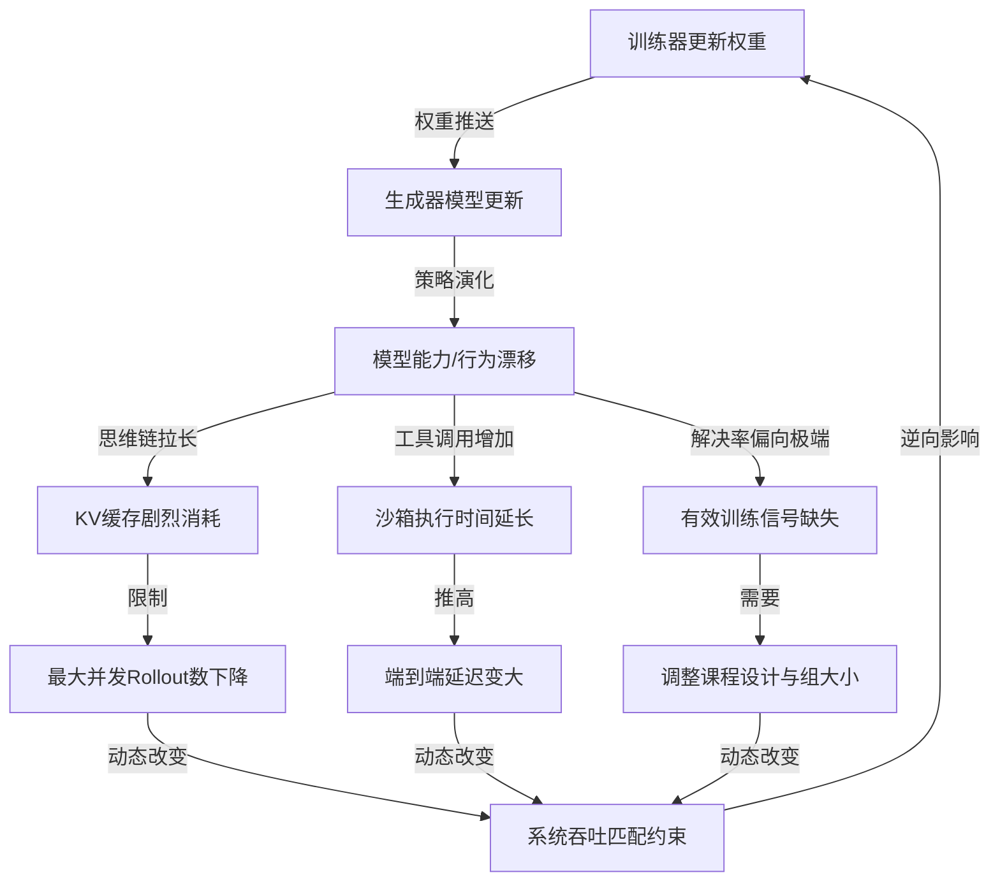

### 算力黑洞：强化学习缩放定律背后的效率困局

在当今的大语言模型行业中，**强化学习**（Reinforcement Learning: 通过奖励机制引导模型学习的训练方法，简称 RL）正成为推动模型能力向极限迈进的关键引擎。随着 **代码智能体**（Coding Agent: 能够自主编写、运行和调试代码的 AI 代理系统）成为有史以来增长最快的 B2B SaaS 赛道，根据行业最新测算，目前全球头部六家厂商的 **年度经常性收入**（Annual Recurring Revenue: 按年计算的软件订阅服务收入，简称 ARR）合计已经超过了 300 亿美元，且到今年年底有望突破千亿美元大关。这些前沿 AI 系统所展现出的惊人能力，并不完全来自前期的 **预训练**（Pre-training: 基于海量无标注文本进行的自监督学习阶段），其后训练阶段的强化学习才是彻底激发和释放模型解决复杂任务能力的核心功臣。

例如，最新的 **Claude Opus 4.8**（Claude Opus 4.8: Anthropic 研发的高性能大语言模型）在评估真实软件工程能力的基准测试 **SWE-bench Pro**（SWE-bench Pro: 评估大模型解决真实 GitHub 软件工程问题能力的基准测试）上取得了 69.2% 的得分，而在 **Terminal-Bench 2.1**（Terminal-Bench 2.1: 评估大模型在终端命令行交互与系统操作能力的基准测试）上的得分也达到了 74.6%。在这一连串亮眼成绩的背后，强化学习训练是拉高分数的关键底座。

业界甚至提出了 **强化学习缩放定律**（RL Scaling Law: 随着强化学习阶段计算量和训练时长的增加，模型性能呈现对数线性增长的规律），认为强化学习能像预训练一样，通过持续堆叠算力实现模型能力的对数线性增长。然而，在这种乐观预测的背后，很少有人提及绝大多数强化学习训练系统中的算力浪费情况。许多团队投入了成百上千张 GPU 进行强化学习训练，但最终训练端的实际算力利用率可能只有 10% 出头。这种灾难性的低效并非源于训练算法本身的计算缺陷，而是在于生成端与训练端之间严重的吞吐量不匹配。为了突破这一瓶颈，我们需要基于系统设计的底层逻辑，对整个训练链路进行全面重构。

---

### 三位一体：开源强化学习训练系统的基本构成与算法机制

要攻克强化学习训练的效率难题，必须首先理解一个典型的开源强化学习训练系统的基本构成。该系统通常由三个核心组件精密配合而成，它们分别是：**生成器**（Generator: 负责根据提示词执行模型推理并生成补全结果的模块）、**强化学习环境**（RL Environment: 负责运行模型生成内容并给出奖励分数的外部执行环境，常为沙箱）以及**训练器**（Trainer: 负责接收样本并更新模型权重的训练引擎）。

*   **生成器**：其核心职责是针对数据集中的提示词执行大模型推理，生成对应的**完整轨迹**（Rollout: 提示词加上模型生成的完整回答的序列组合）。与传统的预训练或有监督微调不同，强化学习的数据集通常只提供初始的提示词，不提供任何标准答案。这意味着，所有的训练信号都必须依靠系统在运行过程中自主生成。
*   **强化学习环境**：在生成器输出 Rollout 的过程中，它需要不断与外部的强化学习环境进行交互。环境会根据 Rollout 包含的具体行为给出相应的奖励分数。例如在代码生成任务中，强化学习环境表现为在隔离的沙箱中执行模型生成的代码，并通过测试用例的通过率来返回客观的奖励分数。
*   **训练器**：该模块负责收集生成器产出的 Rollout 及其对应的环境奖励分数，随后对模型进行梯度计算与参数更新，产出全新的模型权重。最后，训练器将最新的权重推送给生成器，完成一个强化学习训练步的闭环。

在算法层面，目前开源领域的黄金标准是**组相对策略优化**（Group Relative Policy Optimization: 通过在同组采样样本间计算相对优势来优化策略的强化学习算法，简称 GRPO）。作为绝大多数开源权重模型进行强化学习训练的事实标准，GRPO 的底层数学逻辑十分直观：针对同一个提示词，生成器会采样并生成多个不同的补全结果，从而形成一个 Rollout 组。系统会对这组内的每一个样本进行评估并打分，得到对应的奖励值。

接着，算法会计算每一个 Rollout 的**优势函数**（Advantage Function: 衡量特定样本的奖励较之同组平均奖励之优劣程度的指标），即该样本的奖励值与当前组内所有样本平均奖励值之间的差值。通过这种设计，比组内平均水平优秀的样本会被强化，而比平均水平差的样本则会被抑制。

然而，GRPO 的这种机制引入了一个致命的吞吐限制：如果在一组 Rollout 中，所有样本得到的奖励分数完全一致，那么每个样本计算出的优势都将精确为零。此时，这组数据将无法产生任何梯度更新信号。这种现象完全由同组样本的奖励分布决定。当任务过于简单导致所有 Rollout 都完美通过，或者任务过于困难导致所有 Rollout 全数失败时，解决率会极度接近 100% 或 0%，使得整组生成的样本在计算上毫无价值。这就要求我们在系统架构设计上，必须具备应对零优势样本过滤的动态调度能力。

---

### 异步演进：从策略梯度同步控制到流水线异步更新

在经典的强化学习算法设计中，**策略梯度**（Policy Gradient: 通过计算策略概率梯度以最大化期望奖励的强化学习算法类）算法默认同一组内的所有 Rollout 必须来自于完全相同的策略版本，即基于同一套权重参数的模型。在系统执行逻辑中，这意味着生成器在完成当前批次的所有 Rollout 采样之前，训练器绝不能更新模型权重；而一旦训练器先一步完成了权重计算，它也必须挂起等待生成器完成新的采样。这种同步执行模式造成了严重的硬件等待时间，大幅拉低了系统的整体吞吐效率。

为了打破这种相互等待的僵局，**流水线强化学习**（PipelineRL: 允许模型训练与样本生成在时间上重叠的异步强化学习调度框架）应运而生。它在训练系统中引入了异步机制，允许训练器在生成器依然在进行推理生成的过程中，就直接将新计算出的模型权重推送过去。这种**在途权重更新**（On-the-fly Weight Update: 训练器在生成器推理中途动态推送更新权重）使得生成器和训练器的执行时间线能够高度重叠，最大化了 GPU 的计算饱满度。

然而，异步机制并非没有代价，它直接引入了**策略陈旧性**（Policy Staleness: 生成器样本对应模型版本与当前训练器模型版本的差异度）问题。由于权重更新是异步且并行的，训练器当前消费的样本，可能是由几个版本之前的旧模型策略生成的。学术与工业界的研究表明，强化学习算法在一定范围内能够容忍策略的陈旧，但一旦样本过旧，模型就会因为数据偏差过大而导致训练发散或失效。

本质上，流水线强化学习就是在满足特定策略陈旧性预算约束的前提下，进行的一种吞吐量匹配设计。它允许训练器和生成器在安全的时间窗口内以各自的最大速度异步运行，从而成为了现代大规模强化学习训练系统优化中不可或缺的基石。

---

### 沙箱重构：容器化强化学习环境的系统级挑战

在代码和智能体任务中，强化学习环境的具体承载形式是容器化的**沙箱**（Sandbox: 一种隔离的安全代码运行环境）。根据评测任务复杂度的差异，沙箱的底层实现可以从极轻量级的 **Firecracker**（Firecracker: 专为无服务器计算设计的轻量级微虚拟机）微虚拟机，一直延伸到提供完整硬件模拟的 **QEMU**（QEMU: 支持完全系统模拟的开源托管虚拟机）虚拟机系统。在强化学习大规模高并发的场景下，沙箱基础设施面临着三项极其严苛的系统级挑战：

首先是**交互延迟**（Interaction Latency: 模型与运行环境之间交换数据并等待反馈的往返时间）。生成器与沙箱的频繁交互时间会直接拖累 Rollout 的端到端延迟，其中沙箱的启动延迟占了极高的开销比重。为了优化这一指标，像 **Modal**（Modal: 提供无服务器 GPU 及高并发计算托管的平台）这样的前沿沙箱服务商，通常会采用**内容寻址缓存**（Content-Addressable Cache: 基于内容哈希对文件和运行状态进行快速检索与复用的缓存技术）等技术，通过复用基础镜像和依赖层，将沙箱的冷启动时间压缩至毫秒级。

其次是**规模化伸缩**（Scale-Out Elasticity: 基础设施随并发需求变化动态调整计算资源容量的能力）。沙箱的活跃实例数量必须随着并行 Rollout 的生成进度实时伸缩。然而，随着生成过程中某些分支被提前剪枝或者顺利完成，活跃沙箱的数量会在极短时间内产生剧烈波动，这对底层的编排调度系统提出了极高的动态并发调度要求。

最后是系统的**健壮性**（Robustness: 系统在面对异常输入或运行错误时保持稳定和恢复的能力）设计。在强化学习的探索阶段，模型极易产生各类无法预测的极端异常行为。例如，模型可能会陷入死循环并疯狂执行写操作，在几秒钟内一次性创建数百万个垃圾文件，瞬间占满沙箱的磁盘和内存空间，进而导致整个物理节点发生故障。因此，沙箱编排基础设施必须部署完善的实时监控与隔离机制，能够敏锐检测出此类资源耗尽故障，并在其蔓延前自动将其终止并重置。

---

### 队列健康度管理：强化学习训练系统吞吐匹配模型

为了定量优化整个强化学习系统，我们可以将端到端的训练流程抽象为一个经典的队列模型：生成器源源不断地向队列中输入 Rollout 样本，而训练器则持续从队列中拉取样本进行消费。

*   当生成器的生产速度落后于训练器的消费速度时，队列会被瞬间抽空，导致训练器因饥饿而陷入**空转时间**（Idle Time: 硬件处于等待状态而没有进行有效计算的时间）。
*   当生成器的速度远超训练器时，队列会迅速积压，导致后续排队的样本版本严重落后于最新策略，从而引爆策略陈旧性风险。

因此，追求极致效率的 RL 训练系统，其核心目标就是实现两端吞吐量的动态对齐。

#### 训练器消费吞吐的计算与优化

训练器的消费速率主要由其每步处理的样本数量以及单步训练时间共同决定。计算公式可表示为：

$$\text{消费速率} = \frac{\text{单步总样本数}}{\text{单步训练时长}}$$

在硬件利用率层面，我们通常使用**浮点运算利用率**（Model Flops Utilization: 衡量硬件实际执行浮点运算占理论峰值比例的指标，简称 MFU）来评估计算的紧凑程度。影响消费吞吐的关键系统因子包括：

*   **并行策略配置**：在超大规模模型下，通常需要混合使用**张量并行**（Tensor Parallelism: 将单层参数拆分到不同 GPU 进行并行计算的技术，简称 TP）、**流水线并行**（Pipeline Parallelism: 将模型的不同层分配到不同 GPU 串行处理的技术，简称 PP）、**数据并行**（Data Parallelism: 将不同数据分发到多个 GPU 副本同时计算的技术，简称 DP）以及**专家并行**（Expert Parallelism: 在混合专家模型中将不同专家分配到不同 GPU 上的技术，简称 EP）。
*   **内存优化技术**：如**全分片数据并行**（Fully-Sharded Data Parallelism: 将模型参数、梯度及优化器状态分片存储于所有数据并行节点的优化技术，简称 FSDP）、**内存卸载**（Offloading: 将暂不参与计算的参数或状态从显存转移至系统内存或 CPU 的技术）以及**激活检查点**（Activation Checkpointing: 通过在反向传播时重新计算前向激活值以节省显存的技术），这些技术虽然能显著降低显存占用，但也会通过增加通信或计算时间来动态改变训练步长。

#### 生成器生产吞吐的计算与优化

生成器的生产速率则由并发 Rollout 数量与端到端生成延迟的比值来决定。端到端延迟可以拆解为大模型推理时间与沙箱交互时间之和。在硬件显存预算内，生成器的最大并发 Rollout 数直接受到 **KV缓存**（Key-Value Cache: 用于缓存 Transformer 注意力机制中键值矩阵以避免重复计算的显存技术）容量的制约。

可用显存容量的计算方式为：

$$\text{可用KV缓存显存} = \text{显卡总显存} - \text{模型权重占用} - \text{激活值占用}$$

为了极大化有效生产率，系统必须采用以下前沿优化手段：

1.  **PD分解**（Prefill-Decode Disaggregation: 将大模型推理的预填充阶段与解码阶段剥离到不同 GPU 节点上运行的优化架构）：由于预填充阶段是计算密集型，而解码阶段是访存密集型，将其在物理上分离部署，可以显著改善各自的硬件执行效率，避免解码任务被庞大的预填充请求阻塞。
2.  **早期剪枝**（Early Pruning: 根据预设条件提前终止无希望 Rollout 生成的控制策略）：根据运行时的中间验证状态或价值函数估算，提前砍掉必定失败的生成路径，立即释放其占用的 KV 缓存资源。
3.  **自适应采样**（Adaptive Sampling: 根据样本质量动态调整采样比例与生成数量的调度技术）：利用在线的优势过滤机制，主动拒绝生成低质量或冗余的样本，确保送入队列的都是高信息量的有效数据。

---

### 反馈环路：模型能力提升与行为漂移对系统约束的逆向改变

在强化学习训练中，最独特且最棘手的一点在于：**模型本身的能力与行为是系统设计中的最大自变量**。随着训练步数的推进，模型策略不断演进，这会反过来剧烈改变系统各模块的物理约束，形成一个复杂的动态反馈环路。

*   **模型解决率的变化**：随着模型的成长，其解决特定任务的成功率（即解决率）会发生漂移。如果课程设计未能及时跟进，导致任务相对于模型能力变得过分简单或过分困难，同组样本的奖励就会变得过于均一，导致优势过滤后产生的有效样本吞吐归零，使训练器因没有高价值的训练信号而陷入瘫痪。
*   **思维链推理的副作用**：强化学习为了寻求更优的解题路径，往往会自发激发模型的**思维链**（Chain of Thought: 引导大模型输出中间推理步骤以提高复杂任务准确率的提示与训练技术，简称 CoT）能力。这会导致模型在后续训练中倾向于输出极其冗长且繁琐的推理步骤。这种行为漂移会使平均输出序列长度急剧飙升，瞬间蚕食掉生成器极其宝贵的 KV 缓存空间，导致生成器的并发度断崖式下跌，端到端延迟严重拉长。
*   **工具调用行为的改变**：模型在学习过程中可能会越来越频繁地调用外部工具。每一次工具调用都对应着一次与沙箱的交互，调用次数的翻倍意味着沙箱执行耗时的成倍增加，甚至会因为更复杂的越界操作显著推高沙箱的错误率，彻底打破原有的吞吐平衡。这要求强化学习系统必须具备感知这些特征漂移并动态调整资源配置的韧性。

---

### 实践解密：四大真实强化学习训练系统案例分析

为了深入探索上述理论在实际工业训练中的具体表现，我们梳理了四组基于前沿大模型与真实系统框架的实测训练案例。

#### 案例一：长模型响应与早期探索阶段的训练

*   **测试模型与配置**：本案例采用 **Qwen3-235B-A22B-Thinking**（Qwen3-235B-A22B-Thinking: 阿里开源的具备长思维链推理能力的大规模混合专家模型），训练使用 BF16 精度，生成端使用 FP8 低精度版本以提升推理吞吐。
*   **硬件部署**：
    *   **训练端**：部署 64 张 H200 GPU。应用 FSDP 与 8 路专家并行（EP8），优化器状态与激活值全部卸载到 CPU 内存。
    *   **生成端**：部署 192 张 GPU（算力规模为训练端的三倍）。划分为 24 个独立的推理实例，每个实例配置为 1 路数据并行、8 路张量并行（TP8）与 8 路专家并行（EP8）。
*   **任务与系统参数**：全局批次大小设为 512 个样本，GRPO 组大小为 16（即每个提示词采样 16 个 Rollout），每次分派 32 个问题。最大序列长度限制为 32K，最大策略陈旧性阈值设为 16 步。RL 环境采用 Mini SWE Agent Plus 搭配 Prime Intellect 沙箱，整体框架运行于 Prime RL 之上。
*   **性能表现与瓶颈分析**：
    该案例体现了两个效率杀手：一是模型长思维链推理带来的超长输出，二是基座模型在探索初期的表现低迷。长思维链不仅推高了平均推理时长，其极高的延迟方差还在组内引入了严重的尾延迟效应（最慢的那个 Rollout 拖慢了整组的产出时间）。
    为了应对这一尾延迟，系统在生成端开启了过采样机制，主动派发超额的 Rollout，并在满足 16 个有效样本后强行掐掉其余 60% 的在途任务。此外，由于课程任务对初始模型偏难，在第一步训练后，完全未能解出问题的零优势 Rollout 组比例激增，导致有效的生成吞吐量大幅滑坡。
    最终，系统表现为极端的**生成受限型**。生成端以 1.95 样本/秒的速度运行，而训练器的实际消费吞吐仅为 2.75 样本/秒，且有 30% 的时间在眼巴巴地空转等待数据，导致训练器的 MFU 跌至可怜的 10.5%。

#### 案例二：频繁工具调用和简单任务的场景

*   **测试模型与配置**：采用 **GLM-5**（GLM-5: 智谱 AI 研发的高性能大语言模型系列）模型，同样采用训练 BF16、生成 FP8 的混用模式。
*   **硬件部署**：
    *   **训练端**：部署 128 张 H200 GPU。采用 FSDP、2 路上下文并行（CP2）以及 8 路专家并行（EP8），优化器状态执行 CPU 卸载。
    *   **生成端**：部署 128 张 H200 GPU。采用 PD 分解架构，划分成两个 64 卡的推理副本体系统，其中 32 张卡专门负责预填充，另外 32 张卡负责解码（两端均配置 TP32 与 EP32）。每个节点额外挂载 1TB 的本地内存用于 KV 缓存的卸载缓存。
*   **任务与系统参数**：批次与组大小同案例一，最大序列长度放宽至 64K，最大陈旧性预算为 16 步。
*   **性能表现与瓶颈分析**：
    在此实验中，效率的主要挑战在于模型行为的严重漂移，以及课程任务过于简单。在训练进行到中期时，模型的单轮平均回复长度和工具调用频次疯狂增长了近三倍（工具调用由起初的平均 20 次暴增至 51 次），导致整体序列长度被极度拉长，推理特征全面倒向了由巨量上下文输入引起的预填充主导型。
    幸运的是，生成端部署的 PD 分解架构发挥了核心作用，成功压制了预填充请求的首 Token 延迟恶化。然而，由于当前课程任务对模型来说过于简单，平均有 55% 的提示词所采样的 Rollout 组全部获得了满分通过。这种同组全通的分布没有带来任何优势方差，导致大批生成的样本被自适应过滤器直接丢弃。
    这导致系统的生成受限状况雪上加霜：虽然生成器看似源源不断地吐出样本，但其中大部分属于无效数据。训练器有高达 74% 的时间处于无数据可跑的闲置状态，其潜在的消费速率是生成器实际有效输出率的 5 倍以上。

#### 案例三：沙箱的规模化挑战

*   **测试模型与配置**：采用 **Qwen3 235B Instruct**（Qwen3 235B Instruct: 阿里开源的指令微调版大规模模型），采用统一的 FP16 精度进行两端部署，硬件升级为 NVIDIA GB300 架构。
*   **系统与环境**：基于 verl 框架搭配 uni-agent Rollout 实现，RL 运行环境为 SWE-bench 风格的代码验证环境，搭配 Modal 云端分布式沙箱进行规模化供给。算法为 GRPO，最大序列长度设定为 128K。
*   **伸缩阶段设计**：实验经历了三个递进阶段。训练端显卡资源从 32 张扩容至 48 张，生成端保持 24 张 GPU 不变，并发 Rollout 数从初始的 96 逐步提升至 360，最高尝试摸底 960 吞吐。
*   **性能表现与瓶颈分析**：
    该案例在将并发 Rollout 数量推高至 960 时，直接撞上了沙箱基础设施的物理极限。虽然提升并发有助于增加奖励的采样方差，从而提取更高质量的训练信号，但在 960 个并发 Rollout 的背景下，系统需要瞬时调度并维持至少 960 个活跃的隔离沙箱容器。
    这直接导致 Modal 沙箱平台报出初始化死锁错误，部分发生故障的沙箱冷启动延迟甚至被拉长到了 1 小时级别。同时，由于长思维链导致 3% 到 8% 的采样触及了 128K 的极限长度，尾延迟被无限放大，在第九个训练步时，最慢的一个沙箱 Rollout 竟然耗时 7500 秒。
    这最终迫使实验人员不得不将并发砍回到 96 以维持沙箱的正常运转，而这也直接导致生成速率暴跌，训练器空转时间在 30% 到 60% 之间剧烈震荡，再次印证了沙箱的弹性扩容和健壮性设计才是制约整体效率的“隐形短板”。

#### 案例四：部分Rollout和有状态沙箱的设计

*   **测试模型与配置**：采用 Qwen3-235B-Thinking 的 FP8 低精度版本，训练端使用 BF16 精度。
*   **硬件部署**：训练端配置 32 张 H200 GPU，生成端配置 64 张 H200 GPU（分为 8 个推理副本），最大序列长度限制为 32K，全局批次大小为 64，算法为 GSPO。
*   **系统与环境**：运行于 slime 框架之上，RL 环境为基于 OpenHands 框架和 Modal 沙箱部署的 SWE-bench 验证与轻量任务集。
*   **性能表现与瓶颈分析**：
    本案重点展示了 slime 框架引入的**部分Rollout**（Partial Rollout: 允许将运行缓慢或未完成的生成样本状态挂起，置入重放缓冲区，并在后续批次中恢复执行的控制技术）设计。在常规系统中，为了避免长尾延迟，系统往往会直接放弃那些掉队的 Rollout。而部分 Rollout 机制会把由于超时或被权重更新打断的未完成 Rollout 标记为中止，并将其上下文和当前状态塞进一个重放缓冲区，等待空闲时再拿出来继续生成。
    然而，这种设计对沙箱提出了全新的有状态挑战：由于 SWE-bench 类任务是有状态的，部分 Rollout 在被中止时，已经在沙箱的文件系统里修改了部分代码。这意味着沙箱必须跨批次持久化保留，并且需要一套复杂的映射机制来跟踪沙箱实例 ID 与挂起样本之间的绑定关系。
    另外，在恢复执行时，由于 SGLang 的默认清理机制，先前缓存的 KV 缓存已经被清空，导致重新激活时会产生一个巨大的预填充请求，从而对生成端的算力分配造成冲击。
    更深层次的代价在于**环境状态级陈旧性**（Environmental State Staleness: 异步训练中，被挂起的样本在恢复执行时，其面临的环境修改痕迹与当前模型最新策略之间存在版本代差的现象）。当被中止的 Rollout 在数步之后被重新唤醒时，训练器可能已经更新了数个权重版本。此时，最新的策略模型必须在一个由旧策略修改了一半、甚至自己永远不会如此修改的“污染”环境状态中继续生成。这会导致最终的优势归属产生偏差，从而在无形中污染了训练信号。

---

### 系统优化全景：控制队列输入与输出的艺术

综上所述，提升大模型强化学习训练效率的本质，就是对生成-训练队列健康度的精细化管理。在这场算力与吞吐的博弈中，各项系统优化技术各司其职，共同维系着整个系统的顺畅运转：

*   **队列的输入端控制**：过采样、早期剪枝和部分 Rollout 机制决定了什么样的样本、以怎样的完整度流入队列，其主要目的是在容忍尾延迟的前提下最大化生成端的实际吞吐。
*   **队列的输出端控制**：自适应采样和策略陈旧性预算则守护着队列的出口，负责过滤掉无意义的零优势样本，并确保送入训练器的梯度更新信号不会因为版本代差而导致模型崩溃。
*   **流控与速率匹配**：在途权重更新技术则作为生成器与训练器之间的减震器，允许两端在安全的陈旧性阈值内异步、全力运转。

强化学习训练的效率提升，早已超越了单纯的算法改进范畴，它是一场融合了并行计算拓扑、低延迟分布式沙箱基础设施以及模型行为感知的系统级战役。只有打通算法研发与系统工程之间的壁垒，构建出具备动态适配能力的强化学习基础设施，我们才能真正降服算力黑洞，彻底释放大模型自我演进的无穷潜力。