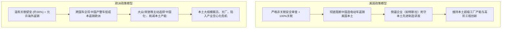
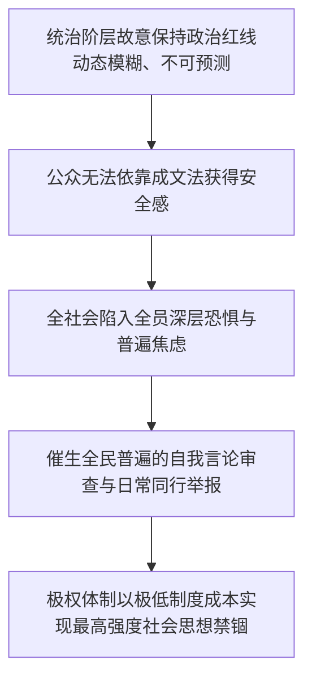

### AI赋能投资理财：四大协同应用场景

在当今**人工智能**（Artificial Intelligence: 模拟人类智能以执行分析、推理与决策的计算机系统）飞速发展的背景下，越来越多的投资者在日常生活与资产配置中引入了各种智能化辅助工具。对于普通投资者而言，如何在日常投资理财中合理利用人工智能软件，既提高研究决策的效率，又确保资金的安全性，是一个值得系统探讨的重要课题。必须明确的是，投资者不能对人工智能产生过度依赖，而应将其定位为一种提高研究效率、辅助逻辑验证的“合作者”。在实际操作中，投资者与人工智能软件的高频合作主要集中在以下四个核心业务场景：

在建立这种认知合作关系后，第一个最核心且应用最广泛的场景是**财报与基本面的全面解析**。在进行任何严肃的投资理财之前，投资者必须完成的第一步功课，就是对投资标的、相关企业的经营基本面、当前运营状态以及未来行业发展前景建立起清晰、客观且全面的认知。然而，普通个人投资者在自行研读上市公司财务报表或复杂的基金产品说明书时，往往面临两大痛点：其一是专业财务知识储备不足，面对密密麻麻的资产负债表、现金流量表与附注信息难以快速提炼关键逻辑；其二是受限于个人的主观阅读偏好与注意力分散，极容易陷入“挂一漏万”的认知陷阱，即把次要的公关辞令或非经常性损益看得过于认真，却忽视了主营业务利润率下滑、存货周转异常等核心财务风险。**生成式人工智能**（Generative AI: 能够通过对海量数据学习生成文本、分析报告的智能模型）能够严格按照成熟的专业财务分析框架与阅读逻辑，对上市公司的财务数据和理财产品合同条款进行标准化、结构化和全维度的扫描与拆解，这不仅能为投资者节省大量的案头梳理时间，更能有效杜绝由于疏忽导致的低级认知失误。

第二个关键应用场景是**市场纷繁资讯与宏观趋势的降噪过滤**。作为身处信息洪流中的投资理财参与者，个人投资者无时无刻不在受到各类外部噪音的干扰。市场上充斥着大量带有特定立场甚至故意诱导散户行为的干扰信息，例如市场上广为讨论的高盛等卖方机构报告常常被戏称为“反向指标”，部分卖方研究报告在发布特定行业或个股研报时，往往带有引导市场预期、促使散户接盘以掩护自身资产调仓的意图。与此同时，当重大的宏观经济数据发布时，不同立场、不同利益背景的市场参与者给出的解读差异极大。在面对这些既必须了解又充满噪音的信息时，投资者仅凭个人经验和直觉往往难以理清头绪。此时，利用中立的人工智能工具对海量新闻快讯、券商研报和政策解读进行多维度交叉对比与背景梳理，能够呈现出相对客观、清晰的脉络。例如在中国A股市场中，当**农业银行**股价出现大幅下跌时，市场舆论众说纷纭；如果官方宣布向国有银行和保险机构注资三千六百亿元，部分财经名嘴会将其片面解读为“国家全力支持、银行资本实力大幅增强”的绝对利好，而忽视这背后可能折射出的金融机构坏账压力与资本充足率隐患。借助人工智能对历史同类政策、注资背景及市场真实价格反馈进行中立复盘，能够帮助投资者迅速穿透舆论带风向的迷雾，看清市场波动背后的真实经济逻辑。

第三个应用场景在于**技术指标测算与交易策略辅助优化**。在量化分析与交易执行层面，人工智能能够为传统的投资模型提供富有启发性的优化参考方案。以个人投资者普遍采用的**标普500指数**（S&P 500 Index: 衡量美国500家具有代表性上市公司股票表现的基准指数）**定投策略**（Dollar-Cost Averaging: 在固定间隔期投入固定金额以平摊购买成本的投资方法）为例，传统的定期定额投资往往过于机械，完全忽略了市场短期内的极端波动与估值中枢偏离。通过引入人工智能算法，系统可以在大体维持长期指数定投纪律的前提下，结合宏观流动性指标与市场情绪周期，构建出动态优化的定投方案——例如在季度或半年的时间窗口内，将原本分散在各个月份的资金，根据超卖信号和估值分位数，集中配置在市场相对低估、情绪低迷的阶段。这种基于数据驱动的策略微调，能够在不显著增加额外择时风险的前提下，有效改善长期投资的综合回报率与抗风险能力。

第四个不可或缺的应用场景是**建立客观的投资对话机制与决策复盘**。人类在进行投资决策时，极易陷入心理学上的“**确认偏差**（Confirmation Bias: 人们倾向于寻找、解释和记忆符合自身既有信念信息的认知心理）”——一旦投资者预设了市场向好或某只股票必涨的立场，其视野就会被强化该立场的正面消息所填满，下意识地回避所有负面警示与下行风险。为了打破这种先入为主的自以为是，人工智能可以被赋予特定的辩论角色，充当投资者的反思镜子。投资者可以直接设定系统的对立角色，明确要求人工智能站在完全对立的空头立场，针对自己计划买入的标的列出全套看空与不买的逻辑。通过让人工智能充当反向思维的挑战者，迫使投资者全面直面自己未曾考虑到的重大风险隐患与逻辑断层。只要投资者自身具备基本的逻辑鉴别能力，不被简单的辩驳轻易带偏，这种反向思维的压力测试便能有效预防由于盲目乐观导致的严重投资误判。

---

### 人工智能投资决策的三大防范原则

在享受人工智能带来的研究效率提升的同时，投资者必须时刻保持清醒的风险防范意识。人工智能软件绝非百利而无一害的万能工具，若在实际使用中缺乏审慎评估，其固有的系统性缺陷可能会对资产配置造成实质性损害。具体而言，投资者在使用AI进行辅助投资时，必须严格遵守以下三大防范原则：

在建立人机交互界限的过程中，首要原则是**高度警惕人工智能的“幻觉”现象与虚假推理**。**大语言模型幻觉**（Hallucination: 人工智能模型在缺乏事实依据时生成看似合理却完全虚假事实的现象）是当前前沿生成式模型普遍存在的固有技术瓶颈。尽管目前的先进模型具备强大的自然语言推理与上下文综合能力，但在处理复杂的财经专业数据时，由于底层神经网络概率生成的本质，模型常常会在面对未知数据或缺乏信息源的情况下，自信地编造虚假数据、伪造不存在的财务指标或推导出毫无事实支撑的荒谬结论。在投资理财这种高度依赖数据真实性与精确度的严肃领域，虚假信息的误导可能是致命的。因此，一旦人工智能给出的分析建议诱发了投资者的交易冲动，促使其准备做出原本未计划的大额资产调仓时，投资者必须保持高度警惕，务必回归原始财报、官方公告及权威数据终端进行多方交叉核验，绝不能直接依据未经核实的人工智能输出进行盲目下单。

第二个必须严格防范的原则是**防范模型的“迎合倾向”与独立判断力缺失**。**人类反馈强化学习**（Reinforcement Learning from Human Feedback: 利用人类评估对模型生成内容进行偏好对齐的训练机制）在赋予模型极佳沟通技巧的同时，也使其内生出迎合用户主观意图的顺从倾向（Sycophancy）。当投资者在提问时无意间流露出自己的看涨情绪或投资偏好时，缺乏真正独立意识的模型会迅速捕捉到这种语境倾向，并在后续回答中堆砌大量利好论据以讨好用户，极力证明用户的直觉无比正确，同时淡化潜在风险。这种迎合机制不仅无法帮助投资者纠正认知盲点，反而会构建起更加致命的“信息茧房”与过度自信。投资者必须深刻认识到AI缺乏自主意识的本质，在交互中主动剔除主观诱导性措辞，确保输入语境的中立性。

第三个核心原则是**坚决摒弃习惯性盲从，明确工具的效率杠杆定位**。普通投资者必须在潜意识中建立起对AI工具的理性脱敏机制，切不可将其神化为包赚不赔的“预测神机”。**人工智能本质上只是放大人类研究分析效率的计算与归纳杠杆**，它的核心价值在于以超越常人的速度阅读海量文献、提炼核心观点和组织对比框架，但它并不具备预测未来金融市场不可知黑天鹅事件的能力，更不承担任何资产亏损的经济责任。投资理财的终极风险控制权与价值判断权，始终且必须牢牢掌握在投资者自己手中，必须坚决避免将投资成败完全寄托在算法建议上的幼稚思维。

---

### 结构化提示词策略：提升AI投资研判水平的四大提问技巧

人工智能输出结果的专业深度与逻辑严密性，在很大程度上直接取决于使用者输入提示词的质量与结构化程度。低质量、模糊不清的提问只会换来空洞泛化的平庸回答，而高标准的结构化**提示词工程**（Prompt Engineering: 优化向大语言模型输入指令以获得最佳输出效果的技术方法）则能最大限度激活模型的深度推理潜能。在投资理财场景中，经过实战检验的高效提问范式主要包含以下四类技巧：

在具体的实操交互中，第一种提问技巧是**明确设定高级专业角色与输出规范**。在向模型输入财报文本或市场数据之前，必须先为其设定具有高度专业壁垒的角色身份与语言风格约束。例如，不要使用泛泛的“请帮我看看这个财报”，而是采用标准化的角色设定指令：“**假设你是一位拥有20年从业经验的华尔街资深风险管理师（Senior Risk Manager），请以严谨、精炼、客观的专业商业语气，深度剖析以下财务数据中的偿债能力与现金流健康度。**”通过施加明确的高标准专业角色锚定，能够有效约束模型的词汇库与分析逻辑，迫使模型从合规审计、风险敞口与资本结构等专业维度组织输出内容，大幅提升分析报告的专业含金量。

第二种关键技巧是**强制模型执行分布推理，拆解复杂商业逻辑链条**。如果投资者直接向模型索取最终的投资结论（例如“这家公司值得买入吗”），模型往往会基于表层概率生成粗糙甚至武断的简单定性判断，这不仅极易产生误导，也彻底浪费了模型的深度分析能力。为了迫使模型展开详尽的**思维链推导**（Chain-of-Thought: 引导模型将复杂问题分解为多个中间推理步骤的技术方法），提问时必须明确禁止其直接下达结论，而是将分析任务切分为连续的逻辑步骤。例如：“**请不要直接给出买入或卖出的结论。请按照以下步骤逐步拆解分析：第一步，详尽分析该细分产业当前的全球供需格局与产能周期；第二步，深入评估行业龙头企业的核心护城河与技术壁垒；第三步，基于前两步分析推导该企业未来三年的业绩成长性与潜在下行风险。**”这种分步约束能够有效抑制模型的盲目推理冲动，确保每一个投资研判都建立在扎实的事实层与逻辑层之上。

第三种提问技巧是**引入“恶魔代言人”机制，主动发起逆向认知挑战**。**恶魔代言人**（Devil's Advocate: 在决策辩论中特意代表对立面提出反驳与质疑的批判性角色）机制是克服投资群体盲从与个人心理盲点的利器。当投资者对某一特定投资机会产生强烈兴趣、自认为发现了市场未曾发掘的重大利好时，底气不足往往源于对反向风险的未知。此时，应主动利用AI发起严苛的反向批判，提示词可设计为：“**我目前高度看好某细分赛道的长期发展前景，核心逻辑如下……请你完全站在空头机构与坚决反对者的立场，毫不留情地挑出我上述投资逻辑中最脆弱、最站不住脚的三个核心盲点，并提供具体的反驳论据。**”通过这种高强度的逆向逻辑博弈，如果发现模型指出的漏洞确实属于自己此前遗漏的系统性风险，即可及时刹车避免资本踩坑；若模型的反驳均在自身的风险对冲预案之内，则能进一步夯实投资决策的确定性。

第四种技巧是**构建多维矩阵，驱动多标的结构化对比**。当面临多个复杂的备选投资方案或竞品企业时，人类由于信息处理带宽有限，往往难以在多个指标间进行细致入微的横向比对，容易陷入“货比三家却力不从心”的分析惰性。利用人工智能强大的表格整理与跨维度综合能力，可以快速完成大体量的对比功课。例如输入：“**请从实际持有成本、资产流动性、税务处理效率以及行业市场占有率这四个核心维度，以 Markdown 表格的形式横向对比方案A与方案B的综合优劣势。**”这种结构化的横向比对能够将原本混杂在数百页招股书或产品手册中的零散信息瞬间可视化，帮助投资者在最短时间内看清不同资产标的在风险收益比上的实质性差异。

---

### 德国大众汽车巨震：中德制造成本悬殊与系统性竞争力重构

在关注个人微观投资工具的同时，全球宏观产业格局的剧烈重组正在为全球资本市场带来深远的影响。近期，欧洲汽车工业领头羊**大众汽车集团**（Volkswagen AG: 欧洲最大的汽车制造企业）宣布的重组计划引发了国际舆论的持续震荡。根据法新社与德国《图片报》获取的大众汽车内部机密文件，大众汽车已批准一项计划，拟在德国本土进一步裁减5万名员工，加上此前已达成协议的5万人，**总计裁员规模高达10万人**，这相当于大众全球员工总数的15%左右。而在这场波及十万人的全球大裁员中，大众汽车在中国的合资及独资工厂仅微调裁减约1600人，其在华制造体系几乎未受实质性波及。这种本土与海外业务截然相反的处理方式，彻底揭开了欧洲传统工业在全球化竞争中的深层困境。

在这份震撼欧洲政商界的大众内部文件中，一组关于单车生产成本与劳动生产率的核心数据展现了极其悬殊的对比：在大众位于德国本土的**埃姆登工厂**（Emden Plant），生产一辆同级车型的单车出厂制造成本高达**4850欧元**；而在大众位于中国**天津工厂**，制造完全同类的车型，其单车出厂成本仅为**1078欧元**。换言之，**德国本土工厂的单车生产成本是天津工厂的4.5倍之多**。深入拆解劳动力成本与工时效率可以发现，德国埃姆登工厂工人的平均**时薪高达74欧元**，而天津工厂工人的平均**时薪仅为12欧元**，德国工人的薪资水平是中国的6倍以上；与此同时，在工作时长方面，德国工人每年的**有效年工时仅为1282小时**，而中国工厂工人的**有效年工时则高达2065小时**。

```
+-----------------------------------------------------------------------+
|                       大众汽车制造体系核心数据对比                       |
+-----------------------------------------------------------------------+
| 指标维度             | 德国埃姆登工厂 (Emden)  | 中国天津工厂 (Tianjin) |
+---------------------+-----------------------+-----------------------+
| 单车出厂制造成本      | 4,850 欧元             | 1,078 欧元 (低 78%)    |
| 工人平均时薪         | 74 欧元                | 12 欧元 (低 84%)       |
| 工人年均有效工时      | 1,282 小时             | 2,065 小时 (高 61%)    |
| 本轮计划裁员规模      | 约 100,000 人 (全球累计) | 约 1,600 人           |
+---------------------+-----------------------+-----------------------+
```

面对如此悬殊的生产效率与成本鸿沟，西方舆论传统上习惯于将中国制造业的竞争优势轻描淡写地归结为单纯的人力便宜或所谓的“低人权优势”。然而，大众汽车内部报告所揭示的残酷现实表明，**真正的差距早已超越了纯粹的工资差异，而是整个工业制造系统与供应链生态的代际差异**。除了劳动力成本之外，中国在汽车核心零部件供应链完备度、大规模产能利用率、低廉的工业能源与高效物流网络、模块化产品研发周期以及庞大的产业集群协同等各个维度，均构筑起了全方位的综合成本护城河。德国汽车制造业即便自身与自身横向对比，其本土工厂也面临着无法逾越的成本劣势，单纯依靠欧盟针对中国电动汽车加征的30%左右关税，根本无法填平高达4倍以上的系统性生产成本代差。

面对这种不可逆转的比较劣势，大众汽车在德国本土采取的应对策略展现出了极大的战略妥协与收缩。其应对方案主要聚焦于大幅裁减本土高薪劳动力、削减在德生产车型数量以及粗暴降低产品配置复杂度。按照大众的长期规划，到2035年，其在德国本土生产的车型数量将直接削减50%，整车配置的复杂程度将被强制降低75%。这种试图通过“做减法”来勉强维持工厂运转的做法，虽然短期内能微幅提升单一车型的产线组装节拍，但从长远来看，大幅降低产品配置丰富度与多样性，势必会严重削弱其在终端消费市场的综合竞争力，甚至导致其在全球高端制造竞争中陷入更加被动的恶性循环。

---

### 特斯拉与大众的分野：生产范式革命与跨国政策壁垒

在审视欧洲传统车企深陷成本泥潭的同时，一个显而易见的对比是**特斯拉**（Tesla Inc.: 全球领先的电动汽车与清洁能源制造企业）在全球竞争中的截然不同表现。特斯拉并未出现通过大规模解雇美国本土工人来变相维持中国工厂运转的窘境，其在美国加州、德州超级工厂的扩产与研发依然保持着强劲势头。深度剖析特斯拉与大众汽车在战略路径上的分野，能够清晰折射出企业生产范式升级与国家经贸政策设计对制造业命运的决定性影响：

首先在生产制造范式层面，特斯拉通过前瞻性的**一体化压铸技术**（Gigacasting: 利用超大型压铸机将车身多个分散零部件一体化成型的先进制造工艺）、极简化的电子电气架构以及高度自动化的**超级工厂**（Gigafactory）制造模式，实现了生产效率的飞跃，从而将其美国本土工厂的制造成本与中国本土同行之间的差距压缩到了极小范围。尽管特斯拉与中国本土领军企业**比亚迪**（BYD Company Limited: 中国大型新能源汽车与动力电池制造商）之间依然存在一定的成本差异，但得益于极高的产线自动化率与工程创新，这种差距完全处于可控范围内。此外，特斯拉在上海超级工厂建立了超过96%的本土化零部件供应链体系，凭借高效的供应链周转实现了极具竞争力的**零库存管理**（Zero Inventory Management: 通过精准供应链协同使原材料与产成品库存最小化的精益生产方式），使其完全具备在最为内卷的中国市场与本土造车新势力正面缠斗的硬实力。

而在更深层次的产业政策与地缘政治博弈维度，美欧两地政府采取的完全不同的外贸政策规则，从根本上锁定了跨国车企的战略选择路径：



如上图所示，美国政府构建了极其严密且近乎绝对的贸易与技术准入壁垒。美国不仅对中国制造的电动汽车征收高达100%的惩罚性关税，更构筑了坚固的**非关税壁垒**（Non-Tariff Barriers: 关税以外通过技术标准、安全审查等限制进口的政策手段）——以智能网联汽车涉及国家数据安全为由，将中国制造的电动车定性为潜在的“移动数据收集器”，实施一票否决式的市场准入禁令。即使是拥有雄厚科技实力的**Waymo**（Alphabet旗下自动驾驶科技公司）从中国极氪汽车采购3200辆定制电动车用于自动驾驶车队，也必须在联邦政府的严密监管下，将车辆原装的所有数据收集与通信模块进行物理级拆解与系统彻底隔离重构。更重要的是，美国严格禁止特斯拉将其在上海超级工厂生产的整车返销美国市场，这一“政策断后”彻底打破了**埃隆·马斯克**（Elon Musk: 特斯拉首席执行官兼产品架构师）依赖中国低成本产能供应美国本土的任何幻想，迫使其必须在美国本土持续重金投入先进工厂与工程技术革新。

反观欧洲与德国的政策制定者，则陷入了严重的战略自相矛盾与认知滞后。欧盟不仅仅设定了根本无法阻挡巨大成本代差的30%左右温和关税，更在制度上全面允许跨国车企将在中国生产的车辆低成本返销回欧洲本土市场。这种宽松的政策退路极大地助长了欧洲传统车企高管层的战略惰性与投机心理。大众、奔驰、宝马等巨头纷纷高调提出“在中国，为中国”乃至全面“中国企业化”的战略口号，其管理层甚至公开设想：即使未来德国本土汽车制造业彻底衰落，企业只要彻底完成中国化转型，依然可以依托中国高效的低成本供应链向全球以及欧洲老家出口倾销汽车。这种看似“脚踏两只船”的跨国套利策略，本质上是以牺牲德国本土高端制造业根基、加速本土产业空心化为代价的自毁长城之举。欧洲制造业的危机与极右翼政治势力的抬头，正是这种决策层地缘政治麻木与产业政策严重失焦结出的苦果。

---

### 中国汽车产业的隐秘内伤：187天账期与供应链脆弱性

在看到欧洲传统车企深陷系统性成本危机的同时，客观看待产业全局同样需要审视中国汽车制造业在表面繁荣之下暗藏的深层次财务矛盾与系统性脆弱点。中国汽车工业并非完美无瑕，其狂飙突进的高速扩张背后正经历着极度残酷的内卷与不可持续的恶性竞争。

中国**工业和信息化部**与**国家市场监督管理总局**联合发布了针对汽车行业供应链支付规范的专项通知。根据《第一财经》的深度调查披露，截至今年8月底，中国主流整车制造企业的**应付账款周转天数**（Days Payable Outstanding: 企业从收到原材料到实际向供应商支付货款所需的平均天数）行业均值已经攀升至惊人的**187天**。这意味着，整车制造企业普遍将采购货款拖欠半年以上，已然演变成为整个中国汽车产业链心照不宣的普遍行规。尽管两部委在通知中严令要求规范账期管理，明确规定一般生产性物料应在3个工作日内完成验收、功能性零部件在5个工作日内完成双车验证，严禁少数车企通过故意推迟起算时间、设立繁琐流转流程等手段变相延长供应链账期，但这一顽疾的恶化态势依然令人心惊。

```
+-----------------------------------------------------------------------+
|                      中国汽车产业链应付账款账期演变                      |
+-----------------------------------------------------------------------+
| 政策/时间节点             | 监管要求/行业实际状态                       |
+--------------------------+--------------------------------------------+
| 历史整治目标 (工信部要求)   | 明确要求账款支付周期不得超过 60 天 (2个月)     |
| 典型整治案例 (前期行业整风) | 针对比亚迪"迪票"等代币化供应链金融工具进行监管 |
| 最新统计现状 (2026年8月底) | 主流车企应付账款周转天数均值达到 187 天 (超半年) |
+--------------------------+--------------------------------------------+
```

供应链账期从监管原本要求的60天极限，在短短一年多时间内不降反升，演变为普遍拖欠半年以上，深刻暴露出中国新能源汽车行业当前这种超高速增长背后所蕴含的自杀式内卷本质。整车厂为了在终端市场发起惨烈的价格战，强行将巨大的资金流周转压力向处于弱势地位的上游成千上万家零部件中小供应商转嫁。这种做法与特斯拉所推行的精益生产、零库存管理以及高度准时的供应链结款形成了鲜明对照。

这种全行业大面积拖欠账款的畸形生态，使得整条汽车产业链的抗风险韧性变得极为脆弱不堪。上游供应链企业长期处于微利甚至亏损垫资的悬崖边缘，一旦宏观金融信贷政策发生收紧转向，或者资本市场流动性出现风吹草动，极易在产业链上下游引发连锁性的资金链断裂与大规模供应商破产倒闭潮，其潜在破坏力甚至不亚于上世纪90年代困扰中国宏观经济的“**三角债**（Triangular Debt: 企业之间由于资金链断裂而形成的环形连环拖欠债务）”危机。因此，在评估中外产业竞争时，不能仅仅盯着终端组装成本的数字差异，更应清醒洞察其背后各自潜藏的制度成本与金融系统性风险。

---

### 中东地缘新变局：多方博弈与战略威慑边际递减

将视野转向国际地缘安全领域，中东地区近期接连爆发的多起冲突事件，再次为全球能源运输命脉与大宗商品市场蒙上了不确定的阴影。路透社相继报道了关于伊朗与以色列的两则最新军事动态，释放出极其强烈的局势复杂化信号：

第一项核心动态是**伊朗针对美军打击其核心战略资产发出的公开报复誓言**。在美军近期对伊朗关联武装实施精准打击、导致伊朗三艘巨型油轮沉没或严重受损后，伊朗官方公开发出强硬警告，宣称美军及其盟友在中东地区庞大的能源开采、生产与跨国输送设施完全处于其导弹与无人机的打击射程之内，若美国继续打击伊朗核心资产，伊朗必将对等摧毁美国的能源基础设施。然而，从战略博弈的实质层面分析，伊朗在蒙受巨额油轮资产损失后发出的这种高调威胁，恰恰暴露了其常规军事反制手段的匮乏与战略威慑力的边际递减，更多属于国内政治维稳与舆论宣泄层面的言语姿态。

第二项重要动态是**以色列军队在周一凌晨对黎巴嫩南部边境城镇发动了突发性空袭**，造成至少12名人员死亡。尽管以色列军方在事后声明中强调已采取包括使用高精度制导炸弹与多维度空中侦察等措施以最大限度减少附带损伤，并正在核查平民伤亡报告，但此次越境军事打击行动本身释放出了极为强烈的信号——此前美国政府为了防止中东战火全面外溢，曾对以色列在黎巴嫩方向的军事行动实施了极其严厉的外交施压与行动限制；以色列此次无视施压重新启动对黎巴嫩南部目标的高强度定点清除，标志着该区域的多方脆弱平衡再次被打破，也使得本就处于未停火状态的美伊暗战格局变得愈发扑朔迷离。

---

### 从天而降的政治红线：中共对内模糊治理与对外威慑悖论

在中国国内公共舆论场中，一则关于知名文化演艺人物的行政通报引发了全网的高度聚焦。根据香港《星岛日报》及中国官方媒体的公开报道，著名相声演员**郭德纲**因在2026年7月24日武汉举办的“济公活佛”商业相声专场演出中，将传统红色抗战经典电影《铁道游击队》著名插曲《弹起我心爱的土琵琶》中的一句经典唱词“微山湖上静悄悄”随口改编为“紫禁城中静悄悄”，遭到现场观众的政治举报。武汉文化执法部门在历经一个多月的调查后正式发布官方通报，定性其行为属于“歪曲、篡改抗战经典歌曲，造成恶劣社会影响”，并对演出主办单位和承办剧场下达了行政警告及罚款处分，对涉事人员予以严肃处理。受该事件影响，郭德纲自7月下旬以来的所有公开商业演出全部被迫延期或取消，其本人在整个8月份几乎完全从公众舞台与主流媒体视野中消失。

深入剖析这起看似寻常的文化审查事件，中国广大网民在社交平台上的热议焦点并非郭德纲改动的那句唱词在字面意义上到底触犯了哪一部具体的成文法条，而是惊愕于**这条无影无形的“政治红线”究竟是从何而来、为何总是“从天而降且神出鬼没”**。从文本本身审视，“紫禁城中静悄悄”既未包含任何明确的反动政治口号，也谈不上具有明确指向性的意识形态攻击，然而官方仅凭一句“篡改红歌”即可随时启动顶格处罚与全网封杀。这种现象深刻揭示了极权统治下政治红线的核心特征——**高度的不确定性、动态易变性与不可预测性**。

在专制极权统治的政治工程设计中，**让政治红线保持模糊不清与神出鬼没，本身就是一种经过深思熟虑的极权控制技术**。统治者故意不给公众提供明确、稳定、可预期的行为边界底牌，其背后的政治逻辑主要体现在以下三个核心层面：



如上述逻辑图所示，如果将红线清清楚楚地以法律法规或明确禁令清单的形式公示于众，社会治理便会自然走向制度化的**依法治国**（Rule of Law: 依据公开、确定且普遍适用的成文法律进行社会治理的法治原则），民众便能清晰地知道只要不越过明文界线就是绝对安全的，这反而会大幅消解民众对最高统治权力的本能敬畏。相反，正是因为红线随政治风向、国际局势乃至最高领导人的个人喜怒无常而不断无序漂移，社会大众在日常交流中才不得不时刻处于提心吊胆的自危状态。这种机制在全社会范围内成功训练出了高度发达的“自我审查机制”与亲友间的互相噤声监督，乃至家庭内部聚餐时都会出现长辈严厉制止晚辈讨论特定公共话题的自发维稳现象。统治阶层通过保持红线的绝对模糊，以最低的行政执行成本换取了对全社会思想意识形态的最大化深度规训。

更具讽刺意味的是，中共在政治红线的运用上呈现出了一种极其荒诞的**内外二元悖论**（Duality Paradox of Red Lines）：

```
+-----------------------------------------------------------------------+
|                      中共红线治理的内外二元悖论对比                      |
+-----------------------------------------------------------------------+
| 对比维度   | 对外外交博弈 (如美台关系/核心利益) | 对内社会控制 (如郭德纲事件/言论审查) |
+-----------+---------------------------------+---------------------------------+
| 划线方式   | 事先大张旗鼓、高调敲锣打鼓划定   | 事前绝不明示、刻意保持动态模糊   |
| 边界特征   | 边界看似明确但被踩后不断退让后移 | 边界完全隐形、事后突然宣布触线惩戒 |
| 威慑效果   | 屡被践踏沦为国际笑柄（纸老虎）   | 制造全社会人人自危的深层恐惧     |
| 政治功能   | 民族主义内宣动员、虚张声势       | 驱动全民自我审查、实现极权维稳   |
+-----------+---------------------------------+---------------------------------+
```

在对外与美国、西方打交道以及处理台湾问题时，中共生怕外部世界不知道自己的底线，唯恐对方不当回事，总是极其高调地提前敲锣打鼓画出无数道“绝对不可逾越的红线”。从早年频繁强调的“核心利益”到如今泛滥成灾的各种外交红线，一旦对方大步踩过红线，北京往往只能无可奈何地选择自我找补、向后退步重新再画一道更新的红线，使对外红线沦为国际外交舞台上的“纸老虎”与笑柄。然而在面对国内手无寸铁的普通民众与知识分子时，中共则展现出了极度傲慢与冷酷的权力自信——事前绝不出台任何禁止改编的明确清单，让公众在日常生活中战战兢兢地盲猜“领导最近的喜好与政治风向”；一旦某些言行触犯了当局的潜在神经，便会突然以雷霆万钧之势事后宣布其“踩踏红线”并施加毁灭性打击。郭德纲改词被罚这一典型事件，正是这种将模糊红线作为内部统治致命暗器的生动写照。

---

### 外储攀升与汇率困局：人民币“温水煮青蛙”的大变局前夜

在宏观经济与金融资本博弈的最顶层，中国最新的外汇储备数据与汇率走势正在酝酿着一场可能重塑全球贸易格局的风暴。根据《华尔街日报》援引**中国人民银行**（People's Bank of China: 中国的中央银行）发布的官方数据，2026年8月份，中国外汇储备规模单月大幅**增加195.5亿美元**，使得国家外汇储备**总额攀升至34,380亿美元**，这一强劲表现显著超出了华尔街此前普遍预测的34,250亿美元预期中值。

在这一连串亮眼数字的背后，国际地缘经济矛盾正在急剧激化。当前全球主要经济体的宏观政策制定者普遍认为，中国在全球制造业中的贸易顺差与外储飙升，在很大程度上得益于其政府长期向本土制造业提供的不公平高额财政补贴，以及**人为故意维持低估的人民币汇率**。在刚刚结束的二十国集团（G20）峰会上，除中国以外的所有成员国罕见地达成高度共识，联合签署了一份措辞严厉的主席声明，集中火力批评北京长期依赖出口导向型经济增长模式对全球工业生态造成的冲击，并将国际舆论与政策反制的核心焦点重新对准了被严重低估的人民币汇率。包括德国候任总理**弗里德里希·默茨**（Friedrich Merz: 德国资深政治家，基督教民主联盟领袖）在内的西方多国政要多次公开发表声明，指责中国为了维持廉价商品倾销优势，蓄意将人民币汇率低估了近30%，并强烈要求北京开启高层汇率重估对话。

深入拆解最新公布的外汇储备结构与跨境资金流向，能够提炼出以下三个值得深度研判的核心趋势：

第一是**中国出口强劲数据与人民币低估争议形成的国际共振**。根据路透社的前瞻预测，中国即将公布的8月份海关外贸出口数据仍将呈现超预期的大幅度扩张，巨大的贸易顺差正在推动外汇储备以不可阻挡之势持续攀升。这种极度亮眼的贸易顺差客观上为西方乃至广大发展中国家指责中国输出过剩产能、操纵汇率提供了无可辩驳的数据铁证。然而诡异的是，北京当局似乎完全无意通过技术性修饰或调节数据来平息国际社会的怒火，这种近乎明目张胆的数据展示，正在将全球主要贸易伙伴推向加速筑起全方位贸易壁垒的极端对立面。

第二是**外汇储备结构微调背后的战略妥协与资本困局**。在中国国内媒体对官方连续第23个月增持黄金储备进行大肆宣传的同时，专业机构通过底层资产结构穿透发现，中国在过去几个月里正在**悄然重新大幅增持美国国债**。这一动向与此前中国央行为了遏制人民币在离岸市场过快升值、暗中指令各大型国有商业银行吸收美元存款并在海外直接配置美债的监管操作完全吻合。在经历了过去两年多近乎意识形态式的单向减持美债之后，中国外储面临着天量贸易顺差美元“无处可去、缺乏高流动性安全承载资产”的现实困境，被迫在资产配置端重新向美债回流；这究竟是为未来中美元首高层会晤所做的权宜性善意释放，还是彻底宣告此前脱钩式外汇管理策略的重大挫败，构成了国际资本市场极为关注的关键看点。

第三是**人民币汇率面临的不可逆升值压力与“温水煮青蛙”式的经济大震荡**。当前，不仅美欧等传统发达经济体强烈施压要求人民币升值，甚至与中国经贸往来密切的“全球南方”发展中国家也深感本国工业遭受低价倾销冲击，同样加入了要求人民币汇率合理重估的阵营。高盛等华尔街主流投行普遍预计，中共为了避免彻底引爆全球贸易制裁，很可能会被迫采取“年均升值3%至5%”的渐进式妥协策略。然而，国际政治围堵的巨大外部压力与北京维持出口基本盘之间的剧烈博弈，极有可能引发超出各方预期的汇率突变。华尔街目前设立的核心风向标在于**明年年中（甚至不排除提前至今年年底），人民币兑美元汇率是否会被迫实质性突破并升值至 6.3 至 6.4 的关键敏感区间**。

一旦人民币被迫在短期内完成这种结构性的汇率大幅升值，当前完全依赖低汇率和退税补贴苦苦支撑的中国传统出口制造业将面临毁灭性的利润绞杀，伴随而来的将是外贸产能的大面积关停与不可估量的社会就业震荡。中国整体宏观经济与汇率政策目前正处于典型的“温水煮青蛙”危险境地，这无疑是未来数年内所有从事全球资产配置的投资者与密切关注中国经济走向的人士必须高度警惕的顶级系统性变量。