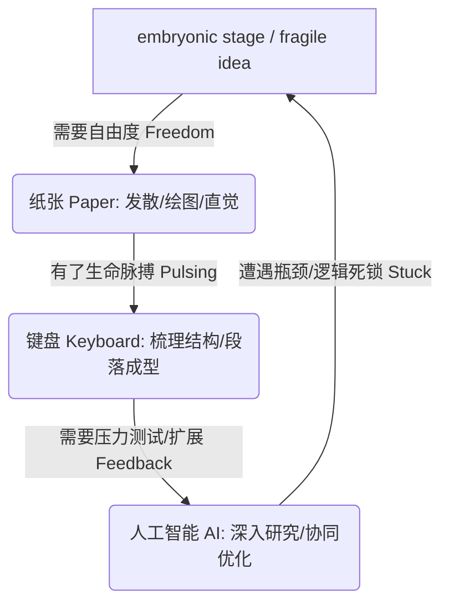

### 手脑协同：笔尖下的神经激活与思维重塑

在人工智能以秒为单位生成海量内容的时代，我们正面临着一种隐秘的认知危机：我们**提问**（prompting）的频率远超我们**产出**（producing）的深度。当我们将思考外包给机器，只在机器投喂的选项中进行筛选时，我们实际上是在“租用”思想，而非真正“塑造”它们。

神经科学与认知心理学的最新研究表明，**纸笔书写**（writing on paper）并不是一种低效的复古行为，而是一种无可替代的思维塑造过程。挪威科技大学（NTNU）的研究发现，当我们手写时，大脑中被激活的区域与负责产生创意、记忆和学习的区域高度重合。

从物理动作的维度来看，打字时每次敲击键盘（无论是输入情书还是法律文书）的手指运动都是完全相同的，这虽然提升了速度，却剥夺了身体的参与感；而手写则不同，笔尖的压力、笔画的速度以及每个字母独特的弧度，构成了一种**触觉感知**（Haptic Perception：通过触觉和身体运动来获取并处理信息的机制）。大脑会将每一个概念标记上独一无二的感官指纹，让思想不仅停留在纸面，更融入你的身体记忆中。

即使是简单的随手涂鸦，也能显著降低体内的皮质醇水平，缓解表现焦虑。达芬奇留下的7000多页手稿、达尔文推演进化论时的草图、以及J.K.罗琳在爱丁堡咖啡馆靠救济金度日时手写下的《哈利·波特》初稿，都证明了这一块简单的白纸和一支笔，正是最原始也最强大的思想孵化器。

Original English Source

If you want to think more clearly than 99% of people, learn more quickly, and master almost anything in the age of AI, you need to bring back one forgotten skill. How to think on paper. I've spent decades in boardrooms and tech companies worth billions, and the sharpest thinkers I know still reach for pen and paper. So, in this video, I'm going to share a complete system for how to think, how to learn, how to create using the most powerful thinking tool you already own. One that costs you a dollar. Sure, paper will not replace your keyboard or AI today, but it can make you much harder to replace. So, let's get started.

The first thing we want to talk about is why pen is mightier than the prompt. Writing is slower than typing. Typing slower than prompting. But, with each step, we hand off one more layer of our thinking to a machine. We humans have been thinking with our hands for thousands of years. There is a university in Norway, NTNU, and the scientists there found that when we write on paper, the parts of our brain that light up are the same parts where ideas, memories, and learning take place. But, the world we live in today is very different. We prompt more than we produce. We used to shape ideas on paper. Now, we just rent them. We select them from whatever the machine throws at us. As the French philosopher Descartes once said, "I think, therefore I am." Well, if you outsource your thinking, what's left of you?

Here's what surprised me the most. Writing on paper literally shapes your thoughts. That's why the top leaders still think on paper. For instance, DaVinci kept 7,000 pages of handwritten books, drawings, diagrams, sketches, blueprints, whatever he could get his hands on. Charles Darwin worked out the theory of evolution by drawing diagrams. And, sure, you would say, "Well, computers weren't invented then, so they had to write on paper." But, the same applies for business leaders and thinkers today. From Richard Branson to Nobel Prize winning author Toni Morrison, and from Michelle Obama to Sam Altman, their ideas start on a piece of paper.

And, here's the surprise. On paper, you're not just writing, you're drawing by hand. And, our brain treats it very differently than just typing. When you type, every keystroke is the same motion. One of your fingers pressing down A or Z, love letter or legal brief, the physical act of creating each letter is identical, which is great for speed. But, when you write by hand, every letter is a unique physical experience. The pressure of the pen, the speed of the stroke, the curve of each shape. In neuroscience, this is called haptic perception. Your brain tags each idea with a sensory fingerprint. The thought does not just live on paper. It lives in your body. Every letter you write gives shape to your thoughts. Current science shows that even doodling seems to lower cortisol and reduce performance anxiety. And, here's my favorite example. J.K. Rowling wrote the first chapters of Harry Potter by hand in a cafe in Edinburgh while she was surviving on government benefits, anxious about her future. A single mother, single pen, a piece of paper, 450 million copies sold.

---

### 三原性模型：捍卫人类独有的智慧指纹

要在AI时代保持不可替代的竞争力，我们需要建立一套以**三原性**（Three Originals：发明、反思与直觉）为核心的思考框架：

* **发明**（Invention：无中生有的创造力）：当需要产生不曾存在的新想法、新方向或新策略时，纸张是最佳载体。此阶段的黄金法则是“只创造，不批判”。让大脑在白纸的自由空间中穿梭，进行非线性的发散，建立意想不到的连接。
* **反思**（Introspection：情绪与思维迷雾的厘清）：当感到沮丧、焦虑或思维陷入泥潭时，纸张将成为你的“外部大脑”。通过书写为情绪命名、赋予语言并接受它们，让纸面承载认知的负荷，从而恢复轻盈与行动力。这种相对缓慢的书写过程往往能带来比快速打字更深层的宣泄和净化。
* **直觉**（Intuition：回归本质的第一性原理思考）：正如爱因斯坦所言，如果给他一个小时解决问题，他会花55分钟来定义问题，5分钟来解决问题。在纸上拆解问题，分清“什么是已知的真实”与“什么是主观假设”，这是建立深刻直觉的根基。

这三个步骤如同指纹一般，属于人类独有的生命体验，没有任何算法或机器能以完全相同的方式复制它们。

然而，阻碍我们动笔的最大障碍通常不是白纸本身，而是我们如影随形的“内部法官”。每当我们面对白纸，内心深处总有一个声音在要求我们“**快速形成精准的想法**”（Quickly form precise ideas）。这十二个字其实代表了四位严苛的法官，我们需要在动笔前将它们一一解雇：
1. **解雇“快速”**：好的思考需要时间，纸笔的意义恰恰在于拉长过程，让你慢下来。
2. **解雇“结构”**：草稿不需要完美，破碎的词语、没有终点的箭头都是思考的足迹。
3. **解雇“精准”**：允许自己随机与模糊，让思想自然流淌。
4. **解雇“想法”**：出现在脑海中的哪怕只是一个情绪、一个问题或一个无意义的涂鸦，都值得被记录。

正如雕塑家创作时绝不会从抛光开始，而是从粗糙的切割和凌乱的泥塑开始；过早的追求完美与抛光，只会毁掉创意的雏形。

Original English Source

Now, of course, not everything belongs on paper. But, once you know when to use paper, it changes how you think, how you create, and how you even feel. Here's the framework I call the three originals. The first one is invention. What do you do when you need to generate something that doesn't exist in the world yet? A new idea, a solution, a direction, a strategy. Use paper to write whatever comes to mind. The rule here is simple. Create, don't criticize. While you're generating, tell your internal judge to take a vacation. Be free. Be messy. Write whatever comes to mind, fragments, flashes of completely unrelated thoughts, doodles, drawings. You want to give your brain some breathing room so it can fly through the white space and make connections it hasn't made before.

The second is introspection. This is where the fog refuses to lift. I remember when I used to feel overwhelmed or defeated or angry or stuck, I would use paper as my friend, my external mind. It's hard to think your way out of any emotional fog. Sometimes, though, you can give it a language. Label your feelings. Name them. Accept them. Navigate the inner maze. Let the page carry the burden so you can feel light. Once it's out, you can see it. And, once you can see it, you can move. And, by the way, sometimes typing feverishly also works for me because it captured the stream of consciousness. But, usually, I find the slower process of writing on paper produces much deeper catharsis.

And, the third is intuition. Einstein reportedly said, "If he had 1 hour to solve a problem, he would spend 55 minutes defining it and 5 minutes solving it." That's first principle thinking. Untangling the problem itself. What do I actually know to be true? What am I assuming? How do I formulate this problem? That's where paper comes handy. So, invention, introspection, and intuition. Now, why do I call them three originals? Because they are the three unique traits that make you and me truly human. No other human or machine can do those three steps exactly the same way that you'll do them. They are like your fingerprints.

Now, let's talk about staring down the void because maybe you're thinking, "All right, this sounds right, but the moment I face a blank page, I always freeze." Does it happen to you? Researchers from Princeton and UCLA found that students who took notes by hand understood concepts more deeply than those who type. Now, the typists recorded more words, but they ended up understanding less. More speed with less depth. So, if the evidence is this clear, why don't we use paper all the time? Because we don't like staring at the blank page. You know, the blank page syndrome is exactly what drives all of us to ChatGPT. Type something, anything, and within 3 seconds, you're going to get three paragraphs. Instant relief, but only to the symptom. The underlying cause never gets addressed because if you shy away from the most uncomfortable moment in all of creative and intellectual work, that blank page, then you're shying away from clarity and originality. In psychology, it's called desired difficulty. The harder your brain has to work to generate a thought, the deeper it gets wired in. The strong resistance is what gives rise to strong results.

But, doing it without judgment is hard. Here's what happens to all of us. A friend of mine is one of the best cooks I know. Cooking is her calling. She loses herself in it, and every dish is a masterclass. But, then there are weeks where she just hates cooking. I asked her about it, and she said, "That's when my mother-in-law is visiting, and she stands right there next to me in the kitchen." So, no matter how good you are at what you do, when you have to do it while being judged, there's no chance you're going to create your masterpiece. So, I think the blank page is not our problem. The real problem is our inner judge that's staring at it. And, that inner voice is telling you that you have nothing new to say. Well, don't listen to it.

When you sit down in front of that blank page, you want to quickly form precise ideas. Those four words are your four judges. Quickly form precise ideas. Let's take each one. First, quickly. Why rush? What's the rush? Your best thinking never arrives on schedule. So, give it 15 minutes, maybe 20 minutes. Stare at it for a while. The point of the paper is to slow you down. Quickly is overrated. Second, form. Nothing on this page needs to be well-formed. Half a thought, good. Disconnected words, great. An arrow pointing nowhere, even better. All of it counts. No one's going to see this piece of paper but you. Third, precise. Now, this is the biggest trap for a lot of us. Be random. Be imprecise. Let it flow. Even if you haven't found any words yet, write them anyway. And fourth, ideas. It does not have to be a great idea or a new idea or even an idea. It can be a feeling, a question, a word, a phrase, a doodle, a shape. Whatever shows up in your head is yours. So, go ahead and fire all those four judges. And, remember, you don't need to fill that page. You just have to empty your mind. Do that honestly enough, and that blank page will take care of itself.

---

### 工具协同：构建“自由-形式-反馈”的高效闭环

纸张、键盘与AI并非互相对立的竞争对手，而是不可或缺的合作伙伴。在一个完整的思考流水线中，我们可以根据概念的发展阶段，在三种媒介间灵活切换，满足不同的思考诉求：

* **自由**（Freedom ── 诉诸**纸张**）：当想法还处于极其脆弱的胚胎阶段，可能只是个直觉碎片或挥之不去的疑问，白纸没有闪烁的闪标，没有撤销（Undo）键，能给思想最充分的呼吸与演化空间。
* **形式**（Form ── 诉诸**键盘**）：当想法有了初步脉搏，需要结构化和顺序化（形成段落、句式），键盘是沉淀逻辑框架、提高输入效率的最佳载体。
* **反馈**（Feedback ── 诉诸**AI**）：当想法初具规模，需要进行严密的逻辑重组、漏洞排查与信息扩充时，AI是绝佳的对话伙伴。它可以挑战你的假设、进行压力测试（pressure test），并在全球知识库的尺度上提供深度检索。

这种协作系统并非单向的线性推进，而是一个有机循环的闭环。以这篇讲稿为例，它最初诞生于纸上的零碎草稿与箭头，随后在键盘上整理出脉络，再通过AI进行润色与实证研究，最后再次回到纸面上进行瓶颈突破。

在技术使得“智能”变得廉价且商品化的未来，真正让我们保持“ irreducible human ”（不可磨灭的人性光辉）的，正是这种在孤独中用双手完成第一道粗砺切割的思考勇气。

Original English Source

You know, every idea has a journey and it needs many vehicles, paper, keyboard, and AI. They're not rivals, they're partners. You just need to build a system to integrate them. The core question behind the system is not about which tool is best, it's what your idea needs next. So, there are three ways to think about it.

First, if your idea needs freedom, go to paper. When the idea is still fragile, you know, it's a feeling, a fragment, a question that won't leave you alone. Still in its embryonic stage, it needs time and space to be born. That's where paper is perfect because on paper you can let it breathe. Because there is no cursor blinking at you and waiting for you, no auto complete, no undo, just you and your freedom.

Second, if your idea needs form, go to the keyboard. Because you're at a point now when your idea has a pulse and it needs structure and some kind of sequence, sentences, but you still want to spend time with it. You want to be alone with it. That's where keyboard is very good.

And finally, if the idea needs feedback, then go to AI by all means. It's your collaborator and your co-pilot. You can have a dialogue with it. It can challenge your idea, it can expand it, it can pressure test it, it can recombine it, find what's missing. This is where deep research is a great tool.

Now, this framework is not a sequence. So, you can interchange keyboard and AI in any order of your choice. It all depends on what your idea needs next. For example, this video started on this paper, 30 minutes away from any screen. Just fragments, arrows, questions I couldn't answer yet. Then I went to the keyboard for structure, then AI for deep research and refinement, then back again on paper. When I got stuck, I doodled on paper, went for a walk. So, from paper to keyboard to AI to paper, you know, the loop continued. Your system is based on what you need next. Is it freedom? Is it form? Is it feedback? Your vehicle will change on this journey accordingly.

But in the end, the journey starts with you and ends with you. And that's the most important takeaway from all of this. AI can amplify your ideas, expand them, polish them, even execute your ideas at a scale you never imagined, but it cannot create them for you. For that, it's you and that piece of paper. Today, AI is already smarter than us in many ways and intelligence is becoming cheap, it's becoming a commodity. So, what makes you irreducibly human? Your creation, your emotion, your intuition. You know, the three originals and paper protects all of three of them.

Think of a sculptor. They don't begin with polish, first comes the rough shape, you know, the messy first cuts, all that work that nobody sees. And if you polish too early, you'll ruin the sculpture. That's why thinking on paper is so crucial because, you know, from the beginning of human progress, every giant leap began as a small, innocent, original idea, but each one of them was forged in solitude through messy first cuts. Your ideas are the same. When you shape them in solitude, they shape who you become and they shape the world around you. So, make your first cut. Make it yourself on a piece of paper before the world or the machine gets to reshape it for you. Because it's the most human thing you can do. If you liked this video, here's the latest one on how you can have many interests and still be amazingly successful. Thank you and I love you.

