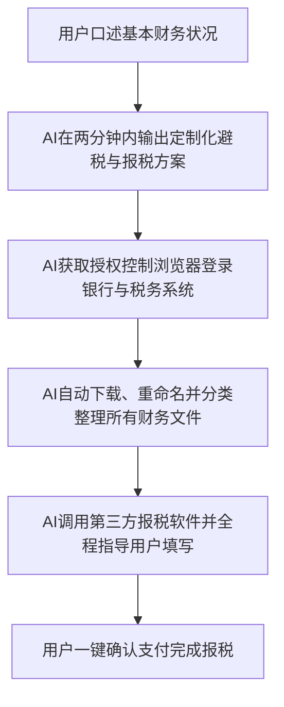

### 策略性临在：重构权力平衡

在人类上万年的文明发展史中，无论社会形态如何演变、政治制度怎样更迭、生产力处于哪个发展阶段，位于整个社会金字塔顶端的人口，其财富积累和统治基础都深深依赖于普通人的劳动力。无论是地主与长工、老板与工人之间看似自愿的雇佣契约，还是古代残酷的奴隶制社会，奴隶主对奴隶生命财产的绝对支配，其本质都建立在“上位者需要下位者的劳动力”这一铁律之上。为了维持这种劳动力资源的持续运转，获取剩余价值，掌握资源的人必须拿出相应的价值进行交换，哪怕只是提供最基本的食物、住所，以维持奴仆和工人们的生命存续。马克思主义经济学中所详细阐述的资本家剥削剩余价值的理论，其逻辑起点也是资本家必须雇佣工人、必须依赖工人的具体劳动才能把原材料转化为高附加值的产品。

然而，以生成式人工智能为代表的这一轮技术革命，正在从根本上摧毁这个千百年来牢不可破的底层协作逻辑。Anthropic（Claude大模型的母公司）首席执行官**达里奥**（Dario Amodei）在达沃斯论坛上提出的**第零世界**（World Zero: 一种因AI高度集中而导致极少数精英与主流社会彻底脱钩的预测模型）概念，向我们展示了一个极度残酷且令人后背发凉的未来图景。达里奥预测，在未来的AI时代，世界上可能会出现一小撮与AI大模型、超算算力、核心资本、海量数据和高度自动化工作流深度绑定的人群，其规模大约在一千万人左右。这其中约有七百万人聚集在科技圣地硅谷，另外三百万人散布在世界各地。他们建立起了一个高度自治、自给自足的超高效新经济体。这个内部高度协作的精英经济体，其每年的GDP增长率可能高达百分之五十，而在这个圈子之外的普通人类社会，GDP增长率可能仅有可怜的百分之一到百分之二。

这个预测模型最让人感到恐惧的地方，并不是这庞大的经济增长率差距，而是它揭示了一个人类历史上前所未有的冷酷现实：位于金字塔顶端掌握了财富与顶尖生产力的少数人，可能在历史上第一次，完全不再需要普通人的劳动力了。当AI、机器人和高度自动化的算法能够以极低的边际成本、一天二十四小时无休、且毫无怨言地完成从初级到高级的所有智力和体力劳动时，资本家和精英阶层将彻底失去雇佣普通人的动机。一旦你连被剥削的价值都失去了，一旦整个社会连最基础的就业岗位都无法再提供给你，普通人究竟该靠什么生活？这并非遥不可及的科幻小说，因为在组织行为和资本流向的层面上，这一根本性变革的齿轮已经开始疯狂运转。

在组织运作逻辑发生根本转变的实例中，加拿大电子商务巨头**Shopify**在2025年的举措具有标志性意义。其创始人兼首席执行官**Toby**在给全公司发出的内部邮件中明确指出，熟练使用AI进行日常工作已经成为组织对员工的基本要求。最关键的改变在于，邮件中明确规定：任何团队在向公司申请增加人手或拨付新资源之前，必须首先书面说明，为什么他们想要完成的这部分工作不能通过AI来完成。这代表着商业组织底层逻辑的彻底逆转。在过去，任何一家企业或团队在面对业务扩张、工作量过载时，第一反应和本能行为就是招聘新员工；而现在的逻辑是，你必须先证明AI实在无能为力，才能考虑雇用人类员工。这实际上是在宣告，企业已经不打算再为人类社会创造新的就业岗位，未来留给人类的传统工作席位只会不可逆转地持续萎缩。

---

### 工资池侵蚀：白领岗位的终结

许多美股投资者和行业观察家一直对AI科技巨头的巨额资本开支感到疑惑：OpenAI、Anthropic、微软等巨头疯狂采购GPU、建设超大型绿色数据中心、签署长期的核能与电力合同，其烧钱规模动辄数千亿甚至上万亿美元。仅仅依靠向终端用户售卖每个月二十美元的聊天机器人会员订阅，即便全球有十亿人付费，也根本无法填补如此庞大的资本黑洞，那么AI公司的商业化变现终局到底在哪里？达里奥在接受著名科技播客访谈时，给出了一个清晰但令所有职场白领窒息的答案：AI公司的主战场根本不是传统的、全球年产值仅三千多亿美元的SaaS（Software as a Service: 软件即服务）软件订阅市场。

大模型的真正目标，是全世界发达国家每年发放给白领员工的高达十几万到几十万亿美元的**工资池**（Salary Pool: 企业用于支付员工薪酬的总资金规模）。以GPT和Claude为代表的生成式人工智能，其商业模式的本质是“出售劳动力”而非“出售软件”。它们盯上的是企业过去在行政、客服、初级程序员、法务合同审查、市场分析师、运营文案、个人助理等岗位上支出的巨额薪水。这个由人类白领工资构成的市场，其规模远远超过了目前世界上任何一个单一的实体商品或服务市场，包括食品、汽车、智能手机、服装、三C数码，甚至庞大的房地产市场。这正是为什么达里奥断言，在2030年之前，市场上必然会诞生年收入达到万亿美元级别的AI巨头。随着大模型能力边界的不断外推，AI公司的收入和利润率将以指数级攀升，而与之相对应的，则是人类白领就业市场的雪崩式塌方。

面对这种普遍的就业危机，社会上流行着一种极其普遍的自我安慰和乐观论调。许多人援引历史经验指出，人类经历过多次技术革命：蒸汽机的发明取代了手工业织布工，汽车的普及让马车夫集体下岗，十几年前电子商务的兴起也曾让实体零售店哀鸿遍野，但每一次技术革命最终都没有导致人类整体的毁灭或永久性失业。相反，新技术在消灭旧岗位的同时间接创造了更多全新的工种和协作机会。马车夫虽然老了学不会开汽车，但他们的儿子可以成为公交车司机或加油站员工。然而，这种历史类比忽视了本次AI革命与前几次革命在本质上的不同：过去的技术革命仅仅改变了人类的工作方式，而AI革命正在系统性地摧毁“教育”本身的价值。

---

### 教育性脱节：现代学历的贬值

为了理解为什么AI革命是对教育本身的颠覆，我们需要回溯工业革命与现代教育体制之间的伴生关系。在农业社会，绝大多数劳动力并不需要接受系统的学校教育。一个不识字的农民，依靠祖辈口耳相传的经验，照样可以耕地、播种、收麦子、放羊、采摘果实，并借此参与到低水平的社会协作中混得温饱。但是，随着工业革命的爆发和机器大工业的普及，生产方式发生了根本性的改变。一个不识字的工人根本无法进厂打螺丝，因为他看不懂复杂的机器操作指令和安全守则；一个不识字的农民也无法驾驶现代化的拖拉机或联合收割机，因为他无法通过理论考试并获取驾驶资格。更不用说像电工、钳工、化学工艺操作员等更为复杂的工种，他们必须系统地学习物理、数学和化学。

现代全民义务教育体系的建立，本质上是工业时代为了提高劳动力的技术含量、批量生产符合工业标准的合格打工人而设计的。在过去的百年里，人类与科技进步之间一直在进行一场惊心动魄的拉锯战。科技的每一次进步，都试图通过标准化和机械化来让原本属于人类的稀缺技能贬值，而人类则通过不断延长受教育时间、学习更深奥的理论知识、向高精尖领域进军，来建立起全新的行业技能壁垒。从八十年前的小学学历即算作知识分子，到四十年前的大专生包分配，再到二十年前的本科生供不应求，直至今天的研究生、博士生学历内卷，教育门槛的不断抬升并非源于人类对知识本身的渴望突然爆发，而是因为社会协作对普通打工人的技能平均要求被科技逼上了新的高度。

我们可以将这一过程形象地称为“用教育换取生产效率”的拉锯战。在农业时代，你没有读过书，一个人用铁锹耕地只能管一亩；工业时代你接受了基础教育，开上拖拉机就能管一百亩；信息时代你读到了博士，利用无人机巡田、智能滴灌系统、超大型收割机和数据分析，一个人可以管理十万亩的现代农场。这种拉锯战在著名的**卢德运动**（Luddite Movement: 19世纪英国手工业者因抗议机器取代人力而发起的捣毁机器运动）中就曾激烈上演。1719年，英国织布工内德·卢德带头怒砸两台织布机。人们常常误以为这些手工业者是愚昧地反对科技进步，但从利益博弈的角度看，卢德们有着极其合理的愤怒：他们通过十几年学徒生涯掌握的熟练织布工艺，在机器面前一文不值。机器将复杂的织布工序拆解成若干个简单、标准化的步骤，分派给只接受过一两个小时培训的廉价临时工，而整体效率却更高。卢德的独门技能被无情贬值，他从一个受人尊敬的手艺人，降级为了机器的看护工。

在以往的技术革命中，失去壁垒的劳动者如果具有足够的毅力和资本，依然可以通过重新接受教育和技能培训实现转行。例如，手艺被废掉的织布工可以努力转型为维护机器的机械工程师，因为机器的设计、调试和改良在当时依然是人类独占的智力高地。只要“接受更高程度的教育能带来更高产出”这条上升通道没有被切断，人类的整体护城河就依然存在。我们今天看到的律师、医生、注册会计师、程序员等高薪职位，无一不是依赖高昂的教育投入和严苛的职业资格认证制度建立起来的行业壁垒。

然而，AI的出现直接降维打击了这种以技能传授为核心的现代学历教育。以个人财税申报为例，在过去，个人或家庭为了规避繁琐的税务法规和合规风险，通常需要支付高昂的费用雇佣专业的持牌会计师。这个过程通常效率低下且伴随着极高的沟通成本，需要手动整理银行流水、股票交易单、基金账单及各类复杂的政府报税表格，并在冗长且不耐烦的邮件往来中反复核对。然而，在当前的AI技术水平下，用户完全可以使用AI模型（如Codex或Claude）实现全流程的自动化纳税申报。

在这个过程中，AI不仅能够快速消化海量的个人资产信息，还能实时解答用户的任何细节疑问，并且不带有任何情绪。当我们追问为什么在AI已经能高效完成所有财税处理的今天，传统的持牌会计和报税软件公司依然能够存活时，其背后的真相并非技术限制，而是因为**历史惯性、法律责任与合规成本**。换言之，现有的税务官僚体系只承认人类会计的签字授权，并有一套成熟的针对传统软件的资质认证体系。然而，这种基于行政和法律壁垒的阻尼是暂时的，当技术鸿沟大到一定程度后，AI直接对接税务接口、彻底消灭中间环节是不可逆转的必然趋势。

这种冲击并不仅限于初级财税工作。除了一些需要人类身体去承担法律责任（如替人坐牢或在法庭上进行物理宣誓）的特定场景外，在纯粹的业务和智力层面上，几乎所有通过建立知识和信息门槛来获取高薪的行业——包括医生、律师、初级软件工程师、管理咨询顾问——都将面临彻底的重构。AI最核心的优势正是消除信息差，而上述高薪行业本质上都是在贩卖信息差和特定的决策算法。在强大的通用AI面前，一个毫无财务背景的普通人，与一个在大学商学院苦读多年的财会硕士，在调动和使用财税知识的能力上几乎没有任何区别。这意味着，过去数十年里被普通家庭视为最有效、最公平的阶层上升通道——通过高考、名校教育、获取专业技能、进入大厂或专业机构当白领——已经被彻底堵死。

---

### 分配重构：无中产社会的制度挑战

之所以教育通道被堵死会让普通人产生极大的恐慌，在很大程度上是因为在目前的社会分配框架下，失去工作、处于社会底层往往意味着生活品质的急剧恶化与尊严的丧失。在竞争激烈的社会环境中，人们之所以疯狂地卷高考、卷编制、卷大厂、卷房产，本质上是为了逃离那个资源匮乏、缺乏基本保障的社会底层。假若社会能够提供充足且高质量的公共福利、实现事实上的免费医疗与体面的生活保障，绝大多数人并不会产生病态的内卷执念。

因此，在未来二十年里，整个人类社会所面临的最大挑战，并非技术能否继续突破，而是我们能否进化出一套适应无中产AI时代的全新政治与分配制度。当社会结构演变为极少量的超级富豪与庞大的无工作人群时，为了维持基本的社会秩序与和平，必须通过国家机器重构分配链条。目前看来，这一重构主要依赖两条路径。

第一条路径是政府向高利润、低雇员的AI巨头征收**AI税**，随后通过二次分配机制，向全体国民无条件发放现金，即**全民基本收入**（Universal Basic Income: 无论财富与工作状况，所有公民均可定期获得的无条件现金给付）。目前，包括美国、加拿大、英国、爱尔兰在内的多个发达国家已开始就此进行小范围的政策试点。例如，部分地区的试点项目专门针对离开福利机构的青年、低收入孕妇或无家可归者发放无条件的月度基本生活费；爱尔兰则针对艺术从业者开展了基本收入保障计划。这些试点虽然因为缺乏稳定的AI税收支撑而难以在大范围内立即推开，但这无疑展示了未来社会福利制度的演进方向。如果无法在失业潮大面积蔓延前建立起这套安全网，社会将不可避免地滑向民粹主义与极端极左思潮的深渊。

随着财富向技术垄断者的极度集中，社会底层积攒的怨恨与失控感正在迅速集聚。当马斯克等超级科技巨富的个人资产突破万亿美元大关，而全球仍有数以亿计的人口面临失业威胁时，互联网上便会铺天盖地出现要求“打土豪分田地”的激进言论。在缺乏理性逻辑支撑的共产主义思潮中，人们往往会忽略财富创造的本质。即使一个年轻的独立开发者依靠个人的才华、使用AI Web Coding在没有雇佣任何员工、没有租用任何物理场地的情况下创造了现象级的爆款产品并赚取了巨额财富，社会底层中依然会有相当一部分人因为嫉妒和怨恨，试图剥夺其合法的私人财产。因为对于大众而言，合理的解释往往只是掩盖失衡心态的遮羞布，这也是为什么推行UBI和AI税不仅是出于人道主义，更是为了保护私有制和现代文明免受民粹主义吞噬的“疫苗”。

第二条路径则是伴随着生产力的大幅提升，社会生存所需的各种基本物质和服务的成本被AI强行打下来，从而实现“物价通缩型”的生活水平提升。例如，当外卖配送员被大规模量产的低成本配送机器人取代，当农业种植、采摘、加工全流程实现无人化，当商品的物流与仓储均由AI自主调配时，人们购买食物、衣服以及使用基础公共服务的成本将呈现断崖式下跌。在理想状态下，即便政府因财政限制无法发给你等同于以前水平的工资，但由于全社会商品和服务价格的极度廉价，普通人所能享受到的实际生活水平和购买力可能反而有所上升。

---

### 规则稀缺：卡点背后的金融限制

然而，技术带来的成本下降并不能自然而然地转化为普通人的福祉。如果我们审视过去一百年的技术与经济史，就会发现一个令人沮丧的规律：**技术的进步确实大幅度拉低了生产制造的物理成本，但人为制造的稀缺性却在悄无声息地吞噬着这些技术红利**。

以房地产为例，在过去一个世纪里，建筑技术、工程材料、大型起重设备、预制件工艺、供应链管理以及计算机辅助设计软件都有了翻天覆地的进步。按照单纯的技术逻辑，盖一栋高品质住宅的物理成本应该变得极其廉价。然而，伦敦、纽约、洛杉矶、温哥华、悉尼以及中国一线城市的房价，对于普通年轻人而言，其可负担性却变得越来越差。这是因为房产的价值从来就不在于钢筋混泥土的物理价值，而是附着在土地上的稀缺地段、学区资源、金融配套以及政府政策和牌照限制。

同样的逻辑也适用于教育。互联网的普及早已让麻省理工学院（MIT）的公开课、前沿学术论文、世界顶尖图书馆的藏书和各种专业教程变得完全免费且触手可及。然而，常春藤等世界名校的学费不仅没有下降，反而年年攀升。这是因为知识本身虽然贬值了，但是名校所提供的**社会声誉认证、精英圈层筛选和社交网络入场券**这套体系，其稀缺性被人为地进一步放大了。AI确实可以把社会总蛋糕做得无比巨大，也可以将绝大多数商品的边际生产成本拉低至接近于零，但AI本身无法自动解决利益的博弈与蛋糕的分配。因此，在未来的窗口期内，普通人必须看清这一本质，停止在无效的传统赛道上消耗自己的核心资本。

---

### 窗口期抉择：普通人的应对策略

尽管从长远来看，AI将彻底重构人类的工作和生活形态，但在全面智能化到来之前，依然存在一个约十年的过渡窗口期。在这个阶段内，普通人的主观能动性与努力依然能够产生实质性的改变。关键在于，我们需要彻底抛弃旧有教育体系的思维惯性，将精力投入到AI无法轻易剥夺的资产和技能上。

具体而言，普通人的自我救赎有两条切实可行的路径。

首先，**彻底放弃在旧有教育跑道上的内卷，转而利用AI工具构建“一人公司”并打通人际连接通路**。对于家长而言，继续为所谓的高分学区房支付昂贵溢价、逼迫孩子为了高考分数和考研而抹杀个性的做法已极具风险。未来的公立教育和标准化学校不仅无法提供核心竞争力，反而可能在批量生产第一批被AI淘汰的标准化螺丝钉。相反，个体应当尽早熟练掌握使用Codex、Claude等工具来为自己配置虚拟的AI研发、设计和法务团队，降低创业的试错成本。

更重要的是，要把资源倾斜到**人际连接通路**的建设上。在未来的社会中，任何标准化的生产、制造、代码编写和信息检索工作都将归于平价，唯有“人与人之间的信任、情感共鸣与个人品牌”是AI无法平价供给的稀缺品。让更多的人认识你、信任你、听到你的真实声音，将成为普通人最核心的生存壁垒。盖洛普在2026年上半年的调查数据表明，即便在科技最前沿的美国，职场中每天使用AI的员工也仅占13%，有近一半的员工基本不接触AI。这意味着，谁能率先将AI内嵌为自己每天工作的核心基础设施，谁就能在认知和效率上超越90%的同行，这正是窗口期给予主动者的最大红利。

其次，**坚决抛弃过往的“老登资产”，尽可能将个人财富转换为AI时代的有效资产**。

*   **老登资产**（Outdated Assets: 在旧有工业与金融逻辑下具有高估值，但在AI时代因社会结构改变而面临大幅贬值的资产）：主要包括玉石珠宝、传统收藏品，以及最具有迷惑性的**核心地段房产与商铺**。
*   **有效资产**（Effective Assets）: 真正掌握了AI大模型、底层芯片、算力基础设施、超算数据中心及清洁能源的顶尖科技公司的股权。

中国人在投资上长期对房地产持有近乎迷信的执念，认为城市核心地段的商铺和住宅是永恒的避风港。但这一逻辑在AI时代将彻底坍塌。传统CBD写字楼之所以昂贵，是因为数以万计的高薪白领需要在此聚集办公，进而带动了周边的居民住宅、餐饮商铺、优质学区和医疗配套的价格。但在AI时代，一家年收入百亿美元的独角兽企业可能只需要十个股东远程协作，根本不需要任何物理总部。当写字楼人去楼空，员工流向环境更好、生活成本更低的二三线城市甚至郊区时，核心地段房地产的溢价将迅速蒸发。同时，随着医疗诊断AI和手术机器人技术对顶级医生稀缺性的平抑，附着在特定地理位置上的优质医疗和教育资源的稀缺性也将不复存在。

因此，投资于那些能够持续捕获AI革命利润的科技巨头股票，成为这些企业微型的股东，是普通人在“工资时代”终结后，分享人类技术文明进步红利、避免自身财富被时代巨轮无情碾碎的最有效途径。