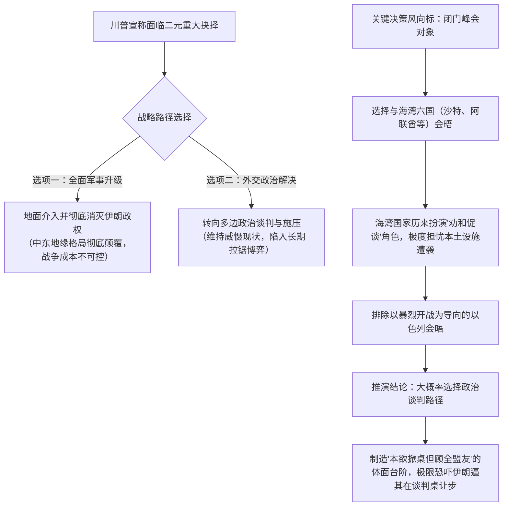
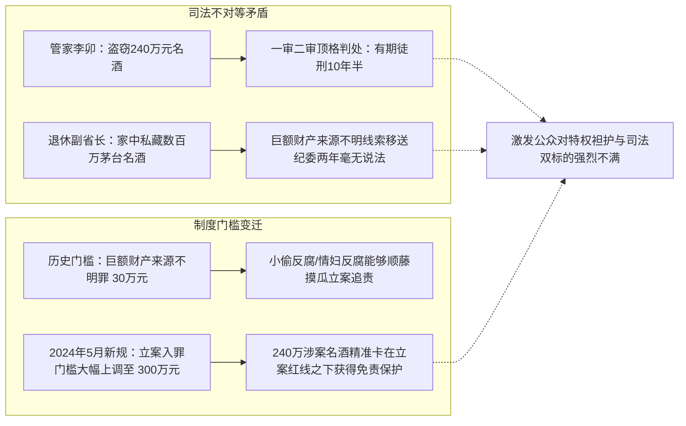
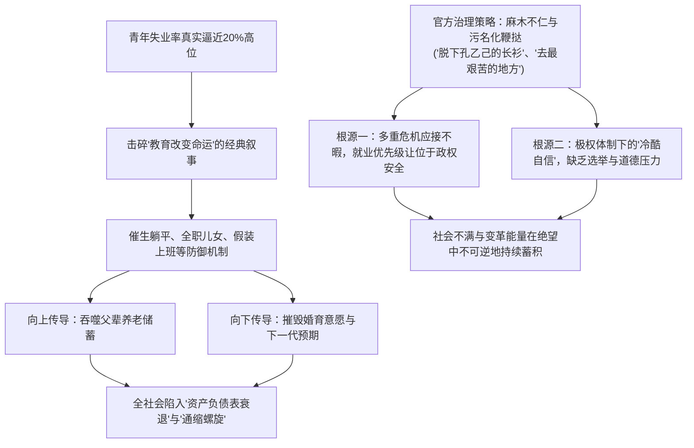

### 全球汇市反常共振：日元加息走弱与央行政治博弈

在当前的国际财经市场中，汇率与利率的联动机制正在展现出前所未有的复杂异动。按照传统货币银行学的基准传导模型，当一国中央银行宣布启动加息周期时，该国本币资产收益率攀升，理论上将直接吸引跨国套利资本回流，从而推动本币汇率升值。然而，在9月18日的全球外汇交易市场上，这一经典经济学常识遭遇了严重的现实背离。国际财经舆论将全部焦点密集投放于**日元**（Japanese Yen: 日本法定货币）与**人民币**（Renminbi: 中国法定货币）的双重反常走势之上。

**日本央行**（Bank of Japan: 日本中央银行）按照既定议程，正式宣布将政策基准利率上调25个基点至1.25%，将名义利率推升至自1995年以来的近三十一年最高水平。然而，决议公布后外汇市场的实际反馈完全打破了常规模式：日元对美元汇率不仅没有迎来预期的强势反弹，反而遭遇剧烈抛售，日内单边下跌1.2%，汇价迅速滑落至157.91的两周低点。针对这种明显的反常行情，国际主流财经媒体给出了不同维度的深度剖析与归因。

**路透社**（Reuters: 国际知名财经通讯社）在报道中侧重于政策转向的积极面，以《日本央行将利率上调至31年来的最高水平，转向先发制人的通胀应对策略》为题，指出日本央行正试图通过提前收紧货币环境来防范通胀失控；但该报道对日元汇率在加息当天的反常贬值并未深入展开。**《华尔街日报》**（The Wall Street Journal: 美国主流财经媒体）则以《日元波动，市场消化日本央行利率路径》为题，敏锐捕捉到了市场参与者的剧烈震荡，直接点出决议公布后日元重挫的核心诱因之一在于决策层内部出现了两张明确的反对票，这令全球投资者对日本央行未来进一步收紧政策的持续性产生了巨大疑虑。

在所有国际财经媒体中，派驻日本记者团队规模最庞大、跟踪最为深入的**彭博社**（Bloomberg: 全球商业与金融信息巨头），将此次日元加息未能提振汇率的深层矛盾阐述得最为透彻。其报道标题《日本央行加息未能提振日元，即便和田直男暗示将采取更多措施》直接切中了交易员预期落空的关键痛点。日本央行总裁**和田直男**在政策决议发布会上明确指出，日本国内的核心物价指数走势已经非常接近央行设定的2%长期目标，当局当下的首要任务是确保通胀预期不会发生不可控的过热外溢；他强调将通胀稳定在2%左右至关重要，日本货币政策已实质性迈入新阶段，央行必须采取先发制人的预防性措施，避免未来被迫陷入被动快速加息的恶性循环。

然而，外汇市场的专业交易员对和田直男的这套口头沟通并不买账。日元资产遭到抛售的底层逻辑主要由两大核心阻力构成：

* **央行前瞻指引模糊与决心不足**：与美联储前瞻指引展现出的高度确定性相比，日本央行在关键沟通节点上显得犹豫不决、模棱两可。即便和田直男在言语上暗示未来不排除在10月连续加息或在后续节点采取更大幅度的紧缩行动，但对于未来加息的具体节奏、量化门槛和政策强度始终缺乏清晰坚决的锚定标准，导致市场判定其推动利率正常化的真实意志依然脆弱。
* **执政内阁政治意志对央行独立性的强力渗透**：在本次政策委员会投票中，两位理事**浅田藤一郎**与**佐藤宁乃**公开投下了反对票。这两位理事均是由日本首相**高市早苗**亲自挑选并提名的核心亲信。高市早苗内阁在宏观政策上始终坚持优先刺激经济增长与维持相对宽松环境的诉求，其亲信理事在央行内部直接投出反对票，向全球资本市场释放了极其明确的政治信号——日本政治核心权力层反对过快加息。

这种央行决策层内部的政治博弈与公开分裂，直接引发了市场对日本加息周期能否持续推进的根本性怀疑。如果日本执政当局在未来数月内持续施加政治阻力导致加息议程停滞，那么今年以来两次加息所建立的紧缩努力将面临前功尽弃的风险。因此，日元在加息决议下的反常贬值并非情绪化的非理性波动，而是资本市场在全面权衡央行前瞻指引弱化与政治干预风险后所做出的理性对冲选择。

---

### 人民币逆势单边升值：官方定价与全球紧缩周期的剧烈冲突

就在日元加息走弱引发广泛关注的同时，全球外汇市场另一侧上演了更加反常、且更具宏观冲击力的行情：**中国人民银行**（People's Bank of China: 中国中央银行）在未宣布任何降息、加息或新型货币工具的前提下，人民币对美元汇率突然爆发式加速升值，连续突破多道关键心理关口，一举创下逾四年以来的历史新高。

在美联储完成加息决议后，人民币汇率在第一时间便展现出逆势拉升的迹象。起初，国际市场普遍倾向于将这一现象视为离岸资金流动的短期偶发反应，并未形成系统性共识。然而，随着行情进入9月18日交易窗口，人民币升值势头非但没有衰减，反而呈现出更具进攻性的单边走强态势，离岸人民币兑美元汇率在盘中强势突破1美元兑6.70这一极具象征意义的宏观关键关口，彻底刷新了自2022年7月以来的最高估值记录。

据《华尔街日报》以《人民币升至逾四年高点》为题的专项报道分析，中国强劲的单边出口数据以及中国央行对汇率中间价的持续性行政支撑，构成了人民币走强的主要驱动力量。值得深入关注的微观操作细节在于，截至当天，中国央行已经连续八个交易日通过人为设定强于市场预期的**中间价**（Central Parity Rate: 官方设定的每日人民币基准指导汇价），创下了自2023年以来持续时间最长的行政调强记录。中国决策层在政治与宣传叙事中，历来将本币汇率的坚挺直接锚定为国家宏观综合实力与经济体制信心的具象化体现；然而，在微观现实层面，过分坚挺的货币汇率势必会对中国庞大的底层制造业和微利外贸企业的出口价格竞争力造成直接的挤压与侵蚀。

在建立起对这一基本行情的观察后，深入拆解人民币汇率反常走势背后的宏观背景与决策逻辑，可以归纳为以下四个核心维度：

#### 1. 极其罕见的全球三大央行协同紧缩历史背景
人民币本轮反常走势之所以引发全球财经界的极度震惊，关键在于其爆发的宏观时点具有极其罕见的历史特殊性。在短短一周的窗口期内，**欧洲央行**（European Central Bank: 欧元区中央银行）、美联储与日本央行先后做出了加息收紧的政策决定。全球三大系统性核心央行在同一时间节点密集加息，在现代国际金融史上极为罕见，上一次出现类似的三大央行协同紧缩还要追溯至2006年。

在经典的**利率平价理论**（Interest Rate Parity: 揭示汇率与两国利差之间平衡关系的经济学假说）框架下，当外部主要经济体全线推高无风险基准利率，而本国央行保持基准利率不变甚至处于降息通道时，巨大的宏观利差扩大必然会驱动资本外流，进而对本币汇率形成巨大的贬值压力。在2006年的紧缩周期中，无论是人民币还是其他新兴市场货币，均表现为汇率对美元的顺周期下调。然而在本次三大央行同步加息的强紧缩风暴中，中国央行在自身缺乏加息政策支撑的被动局面下，依靠强力的行政中间价干预，强行推高人民币汇率以对抗全球主要储备货币的加息潮。这种完全背离传统经济学基本规律的极端反常现象，直接驱动华尔街与国际主流投行展开深度复盘与推演。

#### 2. 国际金融界对官方反常调控逻辑的三重理论归因
面对中国央行缺乏透明度且反常态的汇率调控路径，国际金融界与智库机构试图站在中国官方的立场，归纳出支撑这一政策操作的三种可能考量：

* **一揽子货币参考篮子的非透明加权对冲**：中国官方对汇率波动的标准官方口径历来强调，人民币汇率形成机制并不单纯锚定单一美元，而是参考一揽子外币进行调节。然而，由于该货币篮子的实际加权比例、动态调整参数与中间价过滤模型从未向全球资本市场完全公开，这种黑箱式的定价机制赋予了官方完全按照自身意志调整汇价的自由度，使其能够宣称汇率脱离美元周期是基于综合篮子平衡的合理结果。
* **高额外贸顺差下的资本流失强力截留机制**：中国在实体贸易层面依然保持着庞大的出口顺差，积累了海量的美元流动性，这为官方在短期内调控汇率提供了基本面底气。更深层次的金融考量在于，当前中美两国的名义基准利率与国债收益率之间存在着极为悬殊的倒挂剪刀差。在正常市场环境下，海外资本将资金撤回美国本土不仅可以获得超过5%的无风险高息回报，还能规避新兴市场的结构性风险。面对外资加速撤离的严峻失血压力，中国央行通过强行制造人民币持续升值的确定性预期（例如向市场传递每年保持3%至5%汇率升值空间的信号），试图利用汇率端带来的升值红利，精准抵消中美利差倒挂带来的收益损失，从而以行政干预的暴力手段强行将外资滞留在境内资本体系内部。
* **不顾外部周期的人为单边节奏塑造**：彭博社等机构深入挖掘每日中间价数据后发现，中国央行的汇率操纵已经脱离了对欧洲央行、美联储或日本央行具体加息节点的即时性战术跟随，而是在过去连续八个交易日内，机械、刚性地每日向上抬高官方设定的中间价。这种不顾全球流动性收紧与外部资产价格剧烈波动的单边持续升值周期，创下了2023年以来的最长纪录，充分证实本轮人民币反常暴涨并非自由交易撮合的产物，而是官方顶层设计意志下刻意制造的单边行政行情。

#### 3. 升值红利假设与实体制造业利润吞噬的现实代价
如果从中国最高决策层的地缘政治视角进行推演，这种强行维持强势货币的激进操作，或许被寄予了缓解国际社会对人民币长期低估指责、对冲欧美对中国庞大过剩产能低价倾销舆论压力的战术期望，甚至可能被用作高层出访与大国外交博弈前夕释放善意与实力的筹码。

然而，从宏观经济系统的现实代价来看，这种背离经济规律的强势汇率正在对中国底层实体经济造成不可逆的负面反噬。在当前全球终端需求疲软的宏观周期下，中国绝大多数民营出口制造企业的净利润率本就处于极其微薄的生死边缘。人民币汇率的每一次非市场化暴涨，都在实质性吞噬外贸企业的结汇利润与生存空间，加剧了微观实体部门的生存危机。

#### 4. 汇率升值斜率严重超出华尔街主流模型的预测上限
9月18日离岸人民币直接击穿6.70关键阻力位的事实，表明人民币当前的升值斜率与激进程度，已经全面超越了华尔街顶级投行在年初建立的全部基准预测模型。

以**高盛**（Goldman Sachs: 国际顶级投资银行）在年初发布的宏观研究报告为例，其原本预测人民币汇率在平稳渐进的升值路径下，预计要到2026年年底才有望升值至6.85水平。然而在9月18日这一时点，人民币汇率便以超常规的速度提前突破了6.70关口，其推进节奏呈现出明显的行政强制加速特征。这种极端行情的上演，不仅迫使国际投资界重新评估高盛曾提出的“2030年人民币兑美元汇率或将走向5.5”的长期假说，更让全球资本深刻体会到，在非市场化行政力量的深度主导下，传统的经典金融理论模型正在面临严峻的失效与失真。

---

### 加拿大战略西向与中等强国联盟：戴蒙视角的深层困境剖析

在国际地缘政治与宏观经贸板块，北美大陆传统的政治经济生态正在经历近四十年以来最剧烈的地缘撕裂与重构。这一地缘震荡的核心，围绕着加拿大总理**马克·卡尼**（Mark Carney: 加拿大现任总理，曾任加拿大央行及英国央行行长）所推动的疏远美国、转向欧洲的全新大国博弈路线展开。

《华尔街日报》在题为《卡尼疏远美国的战略转向面临考验》的报道中详细披露了美加两国领导人之间爆发的正面言论冲突。美国总统川普在公开表态中直接指责加拿大是“极其糟糕的经贸伙伴”，并发出严厉的外交警告，声称加拿大如果寻求与**欧洲联盟**（European Union: 欧洲主要国家组成的政治经济联盟）建立专属的准成员国式深度合作，将被美方直接定性为针对美国的“潜在敌对行为”，美方将毫不犹豫地对相关欧洲国家及加拿大同步加征惩罚性关税。此外，川普多次公开发表拟将加拿大降级收编为“美国第51个州”的极端言论，令美加经贸摩擦全面升级为对加拿大主权完整性的系统性施压。

面对来自华盛顿的极限施压与关税恐吓，卡尼选择在国际多边舞台上展现出强硬的对抗姿态。在欧洲议会发表的历史性专题演讲中，卡尼系统性地阐明了其外交重构的战略底色：
* **重塑伙伴关系的非结盟定位**：卡尼明确强调，加拿大深化与欧盟关系的努力绝非试图在美中两个超级大国之外构建所谓的“第三个对抗性帝国阵营”，而是通过建立量身定制的专属深度伙伴关系，来切实捍卫加拿大的国家主权与战略自主权。
* **对美方主权干涉的正面向应**：在演讲后的官方新闻发布会上，卡尼针对川普的“敌对行为”指控做出了斩钉截铁的强硬回应，公开宣称“没有任何外部大国与政治人物有权对加拿大的主权伙伴关系指手画脚”，以此正式回绝美方的单边霸凌。
* **高规格外交与经贸多边行动**：本周内，卡尼通过在多伦多主办首届加拿大国际投资峰会款待全球金融领袖，以及随后对伦敦和巴黎展开的高调旋风式访问，全力将其抗衡美国经济压迫的战略蓝图付诸实践。卡尼早年求学于牛津大学，并曾执掌**英格兰银行**（Bank of England: 英国中央银行）长达七年之久，其独特的英欧精英背景使其在初登国际舞台时打破了历任加拿大总理首访美国的历史惯例，将首访目的地选在巴黎与伦敦，并在欧洲公开盛赞加拿大是“非欧洲国家中最为契合欧洲气质的国度”。

针对卡尼与川普之间白热化的跨大西洋地缘博弈，华尔街顶级金融领袖、**摩根大通**（JPMorgan Chase: 全球资产规模最大的全能型商业银行之一）董事长兼首席执行官**杰米·戴蒙**（Jamie Dimon: 华尔街资深金融家），在美国外交关系协会的专题演讲中，从极其务实的宏观经济底层逻辑出发，对卡尼提出的战略构想给出了截然不同的冷静审视与批判。

戴蒙在分析中指出，卡尼本质上具备浓厚的学者治国色彩，其各项政策行动的底层均试图依托一套自洽的宏观理论模型。卡尼在今年年初正式提出了所谓的“**中等强国联盟**（Middle Power Coalition: 主张中等规模发达经济体联合对抗超级大国垄断的地缘战略构想）”。该理论主张包括加拿大、澳大利亚以及欧洲主要工业国在内的中等强国必须实现跨区域的深度联合与抱团取暖，构建起独立的地缘第三极，以此打破在美中两个超级大国之间被迫选边站队的被动局面，确保中等强国“能够稳坐在大国谈判的餐桌之上，而不是沦为餐桌上的菜单”。

然而，戴蒙在演讲中以极其斩钉截铁的态度断言，卡尼苦心构筑的中等强国联盟构想在经济现实层面是完全行不通的、缺乏逻辑支撑的空想。戴蒙提出这一严厉批判的核心论据在于：

* **欧洲联盟既有历史实践的经济效率溃败**：戴蒙强调，通过中等强国联合来对抗超级大国的模式并非卡尼的首创，早在数十年前，法国、德国等欧洲传统中等强国为了抗衡美苏超级大国就已经进行了欧洲一体化的宏观实验。然而，这一实验并未带来“一加一大于二”的规模经济倍增效应。数据显示，欧洲整体GDP规模在过去曾高达美国整体经济规模的90%，而在经历了数十年的联合治理后，这一比重已经大幅萎缩至仅剩70%左右。如果欧洲不从根本上扭转其现行经济发展范式，这种相对实力的持续衰退还将进一步恶化。这充分证明，简单的中等强国结盟不仅无法提升抗衡超级大国的整体实力，反而在全球科技与商业竞争中持续落后于各自为政的时期。
* **欧洲式经济治理模式对资本形成与创新的系统性扼杀**：戴蒙进一步剖析指出，中等强国集团在结盟过程中非但没有相互激发技术创新与自由竞争活力，反而极易全盘照搬欧洲体制中最具破坏性的高额税负体系、繁复沉重的官僚监管枷锁以及对资本形成机制的系统性削弱。这种治理范式根本无法为全球跨国企业和长期风险资本创造具备国际吸引力的营商环境。
* **过度昂贵且低效的高福利债务陷阱**：戴蒙重申，建立基础的社会安全托底网络本身具备合理性，但欧洲现行的民主社会主义福利制度已经演变成为一种过于昂贵、极度低效的结构性包袱，直接导致欧洲多数主要国家的政府公共债务占GDP比重飙升至100%以上的危险临界点。

由此，戴蒙得出的核心结论在于：卡尼试图通过政治理念与意识形态联合打造的中等强国共同体，在现实中根本无法替代由制度红利与资本回报率所构筑的底层经济吸引力。一个国家的真正国际地位与地缘博弈筹码，归根结底取决于其微观商业活力与宏观经济实力。卡尼在面对川普极限施压产生的地缘焦虑下，选择在经贸上与欧洲“私奔结盟”，很可能是一剂开错了药方的宏观误判。

---

### 中东战局十字路口：川普的二元极限施压与海湾闭门博弈

在地缘军事安全领域，国际社会的目光全面聚焦于美国在中东地缘博弈中的下一阶段战略抉择。美国总统川普在接受网络媒体Axios专访时发表了极具震慑力与戏剧性的政策言论，瞬间引爆了国际安全舆论圈。

川普在专访中直截了当地宣称，自己当前正面临着一项重大的历史性决断——对于当前的伊朗危机，究竟是“由美军直接大举进入以彻底消灭伊朗现政权”，还是“彻底放弃军事升级选项转向其他路径”。川普强调这不仅是一项重大决定，并声称在自己的政策工具箱中“任何极端的事情都有可能在下一刻发生”。

尽管国际社会对川普长期惯用的“**极限施压**（Maximum Pressure: 通过极限威胁与不可预测性迫使对手妥协的博弈策略）”话语体系早已习以为常，但本次表态所处的宏观时间窗口却异常敏感。按照既定日程，川普预计将于下周二与包括沙特阿拉伯、阿拉伯联合酋长国、卡塔尔、巴林、科威特和阿曼在内的**海湾阿拉伯国家合作委员会**（Gulf Cooperation Council: 海湾六国组成的区域性政治经济安全组织）最高领导层举行高级别闭门战略会议。

这场闭门峰会被广泛视为决定美国中东战略下一阶段走向的核心风向标。回顾冲突脉络，自今年2月美国与以色列对伊朗本土发动大规模联合精准军事打击、系统性摧毁其部分政府中枢与核心军事基础设施以来，美伊地缘对抗迅速外溢扩散至整个中东腹地，并直接引爆了关乎全球能源咽喉命脉的霍尔木兹海峡航运危机。尽管川普在近期的公开场合多次向外界吹风，宣称“战事即将迎来终结”，并反复暗示德黑兰方面已经通过秘密情报渠道表达了求和与重启政治谈判的意向；但美军在中东战区的兵力再部署态势，结合川普历来不按常规逻辑出牌的特质，令整个波斯湾战局依然笼罩在极高的不确定性迷雾之中。

针对川普抛出的这道“非生即死”的二元选择题，通过地缘决策逻辑与博弈常识的交叉验证，可以得出以下三层核心研判：

#### 1. 两条战略路径的极端后果差异
川普所设定的两道极端路径之间存在着不可调和的宏观鸿沟。如果美军选择实质性地面介入并以推翻伊朗现有神权政权为最终目标，这意味着中东地区将爆发自2003年伊拉克战争以来规模最大、破坏力最强的高烈度全面战争，其直接后果是彻底打破现有的中东地缘平衡，并引发全球能源供应链的毁灭性震荡；反之，如果选择政治谈判，鉴于伊朗外交体系极其擅长利用多边博弈拉锯拖延战术周期的历史特质，谈判进程大概率将重新陷入冗长的消耗战。因此，国际社会当前最大的恐慌焦点，完全集中于美军是否会启动不可逆的军事打击升级。

#### 2. 闭门会晤对象背后的真实决策倾向判定
尽管川普在舆论场上高调营造出即将做出战争决断的紧张氛围，但研判其真实决策底牌的关键在于追踪其在关键决断前夕究竟选择听取何种政治力量的意见。如果川普真实抱有动用雷霆手段推翻伊朗政权的决心，其在决策前夕最应当进行秘密磋商的战略盟友无疑是以色列最高军政指挥层；然而，川普本次选定的闭门磋商对象，恰恰是沙特、阿联酋等海湾六国领导人。

在过去半年的危机演变中，海湾阿拉伯君主国在美伊博弈中始终扮演着极其谨慎的“劝和促谈”角色，其核心利益在于全力避免波斯湾战火外溢至自身本土的石油基础设施与经济特区。川普在明知海湾国家基本立场的前提下主动寻求与这六国领导人密谈，这一动作本身在逻辑上基本宣告了其已经主动放弃了第一种全面开战的极端选项。

#### 3. 政治剧本的战略恐吓价值与潜在失效风险
这种外交动作的内在逻辑，极大概率是川普团队精心编排的一场政治博弈大戏：川普在峰会前夕将自身塑造成一个随时准备掀桌动武的暴烈形象，随后在下周二的闭门峰会上顺理成章地接受海湾六国领导人的“苦劝”，最终以“照顾中东盟友核心诉求与面子”为政治台阶，顺势宣布放弃直接军事打击，转而启动全面外交与经济封锁。这一精妙战术的核心目的，是在下周二峰会召开前对德黑兰政权实施最大程度的心理恐吓，逼迫伊朗在后续的秘密谈判中做出实质性妥协。然而，如果德黑兰决策层同样看穿了这一政治剧本的虚张声势本质，那么这场高调筹备的海湾闭门峰会很可能将迅速沦为一场缺乏实质威慑效应的政治闹剧。

---

### 山东退休高官失窃案：反腐司法不对等与制度性保护伞机制

转向中国国内的社会与司法治理议题，一起由中共官方主流媒体澎湃新闻跟进报道的热点法律事件，在民间舆论场引发了持续数日的高温发酵。这起案件不仅折射出当代中国基层司法的深层不对称性，更揭示了反腐体系内部的制度性演变。

据司法公开信息显示，山东男子**李卯**在受聘担任雇主家庭管家期间，利用工作便利，在长达两年的时间内采取“蚂蚁搬家”式的隐秘手段，多次从其雇主位于青岛的住所及其雇主父亲位于济南的住宅中，盗窃茅台、五粮液等大批高档名贵白酒并予以低价转卖变现，累计非法获利达240余万元人民币。去年9月，法院一审以盗窃罪重判李卯有期徒刑十年六个月；李卯不服提起上诉，今年8月下旬，青岛市中级人民法院二审裁定驳回上诉、维持原判。

这起原本属于普通财产犯罪的盗窃案件之所以在全网掀起滔天舆论巨浪，关键在于案情背后牵涉出的特权阶层背景。李卯雇主的父亲**陈某明**系一名已退休二十余年的山东省原副省长。李卯自2021年进入该家庭后，身兼司机、厨师、保姆等多重家政职能并贴身照料陈某明的起居。案发后，李卯及其辩护律师当庭明确主张，被盗的巨额高档名酒绝大部分系各方利益关联方长期向该退休高官输送的违规礼品，背后涉嫌严重的特权贪腐行为，并由此向**中国共产党中央纪律检查委员会**（Central Commission for Discipline Inspection: 中共党内最高纪律检查与反腐机构）提交了实名举报线索以求构成立功减刑。然而，青岛中院在二审判决中认定，其举报线索因“尚未查证属实”而不构成立功抗辩要件。

针对民间舆论对该案案情揪住不放的深层社会心理，可以通过以下三个递进维度进行系统剖析：

* **司法正义的不对等性与选择性执法的公信力危机**：中国网民对该案的巨大愤慨，根本上源于国家公权力在处理平民犯罪与特权官员涉腐线索时所展现出的极端双重标准。实施盗窃行为的底层管家被极为迅速地施加了十年半的顶格重刑惩罚，而作为数百万巨额不明资产实际持有者的退休省级高官，在全网铺天盖地的腐败质疑声中却始终稳坐幕后保持沉默；更令公众无法接受的是，相关贪腐举报线索早在两年多前就已正式转交纪检监察部门，至今官方未向社会公众给出任何调查结论与说明。这种处理方式直接给公众留下了司法机关在严格惩治底层平民的同时、刻意包庇特权阶层贪腐的制度性偏见印象。
* **垄断性反腐机制下“小偷反腐”历史范式的终结**：在中国特定的政治语境下，官方始终坚持对反腐权力的绝对垄断，对民间自发的反腐线索与诉求长期采取压制与冷处理态度。这也导致在过去十余年间，中国社会催生出了极具本土荒诞色彩的“小偷反腐”与“情妇反腐”现象。在既往的司法实践中，不乏小偷落网后为立功减刑主动交代高官隐秘财产、进而促成官方顺藤摸瓜查办大案的先例（例如原山西焦煤集团董事长白培忠因家中遭劫牵出贪腐被判刑十三年半，以及安徽两名副厅级官员因小偷盗窃交代而相继落马受罚）。公众本次对山东副省长案的强烈反弹，正是基于上述既有司法惯例与现实落差所产生的必然心理反馈。
* **职务犯罪立案门槛通胀化所构筑的制度性安全网**：从法律实务的硬性技术指标来看，涉案的陈副省长之所以能够在这场舆论风暴中安然无恙，核心在于其精准受益于最高决策层在制度层面上推行的立法调整。自2024年4月相关司法解释修订并于5月1日正式实施以来，**巨额财产来源不明罪**（Crime of Possessing Huge Amount of Property with Unidentified Sources: 中国刑法中针对国家工作人员巨额财产无法说明合法来源的罪名）的立案追诉门槛，从历史上的30万元被一次性大幅调高十倍至300万元。由于李卯所盗窃的名酒司法评估总值恰好为240余万元，即便这笔巨额资产在事实上完全无法证明合法来源，其涉案绝对金额也已被精巧地排除在300万元这一全新的立案追诉红线之下。这种贪腐入罪门槛的剧烈“通货膨胀”，在客观上为特权阶层构筑了一道合法免受司法追责的宏观保护伞。

---

### 青年失业常态化与执政意志的“冷酷自信”

在中国宏观经济运行的最底层，劳动力市场的结构性恶化正在对社会微观生态产生深远而不可逆的剧烈冲击。官方最新披露的宏观劳动力统计数据与国际权威媒体的微观实地调查，共同勾勒出一幅中国青年群体生存困境的真实图景。

中国国家统计局在例行发布8月份宏观经济运行核心指标时，采取了极具公关防御色彩的“拆分延后报道”策略。与常规的固定资产投资、社会消费品零售总额及规模以上工业增加值等宏观数据不同，**新华社**（Xinhua News Agency: 中国官方国家通讯社）特意将备受敏感关注的青年失业数据延后两天独立发出。官方数据显示，8月份全国城镇不包含在校生的16至24岁青年劳动力失业率进一步飙升至**18.9%**，环比7月份大幅上升整整1个百分点，刷新了自新统计口径引入以来的年度最高记录。

与此同时，英国**《经济学人》**（The Economist: 国际顶级政经期刊）发表了题为《失业正成为中国年轻人的生活常态》的长篇深度调查报道。报道开篇记录了一个极具时代象征意味的微观典型案例：上个月，位于中国东部的大型汽车零部件制造巨头新宇车灯公司在夏季校招结束后，突然发现自身在宏观疲软下过度招聘了年轻员工。公司随即向大约140名刚刚入职数周的应届大学毕业生下达了极端通牒——要么选择主动辞职并仅领取半个月的基础工资赔偿，要么必须离开技术研发岗位、“拿起螺丝刀下沉到工厂流水线”从事低薪苦力劳动；最终导致一百多名名校毕业生被迫选择愤然离职。在劳工权益保护机制相对匮乏的环境下，这种突如其来的暴力裁员之所以在全网激起空前的舆论共振，根本原因在于其彻底击碎了中国社会长期以来建立的“**教育阶层跃升机制**（Meritocratic Social Mobility: 依靠高等教育文凭获得体面中产职业与社会地位的经典发展路径）”。

在当下中国，高校应届毕业生年交付量已经攀升至创纪录的1270万人历史峰值。然而，在房地产支柱产业深度塌陷、地方政府债务承压、民间消费全线收缩的宏观萧条周期下，微观实体企业对年轻高阶劳动力的吸纳需求遭遇了雪崩式萎缩。2023年夏季，当官方测算的青年失业率历史性突破20%红线后，国家统计局一度采取了暂停发布该项敏感指标的行政手段；随后官方通过剔除在校生等所谓“优化统计方法”重新恢复数据发布。然而时至今日，即便在这一经过层层过滤调优的新口径下，青年失业率依然在短短数月内不可阻挡地重新逼近18.9%的危险区间。

持续数年的高失业压力正在从底层深刻重塑中国年轻一代的行为模式与心理结构，催生出了一系列独特的社会亚文化防御形态：
* **彻底脱离竞争序列的“躺平主义”**：部分青年群体主动放弃在存量内卷市场中的无效挣扎，选择在宏观经济回暖前全面退出劳动力市场，进入生理与精神层面的休眠状态。
* **依靠代际财富反哺的“全职儿女”**：相当一部分大学毕业生选择长期留守家庭，通过为父母承担日常家务、烹饪打扫来换取基本的生活零花钱，将家庭内部微循环作为应对失业危机的缓冲垫。
* **维持心理秩序的“假装上班”经济学**：自去年以来，中国多个核心城市相继涌现出专门提供给失业人群的“假装上班空间”。求职者每天只需支付约30元人民币的场地费，便可获得一个配备饮水机和办公桌的标准工位，在公共空间中假装维持体面的朝九晚五白领日常节奏，一边刷手机投递简历，一边规避来自家庭与熟人社会的巨大道德审视压力；城市公共图书馆亦成为此类群体高度聚集的避风港。

针对这一深刻的社会危机，从政治经济学与国家治理哲学的视角进行深度拆解，必须清醒正视以下三大核心本质：

#### 1. 青年就业困境是戳破“经济光明论”的最直接现实指标
在当代宏观经济评价体系中，无论官方宣传机构如何高调宣讲所谓的“经济光明论”与宏观GDP增长数字，衡量一个国家经济肌体健康程度最根本、最朴素的微观试金石始终在于：青年一代能否获得充足的体面工作岗位以及能否取得可持续的劳动报酬。当一个社会的青年群体面临大面积无工可做的系统性困局时，任何宏观层面的数据粉饰与概念游戏都将失去现实意义。国际主流财经舆论对中国经济结构性危机的严肃预警非但没有夸大其词，反而精准指出了中国当前面临的真实困境。

#### 2. 绝望情绪的代际传导与系统性通缩螺旋
将年轻人的躺平与自嘲简单归咎于“个人逃避现实与吃苦精神匮乏”，是对微观经济学规律的彻底无知。中国最高层在过去两年多次对青年躺平现象发起舆论维度的围剿与批判，但这种社会退缩行为本质上是千万微观个体在绝境下被迫做出的防御性生存策略。更为致命的是，这种由青年群体弥漫开来的深刻绝望感具备极强的代际扩散效应——年轻人的消费降级不仅会迅速向上传导并吞噬其父母一代的养老储蓄与消费信心，还会彻底摧毁其对下一代的生育与投资意愿，从而在全社会范围内诱发全方位的长期**流动性陷阱**与**资产负债表衰退**（Balance Sheet Recession: 企业与家庭部门将目标从追求利润转向偿还债务、压缩支出的长期经济紧缩状态）。

#### 3. 官方麻木背后的治理优先级与“冷酷自信”
中国官方宣传叙事在历史上长期标榜“少年强则中国强”的意识形态承诺，然而在当代现实语境下，这一叙事却被迅速置换为要求青年“脱下孔乙己的长衫”、“到最艰苦的边远基层去拧螺丝”的冷酷训诫。这种对青年困境展现出的惊人麻木与羞辱态度，植根于两大深层政治逻辑：

* **多重危机挤压下的治理能力破产**：当前中国各级政府正处于地方政府隐性债务危机、房地产系统性暴雷以及金融坏账外溢的多重风暴夹击之下，整体宏观治理资源早已捉襟见肘、应接不暇。在产能严重过剩与内需极度冰冻的背景下，支撑经济运转的唯一支柱仅剩下依赖价格战的制造业出口；而强行要求制造业在微利状态下额外吸纳海量高校文职就业，势必将直接摧毁出口产业的微观盈利能力。因此，青年就业议题已被实质性排斥在最高决策层的核心优先级之外。
* **极权体制下免于道德审视的“冷酷自信”**：西方现代政治观察家往往极难理解中国统治者在面对民间疾苦时所展现出的超常规冷漠。在缺乏周期性民主选举压力、且国家机器对底层社会的网格化监控能力空前强化的封闭体制内，执政者对统治权力的稳固性产生了一种极度冷酷的狂妄自信。在最高决策者的政治天平中，排在绝对第一位的是政治权力的绝对安全与终身统治的延续；只要青年群体的失业与躺平没有在物理空间直接演化为威胁政权稳定的街头动荡，这种无声的苦难便不会对统治集团构成实质性的道德或政治约束。

然而，人类社会现代化的历史经验反复证明，一个对青年一代的前途与尊严采取系统性漠视与麻木态度的治理体系，终将为其傲慢付出无法承受的历史代价。青年群体历来是感知社会不公与宏观矛盾最敏锐、最富爆发力的群体；当自嘲式的躺平与被迫的沉默在长周期的绝望中消耗殆尽之时，全社会所积聚的深层变革势能与反弹张力，必将对现有的稳态结构形成前所未有的剧烈冲击。