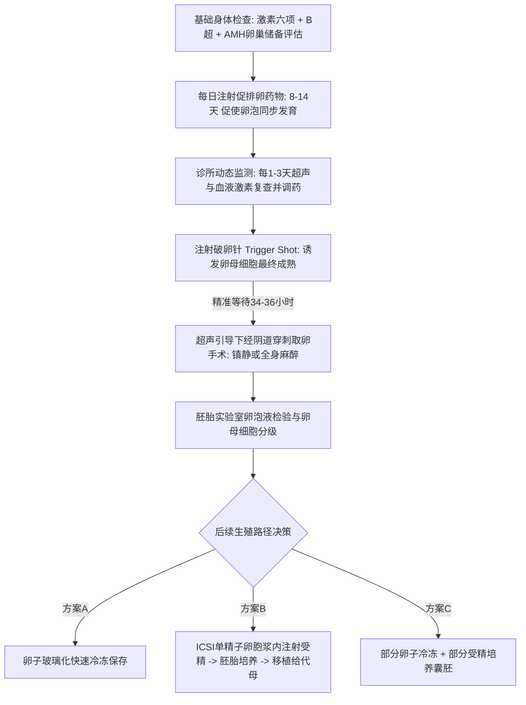
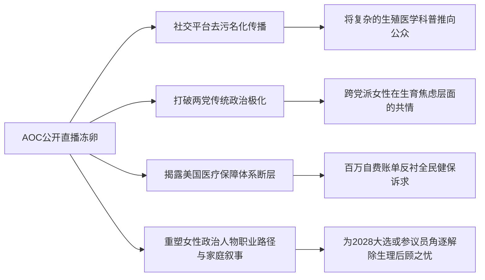
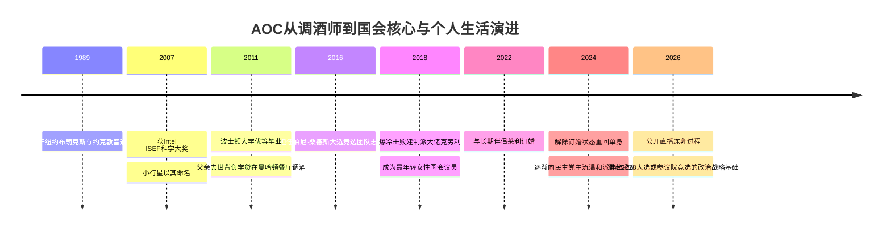

### 虚构与现实的交织：代孕传闻与促排卵医学机制

在孙宇晨公开叙述的虚构故事当中，谈到了知名演员**景甜**想要一个孩子，推测可能因为害怕生育疼痛等个人原因，因此必须寻求**商业代孕**（Commercial Surrogacy: 委托方与代母通过法律协议并支付报酬，由代母代为妊娠及分娩的生育方式）。在这一设想中，孩子预计于2027年出生的马年宝宝。为此，代孕妈妈在当年一月份就已经确定，是一位34岁、此前已经生育过两个孩子的加利福尼亚州当地女性，前期定金设定为20万美元。为了进入这一生殖周期，景甜在北京完成了前期的基础体检，包括抽血化验激素六项、妇科B超以及**抗缪勒管激素**（Anti-Müllerian Hormone, AMH: 由卵巢小卵泡分泌，用于评估女性卵巢储备功能和取卵潜力的关键生物标志物）检测，以此精准评估其卵巢储备功能与未来可供促排取卵的生物学潜力。

到了2月28日，景甜乘坐湾流G700公务机抵达位于南加州的**蒙太奇拉古纳海滩度假酒店**（Montage Laguna Beach: 坐落于加州海岸悬崖之上、俯瞰太平洋的顶级五星级奢华度假酒店）。为了保证极高的个人隐私，景甜方面提出包下酒店一整个楼层的要求，预算为30天100万美元。然而，其最终仅仅居住了8天便离开，整个过程并未真正实施取卵手术。原因在于她所提出的5000万美元转账条件未能得到满足；寄送到酒店需要冷藏储存的**促排卵针**（Gonadotropin Injections: 用于刺激卵巢多个卵泡同步发育的促性腺激素类药物），最终一直未被拆封使用，这也意味着促排卵治疗在实际层面并未开启。

如果我们顺着孙宇晨的虚构逻辑进一步推演其背后的医学与技术路径：假设5000万美元的资金条件得到满足，接下来在正规生殖医学体系下将发生一系列严密的医疗操作。景甜需要每天注射促性腺激素药物，这一阶段可以在酒店私密环境下自行或由随行专业护士完成，通常持续约8到14天。促排卵的核心目的在于打破女性自然月经周期中单卵泡发育优势的生理限制，通过外源性激素刺激，促使卵巢内的一批基础卵泡同步发育成长。

在此期间，生殖医学诊所必须对促排者进行严密的生理监测，通常每隔1到3天就需要前往诊所进行一次超声波检查与抽血激素化验，医生会根据卵泡的生长速度与体内雌激素水平动态调整注射药物的剂量。当主导卵泡群发育至成熟标准后，医生会安排注射**破卵针**（Trigger Shot: 常为人绒毛膜促性腺激素hCG或GnRH激动剂，用于促使卵母细胞完成最后成熟并诱发排卵的终末触发注射）。取卵手术必须严格精确地安排在注射破卵针后的34至36小时之间进行，以确保在卵泡自然破裂排出之前完成经阴道穿刺取卵。

### 穿刺取卵、实验室受精与生育年龄的时钟

取卵手术通常在超声影像实时引导与静脉麻醉状态下进行。医生使用特制的穿刺取卵针依次穿刺双侧卵巢内的每一个成熟卵泡，负压抽吸出卵泡液并迅速送入胚胎实验室。如果超声监测下观察到20个左右发育的卵泡，实际穿刺抽吸后可能获得十几枚具有受精潜力的卵母细胞。在恒温恒湿的胚胎实验室内，胚胎学家会在显微镜下检索并评估卵母细胞的成熟度（Mature Oocytes: 处于减数分裂中期II阶段具备受精能力的卵子）。

从这一步开始，生殖方案便分化出多条具有不同战略意义的技术路径：
* **方案A（纯粹冻卵）**：将获取的成熟卵母细胞全部采用玻璃化冷冻技术保存在零下196摄氏度的液氮罐中，封存其生物学生育能力以备未来之需。
* **方案B（即刻受精并胚胎培养）**：在精子样本随时可用的前提下，立即在体外进行受精。现代生殖实验室普遍采用**卵胞浆内单精子显微注射**（Intracytoplasmic Sperm Injection, ICSI: 在显微操作系统下直接将单条形态活力俱佳的精子注入成熟卵母细胞胞浆内的辅助生殖技术），模拟甚至超越自然受精中亿万精子竞相穿透卵子透明带的微观历程。受精卵在体外培养5至7天发育成囊胚后，可根据法律与医疗流程择期移植入代孕母亲的子宫内。
* **方案C（组合策略）**：根据当事人的意愿进行资产配置式的风险分散，一部分卵子直接冷冻保存，另一部分则与精子结合培养成胚胎。

从生殖生物学规律来看，女性的生育能力与年龄呈现不可逆的负相关关系。随着年龄的增长，女性卵巢内的卵泡存量不仅在数量上加速衰减，染色体非整倍体率以及卵子质量也会显著恶化。医学统计数据显示：若以获得70%的健康活产婴儿概率为基准，30至34岁年龄段通常需要采集约14枚成熟卵子；35至37岁需要增加到15枚左右；而一旦进入38至40岁区间，则平均需要采集26枚卵子才能达到同等成功率。对于1988年出生、年近38岁的女性而言，要在一个促排周期内获取足够数量的高质量卵子具有相当的生理挑战，往往需要经历两到三个甚至更多的取卵周期，这也意味着单靠包下一间豪华度假酒店一个月的时间，在生理周期与医学操作层面上很难完全覆盖整个流程。

在辅助生殖的另一端是精液样本的准备。在南加州拥有成熟的医疗基础设施，例如全美历史最悠久且规模庞大的**亨廷顿生育医疗中心**（HRC Fertility: 位于加州帕萨迪纳等地的高端生殖医学机构，现已被中资机构收购整合），其地理位置距离拉古纳海滩并不遥远。在常规的**体外受精-胚胎移植**（In Vitro Fertilization, IVF: 即试管婴儿技术）流程中，取精操作通常有两种安排：其一是在取卵手术当天提供新鲜采集的精液样本，诊所一般要求男方在采精前禁欲1至5天；其二则是使用提前冷冻并完成传染病与基因筛查的精液样本。现代冷冻精子复苏技术已经非常成熟，冷冻样本与新鲜精液在受精率和囊胚形成率上没有实质性差异。虽然男性的精液采集相比女性的药物促排与穿刺手术要简便得多，但在实际临床操作中，心理压力与外部环境依然会对采集过程产生直接影响。

### AOC的公开冻卵与政治人物的身体叙事

与娱乐圈或富豪阶层隐秘、高额交易的辅助生殖传闻形成鲜明对比的是，美国政坛正在上演一场高度公开化、极具社会动员色彩的生殖技术展示。1989年出生、来自纽约州的民主党联邦众议员**亚历山德里娅·奥卡西奥-科尔特斯**（Alexandria Ocasio-Cortez，常被称为**AOC**），近期在各大社交媒体平台上以极高的透明度直播了自己接受促排卵针注射、进行个人卵子冷冻保存的全过程。

AOC在Instagram上拥有近千万粉丝，在TikTok等短视频平台上亦具备庞大的年轻受众网络。她在镜头前毫不避讳地拆开冷藏保存的促排药盒，将针具整齐排列在生活化的咖啡桌上，详细记录自己克服心理障碍、将针头刺入腹部皮下组织的每一个真实细节，并半开玩笑地向粉丝分享注射带来的微小灼痛感与应对方法。在完成周六的促排注射后，她于次日清晨便出现在ABC电视台的《本周》（This Week）政论脱口秀节目中，在后台休息室继续完成第二剂注射，并在节目中自如地讨论民主党内左翼进步派的政治走向以及2028年大选的潜在可能性。

AOC明确将个人的冻卵决策置于公共政治与劳工权益的框架之中。她公开强调，在当下全美女性生殖健康护理与堕胎权面临巨大政策争议的宏观背景下，作为年轻的女性公职人员，有责任将辅助生殖与冻卵这一长期被隐匿的医学过程公开化、正常化，以此唤起全社会对职业女性在生育时钟与职业发展双重挤压下真实生存状态的关注。

在政治极化严重的美国社会生态中，AOC的这一举动引发了跨越党派界限的复杂反响。尽管极右翼保守派中依然存在批评声音，指责她宣扬推迟生育的激进生活方式，但出人意料的是，许多传统保守派女性与温和派人士对此展现出罕见的理解与同理心。例如白宫资深幕僚斯蒂芬·米勒的妻子凯蒂·米勒，尽管此前曾与AOC发生过激烈的公开政治论战，在此事上也公开发声表示支持。她认为，在全美乃至全球生育率普遍走低的时代，任何女性通过科技手段保留生育潜力和生育权利的努力都值得被肯定，这本质上是为了未来拥有更多的生命选择，而非彻底放弃家庭。

### 国会山的女性生育政治与制度断层

在美国国会两百余年的历史长河中，女性议员在任期内怀孕生育的案例屈指可数，公开承认借助辅助生殖医疗技术的更是极其罕见。伊利诺伊州的联邦参议员**塔米·达克沃斯**（Tammy Duckworth）曾在美国陆军服役22年，在伊拉克战争中因直升机被击中而双腿截肢，退役后投身政界。达克沃斯长期受到不孕困扰，通过体外受精技术分别于46岁和50岁高龄在国会议员任期内诞下两个女儿，成为美国历史上首位在任期内分娩的联邦参议员。加州联邦众议员**萨拉·雅各布斯**（Sara Jacobs）也曾坦诚分享自己在国会任职期间完成两轮促排冻卵的经历，讲述了在国会委员会审议法案的间隙悄悄离场、返回办公室自行注射药物、再若无其事地回到谈判桌前的复杂身体与心理挑战。

这种国会山女性议员的微观身体经验，折射出的是美国当代政治与医疗保障体制的巨大断层。作为联邦众议员，其年薪达到17.4万美元，享有全美最优质的联邦雇员健康医疗保险，但在绝大多数情况下，此类商业医疗保险对于非医疗必须（如非癌症放化疗前的生育保存）的非侵入性冻卵周期完全不予报销，一切高昂的药物、超声监测与实验室手术费用均需自费承担。在纽约等一线都会区，单个取卵周期的综合开销通常超过1万美元，且随着年龄增加往往需要经历多轮周期。全美仅有约12%的大型雇主（主要集中于硅谷头部高科技企业，如苹果和Meta）为女性员工提供全额覆盖的冷冻卵子福利。对于广大缺乏充足财富储备与雇主福利支持的普通工人阶级女性而言，通过技术手段对抗生理时钟依然是一项遥不可及的昂贵特权。

临床统计数据表明，美国选择冷冻卵子的女性人数在过去十年中呈现近十倍的爆发式增长，从2014年的数千人迅速攀升至近四万人，公众对辅助生殖医学的接受度也达到了70%以上的高位。然而，医学跟踪研究同样揭示了复杂的现实：在主动选择非医疗性冻卵的女性群体中，5到7年内真正重返诊所解冻卵子并实施受精的比例不足6%，其中最终顺利获得可用胚胎并成功实现活产的比例约为29%。这表明相当一部分女性最终选择了自然受孕，或者因生活路径的变迁而未启用冷冻资产。冻卵技术为女性提供了一份对抗时间焦虑的“生物学生育保险”，但它绝非保证100%成功分娩的万能解药。

### AOC的政治跃升与左翼力量的制度化演变

从微观的身体选择抽离出来，审视AOC本人的政治生命周期，其冻卵行动在客观上为其扫清了通往更高权力层级的生理时间枷锁。作为工人阶级波多黎各移民后代，AOC早年在纽约郊区约克敦成长，在波士顿大学求学期间因父亲罹患肺癌去世而背负了沉重的学生贷款压力。在2018年那场震惊全美的国会中期选举党内初选中，她仍然在曼哈顿联合广场的墨西哥餐厅担任全职调酒师与咖啡师，推着装满竞选宣传单的折叠手推车穿梭于布朗克斯和皇后区的街头巷尾，最终以颠覆性的基层动员能力击败了在国会深耕多年、资历深厚的民主党建制派核心人物约瑟夫·克劳利。

AOC与佛蒙特州联邦参议员**伯尼·桑德斯**（Bernie Sanders）之间建立的师徒政治联盟，在过去数年中重塑了美国民主党内的意识形态光谱。作为**民主社会主义**（Democratic Socialism: 强调在民主政治框架下通过累进税制、普遍福利和劳工权益削弱资本过度扩张的政治理念）在年轻一代中的领军人物，AOC继承了桑德斯强烈的反寡头民粹主义号召力，主张对超级富豪课征高额所得税与财产税、推行全民医保与绿色新政。她在全美范围内具备极强的小额筹款能力，在单一竞选周期内即可轻松斩获超过三千万美元的基层政治献金，完全摆脱了传统国会议员依赖大型企业政治行动委员会与富豪捐款人的路径依赖。

然而，在经历四个完整的国会任期后，AOC的政治策略呈现出明显的务实转型趋势。为了从一名深蓝选区的激进进步派旗手，成长为具备全州乃至全国竞争力的潜在参议员或总统候选人，她开始有意识地与早期过于激进的“觉醒文化”（Woke Culture）和“削减警察经费”（Defund the Police）等在中间选民中引发巨大反弹的口号拉开距离。她开始主动向民主党国会竞选委员会缴纳党费，并跨越意识形态分歧，积极为支持传统能源开采或持枪权的温和派党内同僚站台筹款。这种从体制外“抗议者”向体制内“战略整合者”的转变，使她在党内建制派眼中的形象从最初的激进异己逐渐演化为不可或缺的救火力量与新生代民意桥梁。

AOC在政治上的最大比较优势在于其对当代社交媒体话语体系的绝对掌控、敏锐的议程设置能力以及强大的底层共情力；但其潜在的政治天花板同样清晰可见：缺乏大型行政官僚机构的管理经验、民主社会主义底色在广大中西部摇摆州与中产阶级选民中的天然阻力，以及在复杂地缘政治与经济治理议题上的激进倾向。通过公开冻卵将个人生育议程进行制度化封存后，年仅三十余岁的AOC已经将全部精力聚焦于未来的选战版图。无论是选择在未来正面挑战年迈的纽约州资深参议员查克·舒默，还是代表左翼进步阵营角逐2028年白宫宝座，这场由生殖医学、性别叙事与权力博弈交织而成的政治大戏，才刚刚拉开帷幕。