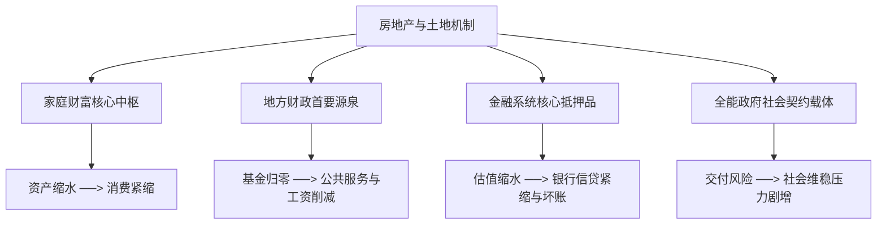
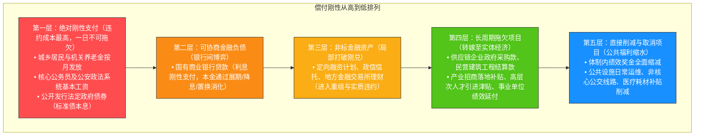

### 晴天霹雳：二十八年土地财政机器宣告停机

2026 年注定是不平凡的一年。这一年肯定会产生很多重大的改变，因为整个经济的内外环境都发生了剧烈的变化。虽然在 7 月底召开的**中央政治局会议**显得非常沉闷，没有推出任何有力的经济刺激政策——正如我在**不明白播客**做的那期节目所分析的那样——但令人意想不到的是，仅仅一个月后的 8 月底，中国经济就迎来了一场真正的晴天霹雳式的巨变。

这场巨变彻底动摇了过去近三十年的经济基石。自**朱镕基**在任期内一手推动**房地产商品化**、**住房按揭贷款**以及**地方土地招拍挂制度**以来，这套在中国运转了整整二十八年的宏观机器，正式宣告进入一个极度紧缩的阶段。我们不能说商品房制度自此彻底消失，未来居民如果需要住房，依然需要花钱在市场上购买；但是在中国的特殊国情下，商品房从来都不只是一件普通的消费品。很多人轻率地认为房地产行业萎缩了没有关系，可以用高科技、新能源、半导体或者人工智能来填补，这种看法完全脱离了中国经济的底层现实。

**房地产在中国绝不仅仅是一个在就业体量和产业规模上极其庞大的实体行业，它实质上是一台精密的金融与地方财政再生产机器。** 这台机器的运转模式构成了一个闭环循环：
1. **地方政府卖地**：地方政府通过**招拍挂制度**（Land Bidding, Auction and Listing System: 地方政府出让国有土地使用权的法定交易制度）向房地产开发商出让土地。
2. **银行贷款拿地**：房地产开发企业动辄需要数亿乃至百亿元资金买地，这些资金主要通过向商业银行申请开发贷款获得。
3. **预售与按揭回笼资金**：房企拿到土地后迅速开工，往往只需要打好地基甚至刚做到正负零阶段，即可开启期房预售；购房居民随即向银行申请**住房按揭贷款**（Mortgage Loan: 购房者以所购房产为抵押向银行申请的长期贷款），并将全额贷款与首付款打入房企账户。
4. **土地再抵押与杠杆扩张**：房企迅速用购房者的预售款和按揭款结清第一笔银行借款，同时将已获得的土地与在建资产进行再次抵押，获取更大规模的银行授信，进而参与下一轮土地拍卖。
5. **地方财政扩张与基建投资**：地方政府源源不断地从房企手中获得巨额**土地出让金**，并将这笔庞大的资金注入地方投资平台，转化为遍布全国的高铁、高速公路、产业新城和市政基础设施，造就了过去二十年为大众所津津乐道的基建奇迹。

这套高速周转的金融与财政齿轮自 1998 年启动，至 2021 年达到历史顶峰。然而在 28 年后的 2026 年 8 月，这个驱动中国经济高速扩张的核心引擎被彻底切断了。这并非简单的降温或减速，而是整个发展模式与财政再生产逻辑的根本转向。

---

### 三份新政拆解：从根源打断高杠杆与快周转

为了理解这场转变的彻底性，我们需要仔细剖析权威部门在短短两天内密集发布的三份核心政策文件。这三份文件从金融信贷、销售预售以及融资主体等维度，精准击中了房地产高周转模式的“七寸”。

```
过去模式：
[银行贷款买地] ──> [刚到地面即预售] ──> [按揭款即时全额拨付] ──> [资金池滚入下一块地]
                                                                        │
                                                                        ▼
改革后模式（新规阻断）：                                        [高周转杠杆再生产]
[严禁银行贷款买地（仅限自有资金）]
         │
         ▼
[主体封顶方可预售 / 鼓励现房销售]
         │
         ▼
[项目竣工备案后方可发放按揭贷款] ──> [资金沉淀至单个项目] ──> [高周转彻底终结]
```

**第一份文件发布于 8 月 27 日，由中国人民银行与国家金融监督管理总局联合出台**，核心聚焦于信贷投放与风险阻断：
* **严禁银行贷款买地**：明确规定银行业金融机构不得发放用于缴交土地出让价款及相关税费的贷款。在过去，房企凭借金融杠杆能够做“无本生意”大肆圈地；新规实施后，房企拿地必须完全使用自有资金。而在当前行业普遍流动性紧绷的背景下，能一次性掏出数亿甚至几十亿纯自有资金参与核心地块竞拍的企业屈指可数，绝大多数企业瞬间被关在门外。
* **按揭贷款严格延后至竣工备案后发放**：虽然制度上并未完全取缔预售，但规定个人住房按揭贷款必须在项目完成**竣工备案**后才能够发放给开发商。过去只要施工达到正负零，居民数十年的按揭贷款就已全额进入房企账户供其挪用扩张；新规将资金到账节点大幅推迟了一至两年以上，彻底终结了房企将购房者按揭款作为无息过桥资金的快周转模式。
* **房贷期限延长至 40 年与利率机制法定化**：文件虽将刚需住房贷款期限上限由 30 年放宽至 40 年，并落实存量房贷利率动态调整机制，但这仅仅是为了在需求侧降低刚需群体的每月偿债门槛，无法逆转供给端杠杆体系的瓦解。

**第二与第三份文件发布于 8 月 28 日，分别来自住房和城乡建设部、自然资源部以及中国证监会**：
* **大幅收紧预售门槛并确立现房销售导向**：住建部通知规定，商品房预售必须达到“单体建筑主体结构封顶”的法定条件，彻底改变了以往完成基础施工或达到投资额 25% 即可开售的规则，使房企开始销售和回笼资金的时间向后推迟了近一年。同时明确在土地出让阶段，优先向承诺现房销售的企业倾斜。
* **融资模式由企业主体转向项目融资**：证监会全面改革房地产开发融资方式，彻底打破了以往依赖碧桂园、恒大、万科等大型房企集团信用进行统一融资的模式，推行严格的单体项目封闭融资机制（White-list Project Financing: 以独立开发项目为风控和还款主体的封闭管理模式），旨在将风险完全隔离在具体项目内部，防范集团跨项目挪用资金导致的系统性暴雷。

这三份文件的出台，从金融资金供给、周转时间链条到资金结算路径上，全方位瓦解了过去房企“拿地-抵押-预售-再拿地”的循环体系。房地产业正式被剥离了金融衍生与信用创造的功能，被强制打回纯粹提供居住空间的单一物理属性。

---

### “放弃治疗”：断腕背后的财政收缩现实

外界常常将这一系列密集政策解读为宏观调控层面的“主动破局”或“壮士断腕”，但如果我们将视野拉长至过去五年的财政数据便会发现，**这在本质上是一场面对土地市场不可逆萎缩后的“放弃治疗”。**

| 年份 / 节点 | 全国土地出让金规模 | 政策定调与政府工作报告表述 | 宏观财政特征 |
| :--- | :--- | :--- | :--- |
| **2021 年（历史顶峰）** | **8.7 万亿元**（上半年 3.4 万亿） | 房住不炒，三道红线严格控杠杆 | 地方政府基金收入充裕，基建投资满负荷运转 |
| **2024 年** | 约 5.8 万亿元 | 降首付、降房贷利率、松绑限购限售 | 试图刺激按揭需求，托底房地产市场 |
| **2025 年** | **4.15 万亿元** | 释放刚需与改善性需求，发挥融资协调机制 | 竭力防范房企违约，试图保住土地融资职能 |
| **2026 年上半年** | **0.97 万亿元**（同比下降 31%） | 控增量、去库存、优供给；终结快周转 | 仅为 2021 年同期的 28%；政策转向放弃治疗 |

回顾 2024 年至 2025 年的宏观调控路径，监管部门曾竭尽全力试图重新激活楼市需求。从 2024 年 5 月起，全国各地纷纷大幅下调首套及二套房首付比例、取消房贷利率下限、上调公积金贷款额度；2025 年的政府工作报告依然强调“调整限制措施以释放刚需和改善性需求”，并明确要求“发挥房地产融资协调机制作用，防范房企债务违约”。彼时的政策基调依然试图维持这套房地产融资机器的运作。

然而，到了 2026 年初，政策话语体系发生了微妙而深刻的转变。政府工作报告中关于房地产融资协调机制的表述悄然隐退，取而代之的是“控增量、去库存、优供给”的收缩性定调。2026 年上半年全国土地出让金收入跌破 1 万亿元大关，仅录得 9700 亿元，同比 2025 年再次暴跌 31%；与 2021 年上半年 3.4 万亿元的历史峰值相比，降幅超过 70%，仅剩峰值时期的 28%。“十五五”规划编制之初原本可能计划分五年逐步推进的体制改革，在开局之年便被迫以最决绝的方式全盘出台，印证了决策层在认清土地市场无法复苏的客观现实后，选择彻底关闭这台已经无法提供正向现金流的旧机器。

---

### 房地产的四大支柱功能与全社会冲击传导

为什么房地产引擎的停机绝不仅仅关乎建筑行业或开发商，而是会深刻影响到每一个普通居民的生活？因为在过去近三十年的演进中，房地产在中国经济结构中承载了其他任何单一行业都无法替代的四项底层功能：



1. **中国家庭财富的核心中枢**：中国城镇居民家庭资产中超过 60% 以不动产形态存在。相比于半导体、光伏、电池或人工智能等高科技产业（普通居民若未直接持有其股权，其产业利润增长与个人可支配财富并无直接关联），房地产价格的涨跌直接决定了绝大多数家庭的资产负债表健康度。房价的持续下行必然带来全社会维度的财富缩水效应，从而直接压制消费意愿。
2. **地方财政运行的真正支柱**：在土地市场繁荣期，以土地出让金为主的**政府性基金预算**（Government Managed Fund Budget: 国家通过向社会征收以及出让土地、发行彩票等渠道取得的专项财政资金）规模曾一度相当于**一般公共预算收入**（General Public Budget Revenue: 以税收为主体、用于维持国家行政职能和基本公共服务的财政资金）的 80% 左右。在许多中西部及三四线城市，土地出让收入甚至占到地方可用财力的 70% 以上。当全国范围内的土地收入出现“腰斩再腰斩”，意味着大量区县和边缘城市的财政底座被直接抽空。
3. **银行金融体系的关键抵押品之锚**：在银行信贷体系中，土地与房产是最核心的信贷抵押资产。一旦不动产与土地估值出现大幅下挫，借款主体就需要追加抵押物，进而导致银行资产质量承压、信用扩张受阻乃至坏账率攀升。房地产领域的资产重估，实质上联动着整个金融体系的信用收缩。
4. **全能政府社会契约与信用兜底的核心载体**：在中国特殊的社会心理结构中，买房往往倾注了一个家庭数代人的积蓄。购房者对房屋能否按期高质交付具有极强的维权动机，这构成了各地政府必须严肃对待“保交楼”政治任务的根源。如果开发商违约导致大面积烂尾，直接冲击的是公众对政府监管信用与社会治理秩序的信任。

正是由于房地产深度嵌入了家庭资产、财政税收、银行信贷与社会契约这四大中枢，这台机器的停摆必然会通过财政链条逐级传导至整个社会的公共服务与微观生活。

---

### 数万亿财政黑洞：无痛收缩的神话破灭

土地财政引擎熄火后，留给地方政府的财政缺口究竟有多大？我们可以通过一组清晰的账目推导来还原真实的财政压力：

```
2021 年峰值土地出让金：8.7 万亿
2026 年预估土地出让金：约 3.0 万亿
------------------------------------
名义收入减少：约 5.7 万亿
扣除中央转移支付净增加（约 2.0 万亿）
====================================
实际硬性缺口：至少 3.0 万亿+（占地方总支出 10% 以上）
```

2021 年全国土地出让收入为 8.7 万亿元，至 2025 年降至 4.15 万亿元，2026 年预估将进一步回落至 3 万亿元左右，名义收缩规模达 5 万余亿元。尽管过去数年间中央对地方的**转移支付**（Fiscal Transfer Payment: 上级政府为均衡地区财力向中下级政府拨付的无偿资金）由 2021 年的 8.2 万亿元扩张至 2025 年的 10.2 万亿元（增加了约 2 万亿元），但对冲之后，地方财政仍面临着每年至少 **3 万亿元** 以上的硬性缺口。

更致命的是，土地出让收入历来是地方政府流动性最强、自主支配度最高的“现金流小金库”。一般公共预算往往被人员刚性编制与法定支出锁定，而政府性基金收入则可以灵活用于平抑临时赤字、垫付资金以及撬动**城投平台**（Local Government Financing Vehicles: 地方政府发起设立的城市基础设施投资建设与融资主体）融资。

社会上一直存在一种乐观论调，认为每年这 3 万亿元的缺口完全可以通过“无痛收缩”来化解：即只要砍掉低效重复的形象工程、停止产业园区盲目招商、压缩差旅会议等行政开支，就可以在不波及基本公共服务的前提下实现预算平衡。**但从公共财政与产业关联的角度来看，“无痛收缩”是一个完全不成立的伪命题。** 其根本原因在于：

1. **杠杆乘数与资金结构的刚性**：过去地方每一百元城市建设资金中，来自财政预算直接投入的通常仅占三成以下，其余七成全靠银行信贷与城投发债撬动。土地资金不仅用于直接投资，更承担着为庞大债务体系提供流动性支撑的功能。
2. **存量资产的维护与利息负担**：即便明天全国所有新开工项目全部叫停，历史遗留的城投债务利息依然需要按期支付，此前签订的巨额工程未结款项仍需偿付；包括在建的高铁网络、重大水利工程依然需要资金继续推进；庞大的道路、管网、桥梁、高层住宅更需要持续的养护资金投入，否则将面临快速折旧与安全隐患。
3. **庞大就业蓄水池的转移困境**：围绕房地产与城市基建，过去沉淀了包括建筑工人、勘察设计院、工程监理、建材水泥、机械重工、物流运输、家具家电以及园区周边餐饮租赁在内的海量就业人口。若简单粗暴地关停所有投资，这些劳动力无法在短期内被养老照护、基层医疗等公共服务岗位吸收——更何况托育养老和基层医疗本身的扩容，恰恰也需要高度依赖地方财政的持续补贴。

高科技产业与传统基建地产在吸纳就业和贡献地方税收的体量上存在数量级的差距，试图依靠新三样或半导体行业来弥补这 3 万亿元的财政真空，在宏观体量上是难以成立的。

---

### 政府违约的五层序列：谁将被推向支付末端？

当面对无法弥补的流动性缺口时，地方政府与金融机构一样，必须建立一套基于政治刚性与维稳优先级的**偿债与支付排序机制**。不同的支出项目根据其违约成本的高低，被严格划分为五个层级：



* **第一层：绝对刚性支出（零容忍违约）**
  * **城乡居民与退休人员养老金**：按月足额拨付是维持社会基本秩序的底线，一旦延误极易诱发群体性反应。
  * **公务员（尤其是公安、政法系统）基本工资**：作为维系政权运转与治安稳定的中枢力量，基本工资必须优先保障。
  * **公开市场法定政府债券**：包括地方政府一般债与专项债等标准债券，违约将直接导致国际与国内信用评级被调降，因此即便通过“借新还旧”或债务置换，也必须确保公开市场不爆雷。
* **第二层：可协商金融负债（借贷双方内部展期）**
  * **国有商业银行开发贷款与平台授信**：由于借贷双方均具有国有背景，通常采取“保息不还本”、贷款期限拉长至数十年、下调浮动利率等债务重组方式平滑处理，但其利息支付仍维持基础刚性。
* **第三层：非标金融负债（选择性打破刚兑）**
  * **信托计划、定向融资工具与地方金交所产品**：这类产品缺乏公开市场的强监管约束，已成为各地城投债务暴雷的高发区，普遍面临实质性展期、打折兑付甚至本金减值。
* **第四层：长周期挤占与拖欠（实体企业承压）**
  * **政府工程款与民企采购款**：包括建筑施工结算款、信息化服务费、医疗设备采购款等，账期由过去的按年结算演变为拖延数年乃至更久。
  * **招商引资与人才补贴**：此前承诺的企业投资补贴、研发返税、青年人才安居补贴等，被要求“统筹审核”，转为多期分批拨付或变相提高领取门槛。
  * **事业单位非核心人员报酬**：除基本薪资外的津贴与考核费用，往往需要等待上级财政的专项划拨。
* **第五层：直接削减与取消支出（公共服务退化）**
  * **体制内非刚性绩效奖金**：各类文明奖、年终绩效出现大面积缩减或取消。
  * **公共品日常运维开支**：缩减城市夜间照明、减少公交班次运营里程、延缓公立学校设施更新、降低医保目录内进口耗材使用比例。

在这套分层支付框架下，缺乏政治博弈筹码的民营供应商、普通体制外求职者以及依赖均等化公共服务的普通家庭，必然处于受冲击的最前沿。

---

### 恶性循环路径：从微观收紧到宏观紧缩的五个阶段

地方财政危机的传导绝非静态的账面调整，而是会沿着产业链与居民部门的资金流向，形成一个自我强化的负反馈闭环：

```
[阶段 1: 财政现金流枯竭] ──> 拖欠企业应收账款与工程款项
          │
          ▼
[阶段 2: 实体部门流动性承压] ──> 企业裁员降薪、缩减资本开支、叫停校招社招
          │
          ▼
[阶段 3: 居民部门收入预期逆转] ──> 全面转向防御性储蓄、推迟购房购车、降低生育意愿
          │
          ▼
[阶段 4: 终端消费与内需失速] ──> 汽车/家电/文旅等全链条消费萎缩、企业利润进一步下滑
          │
          ▼
[阶段 5: 税基与公共服务双重萎缩] ──> 地方可用财力再遭削减、公共治理与民生保障能力降级
          │
          └─────────────────────> (回流至阶段 1，加剧财政恶化)
```

1. **第一阶段：政府欠款导致实体企业现金流紧绷**。当财政资金优先满足第一、二层刚性支出时，承接政府外包业务的民营企业回款周期被无限拉长，许多供应链企业陷入严重的流动性危机，不仅无法收回历史应收款项，甚至在部分地区面临高强度的异地税务稽查。
2. **第二阶段：企业经营压力迅速向劳动力市场传导**。面对持续的现金流压力与收缩的订单，企业不得不采取裁员、降薪、停发年终奖以及大幅削减应届生校招规模等应对策略；体制内事业单位与地方国企的招聘指标亦同步冻结，导致青年群体的就业市场急剧承压。
3. **第三阶段：居民部门启动“防御性储蓄”机制**。面对收入预期的下降和未来失业风险，普通家庭被迫采取资产负债表防御策略：主动推迟换房、延后大宗耐用品采购、减少非必要教育及文娱支出，并将有限的现金全力转化为银行定期存款，以备应对突发医疗与养老需求。
4. **第四阶段：消费萎缩引发广泛的宏观紧缩**。居民消费意愿的整体冻结，导致包括汽车、消费电子在内的各个大宗消费行业出现两位数以上的下滑。消费市场的疲软反过来压低了制造业与服务业的投资回报率，使得宏观经济体系中的信用“活水”被抽离。
5. **第五阶段：税源缩减反噬地方公共治理水平**。消费与企业盈利的下滑导致企业所得税、增值税等税收收入进一步走低，加剧了地方财政的拮据程度。地方政府在“开源”受阻的情况下，一方面强化对存量税源与社保缴费的合规稽查力度，另一方面进一步削减公共设施运维与福利保障，使微观个体的“体感错位”愈发尖锐。

```
微观个体体感错位公式：
【外部义务刚性化】（严控税收稽查 + 刚性社保征缴 + 严格信贷催收 + 资本流动限制）
                      VS
【公共供给降级化】（进口药品退出 + 公交班次减少 + 设施老化失修 + 补贴门槛抬高）
```

这种制度层面的错位，正是未来数年居民在日常生活中最深刻的心理体验：个人所承担的法定义务与合规成本越来越高，而从公共体系中获得的福利供给与安全感却在不可逆地减少。

---

### 地理版图分化与漫长去杠杆周期的应对策略

这场伴随土地财政落幕的宏观调整，其烈度在不同能级的城市和区域呈现出极其严峻的梯度分化：

```
财政安全度与公共服务稳定性梯级图：
【第一梯队】北京、上海、深圳、顶级省会核心区（核心财力稳固，享有最高转移支付与总部税收）
    │
    ▼
【第二梯队】强二线城市及经济大省省会（具备独立工业造血功能，公共服务尚能维持常态）
    │
    ▼
【第三梯队】普通中西部地级市（高度依赖省级调剂，非核心建设与补贴大面积停摆）
    │
    ▼
【第四梯队】县域经济体（县级财政基本失去造血能力，完全依靠微薄的自上而下转移支付）
    │
    ▼
【最脆弱地带】三四线边缘新区、产业开发区、特色小镇（管网维护停滞、基础设施空置、面临“鬼城化”风险）
```

在过去二十余年盲目扩张中设立的大量三四线城市“产业新城”与远郊“高新技术开发区”，将成为本轮财政收缩中受创最深的地带。这些区域本身缺乏成熟的人口导入与真实的实体产业支撑，完全依赖土地出让金滚动维持运转。随着资金链断裂，其内部的公共管网维护、道路养护乃至水暖供应都可能面临停滞风险。相比之下，唯有极少数具备强大总部经济、深厚产业底蕴与充沛一般公共预算收入的超大城市核心区，才能在相当长的时间内维持现有的公共服务品质。

更为严峻的宏观背景在于，本轮财政收缩周期与中国社会加速到来的**人口老龄化**与**少子化**发生了重度叠加。无论是发展普惠托育以应对生育意愿低迷，还是构建庞大的老年照护体系，在现代公共治理框架下都需要地方财政提供长期的托底资金支持。在地方财力大幅萎缩的当口，这一结构性矛盾将变得异常尖锐。

决策层在推行经济战略时常强调“不破不立，先立后破”。然而，在房地产这套支撑了 28 年的旧财政支柱被实质性阻断之际，全国范围内的房产税立法尚未落地，中央与地方的事权与支出责任划分改革仍在探索，能够替代土地出让金的第二财政支柱并未真正建立。

在政策工具箱的推演中，部分市场观点寄希望于通过类似欧美各国的“中央银行直接量化宽松（QE）与无节制印钞”来冲抵债务。然而，在中国近现代经济史的集体记忆中，无论是 1948 年国民党时期的金圆券恶性通胀教训，还是 1980 年代末价格闯关诱发的宏观剧烈震荡，都使得决策层对恶性通货膨胀以及由通胀引发的社会动荡抱有极高的警惕。这种刻在治理底层的避险意识，决定了宏观政策极难采取激进的大水漫灌方式来全面承接地方债务。

自 2024 年开启的首轮 10 万亿元地方债务置换至今已进入第三个年头，但从微观流动性与实体活力的反馈来看，巨额化债资金主要用于置换高息隐性债务、防范系统性金融风险，并未在民间转化为强劲的经济增量。这充分表明，**过去二十八年依赖高杠杆、土地金融与超前投资积累的结构性负担，其消化与出清注定将是一场跨越数个五年周期的漫长过程。** 

对于置身其中的微观个体而言，必须清醒地认识到时代坐标的根本迁移：放弃对土地资产财富神话的非理性幻想，收缩个人与家庭层面的低效杠杆，审慎评估工作与居住所在地的真实财政造血能力，为迎接一个更加注重确定性、更具防御性的经济长周期做好扎实的准备。