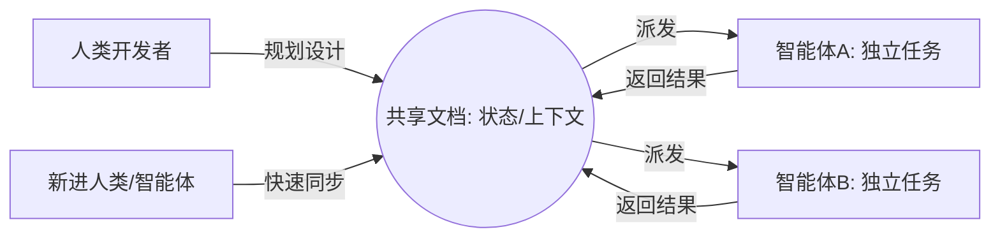

### 速度病的表征：提速 10 倍后的团队混乱

当个人开发者利用 AI 大幅提升编写代码的速度时，往往会给整个团队带来意想不到的系统性摩擦。这种由于 AI 引入导致产出骤增而引发的压力与混乱，被称为**速度病**（Velocity Sickness: AI 带来的代码产出暴增与实际业务影响脱节的失衡状态）。团队在经历速度病时，通常会表现出以下四个典型问题：

* **待合并的 PR 泛滥**：当全队工程师都在使用 AI 疯狂产出代码时，PR（Pull Request: 合并请求）的数量会呈指数级上升。这会导致合并队列崩溃，冲突频发，团队根本无法高效地进行代码审查和合并。
* **开发方向四分五裂**：多名工程师在多个智能体的辅助下，同时朝着不同的方向疾驰，彼此缺乏有效的同步。这不仅容易导致工作内容冲突，更会让团队失去专注力和协作凝聚力。
* **智能体破产**（Agent Bankruptcy: 开发者由于同时管理过多独立 AI 会话导致上下文过载，最终放弃并清理所有会话的历史状态）：工程师在一天内开着十几个终端与多个智能体协作，看似完成了海量工作；但在隔天重新面对这些智能体时，却像走入一间装满陌生人的房间，无法重建协作上下文，只能选择将其全部关闭并重新开始，从而造成了严重的 Token 和时间资源浪费。
* **出让代码所有权**：这是最致命的问题。当工程师允许智能体代替自己做出架构设计或关键逻辑决策时，就等同于放弃了对代码的控制权。长此以往，公司将不再真正拥有自己的产品，而是被智能体编写的未知代码所主导。

这一系列问题的根源，在于我们虽然极大提升了代码的生成速度，却并没有将其转化为有实际影响力的业务价值，即陷入了“无效果的高产出”陷阱。

<details>
<summary>Original English Source</summary>
The problem we work on at Ref is one you might be familiar with where individual engineers are going really fast with AI, but the team as a whole is not. And we're working to help close that gap. What I'm going to be talking about today is that is what happens when your whole team gets 10 times faster. All the things that don't go well. And my goal is to give you a blueprint for how to get through those issues and have the whole team move faster together.
These are some of the problems you might be experiencing right now. These are problems that affect individuals and are actually magnified at the team level once the entire team starts experiencing them.
The first one, too many PRs to merge. This is the classic first problem you hit when you start adopting AI as an engineer. You're like, "Great, I'm shipping stuff." And you push up those PRs and you're like, "There's no way I can merge all these." And this is obviously magnified when the whole team does this. Merge conflicts, merge queue breaks down, things get bad.
The second problem is that you're moving in many directions at once. This is also both individual and a team problem. Individually, this is where you have a bunch of agents doing different things. You're trying to remember who's doing what and your brain gets fried. At the organizational level, this is your engineers picking up things and running in a certain direction. Another engineer is running over here. Maybe some are bumping into each other and you're not moving cohesively with focus because you're just sprinting in all sorts of directions.
The third problem you might be experiencing is declaring agent bankruptcy. This is a common pattern I see engineers get into where you know, you're cranking. You have like your 12 terminals open. You're like at the end of the day you're like, "Yeah, I did a lot of work." You step away from your laptop, spend time with your friends and family. Next morning you come back and it's like walking into just a room of strangers. Like, who are these people? What are they doing here? But like no problem. They're agents so you just like get rid of them and start over again. The problem though is you know, it feels like you're doing a lot of work but you're doing the same work and you're spending tokens twice. You're doing the same problems over again. And if you think about that organizationally, that's your team not being efficient with both their time and their token resources.
Problem four though is actually the most important one. It's critical decisions being made by agents. Once you have agents doing a lot of your work, if you as an engineer are letting an agent make a critical decision, you are seeding control of your code. You are no longer the owner of that code. The agent is. And if you imagine that at scale at your company, if the engineers across your team are giving up ownership of the code, you no longer own the product.
The way I like bundle it down is into this term velocity sickness. This is the stress caused by sudden output increases thanks to AI. It affects individuals or teams and the result is output without impact. So, this is that feeling of like we're moving really fast. This should feel great. This should feel awesome, but for some reason it doesn't feel awesome. We're not having the things you expect to be happening are not happening despite this feeling of being so productive.
</details>

---

### 未读页面与未用软件：低频连接的效率陷阱

为了更直观地理解速度病，可以从非软件工程领域中寻找共性。一位 newsletter 创作者展示了由 AI 驱动的高效创作流程：他将想法生成、研究探索、内容整合和编辑修正等环节全部交给智能体协同打理。这套高度成熟的体系让他能够达到“每周产出一本书”的惊人效率。

然而，在这个看似完美的创作管道中，存在一个核心断层：他的受众根本不可能每周去读完一本书。尽管智能体极大提高了内容产出的速度，但由于缺乏读者在接收端的消化和反馈，绝大多数生成的页面最终都处于无人阅读的状态。这种高产出与零阅读的断层，完美折射了软件工程师在使用 AI 时的现状。

我们开发产品的最终目的是与人建立连接，去改善用户的日常生活和工作方式。然而，在速度病的影响下，工程师们极易沉溺于“我能用 AI 快速写出大量代码”的技术快感中，而忽略了这些代码是否真正解决了用户的痛点。效率的骤增掩盖了方向的偏离，导致生产力资源的空转。

<details>
<summary>Original English Source</summary>
I want to tell a little story about somebody to make this very real. This is a story about somebody who's actually not an engineer, but I think it parallels our engineering workflows a lot. Part of my job is I get to go, find, and talk to people who are really pushing the forefront and try and learn from them. And I love that part of it. And so, this is somebody and I'm talking through their identical workflows. And this is somebody who writes a newsletter, and their workflow is around how do I have my ideas and then they're doing research and exploration and then cohesion between those ideas and editorial to make sure it's in their voice. And they're walking me through their system for how they manage this whole pipeline and really scale out their efficacy. And this is very much not slop. This is somebody who is using agents to amplify their own voice in a way that's impressive. I'm like, "Wow, that's so cool." And then they're like, "Yeah, I'm basically writing a book every week." And I'm like, "Oh, okay. Is your audience reading a book every week?" And they're like, "No, they're probably not." Right? They're not. This is a person who's writing a lot, but those pages that they're writing are going unread. I think that's part of this experience of velocity sickness is we're building things that are not mattering for the people we want them to matter for, the people we're trying to reach.
Instead of unread pages, what we want is we want to write words that matter. We want to write words that connect with people. And the parallel to us as software builders and product builders is that we want to build products that connect with people. We want to build products that change the way people live and work and make their lives better. And we have more ability to do that than ever with AI. But we have this feeling of velocity sickness where it feels like we should be doing that, but it's not quite landing.
</details>

---

### 工作流重塑：从“个人脑力编码”到“人机协作设计”

在传统的软件工程时代，开发者的工作流是一个相对连贯的单人闭环：首先在前期进行构思和规划，接着进入长时间的隔离式编写与自我迭代（即单人纯手工实现环节），最后做一些细节润色并发布。以往所有的集成开发环境（IDE）和代码管理工具，都是基于这种“单人、沉浸、以实现为核心”的模式设计的。

引入 AI 之后，工作流的底层结构发生了剧变：
1. **前期设计与规划**：人类开发者首先要明确意图，构建系统轮廓并梳理系统关系。
2. **生成与实现**：传统的编码实现环节，已逐步外包给智能体自动执行。
3. **审视与润色**：人类重新接入，接管智能体生成的结果，进行可行性审查、深度测试和逻辑打磨。

在这套全新的流程中，真正的“人类手工编码”时间已被大幅压缩，而最具创造性和协作性的**规划**和**润色**环节则上升为主导。开发者已经从一个体力编码者转变为**决策层**（Decision Layer: 开发者在 AI 编码时代的核心职责，专注于系统架构、决策权归属、设计品味和战略路线的定义）。决定工程成败的，不再是键盘敲击的速度，而是开发者能否通过清晰的决策将复杂的软件系统引导至正确的方向。这要求我们必须切换工程“挡位”，使用匹配这一决策层协作特征的全新工具体系。

```mermaid
graph TD
    subgraph 传统开发模式 (以编码实现为核心)
        A[前期规划] --> B(手工编码/迭代/单兵作战)
        B --> C[后期润色与发布]
    end
    subgraph AI协同开发模式 (以决策与规划为核心)
        D[人类: 前期规划与意图设计] --> E{智能体: 自动生成与实现}
        E --> F[人类: 审查、调试与打磨]
    end
    style B fill:#f9f,stroke:#333,stroke-width:2px
    style D fill:#bbf,stroke:#333,stroke-width:2px
    style F fill:#bbf,stroke:#333,stroke-width:2px
```

<details>
<summary>Original English Source</summary>
So, let's talk about how we got here. This is what the software engineering process used to look like before AI. We'd do some planning up front. We'd sit down and build. We'd implement. It'd be iterative. We'd be exploring. But largely we're sitting down building in isolation, implementing something. And at the end we sort of polish it up and ship it out the door. And this was great. We all knew how to do this. We had a lot of systems for this. And it was good. And then AI came along. But at this time our tools were built for this. Like all our history of coding tools were built for this style of work. Our IDE, our workhorse, it was built for implementation and polish to be done by an individual, to be heads down building as a software engineer writing code. That's a tool built for how we used to work.
So, let's look at how we work now. Our work looks a lot more like this. Where you do some planning up front. You start thinking about what am I trying to do here? You take this idea in your head and start to flesh it out. At some point an agent takes that idea and like implements it. This arguably should not even be on this slide cuz it's not our human work anymore. It's done by the agent. And then in the end we do some polishing where we take back that thing the agent has made for us and we hold it in our hands and we say, is this what I wanted? This is a very different shape of work. Right? We're no longer doing this like heads down building. These are the two creative and collaborative parts of our work as engineers. This is where we express our craft as an engineer. And the one that's most different is the planning stage. So, I want to zoom in on that just a little bit. That's the like exploratory, creative, collaborative part where we're thinking about like I have this vague idea. I have this complex system. I need to understand the contours of this system, apply this idea, and really understand it. And I need to pull out what's relevant and express my taste as an engineer. As to like, where do I want this system to go?
This is the kind of work that's creative and needs to be done together. I think the shape of engineering teams and product teams is changing with AI. But we're always going to have this thing where we have a group of people responsible for managing a complex system and it's sort of deciding the future of that system. And that's this planning work. And so, we're starting to see some of the hints of like, okay, we had tools built for a certain type of work. Our work looks different now.
Let's think about what this new layer of our work is. This is the decision layer. This is where we're thinking through what are the key decisions, doing that like craft of engineering, and expressing our taste as engineers, ultimately a different thing than implementation. And it's a different gear as an engineer. The skill now is what gear am I in? Am I using the appropriate tools for the gear that I'm trying to accomplish right now?
</details>

---

### 文档中心模式：以“状态”为载体的系统级交互

大多数团队在决策层遇到的第一个阻碍，是过度依赖单向聊天的“对话框交互模式”。基于对话（Chat）的协作工具天然是**隔离的、转瞬即逝的、容易让人放弃深度思考的**。在对话中产生的核心架构决策无法沉淀、极难跨团队共享，甚至会随着对话窗口的关闭而被智能体彻底遗忘。

一个真正适配决策层的开发工具，应当以**文档（Docs）而非对话**作为交互的核心媒介。在这个模式下，工具链的工作方式发生了本质的转变：

1. **信息聚合与呈现**：像钢铁侠的贾维斯一样，它能分析整个复杂系统，把与你当前任务最相关的系统上下文（代码段、接口依赖、历史修改记录）自动拼装并平铺在你的面前。
2. **解耦状态与行为**：最核心的观念转变是将**文档作为系统状态的载体**（即软件的骨架与核心决策流），而将**智能体降级为无状态的执行动作**。

当智能体变得 stateless，开发者就可以从同一个结构化文档中随时衍生、启动不同的智能体去并行实现不同子模块，而不必担心上下文断流。同时，人类开发者也可以通过实时查阅这篇高度结构化的文档，轻松重建协作上下文，彻底告别“智能体破产”的窘境。



<details>
<summary>Original English Source</summary>
So let's think about what a tool built for the decision layer would look like. It'd be a tool built for docs and not chat. And there's that's like a short sentence. There's a lot to unpack here though. So I'm going to spend a lot of time on this slide.
The problem with chats is that they are the relic of building for implementation. So they're default isolated and ephemeral and brain off. They're made to build things and get stuff done. And that's not really the same type of work we're doing at the decision layer. We're doing this creative exploratory work. So being in this isolated environment where I'm working with an agent, maybe I start with my vague idea and I'm exploring it and asking questions, but decisions are being made in that chat that are not shared with my team, that are going to disappear. It's going to result in some code being output where those important decisions are not being made clear and shared with the team. And you're also in this mode where the agent saying "Okay, this is what I want to do. Is that okay? Let's go." Or sometimes it'll ask you a question and it'll be like, "this is the recommended option," and then you're like, "great. I don't even think about this. I'll just hit that one and we keep going."
Docs start to solve this problem. So when you center your work around working in docs, they're meant to bring forward the key decisions. This is what our work is now. Our work now is figure out what decisions matter and then make those decisions and then get out of the way while the agents fill in the rest.
Working in Docs is the classic way we would create alignment. If you think back to being a manager or a lead on a team before AI, if your team was struggling with alignment, you would not tell them like, "Let's go all work in Slack DMs. Let's go direct message each other." You'd say, "Let's bring forward key decisions, align on them, spend time on these, find a way that we can really spend time getting our decisions right."
So, there are two things you might be thinking looking at this that are not what I'm talking about here. The first one is plan mode. That's a great tool. The other one is like full-on factory spectrum and development. That's a great tool, too. I'm talking about something in the middle. Plan mode is great, but it's largely a rich chat message where the agent is saying, "Hey, here's a better visualization of what I'm trying to express to you." Yeah, that's great. But it's still in this isolated ephemeral environment. And what I'm suggesting is something more durable, more shared, more long-lived that you and your team are spending time on. Similarly, the spectrum and development where we just define the behaviors, we operate at the product level, is a little far away from the engineering reality. The engineering reality is that I need to understand my system and have a tool that helps me understand that system and lay out those key decisions in a technical sense.
The way I like to conceptualize this is as the portal to the software system, where you are like Tony Stark and you're like, "Show me what matters." And you're like, "I'm working on this. Pull out the bits that are relevant." And AI is amazing at finding things that are related to other things, helping you find what's relevant and lay them out on the table in front of you. Organize the pieces in the way you want to represent how you want the system to grow.
But the big conceptual flip here is actually that we're pulling out the state. So, when you're living and working in a long-lived session with an agent, there's this implicit context being built up over that work, and that's great. But you're also doing actions and it's not shared. What you want is to separate the agent as the action and the doc as the state. And so, you can spawn new agents that have the same context or starting from the same place that are able to collaborate and work on the same piece of context and state. You're ultimately doing context engineering in this doc, so that every agent is largely stateless and starts from the same place. And what that gives you is your team and yourself can look into this and understand what actually is in here, what are the decisions that are being made, and have a clear understanding of what the key decisions are. So, this is a different way of working where your core atom of your work is a doc rather than a chat.
</details>

---

### 想法速度的跨越：将敏捷评估点前移

引入文档中心工作流后，团队开发效率的评估标准将产生一个健康的演变：团队会发现大量的开发设计规划最终并没有转为具体代码的实现。

这并不是无谓的内耗，相反，它是敏捷开发在 AI 时代的进化标志。当团队把决策和审查点大幅度前移到编码工作之前，开发者就能以极低的 Token 和脑力成本，在文档空间内反复横向探索多种系统设计的可行性。这种演进帮助团队跳出**原型重力**（Prototype Gravity: 团队过早为某一初始原型方案提交实现代码，以至于由于重构和转换成本过高，被动锁死在并不完美的单一设计路线中）的束缚。

通过在设计阶段对海量“想法分支”进行快速筛选，团队实现了从传统的**代码速度**（Code Velocity: 生成和递交代码包的绝对速率）向**想法速度**（Idea Velocity: 在文档/规划层面探索、验证及废弃不同架构设计路径的迭代效率）的跨越。其最终结果是，每一次智能体启动的编码任务，都是基于高一致性的共识，极大地缩短了后续的代码合并阻力和重构周期。

<details>
<summary>Original English Source</summary>
What happens when you actually start to implement this? Well, the first thing we see happen actually is that people start to plan and then not implement their plan. And this is actually like a really good sign. Because what that means is they're thinking through ideas. They're saying, "I have this idea. Let me explore it. Let me start to flesh it out. Like I have this vague thought. Don't just give me some code. Don't go off and like build it for me, but let me help me understand the idea that I'm talking about." And then they have a bunch of these and then some of them are getting built and some of them aren't. So, that means they're prioritizing the ideas that after they've explored them are the ones that are worth building and going into the next step with.
One way I like to frame this is that you're shifting from code velocity to idea velocity. So, going back to our problem statement like how are we dealing with velocity sickness? The velocity sickness is we're shipping too much code that's not going anywhere. The solution is to shift that velocity to ideas so that rather than getting stuck in prototype gravity where we build something and we're so excited to just ship that thing and we're going down like one path of the idea maze, we can now like more effectively explore that whole maze and find that gold that's around the corner and really impact the people we're trying to help.
Let's see how this starts to address those velocity sickness problems I talked about at the beginning.
First, too many PRs. We've moved the review point earlier into the process. So, we're aligning on the key decisions up front. That means the code review is easier because the hardest part of any code review is, you know, what actually matters here. That's the first step is like, "Hmm, what do I care about here?" If you move that earlier, we've aligned on that, the code review becomes much simpler.
Number two, moving in too many directions. Again, we're aligning early as a team and individually. I'm understanding what I'm working on across many agents. If I'm working on a large thing, I've understood it initially. So, as a team, we're sharing these plans and we're aligning. This is what we're trying to build and it's easy before someone has spent even a day in AI going deep on some idea building a prototype, we can talk about it early and make sure we're aligned on where we actually taking the system.
Declaring agent bankruptcy is just not a thing because you've made your agent stateless. So, the result of their work is in the stock. If you need to rebuild your human context, you just read the doc. Now, you understand the state of this project and you can pick up from there.
And the most important one, humans own the decisions. Like, that's what we're solving for. Humans need to own the decisions. That's how we retain ownership of our software and our products and make it like a true expression of what we're trying to create in the world.
There are also some other benefits. So, when you have this state extracted and you're working from a shared context, you get more parallel agents. It's easier to work with parallel agents. You get this durable decision log. So, something that's really powerful. I think a lot of people are thinking about how do we capture all the decisions going into these sessions? A really great solution to that is let's pull out all the decisions up front and agree to them and put them in a place that's durable so that we don't have to have like some LLM summarizing it and maybe picking the wrong things later on. We want to bring that forward so we can save it and refer to it later.
And then my favorite one is actually more collaboration. Like this process, we're doing more work that is creative, which means we should be collaborating more as engineers. I think the future of engineering is multiplayer. It's going to be multiplayer by default sooner than we think. And it's more important than ever because we're in this moment with AI where everything's moving faster than ever. There's a pressure like everyone's company feels existential, small or big. You need to deliver. And the way we get through that as humans is by working together. And we need tools that help us do that.
</details>

---

### 实操行动指南：摆脱速度病的三个关键步骤

对于面临“速度病”困扰的技术团队，可以立刻在日常开发中落地以下三项具体的改良实践：

1. **分清“规划”与“润色”这两个不同开发挡位**：在开启任何编辑器或智能体终端之前，清醒地认识自己目前所处的工程状态。是在进行前期的**系统级架构规划**，还是在对已有代码进行**局部的微调打磨**？不要在同一个长对话窗口里将两者混为一谈，注意工具在不同阶段对你的赋能效率。
2. **将设计文档视作系统级入口**：像对待生产代码一样对待设计文档。利用 AI 提取系统依赖，将文档改造成可以清晰检索、自由组合、可读可写的交互界面。这不仅是向团队展现系统大图的窗口，也是你向下游智能体传递高浓度上下文的黄金底座。
3. **在团队中公开分享并评审你的设计计划**：打破 AI 时代带来的“单兵闭门造车”怪圈。智能体非常擅长执行细节，但真正决定系统架构高度的是你的技术 taste。在让智能体跑起第一行代码前，把文档丢给队友，主动接受同僚们的输入、纠偏和建议。这是人类在 AI 研发时代巩固代码最终所有权最有效的防线。

<details>
<summary>Original English Source</summary>
So, here are three concrete things you can leave this room and do right now.
The first one is to think of your work in terms of planning and polish. So, recognizing that there are two gears I'm working in. There's no longer this one focus of implementation. There's plan and then polish. And notice when you're in a single session and you're doing both of these in one session. Notice when you drift from the planning phase into the polish phase and is your tool serving you for what you're trying to do at that moment?
Number two is to start to treat your plan as a portal to the software system. So, really treating it as this powerful, malleable tool to say like, what matters to me for what I'm working on right now? And asking it to show that to you so that you can make the best decisions possible.
And number three is share a plan. Like, don't just you know, write the plan, give it to your agent, and have them implement it. Give it to someone on your team. This is like, I feel like very unnatural for a lot of people. We always we think we know what's going on. But, it's always valuable. You have smart teammates. They have great context in their heads. You should tap into that. They will give you good feedback. It's a really valuable thing to do.
That's my talk. I'm Matt. I'm the CEO of Ref. If you want to talk about any of this stuff, this has all my like connection information. Ref is a tool built for the decision layer. We work with all of your existing implementation tools. If you want to see a demo, you can come by our booth or just see me out there. And I'd love to talk about this stuff, so come say hi. Thanks.
</details>