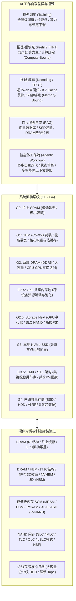
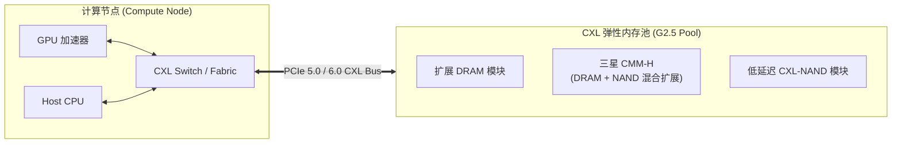
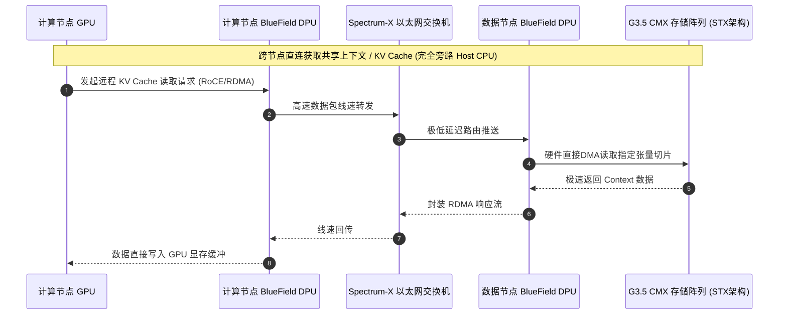
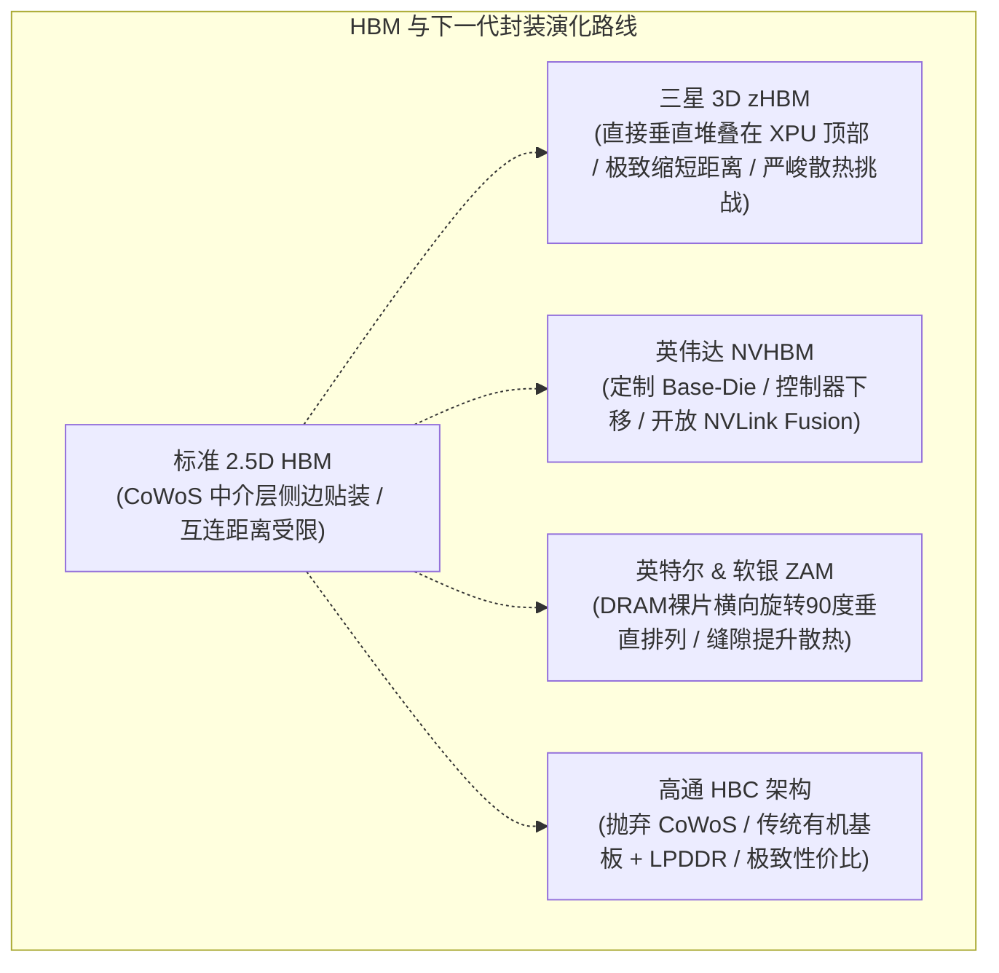

### 解构认知误区：从训练算力到推理内存墙的范式转移

在探讨人工智能算力基础设施的演化路径时，业界普遍存在一个根深蒂固的认知惯性，即认为**AI内存**（AI Memory: 支撑人工智能计算体系中数据搬运与缓存的存储硬件总称）的全部核心就在于**高带宽内存**（High Bandwidth Memory: 通过先进封装垂直堆叠的多层DRAM架构，简称HBM）。在许多人的直观理解中，大模型的性能扩张似乎仅仅等同于堆叠更高规格、更大容量的HBM。只要不断采购最新的HBM产品，算力系统的吞吐瓶颈就能迎刃而解。

然而，半导体产业与大模型工程落地的真实物理现实远比这种线性思维复杂得多。真正将现代大模型系统逼入绝境、形成严苛“内存墙”制约的瓶颈，往往并非发生在计算密度极高的离线训练阶段，而是深植于大模型在线**推理**（Inference: 大模型接收输入并逐字生成回答的实际运行过程）的**解码阶段**（Decoding Phase: 自回归生成输出token的计算阶段）。随着模型服务并发量的爆发式增长，**键值缓存**（KV Cache: 存储注意力机制中历史Token键值对以避免重复计算的显存缓冲区）的膨胀速度远超绝大多数系统架构师的早期预期。

伴随着这一结构性矛盾的爆发，半导体产业链正在以惊人的速度推陈出新，各类新型技术与缩写层出不穷：**高带宽闪存**（High Bandwidth Flash: 试图用闪存实现接近HBM带宽的低成本技术，简称HBF）、**超低延迟闪存**（Z-NAND: 优化读取延迟与IOPS的高性能闪存介质）、**计算快速链接**（Compute Express Link: 基于PCIe物理层的高速缓存一致性互连标准，简称CXL）、**内容存储内存**（Content Memory Storage: 专门用于存储与共享上下文缓存的存储架构，简称CMX）、**Z角内存**（Z-Angle Memory: 旋转芯片堆叠角度以改善散热的物理封装技术，简称ZAM）、**高带宽计算**（High Bandwidth Computing: 采用传统封装与LPDDR的低成本高带宽方案，简称HBC）等方案轮番登场。产业链在加速推动技术迭代的同时也在高频制造行业缩写，演进节奏之快令众多一线从业者眼花缭乱。

为了厘清这一错综复杂的技术版图，全球知名投资研究机构**伯恩斯坦**（Bernstein: 华尔街顶级资产管理与投资研究机构）的四位资深半导体分析师联合撰写了一份极具系统性的AI内存产业研究报告。该报告摒弃了碎片化的技术罗列，构建了两个相互交织的核心分析框架：一个是从**系统架构**（System Architecture: 存储在计算系统中的拓扑拓扑位置与数据通路）出发的物理层级划分，另一个是从**硬件介质**（Hardware Media: 硅片物理结构、工作原理与工艺封装）出发的材料演化分类。沿着这一双重坐标系，我们可以清晰透视AI内存全产业链的演变逻辑、商业博弈与终局趋势。



---

### 负载剖析：训练、推理、RAG与智能体的内存动力学

理解AI内存技术演进的前提，在于深刻洞察不同AI工作负载对存储子系统的差异化物理诉求。脱离具体的运算场景去空谈内存带宽或容量，往往会导致系统设计的严重失真。在实际应用中，训练、推理的各个子阶段、外部检索增强以及多智能体协同，各自对应着截然不同的硬件资源消耗模型。

#### 1. 深度模型训练：全层级内存协同与容灾挑战
模型训练作为整个人工智能研发生命周期中计算密度最高、耗资最庞大的阶段，其核心挑战虽然高度依赖于算力芯片的**算力吞吐量**（Compute Throughput: 芯片每秒执行浮点运算的次数），但**内存带宽**（Memory Bandwidth: 存储介质每秒可传输的数据量）同样起到了决定性的木桶短板作用。内存带宽的高低直接设定了算力集群能够高效训练的模型参数量上限，并决定了整体训练周期的收敛速度。

在实际生产集群中，训练绝非单纯依靠HBM即可独立运转。一套完整的万卡训练系统必须建立端到端的存储流水线：
* **数据准备与分级加载**：规模达数十TB乃至数PB的海量多模态训练数据集，必须预先存储在成本更为经济、容量更为庞大的分布式存储介质中。
* **多级流水线缓存调度**：在计算循环运转期间，训练数据需要从底层网络存储经过本地存储、**系统动态随机存取存储器**（Dynamic Random Access Memory: 计算机系统主内存，简称DRAM）的多级缓冲池进行预取，最终在精确的时间窗口内推送到加速器的HBM显存中。
* **检查点容灾机制**：前沿大模型的单次训练周期动辄持续数周乃至数月。在数千乃至数万张加速卡并发运行的复杂环境下，任何单一硬件故障（如GPU掉线、网络丢包、显存位翻转）都会中断任务。因此，系统必须极其频繁地将模型全量权重、优化器状态和梯度参数写入持久化存储介质，生成**检查点**（Checkpoint: 训练状态的持久化快照）。这一过程要求从HBM到系统DRAM、本地固态硬盘乃至分布式文件系统的全链路均具备极高的吞吐与高可用性，任何一个环节掉链子都会导致昂贵的计算集群陷入长时间的空转等待。

#### 2. 大模型在线推理：计算绑定与内存绑定的二元对立
模型推理在执行逻辑上呈现出高度异构的两个核心阶段，二者的底层系统瓶颈完全不同：

* **预填充阶段（Prefill Phase）**：该阶段负责解析用户输入的全部Prompt提示词上下文，并生成回复中的第一个Token。由于需要将整个输入上下文一次性转化为内部表征，系统在这个阶段执行的是大规模的高维矩阵乘法运算。此时GPU或专用加速器的张量核心利用率极高，数据搬运耗时远低于乘加运算耗时，属于典型的**计算绑定**（Compute-Bound: 性能瓶颈受限于算力核心运算速度的场景）。在预填充阶段，系统内存的整体压力相对可控，HBM的超大带宽优势能够得到充分释放。这一阶段的核心服务质量指标是**首Token延迟**（Time to First Token: 用户发出请求到收到第一个生成字符的响应时间，简称TTFT）。在常规对话场景下，TTFT控制在0.5秒以内是极佳的用户体验，1秒以内属于工业界普遍可接受范围，一旦超过2秒，用户感知到的交互迟滞感会显著加剧；而在处理数百页专业文档或超长代码库等重负载场景下，系统通常需要配合“思考中”的前端交互状态提示以拉高用户的等待容忍阈值。
* **解码阶段（Decoding Phase）**：该阶段则呈现出截然相反的运行特征。大模型在输出后续文本时采用逐字生成的**自回归生成**（Autoregressive Generation: 当前输出Token依赖于此前所有已生成Token历史的序列化生成机制）范式。每产生一个新的Token，网络都需要重新遍历并计算当前Token与历史所有Token的注意力关联。为了避免对历史Token进行指数级膨胀的重复矩阵计算，现代大模型推理框架都会在显存中开辟专用空间，将历史Token在注意力层计算出的Key和Value张量持久驻留，这就是业界熟知的KV缓存。

```
自回归解码阶段的内存绑定机制：
每生成1个新Token ──> 必须读取全部历史KV Cache ──> 显存搬运量随上下文线性扩张
单卡显存容量受限 ──> 并发Batch Size被迫压缩 ──> 系统沦为内存带宽与容量瓶颈
```

KV缓存的容量占用与上下文中的Token总数呈严格的线性递增关系。尤为严峻的是，模型的静态参数权重是只读的，可以在同一实例下的所有并发请求之间共享；而KV缓存则承载着特定用户的独立对话上下文，属于用户私有状态，必须为每个并发连接独立分配独立的存储空间。这意味着，随着用户并发量的上升，整个服务系统占用的KV缓存总量将发生剧烈的线性乘积膨胀。

在超大规模的集群推理部署中，动态累积的KV缓存所消耗的显存空间往往会迅速超越模型自身权重所占用的物理内存。KV缓存不仅直接限制了单台推理服务器所能承载的最大并发用户数，更锁死了大模型所能支持的上下文窗口极限。换言之，**KV缓存的处理效率与存储密度，直接决定了AI商业化部署的单机服务密度与整体商业变现的盈利天花板**。解码阶段的核心评估指标是**每Token耗时**（Time Per Output Token: 模型生成单个输出字符的耗时，简称TPOT）。对于标准文本对话，TPOT控制在50毫秒以内即可满足人类正常阅读速率；而对于实时语音对话、代码实时补全以及多步骤智能体闭环等严苛场景，TPOT必须被极限压缩至10毫秒以内。

#### 3. 检索增强生成（RAG）：向量构建与高频检索的异构开销
**检索增强生成**（Retrieval-Augmented Generation: 通过连接外部知识库动态检索相关事实以辅助生成的架构，简称RAG）旨在解决模型的幻觉问题并注入私域时效性知识。其内存开销同样展现出清晰的两段式特征：
* **离线数据库生成阶段**：需要将海量的企业文档、工程代码库或多模态网页等非结构化数据切块后，输入嵌入模型转化为高维向量并构建索引。该过程需要超大容量的**固态硬盘**（Solid-State Drive: 基于半导体闪存芯片的非易失性存储设备，简称SSD）作为持久化底座，相比传统机械硬盘（Hard Disk Drive，简称HDD）能够显著降低原始切片访问延迟；而高维向量的生成、聚类与ANN索引构建则主要依赖大容量系统DRAM，该环节属于离线一次性投入，与实时并发请求数无关。
* **在线实时搜索阶段**：用户Query被编码为向量后，系统需要在超大规模向量索引库中执行相似度Top-K检索。高频并发的近邻搜索与图遍历算法严重依赖大容量系统DRAM的高速随机访问性能；当检索出精确知识片段并拼装至Prompt后，工作流重新回流至标准推理的预填充与解码阶段，继续遵循前述的内存消耗规律。

#### 4. 智能体工作流（Agentic Workflow）：状态爆炸与级联放大
当AI应用从单轮问答演进为具备自主目标拆解、工具调用、结果验证与反思回退的**智能体**（Agent: 能自主感知环境、规划路径并调用工具完成复杂目标的AI系统）时，内存子系统面临着前所未有的压力。智能体执行复杂任务需要频繁在中间步骤保持上下文状态、暂存执行日志与环境变量，这直接诱发了对传统通用CPU与大容量系统DRAM的大量访问需求。

更为致命的是，在多智能体协同流水线中，上游智能体的完整输出上下文会被直接包装为下游智能体的输入Prompt。这种拓扑结构导致多智能体在并发运行时，预填充计算量、解码负荷以及各自维持的KV缓存呈现出极其恐怖的**级联累加效应**。其瞬间爆发的内存带宽与容量开销，使得任何单一节点的显存系统都会被瞬间击穿，必须依赖更加深度的系统级内存分层架构来解耦承载。

---

### 系统拓扑重构：从G0到G4的深度内存分级体系

为了应对上述极端异构的内存负载，半导体与云计算产业正在彻底重塑传统的计算存储拓扑。伯恩斯坦分析师团队结合了**英伟达**（NVIDIA: 全球AI计算与GPU芯片领军企业）、**Solidigm**（全球领先的企业级NAND闪存与SSD供应商）以及众多学术界与产业界的最新技术定义，将现代AI计算系统中的存储层级系统化地划分为 **G0至G4** 的完整架构层级。这一划分不仅清晰界定了每种技术方案在物理系统中的拓扑点位，更揭示了计算与存储在拓扑空间上的解耦演进趋势。

| 层级编号 | 架构命名与核心定位 | 代表性物理介质 | 物理连接与通信协议 | 主要承载数据类型 | 核心设计诉求与技术特征 |
| :--- | :--- | :--- | :--- | :--- | :--- |
| **G0** | 片上极速缓存 | SRAM (嵌入式 6T 结构) | 逻辑晶圆内部片上总线 / 混合键合 | L1/L2/L3 级缓存、即时张量运算寄存 | 纳秒级极低延迟，与计算核心同晶圆生产，容量极小（数十至数百MB） |
| **G1** | 紧耦合高带宽显存 | HBM (3D堆叠 DRAM) | 中介层 (Interposer) / CoWoS 先进封装 | 活动模型核心权重、当前热点 KV Cache | TB/s 级极致带宽，物理贴装于芯片基板，成本与封装门槛极高 |
| **G2** | 节点近端系统内存 | DDR5 / LPDDR5 DRAM | 主板专用内存通道 (DIMM / CAMM) | 操作系统驻留、RAG索引、CPU-GPU中继 | 容量达 TB 级，GPU可通过驱动与总线直接旁路 CPU 发起直接内存访问 |
| **G2.5** | 共享解耦内存池 | CXL 扩展内存 / CMM 模块 | PCIe 5.0/6.0 物理层 + CXL 缓存一致性协议 | 跨节点动态共享内存、弹性扩展工作区 | 破除单机内存壁垒，消除内存碎片，支持 DRAM/NAND 混合介质池化 |
| **G2.6** | GPU中心化准内存 | Storage Next / 超高 IOPS SSD | PCIe Direct / NVMe-oF / 专用光纤 | 大容量 KV 溢出缓存、热数据集分级暂存 | 以 GPU 为核心的主动数据管理，采用 SLC/pSLC 介质缩小与 DRAM 性能差距 |
| **G3** | 节点内部本地存储 | NVMe 计算 SSD (TLC/QLC) | PCIe / M.2 / U.2 / E3.S 本地插槽 | 节点本地数据集、全量模型权重快照 | 节点内部大容量非易失存储，无法直接跨计算节点硬件级共享 |
| **G3.5** | 集群级内容存储 | CMX 专用存储 / STX 架构 | 专用以太网 + RoCE + BlueField DPU | 集群多 Agent 共享动态上下文、分布式 KV Cache | 计算与存储解耦，GPU 通过专用存储网络直接直连高速存储节点，无 CPU 瓶颈 |
| **G4** | 分布式冷/温存储 | 阵列 SSD / 企业级 HDD / 磁带 | 分布式存储网络 / S3 / NFS / SAS / SATA | 原始训练语料、历史全量归档、长期模型版本 | 追求极致每GB存储成本与海量容量，通过高速网络按需拉取至上层计算栈 |

#### 1. G0层级：计算单元核心的片上极速堡垒
G0层级是距离物理算力核心最近的极速存储空间，通常由嵌入在逻辑芯片内部的**静态随机存取存储器**（Static Random-Access Memory: 依靠双稳态触发器保持数据的极高速易失性存储器，简称SRAM）构成。该介质具有皮秒至纳秒级的极致响应速度，与GPU、NPU的计算逻辑核心在同一块晶圆上一体化流片制造。其核心功能是作为执行即时算术逻辑运算的超高速缓存，容量极为珍贵（通常在几十兆字节到数百兆字节量级）。

#### 2. G1层级：AI加速计算的黄金生命线
G1层级由当前名声大噪的HBM所统治。它通过**晶圆级芯片封装**（Chip-on-Wafer-on-Substrate: 台积电研发的2.5D先进中介层封装技术，简称CoWoS）等前沿封装工艺，将多层垂直堆叠的DRAM裸芯片与主算力逻辑芯片紧密封装在同一有机基板上。G1层级凭借数千条微微米级的硅通孔互连线，能够迸发出高达数TB/s的恐怖数据吞吐吞吐带宽。该层级是模型在推理与训练过程中，吞吐活动模型只读权重以及最活跃、访问频率最高的“热点”KV缓存的核心阵地。

#### 3. G2层级：节点内部的主干系统内存
G2层级由布置在CPU附近的传统**双倍数据速率同步动态随机存取内存**（Double Data Rate Synchronous Dynamic RAM: 通用计算系统的标准主内存规范，简称DDR DRAM）构成。虽然其访问延迟和带宽表现无法与封装内部的HBM同日而语，但其具备数十倍于HBM的物理容量与显著的成本优势。在现代异构计算服务器中，英伟达与AMD的GPU计算卡均已实现通过底层总线协议绕过主机CPU调度，直接对G2层级的系统内存发起高速**直接内存访问**（Direct Memory Access: 允许外设直接读写系统内存而无需CPU介入的数据传输技术，简称DMA）。

#### 4. G2.5层级：突破物理孤岛的CXL共享内存池
为了打破不同计算节点与异构芯片之间的物理内存孤岛，G2.5层级引入了**计算快速链接**（Compute Express Link: 一种开放的行业标准互连协议，能够在CPU、GPU及专用加速器之间提供高速、低延迟的缓存一致性共享，简称CXL）。这项最初由**英特尔**（Intel: 全球半导体与微处理器巨头）主导发起、现已演进为全行业共同标准的革命性互连技术，其核心战略意义在于将原本物理分散在各个设备插槽中的离散内存，在底层逻辑上汇聚抽象为一个动态、弹性的逻辑共享内存池。



在CXL协议的调度下，CPU可以直接映射并读取GPU附带的HBM空间，GPU同样能够以极高带宽无缝借调由CPU管理的巨量主系统内存，甚至连通过PCIe接口插入的独立内存扩展模块也能被统一纳入该地址池。为了进一步降低扩容成本，CXL协议在后续演进中全面拓展了对NAND Flash存储介质的支持。通过在模块内部集成高速DRAM或SRAM作为读写缓冲，这类模块能够有效掩盖底层闪存颗粒的固有时延。其中最具代表性的硬件实体当属**三星电子**（Samsung Electronics: 全球最大的半导体存储芯片制造巨头）研发的CMM-H（CXL Memory Module-Hybrid）混合存储模块，成功实现了DRAM与NAND在CXL协议层面的高效融合。

#### 5. G2.6层级：由GPU主导的Storage Next准内存革命
位于传统DDR DRAM与本地NVMe SSD之间的G2.6层级，被称为**Storage Next**架构。这是由英伟达深度主导、联合全球几乎所有头部存储芯片厂商共同发起的生态项目。该层级的建立旨在驱动两大范式转移：
* **控制权中枢转移**：彻底终结以CPU为系统控制中枢的传统总线调用模式，构建以GPU为绝对数据路由中心的全新调度机制。
* **介质特性融合**：强力改造底层**与非门闪存**（NAND Flash Memory: 一种高密度、低成本的非易失性半导体存储介质，断电后数据不丢失，简称NAND），使其在数据访问粒度、读取时延和IOPS指标上无限逼近DRAM的性能特征。

Storage Next产品形态多为DRAM与高品质NAND颗粒的混合硬件体，并在制造中大量采用**单层单元**（Single-Level Cell: 每个物理浮栅存储单元仅存储1个比特信息的高性能闪存颗粒，简称SLC）。日本半导体存储巨头**铠侠**（Kioxia: 全球闪存与固态硬盘领军企业，原东芝存储器）推出的GP系列SSD即是该层级的代表作，其核心特性在于提供千万级乃至上亿级的极高**每秒读写操作次数**（Input/Output Operations Per Second: 衡量存储设备随机读写性能的关键指标，简称IOPS），从而在DRAM显存耗尽时充当极速后备上下文交换池。

#### 6. G3至G4层级：从本地物理SSD到集群级CMX/STX架构
在传统单机架构中，**G3层级**由部署在服务器主板边缘的本地**非易失性高速内存接口固态硬盘**（Non-Volatile Memory Express SSD: 运行于PCIe总线上的极速固态存储设备，简称NVMe SSD）所构成。这部分存储空间虽能将单机容量拓展至数十TB，但受限于硬件连线，无法直接跨节点实现微秒级共享。

针对超大规模分布式推理与多智能体级联交互中频繁产生的跨节点上下文搬运痛点，英伟达开创性地定义了**G3.5层级——CMX（Content Memory Storage，内容存储内存，早期称ICMS）与STX架构**。CMX硬件本质上是一组符合特定互连协议的高速SSD资源阵列，物理上脱离计算节点，独立部署于专用的数据存储节点中。在整个AI集群内部，来自不同计算节点的数百颗GPU均可通过高带宽以太网光纤，穿透**Spectrum-X**高速交换芯片直达数据节点。借助双端部署的**BlueField-4 数据处理器**（Data Processing Unit: 专门负责网络传输加速、安全加密与存储卸载的片上系统，简称DPU），计算GPU可以实施端到端的远程存储直接内存访问（NVMe-oF/RoCE），彻底将主机CPU从繁重的数据搬运中解放出来。



与CMX配套的**STX**则是英伟达面向全球ODM服务器厂商和存储模块商推出的系统参考架构标准，旨在规约统一的电气、固件与协议接口，确保多厂商产品在万卡集群中的即插即用。而在最底层的**G4层级**，则是通过传统网络连接的共享企业级SSD、高密度HDD乃至磁带库，用于持久化托管离线冷数据、预训练原始文本以及长期模型镜像。

---

### 介质革命：SRAM、DRAM与NAND的物理极限突围

脱离系统宏观拓扑、深入微观硅片材料与器件物理维度，我们可以观察到另一条波澜壮阔的演进主线。存储介质的微观单元构造、载流子控制原理与封装工艺的每一次革新，都在微观层面重塑着上层架构的性能与成本边界。

```
存储微观单元结构对比：
┌──────────────────────────────────────────────┐
│ SRAM 单元: 6个晶体管 (6T)                    │
│ 速度极快 / 面积巨大 / 无需刷新               │
├──────────────────────────────────────────────┤
│ DRAM 单元: 1个晶体管 + 1个电容 (1T1C)        │
│ 速度快 / 面积适中 / 必须周期性通电刷新       │
├──────────────────────────────────────────────┤
│ NAND 单元: 浮栅/电荷捕获型晶体管             │
│ 非易失性 / 密度极高 / 按块擦除 / 读取延迟较高│
└──────────────────────────────────────────────┘
```

#### 1. SRAM演进：片上堆叠与LPU架构的极端设计
作为硬件物理金字塔尖的介质，SRAM凭借6个晶体管构成的双稳态触发器实现数据锁存，读取延迟处于亚纳秒至个位数纳秒级别。然而，其代价是相较于DRAM的**1T1C结构**（一个晶体管加一个存储电容的微观存储单元结构）需要霸占极其高昂的硅片有效面积。

在AI算力领域，SRAM的极端应用范例催生了**语言处理单元**（Language Processing Unit: 专门针对语言模型自回归解码阶段优化、全面采用超大片上SRAM消除内存带宽瓶颈的专用ASIC架构，简称LPU）。由硅谷明星初创公司**Groq**设计的LP30芯片（相关技术方案亦获得英伟达的架构授权），彻底抛弃了外挂HBM的设计路线，将整颗芯片的硅面积几乎全数划归片上SRAM，以极速SRAM网络支撑极速自回归解码。其正在规划的下一代**LP40芯片**，据产业界披露将全面采用**混合键合**（Hybrid Bonding: 在晶圆表面直接将铜焊盘与介电质在分子级别无凸点无缝键合的高密度3D垂直互连工艺）技术，直接将大容量SRAM裸片垂直堆叠在计算逻辑核心晶圆之上。这种3D物理堆叠在仅带来极其轻微的时延增加的前提下，大幅拉升了芯片的集成容量并改善了单比特传输功耗。

#### 2. DRAM与HBM技术路线的分野与抗衡
作为全球半导体存储产业营业收入与商业利润绝对支柱的DRAM，其产线晶圆产能与微缩工艺构成了整个算力产业的定海神针。当前，各大巨头围绕DRAM微缩以及HBM的下一代形态展开了多路径博弈：

* **微缩制程与极紫外光刻的角力**：现代标准DRAM的微细化演进依然遵循摩尔定律的物理路径，这意味着**极紫外光刻机**（Extreme Ultraviolet Lithography: 利用13.5nm波长极紫外光源进行纳米级芯片图形曝光的尖端半导体制造设备，简称EUV）已成为先进制程DRAM制造不可或缺的准入门槛。在受限缺乏EUV光刻设备的外部制约下，中国存储龙头企业**长鑫存储**（CXMT: 中国大陆专注于通用动态随机存取存储器研发制造的核心半导体企业）正在开创性地研发**4F² DRAM单元结构**。传统1T1C DRAM的单元面积通常为6F²，4F²架构通过创新的垂直立体晶体管设计，将周边外围逻辑控制电路从电容侧面直接转移至微观电容下方、甚至整体转移至另一块独立的基底晶圆上进行晶圆键合堆叠，从而在同等光刻机分辨率下实现单次面积缩减跃迁。然而，由于4F²结构的微缩收益本质上属于单次结构红利（类似于逻辑芯片从Planar转向FinFET），未来长远的持续微缩仍需依赖向**3D DRAM**（将存储电容与晶体管在Z轴垂直多层生长的全新三维存储架构）的体系化突破。



* **三星 3D zHBM**：现行主流HBM均采用2.5D封装，即将堆叠的HBM立方体放置在算力芯片旁边，通过硅中介层进行横向电气连接。三星提出的zHBM方案试图跨越至真正的3D集成，直接将整座HBM立方体倒扣贴装在主算力芯片（XPU）的正上方。这一设想虽然能将通信物理距离缩短至极限并大幅拉升总带宽，但底层高功耗XPU产生的剧烈发热极易引发上层DRAM芯片的局部热击穿与数据电荷快速泄漏。三星计划采用无间隙的晶圆级混合键合工艺改善界面导热，但其量产良品率与制造成本依然面临行业审视。
* **英伟达 NVHBM 联盟**：英伟达主导的定制化NVHBM打破了传统存储原厂的利益格局。在NVHBM体系下，最底层的**基底芯片**（Base-Die: 位于HBM堆栈最底部负责信号路由与逻辑控制的硅晶圆衬底）将脱离存储原厂掌控，改由英伟达自主设计并交由**台积电**（TSMC: 全球规模最大的半导体晶圆代工制造企业）先进工艺制造。英伟达直接将显存控制器从XPU本体剥离并下放至该Base-Die中，从而大幅缩减XPU芯片面积以释放宝贵的算力核心空间。同时，英伟达正在积极推动NVHBM与**NVLink Fusion**互联生态走向行业标准化，并已吸引**亚马逊**旗下的Annapurna Labs（AWS自研云端AI芯片研发机构）加入合作生态。该模式本质上收窄了传统存储原厂的定制化话语权与产品溢价空间。
* **英特尔 XBM 与 ZAM 构想**：英特尔披露的**交叉批次内存**（Cross-Batch Memory: 一种在芯片制造后道金属层之间集成DRAM单元的创新结构设计，简称XBM）专利，通过利用半导体制造的后道互连层和薄膜晶体管工艺直接制造DRAM单元，使得存储阵列能够与主逻辑运算电路原位融合，被视作存内计算的潜在路径；而英特尔与**软银集团**（SoftBank: 全球知名科技投资集团）旗下子公司SAIMEMORY联合推进的**Z角内存**（Z-Angle Memory: 将堆叠中的DRAM芯片物理旋转90度呈垂直阵列排布的全新立体封装方案，简称ZAM），则通过将芯片呈90度横向侧立排列，利用芯片之间的物理缝隙构筑高效率散热风道，力图解决高密度显存堆叠的热应力失效难题，目前预计在2029财年前后迈向实用化。
* **高通 HBC 性价比突围**：**高通**（Qualcomm: 全球移动计算与无线芯片巨头）推出的高带宽计算（HBC）方案则选择了务实的降本路线。该方案彻底剔除了成本高昂的CoWoS中介层与2.5D基板，改用常规的先进多层基板封装工艺，并直接采用成熟低功耗的LPDDR5/5X颗粒。尽管其绝对峰值带宽相较顶级HBM有所妥协，但其极佳的能效比与低廉的物料成本使其在边缘AI服务器与推理工作站中极具竞争力，规划于2027至2028财年分两代推向市场。

#### 3. 存内计算（PIM）的理想与现实鸿沟
在体系结构层面，**存内计算**（Processing-in-Memory: 直接在存储单元或阵列内部集成逻辑处理单元以消除数据搬运的颠覆性架构，简称PIM）从诞生之初就承载着打破**冯·诺依曼架构**（John von Neumann Architecture: 计算单元与存储单元物理分离的经典计算机体系结构）“存算分离”天然缺陷的崇高理想。虽然三星等厂商早已成功在HBM内部集成了可编程SIMD计算单元，但PIM在主流算力市场的商用落地却极为缓慢。其深层阻力在于：要真正释放PIM的潜能，必须自底向上彻底颠覆现有的编译器、操作系统、并行通信库及软件算子生态；同时，半导体产业历经数十年分工已经形成了逻辑代工与存储制造高度专业化分割的万亿级重资产格局，强行将计算与存储逻辑在先进制程晶圆上高密度融合，无论在良率控制还是在商业经济性上均面临巨大的现实鸿沟。

#### 4. 存储级内存（SCM）与增强型NAND的介质跨界
在DRAM之下、常规NAND之上的性能鸿沟带，构成了广阔的**存储级内存**（Storage-Class Memory: 具备接近DRAM的速度与非易失性大容量特性的新型存储技术统称，简称SCM）竞技场。这一领域呈现出两条鲜明的演化分支：

```
新型非易失介质 (MRAM / PCM / ReRAM) ──┐
                                     ├──> SCM 存储级内存中间带
增强型闪存 (SLC / XL-FLASH / Z-NAND) ──┘
```

* **新型物理原理介质**：包括基于电子自旋极化特性的**磁阻存储器**（Magnetoresistive RAM，简称MRAM）、基于硫属化物相态转变的**相变存储器**（Phase-Change Memory，简称PCM，英特尔曾商业化的傲腾3D XPoint即属此类）以及基于氧化物导电细丝机制的**阻变存储器**（Resistive RAM，简称ReRAM）。尽管物理特性极佳，但高昂的材料制造难度使其规模化量产成本难以下降。
* **工程改良型极速NAND**：相较于物理原理的推倒重来，存储原厂更倾向于在现有NAND产线上进行极致工程榨取。根据单个存储单元内部电子物理捕获状态数的不同，NAND颗粒被划分为四种形态：

```
NAND 颗粒形态特性对比：
┌──────┬────────┬──────────┬──────────┬──────────┐
│ 颗粒 │ 每单元 │ 访问速度 │ 擦写寿命 │ 成本容量 │
├──────┼────────┼──────────┼──────────┼──────────┤
│ SLC  │ 1 bit  │ 极快     │ 极长     │ 昂贵小量 │
│ MLC  │ 2 bits │ 较快     │ 较长     │ 均衡中等 │
│ TLC  │ 3 bits │ 适中     │ 适中     │ 主流经济 │
│ QLC  │ 4 bits │ 较慢     │ 较短     │ 极致廉价 │
└──────┴────────┴──────────┴──────────┴──────────┤
│ pSLC │ 伪1bit │ 接近SLC  │ 大幅提升 │ 牺牲容量 │
└──────┴────────┴──────────┴──────────┴──────────┘
```

铠侠通过利用SLC与MLC颗粒打造的**XL-FLASH**产品线及GP系列SSD，当前已可实现1000万级IOPS，次世代产品直指上亿级IOPS指标；三星则开发了基于超低时延架构的**Z-NAND**与Z-SSD系列；**美光科技**（Micron Technology: 全球知名存储半导体跨国制造企业）等厂商则广泛采用了**伪SLC模式**（pSLC Mode: 将成熟低成本的TLC颗粒通过固件降权模拟为单比特SLC模式运行的软件定义方案），通过主动牺牲三分之二的物理标称容量，换取接近原生SLC颗粒的峰值读写速度与使用寿命。在此基础上，铠侠在产业实践中构建了极其严密的产品映射体系：以XL-FLASH对应G2.6（Storage Next），以成熟TLC对应G3.5（CMX），以极致密度的QLC全量铺设G4底座。

在NAND的最前沿阵地，由**闪迪**（SanDisk: 全球知名闪存存储品牌，西部数据旗下）与**SK海力士**（SK Hynix: 全球顶尖半导体存储芯片制造巨头，HBM技术核心领跑者）深度协同推进的**高带宽闪存（HBF）**，甚至试图跨越物理层级，直接在HBM旁侧构筑“G1.5”近端缓冲；而三星针对移动终端大模型部署推出的**zNAND-O**技术，则采用先进堆叠封装工艺将大容量TLC闪存裸片与移动处理器紧密贴合，为端侧AI的大上下文推理开辟了全新路径。

---

### 产业资本映射：伯恩斯坦权威机构研报评级与估值参考

技术体系的深层重构必然伴随着资本市场价值中枢的剧烈迁移。伯恩斯坦分析师团队基于对技术护城河、专利布局、先进制程产能占有率以及客户绑定黏性的多维度综合研判，在这份里程碑式的行业研报中对全球核心存储与硬件基础设施上市公司给出了明确的投资评级与基准目标价。

> **基准评级准则说明**：在伯恩斯坦证券研究部的量化评级模型定义中，**跑赢大盘**（Outperform）明确定义为该标的在未来12个月内的全收益表现预期将超越其对应行业基准指数 **15个百分点以上**；而**跑输大盘**（Underperform）则明确代表其预期表现将大幅落后基准指数 **15个百分点以上**。

```
伯恩斯坦全球核心存储标的评级与目标价一览：
┌──────────────────┬──────────────┬──────────────┐
│ 标的企业名称     │ 投资评级     │ 机构目标价   │
├──────────────────┼──────────────┼──────────────┤
│ 三星电子         │ 跑赢大盘     │ 440,000 KRW  │
│ SK海力士         │ 跑赢大盘     │ 3,300,000 KRW│
│ 美光科技         │ 跑赢大盘     │ 1,300 USD    │
│ 闪迪 (西部数据)  │ 跑赢大盘     │ 3,000 USD    │
│ 希捷科技         │ 跑赢大盘     │ 1,350 USD    │
│ 西部数据         │ 跑赢大盘     │ 770 USD      │
│ 铠侠             │ 跑输大盘     │ 40,000 JPY   │
└──────────────────┴──────────────┴──────────────┘
```

* **三星电子（Samsung Electronics）**：给予“**跑赢大盘**”评级，基准目标价设定为 **440,000 韩元**。核心投资逻辑在于其全球首屈一指的先进制程DRAM晶圆制造底盘、全栈自研的垂直整合制造（IDM）优势，以及在CMM-H、3D zHBM、zNAND-O等下一代前瞻技术上的专利壁垒。
* **SK海力士（SK Hynix）**：给予“**跑赢大盘**”评级，基准目标价设定为 **3,300,000 韩元**。作为当前全球高端HBM市场的领军供应商，海力士在先进MR-MUF封装工艺上积累了极强的技术壁垒，与算力龙头客户的深度绑定为其构筑了极高的利润护城河。
* **美光科技（Micron Technology）**：给予“**跑赢大盘**”评级，基准目标价设定为 **1,300 美元**。美光在1-beta制程DRAM能效表现上的突破，以及在HBM3E与pSLC高性能SSD领域的差异化市场策略，使其在北美云巨头供应链中占据战略制高点。
* **闪迪 / 西部数据 / 希捷**：闪迪（SanDisk）评级为“**跑赢大盘**”，目标价 **3,000 美元**；企业级机械硬盘巨头**希捷**（Seagate: 全球企业级大容量机械硬盘核心制造商）评级为“**跑赢大盘**”，目标价 **1,350 美元**；**西部数据**（Western Digital: 全球存储数据技术与硬盘存储制造巨头）评级为“**跑赢大盘**”，目标价 **770 美元**。这一集中看好的核心驱动力在于：随着AI生成数据量呈超指数级膨胀，分布式冷温数据与下沉KV Cache的海量归档需求直接引爆了对大容量近线HDD与高密度闪存的长期确定性采购。
* **铠侠（Kioxia）**：给予“**跑输大盘**”评级，基准目标价设定为 **40,000 日元**。尽管其在XL-FLASH等高性能闪存颗粒技术上造诣深厚，但相对孤立的产品线结构、对传统闪存周期波动的高度敞口，以及在面对异构DRAM与HBM跨界侵蚀时相对脆弱的资产负债表结构，对其长期资本回报构成了显著压制。

*(注：以上数据均来源于伯恩斯坦公开行业研究报告的预测模型与量化推导，仅作为半导体产业竞争格局与技术价值研究之参考，不构成任何直接的证券买卖操作建议。)*

---

### 总结与展望：存储二十年未有之变局与未来终局

纵观整个人工智能基础设施的发展史，我们正在亲历半导体存储产业过去二十年来最为激荡的重大范式重塑。

从**系统架构维度**审视，曾经统治信息产业数十年的以CPU为绝对调度中枢的经典体系正在加速瓦解。一种**完全以GPU/XPU为中心、面向超大规模张量数据流直接路由的新型存储拓扑**正在全面确立。从G0的片上纳秒级暂存，到G2.5的跨节点一致性内存池化，再到G3.5的解耦式共享内容存储，每一层物理边界与访问协议都在被底层算法需求强行重构。

从**硬件介质维度**洞察，传统SRAM、DRAM与NAND三大流派界限分明的森严壁垒已然被打破。为了在“极致速度、海量容量、可控功耗与商业成本”这一不可能四角难题中寻求动态平衡，各大厂商纷纷向彼此的腹地深度渗透：SRAM通过3D混合键合下沉扩大容量，DRAM通过垂直堆叠与先进封装拉升带宽，NAND则通过架构改良与模式裁剪极力模仿DRAM的响应特性。

对于身处这场浪潮之中的全球芯片架构师、系统工程师与产业决策者而言，这无疑是半导体存储领域最具颠覆性、充满最大不确定性却又最富创造力的黄金纪元。技术路线的纷争与洗牌仍在烈火烹油中演进，究竟哪一种拓扑形态与物理介质能够在这场百舸争流的内存突围战中最终确立工业标准，历史的帷幕才刚刚拉开。