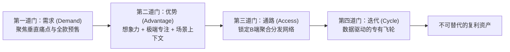

### 执行过剩陷阱：低构建成本下的商业幻觉

在启动任何基于**人工智能**（Artificial Intelligence: 模拟人类认知与执行能力的计算系统）的副业或初创项目之前，必须认清一个残酷的底层现实：**利用AI赚钱最轻便的方法，往往是长远来看最脆弱的商业模式**。诸多管理过数十亿美元科技企业的核心高管反复验证了一个共识：在AI时代，速度固然至关重要，但单纯的技术执行速度绝无法自动为你形成具有排他性保护的护城河。40年前如果有人想在美国制作一档电视节目，现实中只有三扇门可以敲开——**ABC**、**NBC**与**CBS**。如果这三家主流广播网全部拒绝，你的节目在物理层面上便不复存在；而今天只要拥有一部智能手机与网络连接，任何人都能在**YouTube**上自由发布节目，无需获得任何守门人的准入许可。

然而，准入门槛彻底归零的另一面，是次日清晨醒来时平台又新增了数百万条视频的残酷红海。平台让“创造与分发”变得唾手可得，却让“打造稀缺与高价值资产”变得空前艰难。当AI将人类的智力与执行流程极度工具化时，启动一家新业务的门槛被无限拉低，但**AI工具本身绝不构成你的独占竞争优势**——你的所有潜在竞争对手都拥有完全一致的提示词、模型与接口。**低启动成本（Low Cost）固然是一次绝佳的开端，但零门槛必然导致的低差异化（Low Differentiation）则是商业上的致命伤**。这就是典型的技术幻象：容易构建，并不代表容易在竞争中胜出。要建立能够持续多年盈利的硬核业务，创业者必须依次穿越四道被称为“门”（Gates）的严苛筛选机制。

Original English Source

もしあなたがAIを起動しますパートタイムの仕事またはビジネスを作成するAIに基づいて、見てみましょうこれは開始前のことです。なぜなら最も単純な稼ぐ方法AIでお金は最悪のビジネス開発のためのモデル。私はこれを知ったのは最高経営責任者および取締役取締役技術的な企業数十億ドル。そして彼らは皆同じ​​ことを言うそして同じ。スピードAIの世界において重要、しかし、彼女は手伝う何かを作り出すユニークで保護されています。そして理解する作り方強力なビジネス利益をもたらす何年も。40年前、もしあなたが望むならテレビ番組を作るアメリカ、基本的に3つのドアがあり、ノックすることもできます:ABC、NBC、CBS。そして、もし３人とも「いいえ」と答えた。あなたの番組は実際には存在しなかった。もし電話とWi-Fiがあれば、走ることができますYouTubeであなたの番組を視聴今日。あなたはしない誰かの許可。しかし同時に、目が覚めるまで明日、YouTubeでさらに20件アップロードします数百万本の動画。したがってYouTubeを使えば簡単に創造と広める。しかしあなたの状況はより困難になります何かを作り出す能力貴重な。そしてAIはそれを実行する正確に知性と実行。それ作成を容易にする追加のビジネス。しかし、AI自体はあなたのものではありません利点は、あなたの競合他社は同じツール。低コストで素晴らしいスタートだ。低分化これは致命的だ。これで終わりだ。人工的な錯覚。ライト建てない簡単という意味勝つために。本物問題はこのようなものを作る価値があるどちらの方が模倣しにくいでしょうか？あなたのAIの場所はどこですか？ビジネスは達成できる成功と繁栄？この場所を見つけるには、合格しなければなりません4つの門を通り抜けて。私私はそれらをゲートと呼んでいます。合意。合格とします。これらそれぞれを通してゲートを具現化し、模範となる生き方さまざまなAI関連企業。

### 第一道门：验证由痛点驱动的真实付费需求

进入商业探索的首要关卡是**需求之门**（Gate 1: Demand）。衡量一个业务构想是否具备商业价值的唯一标准，在于是否有人愿意为其真金白银地买单。2006年当**埃隆·马斯克**（Elon Musk）启动**特斯拉**（Tesla: 全球电动汽车与清洁能源巨头）计划时，外界普遍认为造电动车与丰田或宝马竞争纯属天方夜谭。然而特斯拉推出初代跑车 Roadster 时，率先推出了前100台签名限量版预售，每位买家在未见到量产实车前就必须支付全额10万美元定金；最终全部100台名额在三周内售罄，并在正式量产数月前锁定570台预售订单。马斯克在建厂前便明确回答了绝大多数初创者故意回避的核心拷问：**如果我做出了这个产品，究竟有谁会为此买单？他们愿意付多少钱？**

大量失败的AI副业恰恰倒置了逻辑顺序：开发者看到某个提示词教程在10分钟内生成了一个网站，便盲目乐观地认为“我可以做AI建站业务”。但实际上，你仅仅证明了“AI具备快速建站的能力”，却从未证明“市场上有人愿意付钱请你来代劳”。**AI可以提供技术方案，但绝无法替你凭空捏造市场需求**。在实操中，穿越需求之门必须贯彻三大步骤：
* **切入极度狭窄的垂直利基（Niche Down）**：绝不设计针对“泛小微企业”的通用方案（这种市场在现实中根本不存在），而是锁定“在本地拥有3家以内诊所的独立牙医”、特定独立招聘顾问，或“年营收低于100万美元的独立独立站品牌”。客群越精准，挖掘其核心痛点的颗粒度就越清晰。
* **与真实买家深入访谈（Customer Interview）**：坚决摒弃向亲朋好友做问卷调查的自欺欺人行为，直面真正面临业务阻碍的目标客户，探寻那些让他们夜不能寐、迫切需要花钱消灾的具体障碍。
* **以极低成本构建最小可行产品（MVP）**：利用**最小可行产品**（Minimum Viable Product: 仅包含核心验证功能的早期产品形态）快速交付测试版本，直至客户确认其价值并完成付款。例如在会计这一由**QuickBooks**等传统巨头主导的市场中，与其做泛AI会计软件送死，不如深入调研那些传统通用软件无法满足的个性化痛点（如退休合伙人的独立咨询账目与多方分账流程），通过定制化的AI流程为特定小群体解决燃眉之急。AI大幅降低了验证成本，但对痛点与客户心智的洞察仍须人工完成。

Original English Source

それでは、最初の問題に移りましょう。ゲート―需要。として自分が持っているものを理解する良いビジネスアイデアですか？誰かが始めると彼女に支払う。2006年にイーロン・マスクは何かをするそれはまるで狂気の沙汰のように聞こえた。彼の会社は何百万も生み出す電気自動車だが、彼は自分がそうするかどうかわからなかった少なくとも1つに対する需要彼らのうちの。ほとんど誰も信じていた電気自動車競争することができるトヨタかBMWで。テスラロードスターを導入し、最初に提案した100台の車として特別シリーズサイン。すべての購入者預金をしなければならなかった10万ドル、いいえ車を受け取った。全100 3週間で完売しました。まだ作られた。つまり、2007年8月まではテスラが先行販売570ロードスターが数時間後に開始の数ヶ月前生産。彼は答えはその質問過半数創業者たちは試さないで置く。私がこれをしたら私が作成しますが、その責任者は誰ですか？支払いますか？いくらですか？お客様はフランチャイズ。彼らは拒否権を有する。そして結局は全く同じものです。彼らはあなたにそれを処方してくれるでしょうか？チェック？誰もいない場合支払う、あなたは変化に備えよ提案、変更顧客基盤または考え方そのものを変えることさえある。そしてそれが多くの人々私たちの中で、誰が建てるのですか？AI関連の副業「前後逆」誰か何が可能かを示してくれるウェブサイトを作成するの助けがあってのみたった10のヒント分。そしてあなたはこう思う。「ああ、できるよ。ビジネスを構築するAIウェブサイト」。しかし、すべてあなたがしたことはAIが証明できるウェブサイトを作成する。あなた誰かがあなたに支払いたいあなたがこれをする彼らのためになぜいけないのか？作成する独立して？つまり、AIは提供できます解決策だが、彼はあなたのために作成できます要求。あなたがすべきことはこれです。自分でやりなさい。では、どのようにこれをするために？として需要をチェックしますか？3つまでできます。もの。まず、狭く、ニッチな分野を選ぶニッチな分野で。選ばない小規模向けのソリューションビジネス全般。私つまり、そんなものは存在しない。以下の解決策を選択してください歯科医は3つ未満の支店周辺３都市あなた。または選択独立した採用担当者、またはブランドShopifyで収益を上げる100万未満ドル。何かこのようになぜ？より狭い層顧客にとって、より簡単彼らが何を言っているのか理解している実際に必要なのは、と比べると彼らは、彼らが考えるように、欲しい。2番、話す購入者。ない調査友達。私も昔はそうだった。した。彼らは言うだろう必要なもの楽になるよ。あなたへ実際の購入者あなたが持っているかどうか教えてくれます問題はどこにあるか、何が彼らを妨げているのか、そしてまさにこれだ問題は苦痛なので、彼らは彼女のために支払った排除。そして3つ目は、最小のものを作るテスト。世界でそれは技術ですMVPと呼ばれる最小限に実行可能な製品またはサービス。AIを使用する、作成する最小の動作バージョン。そしてそれを未来の手購入者。今あなた直せますよ、変化、再び抗議するために、まで続ける誰かがそれを理解できないだろうそれは十分に価値があり、支払わない。それでは、実生活の例例えば人生において、会計AIに基づいています。ここ競争力学ご覧になるほぼすべてのアイデアで、それはあなたに降りかかるでしょう現代における意見世界。あなたは決して外出できます完全に空っぽ市場を開拓しないなら信じられないほど幸運。例えば、会計QuickBooks会計ソフトはすでにかなり観客を占める少なくとも市場ではアメリカ、そしてこれらすべてのAIスタートアップ企業は彼女を追い出すために。したがって、あなたのチャンスは会計ではないAIを活用した会計。それニッチな顧客層問題は利用可能なツール決められない。例を挙げましょう。後私が外出した後退職または完了フルタイムの仕事賭けるよ、私は助言プライベート投資会社で働き、取締役会において、そして準備が整ったものはどれも会計ツールは私は答えた私は自分のやりたいことをやりたかった。それは必要だった。だから私は最終的に採用された独立した会計士発展した個人鉱山でのプロセス勤務スケジュールとAIを使用して彼を助けて構築してサポート。これで終わりだ。需要の種類あなたが探しているもの。だから私は可能な限り絞り込んだ観客。多分、独立した私のようなコンサルタントは、または洗濯セルフサービス、あるいは何か小さな会話そのうち10人とQuickBooksが何であるかを調べてください。AIスタートアップ企業またはその現職の会計士決めてはいけない。それから最小限のものを作成する製品バージョンこのあたり特定の痛み。保有コストこのようなテストは、落ちた。あなたができるより速く消費する研究と下書きを作成する数日中にバージョンアップします。つまり、AIは完全に経済を変える起業家精神。しかし顧客の選択、彼らの信頼、理解反応、感情状況、定義何が重要か彼らのため、そしてあなたのために、これらすべ进口一番難しい部分そしてそれはあなたの後ろに。

### 第二道门：从想象力、聚焦与场景沉淀竞争优势

越过需求验证后，紧接着面临的是**优势之门**（Gate 2: Advantage）。你的核心技术如果是所有大模型原生具备的能力，客户随时可以在下一代模型更新时将你替换。要构筑防线，必须依靠三大底层支柱：**想象力**（Imagination）、**极端专注**（Obsessive Focus）以及**业务上下文**（Context）。

* **打破产业范式的想象力**：正如**盖伊·拉利伯特**（Guy Laliberté）在加拿大创立**太阳马戏团**（Cirque du Soleil: 颠覆传统马戏行业的全球现场娱乐巨头）时的决策。当时传统马戏由于动物伦理争议和主题公园竞争全面衰退，而他没有在低端泥潭中内卷，而是颠覆性地将杂技马戏与百老汇戏剧、史诗灯光舞美、原创音乐深度结合，剥离动物表演，创造出年营收十亿美元的文化奇迹。在AI领域，真正的想象力同样不是复刻平庸工作，而是将AI跨界重组为前所未有的产品形态。
* **拒绝分散的极端专注**：在企业运营中，即便面对多个体量更大的新兴市场诱惑，过度发散资源往往导致全盘皆输。最强有力的策略是将全部精力死磕于“一个垂直细分市场、一个痛点问题、一款杀手级产品、一类典型画像客户”。通过高密度的压强原则打穿单一场景，往往能实现最高效的商业闭环与退出。
* **模型无法侵蚀的现场上下文**：AI领军学者**吴恩达**（Andrew Ng）曾着重强调AI环境中的**上下文优势**（Contextual Advantage）。模型具备通用的常识与逻辑推理，但它无法亲自拥有真实世界里复杂的人际网络、行业潜规则、沟通中的微妙微表情，以及长年试错总结出的工作流隐性知识。如果你选择为婚礼摄影师开发AI辅助工具，你就必须深入婚礼旺季的真实全流程：摄影师在何时精疲力竭？交片周期的痛点在何处？哪些退改环节导致了客户流失？这些只有深入现场才能沉淀出的情境上下文，是任何通用底座大模型在象牙塔中无法凭空获得的绝对壁垒。

Original English Source

今他のものに移りましょうあなたのゲート利点。あなたの利点は多くのものから生じる情報源。考えてみましょう3つ：想像力、集中力そして文脈。まずは想像する。長年カナダではストリートアーティスト。その彼の名前はギだった。彼火を放ち、演奏した音楽と興味深い夢だった。彼サーカスを作りたかった。これは起動する。問題それは、サーカスは産業だった。それは減少傾向にある。子供たちテーマ別に行った公園の代わりにどのように見るか動物がパフォーマンスをするトリック。伝統的サーカスは赤字だったまたは閉鎖。しかしガイは全く違うことを想像していた。他の。彼は組み合わせたアイデアのあるサーカスブロードウェイ・ショー。彼は引きつけた信じられない体操選手、劇的点灯、オリジナル音楽、ストーリーテリング—動物たちが現れたシルク・ドゥ・ソレイユ。今日シルクはおよそ10億ドル収入毎年。時にあなたのその利点は想像する。時々彼女はから続く強迫的な集中力。私の経験を共有します。歴史。私が一般的な会社の取締役、3つありました可能な方法成長。そしてこれら2つ市場は大幅により大きいすでにうまくいった。これはとても魅力的だった。とても魅力的だった。これらのために何かを作る市場。しかし代わりにするためにスプレーして3つの可能性、さらに決定した集中。1つ市場、一つの問題、1つの製品、1つクライアントの種類。そして、ご存知のようにこの濃度彼女は自分の行動を正当化した。による数年会社は成功裏に廃業した。そして最後に、時にあなたの利点は文脈依存的。アンドリュー・インは人工知能分野の専門家、そして彼はそれを文脈の利点人工的なもの知性。だから、あなたには知識があり、私たちには人間関係、会話、エラー、作業中プロセス、ニュアンス、そしてこれAIには持ち得ないもの。わかった、でももしあなたは26歳で、10年は業界での経験、そしてだからあなたはこの文脈で？良い、これは正常なことです。皆さんまだできるよすぐに取得文脈、そしてこれがその一つですそのトリックそのもの。あなた焦点を絞るか、人々とより親密になり、この地に住む人々問題、文脈があり、私たちは学ぶことに夢中です。あなたが憧れ写真。それ完璧に。そこから多くの場所へ行く方向。あなたはできるAIサービスを作成するブランド向け電子商取引ワークフロー不動産または解決策ウェディングフォトグラファー。それらはすべて3つです。全く異なる問題、あなたができる解決する。でも、あなたのはどこにあるの？アドバンテージ？もしあなたが例えば結婚式写真家、それからしなければならないチャットする彼らの多くは彼らの場所を見つけるプロセスが失敗し、彼らにとっての瞬間とは最も重要なもの。彼らはどこにいますか？彼らは損失を出しているのか？どこ彼らは時間を無駄にしているのだろうか？彼らにとって何が重要なのか？顧客？何発生中結婚式のシーズンとこれらの人々は何をしているのか、彼が終わり？これらすべてあなたが質問するとき彼らの心の奥底没頭する、優位性を生み出す、他の人が持っていないもの、なぜならこれは文脈からすると、建てる。AIはニッチ市場を開拓する。彼分析できるワークフローとプロトタイプを作成する文字通り1日。そしてあなたの仕事は――この優位性を生み出す想像力と集中力のおかげでそして、あなたが形成することができます。だからあなたは何を決めるか「良い」という意味です結果」。

### 第三道门与第四道门：分发触达与数据学习飞轮

具备了差异化优势后，业务的可行性将接受后两道门的考验：**通路之门**（Gate 3: Access）与**迭代之门**（Gate 4: Cycles）。产品再优秀，若缺乏触达客户的渠道，商业化就无从谈起。新锐品牌**Dollar Shave Club**面对老牌巨头**吉列**（Gillette: 宝洁旗下的全球剃须刀垄断品牌）在传统商超与药房货架的铜墙铁壁，深知在线下正面对抗纯属自杀，于是开创了按月订阅送货上门的直接面向消费者（Direct-to-Consumer）渠道，最终以10亿美元被**联合利华**（Unilever: 全球消费品跨国巨头）收购。同样，当你打造一款面向特定业务（如AI模拟面试工具）的解决方案时，单点寻找求职者效率极低，真正的破局点在于发掘聚合型分发通道：大学就业指导中心、编程培训训练营或猎头机构。在这个环节中，**使用者（求职者）与实际买单者（培训机构/雇主）往往是分离的**。AI可以辅助你搜寻潜在渠道和清洗名单，但建立并打通这种结构性合作渠道，是确立业务生死的绝对前提。

最后也是拉开长期差距的核心关卡，是业务的**迭代之门**（Gate 4: Cycles）。在现代商业竞赛中，其运转逻辑宛如**一级方程式赛车**（Formula 1: 顶级国际汽车场地锦标赛）：赛车手完成每一个测试圈，后方工程团队都会通过数百个传感器采集数据，将其与车手体感精确比对并执行微调，目标是让“每一个下一圈都比上一圈更聪明”。在你的AI初创业务中，每一次销售电话记录、每一张客户工单、每一份流失反馈，都是私有的核心业务数据。将这些独特的语料投喂给顶级模型并持续调优工作流，便能建立起竞品完全无法复制的正向学习闭环。日常的基础性重复工作可以随时移交给AI，但**持续观察、抽象思考与果断决策的认知心智必须完全由你掌控**。正如意大利克雷莫纳（Cremona: 欧洲古典小提琴制作圣地）的传统提琴制琴大师，面对同样的枫木与云杉，他们能够凭借数十年的手感与听觉感知木材细微的声学差异，每年仅精工雕琢数把传世名琴。穿越这四道门的过程，本质上就是不断在试错中磨砺自己的商业直觉，最终将脆弱的AI外壳淬炼为不可替代的资产。

Original English Source

では、3つ目に移りましょう。ノイズ。アクセス。すべての製品には自分で答える販売チャネル。ドルシェーブクラブはとても興味深い物語分布。彼らはカミソリを販売し、男性用の刃物ですが、ジレットは実在したこの分野の巨人カテゴリ。それで彼らと戦うためにスーパーマーケットまたは薬局は全くばかげている。だからダラーシェーブクラブ別の方法を見つけた製品流通—直接販売消費者。彼らはアイデアを考案したサブスクリプションサービス。だから、あなたは支払う毎月、そしてあなたにとって数週間カミソリを届けるそして、交換可能な刃。そして5年後ユニリーバがそのスタートアップ企業を買収したこの会社は10億ドル。ここ検索の力とは何か？正しい道あなたのクライアント。そして時にはクライアントが原因となることもあるどのように決定するかチャンネルは次のようになります売上。もしあなたがソフトウェアを販売するソフトウェア洗濯場、それから運河Googleマップかもしれません。コールドコールと個人的な訪問これらの機関のうち。質問自然な場所あなたの製品と顧客は？さあ、行こう。例を見てみましょう実生活から。あなたのアイデアを例に挙げましょうAIビジネスにとって、これは面接シミュレーター。AIを作成できます- 研究するエージェント概要と説明求人情報。彼会社を分析し、文化となり、インタビュアー。彼変わる質問に応じて受け取ったものから答え。しかしここでは難しい質問だ。どこ顧客を見つける？あなたそれらを探すことはできません仕事を探している人、1つ。つまり、彼らは至る所に散らばっていて、彼らがどこにいるのか、あなたは知らない。もしかしたらあなたは販売はキャリアセンター大学、コースプログラミングまたは採用担当者。多分、検討する価値があるのはLinkedInに関連する、または職員機関。今たくさんありますチャンネル。今あなた考え始めた配布方法あなたの製品。あなたもあなたは興味深いことに気づくでしょう。人があなたの製品、おそらく彼の利点ためにいる人ではない支払う。求職者多分ユーザー、そして大学、採用担当者または雇用主 - 買い手。しかし探してみてください一つのつながり数百ものユーザーすでに必要なもの作成する。これで終わりだ。アクセス。今やAIはこれらを発見するために潜在的なチャネルあなたの利点ために。彼はできる探検するパートナーやリストを作成する有望な顧客ですが、タスク — 選択最も効果的な販売チャネルと建てるパートナーシップでは、未来あなたのために開けますたくさんのドア。それで、はっきりと見えるならこのようにすれば、アクセス。そうでない場合は、あなたはとても良い製品ですが、まだビジネスは始まっていない。わかりました。したがって、では次に進みましょう4番目と最終段階 — サイクル。すべてのパイロットフォーミュラ1は数え切れないほどトレーニングラン。パイロットが出発します。いくつか円を描き、戻ります。エンジニアチーム数百ものデータを収集するセンサー。彼らはそれらを比較するパイロットの気持ち、大きく貢献する小さな調整と、そしてまた彼らは車を送るトラック上で。何が起こった後もう一度測定してください。彼らの目標は単純だ。それぞれ円は次のラウンドより賢く。あなたのAI- スタートアップは同じように機能します。すべてのやり取りクライアントが作成するデータですよね？みんな営業電話、各チケットサポート、フィードバック、顧客インタビュー — あなたのビジネスにおいて隠された多数派素晴らしい洞察力だ。全部持って行ってくれ。これがあなたがクロードに「与える」ものです。ChatGPTまたはGemini、そしてAI見つけるでしょうパターンあなたには決してできない気づく。そして彼はこれらのサイクルを構築する学習に基づくこれはあなた向けのデータです。あなたのサイクルはあなたのビジネス毎回より効果的で、彼が仕事をしているとき。そしてこれ学習サイクル—最も重要なことは、君なら作れる。世界はすでに似てくる、少なくとも私にとっては、高速カーチェイス。すべてはこうして変わるさあ、あなたのは？この利点たぶん違う持ちこたえる次。だから私たちは皆、この世界に生きている。始めなければならない一緒に働くAI並みのスピードで。あなた全て転送できますか日常的なAI作業、でもできない訓練を移転し、考え。それあなたと共にあり続ける。これで4人目ですね。ゲート:需要、利点、アクセス、そしてサイクル。ほら、世界ではそれに対して私たちは私たちは引っ越します、クリエイターたちが勝つだろう。だからあなたは常に「どうすればいいですか」と尋ねる自分自身の中で成長させる制作者の考え？受け入れる能力解決策が必要作成する、のみ表示されます絶え間ない試みとあなたのエラー独自のAIビジネスを所有する。そしてこの利点は表示されます貸借対照表報告。ここに1つあります考え方これについて。もし私があなたに木の切れ端と頼まれたバイオリン、あなたは知らないでしょうどこから始めればいいのか。私のような。しかし、クレモナという都市はイタリアではバイオリン製作これは神聖なものです美術。マスターズ通常作成3つから年間6挺のバイオリン。彼らは選んでそれぞれを形作る木片彼によると個性的音響応答。作成するにはバイオリンは数ヶ月。彼らはできるトウヒの木片を取るかカエデと耳この木他の人が機会を得る私たちの中にはそうしない者もいる聞こえる。それの後に来る長年の苦闘。創造、リスニング、改善する、磨き上げるスキル。これで終わりだ。受け入れる能力決断。敬具。困難はあなたに教訓を与える見た目のせい真の品質。ありがとう。そして、私はあなたを愛しています。

