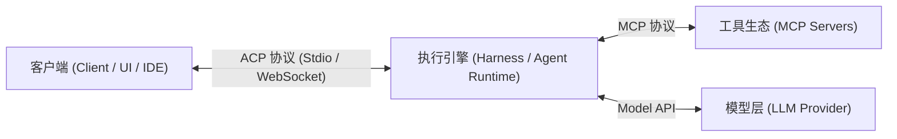

### 开放标准之困：从专属孤岛到通用协议

在当今的 AI 开发者生态中，涌现出了海量优秀的模型、框架与研究成果，但交互界面往往高度专用且割裂。很多时候，某种强大的智能体工具只能通过特定的单一客户端或专用应用进行操作。这种局面正如 Web 早期如果每个网站都需要专属浏览器或私有通信协议一样不可持续。**开放标准**（Open Standards: 促进多方互操作与生态繁荣的技术规范）的核心价值在于通过统一接口催生开放市场。正如**模型上下文协议**（Model Context Protocol: 用于让 AI 智能体连接外部工具、资源与数据的标准化协议，简称 MCP）让所有智能体能够无缝调用数以万计的工具服务器一样，当前生态在“客户端软件如何标准化管理、指派与监控智能体”这一层级依然缺乏统一方案。

Original English Source

Hola a todos. Mi nombre es Alex Hancock. Hoy te lo diré sobre universal mando a distancia control para IA.

Antes de empezar, quiero decir: anterior El orador señaló que desarrolladores de clientes MCP no implementado apoyo a la tarea, porque Son inteligentes. I- Desarrollador de clientes MCP. Puedo decir que esto solo porque yo perezoso. No. hizo. Eh, vale.

Bueno, un poco sobre mí antes de empezar. I ingeniero de software en Compañía Block, que es nativo por Cash App, Square y Tidal. Ahora nosotros trabajando en varios diferentes proyectos. Eh, yo también Llevo mucho tiempo trabajando allí. tiempo. Estaba haciendo ejercicio. Productos Square y Cash Aplicación, pero los últimos dos Llevo años trabajando en inteligencia artificial. código abierto. En particular, estoy trabajando en proyecto con apertura nombre en clave Goose, que comenzó como proyecto interno en Bloquear. Sí, ya veo, aquí hay uno. Aficionados a los gansos. Y entonces, eh-eh, lo abrimos código fuente y lo adapté a Linux Base. Entonces, ahora Los derechos les pertenecen, pero muchos de nosotros Con Block continúa trabajar con él. Eh, yo es también uno de MCP: Desarrolladores de modelos Protocolo de contexto. Trabajo. sobre Rust SDK para esto proyecto. Y recientemente Yo también empecé a trabajar. sobre ACP (Protocolo de Agente Cliente), ¿De qué te voy a hablar? hoy.

Creo que tenemos Hay un problema con herramientas que yo Quiero presentarte hoy como una tarea, y entonces ofrecer decisión. El último A veces me doy cuenta de que apareció mucho excelentes herramientas ¿No es así? Hay novedades de laboratorios, de varias empresas, muchas soluciones en basado en abierto estándares. Eh, pero yo noté que la interfaz a menudo tienen único o específico. EN peor escenario posible Sucede que hay herramientas para gestión de la cual poder usar solamente un cliente ¿Aplicación, verdad? Creo Esto provoca una serie de problemas, pero daré analogía con la web: es Sería así si tú tenía que usar solamente un navegador o uno protocolo de acceso a cada sitio web, ¿verdad? Simplemente no lo es. Funcionaría. No tenemos existiría tal concepto, como la web abierta, Ojalá fuera así realidad de navegadores. Por lo tanto yo Creo que podemos trabajar mejor. Esencia estándares en ese su implementación crea ecosistemas y mercados. Yo diría, que en el campo del agente Tenemos una buena IA estándar para para que el agente pueda actuar, ¿No es así? Usando herramientas, realizar acciones en otros sistemas, lectura recursos, lectura datos. Todos somos iguales La comunidad ganó por la aparición de MCP. ¿No es así? ¿Y la característica más potente MCP no se trata de sí mismo MCP, pero en el hecho de que todos Se utiliza. Por eso tenemos miles o decenas miles de servidores en todo el mundo y todos los agentes pueden conéctate con ellos, realizar tareas en esos sistemas.

Yo diría, que todavía no tenemos una buena decisión o estándar para para que el cliente software provisión podría gestionar agentes. Establecer tareas, para indicar qué trabajar y recibir actualizaciones.

### ACP 协议解析：轻量、可扩展的客户端交互规范

为了填补客户端管理智能体的标准化空白，**智能体客户端协议**（Agent Client Protocol: 连接用户客户端与智能体环境的双向通信协议，简称 **ACP**）应运而生。该协议最初由 **Zed** 与 **JetBrains** 编辑器团队联合提出，旨在让 IDE 开发商编写一次高质量的客户端实现，即可与任意智能体执行环境通信（下发任务、接收执行结果、追踪代码文件修改）。而 **Goose**（Block 开源的通用 AI 智能体框架）团队意识到，ACP 具有天然的中立性与通用性，不仅适用于代码编辑器，完全能够扩展到所有类型的软件客户端。

在底层设计上，ACP 基于简洁的 **JSON-RPC** 消息机制构建。它支持客户端建立连接并创建独立会话（Session），在会话内传递用户指令（文本、图片、音频），并实时流式推送执行进度、工具调用元数据以及权限确认请求（Permission Requests: 向用户索取工具执行批准的交互机制）。更关键的是，协议具备强大的**可扩展性**（Extensibility），支持各团队通过前缀自定义方法（如 `_customMethod`）先行探索特性，经过社区验证后再合并进入核心标准。现场通过 **Zed** 编辑器以及独立的终端客户端（Terminal Client）演示了相同任务（分析 HTML 项目）在不同客户端下的无缝表现：智能体实时回传工具调用、数据读取与解析过程，呈现一致的交互体验。

Original English Source

Así que hoy yo Propongo una opción, lo cual, en mi opinión, es exitoso; encima de él El nuestro funcionó equipo, y nosotros lo consideramos una buena decisión en espacios abiertos estándares. Esto es ACP, es decir, protocolo agente cliente—sí Esto se llama proyecto, y él vino de los desarrolladores editores. Él se levantó, por ejemplo, si usted usado editor de texto Zed o cualquiera de los Productos de JetBrains: Desarrolladores Zed y JetBrains unidos y propuesto estándar para para que los clientes puedan gestionar trabajadores entornos. Esto tiene lo que significa que si pones ellos mismos en su lugar, ¿verdad? Ellos querían poder escribe un solo alta calidad clientela implementación en editores, tal vez en Zed o IntelliJ, y para gestionar cualquier medio ambiente por con esto un cliente: enviar tareas, conseguir resultados, ver, qué archivos editado, etc. muy lógico si para ocupar su lugar, ¿verdad?

Pero estamos en El equipo de Goose vio Esto es lo que creemos beneficiarse de esto mucho más ancho que solo por editores, ¿verdad? Entonces él es relativamente neutral y no tiene muchos específicos para editores funciones. Por lo tanto nosotros creemos que es puede extenderse a círculo más amplio clientela software software.

Eso profundizar en el diseño ACP y qué puedes hacer con él hacer: él permite establecer conexión entre clientes y entornos de agentes, que tienen una cierta un conjunto de posibilidades, relacionado con esto conexión. Y luego tú puedes crear sesiones. Dentro de las sesiones se puede enviar mensaje usuarios—qué usuario, tal vez, ingresa al programa, o lo que él quiera enviar cliente software software. Agente puede responder ellos con texto, imágenes o audio o proporcionar Actualización sobre, ¿Qué está sucediendo? Por ejemplo, si se llama herramienta, puede enviar notificación sobre el desafío herramienta, explicando cuál la herramienta era causados ​​y que fueron metadatos. Además, él puede enviar solicitudes de provisión permisos. Entonces, si clientela software disposición necesidad de mostrar al usuario, Por ejemplo: "¿Merece la pena? Tengo que hacer esto. ¿Llamada a la herramienta? ¿Sí o no?" Esto es posible implementar a través de este protocolo.

Y él bastante simple para por su estructura. Él usos Mensaje JSON-RPC. Y lo que necesitamos Me gusta. lo más, es posibilidad expansión. Usted no limitado únicamente por el hecho de que está en lo básico protocolo. Puede agrega el tuyo métodos; por por acuerdo necesito poner subrayar, luego empezar a escribir sus propios métodos. Lo que me gusta de esto, así que esto es lo que si es suficiente proyectos- herramientas o proyectos de clientes Implementar esto, nosotros podemos ver que Todos lo hacemos igualmente. ¿No es así? Si el equipo del Códice tiene sus métodos, en equipos de gansos, los suyos propios, en equipos de clientes—más algunos, podemos para ver qué sucede en el ecosistema, y ​​que es recomendable hacerlo estándar, añadiendo al protocolo en sí, de modo que se forme en basado en el uso y la comunidad.

I Yo voy demostrar versión estándar de E/S para esto. Entonces, yo Abro Zed, tengo Aquí hay uno muy simple proyecto, y diré: "Cuéntame sobre este. proyecto". Este es el único HTML- archivo. ¿Ves que yo...? pudo ingresar a su solicitud de Zed y el agente, quien trabaja aquí es Ganso, así que él usos Interfaz ACP de Goose. Y ya ves cómo él devuelve el texto. Él envía información sobre llamada de herramienta, sobre lo que él ¿Leíste y qué hiciste? y luego descubrió que era un archivo HTML y lo explicó.

Y lo haré. otra manifestación. Este es un ejemplo de IA junto a la piscina. I Yo diré: "Dime sobre este proyecto." EN el mismo proyecto. Este es un servicio basado en el cliente. terminal, que obtiene lo mismo experiencia de eso el propio agente. Uno implementación por el lado instrumento, y ahora puede usar cualquiera ¿Qué cliente, verdad? Tú Mira lo que hizo. lo mismo. Él mostró Envíame un mensaje resultados. Él mostró el desafío herramienta, y luego mostró el resumen en tiempo real. Entonces, esto es básico. demostración de cómo dos clientes interactuar entre sí agente a través de entrada estándar- salida local.

### 四层架构解耦：远程通信与未来生态演进

本地标准输入/输出（Stdio）虽然简单，但要实现生产级普及，必须支持**远程协同工作**（Remote Work: 跨网络或在容器与云端运行智能体）。Goose 团队为 ACP 补充了标准 **HTTP/WebSocket 传输层**，在保持消息协议与语义一致的前提下实现了跨网络通信。

在整体架构上，现代智能体系统可系统化划分为四个解耦的层级：
1. **客户端层**（Client: 用户交互界面，如桌面 IDE、Web UI、移动端或无头服务）；
2. **执行引擎层**（Harness: 负责驱动智能体规划与工具调用循环的运行时引擎）；
3. **工具层**（Tools: 通过 MCP 等协议提供的数据源与外部执行工具）；
4. **模型层**（Model: 提供推理能力的底层大语言模型 API）。

当这四层都具备标准传输层支持时，系统的部署拓扑获得了极高的灵活性：四者既可以全部运行在同一台本地机器上，也可以将 Harness 部署在远端容器、工具部署在边缘环境、模型通过云端 API 交互。这大幅降低了构建专属客户端的门槛。未来，企业可以针对垂直业务领域定制专用客户端，也可以打造统一的通用控制台；而用户将拥有通过“用脚投票”选择最佳客户端体验的自由，从而倒逼生态在用户体验与功能质量上展开良性竞争。

Original English Source

Pero versión local, por supuesto, no es suficiente, ¿No es así? Si usted ¿Quieres que esto suceda? popular, tienes proporcionar trabajo remoto. Los agentes trabajarán en la nube. Por lo tanto, cuando nosotros se unió a esto proyecto, vimos, eso es remoto Aún no hay soporte. Por lo tanto, hemos determinado transporte Protocolo HTTP. Hay una versión HTTP y la capacidad actualización a través de websocket. Y ahora Los mensajes son los mismos, semántica de protocolo lo mismo, pero parecía nuevo transporte, que acaba de empezar a trabajar y permite remoto trabajar.

En el equipo de Goose estamos considerando esto pila de agentes como cuatro importantes componentes, ¿verdad? Tienes hay un cliente, es como programa que usos usuario o sin interfaz aplicación en funcionamiento en algún lugar del coche. HAY arnés—este programa que implementa ciclo de llamadas herramientas. Ellos mismos herramientas, a menudo esto MCP. Y hay un modelo, ¿verdad? Si creas transporte remoto para el protocolo agente cliente y MCP tiene un control remoto transporte para herramientas de llamada, entonces los modelos han sido durante mucho tiempo tienen sus propios finales puntos como API respuestas. Ahora en tienes flexibilidad en moviendo todos estos cuatro componentes. Todos ellos pueden ser en un coche. El marco puede estar en un coche diferente que cliente. El modelo puede ser el único que Trabaja de forma remota. Las herramientas pueden ser el único que Trabaja de forma remota. Armonización estándares y software trabajo confiable transporte—esto es lo que nos permitirá mover todo partes de esto pila de agentes.

Y yo Puedo demostrarlo una breve demostración Esto también. Aquí cliente, solo para muestra lo fácil que es crear clientes para esto. Yo escribí su en vivo ayer por la noche. Y yo Yo diré: "Escribe un poema". Así que, aquí está de nuevo. conexión con eso el proceso en sí mi coche. En este caso que ejecuto él a través de la red, pero él está en el mío auto. Él conecta y envía Instrucciones para gansos con respecto a de qué hacer de forma remota. Esto puede estar en un contenedor o en la nube, pero Los mensajes son los mismos, y la biblioteca que uso y tú mismo, para que puedas muy fácil cambiar entre local y modos remotos.

Entonces, si quieres únete a esto ecosistemas, inicio para experimentar con apoyo, creando el tuyo propio clientes o agregando oportunidades para herramientas—esto enlace al sitio web protocolo del cliente El agente te dirá cómo comenzar. Ya existe muchos clientes y servidores de agente. Él varios editores, escritorio y aplicaciones móviles, soluciones terminales—su número está en constante crecimiento. Y yo Creo que las áreas su solicitud potencialmente enorme ¿No es así? Si nosotros proporcionaremos una cierta compatibilidad, personas podrá crear clientes personales, lo cual funcionará exactamente como se necesita para administrar su agentes. Poder crear clientes para ciertos negocios dominios, individuales empresas o el todo conjunto de soluciones de empresas. Puede ajustar cliente universal para que funcione con todos los servicios. Y yo También creo que si crearemos uno nuevo categoría, entonces veremos un aumento calidad del cliente, ¿verdad? Porque cada vez, ¿Cuándo ocurre? ecosistema o mercado con muchas opciones, los usuarios pueden votar "con los pies", si los clientes no son adecuados, por lo tanto Los desarrolladores comenzarán competir por la calidad definido por el usuario experiencia. En general, yo Creo que tiene que ser mejorar la experiencia usando inteligencia artificial. Esto es todo lo que quería. dilo hoy. Muchas gracias. Si Quieres para charlar, Encuéntrame más tarde discurso o escrito por correo electrónico. Me encantaría involucrarme usted a este trabajo. Gracias.

