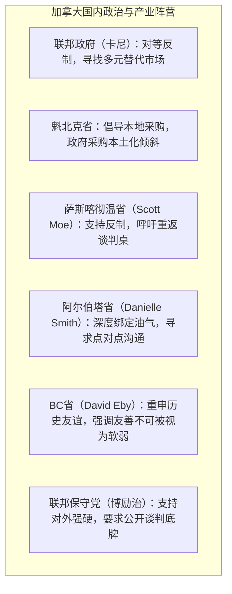
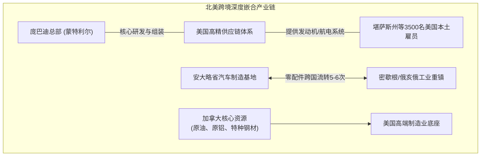
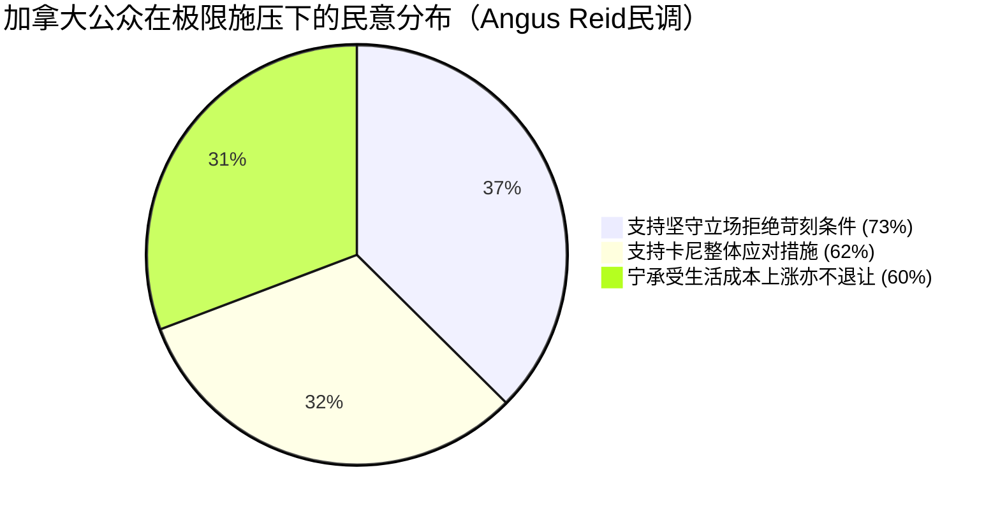
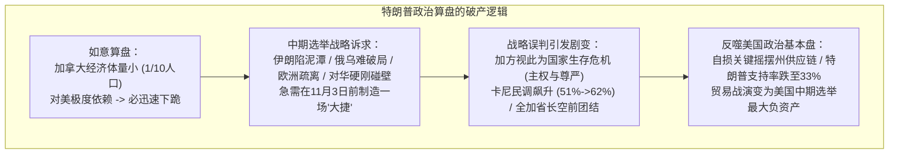

### 关税博弈全面打响：双向反制与禁令极限施压

**美加贸易战**在近期迎来了前所未有的剧烈升级。从9月8日凌晨12点01分起，加拿大政府筹谋已久的新一轮对美报复性关税正式生效，关税总规模高达276亿加元，折合约200亿美元。在税率设置上，加拿大联邦政府将其精准划分为15%、25%以及50%三档。加拿大官方给出的反制逻辑非常直白：针对此前美国政府毫无合理理由单方面施加的50%关税，加拿大必须实施1:1的对等反击，践行所谓“以眼还眼，以牙还牙”的对等防御原则。然而，地缘经济局势的演进极其迅猛，就在8日当天中午至晚间，大洋彼岸的白宫迅速作出了极具进攻性的连续反扑。

在加拿大报复性关税生效仅仅数小时后，美国总统**特朗普**便展开了雷霆反击。白宫首先宣布将直接限制加拿大企业参与美国联邦政府采购市场的竞标资格，随后在8日晚间进一步公布了全方位的惩罚性措施：自9月29日起，美国将全面禁止进口部分加拿大产酒类、乳制品以及摩托车产品；与此同时，美方将现行50%高额关税的征收范围进一步扩大。这一连串举措标志着这场贸易摩擦已迅速越过常规的关税互搏阶段，上升到了限制政府采购准入、乃至直接实施特定商品单向禁运的严峻程度。

面对这场扑面而来的经济风暴，加拿大总理**卡尼**（Mark Carney）随即发表了严肃的全国电视讲话。卡尼在讲话中清醒地向国民指出，加拿大绝不可能在一夜之间彻底割裂或离开美国市场，因为无论从地理还是历史维度来看，美国依然是加拿大体量最大的商业客户。但与此同时，加拿大也绝不能再将整个国家的经济命脉与全部商业盘子孤注一掷地押在单一市场上。为此，卡尼重申了国家层面的结构性应对战略：加拿大必须加速开拓全新的国际出口市场，破除省际壁垒以促进国内贸易内循环，并全力加快港口、铁路、能源管道以及跨区域大型基础设施建设的审批与落地进度。

在阐明宏观战略的同时，卡尼特别强调了加拿大反制举措的被动性与必要性。他明确表示，加拿大之所以出台这些关税，绝非为了主动推波助澜将贸易战扩大化，而是在严酷的现实面前别无选择——如果放任美国商品继续零门槛、自由地涌入加拿大市场，而加拿大本土企业出口至美国的商品却要承受50%的毁灭性惩罚关税，任何负责任的加拿大政府都绝不可能坐视不管、无所作为。卡尼直言不讳地坦承，接下来的经济阵痛将直接传导至加拿大企业和普通家庭：一方面，来自美国的各类日常消费品物价将直线上涨，直接推高生活成本；另一方面，依赖美国核心零部件、精密机械与原材料的加拿大制造业企业，其生产成本也将遭遇显著抬升。

### 地方阵营的分化共识与政界舆论博弈

面对这场全面打响的跨境贸易战，加拿大国内各省政府的立场呈现出高度团结却又各具产业考量的复杂图景。**魁北克省**政府在第一时间发出号召，呼吁全省民众与机构优先采购加拿大及魁北克本地生产的商品，并承诺省政府采购机制将全面向本地企业倾斜，给予实质性政策庇护；但魁北克当局亦坦诚预警，未来数月内部分外向型产业必将经历严酷的寒冬。与此呼应，**萨斯喀彻温省**省长**斯科特·莫**（Scott Moe）公开表态支持联邦政府的反制大方向，他强调加拿大从未主动挑起争端，面对美方先行加税的霸凌行径，国家必须予以坚决回击；不过莫省长也务实地提醒，关税的最终落脚点必然是沉重的经济成本，企业与消费者都将为此买单，因此双方仍应尽快重回谈判桌寻求理性解法。

相比之下，**阿尔伯塔省**省长**丹妮尔·史密斯**（Danielle Smith）的态度则延续了其一贯的微妙与暧昧。史密斯极力避免关税战陷入层层加码的螺旋升级，她主张阿尔伯塔省绕开联邦框架，直接由省政府出面与美国的国会议员、关键州政府以及大型跨国企业展开点对点沟通。这种策略背后的经济逻辑极易理解：阿尔伯塔省拥有巨量的原油、天然气储备和庞大的农业资源，其支柱产业深度嵌合于美国中西部与墨西哥湾的炼化管网中。贸易战若无休止扩散，对阿省的能源命脉无异于巨大打击。与阿省形成鲜明对比的是，**不列颠哥伦比亚省**（BC省）省长**戴维·埃比**（David Eby）的措辞则异常强硬。埃比在公开发言中特别提到了25年前的“9·11事件”：当年美国本土突遭恐怖袭击导致领空关闭时，加拿大毫不犹豫地敞开国门，接纳了数以百计无法降落美国的国际航班并倾力救助受困的美国民众；埃比动情且坚定地表示，如果未来美国再次遭遇类似灾难，加拿大人依然会施以援手，但美国政府绝不能将这种源于邻里温情的友善，误判为软弱可欺的退让。

在联邦政坛层面，在野党保守党领袖**博励治**（Pierre Poilievre）展现出了兼具民族主义防御与政党博弈特征的策略姿态。博励治并未反对联邦政府对特朗普采取强硬的反击手腕，他此前多次重申在国家主权遭遇外部冲击时，加拿大朝野各党派必须保持高度一致。然而，在对外展现团结的同时，博励治话锋一转，严厉要求卡尼政府必须完整公开今年8月份美加双方谈判破裂的协议草案细节。其政治理由十分犀利：既然政府最终决定拒绝签署该协议，全体加拿大纳税人就有权知晓美国究竟开出了何等苛刻的条款、政府为何断然拒绝，以及眼下这276亿加元的关税战火最终会让普通家庭与中小型企业多承担多少真金白银的代价。博励治的意图十分明确，即在对美强硬的大旗下，将民众未来可能承受的通胀怨气同步引向卡尼政府的执政成本。

这种政坛博弈反映出加拿大社会舆论重心的深层迁移。当前的公众讨论早已跳出了“是否应当向美国妥协求和”的低维争论，而是全面聚焦于“加拿大究竟该如何精准还手”、“还击的烈度与边界应如何把控”，以及“国家经济与社会体系究竟能在这种极限承压下坚守多久”。对于最前沿的商业实体而言，这种焦虑感正在迅速蔓延。根据**加拿大独立企业联合会**（Canadian Federation of Independent Business, CFIB）针对全国1500多家小企业开展的最新紧急问卷调查，在受到贸易战波及的小型出口商群体中，约有46%的商品品类直接撞上了美国的最新高额关税墙；而在涉及跨境采购的小型进口企业中，受冲击比例更高达49%。更为致命的危机在于，调查中多达18%的受访小型出口企业明确指出，如果当前的贸易恶劣环境再持续3个月以上，企业的现金流将彻底枯竭，面临破产倒闭的绝境。因此，CFIB在明确支持政府捍卫国家利益的同时发出紧急呼吁，恳请决策层切勿让缺乏风险防御能力的本土中小微企业，沦为这场大国地缘博弈中最悲壮的牺牲品。

### 供应链深度嵌合：杀敌一千自损八百的荒诞困局

就在加拿大宣布反制关税生效的8日当天上午，北美商界还在屏息观察白宫的具体反应，而特朗普的反制行动之迅速与精准远超外界预期。美方首先动用行政力量，直接指示统管美国庞大联邦政府采购体系的**美国总务管理局**（General Services Administration, GSA），要求其迅速制定并执行排他性条款，将加拿大商品与服务全方位从联邦政府采购清单中剔除。紧接着到了当晚，白宫的制裁组合拳持续加码：不仅敲定自9月29日起禁止进口绝大部分加拿大酒类、特定乳制品及摩托车产品，更宣布自9月15日起将新一批加拿大关键工业品与消费品划入50%关税惩罚清单，涉及特定奶酪、纸制品、铝合金建材、木制品、家具以及电气照明设备。

然而，更具破坏力的达摩克利斯之剑依然悬在北美工业的核心地带。特朗普此前已多次公开威胁，计划从2027年1月1日起，将所有原产于加拿大的汽车整车、轻重型卡车以及关键汽车零部件的关税统统拉升至50%。汽车产业若真正遭受50%关税的毁灭性打击，其外溢效应绝非几瓶威士忌或几件民用家具所能比拟。加拿大的现代汽车工业高度聚集于**安大略省**，且在过去数十年北美自由贸易框架下，与美国五大湖区的**密歇根州**、**俄亥俄州**等汽车工业重镇形成了精密的垂直分工与深度融合机制。在传统的整车装配生命周期中，许多关键核心零部件往往需要在美加边境来回穿梭流转多达五至六次才能最终组装下线。可以说，汽车产业链条是整场美加经贸体系中体量最庞大、牵扯利益最深沉的超级底牌。

在这场关税极限施压中，特朗普还直接点名了加拿大老牌航空制造巨头**庞巴迪**（Bombardier），公开声称如果庞巴迪希望保住美国庞大的公务机与支线客机市场，就必须将其生产线全盘迁移至美国本土。然而这一激进言论刚一抛出，最先陷入恐慌与愤怒的不仅是加拿大业界，美国共和党内部的本土建制派议员也随之大为震动。庞巴迪在美国本土早已深耕多年，构建了庞大的制造网络与售后工程基地，其上游零部件供应链高度依赖成百上千家美国高科技供应商，且庞巴迪在美国境内直接雇佣了约3500名高技能产业工人。在白宫表态后，**堪萨斯州**的两名共和党资深议员迅速紧急介入，密集与白宫高层交涉周旋，原因十分现实——庞巴迪在美国的核心生产与维修基地恰恰坐落在堪萨斯州，一旦企业因政策逼迫而遭遇供应链阻断或业务缩水，最先承受大规模失业痛苦的恰恰是堪萨斯州的美国产业工人。

庞巴迪的风波极其深刻地揭示了现代美加经贸关系的物理现实：许多在法律注册意义上的加拿大企业，早已蜕变为高度全球化、跨区域协同的北美深度整合实体。庞巴迪虽然总部位于蒙特利尔，但其机身大量核心航电设备与特种组件全部采购自美国工业界，并直接为美国本土创造数以千计的高薪岗位；反向审视亦然，绝大多数打着“美国制造”标签的终端工业制成品，其底层制造流程同样严重依赖加拿大稳定供应的高纯度特种钢材、原铝、基础化学原料、特种木材、原油以及安省制造的高精度汽车零配件。因此，这种基于孤立主义与关税大棒的贸易战越是向纵深演进，就越会暴露出一种极具讽刺意味的荒谬闭环——所谓的单边惩罚，在精密的跨境现代供应链面前，必然演化为“杀敌一千、自损八百”的双输泥潭。

### 经贸基本盘与跨国认知的剧烈撕裂

即便当前两国政府在关税政策上刀光剑影、寸步不让，但在客观经济规律层面必须厘清的是，北美大陆的经济版图远未走到彻底脱钩的断裂边缘。美国迄今依然是加拿大无可替代的第一大出口目的地，截至今年最新的宏观贸易数据显示，加拿大整体出口贸易中仍有约68%的大宗流向美国市场；更为重要的是，由于《**美墨加协定**》（United States-Mexico-Canada Agreement, USMCA）的法律基石在绝大部分领域依然维持有效运转，绝大多数符合原产地规则的传统贸易货物在跨越美加边境时仍享有免税待遇。因此，外界绝不能因为政治领袖每日在媒体前宣布动辄数十亿、数百亿美元的制裁数字，就误判为美加跨境物流陷入了全面停摆。在现实世界中，跨国交通动脉上每天依然有数以万计的重型卡车呼啸过境，数以百万桶计的加拿大原油通过跨国输油管网稳定注入美国炼厂，汽车零配件也依然在五大湖两岸保持着繁忙的物流周转。

然而，在这层依然运转的经贸外壳之下，真正发生不可逆质变的，是两国社会与民众的底层心理认知。长期以来加拿大社会对美国所抱有的地缘战略信任与盟友情谊，正在这场贸易霸凌中被一点一滴地无情消解。加拿大权威民调机构**安格斯里德**（Angus Reid）公布的最新民意追踪数据极具说服力：卡尼总理的全国民众支持率不仅未被关税恐慌击垮，反而从8月份的51%逆势飙升至惊人的62%；高达73%的加拿大受访民众坚定认为，即便美加双边外交关系继续恶化至冰点，加拿大政府也绝不能屈从妥协于美国开出的任何苛刻霸王条款；更为震撼的是，有60%的受访者明确表态，即便贸易战全面升级将不可避免地导致个人与家庭的日常物价明显上涨，他们也依然全力支持联邦政府坚守底线、抗争到底。

与加拿大国内空前同仇敌忾的民意形成极度鲜明反差的，是美国社会内部对这场贸易战的普遍反感与认知割裂。根据**路透社**（Reuters）针对美国本土选民的最新专项民调，全美仅有20%的受访选民支持特朗普继续对加拿大单方面加征惩罚性关税，反对者比例则高达57%；同时，有多达68%的美国受访者明确认为，美加两国理应通过平等协商各退一步，而不是一味凭借超级大国体量极限施压、强逼邻国全盘吞下美方的不合理诉求。这种跨越国境线的民意倒挂，彻底将这场贸易对抗推向了不可调和的政治死局：加方清晨刚宣布反制生效，美方晚间立即实施禁令回击；在当下的政治生态中，没有任何一方能够轻易主动后撤。特朗普若在刚刚发出高调威胁后突然单方面取消关税，在激进的民粹选民面前将彻底失去政治威信；而在加拿大这边，澎湃的本土民意已赋予卡尼政府最坚固的政治护城河，卡尼若在此时签署任何带有屈辱妥协性质的城下之盟，其政权将瞬间在滔滔民意中解体。

### 政治困局与帝国黄昏下的地缘觉醒

当关税纷争彻底被政治选票与民粹情绪所绑架，它便不再是一道能够通过简单的经济成本、GDP增减或汇率波动来精密计算的算术题，而是演化为一场极度危险的政治零和博弈。纵观全球地缘局势，这种“开局容易收场难”的政治泥潭早已屡见不鲜：在中东，持续数月之久的**美伊冲突**令华盛顿进退维谷，美国政府既无法向伊朗做出根本性妥协，又因伊朗死死扼守住**霍尔木兹海峡**这一全球石油命脉而无法取得决定性胜利；在东欧，旷日持久的俄乌战事同样耗尽了各方的耐心，特朗普此前吹嘘的“24小时内解决俄乌战争”在残酷的现实面前已彻底沦为延宕两年的国际笑柄。如今，白宫却试图将这套极限施压的逻辑粗暴地复制到自己最亲密、最和平的北邻身上。

从历史与地缘的宏观长河审视，美加两国之间没有任何历史遗留的领土争端，没有不可调和的宗教教派冲突，更不存在纠缠数百年的民族仇恨。恰恰相反，美加拥有全球最长且完全不设防的和平陆路边境线，数以百万计的家庭横跨边境彼此血脉相连，两国在航空、汽车、矿产、油气能源以及农产品等几乎所有核心产业上高度咬合共生。从自由市场经济的本质而言，百余年来美加之间深度融合的贸易往来，是基于地缘互补与经济效率的自然选择。美国资本从未在对加交往中单向输送过所谓“免费利益”，美国对加拿大廉价优质的基础能源形成了事实上的出口垄断，需要借助加拿大高素质的技术工人和优质制造环境协同生产汽车，更需要源源不断地汲取加拿大的木材、钾肥、特种铝材与高品位矿产；而加拿大国民也自然需要来自美国的先进技术专利、跨国文化消费品与日用工业品。这种历经百年淬炼、高度共赢的深层经贸网络，绝非所谓“加拿大单方面占了美国便宜”的民粹谎言所能抹杀。

真正将两国关系推入深渊的，是特朗普执政团队深固的强权零和思维。早在今年7月28日，特朗普就曾在公开场合赤裸裸地宣称：“加拿大和墨西哥需要我们，而美国根本不需要他们。”这句话极为精准地暴露了其底层的霸凌逻辑——在特朗普的眼里，既然加拿大的经济生存高度依附于美国市场，那么加拿大就是整个西方阵营中最容易被拿捏的“软柿子”。只要美国挥舞关税大棒极限施压，就可以不断加码勒索：从乳制品配额到汽车制造，从政府采购限制到全面征收50%关税。甚至美国财政部长**贝森特**（Scott Bessent）更是在公开场合肆无忌惮地侮辱加拿大是一条“只配听话的哈巴狗”。这种毫无底线的霸权行径，彻底激怒了温和隐忍的加拿大社会，将原本局限于经贸层面的摩擦，硬生生推向了捍卫国家主权、民族尊严乃至生死存亡的战略高度。

这种霸权冲动的背后，更深层地交织着美国统治集团对国内政治危机的病态焦虑。随着美国中期选举将在11月3日正式举行，路透社最新民调显示特朗普的全美民意支持率已凄惨地跌落至33%左右的低谷，共和党在众议院乃至参议院均承受着丧失多数席位的巨大海啸压力。国内层面，盲目的对外军事干涉引发民怨沸腾，油价高企与通胀反弹再次成为选民最痛恨的焦点；国际层面，传统欧洲盟友纷纷冷眼疏离，中国在多重博弈中展现出坚不可摧的战略定力，美国身边如今只剩下自身难保的阿根廷与日本等少数极右翼政权。在这种四面楚歌的政治绝境下，特朗普原本指望将体量仅为美国十分之一的加拿大作为立威的突破口，企图在中期选举前制造一场“邻国屈膝臣服”的虚幻胜利向选民邀功；但他万万没有料到，加拿大展现出了超乎预期的刚性韧骨。

在这场关乎国运的历史拐点上，加拿大社会的觉醒已不可逆转。虽然客观的地理版图无法重划，寻找庞大替代市场的转型之路也绝非朝夕之功，但战局的胜负早已超越了单纯的关税统计。只要特朗普无法达成其吞并与屈服加拿大的霸权野心，只要美国关键摇摆州的产业界与普通选民在供应链反噬中看清关税战的自残本质，白宫的政治豪赌就必将走向破产。对于加拿大而言，这场人类现代贸易史上最为荒谬与讽刺的地缘纠纷，恰恰敲响了打破路径依赖的警钟——特朗普本想用极限施压证明加拿大离开美国将无法生存，但在历史的宏大戏剧中，他最终却扮演了那个亲手将加拿大逼上自立自强、多元重构与全面觉醒之路的历史推手。