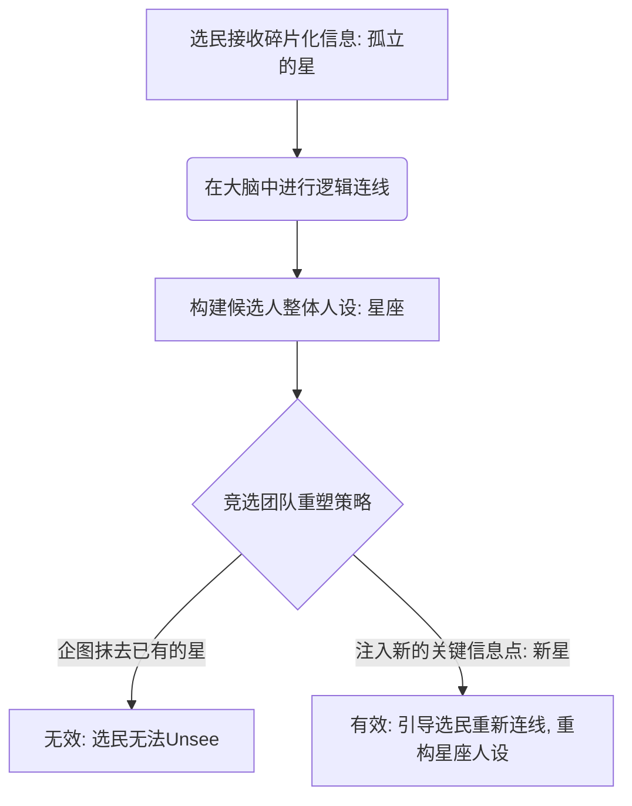
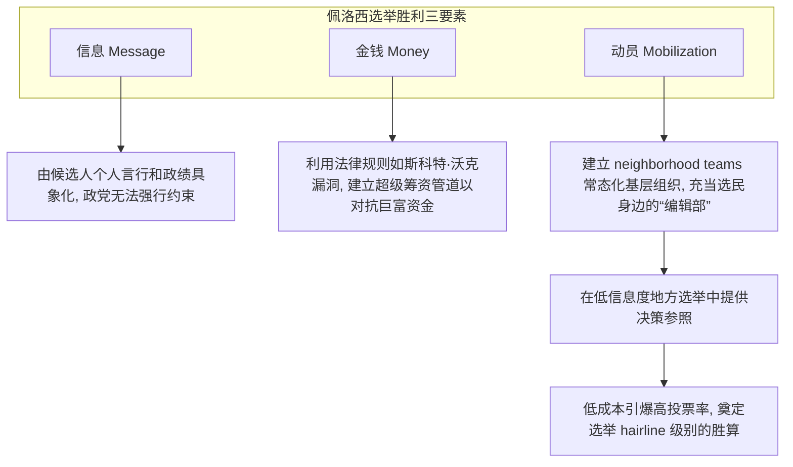

### 全球通胀与二元极化：2024选民的求变本能

2024年的大选对美国民主党来说无疑是一次沉重的警示。**卡玛拉·哈里斯**（Kamala Harris）在威斯康星州以不到一个百分点的微弱劣势落败，延续了该州总统选举长期处于极低温胶着状态的态势。尽管**塔米·鲍德温**（Tammy Baldwin）成功保住了联邦参议员席位，且民主党在州议会赢回了14个席位，但哈里斯在全美及威斯康星的全面退潮，需要放在一个更宏大的国际坐标系中去审视。

这不仅是美国的问题，更是全球执政党的系统性危机。2024年是历史上有记录以来，西方发达民主国家中**执政党**（Ruling Party: 现任掌权或联合执政的党派）无一例外在选举中失利的年份，无论其政治光谱是左翼、右翼还是中道。造成这一深层全球性政治怨气（Malaise）的根本驱动力是**通货膨胀**（Inflation: 货币贬值导致物价持续上涨的经济现象），选民被物价上涨、住房负担以及日渐凋零的经济安全感逼向了生存边缘，从而激发出强烈的求变本能。即使民主党在微观组织上做到了极致，也难以阻挡这股席卷全球的宏观政治反弹力量。

Original English

Ben Wikler, welcome to the show.
It's great to be with you, Ezra.
So, we last spoke, I wonder if you remember this, at least on the show,
vividly remember.
It was July of 2024. Biden had just dropped out. Kla Harris had consolidated the Democratic party. We talked right after Harris had done one of her first rallies in Wisconsin. We had a very optimistic conversation. I ended up titling it, I believe, this is how Democrats win in Wisconsin at the presidential level. They did not win in Wisconsin. What went wrong?
So, Kla Harris lost Wisconsin by less than a percentage point. It was the fifth of the last seven presidential races that came down to less than one percentage point. And on election night, I had this feeling in the pit of my stomach that nothing we'd done, that we tried everything. We'd done everything that we thought could make a difference, maybe none of it had had any impact. What was I doing with my life? The last thing I saw before I let myself fall asleep that night was that Tammy Baldwin had one, and I thought, oh, and I collapsed. The next day I did a little spreadsheet therapy for myself, which is my way of relieving electoral stress is to dig into data. And in Wisconsin, Harris had done better than she had in any other battleground state in terms of how she did versus how Biden did. It wound up being the closest state in the country. A lot of Trump voters didn't vote down ballot. The Harris voters did. That's been a huge part of our work is to make sure people fill out their whole ballot. And so we actually gained 14 state legislative seats and won the US Senate race at the same time as we lost the presidential. But the underlying question of why Harris lost to me, you not only have to look at the country, you have to look at the world. That if you consider every election in an advanced western democracy, this is the only year on record where the ruling party, regardless of whether it was left, right, or center, lost ground. And the overwhelming issue in races all around the world and with the voters who actually shifted their vote choice between 2020 and 2024, the number one thing was inflation, prices, affordability, the economy. The rise in prices after a long period where we didn't see broad-based inflation, especially for people who felt like they were at the economic brink already was devastating. And I should say there are many reasons when you lose by as little as Harris did, lots of things could have been the difference. But the biggest issue of all was this fundamental economic malaise that people felt and they voted for change.

### 政府效能与信任透支：从“消灭煤堆”到机制瘫痪

民主党长久以来面临的另一个深层危机在于其政党品牌的信任危机。当民众因为厌恶掌权的共和党而惩罚他们时，并不意味着他们会自动转向并信任民主党，而是陷入了一种对整个政治系统“两党皆不可信”的虚无感中。民主党常常自我期许为“让政府服务于人民”的政党，然而在现实中，这种承诺面临着双重质疑：一方面，部分选民认为民主党只是在让政府为自身利益集团（如特定捐赠者、环保主义者或工会）服务；另一方面，更广泛的民意对“政府是否有能力解决问题”本身失去了信心。

这种政治信任的流失往往体现在极为琐碎却又具体的行政低效中。一个典型的例子是威斯康星州绿湾（Green Bay）的**煤堆拆除事件**。民主党人（包括州长 Tony Evers 和参议员 Tammy Baldwin）曾利用乔·拜登（Joe Biden）的联邦拨款极力促成此事，并以此证明“民主党是能解决具体民生问题的政党”。然而数年后，因环保诉讼和繁冗的机制牵绊，那些煤堆依然耸立在原地。当政府的效率在具体事务上“掉链子”时，民主党关于“高效政府”的论述便彻底失去了公信力。在民生问题不断侵蚀日常生活安全感的今天，选民不再相信口号，他们需要看到切实的执行力。

Original English

So I agree that the in the election in the 2024 election prices were the biggest issue. They were the biggest problem for Joe Biden, for Kla Harris. But I think I would have off of that analysis expected then after the election as people got the Donald Trump presidency as a Donald Trump presidency did not turn out the way they had hoped to see a real resurgence in how people maybe felt about the Democratic party. But today we're sitting here, Democratic Party is wildly unpopular as a brand. Um, it is less popular than Donald Trump is as a brand. So, as somebody who has run a Democratic party in a state and I think was quite successful in doing so, why is it that what is it that people don't like about the Democratic party?
So, I'll say it at two levels. One is that if you had Democrats in charge, you voted for change and now you don't like the Republicans in charge. That doesn't mean that you're like, "Oh, let's go back to the old thing." That means you want something else yet again. You want change from the situation you have and neither party so far has delivered it for you. The second thing is that if you look under the top lines in in polls, there are Republicans who think Democrats are too liberal. There are Democrats who think Democrats are not fighting hard enough for change. And then there's a third category of people who feel like all of politics is messed up. That they can't trust either party. They feel like neither parties has connected with them and actually solve the problems in their life that they're struggling with. So I would not expect for Democratic party approval ratings to bounce back until people can see tangible results that people are fighting on their side, not only speaking to their issues, but also making concrete differences in ways that they appreciate. And to me, that's the crisis of this moment is this profound sense that the whole country is not working for regular people. That people who would like not to ever have to think about politics suddenly are feeling politics just pounding at the windows like a horde of zombies because their lives are going off the rails that it is so hard to just be able to afford to live and people are being shot in the streets and there's this sense that the you know lettuce might give you explosive diarrhea. All this is wrong. Like most people do not want to have to think about who controls which chamber of Congress, let alone their state legislature. And for people who'd like to be left alone and able to lead their lives and pursue their dreams free of politics, this is a very hard moment. And for people who pay attention to politics all the time, it's even worse. So it's you'd expect in that situation for people to be like set this whole thing on fire. And that's what we see in poll after poll and at door after door if you go out and talk to voters. Some of you remember this uh in very early 2024 I did this big article where I talked to all these state chairs and Democratic politicians about what was the Democratic party uh at a time when actually compared to now it seemed more settled but but it you know there were some questions that had risen and you gave by far the best quotes in that piece and he told me the story about how there were these big piles of coal um I think it was in Green Bay
in Green Bay Wisconsin that's right and you know that Tony Iver is the governor and Tammy Baldwin and others have been working and they got money from Joe Biden and to to get the piles of coal gone and you said to me is by far the best part of the piece you said you know that's who the Democratic party is they're the people who get rid of the piles of coal then we were talking some years later and you're like postcript
the piles of coal are still there
I looked into it there were lawsuits right environmental lawsuits and it got me thinking I mean obviously this is a little bit related to abundance work But there are many different ways this plays out where the Democratic Party wants to think of itself as a party that makes government work for people. And I think if people believed the Democratic Party did that, they would support it. But they believe typically one of two things that gets in the way. One is they don't believe the Democrats make government work for people. They believe it makes government work for their own set of interests, whether it's funders or, you know, environmentalists or unions or whoever it may be that that people are upset about. or the others who just don't believe government works. And so the party that says, "Hey, I'm here to make government work for you is not credible because people don't want government doing jobs they're not certain government can do."
Yeah.
So I I guess the question is this. Do you believe that's who Democrats are? That they're the people in politics to make government work for people? And if that's true, what do they need to do to prove it?
So I think that Democrats are the party that wants to make government work for people. Sometimes Democrats can trip over the shoelaces. Over and over, we have a government that gets blocked or seized apart because it actually can't respond to the public's goals. Our government in so many ways is set up to meet a million different goals other than delivering great public services, solving public problems, doing great work for people despite millions of wonderful civil servants who do absolutely critical work all the time. right now, you know, we're pulling out Jenga blocks like the uh, you know, monitoring for cyclospora, and we can see how that leads to disasters across the public. So, this is not to say government doesn't work or can't work, but there's a ton that gets in the way right now of having a government that's capable of being responsive and effective at the level that this moment calls for, especially a moment where a host of new threats and risks and concentrations of power unleashed by artificial intelligence are right on the horizon. In some ways, it's never been more urgent to have a government that is both responsive and effective. And so, I do think that Democrats can rebuild trust in government and in themselves by being excellent at actually delivering. And I think you can see that in some state and local governments across the country. And you can you can see that in uh in Mam Donny's New York with with public services that people are celebrating delivering on campaign promises, communicating the delivery of those promises. But there is work to do to change how the system itself works.

### 解构“民主党”：抽象的舆论泡泡与具象的本地机制

在普通选民的心智中，“民主党”这个词汇所激活的联想存在着严重的**具象分叉**。一种是存在于网络和电视上的**抽象政治体**（Amorphous Blob），它由国会议员、媒体评论员、甚至是推特上令人反感的激进支持者共同拼凑而成，并在右翼媒体如福克斯新闻（Fox News）的框架下被不断妖魔化。没有某一个具体的个人能够真正完全控制或代表这个庞杂的抽象群体。

相反，另一种是**正式的建制机构**（Formal Institution），即由各州党部、县级委员会和基层党组织构成的实体网络。民主党重塑自身品牌的机会，恰恰在于将民众对“电视上的抽象口号”的愤怒，转化为对“具体邻里互动”的信任。当威斯康星州艾奥瓦县（Iowa County）的居民在考虑是否要在自家院子里插上某位市议员候选人的竞选牌时，这不应该是一个宏大的意识形态表态，而应该关乎一个具体的本地诉求——比如建更多的住宅，让孩子们能住在父母身边。将政党在民众心中的定义从冷冰冰的政治概念还原为有血有肉的邻里互助，才是重建社会连接的唯一路径。

Original English

I guess a question that that raises is when people think about the Democratic Party, when they hear those words, when a pollster calls them and says, "What do you think the Democratic Party?" What do you think those words activate in their mind? What do you think the Democratic Party is? And then as somebody who ran one branch, what is the Democratic Party?
So it means whichever thing is most salient to people. The first and the most common is the amorphous blob of every elected official, every uh pundit, every annoying person they see online, all the things that are associated with this kind of vast interconnected web of all things Democrat related. That is not one thing. There's no person who kind of controls that. There's in a sense if you have a Democratic president, that person's the head of the amorphous blob. Donald Trump very much as head of the blob. On the Republican side, there's also the formal Democratic Party, which is the literal institutions. I was chair of the Wisconsin uh Democratic Party. There's the DNC, the Democratic National Committee. There's uh the Democratic uh county party system. So, we have a Democratic Party of Iowa County, Wisconsin. There's also a Democratic Party of Iowa County, Iowa. Very often people are mad at the blob but they're blaming the formal institution without you know and why would they without a lot of recognition of exactly what it is that is in the control of the formal Democratic party. The opportunity that the formal Democratic Party organizations have most of all is to create a home for people who want to fight for change to do the kind of grassroots community neighborto neighbor organizing that can turn the Democrats this kind of headline phrase from some distant thing that is being defined by Fox News Channel every day into my neighbor who asked me if I wanted to put up a yard sign for a city council candidate who actually cares about building more housing where I live so that my kids can live near me and and I can see my grandkids. That shift to me is what what it means to build from the ground up and to try to rebuild civic life in this country through institutions that once actually had that kind of role in community after community where people would associate the Democratic party with that big dinner that I go to once a year or you know with somebody who checks in with me about who all the local candidates are. To me, the work of building the party is thinking from the ground up about how we actually reconnect with people so that we are human beings rather than slogans on TV.

### 初选合法性与“大帐篷”的撕裂：以威斯康星州初选为例

在政党建设中，“如何销售”固然重要，但更关键的是“在销售什么”。这触及了政党的内部民主与选举最优性的根本张力。美国两党在历史上逐渐从党内大佬在“烟雾缭绕的密室”里决定人选，演变为通过公开初选由选民直接选择候选人。威斯康星州作为具有深厚进步主义传统的省份，早在1948年废除党魁控制、制定党部在初选阶段严格保持**小写d的民主中立**（Small-d democratic neutrality: 基于民主程序与选民授权而非党派利益的中立态度）宪章时，就奠定了这一合法性基石。

然而，在当前的算法极化时代，初选往往加剧了党内的思想对抗。例如，在威斯康星州长的党内初选中，**民主社会主义者**（Democratic Socialists of America, DSA）成员 Francesca Hong 与前副州长 Mandela Barnes 展开了激烈的竞争；而在纽约等地的初选中，由 DSA 支持的候选人不断挑战建制派，甚至在外交政策（如巴以冲突）上形成了针锋相对的道德试金石（Moral litmus test）。虽然建制派如 James Carville 和前党主席 Jamie Harrison 呼吁收紧党内界限、将不认同民主党主流价值的人排除在外，但 Wikler 坚持认为民主党必须维持一个**宽容的“大帐篷”**（Wide Tent）。尽管初选程序可能会推选出在宏观大选上并非“选举最优”的候选人，但在缺乏公共信任的今天，唯有通过公开初选获得的选民授权，才具备无可替代的程序合法性。

Original English

I want to hear you talk about that a little bit more. What parties maybe once were in American social life and political life and and what they are today. I know you and I have both been interested in this hollow parties idea that has been in political science from Sam Rosenfeld Nana Schlloman. But I mean as somebody who I think is interested in party machinery, what relationship might I might I have once had with a party and then what what does it become now?
There were times in in American life when parties were a huge part of your daily and and monthly and weekly existence when when you became a naturalized citizen of the country. The local Democratic party and sometimes the Republican party uh more often the Democratic party was there to greet you and ask you to register for the party at that moment when there was a block captain who was going to check in with you from time to time. I quote in my book a letter that Abraham Lincoln sent to the wig party and his advice then is the same as my advice now. He said, "Keep a constant eye on the most doubtful voters and from time to time have them talked to by those in whom they have the most confidence." Which first of all is great advice about organizing. And secondly presupposes that members of the party have a sense of which voters are doubtful and actually that those doubtful voters who might or might not vote, who might switch parties, they have confidence in someone who's associated with the party. And the idea that you'd have a personal relationship with somebody who might check in on you and ask what you're thinking about that is so alien from the world where most people's experience of the political parties is incredibly annoying text messages and emails that you're constantly trying to find ways to filter or nightmare headlines that are screaming at you from
what's it like to be the name on the other side of those emails?
I sometimes meet people who are like you text me all the time and I'm like you never write back. Yeah, it's a it is a strange aspect of life. You have your public simulacum of yourself. You know this as a journalist. And then you have your actual human being self, but I used to work at an organization that used to email to organize people. And one of the best maxims for sending mass emails is to imagine that you're talking to the most important person in the world. You have 5 seconds to give them a reason to listen to you at all anymore. So you need to be completely clear. And it's fine if they don't want to listen to you at that moment. You have to equip them with the what it takes to make a decision about whether they want to listen to you by explaining what your message is about and what the stakes are. That's very different from the messages that promise a 400% match with a zero replaced by an O so it can bypass the spam filter and all this kind of stuff that just it makes me want to tear my hair out. But the reality is that right now parties don't they don't have in general the capacity and they also you are pursuing this kind of algorithmic optimization. So they just are not in the business of earning trust with people for the long term. Well, there's also another interesting difference from the past, which is that parties used to have a lot of control over the product. The people they ran for all kinds of seats up to and including president came out of conventions. They didn't come out of primaries. And so the the role of being a party is stranger now. You are organizing for a candidate who might have taken over the party, right? might have been an insurgent against the party or just might not have anything to do with the way the the party regular saw it, but you're not, you know, as the official Democratic party deciding who will be the next gubernatorial candidate for the Democratic party in Wisconsin.
Not only is the Democratic Party of Wisconsin not choosing the next candidate in Wisconsin's case, and I and I say this for for a reason that I'll get to, it's in the state party's constitution that it is neutral in primaries. Now, that's different state-to-state, but Wisconsin, my state, is both a place with a deep progressive tradition. It's also part of that tradition to have the public get to call the shots. So, Wisconsin was the state that created open primaries. This was a a reform against party bosses and against the the kind of control of the smoke filled rooms. And in 1948, there was this watershed moment. Joe McCarthy had just become the Republican senator in Wisconsin. And the Democratic Party of Wisconsin, which had been kind of a a backwater at that moment, reformed with progressive Republicans, with the uh people who'd been in the progressive party in the state and with the more liberal Democrats. And it had a a new charter. It had new constitution and bylaws. and it said, "We're going to be neutral in primaries unless there's extremely unusual circumstances and then we're going to fight like hell in the general elections." And I think one of the strengths of the Democratic Party of Wisconsin, which I'm very proud to have worked alongside thousands of people to build up over uh the the six years I was chair and I still am an adviser and support the work of the party, is to create a a civic fabric of people who are ready to go to bat for the nominee that comes out the other side, but actually have a democratic small D democratic process to figure out who the nominee should be. And you might not like who people decide in a primary process, but there's something important about the legitimacy that comes from being chosen by actual voters in a in a process as the standard bearer that I think is valuable for the country.
One of the reasons I I bring this up is that we're we're in this moment where primaries in the Democratic party broadly are getting very heated and very contested. So you have sort of across the country, I mean obviously here in New York there are a bunch of very high-profile primaries where DSA backed candidates knocked off either incumbents or establishmentbacked candidates. But in Wisconsin, you're having a gubernatorial primary where Franchesca Hong, a DSA member, um is leading in the polls in most polls at least against Mandela Barnes, a former lieutenant governor. And you know, Barnes is a pretty progressive person himself. So, I'm not sure these are like unfathomably dramatically different directions for the party, but you are we are in a moment where there is a kind of hot contest over both what the Democratic party should be, who should represent it, but I think also what the public wants, right? One job of these primaries is also try to figure out like who can win in a half and half state like Wisconsin. So, how are you understanding that primary and the choices being offered?
So, first I should say as an adviser to the state party, I'm bound and embrace my my own neutrality in the process.
I'm sure you do at this moment.
My most important role will be to to help ensure that whoever wins the nomination that the party can come together around that person and fight to win. But the second thing that I'd say is that if you imagine a counterfactual world where there is some smoke filled room that overrides the wishes of voters, it's harder to be able to rally those voters to come together and support whatever comes out of the process. So, you know, whatever comes out of the primary, like I'm going to be there to fight for it. But I think if if instead we had a a you know a party that said this is the person everyone can can you know suck at if they don't like it that actually would not serve well the the work of building an engage
I recognize that you're um constrained on this. So I'm not I'm not I'm not going to get more out of you than I'm going to get. But I think one thing that I struggled with reading the book the book is very much about organizing and you're you know you're an organizer going way back. But organizing is both about the apparatus of organizing, the strategy of organizing. It's also about the product. I mean, more important than how you sell it is what you're selling. And one of the things that I think is a really up for grabs question right now is how the Democratic Party re-imagines itself if it has to reimagine itself for a new moment, right? And I mean I remember talking to you, you know, for stories going way back while you were chair in your uh space as a neutral chair. And you know, a point you would make to me is look, there's a lot of ferment online about what the Democratic party should be. But if you look at the Democrats who are winning in the swing states, you look at Tammy Baldwin who's a senator from Wisconsin. You look at Tony Ivers, you look at Gretchen Whitmer, you look at Josh Shapiro, you see these very uh focused on fixing the roads, making government work well, sort of staying out of big culture warry fights, right? There's a kind of Midwestern stalled nature to to all of them. And now there's a a heat coming from some of these same states, right? Abdul Aliad in Michigan, um Francesca Hong in in Wisconsin. I do think there is this question of what happens when the party is not able to like in any real way like articulate a view on what it thinks the public wants or what it thinks or what it can kind of say has worked.
So I want to challenge your premise on two fronts. The first front is if you look at candidates from DSA candidates all the way to kind of centrist Democrats, there is a essentially unified message this election cycle around affordability. There's differences on on foreign policy. There's differences on what kind of, you know, healthcare system we should have. The the central theme is connecting with voters about the lived experience of a country that feels like they cannot afford it and delivering ideas about how they can change that. They can both change the economic reality and change who the government works for because there's I think an accurate sense that right now our federal government works for a cabal of far-right billionaires and not for working people and that kind of message unity you know Democrats love to self flagagillate around this idea that Democrats can't agree on a message and you know can't all say the same thing they are speaking with one voice about this biggest central issue and I think there's a giant contrast even with all the huge fights between Democrats there's a huge contrast between that kind of unity message and what we see on the GOP side right now which is just constant filty to Donald Trump. The Republicans in Wisconsin in the governor's race, they had a contested primary and then it evaporated when Donald Trump tapped his favorite candidate who had tried to help him overturn the 2020 elections. So on one level, I think that this question about what the party is fundamentally about at this moment, when I ran for DNC chair, I talked to the whole range of DNC members. All of them were like, "We need to be the party that is fighting for the economic lives of working people. Usually the factions blamed the other factions for pulling the party's eye off that ball, but right now I think you actually do hear that from candidates.
So the answer you just gave there is pretty optimistic about the level of unity in the Democratic party. I've heard people being a lot less optimistic than that. Former DNC chair Jamie Harrison said, "If you hate the Democratic party, then please don't run for our nomination. Don't use our resources. Don't rely on our volunteers. Don't use our infrastructure. Focus on building the party you actually support." James Carville and Rahm Emanuel have been arguing that there people who are running for Democratic nominations who should not be in the Democratic party that the Democratic party should set limits on who is part of it. This is an old debate in parties. How big of a tent should you be? Where do you come down on it?
I think it should be a very big tent there. It is possible to get so far uh beyond the pale that uh party members themselves will, you know, vote to do something. I've seen uh Republicans running as Democrats in order to become spoilers. We saw Republican super PACs funding avowed anti-semmites uh that you know in in uh in Texas we saw these these things happen. But there should be a a big tent and there should be big contests of ideas and there should be different candidates who represent very different things in different places. I am I hear the argument and I'm sympathetic to the argument that Republicans will wield whoever has the most extreme view anywhere in the country as a weapon against candidates in the purplest places or the reddest places in the country. And that does happen. But it's also the case that the voters who are most on the fence about who to support, they're not tracking the contested house primaries in New York. You have to have a a kind of deep immersion in the Fox News cinematic universe for a lot of these names to mean anything to you. and swing voters just don't look at the world that way and uh nor should they.
What do you think about the way that foreign policy is becoming more of a litmus test in some of these primaries? So the the way you sort of framed the party there was that there's a tremendous amount of agreement on affordability, right? You have everyone from Zoran Mamani running on making New York cheaper to Roy Cooper in North Carolina. I think his uh slogan is make stuff cost less. Yeah,
I agree that there's actually a lot of unity directionally on that. Even if the different factions in the party have different ways of approaching how you make things um cheaper, Israel and Gaza are not that way. And I think it's one reason those fights have been proving much more combative um at times much uglier. Uh they've become more a question of a moral litmus test. That's the kind of thing that is more dangerous for a party when the issues reflect not a disagreement on how to achieve a shared goal but a fundamental disagreement and not just what the goal is but who is moral and who is immoral in it. So, you know, as you're watching it play out, as you're counseling people how to navigate it, how do you see it?
I think the fundamental thing is that there is a change. There's been change over years and decades and much more change recently in the realities on the ground that people are seeing play out. The the horrors and the human suffering. There could be a big change in Israeli politics that could twerk and you know potentially change this yet again. But it's healthy to have debates when those kinds of changes play out. The Democratic Party has had huge changes in foreign policy approach. We've had much bigger and deeper divisions over the Vietnam War, for example, uh, you know, a generation or two ago. And having a party that actually has a conversation about this, you know, there there are times when the conversation can be so vicious and extreme or even violent. Those things I do not like. And and I think we should all fully oppose any kind of violence and and uh political disagreements. The point of democracy is to be able to settle conflicts nonviolently. But there are both issues of identity and issues of morality and basic deep fundamental divides that are being hashed out. And that's part of why I think it's actually good to have a a democratic process where those things can happen. Uh where people can have those debates and they can decide how central that's going to be to their vote and they can figure out how to draw a circle that includes uh you know enough people to be able to both win and feel comfortable living inside that circle. And there will be another side of it, a new circle that's drawn that has the vast majority of Democrats and and finds a path forward. And my hope, my deep hope is that that's a future that allows thriving and and life and self-determination for Israelis and Palestinians alike. This is a moment where people have watched unimaginable horrors be inflicted on people who manifestly do not deserve it. And different people have seen different horrors on their screens based on which algorithmic bubble they're in. But the the question of how the United States should conduct its foreign policy in the wake of that is absolutely a legitimate thing for a democracy to think through. For better or worse, right now there are two major viable parties in the country. And it is healthy for contests of different ideas to happen within the party within primaries and then to have a chance to elect very different types of Democrats in different places. Um this is a giant incredibly diverse country. people are going to disagree about a whole bunch of different things and for me I think the Democratic party is better if the tent is wide.

### 解构选民认知：并非左右对立，而是政治冷感与“星空星座”效应

在政治科学中，如何赢得那部分决定选举走向的10%的边缘选民（或摇摆选民）是两党的核心课题。然而，这部分选民的心智模式与每天沉浸在政治新闻中的两党活跃分子截然不同。他们不以政治党派来定义自我，而是以家庭角色、工作或个人爱好来确立认同。他们的政治立场往往高度杂糅——例如，一个选民可能同时支持大麻合法化和全民医保，但同时在立场上表现出反堕胎倾向。这种碎片化的立场完全无法被硬性塞入两党设计好的意识形态框架中。

根据 Samuel Popkin 在《**理性选民**》（The Reasoning Voter）一书中的理论，普通选民在做政治决策时，依靠的是**“星空与星座”的认知类比**。他们从碎片化的媒体信息中，接收到关于候选人的几个孤立信息点（即天空中的“星星”），然后在头脑中拉线，将其拼凑成一幅完整的候选人形象（即“星座”）。一旦选民心中某个“星座”建立，竞选团队几乎不可能强迫他们抹去已有的星星，而只能通过注入新的信息点（新星星），试图让他们拼凑出不一样的解释。

例如，2004年布什竞选团队成功将克里（John Kerry）贴上“政治变色龙”（Flip-flopper）的标签；2012年奥巴马团队将罗姆尼（Mitt Romney）定义为“掠夺工人的华尔街资本家”。一旦这种核心“人设”被定格，候选人的具体政策立场便不再重要。在如今这个极化的时代，决定选举的往往不是政策的左右之分，而是更具情绪煽动力的**“底层 vs 顶层”的信任冲突**。

Original English

So to come at this from maybe a different angle rather than get you to weigh in on primaries you're not going to weigh in on
Appreciate it.
What is your theory of the median voter? Do you believe in a median voter? Do you believe in the median voter theorem? How do you think about the people you were trying to win over in Wisconsin?
So I start with the fact that maybe 90% of voters already know who they're going to support even before they know who the candidates are. So then you ask who are the remaining 10%. In a state like Wisconsin there's a huge amount of polling that suggests that there is a you know roughly 10% in play. And the the counterintuitive thing is that the people who might vote for either party have a lot in common with the people who are on the fence about whether to vote at all. What sometimes voters and swing voters have in common is that they don't think about politics all the time. Politics feels very distant. Feels like something that happens over there and they live over here. They live in their real life and all these explosive squables between the two parties is just noise. If you knock on the doors of those voters, what you find is people who have a bunch of opinions that don't neatly align with either political party that are not how they define their identities. They define their identities based on their role in their family or their role in their job or the the team that they love or the the hobby that they throw themselves passionately into. They have deeply held values and deeply held views, but politics is just not their jam. And if you want to persuade that voter to side with you, you have to show them that you care about them, that you like them, that you have common sense, you get how the world works, you get what they care about. you're not you don't have some blinkered wild opinion that they think kind of disqualifies you. But also your priorities are the things that they care about in their day-to-day life. And if you can do that, if you can enter that kind of circle of trust and you can make the case for this or that solution, if they think this person doesn't get me, is not on my side, wants something from me, then they're just not going to listen to your message at all. How much do you understand the way voters like that or non- voters like that for that matter assess politics as being they have their kind of set of issue positions in their head and you know what they do and don't like and maybe that's more you know jumbled together than the parties would like to have it right you can have somebody who believes in you know full-on marijuana legalization and you know believes in um you know universal healthcare but is also pro-life uh like
absolutely There are a lot of voters that you get that all the time. There are a lot of voters that just don't fit the way the parties have grouped, what goes with what.
When those voters are sort of assembling the picture of the world that is in their heads,
and when they're hearing about candidates, like how do you understand what they are basing decisions on?
So, last time I was on the show to pull a deep cut, I talked about this book, The Reasoning Voter, that marshaled a lot of, I think, persuasive evidence that has not been shaken by the last few years that for voters who are paying attention to other things. The the things that they learn about a particular candidate are like stars in the sky. And if they see a few stars, they draw con a line around those stars and draw a constellation. And that's their picture of who that candidate is. And once a star's in the sky, you cannot get someone to unsee that star. The most that a campaign can hope to do is to add a couple of stars that allow you to draw a different constellation. That's a very abstract way of saying for all the many, many issues, most of the issues that a candidate talks about, has positions on are not going to play any role in the election. It's going to be the one or two, really, probably not three things that crystallize what it seems like this person's about. I remember vividly in 2004 the George W. Bush decided that John Ky was a flipflopper and he drove home that message over and over and over. And once you're a flipflopper, it doesn't matter what you say your positions on the issues are because you can't trust that person to hold that position the next day. That was message discipline that allowed people to not trust the Democratic nominee. And the Obama campaign in 2012 was a masterclass in defining Mitt Romney, who you know, many Democrats now pine for as a Republican opponent, but defining him as someone who was ripping off working people, was on the side of the the wealthy against the middle class. That was the central issue. And so many, many other issues were not relevant. And I think that as we, you know, think about each election cycle, there's a few issues that become the central things that determine whether someone's trusted, whether someone's a threat, whether someone's on your side. And it's not as simple as left or right. At this moment, it's often top versus bottom or trusting, you know, institutions people feel have failed versus recognizing and speaking to the truth that they they do need to fundamentally change. The GOP has announced they're going to run a campaign of hate that they're that they're Axio has had this report that they're going to run a campaign trying to make this about
uh you know Democrats holding disqualifyingly leftwing views. And the question is will that be more salient for voters that Republican message than this fundamental question of uh whether you're supporting an administration that is both ripping people off and and terrorizing them across the country. And that giant arm wrestling match between which of those stars burns more brightly in the sky will ultimately determine the outcome of the midterms.

### 威斯康星政治镜鉴：罗恩·约翰逊的连胜与曼德拉·巴恩斯的教训

威斯康星州的政治生态提供了一个极佳的观察样本。共和党联邦参议员**罗恩·约翰逊**（Ron Johnson）在此前数次大选中接连获胜，甚至在2022年顶住民主党的攻势成功连任。Wikler 分析指出，这一方面得益于约翰逊极佳的选举周期运气（如赶上2010年的共和党茶党风暴与2016年特朗普席卷锈带），另一方面则是约翰逊熟稔**民粹政治的聆听艺术**。尽管约翰逊在 COVID-19 疫苗等议题上持有备受争议的怀疑论调，但他通过频繁举办电话市政厅（Tele-town halls），精准对接了那些感到被主流建制排斥和嘲弄的边缘群体，使自己成为他们利益的代言人。

与此形成对比的是2022年民主党候选人曼德拉·巴恩斯（Mandela Barnes）的惜败。约翰逊竞选团队在当时的竞选广告中刻意暗化巴恩斯的肤色，并利用黑人候选人的身份大肆渲染其“对犯罪态度软弱”，这种带有强烈种族暗示和恐惧驱动的攻势在选举中发挥了致命作用。对于民主党而言，这也引发了长期的机制性反思：在一个势均力敌的摇摆州，初选民意高涨的“左翼表达”是否会成为大选中被对手精准打击的软肋？如何在保证党内动员的同时，不因过于激进的社会议题立场在大选中被主流摇摆选民拒之门外，依然是两党拉锯的焦点。

Original English

Why does Ron Johnson keep winning elections in Wisconsin?
So that's very painful. He's our US senator. Um I I think part of the magic of Ron Johnson is that he's had the very good luck of being on the ballot once in 2010 when there was a historic GOP wave. once in 2016 when Donald Trump swept in and uh Johnson had both MAGA voters and traditional Republican voters at a time when the Republican party was riven in the state of Wisconsin. And then the last time was 2022 which had a Democratic president. He won by one percentage point, but he he did well enough that he was able to pull it off. So at one level it's that I also think that Ron Johnson holds telet town halls all the time. He speaks to the concerns of people who feel that they're marginalized from the political system. He's uh I don't like this at all. He's a huge uh vaccine skeptic and COVID vaccine skeptic. I totally disagree with him about those issues, but there are a lot of people who see him speaking to concerns that they have that they feel they've been made fun of for or excluded from from public life for and and he is a champion on their side. And I think noticing when people feel unheard and sticking up for them is smart politics, even if he's uh propagating views that I think have led to the loss of life in my state. So, there are aspects of how Ron Johnson comports himself politically that I think are smart politics. And I think that one thing that he's good at that Tammy Baldwin's very, very good at is a lot of listening. That's part of how you win in a state like Wisconsin that has almost perfectly evenly divided uh voters across the two parties. And any pocket of 20, 30,000 votes could actually tilt a statewide election one way or the other. The Republican party mostly listens to Donald Trump right now. And as Democrats, I think our job and for anyone who believes in democracy, it's to listen to voters and connect with the things that matter most to them.
So I think one question here that people have is what it would mean for the Democratic party to listen to voters. So that's sort of heartbreaking for Wisconsin Democrats for National Democrats Senate race in 2022 where
heartbreaking for Wisconsinites
for where Mandela Barnes loses to Ron Johnson. The campaign against Barnes is I'd say kind of borderline racist.
That's uh an understatement of vest.
There you go. darkened his skin tone in their mail.
Yes. Um and you know goes very hard on painting Barnes as soft on crime, right? That's a major attack Johnson uses and I think to some real effect and Democrats won Senate races that year and and Johnson was able to survive uh in in that category. It was not a year that was such an incredible year for Republican Senate candidates. Um now in the governor's race in Wisconsin and you're seeing versions of this play out in other parts of of the country you have Barnes running again and you have um in in Hong a candidate Welder Barnes left um who has you know made I think more expansive statements that are you could paint a soft on crime. So I think this is something I've been trying to get at a bit which is there was an old Democratic party that might kind of look at the situation and say it's nominating convention look we tried Barnes a couple years ago it didn't work. Um, this is what we think the Wisconsin voter needs. Primaries work very differently. Primaries in the algorithmic contention age work very differently. But I think one of the things the Democratic Party is going to have to wrestle with is whether or not primaries are leading to sort of electorally optimal uh candidates. And so this is what I'm trying to get at a little bit with this question of what does the voter want? But given what you've seen, um, and given your point about the the reasoning voter, I guess it's a question of even if the Democratic party, like to the extent such a thing exists, wants to listen to the voter, can it?

### DNC的体制化困境与现代选举的“三大支柱”

在全国委员会（DNC）的层面上，Wikler 曾竞选主席并败给建制派代表 Ken Martin。这也揭示了传统政治建制在危机面前的防卫性本能。Martin 的胜选，高度依赖其多年来利用传统规则与全国400多名代表建立的深层熟人网络。然而，建制派面对支持率走低和组织危机，本能的反应往往是防守和退缩，而非冒险与创新。

借用南希·佩洛西（Nancy Pelosi）关于赢得大选的**三大要素**——**信息**（Message）、**金钱**（Money）与**动员**（Mobilization），现代政党机器的运作逻辑正发生如下演变：

*   **信息 (Message)**：虽然媒体和民众习惯将所有选举归因于信息表达，但政党实际上无法强行让所有候选人“说同一种话”或共用一个“ bumper sticker（贴纸标语）”。信息最终是由具体的候选人及其政治实践去定义的。
*   **金钱 (Money)**：随着美国最高法院在法律上对政治捐赠限制的瓦解，金钱的作用愈发举足轻重。威斯康星州由于拥有著名的“斯科特·沃克漏洞”（Scott Walker loophole: 允许州级政党在没有数额上限的情况下无限制向候选人转款），使 Wikler 得以建立强大的筹资帝国，用以抵御埃隆·马斯克（Elon Musk）等右翼巨富对司法和地方选举的资金倾注。
*   **动员 (Mobilization)**：这是政党建设最根本也是最廉价的核心。当选民面临极其冷门且低信息度的基层选举（如州最高法院法官、学区委员、地方检察官）时，他们往往不知道如何投票，而习惯通过短信向身边信任的朋友询问。政党如果能建立常态化、甚至负债运营的“邻里动员网”，充当选民身边的“编辑部”，其产生的投票溢出效应将远超昂贵的电视广告投送。

Original English

There are five candidates for governor in Wisconsin right now and they represent kind of the a big part of the range of the Democratic uh spectrum and they're vying for support from voters. they're buying uh they get donors to chip in so they can put their ads on the air. That process uh will play out for another couple weeks and then we'll have this blitz sprint through November to define what the election is fundamentally about. And however someone might feel about the choices of the voters in the primary, I do think, you know, I want to I want to underline for people that even when you can't imagine that an election is going to be close in Wisconsin, it's often incredibly close. It often comes down to the final, you know, ballots that that are counted through the Milwaukee central count system. It comes down to the margins in red rural counties that uh have voted 70% for the GOP, but this time they vote 68% and you're able to win. There are voters all across our state who are furious about the way things are right now who have not yet been reached by any message from either candidate. And I genuinely think there's a path to victory in whichever configuration we come out of the Democratic primary. But I will also say that the risk in an autocracy is not just the lack of freedom that people have when when one person gets to make the decisions. It's also that throughout history, throughout the history of political parties, throughout the history of the world, when one or a tiny group of people gets to call the shots, they can get things terribly wrong and people have no recourse. And for all the messiness and all the challenge and all the disagreements that that people have in a democracy, I think there's something incredibly sacred about protecting that fundamental principle. And the, you know, I am I'm, as you can see, I'm not participating in the debate about who should win the Democratic primary in Wisconsin, but I'm fiercely protecting the principle that this should actually be up to the voters. It is I I hope we win every election. I hope that people who believe in democracy win every possible election in 26. But part of the lessons that will be drawn from 26 will inform an open primary process in 2028 for who the next Democratic presidential candidate could be. And that's an important and valuable process as well. This is this is an iterated process where each time you learn lessons from the last you learn lessons from where things stand now and then paint forward to the next one. And I think there's a healthy debate both about how the Democratic Party should should operate and which kind of Democrats voters should support in these primaries, but I think we should preserve the advance that we made in in political technology of actually having a process where the public gets to weigh in. Uh, I think that partly because we are in this moment of collapsed public trust that having systems that are manifestly and clearly and genuinely accountable to the public is is vital to being able to preserve enough legitimacy to be able to move forward. And this is a moment when our our democracy is under threat u large and I think this is a moment where people pouring themselves into the project of winning the a contest in a democracy and ensuring that people who want the rules to give everyone a voice win those elections is absolutely vital.
You ran for national DNC chair after the 2024 election. What was your pitch to the DNC delegates?
It's a funny experience to run for DNC chair. I bet actually it's I I compared it to a cross between a student council election and a papal conclave. Uh you're running a national campaign. You're criss-crossing the country and you're talking to around 400 voters. When I ran, I found that there was actually the basis for a a common message and a common vision around year-round organizing that that took place everywhere to fight for every level of the ballot and a message that was centrally focused on this overriding economic concern that people feel across race and ethnicity across the country in red areas and blue areas and purple areas alike. That gave me a lot of hope for where we could go as a party. I also found that that the DNC's voters were a lot like voters in maybe any context, which is familiarity and trust was a huge factor in how people made the decision. And to his his credit, in that election, Ken Martin had been building trust and building relationships with DNC members for years. He led the state party chairs association. I'd been focused on Wisconsin. I missed a lot of the state party chair uh you know, association meetings because I was in the middle of Supreme Court races in my state. And so I was the guy parachuting in two months before the election and saying,"Ive got a great idea, you know, come with me." And people were like, "Yeah, that idea sounds great." And who are you again?
So, as you note, the DNC chose Ken Martin. I think it is fair to say that the broad view is it has not been a successful tenure as DNC chair. I think he's had a very difficult time sort of internal insurgencies, you know, kind of a debacle around the autopsy from the 2024 election. I think it actually speaks a little bit of what you're saying. I mean, Martin did win that election because he was more institutionally connected as a candidate. And to something we were talking earlier, I think we're in a kind of strange moment for institutions, which is I think many of them are beginning or have been for some time failing and that tends to make them defensive. Um, an institution that is under stress is often not risk-taking and creative. It is scared and it retrenches.
Yes. And this is not I got my criticisms of Martin, but I also think it's a tough time to be DNC chair, but rather than ask you to criticize him, um, which I don't think you'll do, uh, what do you think the DNC could be, right? If it moved into a position where it says, I mean, it is currently at a terrible fundraising disadvantage. It is a flailing organization. But just more broadly going back to what we were discussing, I don't think there is a model for what a party can be in the 21st century that anybody is all that excited about yet nationally, right? The the parties are not what they once were. And you did a lot of work in Wisconsin building something I think that people actually were quite excited about. If you were advising a hypothetical DNC chair on on what could be done, what do you think the Democratic Party could be if it were willing to sort of reinvent itself as machinery?
Nancy Pelosi has a a three item list for what it takes to win elections. She says it's message, money, and mobilization. When you ask someone out in the street what they wish the Democratic party did differently, usually the first thing that they will say is messaging. It's something about how Democrats can never say what they mean. They're always going through a laundry list. They should get it down to a bumper sticker. They should have one clear thing that every Democrat says and and if we did that, we'd be able to win elections. And while I appreciate that and I think at this moment affordability in fact is the one-word bumper sticker that Democrats are are running on across the country, it's actually not something that the party is in a position to enforce or create. Ultimately, candidates, what they say, what they say in their ads and their speeches and the media coverage they get, the people who will wield power if they're elected, they through their actions and their messages, they define the brand ultimately in the biggest possible way. Um, so I don't think that message is the thing that the Democratic Party organization can solve. money is actually a significant one. And it's worth saying and I I speak frankly in the book that part of how we've been able to be successful in Wisconsin at the Democratic Party is by raising a lot of money. In the book, I talk about the Scott Walker loophole, the Wisconsin law that allows the the state parties to fund state candidates to an unlimited degree. That was part of how Scott Walker uh you know won his re-election. So the Democratic Party of Wisconsin can receive big donations and then make big donations to state candidates that allow them to fight back even when Elon Musk comes to town as you might remember him doing in our Supreme Court race. Now the same thing is is on the table for for the National Party and National Party comm uh committees. The US Supreme Court has changed federal laws to allow the national parties to play a bigger role with their money than they did before. There used to be limits for what a a party organization could do for a candidate for House or Senate. those limits have been obliterated and for better or worse until there's big changes in the in the Supreme Court or the Constitution we're in an era where money does matter and the party using money effectively uh I think is is one of the essential things for the party to do but the last and biggest thing that any person can do whether or not they're a trillionaire or a thousand uh or have negative net worth the thing that any person can do of any generation uh no matter what geography they live in across the country is They can help to build the Democratic Party as a home for people who want to organize to make a positive difference and build the trust at the local level in their community that can make especially a difference on the races that nobody's paying attention to. In a lot of elections, voters find out who the candidate is when they walk into the polling place. For state legislative races, you know, most people have no idea who their state representative or state senator is. Most people have no idea who the city council candidate is or the the candidate for district attorney in their county. Often there's an experience many people have. They see those names on the ballot and they think, who am I going to text to ask who I'm supposed to vote for in this election? And I do think that there's a a meaningful and incredibly powerful thing for a party to build a network of folks who are that trusted person who people text and ask who they should vote for.

### 常态化“电网模型”与非摇摆州选民的破局之道

很多居住在加利福尼亚、纽约或佛蒙特等绝对安全“蓝州”的选民经常会陷入政治无力感中，认为自己的选票和努力在没有摇摆效应的选区毫无意义。对此，Wikler 提出了**“政治电网模型”**（Political Grid Model）来说明美国政治权力的传导链条：这就如同一个复杂的电网，某一个邻里的变电站短路，都会导致另一个街区的灯火熄灭。

在看似无关紧要的极微观选举中，往往蕴藏着决定国家命运的政治杠杆。例如，北卡罗来纳州的一次州最高法院选举，民主党候选人仅以401票的微弱差距落败，这导致共和党在随后的选区重划中彻底主导了该州的国会选区划分，进而直接决定了如今华盛顿联邦众议院的共和党多数席位。

因此，非摇摆州的普通选民在本地选举之外，可以通过多种工具深度介入那些决定电网节点的小微选区：
1.  **加入志愿法律保护系统**：通过线上培训，加入摇摆州的“选民保护热线”后方服务。当威斯康星的某位选民遇到邮寄选票规定变更等程序障碍时，热线电话另一端的加州志愿者就能协助他们顺利投出合法的一票。
2.  **通过“给付圈”进行跨区精准投资**：联合身边的朋友，每人出资50美元，通过如“The States Project（州项目）”或“Movement Voter Project（选民运动项目）”等政治基金，将资金精准投放到那些竞选成本极低、却能直接翻转州议会多数党地位的边缘选区。这种做法在资金效率上远比在大选期间把钱砸向充斥着天价昂贵电视广告的总统大选要高得多。

Original English

I read about a North Carolina state supreme court race that the Democratic candidate lost by 401 votes. That led to the rejerrymandering of the state and the United States Republican House majority now because Republicans picked up enough seats there. And if you'd been in North Carolina with a group of friends, you could have produced the margin of victory in that election. So even though it is the case that for for candidates, it's a very different environment now because it's not enough to win over the editorial board of your local newspaper. If you can effectively become the editorial board for some some people in your community or support people who are going to be that editorial board in a place where elections come down to a hairline, you can have a huge impact on on what happens next. And that the the secret sauce for the Democratic Party of Wisconsin. On one hand, it's been using the Scott Walker loophole and the the financial laws to fight back against a GOP that is funded by much wealthier people uh who are spending a huge amount of money in our state. But it's also been that we've built hundreds of neighborhood teams across our state that actually know everyone in their community that in places with apartment buildings, they have someone who will unlock the door and let them in so they can check in with everyone on the hallway. They know who actually is uh going to be on their farms at different times of year. Uh you know, uh they know everyone along the main street and which businesses would be willing to put a poster in the window um in in small towns across the state of Wisconsin. Building that kind of deep, thick year-round organizing from the bottom up is something that any person can get involved in their local party organization and create that that every state party potentially could do. And although it does cost some money to do, it's so much cheaper than running an ad hundreds of times on broadcast television in order to reach a tiny fraction of the voters who might be relevant in a particular race. So I I do think there's something in fact uh for all of us to do who who think this is bigger than any one election, one office, one candidate, which is to build power at the community level and the Democratic Party can be a vessel for that work that can be transferred and moved from election to election in service of people who believe in the idea of democracy itself.
One of the most common frustrations I hear from listeners of the show and just politically engaged people who find my email
Yeah.
is look, we're sitting here talking in a podcast studio in Manhattan. Uh some of the people listening uh may live in Wisconsin or Michigan or North Carolina, and a lot of them live in California or New York or New Jersey or um Vermont.
Y
and they say, "I don't I don't know how to matter here, right? I'm in a blue state. My state has Democrats statewide up and down. I'm worried about Donald Trump if that's their politics. And I don't really think writing letters to people in Wisconsin, I don't think people are like super excited
to get my, you know, letter writing in the mail. What does it mean to try to be useful and engaged in this moment if you don't live in a state that swings? If you don't live in a place where elections are decided by a percentage point or two.
So, there are people in New York and California and across the country who go through a training with our state party and learn how to staff the voter protection hotline so that when a Wisconsin voter finds out that they can no longer mail in their absentee ballot and they want to know where they can drop it off, they call this number and uh lo and behold, there's someone on the other line who walks them through the process and that person just helped ensure that a voter could successfully cast a ballot in a swing state that might come down to three votes per precinct. There are ways to volunteer like that. There's another thing called giving circles where you get a group of friends together, everyone puts in 50 bucks. Not everyone has 50 bucks, but if you and your friends do, you can help sponsor a state legislative candidate in a state where the state legislature is on the brink of winning a majority. Uh the States Project organizes these giving circles around the country. There's another group called Movement Voter Project that does the same thing that could have a gigantic effect on whether you fortify election laws and protections before the 2028 election. There are essentially you have to plug in to effectively run organizing efforts. I

### 系统性解药：民主与地方治理的抗分歧机制

在政治分歧与两极分化的激荡河流中，现代民主的终极救赎在于两点：**倾听的谦卑**与**不可妥协的民主程序**。在探讨这一议题时，Wikler 推荐了三本书籍作为应对当前国家阵痛（Meltdown）的思想资源：

1.  罗伯特·卡罗（Robert Caro）的《**参议院掌权者**》（The Master of the Senate）：探讨了林登·约翰逊（Lyndon Johnson）如何在制度极度僵死、法案无法通过的国会深水区，利用对规则的精湛理解，打破程序性阻碍，让国家机器恢复运转。对于现代美国而言，废除阻碍投票权法案的参议院**阻碍议事**（Filibuster: 少数派议员利用程序发言阻挠法案通过的手段）则是打破制度僵局的必由之路。
2.  詹姆斯·C·斯科特（James C. Scott）的《**国家的视角**》（Seeing Like a State）：该书警告了威权国家从宏观视角由上至下强推“乌托邦规划”所带来的毁灭性灾难。Wikler 强调，任何旨在追求进步主义变革的社会工程，如果缺乏底层的回馈管道与**民主纠偏**，都将走向脱离群众的空想悲剧。
3.  《**萨尔与加比打破宇宙**》（Sal and Gabby Break the Universe）：这是一部带有近未来人工智能色彩的小说。与埃隆·马斯克所昭示的那种由科技新贵主导的、冷酷集权式的“科技乌托邦”不同，该书勾勒了一个极具包容性、艺术与文化繁盛且充满人性温度的温暖明天。

这三本书背后的共同纽带在于对人性的关怀。民主确实充满杂音、极其低效，甚至经常让人感到沮丧。但正如诺贝尔经济学奖得主阿马蒂亚·森（Amartya Sen）所言，“在有民主和自由媒体的国家，历史上从未发生过大饥荒。” 选民只有拥有了选票，才能在大难临头时制造足够大的动静，从而迫使政府必须回应他们的基本诉求。保护这一 sacred（神圣）的权力分配机制，不仅是为了让政党赢得下一次大选，更是为了守护一个让普通人活得有尊严的未来。

Original English

I want to hold you on this for a minute because I actually get there's some people who email me this question all the time which is they get a million
uh very loud emails as
we were talking about earlier. Yeah.
About where to donate and they don't know what is a grift? What is maybe well-meaning but ineffective and what is effective. So on the Republican side, I am sad to say that the Republican State Leadership Committee has been de devilishly effective for a lot longer than a lot of the groups on the Democratic side. A group that is relatively low profile that does amazing work that I'd recommend is the the is called the State and Local Election Alliance, SLLA, which is pronounced Sle, which I love having an acronym that you can actually pronounce. Not enough democratic aligned groups do that. They zero in on the democracy critical state and local races and then they do very smart and strategic things to support the people who are working on those fights. Um Slay has, you know, made a difference in Wisconsin and a whole bunch of other states. The the states project does amazing work. I think the Democratic attorneys general association also dynamite attorneys general are suing Trump over and over often working with outside groups. Democracy defenders is a group that I'm an adviser for that is does amazing work in in court. Uh there's uh protect democracy and democracy forward. You might find a common thread in the word democracy in each of those. Um these are organizations that are working alongside elected officials. I think they've been one of the most successful lines of resistance to the Trump administration. Um but it's you know this is a big complicated picture. I compare it to an electrical grid where if you short out one substation the lights flicker in the next neighborhood. American political power is like that. It's a system where certain offices, you'd never expect the state representative from on Alaska, Wisconsin to be one of the most important elected officials in the country. But his ability to win when Republicans had drawn hyperjerrymandered maps prevented Republicans from getting a super majority in the Wisconsin state legislature. If they had won that super majority, they could have uh destroyed the Wisconsin Elections Commission and guaranteed future victories for themselves. But he won in a district that went for Trump. And because of him and Lorie Palmary in Oshkosh, Wisconsin, Governor Ivers was able to veto the Republican attack uh attack laws trying to threaten democracy. And Wisconsin had a free and fair election in 2024. All these different parts that add up to the system of who gets to write the rules of our democracy, which then dictates in whose interests our democracy actually works. And I I hope that that the idea of an economy that works for everyone, that everyone's rights and freedoms are protected, and that we have a democracy. Those are the three core unifying ideas behind the Democratic party. And I hope people who believe in those things will throw them into the work of building something bigger than anyone race.
I think it's a good place to end. Always our final question. What are three books you'd recommend to the audience?
So the first book I want to recommend is The Master of the Senate by Robert Caro. I I talk in the book about the the fight in Wisconsin and the the way that we unrigged our state, which wound up requiring the flipping of the state supreme court. At a national level, if we want to reform, expand the the US Supreme Court, if we want to uh pass a new voting rights act, if we want to ban partisan gerrymandering, the only way to do it is by abolishing the filibuster and changing the way the US Senate works. And Robert Carroll's book talks about the US Senate at a time when it was totally more abundant. Nothing was passing. And then uh a senator came along who helped to make the whole thing actually function and started passing laws that people thought could never have been passed. I think there's something to learn from that about how to reinvigorate this institution that is currently where policy goes to die. Uh not all policies but many policies that we need. The second book uh that I I want to recommend is a book called Seeing Like a State. And this is a a book by someone who used to be a University of Wisconsin professor actually JMC Scott. Uh and it's about the ways that utopian projects often fall apart and totally backfire. He talks a lot about how governments sometimes look at this sort of highlevel view, the synoptic view, the view from above and come up with a game plan and then when it when it actually happens, it plays out disastrously. I think Elon Musk and Doge is a perfect example of that. That's now costing, you know,
just give me the passwords. Exactly.
Like I can see the whole thing through the passwords and the uh data transmissions.
He and millions of people are probably going to die. Hundreds of thousands have already died as a result. And I think for people who want big positive change as I do, there's something incredibly important about having a level of of humility and a and a capacity to listen and learn about what is actually going on. But also the thing that defines the worst catastrophes, it's always this combination of a of a kind of planos imposed from above and a lack of democracy that means that the people who are affected have no ability to demand recourse. You you have famines in famously a Marchen the Nobel Prize winning economist wrote about this. The only famines have been in places that are not democracies. Uh if if if the people who are starving to death have a voice a voice and a vote then they can they can create enough noise that they ultimately get the food that keeps them alive. and seeing like a state I think was very helpful for me in thinking about um what it takes to have the suppleness and the the accountability to be able to create positive change by looking at the examples of when things have gone disastrously wrong. And then the third book I want to recommend is probably my my favorite book these days to read to my kids which is a book called Sal and Gabby Break the Universe. And what I love about this book, it's set in the near future. There are uh AIs that are triply involved in uh you know the the kids' lives. Um but it's a future that is actually positive and hopeful as opposed to the kind of Elon Musk controlled uh totalitarian technostate that he uh his rise seems to pretend. It's a it's a deeply inclusive vision of the future. It's something that is full of like art and culture and it is a delight and my kids love listening to it and laughing to it. Uh, and I love it, too. So, if you want something that paints a picture about how things can actually be better than they are now, which is in such disastrously short supply, Sal and Gabby Break the Universe is is a great place to start. Ben Mooker, thank you very much. Thanks for having me on.

