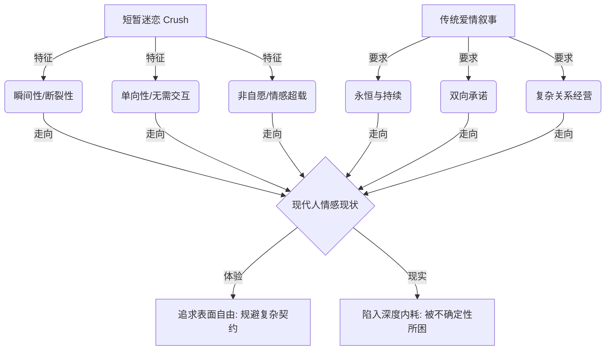

### 语义反叛：从物理碾压到情绪超载的语言考古

在现代人的情感光谱中，有一个词汇的流行度正在以一种近乎野蛮的速度狂飙突进，那就是 **Crush**。无论是在日常闲谈中，还是在中文互联网的每一个角落，我们都频繁地听到年轻人诉说着自己对某个人“上头了”，经历了一场惊心动魄的 **短暂迷恋**（Crush: 物理上指碾压或击碎，在情感语境中特指一种突然发生、强度极高且带有失控感的情感迷恋）。要真正理解这种普遍的社会情绪，我们首先需要回到这个词汇的词源逻辑和演变路径中去。

在英文的物理本意中，`crush` 指的是一种物理上的强力压迫、碾压、压碎或者猛烈击中。这种坚硬而具有破坏力的词汇，在十九世纪的英文谜语中，首次发生了一次微妙而深刻的隐喻性转向，衍生出了我们今天所熟知且频繁使用的情感含义。那时的谜语用它来形容一种“被某人压得喘不过气来的强烈迷恋感”。当我们今天在中文语境里说“I have a crush on someone”或者“我今天又上头了”的时候，这个词汇其实已经从物理层面的挤压，彻底蜕变为一种在情绪和精神上被对方完全压倒、征服与占领的状态。那是一种无法用意志压抑的心跳加速，一种在突如其来的强烈好感面前，身体与情绪同时陷入短暂失控的奇特体验。

这种情绪力量是如此之强，以至于它几乎呈现出一种近乎失控的心动感。它与我们传统语境中所探讨的、建立在契约与长期互动之上的亲密关系有着本质上的区别。传统的亲密关系需要双向的理解、长时间的经营以及彼此之间的深度绑定，然而这种短暂的迷恋却展现出了一种极其独特的孤立性。它不仅可以是毫无回音的单恋，甚至可以发生两个完全没有任何交集的陌生人之间。这意味着，即使对方在物理现实中根本不认识你、甚至从来没有看过你一眼，也完全不会阻碍这种情感在你的内心深处掀起滔天巨浪。

在极其日常的场景中，这种情感的火花往往以最意想不到的方式被点燃。比如在拥挤、嘈杂且冷漠的城市地铁上，你疲惫地站立着，目光在无序的车厢中游离。突然，你的视线落在了一个安静看书的陌生人身上。他或她只是静静地捧着书，车厢的日光灯洒在书页上，也照亮了其沉静的面庞。你并不认识对方，在未来的日常轨道中也大概率不会再有任何重逢的可能，但这一幕却如同闪电般击中了你，让你瞬间产生了一种极其猛烈、甚至带有一丝眩晕感的心动。这种无需双向互动、无需社会契约的纯粹心动，正是这种短暂迷恋文化在中文互联网上得以迅速火爆并引发无数共鸣的底层基石。

之所以这个外来词汇能够在中国年轻人的心智图谱中迅速扎根，是因为它精准地命名并描绘了一种长期以来被主流情感叙事所忽略或压制的微妙感受。在传统的社会话语中，对爱情的歌颂往往牢牢绑定在“一往情深”或者“朝朝暮暮”的宏大叙事之中。在这种传统的叙事范式里，只有那些指向永恒的、持续的、双向互动的爱，才被赋予“真正爱情”的合法性。人们习惯于认为，爱必须有起点、有过程、有回应，最终必须通往一种稳定的、可以被社会规范所吸纳的关系。

然而，在这种短暂迷恋的语境之中，游戏规则被彻底重写了。你可能并非对方的恋人，也可能永远无法跻身对方的朋友圈，甚至你们之间仅仅是人海中那一秒钟的萍水相逢。但这种物理上的距离和社交关系的匮乏，完全不会消解你在那一瞬间感受到的情感烈度。它的出现，用一种不可辩驳的姿态向我们宣告：人类的爱欲与心动，并不只存在于那些长相守与两情相悦的宏大蓝图里。相反，爱欲完全可以是没有交互性的，可以是极其短暂却又异常激烈的。这种文化在表面上为现代人提供了一种前所未有的情感自由感——它似乎在暗示，你再也不需要费尽心机去经营一段充满了妥协、争吵与责任的复杂亲密关系，你只需要顺从自己内心那一瞬间最纯粹、最炽热的火花，去简单地爱、去短暂地燃烧即可。



### 悬置的煎熬：不确定性与强迫性迷恋的心理学共振

然而，这种标榜着自由与轻盈的现代情感模式，在现实的沙滩上却常常撞得粉碎。越来越多的年轻人非但没有在这种轻盈的心动中获得救赎，反而越发深地被这种短暂的心动以及 **无名关系**（Situationship: 缺乏传统亲密关系中明确定义、承诺与社会契约的亲密交往状态）折磨得痛苦不堪，陷入了无休无止的心理内耗之中。

这种痛苦的根源，恰恰在于那种极具诱惑力却又极其折磨人的不确定性。当我们陷入这种悬置的情感状态时，我们所爱上的、所迷恋的，在很大程度上并不是一个具体而真实的人，而是那种由无数个“不知道”拼凑而成的巨大悬念。你的大脑开始夜以继日地运转，试图解开一个又一个无法证实也无法证伪的谜题：对方到底是怎么看待我的？我们之间究竟有没有哪怕一丝一毫的可能性？他昨天在社交平台上发布的那句歌词，是不是在暗中指涉我？他今天回复消息时多加的那个表情符号，是否蕴含着某种特殊的温情？我应不应该主动迈出那一步？如果我主动了，会不会打破这层脆弱的平衡，从而导致难以收拾的尴尬与冷场？

在这种心理折磨中，最让人感到窒息的体验并不是事情的最终失败，因为明确的失败至少能带来尘埃落定的解脱。最深沉的痛苦在于事情被无限期地悬置在半空中。它既没有走向成功的曙光，也没有坠入失败的深渊；它从未真正开始，因此也无从谈起如何结束；你得不到一个确切的答案，同时也找不到一个体面退出的机制。这种情感的悬摆状态，在心理学上有一个极为精确且充满学术张力的专有名词来进行定义，那就是 **强迫性迷恋**（Limerence: 心理学中由多罗西·田纳夫提出的一种强烈的、非自愿的、反复侵入脑海的，且极度渴望对方情感回应的强迫性迷恋状态）。

这个概念最早是由美国心理学家**多罗西·田纳夫**在其里程碑式的著作**《爱与迷恋》**中提出来的。多罗西·田纳夫通过大量的临床观察和问卷研究指出，这种情感状态绝对不是普通意义上的好感或喜欢，而是一种强烈的、非自愿的、反复侵入个体脑海的强迫性心理状态。在这一状态中的人，即便在理性上清醒地知道自己与迷恋的对象之间缺乏真实、深度的现实连接，甚至知道这段关系毫无前途，但在感性上依然会不受控制地反复思索关于对方的一切。

当个体处于这种强烈的状态时，其认知系统会发生显著的重构，表现为对特定对象的强迫性注意、高度的理想化投射，以及对情感回应近乎病态的渴望。陷入其中的人会变成最敏锐的符号学家，去无限放大和解读对方的每一个细微动作。每一次对方秒回消息的举动，都会在内心深处激发起狂欢般的兴奋；而一旦对方表现出哪怕一丝一毫的冷淡或延迟回复，又会瞬间将个体推入万劫不复的自我怀疑与沮丧深渊。

```
【强迫性迷恋（Limerence）心理反馈环】
   ┌──────────────────────────────────────────────┐
   │                                              │
   ▼                                              │
 接收信号 (对方的一个眼神/一条信息)                  │ (强迫性认知重组)
   │                                              │
   ▼                                              │
 深度解读与符号化 (将细节放大为“爱意”或“冷漠”)        │
   │                                              │
   ├───────────────────────┐                      │
   ▼                       ▼                      │
【积极解读】             【消极解读】                 │
 大脑多巴胺激增          产生极度失落与焦虑           │
 情绪陷入狂欢状态        进行惩罚性的自我攻击          │
   │                       │                      │
   └───────────┬───────────┘                      │
               │                                  │
               ▼                                  │
         渴望下一次回应 ──────────────────────────┘
```

神经科学和脑成像研究进一步为这种心理状态提供了生物学层面的实证支持。当人处于这种极度上头的浪漫爱早期时，大脑中与奖赏机制、动机驱动以及目标追求密切相关的神经回路（如中脑边缘多巴胺系统）会被高强度地激活。这表明，当你在为某个人魂牵梦萦、痛苦挣扎的时候，你所经历的并不仅仅是情感上的“想念”，而是你体内整套注意力系统、期待系统和多巴胺奖赏系统被全面调动并劫持了。

这种短暂迷恋的结构性痛苦，来自于其化学反应的独特配方：**极度的强烈性**与**极度的不确定性**的共谋。强烈性牢牢锁定了你的注意力，让你根本无法通过意志力去忽视对方的存在；而不确定性则像一把无形的锁，阻断了你试图为这段情感画上句号的努力。在这种拉扯中，情感的底层逻辑不再是温和的“我喜欢你”，而演变成了一种具有侵入性的“我被你击中了，但我却不知道这记重击究竟预示着什么”。在这种状态下，你一方面沉溺于幻想的美妙，另一方面又在现实的狼狈中不断进行自我贬低与羞辱，陷入“我是不是太缺爱了”、“我是不是心理不够成熟”的自责怪圈。然而，从哲学的视角来看，这种自我攻击或许完全误读了心动的本质。

### 哲学断裂：阿兰·巴蒂欧的事件理论与秩序重建

为了超越这种心理学维度的自我谴责，我们需要引入法国当代哲学家**阿兰·巴蒂欧**的哲学武器。在阿兰·巴蒂欧的哲学体系中，有一个极为核心的基石概念，那就是 **事件**（Event: 法国哲学家阿兰·巴蒂欧提出的概念，指突然发生、无法用既有秩序和规则解释，并迫使主体重新理解与命名世界的断裂性时刻）。

为了理解什么是哲学意义上的“事件”，我们首先需要对比巴蒂欧笔下与之相对的“日常事务”。在我们的日常生活中，绝大多数发生的事情都是被社会规则、既得利益和日常逻辑所妥善安排好的。这些事情虽然在发生，但它们完全在既有秩序的解释框架之内。比如你每天早上按时起床、挤上通勤的地铁、在格子间里开会、在手机软件上点外卖、回复工作邮件、在下班后刷着算法推荐的短视频。这些活动虽然填满了你的时间和精力，但它们没有一件能够真正撼动你理解自己、理解世界的基本框架。它们只是既有社会机器运转的零部件，不断强化着原有的世界秩序。

然而，“事件”的降临则是对这种平庸日常的一次毁灭性打击。事件是一种突发性的、带有彻底断裂色彩的时刻。它绝对不是既有规则的逻辑延伸，相反，它是规则本身被彻底改写、被重新定义的起点。事件最大的特征在于它无法被原有的社会语言和逻辑秩序所吸收，它迫使身处其中的人必须建立一种全新的语法去命名同一个世界。巴蒂欧在其著作中列举了四种最典型的事件源泉：**科学发现**、**艺术突破**、**政治革命**以及**爱情**。

```
【巴蒂欧哲学范式：日常事务 vs 断裂事件】

     日常事务（Situation / States of Affairs）
   ┌────────────────────────────────────────────────────────┐
   │ 特征：规则延续、可预测、绩效主导、维护既有社会秩序       │
   │ 行为：打工还贷、刷算法视频、基于匹配度的相亲、规避风险   │
   └──────────────────────────┬─────────────────────────────┘
                              │
                    「突然发生的断裂时刻」 
                              │
                              ▼
     断裂事件（Event / Événement）
   ┌────────────────────────────────────────────────────────┐
   │ 特征：无法预测、打破既有秩序、改写生命语法、产生新主体   │
   │ 范式：科学发现（引力论）、政治革命（1789）、爱情（Crush）│
   └────────────────────────────────────────────────────────┘
```

为了直观地理解这一点，我们可以看一看政治革命和科学历史上的断裂性时刻。在公元一七八九年法国大革命爆发之前，绝大多数人（包括当时的贵族和农奴）在旧制度的秩序下，都将国王的绝对神权和封建的等级制度视为不可动摇的自然真理。世界按照这一套既定的语法运转了千百年。然而，当巴士底狱的炮声响起，大革命这一伟大的“事件”爆发之后，旧有的宇宙秩序和语言体系瞬间崩塌了。人们突然开始用“公民”、“人民”、“平等”和“自由”这些前所未有的概念去重新命名同一个法国。世界的语法变了，旧规则再也无法回去，这便是政治层面的事件。

同样的逻辑在科学史中也在反复上演。在伟大的物理学家**艾萨克·牛顿**之前，人们对于物体下落、星体运转的理解是零散的、基于日常直觉经验的。人们认为重的物体下落得快，天体与地上的物体遵循着完全不同的神学规则。然而，当万有引力定律这一科学事件被发现并命名之后，整个世界的语法发生了质的跃迁。世界不再是割裂的经验碎片的集合，而变成了一个能够被同一套简洁、优美的物理规律所描述的整体。科学发现作为一个事件，彻底改写了人类理解物质宇宙的方式。

回到我们所探讨的短暂迷恋中，它之所以在个体的生命历程中具有如此令人战栗的哲学张力，正是因为在本质上它不是一个可以被计划、被安排的情感项目，而是一场在极其平庸、琐碎的日常场景中悍然爆发的“事件”。你原本循规蹈矩地生活在自己的秩序里，你的生活被绩效指标、理性的风险规避所填满。然而就在某一瞬间，生活发生了一次尖锐的断裂。一个你可能素昧平生的人，他翻书的姿态、他说话时细微的尾音、甚至是他在人群中一个转瞬即逝的眼神，以一种近乎粗暴的方式击穿了你精心构建的理智防线。

你无法用之前的任何生活经验去合理解释这种突如其来的情绪超载。这种体验是如此直接、如此强烈，以至于它像一把利刃割开了你灰蒙蒙的日常通勤生活。比如，你只是像往常一样发呆般站在北京的“京台夕照”地铁站台，看着对面的列车缓缓进站，车门打开，一个手捧**阿尔贝·加缪**著作的女生走下车。她沉静地翻动书页，微风拂过，她的发梢随着她的步伐在空气中划出轻盈的弧度。在随后的整整一个星期里，你在重复的打工生活中都会反复回想起这个极其微小的瞬间，你的内心被一种难以言喻的好奇与向往所占据。

或者是在公司那部沉闷、压抑、充满着疲惫职场人默然对峙的电梯里，一个穿着普通白衬衫的男生，在按下自己要去的楼层后，会习惯性地站在控制面板前帮后面的人按住开门键，并且在门即将关闭时，极其自然地伸出手臂挡一下。这个细微却温柔的日常动作，可能在瞬间就让你的视线停留，让你在走出电梯后依然对这个普通同事的生命轨迹充满了探寻的渴望。

再比如在喧闹的大学阶梯教室里，一节极为普通的课间休息时间，前桌的女生突然转过身，有些局促地向你借一块普通的橡皮。她向你道谢，然后转回去继续在草稿纸上演算。而你在这个瞬间，却只注意到了她转头时马尾辫扬起的那个青春而优美的弧度。我们生命中那些最刻骨铭心、甚至近乎偏执的浪漫迷恋，几乎毫无例外地，都是从这一个个不可总结、不可控制、无法被塞进日常轨道的“事件”中生发出来的。

### “二的经验”：打破唯我论与世界图景的重新点亮

然而，为什么面对这样一个在枯燥日常中投下光芒的事件，现代人却总是本能地感到痛苦和抗拒？这是因为作为现代文明的产物，我们习惯了通过绝对的控制和合理的风险评估来规避生活中的不确定性。我们本质上排斥任何不可控制的力量，而这种突如其来的心动恰恰是对个体主权和控制欲的一次公然挑衅。

在日常生活中，我们被规训去追求一种可以被管理、可以被预测的情感体验。我们希望生活能够给出一个清晰的判定：要么行，要么不行。如果行，我们就可以启动交往程序，制定下一步的交往指标；如果不行，那我们就可以立刻止损，转身回家去阅读**伊曼努尔·康德**的《纯粹理性批判》，重新回到理性的怀抱中。然而，现代的短暂迷恋以及各种暧昧关系，偏偏挑衅性地停留在两者的中间地带。它不给你最终的承诺与结果，但它也不彻底截断你的希望；它没有退出机制，只是将你悬挂在想象与现实的钟摆之上，让你的情绪随着对方的一举一动而剧烈起伏。

针对这种在痛苦中挣扎的现代人，巴蒂欧提出了一个极具革命性的爱情宣言：爱，在本质上绝对不是两个孤立个体的融合，也绝非一个人对另一个人的占有。相反，爱是打开了一种极其宝贵的**二的经验**（The Experience of the Two: 爱情让主体超越个体的单向视角，开始以两个人的差异性视角去重新组织和经验同一个世界的存在范式）。

```
 【巴蒂欧的“二的经验”世界重组】
 
   【单向的“一”之视界（唯我论）】
   ┌──────────────────────────────────────────────┐
   │ 视角：路线、通勤效率、消费、商场、咖啡馆的价格 │
   └──────────────────────────────────────────────┘
                          │
                   【爱情事件降临】
                          ▼
   【双向的“二”之视界（二的经验）】
   ┌──────────────────────────────────────────────┐
   │ 视角：你走过的路、可能偶遇的街角、要分享的歌  │
   │ 效果：世界未改变，但被“差异性”重新点亮与重组  │
   └──────────────────────────────────────────────┘
```

在爱情降临之前，我们每一个人都是一个孤立的“一”。我们以自我为中心去经验这个世界，世界在我们眼中呈现为功利性的路线、通勤的时间、商场的消费以及咖啡馆的价位。然而，一旦你喜欢上一个人，这个原本冰冷、客观的世界在瞬间被重新组织和定义了。世界并没有在物理层面上发生任何改变，但在你的主观体验中，它被彻底重新点亮了。

原本毫无生气的街道，因为对方曾经走过，而变成了充满故事感的痕迹；那家你走过无数次的普通咖啡店，突然变成了可能发生偶遇的奇迹之地；某首你听了千百遍的旋律，在这个瞬间突然变成了你迫切想要分享给对方的心灵密码；当你看到落日的余晖洒在城市的玻璃幕墙上时，你会不由自主地想象对方此时此刻是否也在同一个天空下注视着这抹金黄。

用巴蒂欧在其哲学著作中极为诗意的一段话来描述，这种“二的经验”就像是在山村中一个极其宁静的傍晚，你把手轻轻地搭在爱人的肩膀上，共同看着远处的夕阳西下。即将隐没在远山背后的红日、在微风中婆娑起伏的树影、宛如镀上一层金色光晕的草地，以及成群结队缓缓归家的牛羊。此时此刻，你并不需要去注视爱人的脸庞，也无需用任何言语去表白，因为你无比确信，你的爱人此时也在凝望着同一个世界。

在这一个瞬间，爱展现了它的终极悖论：它是同一的差异性，也是差异的同一性。在这个名为“爱”的主体中，存在着“他”和“我”的差异，但我们却在这个差异中共同融入了这唯一的、朝向世界展开的主体。世界因为我们之间的差异性而诞生，它不再仅仅是填满“我”个人视线和欲望的客观投影，而是成为了我们共同的舞台。巴蒂欧正是据此认为，那些因为短暂心动而陷入深度自我谴责与内耗的年轻人，其实完全辜负了这一伟大事件的恩赐。能够在这个日益标准化、被理性计算所统治的社会中，体验到一种超越自我控制的、纯粹浪漫的事件降临，这本身就是一件极其珍贵、甚至堪称神圣的事情。

### 绩效陷阱：将事件强行翻译为结果的现代性病症

然而，为什么这个原本美好的事件，在现代社会的日常实践中会蜕变成一场高密度的精神折磨？其根本原因，在于现代人面对“事件”时，常常患有一种本能的现代性顽疾——**急着将事件翻译成结果**，试图用绩效思维去消灭一切不确定性。

每当心动的火花刚刚闪烁，我们体内的现代性防御系统就会立刻警钟大作。我们的理智会迫不及待地跳出来，用一系列极其功利化的问题去拷问这个脆弱的瞬间：他到底喜不喜欢我？我们之间能不能走入婚姻或稳定的恋爱轨道？我要怎么做才能以最快的速度建立关系？如果没有未来的确定结果，我现在的每一次思念、每一次主动是不是都在“做无用功”？我是不是应该立刻启动止损机制，收回我的情感投入？

在现代绩效主义的宰制下，我们太习惯于将生命中所有开放的、具有无限可能性的“事件”，强行翻译成一个有标准答案的“问题”，然后试图去寻找一套最高效的 **标准作业程序**（SOP / Standard Operating Procedure: 针对某项任务所制定的标准化、步骤化的操作流程与规范指导）来加以解决。我们把对一个具体的人的心动，变成了一场关于如何通过正确手段来“获取”这个人的技术性操作。

一旦这种控制论的逻辑接管了你的情感，无休止的内耗与痛苦便不可避免地拉开了帷幕。你的大脑开始化身为一台冰冷的计算机器，开始评估每一次交往的成功率，开始拿着聊天记录进行像素级的复盘，甚至开始去狂热地研究对方的星座、**迈尔斯-布里格斯类型指标**（MBTI: 一种基于荣格心理学类型理论的个性测试和分类工具）以及依恋类型。你在网络论坛上疯狂地搜索着各种恋爱指南：不主动联系是不是代表没戏？对方忽冷忽热该怎么应对？如何在一周内看透一个人？你越是渴望得到一个确定的结果，就越是对眼前的现实感到失控；你越是想用一套公式去规范它，就越是深刻地意识到，情感根本无法被纳入计算的轨道。

```
                    【心动火花闪烁 (Crush 事件降临)】
                                   │
                 ┌─────────────────┴─────────────────┐
                 ▼                                   ▼
       【现代绩效思维（内耗之源）】         【开放的哲学视界（接纳不确定）】
       - 强行翻译为“需解决的问题”           - 承认事件本身具有断裂性与不可控性
       - 寻求恋爱 SOP 与效率最大化          - 允许情感停留在模糊与可能性的区间
       - 依赖 MBTI/星座等指标计算成功率     - 借助“二的经验”拓宽个体的生命体验
       - 视无法即刻建立关系为“投入损耗”     - 将心动视为重新激活感知力的契机
                 │                                   │
                 ▼                                   ▼
       【结果：心理超载、自我羞辱与重度内耗】  【结果：温柔的自我和解与审美愉悦】
```

在这个过程中，另一件同样重要的事情是，我们必须学会克制自己不要将这种突如其来的短暂心动，粗暴且迅速地等同于成熟的亲密关系。心动是真实且震撼的，但它仅仅是情感的入场券，而非关系成立的终点线。一个能让你在一瞬间感到灵魂震颤的人，并不必然代表他拥有和你建立健康、长期现实关系的情感能力；一个在远处理想化图景中显得无比迷人的人，也并不一定适合在日常的柴米油盐中与你并肩同行。对方偶然在你的世界里点燃了一束火光，并不意味着他就背负着必须回应你所有内心幻觉的道德义务。

很多短暂迷恋之所以最终演变成一场自虐式的精神折磨，正是因为我们太快地将一个具体、局限且并不完美的真实人类，变成了盛装自己所有未竟幻想的无菌容器。在你们还没有真正进行过深度的现实对话、还没有共同面对过生活的琐碎之前，你已经在自己的脑海中为他勾勒出了一个完美无瑕的拯救者形象。然而，真实的人必然是粗糙的、复杂的、不听从调遣的。他有自己的局限、他的自私、他的混乱，以及他自身无法摆脱的不稳定状态。因此，面对心动，最温柔的策略或许是给自己一点时间，将内心由多巴胺催生出来的幻象，与那个活生生、有血有肉的现实个体，慢慢地分离开来。

### 结语：在防御性时代，温柔而清醒地接纳爱欲的叩门

行文至此，我们可以对现代人普遍经历的短暂迷恋现象得出一个更为宽容且深刻的结论：Crush 之所以能产生如此摄人心魄的魔力，不仅仅是因为那个客体对象长得好看、温柔或特别，而是因为在那个被击中的瞬间，它以一种不可抗拒的姿态，将我们从机械化、标准化的日常生活轨道中猛烈地拽了出来。它让原本在绩优主义和日常琐碎中变得灰蒙蒙的世界，突然漏进了一束刺眼的光芒。

即便这个过程伴随着失控、犹豫、幻想和痛苦，但这一切情绪的波动，恰恰是一个人免于被现代性机器彻底格式化的证据。它有力地证明了你依然不是一台只会精打细算、评估风险、分析投资回报比并随时准备及时止损的冷冰冰的机器人。在厚重的防御机制背后，你依然保留着被一句话、一个眼神或是一个日常动作瞬间击中的敏感能力。

因此，当这种突如其来的爱欲再次叩响你的生命之门时，请学会温柔而清醒地对待它。你无需去羞辱它，因为那一瞬间的心跳加速是生命中最真实的化学反应；但你也不必急于去神话它，因为它还只是一场事件的开端，还远未承载起真实亲密关系的厚重。它是一个入口，一个让你在日复一日的麻木中重新审视自己内心真实渴望的契机。在这个人人都建立起厚重的情感防御、在亲密关系面前变得越来越谨慎、越来越退缩的理性时代，我们仍然拥有被世界打动的能力，而这件事本身，就已经足够珍贵。