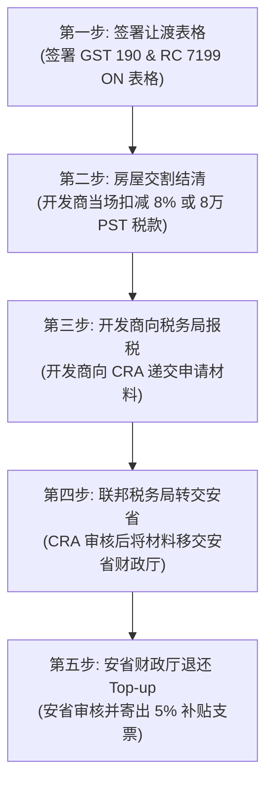

大家好，欢迎再次回到我的频道。今天是二零二六年六月二十四号，今天我想花一些时间，来和大家非常详细地聊一聊在二零二六年六月二十二号，也就是前两天，安大略省政府最新公布的关于安省新房退税的政策。这是一个全新版本的、经过大幅度加强和修改的新房退税政策。在此之前，也就是二零二六年四月份的时候，安省政府曾经公布过一版退税方案，但那时的方案与我们今天看到的六月二十二号新公布的政策版本之间，存在着非常巨大的、实质性的区别。

这一政策公布之后，仅仅过去了一天左右的时间，在整个华人的社交媒体、微信朋友圈以及各种各样的地产群里，就已经开始谣言四起、真假难辨。许多人对其中的关键条款产生了严重的误解，也有一些断章取义的宣传在误导普通的买家和投资者。所以今天，我在这里为大家做一个全面、客观且深度的分析，带大家逐字逐句地看一看这个政策的具体内容是什么，它的退税计算公式是怎样的，它对不同房价档次是如何划分的，以及最重要的一点——为什么说有些群体、特别是普通的个人地产投资者，其实并不适合这个政策，甚至可能会因为误判而跌入巨大的财务深渊。

### 历史性跨越：新政核心调整与截止时间压力

首先，我们来完整地梳理一下这个加强版新房退税政策的背景信息与核心框架。

这项政策在时间线上有着极其严格的界定。根据安省政府官方文件的规定，该政策适用的合同签署时间为**二零二六年四月一号至二零二七年三月三十一号期间**。也就是说，只有在这个时间范围内所签署的法定新房买房合同（Agreement of Purchase and Sale），才能够被纳入到这次的退税调整范围中。

对于安省的房地产政策而言，这无疑是一个地震级别的政策修改。为什么这么说呢？因为它从根本上颠覆了之前几十年里大家所熟知的退税规则：

第一，它彻底取消了**首次置业**（First-Time Home Buyer）的限制条件。在以往的很多购房优惠政策中，政府都会将福利圈定在首次买房的刚需群体中。但是这一次，只要你是购买符合条件的商品房用于自主目的，无论你名下曾经拥有过多少套房产，都可以申请这个退税。这一限制的拿掉，瞬间释放了大量换房族和改善型住房买家的需求。

第二，它大幅度提高了房价的上限。我们知道，在过去的安省退税政策里，退税的计算公式是以四十五万加元为重要关口的。对于四十五万加元以下的新房，安省政府会按照一定的比例进行退税；而一旦房价超过了四十五万加元，安省的退税额度就被死死地封顶在**两万四千加元**（$24,000）。在多伦多以及整个大多伦多地区（GTA），四十多万的新房几乎早已绝迹，这意味着绝大多数买家此前最多也只能拿到两万四的退税。而这一次的加强版新政，将房价的限制上限直接放宽到了**一百八十多万加元**（接近一百八十五万加元），这直接覆盖了目前市场上绝大多数的主流住宅户型。

第三，退税的金额和结构发生了质的飞跃。本次加强版政策规定，安省政府将全额退还百分之八的**安省销售税**（PST: Provincial Sales Tax）部分，并且在此基础上，额外加上一个百分之五的**省政府直接补贴**（Top-up: 额外政府直补）。这百分之五的补贴在今年四月份公布的第一版政策里是完全没有体现的。

在四月份第一版政策公布时，市场普遍理解的“百分之五”是指**联邦商品及服务税**（GST: Goods and Services Tax）。在安大略省，新房交易适用的是合并销售税（HST: Harmonized Sales Tax），总税率为百分之十三，其中包括了百分之五的联邦GST和百分之八的安省PST。而这次六月二十二号公布的最新加强版方案则明确表示，新加入的百分之五补贴是一个全新的“Top-up”，它是由安大略省政府直接出资补贴的，与联邦政府的GST退税没有关系。因此，这相当于安省政府在退还百分之八PST的同时，又自掏腰包给符合条件的买家多补了百分之五。

然而，在这个看似极其诱人的政策背后，却隐藏着一个非常紧迫的时间窗口。

我们要知道，这项政策规定的合同签署截止日期是二零二七年三月三十一号。如果我们以政策正式落地的二零二六年六月二十二号作为起点来计算，到二零二七年三月三十一号截止，整个政策的有效期实际上**只剩下了最后两百八十三天**。这是一个非常短暂的时间段。政策虽然力度空前，但留给买家看房、选房、谈判并签署正式合同的时间非常紧迫。

### 四大定价档次：不同房价下的退税分层计算

为了让大家能够更加直观地理解这项政策，我们必须将复杂的条文转化为具体的数学计算。

根据新政策的细则，安省政府将根据新房的合同价格，将房价划分为四个截然不同的档次。不同档次所适用的退税金额和计算逻辑有着天壤之别：

*   **第一档：零到一百万加元**。在这一档次中，百分之八的安省税款部分是可以全部退还的。但是，因为房价本身较低，其百分之八的金额还达不到安省规定的最高上限。例如，如果一个房子的价格是九十万加元，那么它能退的PST部分就是七万二千加元。这部分虽然是全额退还，但由于没有达到八万加元的封顶线，所以它最终退还的金额是七万二千加元，而不是八万加元。
*   **第二档：一百万到一百五十万加元**。在这个区间内，由于房价上升，百分之八的税款已经超过了八万加元，但安省针对这一部分的退税设定了**八万加元**的最高封顶线。因此，在这一档次中，买家无法拿到完整的百分之八，而是只能拿到足额的八万加元封顶退税。这也就是政策中所说的“足额退八万”，它与“退百分之八”在概念上是有着本质区别的，我们在后面的案例中会详细分析这种区别。
*   **第三档：一百五十万到一百八十五万加元**。一旦房价超过了一百五十万加元，这笔本可以封顶拿到八万加元的退税金额并不会保持不变，而是会进入一个**递减**（Phase-out）的区间。随着房价不断上升，八万加元的退税额度会逐步缩水，一直递减到一百八十五万加元。
*   **第四档：一百八十五万加元以上**。当房价跨过了一百八十五万加元这一门槛后，加强版的退税政策将不再适用。此时，退税政策会直接退回到最原始的、也是最老的退税级别，即无论房价多高，安省的退税额度一律重新封顶在**两万四千加元**。

除了上述的百分之八（或八万封顶）的退税之外，政策中另外那百分之五的**省政府直接补贴**（Top-up）在退税流程中也有着特殊的安排。

这一笔百分之五的补贴并不是在交割房屋时立即退还的。也就是说，它不能直接用来抵扣你在交割时需要支付的尾款。在实际操作中，买家在房屋交割（Closing）的时候，必须自己先掏腰包将这百分之五的资金支付给开发商或者税务局，然后在房屋交割完成之后，由买家自己向安大略省财政厅递交退税申请，等待省政府审核通过后，再将这百分之五的资金退回到买家的账户中。这是一个分步走的、需要一定周转时间的退税流程。

### 开发商定价机制：裸价与合同价的逻辑重构

在了解了这四个房价档次和两步走退税流程后，我们必须来探讨一个对于买家来说至关重要的问题：开发商是如何给新房定价的？

在二零二六年六月二十二号新政公布之前，由于市场已经习惯了“房价超过四十五万加元则安省退税封顶两万四千加元”的旧规则，开发商在制定新房的最终合同价（或者叫广告价）时，通常会采用这样一种标准的定价模式：

$$\text{合同价格} = \text{裸价} \times (1 + 13\%) - \$24,000$$

这里的“裸价”指的是房子本身的不含税价格。开发商将裸价加上百分之十三的HST（包含联邦和省税），然后直接减去他们帮买家代领的旧版封顶两万四千加元退税。你在买房合同上看到的那个最终价格，就是这样计算出来的。

举个例子，如果一套房子的裸价是一百万加元，按照旧的定价模式：

$$\text{旧版合同价格} = \$1,000,000 \times 1.13 - \$24,000 = \$1,106,000$$

这就是你在合同上会签字同意支付的价格。

那么，在新政确定了安省可以退还最高八万加元的PST之后，开发商的定价模式大概率会发生改变。我个人推测，开发商会迅速调整他们的报价结构，将其修改为：

$$\text{新版合同价格} = \text{裸价} \times (1 + 13\%) - \$80,000$$

他们之所以会这样做，主要是出于营销上的考虑。因为通过将减免的退税额度从两万四千加元提高到八万加元，在裸价保持不变的情况下，最终呈现在广告和合同上的价格会显得更低，从而在视觉上给买家营造一种房价下跌的优惠感。当然，这只是我的合理推测，不同的开发商在具体标价时可能还会有其他的财务和市场策略。

但是，如果你恰好是在今年四月一号至六月二十二号之间签署了楼花合同的买家，你的处境就会比较特殊。因为你当时签署合同的时候，政策还没有更新，开发商在合同上给你标示的价格，很有可能依然是按照“减去两万四千加元”来计算的。对于这部分买家，你们必须清楚地知道，尽管你们在旧合同上看到的价格只减了两万四，但等到交房时，根据追溯条款，你们实际应该享受的是最高八万加元的退税。因此，你们在交割时需要支付的实际买价，以及随后的退税结算，应该比合同上显示的数字更加划算。

为了帮大家彻底算清这笔账，我们针对不同的房价，以假设开发商已经调整了标价结构（即“裸价加百分之十三减八万”）为前提，来看看三种典型房价下的实际财务细节。

#### 案例一：裸价九十万加元的新房（第一档）

我们首先来看第一种情况，即房屋的裸价为九十万加元。

根据“裸价加百分之十三减去安省百分之八退税”的公式，我们来进行第一步的静态计算：
*   裸价：九十万加元（$900,000）；
*   HST税款（13%）：九十万加元的百分之十三，即十一万七千加元（$117,000）；
*   安省百分之八的退税部分：因为房价处于第一档，百分之八的税款可以全额退还。计算得出：九十万加元乘以百分之八，等于七万二千加元（$72,000）。由于七万二千加元小于八万加元的封顶线，所以此时的退税就是七万二千加元；
*   合同广告价：即九十万加元加上十一万七千加元，再减去七万二千加元，最终等于**九十四万五千加元**（$945,000）。这也是买家在合同上看到并需要签名的价格。

当这套房子到了交割阶段，如果买家是符合条件的自住房屋买家，他的资金流和实际成本将按照如下方式流转：
1.  在交割当天，买家必须按照合同价格九十四万五千加元完成房屋的交割；
2.  交割完成后，买家向安省政府申请那百分之五的**省政府直接补贴**（Top-up）。这笔补贴的计算基数同样是房屋的裸价，即九十万加元乘以百分之五，等于**四万五千加元**（$45,000）；
3.  安省财政厅在审核通过后，会给买家寄出一张金额为四万五千加元的退税支票；
4.  在拿回这四万五千加元的支票后，我们来计算买家的实际最终购房成本：九十四万五千加元的交割价格，减去退回来的四万五千加元，**刚好等于九十万加元**（$900,000）。

这意味着，在九十万加元这个房价水平上，通过两步退税的叠加，买家最终的实际拿房成本刚好等于它的裸价。换句话说，买家实际承担的HST税率为零。

#### 案例二：裸价一百三十万加元的新房（第二档）

我们再来看第二种情况，即房屋的裸价为一百三十万加元。

因为房价已经进入了一百万到一百五十万的区间，所以它的计算逻辑会发生变化：
*   裸价：一百三十万加元（$1,300,000）；
*   HST税款（13%）：一百三十万加元的百分之十三，即十六万九千加元（$169,000）；
*   安省百分之八的退税部分：如果直接用一百三十万加元乘以百分之八，得出的金额是十万四千加元。但是，政策规定安省PST退税最高只能封顶在八万加元。因此，这里的退税额只能取**八万加元**（$80,000），无法拿到十万四千加元；
*   合同广告价：即一百三十万加元加上十六万九千加元，再减去封顶的八万加元退税，最终等于**一百三十八万九千加元**（$1,389,000）。

当房屋进行交割且买家符合自住标准时：
1.  买家在交割当天需要支付一百三十八万九千加元给开发商；
2.  交割后，买家向安省政府申请百分之五的**省政府直接补贴**（Top-up）。计算得出：一百三十万加元乘以百分之五，等于**六万五千加元**（$65,000）；
3.  省政府审核通过后，将六万五千加元的支票寄给买家；
4.  买家的实际最终购房成本为：一百三十八万九千加元减去六万五千加元，等于**一百三十二万四千加元**（$1,324,000）。

在这个案例中，我们会发现，即使买家拿满了安省政府给予的所有退税红利，他最终支付的一百三十二万四千加元，依然比房屋的裸价一百三十万加元要多出两万四千加元。这说明在此档次下，买家无法实现完全的“零税率”，他仍然需要承担一部分未被退税覆盖的联邦和省税款。

#### 案例三：裸价一百六十万加元的新房（第三档）

我们来看第三种情况，即房屋的裸价为一百六十万加元。

在这个区间内，房价已经超过了一百五十万加元，进入了退税金额的递减区间：
*   裸价：一百六十万加元（$1,600,000）；
*   HST税款（13%）：一百六十万加元的百分之十三，即二十万八千加元（$208,000）；
*   安省退税部分：因为房价处于递减区间，此时的退税额既不是百分之八，也不是封顶的八万，而是按照公示递减。在这个价格点上，安省的PST退税部分已经被削减到了**六万四千加元**（$64,000）；
*   合同广告价：即一百六十万加元加上二十万八千加元，再减去递减后的六万四千加元，最终等于**一百七十四万四千加元**（$1,744,000）。

当房屋交割并且买家用于自住时：
1.  买家在交割日需要支付合同价一百七十四万四千加元；
2.  交割后，买家申请那百分之五的**省政府直接补贴**（Top-up）。这部分补贴同样会受到递减规则的限制。计算得出，在该房价下，买家最终只能退回**四万加元**（$40,000）；
3.  省政府审核后寄回四万加元的退税支票；
4.  买家的实际最终购房成本为：一百七十四万四千加元减去四万加元，等于**一百七十万四千加元**（$1,704,000）。

我们可以看到，对于一百六十万加元的房子，买家最终的实际持有成本比裸价高出了整整十万四千加元。随着房价越来越接近一百八十五万加元的上限，买家需要自己承担的税收成本呈指数级上升。

### 澄清误区：社交媒体上的谣言与“投资房”的文字游戏

在政策公布的第二天，也就是六月二十三号，华人的微信群和朋友圈里便传出了一张截图，声称：“安省加强版HST退税政策正式落地，加拿大买新房最高可获得返现十三万加元。该政策不仅适用于买家自住的主要住宅，也同样适用于住宅出租物业（Rental Property）。”

当我看到这则消息时，感到非常不可思议。这显然是对政策条文的严重误读。

为了弄清楚这个谣言的源头，我让群里的朋友发来了相关的政策原文截图。果然，政府在宣传文档的标题和部分黑体字中写着：“本政策适用于自住房，也同样适用于住宅出租物业（Rental Property）。”

然而，正所谓“魔鬼藏在细节里”，许多地产中介或者普通网民在转发时，只看了大标题的黑体字，却没有仔细去读黑体字下面那两个非常关键的**项目符号列表**（Bullet Points）。

在这两个不起眼的 Bullet Points 中，其实隐藏着一个非常关键的英文单词：**Residential Complex**。

在加拿大的税法和房屋政策定义中，“Residential Complex”指的是**复合住宅物业**，它有着极其严苛的定义，与我们平时所说的普通公寓（Condo）或独立的联排别墅（Townhouse）完全是两个概念。

政府政策之所以把“住宅出租物业”写进去，其真正的目的是为了鼓励那些专门用于出租的多单元住宅建设，也就是我们常说的**目的性租屋**（Purpose-Built Rental）。

具体而言，要让投资房享受与自住房相同的最高八万加元退税以及百分之五的省政府补贴，该物业必须满足以下极高门槛的硬性指标：
1.  该复合住宅物业必须包含**至少四个独立的居住单元**（4 Units）。这意味着房子里必须有至少四个卧室以及至少四个相互独立的厨房；
2.  该物业在建成并投入使用后，其全部单元的**百分之九十以上必须用于长租**。

如果达不到这个标准，比如你只是去开发商那里排队买了一套普通的“两室一厅”或者“三室一厅”公寓楼花，然后交房后用于出租。那么，对不起，你所购买的这套投资房**根本不属于**新政定义的“Residential Complex”。

在这种情况下，你所能享受的投资房退税政策，将直接退回到原点，也就是无论你买多少钱的房子，其安省退税的封顶额度依然是原来的**两万四千加元**。

这也就是我所说的“冰火两重天”：自住房买家可以开开心心地享受最高达十三万加元的政策红利；而普通的散户投资者，如果买的只是单套的普通住宅，则只能继续拿两万四千加元的旧额度。

### 投资者的隐形陷阱：交割时的现金流危机

在明确了自住房和投资房的退税差异后，我们就可以推演出一个针对普通地产投资者的财务陷阱。

我们依然以上面提到的三个案例为基础，对比自住房和投资房在最终实际成本和交割现金流上的巨大差异。

#### 场景一：裸价九十万加元的房子
*   **自住买家**：合同价为九十四万五千加元。交房后拿到四万五千加元的Top-up支票，实际最终成本为九十万加元。
*   **投资买家**：如果开发商在新政后将标价改成了“裸价加13%减8万”，那么这套房子的合同价格就是九十四万五千加元。但是，因为你是投资房且不满足多单元的限制，你最多只能退两万四千加元。这就意味着，你在交割时需要向开发商补缴这中间的退税差额。计算下来，投资者的实际最终持有成本为：九十万加元加上十一万七千加元的税，再减去两万四千加元的旧退税，最终等于**九十九万三千加元**。
*   **对比结果**：投资者的最终购买成本比自住买家整整高出了**九万三千加元**。

#### 场景二：裸价一百三十万加元的房子
*   **自住买家**：合同价为一百三十八万九千加元。交房后拿到六万五千加元的Top-up支票，实际最终成本为一百三十二万四千加元。
*   **投资买家**：如果买来用于出租，即使最终拿到了两万四千加元的退税，其最终的实际持有成本依然高达：一百三十万加元加上十六万九千加元的税，再减去两万四千加元，等于**一百四十四万五千加元**。
*   **对比结果**：投资者的最终持有成本比自住买家多出了**十二万一千加元**，比房屋本身的裸价更是多掏了**十四万五千加元**的现金。

#### 场景三：裸价一百六十万加元的房子
*   **自住买家**：合同价为一百七十四万四千加元。交房后拿到四万加元的Top-up支票，实际最终成本为一百七十万四千加元。
*   **投资买家**：如果用于普通出租，其最终的实际持有成本将飙升至：一百六十万加元加上二十万八千加元的税，再减去两万四千加元，等于**一百七十八万四千加元**。
*   **对比结果**：投资者的实际最终持有成本比自住买家整整多出了**八万加元**。

通过这三个案例的对比，大家应该能看得很清楚：

如果开发商在制定新房价格时，将“八万加元”的退税额度直接折算进房价里，那么对于自住买家来说是划算的；但对于普通的地产投资者来说，由于他们无法拿到这八万加元（只能拿两万四），所以在交房的当天，开发商或者律师就会要求投资者**自掏腰包补齐这几万加元的差额**。

这还没算上你在交接当天必须先行垫付、随后才能向省政府申请退回的那百分之五的Top-up补贴。

这几项开支叠加在一起，意味着在房屋交割时，投资者的银行账户里必须多准备出几万甚至十几万加元的现金。对于许多在签合同时就已经把杠杆拉满、预算卡得很死的投资者来说，这无疑是一个足以导致交割失败、被迫违约的现金流大窟窿。

这也是为什么我这么多年来，一直都在反复跟屏幕前各位做地产投资的朋友强调的一件事：

新房楼花这个市场，请大家一定要大大方方地让给那些真正有刚需的自住房买家。像这种薅政府羊毛的机会，也尽量留给别人，自己不要去瞎掺和。因为新房的税务结构和政策门槛极其复杂，如果投资者盲目跟风冲进楼花市场，往往会落得一个“偷鸡不成蚀把米”的尴尬下场。

有些家长在签楼花合同的时候，会给自己找一个听起来很合理的借口，比如：“我现在先买个楼花占个位，等几年后孩子去多伦多上大学了，正好可以给孩子住。”

但从我实际接触到的案例来看，绝大多数抱有这种想法的家长，等到几年后楼花真正交割的时候，由于各种计划的变化（比如孩子去了其他省份上学，或者嫌弃新房位置不好），最终都没能让孩子住进去，而是选择将其挂牌出租。

一旦你的房子进入了出租市场，在新的政策框架下，你在今年四月一号到明年三月三十一号之间签署的这份楼花合同，就很有可能会让你面临既拿不到高额退税，又要在交割日被动补缴巨额现金的被动局面。

### 实操指引：安省退税流程的官方步骤拆解

为了帮助那些确实符合自住条件的买家顺利拿到退税，我们有必要对照安省财政厅的官方文件，将退税的具体操作流程进行一次中文的步骤拆解。

官方文件以一个非首次置业但购买自住房的买家为例，详细列出了以下五个关键步骤：

1.  **第一步：买方签署退税让渡表格**。在买家签署正式买房合同时，或者在交接前的准备阶段，买家需要签署两份非常关键的税务表格。第一份是联邦的 **GST 190** 表格，第二份是安省特有的 **RC 7199 ON** 表格。买家签署这两份表格的目的，是为了将自己向税务局申请新房HST退税的法定资格，正式让渡（Assign）给建筑商（Developer）。
2.  **第二步：开发商在交割时直接扣减**。在交房当天，因为买家已经将退税资格让渡给了开发商，开发商会在最终的交割账单（Statement of Adjustments）中，直接帮买家扣除那百分之八（或最高八万加元）的安省PST退税。这样，买家在当天需要支付的现金就直接减少了这部分金额。但需要提醒的是，另外那百分之五的省政府补贴（Top-up）可能需要买家在当天先全额支付。
3.  **第三步：开发商向联邦税务局报税**。房屋交割完成后，开发商会把买家之前签署的 GST 190 和 RC 7199 ON 表格，连同房屋交易的其他证明材料，一起递交给加拿大税务局（CRA: Canada Revenue Agency）。
4.  **第四步：CRA审核并转交材料**。加拿大税务局在收到开发商提交的申请后，会先对百分之八的PST退税部分进行审核。审核无误后，CRA会将这套材料以及相关的审核结果，转交给安大略省财政厅（Ontario Ministry of Finance）。
5.  **第五步：安省财政厅发放最终补贴**。安省财政厅在收到CRA转交的材料后，会启动针对那百分之五省政府直接补贴（Top-up）的二次审核。在确认买家的自住身份真实无误后，省财政厅会直接向买家寄出一张印有最终补贴金额的退税支票。

通过这个官方给出的标准流程，大家应该能够清晰地看到，整个退税过程并不是一蹴而就的，它需要买家、开发商、CRA以及安省财政厅四个方面的紧密协作和多道审核程序。

### 专家建议：签约前的合同死磕与法律合规

虽然这次出台的加强版退税政策在力度上确实是史无前例的，但对于广大买家而言，在具体实操中依然有几个极其关键的注意事项需要大家保持清醒的认识：

第一，无论是自住还是出租，你在买房交割的时候，**手头上都必须准备比以往更加充足的现金**。因为不管是补缴未享受到退税的税款差额，还是先垫付后退回的省政府Top-up补贴，都会在交割的那几天对你的资金链提出极高的要求。

第二，在真正签署任何新房认购合同之前，**你必须拉着你的代表律师，逐字逐句地死磕合同里的税务条款**。你必须向开发商明确：他们目前在广告和合同上报给你的价格，到底是以减去两万四千加元为基础计算的，还是已经按照减去八万加元来计算的？甚至有些开发商直接报的是完全不包含任何退税的纯裸价。如果搞不清楚这个定价逻辑，你在交房时就会面临巨大的财务被动。

第三，在买房这件事情上，千万不能像前几年市场疯狂的时候那样，为了抢一套楼花，在售楼处外面排上四天四夜，然后到了现场闭着眼睛就签合同。在如今这种市场和政策环境下，你必须确保合同中包含**冷静期**条款（Cooling-off Period）。在冷静期内，把合同带回家，找专业的地产律师或者精通税务的会计师帮你看清楚每一项条款，确保没有猫腻后再做最终决定。如果购买的是没有法定冷静期的 Freehold 新房，那么在去现场之前，最好带上一位懂法律或财务的朋友帮你把关。

第四，**千万不要在自住和出租的身份认定上弄虚作假**。有些人可能会想，我虽然是买来投资出租的，但为了拿到这最高八万加元的退税以及省政府的百分之五补贴，我在申报时假装说是自己住，等拿到退税后我再偷偷把它租出去，或者拿去做短租（如 Airbnb）。

我必须非常严肃地警告大家：这种行为是严重的税务欺诈。加拿大税务局（CRA）和省财政厅在针对新房HST退税的后期审计上，手段极其严格。他们会通过核对你的驾照地址、税单邮寄地址、公用事业账单（水电费）姓名，甚至会上门进行实地抽查。一旦被税局查出你并没有真实地在里边自住，你不仅需要退回所有拿到的退税款，还会被课以高额的罚金和利息。

另外，根据省政府的最新通知，与这项加强版政策配套的各种具体申报表格（包括修改后的税务表格和指南），预计要在今年七月份才能陆续在官方网站上向公众发布。在七月份表格正式出台之前，安省政府是否还会发布进一步的细节调整或者补充说明，目前我们还不得而知。

总而言之，我希望大家在准备购买新房楼花之前，一定要花时间把这个 HST 退税政策的每一项条款、每一种计算逻辑都彻底研究透彻，确保自己的财务状况能够完美匹配交割时的现金流要求。千万不要在稀里糊涂的情况下就把合同签了，否则等到几年后交房时，你可能会面临巨大的资金缺口，甚至悔恨不已。

好的，我们今天的节目就先聊到这里。非常感谢大家的收听和收看。如果你想继续就这个新政策进行更加深入的讨论，或者有具体的个案想和大家交流，可以点击视频下方文字栏里的链接，加入我们的 WhatsApp 财商交流二群。另外，我也会把安省财政厅关于新房HST退税政策的官方官方链接放在下方的文字栏里，方便大家自己去下载和阅读原文。

我们这一期的节目就到这里，谢谢大家，我们下期节目再见。