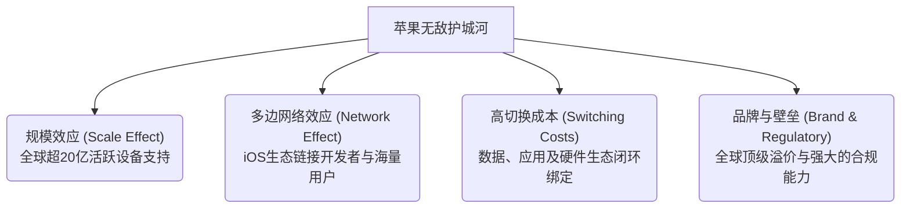

### 逆风领跑：AI浪潮下的惊艳回报

在当今全球资本市场中，人工智能（Artificial Intelligence）的爆发无疑是最吸睛的叙事主线。从英伟达（NVIDIA）的芯片神话到微软（Microsoft）的全面赋能，科技巨头们似乎都必须打上AI的标签才能获得市场的青睐。在此背景下，市场上一度充斥着对苹果公司（Apple Inc., 股票代码：AAPL）的质疑声，认为其在AI时代已经毫无建树、动作迟缓，失去了科技龙头的领先地位。

然而，市场数据却给出了完全相反的答案。在最近的一周内，苹果的股价上涨了13.03%，而在最近的两个月里，苹果更是以一种闷声不响的方式，累计上涨了高达30.31%。这样的表现或许不能简单地被定义为暴涨，但在如今的巨无霸体量下，绝对堪称惊艳。这也让许多投资者心生疑惑：为什么直到今时今日，苹果的股价还能屡创新高？它现在是否依然是一台能够稳定运转的复利机器？

作为一名拥有十一年投资经验的投资人，同时也是一名事务所的专业会计，我倾向于用严谨的数据和清晰的底层财务逻辑来审视这一问题。在开始具体的业务和财务数据拆解之前，我先公开自己的真实持仓表现。截止到目前，我持有苹果股票已经长达1479天。在这四年多的时间里，我的苹果仓位实现了**27.08%的复合年化回报率**（Compound Annual Growth Rate）。作为对比，如果在同一时间段内，我将资金投资于标普500指数ETF（S&P 500 ETF），所能获得的年化回报率则是19.14%。显而易见，这部分仓位的回报表现大幅度吊打大盘。

坦白地说，这样的结果连我自己都感到有些意外。在苹果被质疑“掉链子”、失去AI先发优势的舆论声中，它依然用股价的持续高歌猛进为坚守的投资者带来了丰厚的回报。而要彻底理解这背后的原因，不能仅凭市场情绪或短期股价的波动，我们必须回到公司最新的财务报告中，用数据解开苹果的财富密码。

---

### 双轮驱动：硬件周期与软件生态的协同效应

要看懂苹果的赚钱逻辑，首先需要明晰它的业务细分（Business Segments）。苹果的管理层目前将公司的核心业务分为两大板块：**硬件业务**（Hardware Business）与**服务业务**（Services Business）。这两大板块在财务特征、增长曲线和商业模式上有着截然不同的表现，但又在底层逻辑上形成了高度的互补与咬合。

#### 1. 硬件业务：高客单价的精英级基石

硬件业务是苹果传统的立身之本，涵盖了我们耳熟能详的iPhone、iPad、MacBook、Mac系列个人电脑，以及Apple Watch、AirPods等穿戴设备和配件。根据苹果最新季度的财报数据显示，其硬件业务的单季营收达到了80.21 billion（十亿美元），同比实现了16.73%的增长。更令人瞩目的是，在如此庞大的物理硬件制造规模下，苹果的硬件业务依然保持着**38.69%的利润率**。在制造业中，这无疑是精英级别（Elite Level）的利润表现。目前，硬件业务在苹果总营收中的占比为72.14%，是公司最主要的营收来源。

从历史数据图表来看，苹果的硬件营收具有非常明显的**周期性特征**（Cyclicality）。这种周期性的形成非常容易理解，它与苹果的发布会节奏及全球消费季高度绑定。苹果习惯于在每年的9月下旬举办秋季新品发布会，推出新一代的iPhone及其他硬件产品。因此，每年包含圣诞节和新年假期的12月份季度（即第一财季），苹果的硬件业务都会迎来一次爆发式的增长。

例如，在上一轮周期中，引爆业绩的主力就是搭载了先进**A19 Pro芯片**的iPhone 17 Pro系列手机，同时苹果还推出了主打极致轻薄设计的全新产品线iPhone Air。这些高定价、高利润率的新品在年底消费旺季的集中释放，构成了苹果硬件业务特有的阶梯式增长律动。

#### 2. 服务业务：毛利恐怖的持续增量器

与具有明显波峰波谷的硬件业务不同，以iOS生态系统为核心的服务业务（软件与增值服务）展现出了截然不同的财务曲线。最新季度中，服务业务实现了30.97 billion的营收，同比增长16.25%。然而，其最惊人的数据在于毛利率——达到了**恐怖的76.68%**。

目前，服务业务的营收占总营收的比例为27.86%。但如果从利润贡献的角度来审视，就会发现一个非常惊人的事实：苹果凭借27.86%的营收占比，由于其极高的毛利率，实际上贡献了公司整体利润的43%左右。也就是说，单纯从“赚钱能力”和利润净值来看，苹果的服务业务与硬件业务已经形成了旗鼓相当、五五开的并立格局。

从增长趋势图上看，服务业务几乎没有任何周期性波动，呈现出一条稳定、平滑且一路向上的增长曲线。无论是处于硬件的销售淡季还是旺季，服务业务都能常年保持双位数的增长率。这种稳定性为苹果的现金流提供了极强的防御性底色。

---

### 权力转移：新CEO John Ternus的工程初心

除了业务表现外，近期苹果在管理层和产品线上的几项重大变动也引起了资本市场的广泛关注。这些变动在很大程度上重构了市场对苹果中长期发展的预期。

#### 1. 供应链博弈：内存涨价与定价权之争

在产品端，苹果于今年3月份重磅推出了一款入门级定位的新品——售价为599美元的笔记本电脑**MacBook Neo**，并针对学生和教职员工提供了499美元的教育专属优惠价。市场曾一度怀疑Neo是否为阉割严重的低配机器，但事实上，尽管它为了控制成本没有搭载最新的M系列芯片，但其配置的**A18 Pro芯片**在性能上依然非常能打，这展现了苹果在芯片存量利用上的极高效率。

然而，这款产品的定价随后卷入了一场由半导体供应链引发的涨价风波。苹果管理层在近期公开表示，由于目前美国市场的内存（Memory Chips）价格高企、成本大幅上升，苹果已经无法内部消化这部分压力，因此决定将旗下硬件产品全线提价15%至20%。这也导致此前打折后售价499美元的MacBook Neo价格上涨了100美元。

面对苹果对“内存太贵”的抱怨，全球存储芯片巨头美光科技（Micron Technology）毫不客气地进行了公开回怼。美光指出，在2023年半导体行业陷入严冬、产能过剩的时期，苹果作为拥有绝对话语权的超级买家，利用其市场垄断地位对美光等供应商进行了“毫无性”的压价，导致供应商的现金流杯水车薪，被迫大幅度削减了当时的产能和资本开支（CAPEX）。如今全球内存供需失衡、价格暴涨的恶果，恰恰是苹果当年过度压榨供应链所种下的因。双方的这一场剑拔弩张，揭示了全球半导体供应链在后疫情时代博弈的常态。

#### 2. 领袖更迭：从运营至上到产品工程的回归

在公司治理层面，苹果迎来了一个历史性的转折点。在联合创始人史蒂夫·乔布斯（Steve Jobs）逝世后，一步步将苹果带上世界巅峰、创造了数万亿美元市值神话的功勋CEO **蒂姆·库克**（Tim Cook）正式宣布退休，结束了他长达15年的苹果掌舵人生涯。

接替库克的是苹果新任CEO **约翰·特纳斯**（John Ternus），他将于9月1日正式接任。与供应链和运营管理出身、将精益生产和库存控制发挥到极致的库克不同，约翰·特纳斯是一位纯正的科班出身工程师（Professional Engineer）。

这一人事任命在科技界和投资界引发了强烈的反响。许多业内分析人士和长期投资者认为，约翰·特纳斯的上任标志着苹果的管理哲学将从库克时代的“运营至上、商业套利”重新回归到乔布斯时代的“重塑核心、追求卓越的产品工程”。在经历多年的挤牙膏式创新质疑后，这位工程师CEO的登台，被寄予了带领苹果重新在底层硬件与前沿技术上实现突破的厚望。

---

### 绝地反击：高壁垒护城河带来的降维打击

为了验证苹果这套商业模式在现实市场中的韧性，我们可以重点观察其在中国大区（Greater China）的表现。在过去的一到两年里，中国本土手机品牌如华为（Huawei）、小米（Xiaomi）、OPPO、vivo（合称“华米OV”）利用强大的本土供应链和极致的性价比，在折叠屏、影像系统等领域疯狂内卷，曾一度将苹果打得节节败退，市场份额出现下滑。

然而，到了2026年上半年，苹果在中国大区却打出了一场极其漂亮的绝地反击战。财报数据显示，苹果在中国大区斩获了**33%的营收增长**，且无论是iPhone、Mac mini还是MacBook，都重新登上了中国市场销量的榜首。

这背后的底层逻辑，正是苹果那固若金汤的**定价权**（Pricing Power）和供应链护城河对竞争对手实施的降维打击：

1. **供应链防御差异**：当全球内存价格因产能调整而疯狂上涨时，原本依靠微薄利润和高性价比进行竞争的“华米OV”等本土品牌，其利润空间瞬间被上涨的原材料成本吞噬殆尽，原本的性价比优势荡然无存，被迫跟着涨价。
2. **锁价能力与采购优势**：反观苹果，凭借其庞大的现金储备和长期采购合同，提前锁定未来数年的内存供应和价格。这使得苹果在成本端不仅没有受到同等程度的冲击，反而比竞争对手更具成本优势。
3. **消费者心智转化**：当低端或次旗舰品牌的价格被迫上涨到与苹果接近的区间时，消费者的心理决策机制发生了微妙的变化。原本购买其他品牌可能是为了两三年一换的性价比，但当价差缩小时，消费者更倾向于一次性投入购买一台能够稳定使用更长时间的iPhone。

苹果正是利用这种供应链的控制力和无与伦比的品牌溢价，在行业性通胀的周期里，不仅守住了自身的Top Line（营业收入），还顺势蚕食了竞争对手的生存空间。

---

### 三强格局：生态系统构建的终极商业闭环

在目前的全球智能手机和高端消费电子市场中，虽然品牌众多，但真正有能力在中高端市场与苹果分庭抗礼的，实际上只有韩国的三星（Samsung）和中国的华为（Huawei）。然而，如果我们将这三家公司的商业模式放在一起进行对比，就会发现苹果在底层商业闭环上的独特优势。

| 竞争维度 | 苹果 (Apple) | 三星 (Samsung) | 华为 (Huawei) |
| :--- | :--- | :--- | :--- |
| **硬件制造** | 自主设计芯片，代工生产，全球采购 | 垂直一体化，自主屏幕、内存与制造 | 自主芯片设计，本土供应链深度整合 |
| **操作系统** | **iOS** (完全自主、封闭生态) | Android (依赖谷歌开源系统) | **鸿蒙 HarmonyOS** (自主操作系统) |
| **变现模式** | 硬件销售 + 软件生态抽成及订阅 | 纯硬件销售及零配件供应 | 硬件销售 + 华语圈部分软件变现 |
| **全球化生态** | 全球无缝覆盖，高净值用户黏性极强 | 全球覆盖，但无自主软件生态控制力 | 受地缘政治限制，生态局限于华语圈 |

#### 1. 三星的痛点：缺乏自主生态的硬件巨头

三星拥有全球最强大的电子硬件产业链，从屏幕、内存到代工甚至都可以自主完成。然而，三星最大的痛点在于**没有自主的操作系统和软件生态**。它的智能手机必须依赖谷歌（Google）旗下的安卓（Android）系统。

这意味着三星无法像苹果那样，通过应用商店（App Store）的抽成、iCloud云服务、Apple Music等软件订阅来获取高毛利的持续性收入。当硬件遭遇行业出货量放缓或供应链价格波动时，三星的利润率会直接受到冲击，无法通过软件服务进行对冲。

#### 2. 华为的局限：受地缘政治制约的局部生态

华为虽然展现出了令人敬畏的研发能力，并成功推出了自主研发的鸿蒙操作系统（HarmonyOS），在底层构建了不依赖于谷歌的软件生态。然而，受限于国际政治环境和地缘关系，华为的鸿蒙生态在海外市场的拓展面临重重阻力。目前，鸿蒙生态表现出较强的**华语圈局限性**。在广阔的北美、欧洲等国际市场，华为依然无法在生态层面上与iOS和Google的Android展开正面交锋。

#### 3. 苹果的闭环：硬件与软件完美整合的全球唯一玩家

在这三巨头中，唯有苹果在**全球范围内完美地将顶尖硬件与封闭的软件生态系统整合在了一起**。这种整合在财务上体现为极其健康的双轮驱动：硬件负责吸引用户入局，并提供一次性的高额销售利润；而一旦用户进入iOS生态，高黏性的服务业务就会源源不断地产生高毛利的经常性收入（Recurring Revenue）。这种商业闭环在当今的商业世界中是极其罕见且难以复制的。

---

### 用户筛选：iOS对比Android的流量变现壁垒

为了更深入地理解苹果软件服务的盈利能力，我们可以对比iOS与Android这两个统治全球移动端的操作系统。

根据最新的市场统计，Android系统凭借其开源、免费的特性，在全球范围内占据了大约70%的市场份额，而iOS仅占有不到30%的份额。然而，这两者的变现能力（Monetization Capability）却有着天壤之别：

* **用户属性与消费能力**：由于iPhone的昂贵定价，它在初始阶段就自动为iOS系统筛选并锁定了全球**高净值（High Net Worth）的消费群体**。相比之下，Android庞大的市场份额中，绝大多数是由中低端设备支撑的，用户的平均消费能力和付费意愿与iOS用户完全不在一个量级。
* **开发者的生态选择**：由于iOS用户的付费转化率极高，开发者和游戏工作室能够在此获得极其丰厚的回报，因此他们总是倾向于**优先选择iOS平台**发布新应用或更新功能。而针对Android开发，由于其开源带来的设备碎片化（Fragmentation）极为严重，开发者需要投入巨大的研发资源去适配数千款不同的机型，往往面临着“研发投入高、用户付费低”的尴尬境地。
* **变现机制的闭合度**：iOS是一个**完全封闭的生态系统**。在这个系统内发生的每一笔交易、每一次订阅，苹果都可以名正言顺地征收15%至30%不等的“苹果税”（Apple Tax）。而Android由于其开源性，存在大量的第三方应用商店和直接安装通道，导致大量本应流向Google或开发者的利润在中间环节被稀释或流失。

这种底层变现逻辑上的天差地别，导致iOS在只有不到三成市场份额的情况下，却在利润分配上将Android按在地上反复摩擦，这也是Google在移动端变现上面临的最大隐痛。

---

### 四重维度：剖析苹果的无敌护城河效应

在著名的价值投资理论中，巴菲特（Warren Buffett）最强调的就是“护城河”（Economic Moat）。苹果之所以能成为巴菲特旗下伯克希尔·哈撒韦的第一大重仓股，正是因为它几乎集齐了商业世界中最强大的几种护城河效应。

1. **规模效应**（Scale Effect）：苹果目前在全球拥有超过20亿台活跃设备。如此庞大的用户基数，不仅让它在面对全球任何一家原材料供应商时都拥有无与伦比的议价能力（Bargaining Power），也让它的软硬件研发成本能被极大地稀释。
2. **多边网络效应**（Network Effect）：iOS系统将全球数百万开发者与数十亿消费者连接在一起。在这个网络中，每增加一个用户，对开发者来说就多了一份潜在收益；而每增加一个高质量的应用，iOS对用户的吸引力就增强一分。这种自我强化的双边网络让竞争对手极难切入。
3. **高切换成本**（Switching Costs）：这是苹果最强大的护城河。由于iOS的封闭性和服务生态的联动，用户一旦购买了多款苹果设备（如iPhone + iPad + Apple Watch + MacBook），并且在iCloud中存储了数十年的照片、数据，购买了大量的付费App，其转向Android系统的隐性成本和精力消耗将是极其高昂的。这种黏性确保了苹果用户极高的复购率。
4. **品牌与法定护城河**：苹果的品牌在全球范围内代表着科技的时尚与高端，拥有极强的消费者心智占领。而在法定与合规层面，苹果的公关与法务实力同样令人折服。例如，在面对不同国家、不同政府部门的强监管时，苹果总能找到平衡点。强如谷歌、Meta等硅谷巨头都无法跑通中国市场的合规准入，而苹果却能在中国市场游刃有余地开展软硬件业务，这本身就是极高的法定壁垒。

---

### 会计视角：特立独行的资本分配与财务健康度

最后，我们从专业会计的视角，通过公司的财务报表（Financial Statements）和底层指标，来透视苹果的真实财务健康度与资金运作纪律。

#### 1. 偿债能力与现金流状况

在资产负债表（Balance Sheet）与现金流量表（Cash Flow Statement）中，我们首先关注公司的安全边际（Margin of Safety）。经过计算，苹果目前的**【现金 + 一年内可变现的自由现金流】是其总借款的2.33倍**。

在财务分析中，一家公司的流动资产能覆盖一倍的借款就已经属于非常稳健的财务状况，而苹果达到了惊人的2.33倍。这充分说明，即便在宏观经济波动或供应链遭受极端冲击的情况下，苹果手里躺着的现金依然多到根本花不完，具有极强的抗风险能力。

最新财报中，苹果的营收与经营利润（Operating Income）再次刷新历史新高，其**经营利润率达到了32.64%**。在如此庞大的销售体量下，依然能维持超三成的经营利润率，主要归功于前文提到的、利润率极高的软件服务业务对整体利润结构的强力拉升。

从估值指标来看，苹果最新的市盈率（P/E Ratio）为29.23，市现率（Price-to-Free-Cash-Flow）为33.35。对于一家增速步入稳健期、但确定性极高的行业龙头来说，这一估值水平处于合理区间。公司在研发（R&D）上的投入也非常扎实，研发开支占到了经营现金流（Operating Cash Flow）的28.25%。

#### 2. 特立独行的资本分配策略

作为一名会计，我最欣赏苹果的一点，在于其管理层在资本分配（Capital Allocation）上展现出的极强纪律性。

与微软、谷歌、Meta等巨头目前为了争夺AI制高点，不惜投入成百上千亿美元进行无脑的数据中心（Data Center）算力军备竞赛截然不同，苹果的资金使用重点清晰且聚焦：

* **股票回购**（Share Buybacks）：苹果在过去12个月中，用于回购自身股份的资金体量高达84 billion，占到了其经营现金流的60%。大规模的股份回购能够持续注销股本，在利润总量不变的情况下，被动拉高每股盈余（EPS），这是对股东最直接、最无税收痛感的回报方式。
* **股息派发与人才激励**：在回购之外，苹果保持着稳定的派息（Dividends），并进行了一定比例的股权激励（Stock-Based Compensation, SBC）以留住核心人才。
* **克制的资本开支**（CAPEX）：最值得注意的是，上述三项资金支出都明显高于苹果的资本开支。苹果并不直接参与重资产的云底座和AI大模型数据中心的建设。它更倾向于将基础算力外包，而将资金集中在用户端硬件的芯片研发、软件生态的构建以及直接的回购股东上。这种轻资产的AI介入路径，让其规避了巨大的折旧风险。
* **债务优化**：在保持股东回报的同时，苹果在过去12个月内还偿还了价值14 billion的债务，进一步优化了负债结构。

#### 3. 量化打分评估

在我的投资打分体系下，综合考量了公司的财务安全性、盈利能力、护城河强度以及资本分配纪律后，**苹果最终获得了82.1分**的高分。

在主观分方面，在满分40分中，我给出了**38.1分**。这在我的评价体系中已经是一个接近天花板级别的分数，代表着对其商业壁垒和品牌护城河的极高认可。

而在客观财务指标上，除了由于公司体量已经非常庞大、导致过去12个月的自由现金流增长率（Free Cash Flow Growth Rate）这一项指标得分较低（仅得1分）以外，其余如资产回报率（ROA）、股本回报率（ROE）、经营现金流质量等所有客观财务指标，苹果都表现得极为优秀，几乎没有任何财务短板。

### 总结

综合上述分析，苹果在经历了高层人事迭代、全球供应链涨价博弈以及国产手机品牌的激烈竞争后，依然凭借其“硬件+服务”的双重变现闭环、高壁垒的四重护城河以及极为克制和高纪律性的资本分配打法，稳坐科技行业的王座。

对于长期投资者而言，它或许不再是一家能够提供一年数倍爆发性增长的投机型公司，但凭借其源源不断的现金流产生能力和高比例的股份回购，在时间复利效应的加持下，苹果依然是美股市场中最值得信赖的**复利机器**之一。