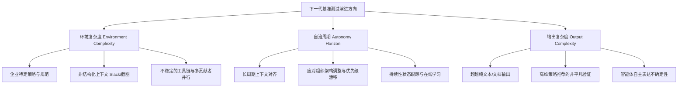

### 评估鸿沟：智能体落地真实场景的终极瓶颈

在当今的 AI 领域，**智能体**（Agents）的快速进化激起了行业内外的巨大兴奋，特别是在自动化代码编写等任务中，模型卡片的指标不断攀升，技术“氛围感”（vibes）也在持续变好。然而，当我们转向企业级或高风险的现实部署环境（如金融、保险、医疗等关乎真实决策后果的场景）时，企业决策者和开发者往往会产生迟疑。这种迟疑并不是因为智能体的潜在能力不足，而是因为我们对智能体在实际应用中的度量和评估能力（Measurement and Evaluation Capabilities）已经严重滞后于其能力本身的发展。

为了消除这种“评估鸿沟”，行业需要一整套完备的工具链。虽然红队测试（Red Teaming）、私有化人工评估和众包标注等手段非常关键，但**开源基准测试**（Open Benchmarks）依然是度量工具箱中不可或缺的基石。优秀的开源基准测试绝不仅仅是对过去进展的历史快照，其更核心的价值在于定义未来的发展方向，为技术能力的演进树立靶心。为了推动这一领域的突破，**Snorkel AI** 近期推出了 300 万美元的“开源基准测试资助计划”，在评估了超过 120 个来自学界和工业界实验室的申请后，我们总结出了一套关于如何构建高效基准测试的底层框架。

Original English Source

Hey everybody. How's it going? Lovely. Well, I'm very excited to be here hailing from San Francisco. It's a little bit of a trek over, but I'm super excited to to uh chat with you all um today after the talk uh and beyond. Uh my name is Vincent. I'm a research fellow and a co-founder at Snorkel AI. And uh you know, today I'm going to be talking about um some meta evaluations for building benchmarks. The art and science of what we found to be really useful when building effective benchmarks. I have the great privilege at Snorkel of working with both our researchers, uh great collaborators in academia, industry, uh and the open source community to build great benchmarks. And I wanted to share some of the learnings that we've had over the, you know, last few years on on what really makes for benchmarks that uh shape the field and and move it forward.

So, a little bit about us. Uh we're a frontier AI data lab. Uh we have, you know, labs both at uh at academic settings. You know, our our co-founders uh have have labs at Stanford, U Dub, Wisconsin. We have an internal team uh for deployed engineers, applied engineers. And uh I mention this because we get a lot of exposure to both, you know, the academic frontier, work with frontier labs, and also real enterprises and and companies who are deploying in practice. So, our focus as a company is on building the best data sets and environments to define and advance future AI capabilities. And we are in a fortunate spot where we get to play at this unique intersection of both, you know, the frontier academically, but also um uh uh to contact reality with our deployments um in enterprises.

So, today I wanted to talk about an asymmetry that we see in our real-world deployments. There's real excitement around agents today. You know, we see it at every person in this room, I'm sure has has played with these these these agents and we see a real progress marked by, you know, hill climbing on model cards. We see the vibes are improving, right? And truly shifting, especially in coding. But when you ask individuals and enterprises or these, you know, large-scale organizations if they're fully ready to let these agents loose and, you know, deploy them in high-stakes environments, you you get a little bit of hesitation. And that's not to say the capabilities aren't there, but our ability to actually measure these agents in practice that is falling behind of where the capabilities actually are. This is one of the challenges and research questions that I think are actually one of the most important in the field and one of the ones that we're very interested in here at Snorkel.

So, closing that gap, that evaluation gap, we believe requires a toolkit, right? As I mentioned earlier, we're strong believers in field deployments, right? So, this is you know, actually deploying engineers, researchers on our teams to again contact reality and and and work with folks to deploy these models in real production settings where the stakes are high, right? These are finance settings, insurance, you know, healthcare settings where it's not just about a number, it's about real outcomes. And we're also big fans of other eval tools, right? This is red teaming, private human evals, crowdsource labeling, a lot of the the themes that we saw talked about today, which which has been awesome to see. But one of the things that we feel most strongly about is that benchmarks, open benchmarks in particular, remain a really critical piece of the measurement toolkit. The best open benchmarks aren't just about, you know, taking a snapshot of progress looking backwards. They're actually about defining progress and shaping the field and setting a goalpost about where capabilities need to go. And, you know, even looking at the last few months, right? Benchmarks like Terminal Bench, uh Meters Long Horizon benchmark, uh RKG I, these are really exciting and critical guideposts for where the field is going and and and as a result, the path to safe, trustworthy agents um will will really depend on more of these benchmarks in practice.

So, what are we doing at Snorkel? One of the things that again I'm I'm very fortunate to to be able to be a part of is uh the Open Benchmarks grants. We recently, a few weeks ago, a month ago, uh deployed $3 million to commit to Open Benchmarks. And this is a really fun job. I get to work with the best academic teams, you know, builders, uh to really accelerate and fund um the next wave of benchmarks that's going to really steer and and and guide where uh the field is going. We've had a wild reception so far. I'm a little admittedly behind on some some reviews. Uh but we've been really excited to see what the community has come up with so far. And in this talk in particular, you know, we've reviewed I think over 120 applications so far spanning academia and industry labs. We wanted to share a few perspectives, a few learnings um over the fast past few months about what we view as one table stakes for for useful benchmarks, right? How do you actually build good empirical measuring sticks that are actually useful, you know, to to measuring progress? And two, what really separates, you know, those benchmarks that are shaping the frontier, right? What what is the art and and the the the science, if you will, of building really efficient effective benchmarks at the end of the day. As I'm doing this, I'll have a fun opportunity, maybe this is a little too American, but to pull a Timothy Chalamet and honor some of the greats, you know, some of the great benchmarks of the last few years that have really shaped the field in talking about some of these axes. And I hope that these, you know, themes resonate with you and also inspire a bit of, you know, kind of new thinking about, hey, how how can we actually deploy some of the learnings we're we're all kind of driving towards in our day-to-day work to, you know, shape the field and and move it forward. So, two themes here again on the science side, you know, how do we actually build effective measuring sticks? We'll talk about task quality, distributional control, robust evals in general. Um and on the on the art side, right, really the the differentiators for great benchmarks, um how do you build benchmarks with a thesis on where the field is going that inspire new road maps, um and that critically are are built for this audience, right, a researcher audience, a builder audience so that adoption is is something that is a way smoother um and and a first-class citizen uh for a bunch of these benchmarks.

### 构建科学度量衡：有效基准测试的四大支柱

要让基准测试成为合格的“科学度量衡”，必须在其工程与统计学设计上遵循严谨的科学原则。我们总结了以下四个核心维度：

*   **单任务质量**（Task Quality）：任务必须能够代表真实世界的复杂度，具有清晰合理的指令以及可验证的答案，且应当经过领域专家的深度校验。
    以经典的研究级基准测试 **GPQA**（Graduate-Level Google-Proof Q&A Benchmark: 包含研究生级别物理、化学、生物等专业问题的基准测试）为例，其精妙之处隐藏在附录中：它引入了一种极其严苛的**对抗性质量控制机制**。每个题目不仅由原作者编写，还需要多位同行专家作为审稿人和仲裁者进行多轮交叉验证与修改，并根据专家达成共识的程度来设计差异化的报酬激励。这种从学术同行评审中汲取灵感的专家协同机制，是确保高质量任务生成的基石。
*   **分布多样性与控制**（Distributional Diversity & Control）：有效的基准测试需要为目标领域定义清晰的分类法（Taxonomy），并在该分类空间内有意识地分布任务。
    这意味着我们不能只抓取普通的流量数据，而必须针对关键的“长尾失效模式”进行针对性采样。以自动驾驶为例，黄灯、突然穿行的行人和摩托车等场景虽然发生频率低，但在生产环境中的重要性却不成比例地高。经典的 **MMLU** 基准测试在几年前就构建了一个极具野心的分类体系，涵盖了科学、技术、工程、数学（STEM）及人文科学等 57 个专业和学术领域，这正是其能长盛不衰并持续作为主流能力评估标准的核心原因。
*   **模型裕度与难度设定**（Model Headroom）：基准测试必须具备足够的未饱和度（Unsaturated），能够拉开不同梯队模型之间的差距，暴露出前沿能力的薄弱点。
    **ARC 评估基准**（Abstraction and Reasoning Corpus: 抽象与推理语料库）在这一维度上表现得淋漓尽致。ARC 旨在测试人类具备而大语言模型极度欠缺的通用泛化与抽象推理能力。在很长一段时间内，即使是前沿模型的 ARC 得分也极低。但当 18-24 个月前行业开始向强化推理（如类 o1 推理模型）方向演进时，模型的 ARC 成绩出现了与实际能力高度吻合的跨越式突破。就在最近，ARC 团队推出了 ARC AGI-3，在发布伊始，前沿模型的得分再次被压低在 1% 以下。这种预留出充足模型裕度的设计，能迫使研究界放弃简单的记忆与拟合，转向攻克真正的泛化难题。
*   **鲁棒评估方法**（Robust Eval Methodologies）：基准测试的评测手段必须超越简单的准确率（Accuracy）维度，多维度捕捉对实际落地至关重要的指标，如成本、延迟、推理链质量及工具调用正确性。
    在评估多轮交互智能体时，**Towel Bench** 提供了极佳的范式。它不仅引入了智能用户模拟器（User Simulator）来评估任务的整体完成度，还极具前瞻性地将“政策约束依从性”（Policy Constraints Adherence）作为硬性指标。例如，如果一个出行预订智能体成功买到了正确的机票，但在过程中违反了公司制定的“机票舱位合规规则”（Fair Class Rules），那么该任务在评估中依然会被直接判定为失败。这种将现实业务规则融入评估函数的设计，极大地提升了基准测试的鲁棒性与实用价值。

Original English Source

So, let's start with the science. Uh this is again what makes for really effective measuring sticks as we've seen them in in practice and in the the deployments that we see uh in industry and academia and with Frontier Labs.

So, the first thing I want to talk about is individual task quality. Right, this is the idea that individual tasks need to be exceptionally, rigorously validated, right? They need to represent real-world complexity. They need uh well-posed, well-structured instructions. Um they need verifiable solutions uh that ideally have been um actually validated by real-world domain experts. Um one of the benchmarks here, GPQA, is one of my favorites, um not just because it's been a very lasting and enduring benchmark that captures, you know, uh graduate-level and professional knowledge uh even to this day, right, you kind of still still see this on model cards. But, one of my favorite contributions is actually tucked away in the appendix. GPQA uh introduced one new adversarial uh quality control mechanism. So, the idea was that not only do these tasks need to be well-posed, um they need to be tractable for other experts to solve. So, they had a very very rigorous multi-reviewer protocol where there was an original author, you know, there were there were there were reviewers and adjudicators in the loop. There was opportunity for revision. Right, these were tasks that were really pushing the frontier of knowledge and it was non-trivial for any single expert to say, "Yeah, this is actually good task or not." And so, developing this sort of rigorous adversarial quality control mechanism was one of the contributions I was most excited about here. And if you read the appendix, you also see that they introduce new incentive mechanisms, right? Payouts are actually based on whether there was certain agreement and, you know, uh uh coming from academia, you know, there's there's uh some inspiration here from the peer review process as as flawed as that is, but, you know, this type of innovation around how you actually get really rigorous, you know, multi-expert quality control um leads to the type of outcomes that we see around individual task quality that um we we see as a a key foundation for any benchmark that matters at the end of the day.

Two is uh distributional diversity, right? This is the idea that for any benchmark that really matters, you want to define a clear taxonomy for the domain, for real-world tasks, and distribute those tasks uh intentionally. So, this might be, "Hey, I I captured a a trace or or a kind of real-world stream of um traffic along um, you know, how my agent is operating in the real world, and I want to really represent that distribution." It could also mean, "Hey, I'm specifically characterizing and taxonomizing the failure modes that are, you know, paradoxically rare, but you know, disproportionately important in in production, right? If you take classic self-driving settings, right? Yellow lights or, you know, pedestrians or uh motorcyclists, right? Might actually show up way less than other other types of scenarios but are disproportionately important, you know, to get right in these settings. And so, defining that taxonomy, being really intentional about distributing tasks across it is one of the home hallmarks of uh great benchmarks in our view. Um MMLU, um few years old now, uh constructed a a quite ambitious taxonomy of, you know, 57 academic and and professional domains across STEM, humanities, et cetera. It's remained one of the lasting benchmarks for understanding graduate and professional level knowledge and again a lot of this was as as we we believe a result of really thoughtful and intentional taxonomy designed and and building towards that.

The third axis here is around difficulty of individual tasks and model headroom. Right, it's really important that the benchmark is unsaturated that it exposes real soft spots in capabilities and reliably separates where models sit at at the frontier. One of my favorite plots is is the one on the top right. This was you know all all credit to the ARC Prize Foundation team. ARC AGI-2 you know for a very long time was unsaturated right for for several months and years. And when there was the big reasoning push you know maybe 18-24 months ago we saw a massive leap in capabilities that actually corresponded to a real leap in model capabilities. Right, this was a benchmark that was intentionally designed to represent a type of efficiency or capability that humans have but models didn't have and and they really kind of captured well hey there's a lot of model headroom here. Humans can do this. Where's that gap? And again low and behold it correlated quite well with the recent you know 01 style reasoning push that has really dominated the field in the in the past 18-24 months. Just a few weeks ago the ARC team just launched AGI ARC AGI-3 and again at launch they had frontier models under 1%. Every single task was a human solvable to some degree and so it remains one of the I think the the the most meaningfully exciting benchmarks in the space where you know any new model you know people are kind of awaiting hey how does it do do on ARC? And and I think they did this quite well. Right, the the kind of model headroom here is is really really exciting.

This last axis here I want to talk about on on the empirical measurement side is all about a robust eval methodologies. Now this goes really deep. So just kind of capturing some of the high-level ideas, benchmarks need to ideally go beyond accuracy to capture real-world dimensions that matter, right? This is everything from cost, latency, you know, the quality of the reasoning traces, uh uh some of the intermediate steps and and tool use. Whatever dimensions actually matter for the capability at hand, uh capturing those as reward or supervision signals is really critical and measuring what it what it claims to um is is actually a non-trivial uh feat uh in uh you know, building robust and and reproducible benchmarks. So Towel Bench is a benchmark that we're we're a big fan of, you know, it's had multiple evolutions over the year, but over the years, but it would it was a benchmark that was built to evaluate both task completion of these multi-turn agents. They built a a clever, you know, kind of user simulator, um but also, you know, not just accuracy and completion, but adherence to policy constraints. So a model, for example, on the right-hand side, this was the one of the examples from the paper, a model that books the right flight, but violates fair class rules still fails, is still a kind of um no-go at the end of the day. So um this notion of hey, being intentional about what axes we actually care about, uh what do we actually want to measure and measuring that rigorously, uh is one of the hallmarks that uh matters when you're when you're building um these these frontier evals.

### 引领行业前沿：优秀基准测试的艺术与设计

除了上述科学层面的硬性指标，那些真正能改变行业版图、引领工业界攻关方向的基准测试，其背后还包含着深刻的“艺术眼光”。这种艺术主要体现在以下三个层面：

*   **秉持明确的理论假设**（Thesis-Driven Design）：顶级的基准测试从来不是随机堆砌任务，而是对 AI 发展方向的“深度押注”。
    以著名的 **Terminal Bench** 为例，它在极早期就做出了一个关键且深远的预测：**命令行界面**（CLI: Command Line Interface）不仅是编程智能体的核心，更是通用计算机使用（General Computer Use）的核心抽象与交互手段。这一预判在今天得到了印证——无论是 Anthropic 的 Computer Use 还是各类企业级自动化智能体，都在大量依赖 CLI 接口。Terminal Bench 也因这一精准的前瞻性押注，成为了各大主流模型卡片（Model Cards）中权重极高的核心评测指标。
*   **启发全新技术路线图**（Inspiring New Roadmaps）：优秀的基准测试不仅指明问题，更能作为催化剂，激发全新的算法设计和研究分支。
    在这个维度上，**SWE-bench**（Software Engineering Benchmark: 评估大模型解决真实 GitHub Issue 能力的基准测试）是一个极其杰出的范例。它的逻辑极其纯粹：利用真实的开源项目拉取请求（PRs）来测试模型的代码修复能力。正是这种简单而直击痛点的设计，催生了一整套围绕 SWE-bench 展开的智能体工作流优化体系，并演化出了 SWE-bench Lite、Verified、Pro 以及多语言、多模态等庞大的测试家族，彻底重塑了软件工程智能体（Coding Agents）的研发路径。
*   **极致的开发者体验**（Researcher UX）：基准测试的本质也是一种“产品”，其核心用户是广大的 AI 研究员和开发者。
    如果运行测试极度繁琐、环境极难搭建、无法方便地贡献新任务，或者测试信号无法直接用于后续的强化学习（RL）微调，那么该测试就很难被社区广泛接纳。斯坦福大学 CRFM 团队多年前推出的 **HELM**（Holistic Evaluation of Language Models）框架，正是凭借其模块化、标准化的统一评测线圈设计，确立了评测框架的基础规范。而 Terminal Bench 2.0 近期配套推出的评测基础设施 **Harbor**，也迅速成为了全球智能体开发者在容器化、沙箱化评估时的首选工具。

Original English Source

So I want to shift a little bit now to the differentiators, right? What actually leads to the benchmarks that push the frontier. That's not to say, you know, anything I mentioned on the last few slides have not pushed the frontier. These are just special characteristics that I view as you know, critical to to the benchmarks that are real research contributions that are really shaping where is the field going, where are all the labs going to hill climb next? Um and uh this is this is the art, the special sauce that um helps push us forward.

So one of the key hallmarks here is um these benchmarks should have a thesis, right? They should have a research question about a subspace of capabilities, about where the field is going. It should revisit previous capabilities. Um and the most ambitious benchmarks are really a statement about where the world is going. Terminal bench um is one of these bets, right? It was a bet on the CLI, not just for coding agents, but for general purpose computer use. And in many ways, I think this has turned out to be a largely correct and and consequential bet, right? As as we're seeing uh teams at at kind of Claude and and and and Codex build their general purpose, you know, enterprise capabilities on top of these um coding and CLI-based tools, we're seeing this bet pan out. And again, Terminal bench remains one of the most robust and kind of uh most important benchmarks that are measured on on all the recent uh model cards. So, again, this was a bet early on to say, "Hey, we think the CLI is going to be really important um as a core interface, a core abstraction and affordance for agents to interact with the real world in general purpose way. And uh by measuring those capabilities, you know, I I'd argue that it actually um helped accelerate uh you know, how how the field is operating in this way.

The second piece here, I think, worth uh mentioning is uh the ability to kind of roadmap for the field. Um a a great benchmark, you know, one that really shapes where where all of us are going is producing new roadmaps, right? It's inspiring new attacks against research problems. It's helping folks ideate and come up with new ways for thinking about uh benchmarks and methods in general. And I think Sweet bench is uh really phenomenal example of this, right? It was a simple ideas, often the best ones are quite simple, right? How do you um kind of leverage um you know, existing uh coding coding type capabilities via via PRs. Uh and it's spawned a new family of benchmarks, right? All the way from Sweet bench light, verified, pro, multilingual, multimodal, etc. And its evolution, I think, is is still very relevant today. It's evolved how we think about coding agents, and one of the things that's been awesome to see with uh the SWE-Bench team is how many um new research directions and kind of inspired benchmarks have come after it um in this coding space. And arguably, I'd say, you know, there's a lot more room um to kind of innovate on top of this as well. What are the new ways of um coding look like? How do these types of workflows apply to 5 coding and kind of this new layer of abstraction that that that's offered developers are are applying? Um I think it's been really exciting to see the the foundation that the SWE-Bench team sets and how that's going to um shape, you know, how we think about coding agents moving forward.

So, this team here, I think, is severely underrated, and this is the notion of researcher UX. Right? I think the most prescient benchmark builders are committed to the researcher and builder experience. This is to say, it's really simple to run models and agents against uh your benchmark. It's really simple to contribute new tasks, to extend. And also, it's it's really simple to leverage some of the the signals that you're getting for the benchmark for RL or or kind of tuning um post talk. I think this is really underrated. Uh it's, you know, a classic product principle to make what you're building and putting out there easy to use by the community or by your core users. And in this case, benchmarks have core users, which are other builders or researchers. And so, really putting in time and attention to building those interfaces has been important for the adoption of some of the most important benchmarks. Right? To call out, I think the the Stanford team um at CRFM uh built HELM, you know, several years ago, which I I would argue kind of pioneered a standardized modular harness for evaluating reproducible, you know, different scenarios, as well as kind of models against a standard test bed of models. Um Terminal Bench 2.0, just a few months ago, again, shipped with Harbor, which has been, in many ways, the de facto uh harness and and kind of evaluation infrastructure for teams who are building agents um more broadly. And so, you know, thankfully we have a bunch of open source software out there today, you know, based on this principle. But as you're building your benchmarks, right, kind of considering, "Hey, how easy is this to extend? How easy is it for the community to adopt and eventually kind of hill climb against this?" I think is a severely underrated factor for for what makes for really high adoption of of these frontier benchmarks.

So, this is the full framework. Again, can go into more detail and and please find me afterwards. But again, what makes for really empirically meaningful uh measuring sticks, right, it's task quality and attention to distributional control and diversity, uh it's it's difficulty and model headroom, and of course a robust eval methodology that measures the concrete axes that actually matter and it matter in practice and is intentional about it. And of course, on the off side, right, these these great benchmarks really have a thesis on where the frontier's going. Uh they set road maps for the field and they really prioritize researcher UX.

### 前瞻：下一代基准测试的演进维度

基于在 Snorkel AI 的前沿观察，我们认为下一代颠覆性的智能体基准测试将在以下三个关键维度上展开演进，以逼近甚至定义智能体的未来能力：

1.  **环境复杂度**（Environment Complexity）：目前的评估多在隔离、静态的沙箱中进行。未来，基准测试必须引入极具现实色彩的环境噪声，包括企业特定的安全与架构策略、散落于 Slack 等即时通讯工具和屏幕截图中的跨模态非结构化上下文、不稳定（Flaky）的下游 API 调用链，以及多智能体或人类在同一工作流中的并发修改与协作冲突。
2.  **自治周期**（Autonomy Horizon）：度量智能体在长周期任务中的可靠性。目前大多数智能体在执行超过十个步骤后，其成功率和状态维持能力就会呈指数级恶化。未来的评测将要求智能体具备跨越数周乃至数月的长周期操作能力，能够应对中途发生的组织架构重组（Reorg）、业务指标调整、依赖库静默更新等现实状态变化，而不会丢失原始任务的上下文。
3.  **输出复杂度**（Output Complexity）：评估非确定性、高维的智能体产出。未来的智能体不仅仅输出几行文本或执行简单的 API 调用，而是要交付包含商业决策、系统架构设计或复杂代码重构在内的“高维组合制品”。这类制品往往没有唯一的标准答案。基准测试必须能够捕捉高度主观的人类判断逻辑，并客观度量智能体在面对未知指令时的“不确定性感知”（Uncertainty Awareness）——即智能体是否能够在能力边界之外及时停下并向人类寻求协作。

Original English Source

Now, before I wrap up, um I want to propose, you know, a few dimensions that uh we're really excited about at Snorkel uh that we think are really going to encapsulate, you know, the the next wave of of benchmarks. Um tried to leave some more degrees of freedom here for creativity, but these are areas where we think there's a lot of room to push complexity, to push, you know, realism in benchmarks. And so, I wanted to share a little bit of our internal road map and thinking around where the field is going and where we need more benchmarks and more contributions.

So, this is our point of view. Um we think that uh the the axes for the next great benchmarks are threefold. Um and I'll go into a little bit more detail about what I mean here um in just a second. But one, it's environment complexity, right? how complex, how realistic, how dynamic is the operating environment that these benchmarks are working. Are they representative of real-world settings that a professional, that, you know, scientist, that someone using these tools could actually use? Two is autonomy horizon. Do these benchmarks represent realistic and frontier horizon lengths that these agents are operating against? Are they capturing different points on the autonomy slider that are again representative of how users are using them as co-pilots versus fully autonomous agents? Is this an intentional design in the benchmark? And three, capturing the wide range of output complexity. I think this is very under explored today. Right? Lots of chat-based or document-based outputs. Um not as much around nuanced uh kind of differentiated reward signals, right? Real artifacts that show up, um you know, in day-to-day work that we that we represent. And critically, um new artifacts, right? New types of form factors that we haven't even imagined about, you know, how agents interact with humans, how agents interact with each other.

So, a little bit about each one. Um the first one here, I won't go into all of these in in significant detail, right? Environment complexity is all about capturing the real-world complexity that that is uh in our in our day-to-day working environments, right? And this this gap is often where agents fail today. Consider coding agents, right? A real codebase has org-specific policies, you know, lots of Slack context, uh screenshots, flaky tool chains, you know, CI that's that's kind of distributed, um human reviewers with knowledge in their heads about what they like and what they prefer, um many contributors in parallel. Benchmarks today capture a fraction of this complexity and you know, not just in coding but other domains, there's a lot of excitement and an opportunity to up the level of complexity and continue to drive what these models um can do to to represent real-world uses.

Two, again on autonomy horizon, right? Uh this is all about how long an agent can operate before it reliably before reliability breaks down. Right? Let's take a customer experience agent, um you know, in in many cases, right? Uh these these agents may lose track, you know, of of context that was, you know, delivered a few weeks ago, different integrations or product specs might, um, you know, change uh the actual spec or requirements for for a particular model. Reorgs can kind of shift, you know, priorities midstream. Um, real-world settings actually represent a lot more complexity that again is represented in these kind of long-term continual learning type type settings that represent kind of changes in state and environment. Um, so we again think that there's a lot of room to contribute and and build out new benchmarks that represent very very long horizon and autonomous agents.

And lastly, this axis is all about producing more complex work, more representative work, and also nuanced signals that can be used for not just evaluation, but reward signals during training. This also has to be complex and this gap is is growing as well, right? Let's take again a software example, right? Or or a complex report for making strategic recommendations. It's non-trivial and subjective, you know, to define, "Hey, what is verifiable about a good recommendation, a good strategic proposal, a good roadmap in general?" Um, the nuances of this need to be captured well. They need to capture organizational context, really good human judgment. Um, and tomorrow's benchmarks really, you know, we're we're excited about um signals that capture all of these settings. Trustworthy outputs, right? The ability for agents to actually capture their own uncertainty and uh define, "Hey, I'm actually not sure about this. I actually need to stop or kind of ask for more information." Again, different types of outputs that aren't just, you know, a a kind of plain text answer is something we're really excited about.

So again, uh hopefully, you know, this inspired a little bit of thinking around, "Hey, what am I working on? How can I turn this into a meaningful benchmark?" Um, we are still accepting, you know, benchmarks uh in in the open benchmarks grant. So if you're excited, uh please reach us at benchmarks.snorkel.ai. Feel free to reach me directly and uh we're really excited to see uh where the field is going and to again to use benchmarks to not just measure, you know, progress looking backwards, but really shape where where things are going moving forward. Thanks for your time and excited to catch up soon.

