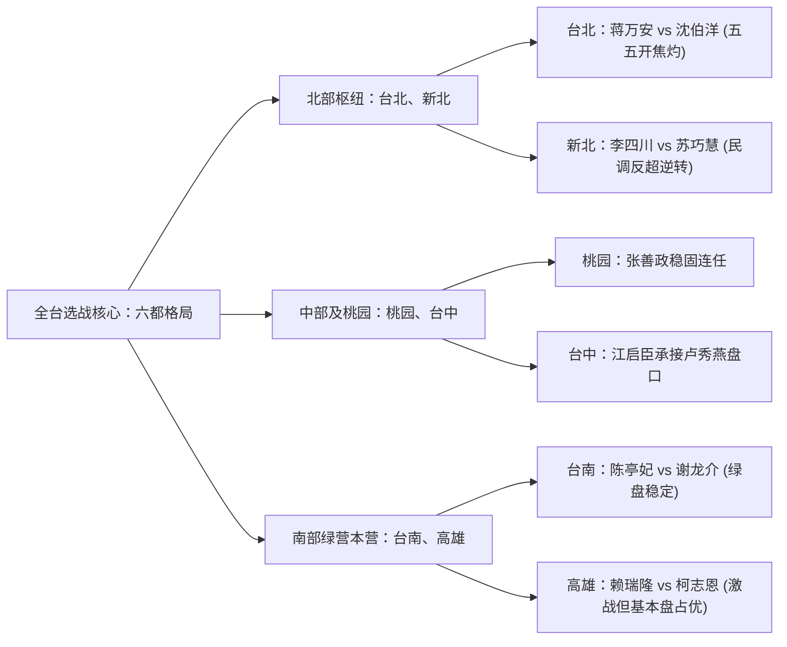
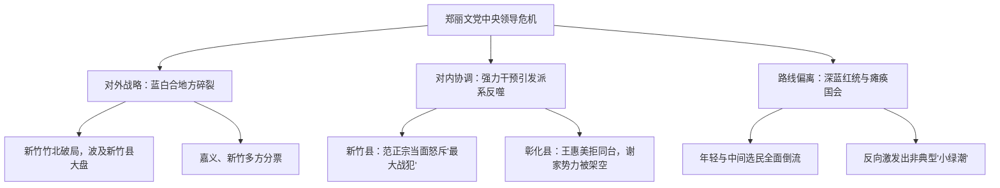

### 中期选举定位：地方治理逻辑与后郑丽文体制的中期大考

所谓美国的中期选举，主要指的是国会层面的两院选举。但台湾的政治体制比较特殊：台湾的国会选举——也就是立法院立法委员选举，通常是和总统大选合并举行的；而台湾语境下的“中期选举”，本质上指代的是四年一度的**地方公职人员选举**（九合一选举）。按常理而言，地方层级的选举在国际或两岸观察视野中往往不会受到过分聚焦的关注，因为地方选举在体制设计上并不直接决定国政方针。诸如大家普遍高度关注的两岸政策、对外邦交、国防军备、宏观经济等重大议题，其主导权均在中央政府，地方行政首长与民意代表更聚焦于具体琐碎的地方民生、基础设施建设、交通治水以及社区福利。对于不生活在台北、新北或台湾任何一个特定县市的外部观察者来说，县市层级的里邻琐事原本没有那么高的切身关联度。

然而，2026年的这场地方九合一选举却展现出异乎寻常的特殊性。最核心的政治看点，在于这场选举构成了**郑丽文**（国民党现任党主席）领导体制的一次生死攸关的“中期大考”。在此前赴台实地考察交流期间，台湾政界内部——尤其是中国国民党内部秉持传统“正蓝军”理念的“中华民国派”政治力量，实际上早已在私下严阵以待，准备在此次选举后对郑丽文及其领导班子进行政治清算与路线清洗。

这种党内清洗诉求之所以必须依托于一场惨烈的地方选战大败，源于中国国民党自身独特的组织章程与权力结构。国民党的党章中并没有关于弹劾党主席或设定特定门槛迫使党主席自动引咎辞职的刚性程序。这一点与民主进步党形成了极其鲜明的对比：在民进党的政治惯例与权力问责机制下，若中期地方选举遭遇重大挫败，党主席必须在第一时间引咎辞职（例如赖清德作为党主席，一旦遭遇地方大败就必须卸任党职，而失去党机器掌控权的现任总统，在下一届党内总统初选中必将面临各派系强有力的公开挑战）。但国民党缺乏这种自动化去职机制，党内反郑势力若想让郑丽文体面或不体面地下台，唯一的制度性契机就是国民党在本次九合一地方选举中遭遇全面大溃败。只有地方执政版图遭遇崩塌式缩水，党内的执政焦虑与生存危机被彻底激发，才能凝聚出冲垮既有体制的政治动能。因此，这场选举绝不仅仅关乎郑丽文个人的去留，它更是一场深层牵动国民党未来生存发展路线、重塑全岛政治版图的宿命之战。

---

### 历史镜像与常态：国民党的地方盘口与罕见的“绿潮”年份

在探讨今年可能出现的政治变局前，必须首先厘清台湾地方政治的基本盘面结构。国民党在台湾地方自治选举中，长期以来坐拥无可比拟的组织网络与历史优势。自1990年代台湾民主化以来的漫长历程中，在二十多个县市的宏观角逐下，民进党真正能够在全岛地方选举中实现席次领先的，历史上仅仅出现过两次。

这两次极其罕见的“绿潮”领先年份，分别发生在**1997年**与**2014年**。熟悉台湾当代政治史的人都会意识到，这两个年份的背后都矗立着撼动全岛政治结构的历史性重大事件：
1. **1997年县市长选举**：背景是刚刚经历过震撼全岛的**1996年台海导弹危机**。那是台湾民众在直选总统前夕经历的最大外部安全冲击，深刻重塑了岛内的国家认同与地缘危机意识。在此背景下，民进党在当年的23个县市中一举攻下了12个席位，首次在地方执政版图上实现了历史性过半与包围中央的态势。
2. **2014年九合一选举**：背景是爆发了被称为台湾民主再造转折点的**太阳花学运**。这场社会运动由反对海峡两岸服务贸易协议（ECFA框架下的后续深化）引爆，演变为对两岸经济深度一体化进程的强力阻击。强烈的社会动能与年轻世代的政治觉醒在年底全面倾泻于选票之中，民进党在全台22个县市中斩获了惊人的13席。

除却这两次因外部地缘震荡与内部巨型社会运动所催生的“偶然年份”之外，国民党在常态化的地方选举中，几乎稳如磐石般地维持在拿下14席左右的绝对优势格局。这种地方盘口的坚固性有着深厚的历史与体制成因：国民党长期深耕基层社会网络，传统的地方**农会**、**渔会**、**农田水利会**以及盘根错节的宗亲、派系势力，与国民党系统形成了深度的利益与组织共生。正因如此，国民党在地方选举层面长期具备一种近乎免于崩盘的安全垫，即便是处于中央执政相对动荡或民怨积聚的马英九时期，除了2014年遭遇全面溃败之外，其余地方选战基本都能稳健收割。

反观民进党，其在最近两届地方选举中均遭遇了灾难性的惨败：
* **2018年九合一选举**：在蔡英文推行军公教年金改革引发基层强烈反弹、全岛绑核能与保守议题公投的复杂局面下，民进党在全台22个县市中兵败如山倒，最终仅仅保住了6个县市。选举当夜蔡英文辞去党主席，随后引发了赖清德在党内初选发起挑战的激烈政治内斗，直至2020年总统大选在外部变局中胜出才稳定大局。
* **2022年九合一选举**：民进党地方执政版图进一步萎缩，全台仅攻下5个县市，创下创党以来的地方选举历史新低。

从现实政治周期来看，民进党在中央政权层面已经连续执政三届（蔡英文两任八年加上赖清德一任），累计执政时间已达十二年之久。对于许多年轻世代选民而言，他们自记事以来的政治记忆便是在民进党主导的语境下成长的，国民党执政反而成为了历史中短暂的马英九片段。执政时间过长必然伴随着巨大的治理包袱、派系利益固化与民意疲劳。照常理推演，在中央长期执政疲态尽显、国民党地方基本盘与动员机制极其稳固的背景下，2026年本应是国民党顺风顺水、民进党防御收缩的常规选战周期。

然而，极其吊诡的是，2026年的政治风向却展现出再次演变为“历史性偶然年份”的异动迹象。目前全台22个县市的动态博弈中，民进党展现出大概率拿下**7个县市**的攻势底盘（包括南部的台南市、屏东县，以及有望实现突破或稳固的嘉义县、嘉义市、彰化县、宜兰县、新竹县等）；若进一步在**新北市**和**基隆市**撕开防线，民进党斩获席位将攀升至9席；若南部的**高雄市**成功守住，席次将达到10席；假若民进党在**台北市**实现历史性斩获，席位甚至可能飙升至不可思议的11席。对于一支长期执政疲态尽显的政党而言，在缺乏类似台海导弹危机或太阳花运动这类天崩地裂级别政治事件的承平日局中，席次由上届的5席强力回升至9席乃至11席，无异于一场历史级的地壳变动。究竟是何种深层动力使得国民党的地方防御体系出现巨大裂隙？

---

### 九合一选举制度解析：层级拆解与公投议题的动员机制

为了准确把握2026年选战的宏观脉络，有必要对台湾**九合一选举**的运作架构与制度细节进行系统解构。

所谓“九合一选举”，是在特定投票日（通常设定在选举年11月下旬的周六，投票时间为上午8点至下午4点）将全岛地方自治层面的九种民选公职人员合并在同一天进行票选。这项制度设计绝非意味着每位选民手中都会拿到九张选票，而是根据选民所在的行政区划层级实行差异化的票选机制：
* **直辖市（六都）市民**：直辖市在行政体制上直接由中央统辖，行政层级相对扁平，跳过了传统的乡、镇、县辖市层级。因此，普通六都市民在地方选举中通常只需领取**3张选票**，分别投给：**直辖市长**、**直辖市议员**以及最基层的**里长**（若处于直辖市山地原住民区，则需额外增加区长与区民代表两张选票）。
* **一般县与省辖市民**：在非直辖市的县市体系中，选民需要履行更加完整的层级投票义务，通常需领取**5张选票**，分别投给：**县市长**、**县市议员**、**乡镇市长**、**乡镇市民代表**以及基层的**村里长**。

在选举规则层面，行政首长与民意代表采用了截然不同的制度逻辑：
* **行政首长（县市长、乡镇市长）**：采用**单选区相对多数决制**。每个行政区仅产生一名首长，候选人之间不需要设立第二轮决选。在多方角逐（例如“三脚督”甚至七人混战）的情形下，候选人即便仅获得百分之三十几或四十出头的选票，只要名列第一即可胜选出线。这种制度极大地放大了多方竞争中的分票效应。
* **民意代表（县市议员、代表）**：采用**多议席单记非让渡投票制**（SNTV）。一个选区内往往包含多个议席名额（例如某选区产生5名议员，可能有9人参选），但每位选民只能勾选一人。最终依据所有候选人的得票总数由高至低依序排定座次，排名前列者当选。这种制度考验的是政党在特定选区内的精准配票能力与基层派系固桩能力。

除了繁杂的公职人员选票之外，台湾地方大选还常常伴随着全岛性的**公民投票**（公投绑大选）。2026年选战中最核心的公投议题，便是围绕能源转型展开的**废除非核家园政策公投**（即“你是否支持政府使用核电振兴经济，以废除非核家园的能源政策”）。依照公投法规范，公投案若要生效，不仅同意票数必须多于不同意票数，且有效同意票总数必须达到全台有投票权选民总数的四分之一以上。赖清德就任总统后，其在能源务实维稳层面的立场与早期民间激进反核的社会运动力量已存在微妙温差，该公投案在全岛民生用电焦虑的烘托下展现出极高的通过概率。公投议题的存在绝非仅仅是一项政策表决，它更是一把强大的“政治动员杠杆”，能够直接影响特定阶层与政治光谱选民的出门投票意愿。

---

### 六都战略纵深与选情实态：指标城市的历史脉络与胜负指针

尽管全台共有22个县市展开角逐，但全岛政治资源的绝对重心依然锚定在六个直辖市——即所谓的**六都**（台北市、新北市、桃园市、台中市、台南市、高雄市）。六都不仅集聚了全台近七成的人口与经济体量，更是历任政治明星登顶国家大位的战略跳板。在现行格局下，国民党掌握其中四都（台北、新北、桃园、台中），民进党仅保住南部的两都（台南、高雄）。以下对六都的具体选情与历史脉络展开全面剖析：

#### 1. 台北市：战略轴心上的高风险防御

台北市作为全岛政治核心，向来具备鲜明的外省族群记忆与结构性偏蓝的选民底色。在过往的历史中，民进党若与国民党在台北市展开“一对一”的单挑对决，民进党从未取得过胜利。民进党历史上唯一一次入主台北市政府，是1994年陈水扁在国民党与新党（赵少康）分裂形成的“三脚督”乱局中，依靠泛蓝票源严重分流而渔翁得利；此后在2014年打破蓝营垄断的柯文哲，亦是依托于民进党全盘礼让、绿营选票全数灌注的特殊历史妥协产物。

2026年台北市长选举虽有六人登记参选，但在民众党因柯文哲案元气大伤且在此次台北选战中未推派候选人（贯彻特定蓝白默契）的背景下，选战本质上回归为国民党现任市长**蒋万安**对决民进党征召候选人**沈伯洋**的一对一死斗。

蒋万安拥有蒋家历史光环与现任行政首长的执政红利，此前各界普遍认为蒋万安选情极其稳固，甚至被国民党基层视作“躺着选也能赢”。然而民进党征召沈伯洋出战的过程却充满了戏剧性的转折：沈伯洋在绿营最初的人选中仅属于第三顺位，民进党高层最初意图征召在对美台贸易谈判（涵盖对等关税与301条款磋商）中建立卓越声誉的行政院副院长**郑丽君**，遭其婉拒；随后转向基层民调极高、深具草根沟通魅力的资深台北市民意代表**王世坚**，亦未成局；最终，长期主持民间防卫组织“黑熊学院”与台湾民主实验室（Doublethink Lab）的现任不分区立委沈伯洋被推上前线。

沈伯洋在台湾社会的中立选民光谱中曾长期背负“意识形态过强”、“激进抗中保台”的刻板印象，国民党阵营最初轻蔑地将其视作民进党在首都在野无人可用的妥协之举。然而，近期由被全岛公认为专业、中立的民调专家戴立安所主持的权威调查却爆出惊人数据：蒋万安支持度为41.7%，而沈伯洋的支持度已强力攀升至40.5%，双方差距急剧收窄至1.2个百分点，彻底滑入统计学误差范围之内。首都选战从一场强弱分明的卫冕战骤变成为悬念丛生的“五五开”肉搏战。作为从未在特定单一选区经历过选民洗礼的不分区立委，沈伯洋能够将蒋万安逼入焦灼泥潭，折射出首都市民对当前蓝营中央立院对抗路线的深层审美疲劳。

#### 2. 新北市：蓝营最坚固堡垒的松动危机

新北市是全台人口第一大市，也是社会学意义上的“小台湾”——汇聚了大量中南部北上打拼的移民、原住民、多元眷村社群，其人口结构几乎是全岛社会的等比例缩影。值得高度关注的是，在2014年席卷全台的太阳花绿色狂潮中，新北市是六都之中**唯一被国民党成功守住的堡垒**（当年朱立伦以极微弱优势击退游锡堃）。随后，朱立伦与侯友宜接续在新北缔造了连续四届执政的记录，侯友宜在2022年更是以高达62%的得票率碾压了民进党重量级选手林佳龙（仅获37%选票）。

然而，这一拥有深厚偏蓝传统的超级票仓，在2026年却面临历史性易帜的巨大危机。本届选战由国民党推派的台北市前副市长**李四川**对决民进党资深立委**苏巧慧**：
* 李四川属于典型的工务行政官僚出身，虽具备扎实的工程施政履历，但在面对大众选民的政治穿透力、舆论造势以及多元族群的情绪共鸣能力上显得较为呆板生涩。
* 苏巧慧则拥有新北市第五选区三届扎实民意代表的在地深耕经验，其父亲苏贞昌更曾在此长期执政，积累了极为庞大的基层政绩与地方人脉。苏巧慧展现出极高段位的政治沟通灵活性——既能在传统菜市场中以极具亲和力的“邻家女儿”形象与基层的阿公阿妈深入对话，又能在年轻选民与科技社群面前展现康奈尔大学法学硕士的知识精英风范。

选情走势清晰印证了这一能力鸿沟：苏巧慧在参选初期曾落后李四川近10个百分点，但随后民调发生翻天覆地的变化。根据9月23日山水民意调查显示，苏巧慧以38.2%的支持度反超李四川的37.1%；而在年代民调中，苏巧慧更是以37.8%领先李四川的32.2%达5.6个百分点。民调的历史性逆转意味着国民党执政长达二十年的新北根基已出现致命动摇。

#### 3. 桃园市与台中市：国民党的中部维稳盘

相较于双北的惊涛骇浪，国民党在桃园与台中的基本盘面则显得相对稳健：
* **桃园市**：2014年升格为直辖市后，曾由民进党新星郑文灿连续两届执政。然而，随着郑文灿身陷土地开发受贿司法丑闻（检方依贪污治罪条例求刑12年，司法案件处于一审关键期），导致民进党在桃园的地方政治声誉遭遇重创。国民党现任市长**张善政**在此次连任选战中面对民进党前法务部政务次长黄世杰的挑战，民调持续保持20个百分点以上的巨大领先优势，国民党在此役中几无悬念。
* **台中市**：作为传统工业重镇与机械制造核心，台中选民展现出强烈的实用主义特征。国民党籍现任市长**卢秀燕**凭借温和细腻、聚焦民生空气治理的施政风格，连续两届以56%与59%的高得票率创下极高的市民满意度。此次国民党由立法院副院长、前党主席**江启臣**披挂上阵，迎战民进党第七选区立委何欣纯。江启臣在国民党内部属于极为鲜明的“正蓝军”与务实派人物，其政治底色温和偏中立，在两岸论述上维持坚定的亲美与中华民国主体立场（当年其当选党主席时，是国民党历任主席中唯一未收到北京贺电的领袖），这种特质使江启臣在台中能够广泛吸纳大量中间选民与经济选民。即便在偏绿智库的调查中，江启臣依然稳健领先何欣纯约8个百分点，国民党守住中台湾大局几成定局。

#### 4. 台南市与高雄市：绿营南台湾腹地的防御与挑战

作为民进党最核心的政治发源地与民主圣地，南台湾的两座直辖市同样暗流涌动：
* **台南市**：在赖清德时代曾创下近73%的历史最高得票率纪录，尽管现任市长黄伟哲在过往选战中曾因多方分票而陷入险境，但本次民进党提名的资深立委**陈亭妃**在在地组织动员与选民服务上经营极深。国民党再度派出立委**谢龙介**展开二度挑战，虽然谢龙介具极高的话题造势与闽南语问政功底，但面对陈亭妃深厚的基层堡垒，翻盘空间依然极其有限。
* **高雄市**：在历史上曾经历过陈菊时代68%得票率的绿色巅峰，但也经历过韩国瑜“韩流”掀起的政治狂飙与随后补选陈其迈的回潮。高雄由于拥有庞大的钢铁、石化、海运及重工业基础设施，外来劳工与移民社群密集，选民结构相对复杂。国民党派出曾拿下40%选票的智库执行长**柯志恩**卷土重来，与民进党立委**赖瑞隆**展开正面对决。柯志恩在此役中展现出一定的缠斗能力，使高雄成为南部唯一保留微弱政治悬念的战场，但民进党在组织动员与整体社会氛围上依然占据上风。

---

### 选票背后的系统变量：投票率悖论与公投政治动员

理解台湾九合一选举的成败逻辑，不能沿用欧美政治的刻板经验。许多人依据美国中期选举的规律，误认为在野的保守力量投票意愿低、而主打意识形态与进步价值的执政力量投票率高；在台湾，事实恰恰相反。

在常态化的地方选举中，**国民党的整体投票率往往显著高于民进党**。这一现象的底层逻辑在于社会基层组织形态的差异：国民党在基层社会建立的是高度组织化的票源网络，依托各地的**宫庙管理系统**、**里邻长互助会**、退伍军人组织（如黄复兴系统）以及盘根错节的宗亲网络，国民党拥有惊人的“组织票”催化能力。即便选举大盘气氛极其平淡冷清，国民党的组织基本盘依然能够按部就班地被动员至投票所。

相反，民进党在地方选战中极度依赖“空气票”——即年轻选民、中产阶层与浅绿中立族群的情绪共鸣与自主投票。因此，台湾地方政治中存在着一条铁律：
> **选举越冷，投票率越低，对国民党与现任执政者越有利；选情越热，投票率越高，民进党才有在蓝营深耕区域实现逆袭反超的可能。**

这一历史规律在2014年得到了最为直观的验证：2014年全岛地方选举的投票率创下了历史峰值，大量被太阳花学运激发的年轻世代跨区返乡投票，直接冲垮了国民党坚固的基层组织防线。因此，2026年民进党若想在台北市与新北市实现翻盘，核心诉求就是必须将选举盘面全面加热，通过社会议题的激烈碰撞唤醒年轻族群与中间选民的危机感。

除了选民自发的政治意愿外，政党最常用的加热工具莫过于**公投绑大选**。2018年九合一选举正是公投动员的极致范本：国民党与保守派社会团体一口气绑架了高达10项全岛公投（包括卢秀燕领衔的反空污燃煤公投、下一代幸福联盟推动的反同婚民法专法公投、反福岛食品进口公投以及以核养绿公投）。十项公投的全面过关，成功将海量对蔡英文执政政策不满的选民全面拉入投票所，最终酿成了民进党的地方雪崩。而在2026年，围绕废除非核家园的能源公投再次登场，国民党本想借此复刻当年的动员奇迹，但此次执政党在能源议题上的柔性脱敏策略，使得公投的杀伤力受到大幅对冲。

---

### 在野阵营内耗与提名灾难：蓝白合作破局与郑丽文的领导危机

如果说外部政治议题的变化仅是外因，那么**国民党自身的路线偏离与郑丽文党中央的组织溃败**，则是引发此番蓝营地方危机最致命的内因。

#### 1. 蓝白合的表面黏合与地方碎裂

自2024年立法院新格局形成以来，国民党总召**傅崐萁**与民众党总召**黄国昌**在国会内部展开了极其紧密的法案联手。然而，国会内部的呼风唤雨并未能顺利平移至地方利益的划分之中。在2026年地方公职人员提名过程中，蓝白双方原本试图通过民调协商机制，在重点区域推行排他性合作：在新北市，经过前期民调比拼，黄国昌因数据明显落后李四川而被迫放弃新北市长争夺；但在其他关键县市，双方的权力分肥却遭遇了惨烈破局。

最为典型的崩盘发生在科技新贵与青年密集的**新竹地区**：
* 在新竹县核心人口聚集区**竹北市**（新竹县第一大票仓），国民党与民众党在市长提名上彻底谈崩，最终双方各自推派人选登记参选。
* 竹北市的蓝白同室操戈，直接形成了自相残杀的“三脚督”甚至四方混战格局，不仅将竹北市长拱手让给民进党，更严重击穿了国民党在新竹县长选战中的盘口。民进党提名的郑朝芳（具备调香师、艺术背景的新生代政治人物，其家族在新竹深具跨党派政商实力）民调直接从最初的大幅落后逆转为领先国民党提名的**徐欣莹**。

#### 2. 党内提名的专断与派系反目

更深层的危机来自国民党内部各地方实力派对郑丽文党中央的信任破产。郑丽文虽具备极强的面对深蓝选民的激越演说造势能力，但在极其讲求细致利益平衡与派系妥协的地方政务运作上，展现出严重的拙劣与刚愎自用：
* **新竹县的现场崩解**：早在党内初选阶段，徐欣莹与副县长陈见贤便已爆发恶性内斗。在9月3日徐欣莹前往选委会登记的现场，国民党籍新竹县前县长**范正宗**当着全场媒体与政界人士的面，直接指着站在身旁的党主席郑丽文怒斥：“你党内没有处理好，对外又没有搞好民众党的合作，如果选输，你就是全党最大的战犯！”范正宗甚至当场做出挥手抽打的肢体动作。尽管郑丽文当场勉强以玩笑掩饰化解，但这一极具羞辱性的画面瞬间在全岛发酵，成为党中央地方整合全面崩解的标志性丑闻。
* **彰化县的现任抵制**：彰化向来是国民党中部重镇，地方传统政治豪门谢家在基层的桩脚与动员力极为庞大。此前谢家虽遭遇司法整肃风波（家族核心成员除立委**谢衣凤**外，多因涉嫌贿选等争议被检方追诉收押），但谢衣凤个人在彰化的基层经营极深，原本是代表国民党出战的最强人选。然而郑丽文却执意空降力推魏平政，直接导致国民党籍现任彰化县长**王惠美**彻底翻脸。王惠美自此拒绝与魏平政同台，更公开拒绝出席任何郑丽文出席的公开党务活动。现任首长与被提名人的彻底决裂，使国民党在彰化的执政权处于丢失边缘。
* **澎湖与台北市的全面分流**：在澎湖县，泛蓝阵营分裂为无党籍候选人脱党参选，形成分流致命伤；在台北市松山信义区等指标议员选区，民众党强势推派徐辅抢占版图，甚至可能直接吃掉国民党市议员的关键席次。

郑丽文领导下的党中央，既无法安抚整合党内的地方诸侯与山头实力派，又无力在地方层面驾驭桀骜不驯的民众党，最终将原本优势显著的地方盘口一步步推向分裂与败亡。

---

### 结构性反噬：国会瘫痪路线、深蓝红统博弈与中立选民的“小绿潮”

在梳理完选战的各个切片后，必须回答那个贯穿始终的最深层困惑：**在民进党执政十二年疲态尽显、历史周期极度不利的背景下，全台为何反常地激发出了一股对抗国民党的地方“小绿潮”？**

答案不在于民进党的施政如何完美无瑕，而在于在野的国民党与民众党在中央层面进行的两场极度危险的政治豪赌：
1. **第一重豪赌：立法院的“全面瘫痪式对抗”**。在国民党总召傅崐萁、立委翁晓玲与民众党黄国昌等人的主导下，在野多数在立法院采取了近乎玉石俱焚的激进对抗策略，频繁祭出极度争议性的法案审查程序与预算封锁动作。这种激进的国会乱象在全岛主流社会与中间选民中引发了强烈的厌恶与不适感，民众对于“国家治理停摆”的恐惧，远远超越了对执政党效率低下的不满。
2. **第二重豪赌：党中央的“深蓝红统化冒险”**。郑丽文在掌握党机器后，极力讨好党内深蓝核心黄复兴系统，在两岸论述上采取高调亲中甚至红统化的表达。然而，在全岛经历外部持续军事压力与国际地缘剧变的当下，这套论述在广大中间选民与年轻世代中几乎等同于政治毒药。

这两场豪赌的底层逻辑，本是在野阵营试图借由国会瘫痪把台湾社会对民进党的所有民怨与厌恶感催化到极致，利用民进党的执政疲劳收割选票。然而，现代政治学早已揭示，过度极化的政治操弄往往会遭遇社会的强烈反向免疫。

正如日本著名台湾政治学者小笠原欣幸所分析的，台湾社会当前已呈现典型的“M型政治结构”。如果国民党为了巩固基本盘而死守极端的深蓝红统与瘫痪路线，其直接后果就是将庞大的中间选民、浅蓝中立族群以及对政治混乱感到恐惧的年轻世代，彻底推向执政党的怀抱。换言之，正是郑丽文体制的路线倒退与国会的极端乱象，在承平年份中充当了逆向动员的“超级助选员”，反向激发出了一股旨在制衡在野极化势力的“小绿潮”。

---

### 结语：后选举时代的政治真空与路线重建

2026年的这场九合一地方大选，注定将成为国民党现代转型史上的一道分水岭。如果选战最终如各项动态民调所预测的那样，民进党不仅稳守南部大本营，甚至在双北、新竹、彰化等关键节点斩获9席乃至11席的历史级战果，那么这场选战将宣告国民党“瘫痪执政 + 高调红统”政治赌博的彻底破产。

选战落幕之时，便是郑丽文体制遭遇彻底清洗之日。但更为深沉的挑战在于：一旦郑丽文引咎去职，被冲垮了传统生存模式的国民党，将无可避免地坠入前所未有的**路线真空期**。如果继续退守深蓝极化泥潭，它将在全台大选中被边缘化；如果转向温和理性的中间路线，它又必须承受撕裂党内基本盘的剧烈阵痛。这场中期地方选举的每一张选票，不仅在挑选各县市的行政管家，更在以极其冷酷的民意逻辑，强行倒逼这支百年老党直面其最核心的生存命题：在当代台湾的民主土壤中，在野力量究竟应当如何找寻真正契合全岛福祉与主体意志的执政之路？