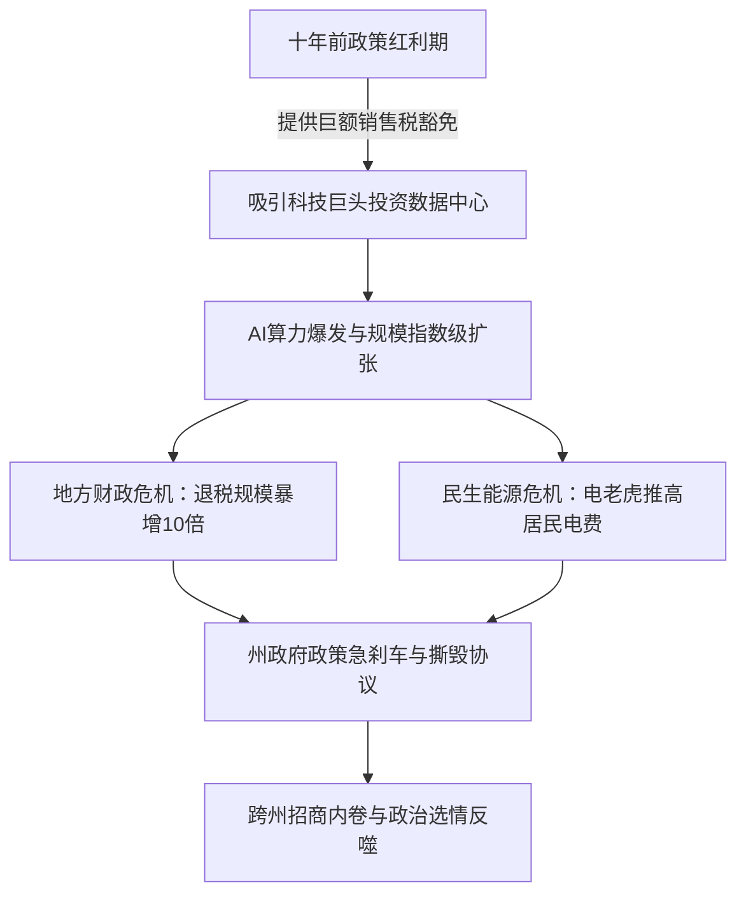
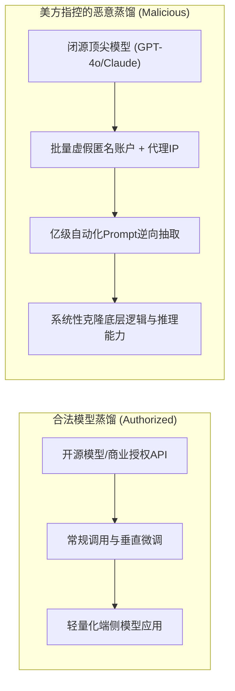
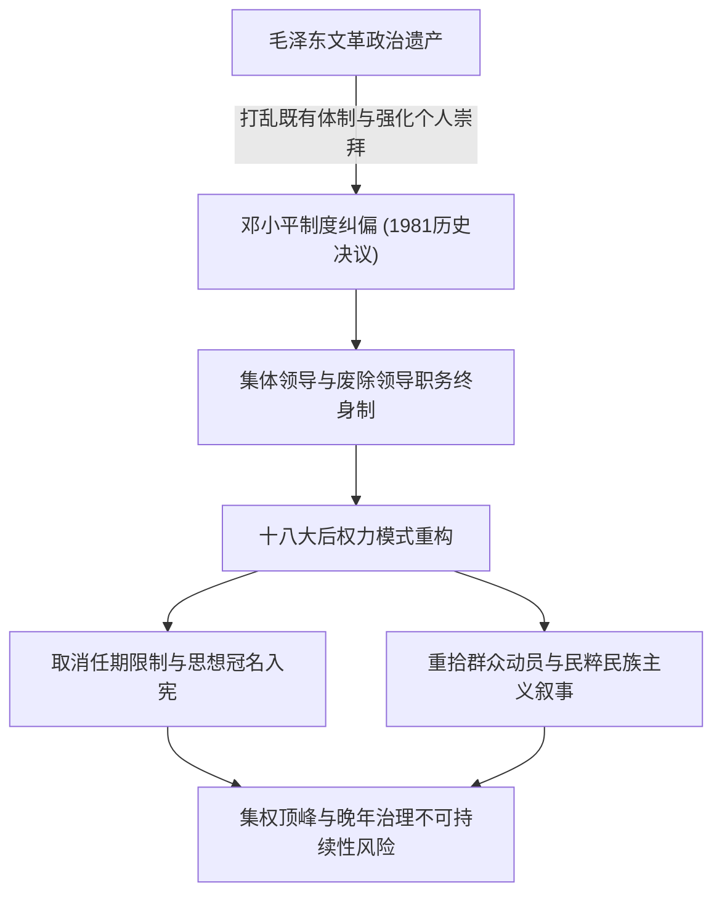
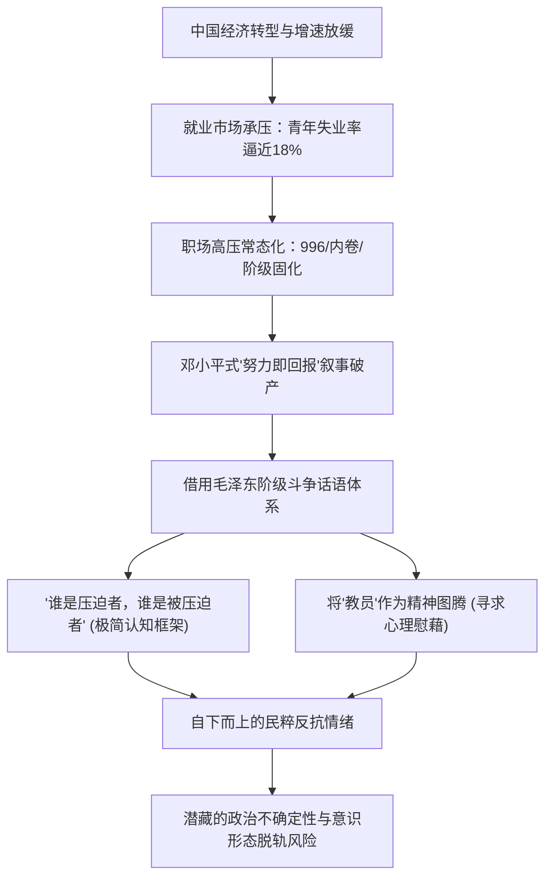
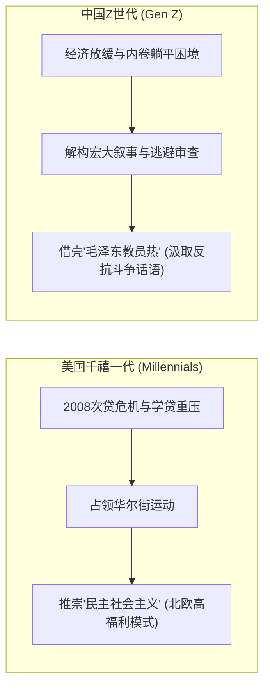

### 庄家还是老千：贝森特汇率言论与美债信用危机

大家好，我们一起来分享今天不能错过的重要新闻。今天是9月9日，我们首先来了解今天的财经头条。今天美国财政部长**贝森特**（Scott Bessent）的一句话炸出了一个大新闻，让国际财经媒体热议美国财政部究竟是“庄家”还是“老千”。庄家或者老千都是赌场上两个经常出现的角色，而且是两个比较对立的角色。庄家通常是比较讨厌老千的，因为老千弄虚作假，最后赢走的钱其实都是庄家的利益。那么为什么舆论会突然质疑贝森特究竟是庄家还是老千呢？这是一个非常耐人寻味的问题。新闻有时候你认真去琢磨分析，它并不是那么枯燥苦涩的，其背后往往隐藏着宏观金融秩序与权力博弈的深层逻辑。

昨天，美国财政部长贝森特在德克萨斯州南方卫理工会大学做了一场公开演讲。他在演讲当中讲了一段引起广泛争议的话，贝森特的原话是：“我现在就是庄家，所以当我们干预日元汇率时，我对日本人、日本央行以及日本决策者的动向都有相当准确的了解。如果你想跟我打赌，那就赌吧。”这段话听起来极其强势，宛如赌场老板在牌桌前的咆哮与宣示。然而，这种极其直白且充满江湖博弈色彩的表达方式，在美国历届财政部长当中是极其罕见的。在过去的传统金融治理框架下，美国政府与美国财政部在干预汇率时通常是滴水不漏、模棱两可的，或者习惯用一句官方外交辞令来进行搪塞，那就是著名的**强势美元政策**（Strong Dollar Policy: 强调维持美元币值稳定与信用的官方外汇政策框架）。无论采取何种微观操作，历任财长都会表示“我们所做的一切都是为了贯彻强势美元政策”。

但这一次，贝森特直接掀桌子，公开声称自己掌握着第一手的内线消息。他说自己了解日本人、了解日本政府以及日本决策者的每一步具体动向，这等于向全世界宣布“我掌握着内幕消息，而且我本身也是一个下场参战的超级玩家”。贝森特的这种表达，实际上是将复杂的国际汇率博弈与主权国家之间的宏观协调降格为一种赌场博弈或扑克牌局，并且他还公开宣称自己能够看穿对手的底牌，这立刻引发了全球财经舆论的一片哗然。

今天，《彭博社》与《华尔街日报》等国际权威财经媒体随即引出了一个更为严肃且致命的质疑：你贝森特在操纵和干预日元汇率时，既然自诩知道别人的底牌，又亲自作为核心玩家下场博弈，那么在更大、更核心的金融棋局与牌场——也就是**美国国债**（US Treasuries: 美国联邦政府发行的国家主权债券市场）市场上，你是否也是以同样的心态在运作？你是不是也利用财政部的信息特权掌握所有参与者的底牌，从而在美债市场上既当裁判又当运动员？这种表面上看似气势汹汹、大义凛然的强硬姿态，实际上深刻折射出了全球金融市场最为担忧的制度信任危机。因为在一场牌局或一个赌场之中，如果有人被怀疑是老千，或者规则制定者公然投机取巧，那么对于所有市场参与者而言都将是一场巨大的噩梦，甚至连赌场体系本身的信誉都会被彻底摧毁。

要深刻解析贝森特的这番言论，我们可以从三个核心维度进行系统性的逻辑拆解：

*   **口头干预与心理战成本**：贝森特目前正试图在日元汇率出现阶段性反转的关口乘胜追击，继续推动干预效果。但国际财经舆论普遍指出，与7月底美国财政部抛售欧元、买入日元那种真刀真枪、动用真实外汇储备的实质性干预不同，贝森特此次的表态纯粹属于一种“嘴炮式”的**口头干预**（Verbal Intervention: 官方通过强硬言论引导市场预期而无需实际资金消耗的操作）。这种干预的资金成本几乎为零。贝森特之所以选择这种极端的言论攻势，很大程度上源于他过去作为华尔街顶级**对冲基金**（Hedge Fund: 采用多种复合策略获取绝对收益的投资机构）操盘手的职业自信。他深信市场对于真正懂行、深谙交易心理的专业人士所放出的狠话会多一份天然的敬畏，因此试图在货币市场上发起一场零成本的心理威慑战。
*   **庄家定位的双刃剑效应**：贝森特罕见地自封为“庄家”，这种叙事方式具有极强的双刃性。从贝森特自身的战术考量来看，这种表态具有立竿见影的**吓阻效应**（Deterrent Effect）。如果一国财长宣称自己既是庄家、又亲自下场博弈，甚至还有盟友和小弟协同作战，那么任何试图在市场上做空日元的投机机构和投资者都必须掂量自己的风险，被迫见风使舵，因为散户与机构很难与“联手控盘的庄家”正面对抗。然而，其反噬与危害同样极其严重：首先，一旦市场识破这只是一场虚张声势的打嘴炮，其政策威慑力将瞬间归零。事实上，近期日元的升值动力主要源自**日本央行**（Bank of Japan）的加息预期与货币政策调整，与美国的言论干预并无实质因果关联，日本国内舆论已经普遍批评贝森特是在公然蹭日本央行的政策顺风车；其次，这种自封庄家的姿态引发了严重的“越界干预”指责，一个外国财长对另一个主权国家的央行货币政策指手画脚，极易被国际金融市场解读为对别国**货币政策独立性**（Central Bank Independence）的粗暴践踏与干预。
*   **国家信用与美债市场的系统性风险**：将主权国家的宏观经济政策与货币同盟简化为个人的江湖赌局，听起来虽然拉风过瘾，但若将这套草莽博弈逻辑套用到全球金融基石——美国国债市场上，则是极其危险且不负责任的。日元汇率市场或许尚可承受一定程度的情绪扰动，毕竟美国财政部确实拥有动用美元和欧元外汇平准基金的行政干预能力；但美债市场完全是另外一个层级的庞然大物。全球的流动性、各国外汇储备、各国中央银行、主权财富基金、退休养老基金以及各类对冲基金全都交织其中，其规模之庞大、参与者之多元，没有任何单一机构或国家能够以“庄家”自居并实现绝对控盘。美国财政部作为美债的最大发行方，其最高职责应当是竭力维护市场的透明、稳定与公正。如果财政部长不断向外界强化自己“既是庄家又是球员”的操盘手心态，对全球投资者而言将是极其可怕的信号。

任何现代金融市场的根本立足点在于中立的规则体系。如果庄家宣称自己不仅坐庄，还要看穿所有人的底牌亲自下场对赌，那么就没有任何市场参与者能够再相信这套体系不存在出老千的黑幕。贝森特的这番言论在本质上是极不严谨、经不起逻辑推敲的，它不仅没有展现出大国财长的宏观定力，反而在持续透支与消耗美国的国家主权信用与全球金融信誉。

---

### 人工智能算力焦虑：数据中心扩张与各州政策反转

在审视完宏观金融市场的信用博弈后，我们再来聚焦当前全球科技竞争的最核心前沿——人工智能领域的最新动态。今天彭博社与《华尔街日报》等多家媒体报道了三组关于美国本土人工智能发展以及中美前沿科技竞争的重大消息。

首先是彭博社的一篇重磅报道，标题赫然写道：《贝森特警告说：如果中国赢得人工智能竞赛，其他一切都将无关紧要》。这一警告在美国政策圈与产业界产生了巨大的冲击波。贝森特在公开讲话中直言不讳地指出，如果美国在与中国的人工智能竞赛中落败，将会面临不可逆转的灾难性后果。他强调：“如果中国在人工智能领域获胜，明天就什么都没有了；如果他们在人工智能领域全面领先于我们，那么我们所争论的其他一切议题都将毫无意义。”这番极具危机感和压迫感的言论，深刻凸显了华盛顿政策制定层对于地缘政治对手在底层硬科技领域快速迭代所产生的深层战略焦虑。

然而，如果仔细剖析贝森特这一警告的现实背景，就会发现这些言论在很大程度上是冲着美国国内当前日益激化的算力基建矛盾而发的。近期，美国多地民众与地方社区对于在自家社区门口新建大型**数据中心**（Data Center: 集中容纳计算机系统及相关算力组件的物理设施）的抵触情绪日益高涨。此前特朗普总统也曾公开警告称，美国国内对这些大型算力基建项目的反对声浪日益强烈，已经演变成一种切实的经济威胁，甚至可能直接导致中国在人工智能算力竞争中夺取战略优势。相比之下，中国许多新兴的人工智能算力中心正在北部和西北部人口密度较低、能源富集的偏远地区快速规划并大规模落地，这种基础设施推进效率的差异进一步加剧了美国联邦层面的焦虑。

《华尔街日报》随后刊发的一篇长篇深度调查报道，则将美国当前各州在面对科技巨头扩张时的分裂与困境展现得淋漓尽致。这篇题为《那些曾经给予数据中心数十亿美元税收优惠的州，现在正在撕毁这些协议》的报道指出，由于公众对算力设施的强烈抵制，**亚马逊**（Amazon）、**Meta**以及**谷歌**（Google）等科技巨头，可能即将失去地方政府此前承诺的长达数十年的税收豁免权。这是一篇极具时代现实冲突感的报道，它生动描绘了美国各州政府面对人工智能爆发浪潮与科技巨头激进圈地时，从最初的热烈拥抱迅速滑向如今紧急踩刹车的微妙心理转变：

具体而言，这一深层冲突主要体现在三个层面：

1.  **地方财政补贴的不可承受之重**：大约在十年前的移动互联网扩张期，许多州（例如俄亥俄州）为了争夺科技投资和创造高端就业岗位，出台了极其慷慨的税收优惠政策，对数据中心采购的服务器、计算机设备给予大额的销售税豁免。然而，随着深度学习与大语言模型的爆发式演进，现代数据中心的占地规模与资本支出呈几何级数暴增。由于当年的税收减免政策是直接按照设备投资比例进行挂钩补贴的，且没有设立明确的上限或时间截止期限，导致各州财政面临灾难性的退税黑洞。以俄亥俄州为例，目前仅一年需要向数据中心兑现的税收减免额度就高达15.7亿美元，比当年立法时预估的规模整整扩大了十倍以上。面对科技巨头源源不断的新建申请，州财政面临被彻底拖垮的实质风险，迫使地方政府不得不公然“悔棋”以寻求政策自保。
2.  **能源争夺与民意舆论的政治反弹**：除了财政不堪重负之外，各地的基层民意也发生了根本性的逆转，形成了巨大的选举政治压力。十年前地方民众对高科技产业落户普遍持欢迎态度；但如今美国普通老百姓切身体会到，这些庞大的算力中心不仅占用土地、破坏局部生态，更是不折不扣的“电老虎”。由于各州的电网输送容量和发电能力在短期内极为刚性，数据中心的巨额电力吞吐直接推高了区域电力负荷，导致当地普通居民的家庭电费账单成倍暴涨。过去美国普通家庭对基础电费几乎没有敏感度（十年前度电成本平均仅约7美分），但近年来的翻倍上涨让大量中低收入群体不堪重负。在俄亥俄州近期的州长与参议员选战中，电价飙升与数据中心民怨已经直接对执政党选情构成了严重冲击。
3.  **州际恶性博弈与两难困局**：在俄亥俄等州试图撕毁免税协议、踩下刹车的同时，印第安纳州、怀俄明州等其他地区却选择趁虚而入，利用更宽松的监管条件和未饱和的电力资源加码招商引资。这种各州之间的政策分歧与内卷博弈，让试图进行财政止血的州陷入了既怕财政崩溃又怕产业流失的两难境地。

将贝森特极具地缘对抗色彩的“生死警告”与《华尔街日报》关于各州基层治理危机的报道对照来看，就能看清其话语背后的实质诉求。贝森特口中的宏大论据虽然言必称中国，但其核心政治目的实际上是在为美国国内陷入瘫痪的算力基建推进机制进行政治动员和“舆论维稳”。当前，算力数据中心在美国部分地方社区已经演变成一种公共利益公害，联邦政府试图通过拉响对华科技竞赛的防空警报，来压制地方社区与州政府在环保、电价和税收层面的阻力。

---

### 恶意蒸馏指控：美三大情报机构发难与技术产权盲区

在算力基建的内耗之外，真正触及中美前沿技术硬核交锋的则是另一场突发的技术合规风暴。今天，美国各大主流媒体均在显要位置报道了一起震动科技界的重大事件。《华盛顿时代报》（The Washington Times）以《美国情报与安全机构公开指控中国人工智能企业在政府知情下以产业规模恶意窃取美国顶尖AI技术》为题进行了重点报道。

美国三大国家安全与执法核心机构——**国家安全局**（NSA: 负责密码学与信号情报的国家安全机构）、**网络安全与基础设施安全局**（CISA: 负责关键基础设施网络防护的联邦机构）以及**联邦调查局**（FBI: 联邦主要执法与反间谍机构）联合发布了一份重磅安全警告。文件直接指控多家中国顶尖人工智能企业正通过恶意且具有高度针对性的技术手段，非法复制美国顶尖人工智能实验室的核心技术与**知识产权**（Intellectual Property: 法律赋予智力创造成果的专有权利）。美方情报官员在声明中特别强调，这些技术提取行动规模极其庞大，绝非分散的个体研发行为，极有可能是获得了中国政府知情与默许的国家级产业行动。

在这份被解密的联合安全报告中，共有六家具有代表性的中国知名人工智能企业被直接点名，指控其涉嫌进行系统性的工业级技术提取。被点名的实体包括：**深度求索**（DeepSeek）、**月之暗面**（Moonshot AI）、**阿里巴巴**（Alibaba）、**智谱AI**（Zhipu AI）等六家中国头部大模型研发机构。美方机构指控这些中国企业将技术穿透的目标全面锁定在美国顶尖的AI领军企业上，包括**OpenAI**、**Anthropic**以及谷歌旗下的人工智能研发部门，试图以此绕过庞大的前置试错成本，实现本土大模型训练与推理能力的跨越式迭代。

报告在技术层面上提出了一个极具争议的核心指控概念——**恶意模型蒸馏**（Malicious Model Distillation）。这一概念与传统机器学习领域公认的合规技术路径划出了截然不同的界限：

在标准的人工智能工程实践中，**模型蒸馏**（Knowledge Distillation: 利用大型教师模型的输出表征训练紧凑型学生模型的压缩技术）本身是一种普遍且合法的研究方法，即通过参数规模巨大、泛化能力极强的“教师模型”所生成的软标签或推理链输出，来指导和优化体积小、推理成本低、适合端侧部署的“学生模型”。在获得合法授权或使用开源底座的前提下，这是行业公认的标准技术路径。

然而，美国三大情报机构指控中国企业跨越合规红线的“恶意”行为，其核心依据在于获取技术手段的隐蔽性与对抗性：
*   **规避地理与访问审查**：被指控的企业被指通过伪造身份或大量注册虚假、匿名的个人与企业账户，系统性绕过美方平台针对特定区域的地理位置访问限制；
*   **网络代理与反风控穿透**：利用全球分布式的云端服务器与代理网络隐藏真实的机构IP地址，部署高并发的自动化脚本工具，恶意规避平台设立的调用速率限制（Rate Limits）与安全防火墙；
*   **工业级数据逆向抽取**：在未获授权的情况下，向美方顶尖大模型发起数以亿计的针对性结构化查询请求，以此大规模强行提取母模型的深层逻辑架构、复杂推理链条与参数表征精华。

美方安全机构在联合声明中警告称，这种工业规模的技术抽取不仅让涉事企业节省了数十亿美元的研发探索与前置算力成本，更令美方担忧的是，这些被快速复制的先进通用推理能力未来可能被直接转化为网络攻防武器或集成至军事决策系统，对美国及其盟友构成直接的安全威慑。

这项重磅指控的出台节点极为微妙且高度敏感。当前，特朗普政府正积极筹备中国国家主席习近平于9月下旬对美国进行的正式访问及两国元首双边会晤；与此同时，中美两国代表团原定于9月中旬就人工智能安全风险管理与全球治理开展高级别闭门对话。三大情报机构在此刻高调抛出涉及六家头部企业的联合指控，无疑为即将展开的双边高层外交与科技谈判投下了巨大的政治摩擦变量。

针对这一深刻影响中美科技格局的重大事件，我们需要从法理与产业两个深层维度进行客观审视：

首先，在人工智能浪潮下，**传统知识产权与技术窃取的法律界限正面临严重的范式重塑与制度滞后**。在工业制造与传统软件时代，技术窃取通常涉及实体的图纸硬件盗窃、源代码泄露或商业间谍的实体渗透，其违法事实与侵权客体十分清晰。但在前沿大模型领域，美方的指控完全聚焦于通过公网**应用程序接口**（Application Programming Interface: 软件系统间进行数据交换与功能调用的标准化界面）发起的合规与违规查询输出。这在现行国际法与技术伦理上造成了极大的灰色地带。公开发布的商业模型本质上就是面向全球用户提供交互式查询与生成服务的，如何从法律层面精准界定何为“正常的用户交互与学习吸收”，何为“非法的恶意逆向工程与数据剥离”，目前全球法律界尚无统一的客观标准。这也直接解释了为何情报机构言之凿凿、大肆炒作，但美方司法部或相关科技巨头迄今并未在联邦法院对上述六家中国企业发起实质性的民事或刑事诉讼。现行知识产权法律体系的迭代速度已经严重脱节于生成式AI的发展步伐。

其次，**美国官方所列出的四条判定红线，本质上体现了从产权法向合同法与网络安全法的退守**。根据情报机构的公报，美方试图确立的四项违规判断标准包括：

*   **服务条款契约**：以OpenAI、Anthropic等闭源巨头在**服务条款**（Terms of Service: 用户与平台之间约定的法律协议）中明文列出的“严禁将本平台输出用于训练竞争性商业模型”为法律抓手，将模型蒸馏定性为民事违约；
*   **技术获取手段的合规性**：将批量伪造账户、隐藏IP、规避风控等对抗性技术行为，直接定性为涉嫌未经授权的网络侵入（Unauthorized Access）；
*   **知识抽取的规模与系统性企图**：区分面向垂直领域（如医疗客服、法律咨询）的局部微调，与面向通用大模型核心推理能力的“工业级全量抽干”；
*   **营业秘密保护替代版权诉讼**：鉴于AI生成内容的版权归属在全球范围内充满司法争议，美国科技巨头无法单纯依赖版权法维权，只能退而求其次，高度依赖**营业秘密**（Trade Secret: 具有商业价值且采取保密措施的技术与经营信息）法与用户注册协议发起综合围堵。

尽管美方情报体系试图通过这套逻辑构建起技术防火墙，但这种行政警告目前仍缺乏坚实的国际法判例支撑。它的实质意义更多是一场高调的地缘政治舆论战和技术威慑，但它极为清晰地反映出美方决策层对自身算法优势可能被快速抹平的极端焦虑。正如贝森特所言，在华盛顿当下的鹰派认知中，人工智能技术的主导权被直接等同于未来的全球霸权。

---

### 毛泽东逝世50周年：历史阴影与晚年权力模式的当代复刻

在国际地缘博弈之外，今天路透社与英国广播公司（BBC）等两家国际权威媒体，均以毛泽东逝世50周年（1976-2026）为切入点，刊发了长篇深度专题报道，从完全不同的观察视角审视了这位历史人物对当代中国政治体制与青年社会心理的深远投射。所谓“不识庐山真面目，只缘身在此山中”，站在外部观察者的距离，国际媒体的宏观审视提供了一个观察中国当下体制走向与社会思潮演变的独特窗口。

首先是路透社的深度政治分析报道，其标题直截了当地指出了历史与现实的强力纠缠：《毛泽东和文化大革命给中国留下了深远的阴影，至今已经过去50年》。路透社在报道中尖锐地指出，毛泽东的身影至今依然深深笼罩着中国的国家走向，而他所发动的长达十年的**文化大革命**（Cultural Revolution: 1966-1976年间中国发生的全局性政治运动与动乱）政治动乱，在此后的几代中共领导人身上留下了复杂、深刻且难以磨灭的思想印记，其中最为典型的代表正是曾经在文革中遭受严重政治迫害的现任最高领导人习近平。

报道援引了美利坚大学专门研究中国政治并著有习近平传记的副教授唐之学（音译）的深度分析。唐之学指出，文革对于青年时期的习近平而言无疑是一段充满创伤与幻灭的严酷经历，但令人深思的是，习近平在后来的政治生涯中却始终认为这场严酷的历史运动具有某种独特的精神救赎意义。在习近平的个人叙事中，陕北梁家河的苦难岁月不仅磨砺了他坚韧顽强的意志，更让他直观目睹了国家陷入失控崩溃的巨大风险，从而在其意识形态深处确立了对一套高度集权、方向明确的列宁主义社会主义路线的绝对依赖。

路透社的报道梳理了中国最高权力运行机制在过去半个世纪的剧烈变迁轨迹：

*   **否定之否定的权力轨迹**：自2012年执政以来，习近平从未公开将个人及家庭在文革中的惨痛遭遇归咎于毛泽东本人，反而提出了著名的“不能用改革开放后的历史时期否定改革开放前的历史时期，也不能用改革开放前的历史时期否定改革开放后的历史时期”的政治论调。这一叙事在根本上确立了前后两个三十年互不否定的官方正统性。
*   **体制纠偏机制的彻底逆转**：邓小平在推动改革开放后，其核心政治遗产之一便是深刻吸取毛泽东晚年个人专断的惨痛教训，在制度层面确立了**集体领导**（Collective Leadership: 最高决策层共同行使权力与分工负责的体制）原则，谨慎约束最高领袖的个人权力，并在宪法中明确确立了国家领导人的任期限制。然而，习近平执政后打破了这一长达三十余年的政治共识，毫不避讳地快速重构高度集权的个人权威，强化全党单一意识形态与严苛的纪律审查，不仅在2018年彻底废除了国家主席任期限制，更将冠有个人姓名的思想体系直接写入党章与宪法，其政治权威塑造模式直接复刻了毛泽东时代的做法。
*   **符号资本与民粹动员的结合**：伦敦国王学院刘氏中国研究院主任布朗教授分析指出，毛时代的政治图像、领袖个人魅力以及极具攻击性的斗争话语符号，在当今中国社会依然蕴含着巨大的政治动能。最高层近年来重新激活了这些具有强烈斗争属性的历史文化元素，并将其与现代激进的**民族主义**（Nationalism）和**民粹主义**（Populism）进行了深度融合。
*   **历史循环与未来政治反弹**：唐之学教授提出了一个极其深刻的终局判断：习近平之所以在政治上极力维护毛泽东的符号权威，是因为他试图将执政机器重新带回那个全社会充满高度意识形态狂热与激情服从的理想化时代。然而，这种高度依赖个人集权的统治模式在经济和社会层面是极其脆弱且难以长期维系的。正如毛泽东在文革晚期通过极端集权反而为全社会的求变心理积聚了巨大的反弹势能一样，当下的执政模式在无意之中也在快速累积深层的变革力量，并在可预见的未来推动中国社会走向完全不同的历史修正方向。

针对路透社所揭示的政治阴影，我们需要补充一个极具警示意义的历史切片。前中央电视台调查记者柴静此前在其深度历史回顾中，披露了文革末期吉林长春青年工人史云峰因书写反对文革大字报而遇害的全部档案细节。历史档案显示，当年王洪文以及“四人帮”全员对史云峰案件批示要求严惩，吉林省动用了6000余名专案人员将其逮捕入狱。然而，极其讽刺的是，在“四人帮”于1976年10月被全面粉碎隔离审查之后，地方司法机器依然在当年底按照原有的专政批示，将公开反对四人帮的史云峰执行了枪决。

这一残酷的历史事实彻底击碎了官方长久以来的传统叙事——即“只要抓捕了四人帮，文革便自动宣告终结”。史云峰的悲剧证明，反人类的专政机器一旦启动，其运作逻辑便超越了个别弄权者的生死。邓小平主持起草的《关于建党以来党的若干历史问题的决议》虽然在形式上完成了所谓的历史定论，但整个体制并未对深层的极权病灶与权力不受制约的体制进行根本性的法律清算。文革的政治基因从未真正消散，这也为当下权力向个人崇拜与专断模式的倒退埋下了最深沉的历史隐患。

---

### Z世代的教员热：内卷躺平困境下的符号化反抗

与路透社聚焦中南海最高层权力架构的宏大视角不同，英国广播公司（BBC）则将镜头对准了中国当下的基层网络空间与青年群体，发表了一篇视角独特的长篇报道：《推崇“毛泽东”的“Z世代”：弹幕、“教员”与政治私语》。这篇报道细致剖析了在毛泽东逝世50周年之际，中国年轻一代在社交媒体上掀起的荒诞而复杂的“新毛泽东热”。

报道生动描述了当前在以18至24岁年轻群体为核心的中国主流视频网站**哔哩哔哩**（Bilibili）上普遍存在的一种亚文化奇观：在各类经过二次剪辑的毛泽东历史纪录片与影视影视剧片段中，每当毛泽东的青年或晚年形象出现在屏幕上，密密麻麻的弹幕便会瞬间覆盖整个画面，充斥着“伟人很多，教员只有一个”、“伟人万岁”、“再造中华”、“全体起立”等极度亢奋的赞美词汇。在青年亚文化圈层中，“教员”已经成为代指毛泽东的最核心暗号。

不仅在视频平台上，这一思潮在高校学术与阅读场景中同样得到了硬核数据的佐证：自2019年起，《毛泽东选集》突然跃居清华大学图书馆年度图书借阅总榜的首位，并且在此后连续数年（直至2025-2026年）牢牢占据着清华借阅榜的榜首位置，成为中国顶尖高校学子阅读量最大的政治文本。

为什么在改革开放经历了近半个世纪的财富积累之后，早已远离计划经济与阶级斗争岁月的“Z世代”（Generation Z: 指1990年代中后期至2010年代初出生的一代人），会重新狂热地拥抱毛泽东的符号形象？BBC通过对多位当代大学生的深度采访与社会学家的追踪分析，揭示了其背后复杂的心理机制与社会现实：

*   **官方语境断层与“教员”称谓的解构重塑**：1981年中共十一届六中全会通过历史决议后，官方对毛泽东采取了“三七开”（七分功绩、三分错误）的功过定论，公共场所悬挂的画像被大批撤下，个人崇拜宣传被明令禁止。如今许多受访青年（如南京即将升入大学的董同学）在谈及毛泽东时，普遍使用源自1970年毛泽东会见斯诺时所说的“我历来是当教员的”这一历史掌故，以“教员”这一看似温和、具有启蒙色彩的平民化称呼替代其政治领袖全称，试图规避僵化的官方意识形态话语，构建专属于青年圈层的认同体系。
*   **严苛政治审查下的“政治私语”与避重就轻**：德国默卡托中国研究中心（MERICS）的追踪研究发现，中国青年网络社群（常被称为“键政圈”）虽然在讨论历史人物时能够借助弹幕侃侃而谈，但一旦触及当代现实最高执政者习近平的政策与路线时，所有参与者都会表现出高度自觉的**自我审查**（Self-Censorship）与话题回避。对历史领袖的高调崇拜，在某种程度上成为了当代年轻人释放政治表达欲望的安全代用品。
*   **父辈财富红利的终结与阶层跃升通道的封死**：荷兰莱顿大学长期研究中国青年政治文化的学者石诺建（音译）教授指出，当下的中国年轻人正面对着与父辈截然不同的残酷现实。他们的父辈经历的是中国经济高速腾飞、做大蛋糕、所有人生活水平普遍抬升的黄金上升期；而当下的Z世代踏入社会时，面临的是经济下行、高企的青年失业率（近年城镇青年失业率屡次逼近甚至突破18%大关）、买不起的高昂房价以及**996工作制**（996 Working Hour System: 早9点到晚9点、每周工作6天的超时加班制度）和恶性**内卷**（Involution: 资源有限导致个体过度竞争却无实质收益的内耗状态）。父辈所灌输的“只要努力就能出人头地”的宏大叙事在现实面前彻底破灭，让年轻人产生了深刻的被抛弃感。
*   **阶级斗争话语作为解构现实不公的现成武器**：正如受访学生董同学所坦言：“我们这一代人从小被教育努力就有回报，但长大后发现工作难找、房子买不起，甚至‘内卷’和‘躺平’都是我们造出来的词。而毛泽东在书里说得非常直接，‘谁是压迫者，谁是被压迫者’，这种非黑即白的极简分析框架，比复杂的西方经济学名词更容易让我们理解自身遭遇的不公。”年轻人并非真正向往回到那个普遍贫困和动乱的年代，而是急需借用一套现成的、具有官方合法性掩护的历史阶级语言，来命名并宣泄内心对于贫富分化、资本剥削与社会不公的巨大愤怒。

针对BBC所报道的Z世代“教员热”现象，我们可以提炼出三个极具洞察力的深层结论：

首先，**年轻一代对“教员”的崇拜本质上是一种严重的“移情错位与虚构幻想”**。历史上的毛泽东绝非慈眉善目的青年精神导师，文革中数以千万计被剥夺受教育权利并被强制上山下乡的红卫兵与知青，正是那场政治狂热的最大牺牲品。当代青年在网络弹幕中塑造的“教员”，是脱离了历史真实语境的乌托邦投影。但正如所有青年亚文化一样，它并不需要严密的历史考据与逻辑自洽，只要这种反抗权威、砸碎旧世界的斗争符号能够精准对冲他们当下的焦虑与无力感，它就能迅速形成席卷全网的情绪共振。

其次，**“教员热”绝非对现行体制的顺从与效忠，而是一场披着历史外衣的自下而上的潜在民粹反抗**。年轻人狂热追捧毛泽东的“造反有理”与“反抗压迫”，其精神内核指向的是对现实社会阶层固化与权力规训的强烈逆反。当年轻人发现即便顺从地脱下孔乙己的长衫、打破头去接受996内卷，依然无法改变沦为社会边缘人的命运时，他们便转向从原教旨主义的斗争理论中汲取反叛的正当性。这种源自底层的激进民粹情绪，对当下的最高执政者而言绝非可以轻易驾驭的政治资产，反而构成了极具颠覆性的政治火药桶。

最后，**青年借用激进历史符号对抗现实困境，是全球代际危机中的普遍社会学规律**。中国Z世代的“教员热”，与美国**千禧一代**（Millennials: 伴随互联网成长、在2008金融危机后踏入社会的代际群体）在步入社会后狂热推崇**民主社会主义**（Democratic Socialism: 主张在民主框架下通过再分配实现平等的政治思潮）的现象具有高度的逻辑同构性。美国的千禧一代在遭遇次贷危机重创、面临天价大学学贷和高昂居住成本后，发起了“占领华尔街”运动，将矛头全面对准资本主义建制派，狂热追捧主张全民健保、大学免费与对富人征收重税的社会主义政策。

无论是美国青年拥抱北欧式的社会主义，还是中国青年高呼“教员万岁”，两者的底层动力完全一致：它们都是青年群体在遭遇严酷的经济停滞与阶层沉沦时，面对无法撼动的社会现实所发起的一场符号化抗争。年轻人并不是真的想要彻底复刻上世纪的激进乌托邦，而是通过大声赞美当权者最忌惮或最无法直接否定的历史图腾，来进行一场充满讽刺意味的“合法反叛”。这场尚未定型的意识形态潜流究竟会演变为停留在屏幕上的网络泄愤，还是会在未来转化为重塑中国政经版图的实质性政治动能，将是所有观察当代中国走向的研究者必须长期密切关注的核心命题。