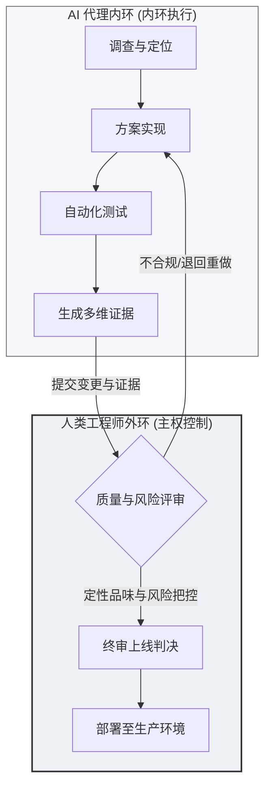

### 责任终审制：AI 协同时代下工程师的核心定位

在软件工程加速自动化的浪潮中，未来的工程师将不再由其编写代码的纯粹速度定义，而是由其**选择何种任务值得执行**的能力所决定。随着 AI 代理（Agents）承担越来越多的自动化开发工作，人类工程师的核心价值在于掌控**决策证据（Evidence）**、理解系统行为，并最终做出**上线判决（Verdict）**。

这里的“判决”并非流于形式的审查，而是指工程师必须对生产环境的变更决策承担终极的**问责机制**（Answerability: 支撑判决并为其背书的释义与担责能力）。质量管理虽然能产出测试和度量数据等证据，但只有通过人类的判决才能明确责任的归属。

随着技术发展，传统的岗位边界正变得日益模糊。正如 Boris Cherney 所指出的，工程角色的划分正围绕具体的“工作本身”重新聚合。在全新的协作生态中，关键问题不再是你的头衔是什么，而是你能够掌控系统的哪一部分。

Boris Cherney 提出的五种工程模式——**原型开发**（Prototype）、**构建**（Build）、**清理**（Sweep）、**演进**（Grow）和**维护**（Maintain）——构成了一个乐观且务实的分类法。AI 代理将在这些模式中全面辅助人类，但真正的稀缺资源不是去机械执行这些任务，而是判断产品在特定阶段需要哪种模式、适用何种质量标准，以及最终由谁对产出结果负责。

在技术架构的演进上，行业正经历从**脚手架工程**（Harness Engineering: 包含上下文、工具链和 Git 的模型运行环境）到**环路工程**（Loop Engineering: 具备持续提示、自我校验与记忆决策的系统），再到**软件工厂**（Software Factory）的跨越。即使在自动化的内环（Inner Loop）运行中，人类仍然是外环生产决策（Production Decisions）的唯一把关人。这一技术演进并未削弱人类的价值，而是将人类的判断力推向了更具杠杆效应的决策卡点。

Original English

>> Howdy, folks. So, good afternoon or good whatever time it is when you're watching this on YouTube. I'm really excited to be here. And um today I want to talk to you about really uh what it takes to keep the human in the loop where engineering is concerned. I really want to start with a human side before we talk about the architecture here.

I think that the engineer of the future is going to be really defined by the person who is able to choose what is worth doing. They're going to own the evidence. They're going to own the understanding as well as the verdict. around increasingly automated work that's being done by agents. Now, when I use the term verdict, I don't mean that we're suddenly all going to be Judge Judy. We're not. But what I mean really is something just a little bit different. I mean, we're going to be accountable for the production decisions. Does something ship? Do we block it? Do we redirect it or accept the risk? Quality is something that we all talk about a lot, but quality produces evidence. A verdict assigns responsibility. And answerability is really what lets us stand behind a verdict. And this of course is not the only way that our industry is starting to think about our roles evolving.

Boris Cherney recently put some useful language around what many teams are starting to feel. The old craft boundaries are getting blurry, and roles are re-bumbling around the work itself. And the important question here becomes a lot less about what is your title and more what part of the system can you own? Now, I like this taxonomy quite a lot. Um it's optimistic without being overly vague. So, things like prototype, build, sweep, grow, and maintain. And these are real engineering modes. Agents are going to help with all of them, but the scarce thing is not merely doing the task. It's going to be knowing which mode your product needs and what quality bar applies and who owns the result at the end of the day.

Now, we've been talking about harnesses and loop engineering and software factories over the last couple of days. We can talk why this shift is happening. We moved past the model as the whole story, right? With harness engineering, the coding agent is the model plus the harness around it, right? Your context, your tools, your file system, Git. And the harness is what turns intelligence into something that you can delegate to. The next move was loop engineering, where we weren't just prompting one run anymore. We were designing systems that kept prompting, checking, and remembering, and deciding what happened next. And that's really when agents started to feel like infrastructure. And once you start putting all of those things together, you get that software factory. Dex covered this well in his talk, where you have agents that are running inside that inner loop and evidence that comes out. Humans still end up making the production decisions in this loop. And the wind really isn't moving us from it. The wind is moving human judgments the highest leverage checkpoint, I think. And this is why it starts to matter now.

### 代码质量新范式：为 AI 写作与低成本验证瓶颈

随着 AI 辅助生成的代码逐渐成为代码库的常态，**可问责性**（Answerability）已从一个抽象的哲学命题转化为紧迫的工程要求。根据 Sonar 在 2026 年的调查，AI 辅助代码在现代代码库中已占据主导地位，这意味着我们必须以全新的视角审视代码的维护和治理。

传统的**干净代码**（Clean Code）理念在 AI 时代被赋予了新的使命。过去，我们编写整洁的代码是为了便于其他开发人员阅读；现在，整洁的代码同样在帮助 AI 代理高效工作。Sonar 的研究表明，虽然整洁的代码库与混乱的代码库在任务通过率上相差无几，但**干净代码在 AI 代理的执行中消耗的 Token 显著更少，且引起的重复访问和死循环更低**。因此，维护代码库的整洁直接关系到软件工厂的运行效率与成本控制。

然而，代码生成成本的降低并没有自动降低代码审查的成本。当前行业面临的最大挑战在于**“信任与带宽的失衡”**。调查显示，高达 96% 的工程师对 AI 生成的代码持怀疑态度，但其中只有大约一半的人会在提交前进行严谨的验证。这种“在缺乏带宽的情况下产生怀疑”的状况构成了巨大的安全隐患。

为了解决这一冲突，安全和质量保证必须通过降低**验证成本**来突破瓶颈。我们需要让验证机制变得更便宜、更清晰，且让开发者难以跳过。当开发团队的交付速度超越组织治理策略的制定速度时，我们必须通过技术手段明确回答以下核心问题：
* AI 模型是否修改了这个文件？
* 该项变更受到了哪些约束条件的引导？
* 变更是基于什么证据做出的？
* 我们承担了什么风险，最终由谁为结果负责？

AI 代理交付的代码量远远超出了人类进行逐行审计的极限。要在大规模自动化的浪潮中生存，验证和治理机制的自我革新已势在必行。

Original English

AI-generated and AI-assisted code is becoming normal code for a lot of us. One of Sonar's 2026 survey said that AI-assisted code is no longer marginal. It's increasingly having a large role in our code bases. And once that happens, answerability stops being this philosophical world. It becomes an engineering requirement. And there's a quality point here as well, right? Like we used to care about clean code, code that people could read. But cleaner code is actually not just going to help the next human and the next person on your teams. It actually helps the next agent. Another one of Sonar's research uh studies found that clean and messy repos had roughly the same pass rates, but clean code actually used fewer tokens and caused fewer revisits. So there's a lot of benefit to maintainability that can fuel efficiency for your factories.

Now, making generation cheaper does not automatically make review cheaper, right? I think a lot of us are facing this moment and we know that engineers are not naive. The Sonar numbers say that almost everybody is skeptical of AI code. Now, I love working in my software factory. I love building my engineering loops. But the problem is still capacity. If 96% of people don't fully trust that code, but only about half always verify before committing, we have this danger that we've got distrust without bandwidth. And so safety comes from making verification cheaper, clearer, and harder for people to skip. And if you zoom out from the individual reviewer to the organization, review and validation start becoming a bottleneck when governance isn't able to catch up and adoption is already moving way faster than any company can go and set their policies. And this means that we have some hard questions we have to deal with, like did a model actually touch this file? And the hard questions are also like what constraints guided that work? What evidence was produced? What risk was accepted and who owned the result? Now, the agent can ship more than any of us can review, right? So what are we still good for? I think it's a question that's on a lot of our minds, right? And you know, if Homer Simpson's experience automating computers can teach us anything, maybe this is our future. I don't think it is. But it's one direction things could take. Now, let's try that again. If change is where humans enter the loop, if generation scales faster than comprehension, the scarce resource becomes judgment that's backed by evidence. So, the question is no longer how much can the agent do, but where does human judgment still create leverage?

### 职业护城河与能力衰退：防范三大认知陷阱

在工程师的职业生涯规划中，我们需要引入**超额收益**（Alpha: 人类能力与当前模型能力之间的差距）与**能力衰退**（Decay: 该差距随着模型升级而缩小的速度）这两个概念。如果一个工程师的独特性仅仅建立在某种特定编码技能上，随着技术前沿的推进，这项技能终将被自动化覆盖。

为了应对能力的快速衰退，**品味**（Taste）这一概念频繁被提及。Paul Graham 指出，当任何人都能轻易制造任何东西时，选择制造什么就变得至关重要。但我们必须警惕，避免将“品味”变成一个逃避解释具体工程细节的玄学词汇。

Mitchell Hashimoto 为品味提供了一个更具工程实践意义的定义：**品味是在尚未建立起客观衡量指标时，做出高质量定性判断（Qualitative Judgments）的能力。**

品味的作用在于它抢跑于基准测试（Benchmarks）和市场反馈之前。虽然品味也会随着模型的自我迭代而面临衰退，但其衰退速度明显慢于编写速度和信息检索能力。为了保持职业竞争力，工程师的策略不应当是死守某项具体的开发技能，而是**不断将自己的认知边缘向上提升一个抽象层级**。我们不应继续追问 AI 代理能做什么（因为这个限制列表正在迅速归零），而应自问：**有哪些决策只能由人类来承担责任？**

在向上提升的过程中，工程师必须主动识别并防范以下三个认知陷阱：
1. **认知债**（Cognitive Debt）：过度依赖 AI 代理解决问题，导致开发人员对系统底层机制的理解和记忆逐渐退化。这表现为系统可以通过测试并合并，但团队中没有任何人能够合理解释其运行机制。
2. **认知投降**（Cognitive Surrender）：盲目接受 AI 代理的答案。沃顿商学院的一项研究警告称，当 AI 给出错误答案时，依然有 73% 的受试者选择相信该答案，并表现出“借来的自信”（Borrowed Confidence）。
3. **编排税**（Orchestration Tax）：盲目追求并行运行数以百计的 AI 代理，导致大量认知带宽被用于路由、合并、校验和集成。工程师必须像设计系统一样设计自己的注意力分配方案。

Original English

Now, I want to talk to you about two terms that I'm going to use for the career part of this talk, alpha and decay. Alpha is the gap between what you can do today and what current models can do. That gap is a very real thing, and decay is the clock on that gap. If the thing that makes you special is a capability, the frontier is eventually going to come for it. Right? And there's a whole conversation around this. This is one of the reasons why taste keeps coming up. Paul Graham had a point here that I think is very right. When anyone can make anything, choosing what to make becomes very important, and I buy that. But I also think that we have to be very careful because taste can become a magic word for whatever part of the work we don't want to explain just yet.

Mitchell Hashimoto gave us a more useful version of this definition. Taste is the ability to make high-quality qualitative judgments where no objective metric exists yet. That matters because it puts taste before the benchmark and before the market has fully voted. When you try out a model and you see the kind of UX and the kind of experiences that it builds, you can often tell when you think it has taste or lacks taste or where there's a gap there that humans can fill. Now, this is also only useful if we can turn some of this concept around taste into critique, examples, and better judgment over time. So, yes, taste matters when production gets cheaper. And if anyone can generate 10 options, the scarce skill is really knowing which option deserves to exist. But taste is not some eternal moat. It's alpha as well.

Now, the people with taste are still going to matter. I personally think they're still going to matter for a long time. But the best version of that skill is not mystique. It's making better calls and leaving behind examples that your team and the system can learn from. Now, let's apply the decay test. Well, we used to have speed. That decayed. We used to have recall. You know, harnesses have memory. Verification is moving into harnesses, evals, static checks, and model critique. Taste, I continue to think this is going to decay much more slowly, but it still resets as models learn from examples and preferences. Even judgment in some ways is a slope rather than a wall. So, the strategy is not to cling to any one capability. It's for us to keep moving our edges up a level.

So, this is one of the reasons why what can the agent do is not the best strategic question anymore. The list of things that agents can't do just keeps shrinking. The better question for us is really what can only a human be answerable for. Not because, you know, any of us are are magical in any way, but because some decisions actually require ownership. They require context, risk acceptance, and responsibility after that work ships. This is why the word engineer has to get just a little bit stricter. More people than ever can now make computers do things, and I think that's truly awesome. The total addressable market for builders has never been larger, and that's so cool. But it's a huge expansion of leverage. An engineer is not merely somebody who can code, you know, and and get things to exist. An engineer can reason about systems. They think about constraints, you defend trade-offs, you can manage risk, and you're the person that can be reached out to when things start to break. So, what are things that engineers should avoid if we want to stay effective and accountable in this moment?

Well, the first thing to avoid really is cognitive debt. Now, cognitive debt is the erosion of your understanding and memory around how to solve problems. I think a lot of us start to feel this the more that we're using agents every single day. I know that I feel this a lot. And it's because we're deferring more and more to AI to solve our problems. For code, it's the gap between how much code exists in your repo and how much any human on your team genuinely understands. And this is why things like delegation debt end up mattering. You can have a build that passes, you know, your tests, a PR that you can merge, but your team can still end up losing its ability to actually explain the system that they are shipping to production. Now, a very real pressure is all much is also how much we delegate. So, agents can now stay inside the system long enough for the human to lose the thread. So, a 30-second run, right, can feel like an interaction, but an hour or a day-scale task, so something long horizon, that's a work stream. And when tasks can end up, you know, lasting that long, especially when you begin running many of them in parallel, review can't just be a glance at the end. It has to become a whole control system.

The second thing to avoid is cognitive surrender. Now, this is when you blindly accept AI's um responses. Like, delegation is important cuz delegation says, \"Do the work, then show me enough evidence that I can judge it.\" I still make a judgment in that situation. Surrender is really saying, \"Hey, your answer is now my answer before I have formed any opinions myself.\" Now, um Wharton did a study that kind of offers us a warning light here. When AI was wrong, 73% of people still thought that they they you know they picked the wrong answer and they felt more sure. So, the failure mode is not using AI, but it's borrowed confidence.

The third thing to avoid is orchestration tax. Now, if you've been in the Bay Area, you will see people who for better or worse are still walking around with their laptops open or talking to you about cloud agents. And we're increasingly trying to run more and more and more in parallel or telling each other that we're shipping with hundreds of agents or thousands of agents. More AI agents running does not mean that there is more of you available. Your cognitive bandwidth does not parallelize. So, every loop that you create ends up causing more decisions to route, merge, verify, and integrate. And the fix is not necessarily fewer agents, but it's about designing your attention like a system. Like where you enter, what you require, what you reuse. You just want to be very intentional about it.

### 主权划分：“懂了再发”与内环外环的隔离

在自动化的协同关系中，**高主动性**（High Agency）的本质并不是指亲力亲为地去完成每一项具体工作（这不利于规模化扩张），而是**对输出结果的主动问责**。它要求工程师清晰地界定何时委托、何时审计、何时熔断，以及何时在变更结果上署名。

这可以用**主动性阶梯**（Agency Ladder）来形象描述。处于阶梯底部的工程师仅发现问题并留给系统；往上则依次是执行、诊断、提议、推荐与解决；而最顶层的核心能力则是**洞察与抉择**（Discernment）——判断一个问题是否值得投入资源去解决，或者是否应该直接放弃并转向更重要的事务。

为了将这一认知转化为运行模型，我们必须将开发环路进行彻底的内环与外环隔离：
* **内环执行**（Inner Execution Loop）：由 AI 代理负责调查、实现、测试并报告。这极大地释放了执行效率。
* **外环控制**（Outer Agency Loop）：由人类工程师负责决策、验证、批准并承担后果。

在这种工作流下，AI 代理在内环产出证据（包括代码 Diff、测试用例、执行日志、推理轨迹和运行截图），而真正的工程活动则在外环展开。人类据此评估这笔变更是否值得推进，证据链是否充要，并决定是批准、重定向还是拦截发布。因此，人机的边界并非基于“人是否在看 AI 的输出”，而是基于**证据与责任的清晰划分**。

基于此，我们提出一条严苛的工程红线：**“解释它，否则别发布”**（Explain it or don't ship it）。这并非要求人类重写每一行代码，而是指必须有人能够深刻理解这些变更的风险并为之辩护。正如大型企业代码库中的 `OWNERS` 文件机制一样，总得有具体的工程师为特定目录的代码主权抗雷。

历史经验表明，每一代更高水平的高级语言、开发框架、云平台或低代码工具的出现，都伴随着“世界不再需要这么多程序员”的预言；但事实恰恰相反，生产力成本的降低每一次都会释放出巨大的**潜在需求**（Latent Demand）。那些过去由于成本和可行性限制而未被实施的创意，在这一刻被彻底解放。AI 代理的普及同样不会消灭工程岗位，它只是将瓶颈从“我们能否构建它”推向了**“它是否应该存在，以及我们能否对其负责”**的战略高度。

保持对系统的敬畏，掌控决策证据，并为你的终审判决署名。

Original English

Now, accountability can be a scary word for a lot of people. And I wouldn't be surprised if it made you want to go hide in the bushes and just tell your agent to deal with it. But, accountability is not what remains after agents get good. It's what lets the rest of the whole system scale. If agents can do more work, if they can do it faster and parallel, better than what many of us could do, the scarce thing becomes the ability to explain intent, to inspect evidence, to accept risk, and improve the system when the decision was wrong.

Now, here is the career math. The half-life of an edge might be one model release. Speed, recall, verification, even taste all move as the frontier moves. But, the half-life of a signature, your credibility, your expertise is much longer. And by signature, I really mean the name on the work, the person, the team, the institution, whoever stands behind what's actually shipped. So, skills can earn leverage, accountability can turn leverage into trust. And this is one of the lines that I want to draw pretty clearly. Agents can choose, they can route, they can merge, they can escalate, they can operate inside policy. And in many systems, you know, they can, they should. But execution and responsibility are very different things. The agent can follow your runbook, but it can't inherit the consequences. When something fails, the question is, who understood the policy? Who accepted the risk and who owns the blast radius?

High agency is something that a lot of us talk about these days as being like this thing that we're looking for when we're hiring. High agency is actively taking ownership of your outcomes. So, knowing when to delegate, when to inspect, when to stop, and when to put your name on the result. High agency in this world is not I personally do everything. You know, that version doesn't really scale. It's not just hustle theater, but it's ownership with judgment attached. This agency ladder tries to make that a little bit more concrete. At the bottom, you've got someone that flags a problem and leaves it for the system. Higher up, they execute, diagnose, propose, recommend, and resolve. And the rare top movement is discernment. You know, maybe you find a problem and you decide whether or not it's worth investing in. Maybe it's not, and maybe you move on. But when agents make more paths possible, agency is not chasing every single path. It's really just deciding which paths deserve your ownership and attention.

So, translate that into an operating model. Agents can run much more of the inner execution loop. They can investigate, implement, test, and report. I think that there's leverage in that, but that outer loop is still engineering. So, deciding, verifying, approving, owning, that inner loop is capability. The outer loop is agency. And this is a boundary that I really care about. Your agent returns evidence. It returns diffs, tests, logs, rationale, traces, trajectories, screenshots, whatever the work itself requires. But then the engineering really begins. We decide whether the work was worth doing. We verify whether the evidence is enough, and we approve or redirect or own what reaches production. It doesn't matter if you're someone that's just working with a small number of agents, or whether you're working with thousands of agents. I still very much think that these ideas apply. So, the boundary is not human looks at AI output. The boundary is evidence and responsibility.

So, here's an operational rule. Explain it or don't ship it. And it's not because humans have to type every line or read every line, but because someone has to understand the work well enough to defend it. If you've ever worked in a large code base or an enterprise code base, some code bases have this concept of an owners file or certain subdirectories where there are people who are on the hook for that part of the system. You can think about this in a very similar way. Who is accountable for that part of your architecture and your code base? Your model might write the code, and the question is really still whether you can explain those changes that the agent is shipping, whether you've got the evidence where you understand the risks.

Now, this is one of the things I want you to remember near the end. Automation moves the floor for all of us. Engineering continues to move up a level, and our new work might be loop design, evidence design, and brownfield stewardship, but fewer keystrokes doesn't mean less engineering over the next few years. It means that there is more surface area that needs taste, verification, ownership, and ultimately care. I don't think I've ever been more excited about the future of this field. Every time that we have made it easier to write software, we've predicted that the world would need less of it. And in fact, the opposite happened. Higher-level languages happened, frameworks, cloud, low code. The pattern always went the other way. And when you lower the cost, latent demand ends up appearing. Those ideas that people didn't think were feasible to build and get out there are suddenly unlocked. And agents are going to do the same thing for a lot of people. It's not going to remove engineering work. It's going to move the bottleneck from can we build this to should this exist and can we answer for it? So, build the factories, keep the lights on, own the verdict. I hope this was useful. Thank you.

