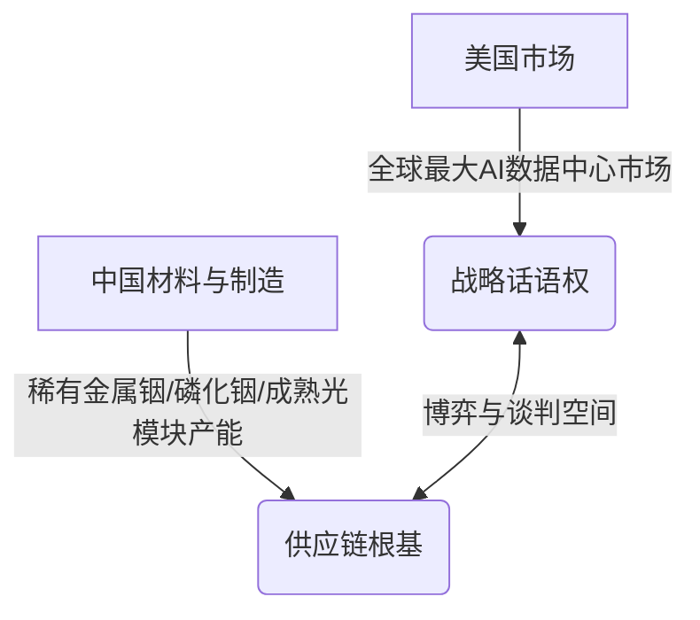

### 算力风暴下的隐秘动脉：光通信走向AI战略核心

这两年我们聊起**人工智能**（Artificial Intelligence: 模拟人类智能的计算机系统）基础设施，翻来覆去讲的都是GPU芯片的算力突破、**高带宽内存**（High Bandwidth Memory: 一种基于3D堆叠工艺的高速内存技术）的供需紧张、以及台积电的**先进封装**（Advanced Packaging: 提升芯片集成度与互连密度的前沿封装技术）产能，再就是数据中心那令人咂舌的电力消耗和极其苛刻的散热冷却系统。似乎整个AI算力的故事，永远都在围绕着这几个光鲜亮丽的核心硬件部件转动。

然而，就在不久前，一则在主流媒体上不算特别起眼，但在产业界引发剧烈震荡的新闻，可能会悄悄改变未来三到五年整个全球AI光通信产业的竞争格局，甚至最终影响到我们每一个普通用户所能接触到的AI服务成本以及算法模型的迭代速度。

2026年8月4日，多家海外主流媒体同步报道称，**美国联邦通信委员会**（Federal Communications Commission: 负责美国国内及国际通信政策与市场准入的监管机构）正在起草一项全新的提案，计划限制新的中国光收发模块进入美国的数据中心。消息一经公布，资本市场便做出了极为敏感的反应，当天美股的光通信板块直接整体大涨，包括Coherent、Lumentum、AAOI等在内的西方本土光通信厂商的股价都出现了非常明显的涨幅。

在大多数人的第一直觉里，这不过是又一轮美国对华科技封锁的延续，套路和之前的先进计算芯片、AI服务器限制大同小异。很多人认为，这不过是美国在搞自己的“国产替代”，只要把中国产品挡在门外，市场份额自然就留给美国本土或者西方供应商了，资本市场提前给本土厂商投票也完全符合这个逻辑。

但是，如果我们把过去一年里美国围绕光模块、**磷化铟**（Indium Phosphide: 用于制作高速光电子器件的二代半导体材料）器件、**共封装光学**（Co-Packaged Optics: 将光引擎与交换芯片或算力芯片封装在同一个基板上的先进互连技术）、本土制造以及供应链安全的所有动作串联起来，进行一次深度解剖，就会清晰地发现，这件事情远没有“禁止中国光模块”这几个字那么简单。

这本质上是美国政府第一次系统性地、将光互连技术正式纳入到AI基础设施安全和战略供应链的防御体系中来进行考量。它所影响的，并不是当下某一个季度或者某一个财年的订单多寡，而是未来几代AI光通信产品的竞争规则、技术演进路线以及整个全球市场的利益分配格局。

---

### 规则落地的现实泥潭：如何定义“中国光模块”

面对这一突如其来的政策信号，许多国内从业者的第一反应是恐慌，担心中国的光模块企业会瞬间失去庞大的美国市场。然而，冷峻的产业现实告诉我们，从FCC起草提案到最终规则的正式颁布、执行，中间还有着漫长的政策游说期与博弈过程。光是在具体执行和监管条文的制定层面，美国政策制定者就必须面对一整套极其复杂且无法绕过的定义问题。

首先，要执行限制，监管层必须回答一个最基础也最棘手的问题：到底什么才算**中国光模块**（Chinese Optical Transceiver: 由中资控制或在中国大陆产业链内完成关键制造的光电转换模块）？

这绝对不是一个简单的字面游戏，而是直接决定了监管触手需要深入到供应链的哪一个层级：
* **以注册地与股权控制为标准**：如果是按照公司注册地或实际控制权来判断，那么中资企业不论把工厂开在泰国、马来西亚还是越南，都将直接受到政策的限制。这对于已经完成海外产能布局的中国头部光通信厂商来说，将是巨大的直接冲击。
* **以组装制造地为标准**：如果政策仅仅是以“最终组装地点”作为产地判别标准，那么企业通过调整海外生产线的物料投产与组装地，就能够拥有极大的腾挪空间，通过合理的供应链重组规避监管风险。
* **以物料清单（BOM）与原产地追溯为标准**：如果监管尺度严苛到要追查每一颗**发光芯片**（Laser Diode: 光模块中用于产生光信号的核心半导体器件）、驱动芯片、固件来源以及电容电阻等元器件的原产地，那么受影响的就不仅仅是光模块的成品组装商，而是会直接波及到上游的激光器芯片、磷化铟材料器件以及更基础的半导体衬底，其波及范围和产业破坏力将呈指数级放大。

除了定义主体的复杂性，提案中一个最关键但容易被舆论忽略的词汇是“**新型号**（New Models）”。800G光模块升级到下一代的1.6T光模块，这无疑属于毫无争议的新型号；但在现有的800G速率代际内，如果厂商为了优化成本或提升良率，仅仅是微调了封装形态、更新了内部控制固件、或者替代了部分非核心元器件，这是否也需要重新送检并进入漫长的新型号审批流程？

在光通信行业中，产品的设计选型与客户导入被称为 **Design Win**（设计赢标：产品被客户接纳并写入下一代设备电路板设计方案的行业关键节点）。如果FCC的政策只针对未来的1.6T、3.2T及CPO新产品设限，而允许现有的800G及以下代际产品继续销售，那么短期内北美数据中心的供应链冲击将处于可控范围，但真正的“脱钩”压力将会在下一代大集群网络架构的设计阶段逐渐显现。

更有可能的一种政策落地路径是：FCC最初并不会采取单一的“排华法案”形式，而是对所有在海外（非美国本土）生产的全新光模块型号建立一套统一的、合规性的安全审查与审批手续。随后，根据企业的股权结构、供应链的透明度、物料来源的可追溯性，以及企业在美国本土投资建厂、转移产能的具体进度表，来分批给予不同期限的豁免权或有条件准入资格。这种切香肠式的政策推进，远比一刀切的禁令更加符合美国科技巨头对供应链稳定性的诉求。

---

### 算力膨胀的隐形瓶颈：光互连为何成为战略高地

要看透这次FCC提案背后的深层逻辑，我们必须理解为什么在这个时间节点，光模块这个曾经默默无闻的网络配角，会突然被推上大国博弈的战略风口。

在传统的云计算时代，数据中心内部的通信流量虽然庞大，但整体架构相对分散，网络互连速率的升级节奏是温和且渐进的。然而，伴随着**生成式人工智能**（Generative AI: 能够自主创作文本、图像及代码等内容的AI技术）的爆发，AI训练集群的规模呈现出了几何级数的增长。当计算集群从早期的几千颗GPU，迅速膨胀至几万颗、十几万颗甚至几十万颗GPU的超大规模时，整个计算系统的物理瓶颈已经发生了本质性的转移。

在单体计算芯片（如GPU）的算力逼近物理极限的当下，决定整个算力集群有效输出的关键，已经不再是单一芯片的运行速度，而是数据如何在成千上万颗芯片之间进行高速、无损、低延迟的传输。
* **算力空转的本质原因**：如果芯片与芯片之间、计算节点与交换机之间的总线带宽不够，或者传输延迟过高，计算芯片就会把大量的时间浪费在“等待数据输入”的空转状态中。这就是业界常说的“通信墙”限制。
* **集群效率的木桶效应**：单颗GPU的算力倍增，并不能直接等同于集群计算效率的同比例提升。这就如同给一台电脑配置了顶级CPU，但如果主板总线极慢、内存带宽不足、硬盘读写拉垮，整台机器在实际运行大型任务时依然会卡顿。

正是在这种背景下，光通信的传输速率经历了前所未有的狂飙。短短几年内，光模块的主流速率从400G、800G，以惊人的速度向1.6T和3.2T迭代。而在更长远的技术路线上，为了彻底解决传统铜缆在高速传输下的高损耗与高功耗问题，行业正在加速向**共封装光学**（CPO）技术演进，甚至探索将光接口直接做进算力芯片封装内部的**光输入输出**（Optical I/O: 利用光子代替电子进行芯片级高密度数据传输的互连技术）。

站在AI超级计算机的系统工程角度来看，GPU决定的是局部节点的计算潜力，而光互连则扮演着将这数万个孤立节点凝聚成一个庞大“超级大脑”的神经网络。如果说GPU是这台超级计算机的CPU核心，那么光互连就是连接这些核心的系统总线和主板。

正是这种从“网络配件”到“算力主板”的战略地位跃升，让美国政策制定者感受到了前所未有的焦虑。他们吸取了十几年前在全球通信网络建设中，华为与中兴等中国企业凭借高性价比设备铺满全球网络，导致后期美方不得不支付极其昂贵的“拆除与替换”成本的教训。因此，赶在1.6T光模块和CPO技术在AI数据中心大规模铺开的前夜，提前设立准入壁垒，本质上是一场针对未来三到五年AI总线控制权的提前锁定。

---

### 供应链的盘根错节：双向依赖与难以复制的产业根基

然而，美国重构光通信供应链的雄心，在冷酷的产业物理定律和全球分工面前，迎头撞上了坚硬的现实。光模块虽然名义上是一个封装好的模块，但其背后延伸出的是一条跨越半导体、精密光学、特殊材料等多个领域的极长产业链，这绝非在一两个州建立几家组装厂就能解决的。

哪怕美国政府通过政策压力，强行将微软、谷歌、Meta等巨头的订单转移给西方本土的供应商，这些企业在试图扩大产能时，也会立刻面临上游材料与器件的“断供”风险：
1. **产能扩充的先决条件**：光模块的产能爆发，首先需要数倍增长的激光器芯片；而激光器芯片的制造，又高度依赖于高品质的磷化铟（InP）单晶衬底及外延片。
2. **矿产资源的天然壁垒**：在高纯度稀有金属**铟**（Indium: 生产磷化铟衬底必不可少的基础稀有金属元素）的全球供应链中，中国拥有绝对的主导性份额。不仅如此，中国在过去几年中已经对包括磷化铟在内的关键半导体材料实施了出口许可管理。

这种资源与材料的卡脖子现状，在一次戏剧性的外交细节中得到了印证。此前美国总统特朗普访华期间，随行的美方商界代表团中，光通信巨头Coherent的首席执行官赫然在列。业内人士普遍分析，这位CEO随同访华的关键诉求之一，就是游说并推动解决其在华工厂及上游原材料的出口许可证审批问题。当一个企业的物料供应需要上升到国家元首会晤的层面来沟通时，足见上游材料的瓶颈有多么致命。

这种深度的“双向依赖”勾勒出了中美光通信博弈的真实底牌：

下游的模块封装和测试环节，确实可以在数年内通过在泰国、马来西亚甚至美国本土设厂来完成组装线的迁移；但再往上游走，高纯度的单晶生长、衬底精密抛光、晶圆外延片的生长等工艺，属于典型的“高壁垒、长周期”积累。这些技术和经验需要长期的工艺迭代与熟练技术工人的配合，绝对不是仅仅依靠政府补贴砸钱，就能在三五年内凭空复制出来的。

因此，在缺乏原材料和上游支撑的前提下，如果美国单方面强行切断中国光模块供应，其国内AI基础设施建设的成本将急剧飙升，建设计划甚至面临停滞。这也是为什么华尔街在新闻发布后，并未恐慌性抛售AI科技股，因为市场很清楚，这是一场充满了妥协、豁免与漫长拉锯的博弈，而非一夜之间的彻底断联。

---

### 市场重组与技术分化：光通信产业的未来张力

当不确定性成为常态，全球AI光互连产业的竞争逻辑也正在发生深刻的变化。

对于超大规模云厂商（Hyperscalers: 拥有数十万台服务器规模的超大型数据中心运营商）而言，政策的阴影迫使他们在选择下一代1.6T和3.2T光模块供应商时，必须将“地缘政治韧性”作为核心考核指标。过去，光模块的竞争是极其纯粹的物理性指标比拼：
* **功耗与能效**（Power Consumption & Energy Efficiency）
* **信号完整性与良率**（Signal Integrity & Yield Rate）
* **大规模量产与快速交付能力**（Mass Production & Delivery Capacity）

而未来，供应商将不得不向客户证明其供应链的“政治纯洁度”，包括控制权结构、BOM清单的去中化程度、物料原产地的可追溯审计证明，以及是否有配套的本土化（如美境或盟国境内）备用产能。为了应对这种变化，超大规模客户正在通过长期采购协议、产能预付款、甚至是直接的股权渗透，来强行扶持和锁定西方本土的替代产能。

这种供应链的非理性重组，必然会导致全球光通信分工效率的降低，并推高AI基础设施的建设成本。但从另一个角度来看，高企的系统成本也将成为催化技术变革的加速器。

当传统的插拔式光模块因为地缘政治摩擦和技术瓶颈变得越来越昂贵、且难以稳定供应时，各大科技巨头将会有更强烈的意愿去推倒原有的架构设计，加速推进**CPO**和**光输入输出**（Optical I/O）等革命性技术的商业化落地。因为只有通过这种底层的技术革新，将光引擎直接集成在芯片端，才能从根本上降低对传统独立光模块供应链的依赖，并把系统整体的能耗与成本打下来。

放眼未来，全球AI光通信产业正在告别过去二三十年由“效率与成本”单一驱动的、高度一体化的全球化黄金时代，逐步分裂成一个带有着鲜明地域安全属性与双轨制标准的新结构。然而，无论供应链的形态如何演变，光互连作为AI时代战略基础设施的地位已经不可动摇。在这个由光子承载算力的崭新时代，谁能率先在材料物理的极限与地缘博弈的夹缝中找到平衡，谁就将掌握下一代超级计算机的连接密码。