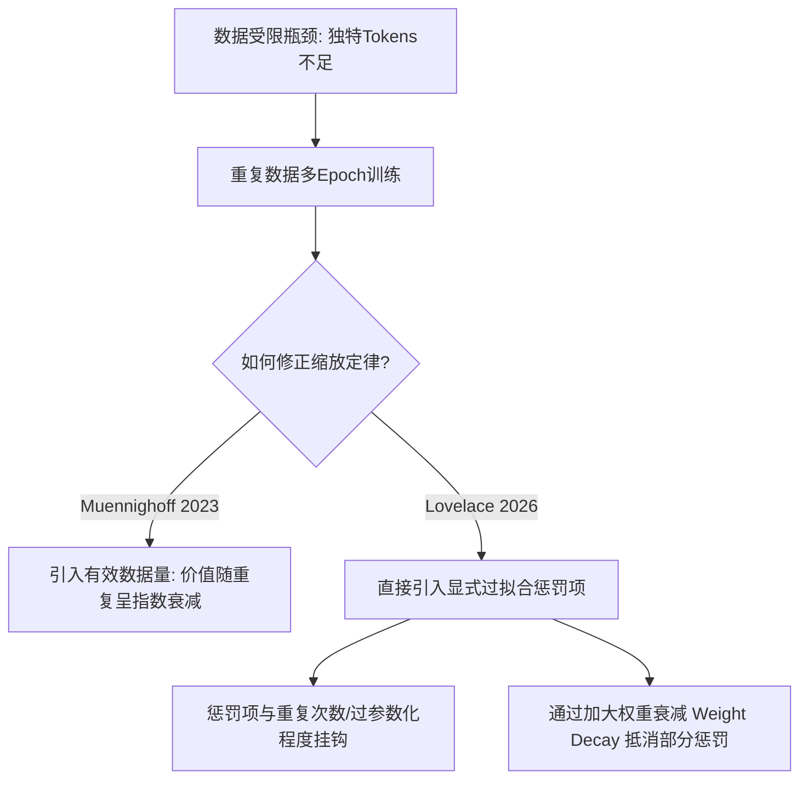

### 缩放定律的起源与早期理论探索

在大语言模型的发展史中，如果说过去五六年里大模型行业有哪一条规律是所有公司都真金白银下注的核心依据，那一定就是**缩放定律**（Scaling Laws：模型性能与计算量、模型参数量及数据量之间呈幂律关系的经验法则）。简单来说，这个定律的核心观点是：模型越大、数据越多、计算投入越大，模型的损失值就会越稳定地下降。而且令人惊叹的是，这种下降的轨迹可以用一条非常精准的**幂律**（Power Law：一种数学关系，表示一个量按另一个量的幂次方成比例变化）曲线进行预测。靠着这条规律，研究人员可以在小规模、低成本（比如几百万美元）的实验中进行拟合，然后直接外推去指导几十亿甚至上百亿美元的大模型训练方案。这听起来非常神奇，但很少有人会公开讨论，这个看起来无比简洁的定律在实际拟合的时候有多么脆弱。无论是参数统计的口径、精度的保留位数，还是拟合区间的选取，任何一个看似无关紧要的工程细节，都可能导致最终算出来的最优方案差出好几倍。为了彻底理清其中的关键，我们需要顺着 **Lilian Weng**（翁丽莲，OpenAI前安全系统负责人）最新撰写的综述文章，来深入梳理缩放定律的来龙去脉、经典结论的分歧、数据受限后的修正，以及现实拟合中布满的各种大坑。

要理解这一整套体系，我们必须先从最早的学术研究说起。其实在“缩放定律”这个词真正火起来之前，学术界早就开始系统地探索模型泛化误差和规模之间的可预测关系了。早在1992年，**阿玛里**（Amari）和他的合作者们就用贝叶斯方法推导出了四类不同的**学习曲线**（Learning Curves：描述模型性能随训练样本量增加而变化的曲线），这些曲线在数学上都符合幂律的形式。在阿玛里的推导中，针对不同的任务场景，误差下降的速率有着明显的差异：
* 第一种场景是确定性算法加上完全无噪声的数据，且系统存在唯一解，此时**泛化误差**（Generalization Error：模型在未见数据上的期望误差）和数据量的一次方成反比（即 $N^{-1}$）。
* 第二种场景是当系统存在多个等价的最优解时，误差的下降速度会变得更快，与数据量的二次方成反比（即 $N^{-2}$）。
* 第三种场景是在数据带有随机噪声的情况下，泛化误差的下降速度变慢，与数据量的二分之一次方成反比（即 $N^{-0.5}$）。
* 第四种场景是当采用随机学习算法去处理带噪声的数据时，误差最终会收敛到一个由数据本身噪声决定的**不可约损失**（Irreducible Loss：即使是完美模型也无法消除的内在数据噪声和信息熵限制）的最小值，无法再继续下降。

虽然阿玛里当年的理论推导是建立在极其简单的二分类任务之上的，但它为后来的所有实证研究打下了一个决定性的基础框架，即：模型的性能损失与规模参数之间的关系，本质上就是幂律关系。

在建立这种理论假说之后，具体的实证研究在25年后迎来了重大突破。2017年，**赫斯特内斯**（Hestness）团队进行了一次跨越四个领域的大规模实证研究，将这个结论向前推进了一大步。他们系统地测试了语音识别、图像分类、机器翻译以及语言模型四个完全不同的方向，并发现了几个高度一致的规律。首先，泛化误差随数据量的变化在所有领域中都始终符合幂律。更重要的是，这个幂律的斜率（即幂指数）是由问题本身的核心特征决定的，跟你具体使用什么样的模型架构关系不大。架构的升级和算法的改进，通常只会把整条幂律曲线垂直往下平移，从而降低不可约损失的基数，但它并不会改变曲线本身的倾斜程度。其次，要拟合一个固定大小的数据集，模型所需要的最少参数量也同样符合幂律关系。基于这些发现，他们将学习曲线细致地拆分成了三个特征鲜明的阶段：
1. **小数据瞎猜区**：当数据量太少的时候，模型表现得跟随机瞎猜差不多，性能提升极其缓慢。
2. **标准幂律下降区**：随着数据和规模进入中间区间，便呈现出标准的幂律下降，规模稍微涨一点，损失就稳定下降一点。
3. **不可约损失区**：当规模继续增大到一定程度后，数据内部的固有噪声开始主导，性能达到了误差下限，此时无论如何堆砌规模也无法再产生效果。

紧接着，在2020年，**罗森菲尔德**（Rosenfeld）团队将模型大小和数据大小两个维度结合在一起，构建了一个联合的参数化模型。他们的核心结论同样非常简洁：在固定其中一个变量时，另一个变量和损失之间都呈现出完美的幂律关系。因此，他们提出最终的总损失可以拆分为三个相互独立的部分：由模型规模决定的损失项、由数据规模决定的损失项，以及一个和两者都无关的常数项（即不可约损失）。这个模型的实用价值极高，因为开发者只需要跑几组小规模的测试实验，拟合出公式中的五个关键参数，就能够外推并在非常大数量级的情况下预测更大的模型损失。在当时，早期的理论研究很多依赖于**VC维度**（Vapnik-Chervonenkis Dimension：一种衡量假设空间复杂度和机器学习算法泛化能力的经典指标）等统计学习理论来解释，但这些理论给出的大模型泛化边界通常过于宽松，缺乏实际指导意义。反而是这些纯经验拟合的幂律曲线显得既干净又好用，逐渐成为了整个工业界最主流的分析工具。

---

### Kaplan与Chinchilla定律的经典分歧

真正把缩放定律塑造成大模型时代整个行业核心共识的，是2020年OpenAI的**卡普兰**（Kaplan）团队发表的那篇划时代的论文。在这项研究中，他们专门针对Transformer架构的语言模型进行了系统而详尽的实验，模型参数规模横跨7亿多到15亿非嵌入参数，数据量则从2200万扩展到230亿tokens。Kaplan团队在论文中总结出了几点至关重要的核心发现。第一，测试损失与模型参数量、数据量以及训练计算量在单独观察时，均呈现出近乎完美的幂律关系；而想要获得最优的模型性能，这三者必须遵循特定的比例进行同步缩放。第二，模型训练曲线的形态是高度可预测的，而且这种形态基本上不会受到模型具体大小的影响。第三，大模型表现出更高的样本利用效率，这意味着要达到相同的损失水平，大模型所需要的训练步数和数据量反而比小模型要少。第四，网络架构的微调细节（如宽深比等）对最终效果的影响微乎其微，远不如纯粹的规模大小重要。第五，训练损失和测试损失之间高度相关，这直接成为了现在所有预训练工作得以开展的底层前提——只要预训练阶段的自监督损失降低了，下游各种评测任务的效果大概率也会提升。

然而，在Kaplan的论文中，最具行业影响力同时也引发了最大争议的，是关于**计算最优分配**（Compute-Optimal Allocation：在给定的总计算算力预算下，如何在模型参数量和训练数据量之间分配以达到最低损失）的结论。根据他们的计算和拟合结果，在固定计算预算（浮点运算次数 FLOPs）的情况下，最优的模型参数量 $N$ 应该与计算量的 $0.73$ 次方成正比，而最优的训练数据量 $D$ 则仅与计算量的 $0.27$ 次方成正比。将这个比例翻译成大白话就是：如果你手中的计算算力提升了10倍，你应当把其中大部分用于扩大模型，将模型大小翻大约5.5倍，而训练所消耗的tokens数只需要翻大约1.8倍。基于这个结论，Kaplan团队给出的战略建议是：与其把一个小模型训练到完全收敛，不如直接训练一个规模大得多的模型，甚至不需要等它训练完，就能在同等算力消耗下拿到更好的性能。此外，他们还对Transformer模型每个模块的浮点数运算进行了精细核算，给出了一个沿用至今的近似估算公式：训练所需的总计算量 $C$ 近似等于 6 乘以模型参数量 $N$ 再乘以训练token数 $D$，即 $C \approx 6ND$。这个公式的推导非常直观：在神经网络的前向传播中，每个token平均需要 $2N$ 次浮点运算；而在反向传播中，因为要计算梯度并更新权重，计算量通常是前向传播的两倍（即 $4N$）。两者相加，每个token在一次完整的训练迭代中就需要 $6N$ 的计算量。当整个训练集包含 $D$ 个tokens时，总计算量自然就是 $6ND$。

这个看似完美的 $0.73$ 比例结论，仅仅维持了两年，就在2022年被DeepMind的**霍夫曼**（Hoffmann）团队彻底推翻了。Hoffmann团队发表了著名的 **Chinchilla** 缩放定律，指出Kaplan团队的研究存在严重的实验漏洞，并给出了完全不同的最优分配比例。为了确保结论的可靠性，DeepMind团队采用了三种完全不同的数学方法来进行交叉验证，实验的样本规模也大了一个数量级，覆盖了从7000万参数到160亿参数的400多个不同模型，训练tokens从50亿一直拉到5000亿。这三种验证方法分别是：
1. **固定参数量变化数据量**：通过固定每个模型的参数大小，给予不同的训练tokens预算，观察在每种算力水平下能达到的损失极值。
2. **等计算量剖面分析**：在固定总计算算力的前提下，绘制损失随参数量变化的曲线，每条曲线的最低点即为该算力下的最优模型大小，将所有最低点连接起来即为最优缩放曲线。
3. **经验参数化拟合**：直接套用与Rosenfeld类似的公式，通过优化器在所有实验数据点上求解最优的参数值，再推导 $N$ 和 $D$ 随计算量 $C$ 的指数关系。

令人惊奇的是，这三种方法最终得出了一致性极高的结论：在计算最优的分配下，模型参数量 $N$ 和训练token数 $D$ 均与计算量 $C$ 的 $0.5$ 次方成正比。这意味着，当你的算力预算翻倍时，模型大小和训练数据量应当按照 $1:1$ 的同等比例一起翻倍。按照Chinchilla定律，Kaplan当年的分配建议出现了严重的偏差，导致当时整个行业按照旧标准做出来的大模型，全部都属于“参数量过大、但训练数据严重不足”的非最优状态。为了验证这个新结论，DeepMind特意在同等算力预算下，训练了一个只有700亿参数的全新模型 Chinchilla，其参数量仅为当时业界标杆 Gopher（2800亿参数）的四分之一，但使用的训练tokens数却是后者的四倍多。最终的评测结果非常震撼，Chinchilla在几乎所有主流下游任务上都全面击败了Gopher。这个结果直接改变了整个行业的训练范式，大家开始从盲目追求百亿、千亿级别的参数规模，转向疯狂挖掘和清洗几万亿级别的训练数据。

---

### 两大定律的调和与物理机制假说

面对两个同样来自顶尖研究团队的实证结论，为什么比例会产生如此明显的差异？在2024年，**皮尔斯**（Pearce）和**宋**（Song）的一项工作终于调和了这个分歧。他们通过重现和精细对比发现，核心差异主要来自于以下两个地方。

首先是**拟合实验的模型规模区间**。Kaplan当时的实验主要是在较小的模型上进行的，其核心参数区间分布在7亿到15亿之间；而Hoffmann团队所采用的实验模型规模要大得多。在双对数坐标轴（Log-Log Plot：横纵坐标均为对数值的坐标系，常用于将幂律关系转化为线性关系进行拟合）上，哪怕拟合的斜率只出现了一丁点细微的偏差，一旦向外推导好几个数量级之后，其最终的参数和数据配比结果就会被成倍地放大，产生巨大的漂移。

其次，也是最致命的工程细节差异，在于**嵌入层参数**（Embedding Parameters：用于将离散的token ID映射为连续向量的参数空间）到底要不要算进模型规模中。Kaplan在统计参数量 $N$ 时，特意排除掉了嵌入层的参数，而Chinchilla统计的则是模型的总参数量。在模型规模较小时，嵌入层的参数占总参数量的比例非常高（有时甚至能达到百分之三四十），是绝对不可忽略的。这就导致在小模型区间内，由于排除了大比例的嵌入层，测算出的局部缩放指数会偏高，刚好落在了Kaplan所测得的 $0.73$ 附近。而随着模型规模变得越来越大，嵌入层参数占总参数量的比例会稀释到几乎可以忽略不计的程度，此时局部缩放指数就会慢慢向下收敛，最终趋近于Chinchilla所得出的 $0.5$。因此，这两个看似冲突的结论在各自特定的实验参数区间内其实都是正确的，只是Kaplan误将小模型区间的局部缩放指数当作了全局通用的幂律规律，才在向大模型场景外推时发生了偏差。

在厘清了这些经验公式的偏差后，我们不禁要退一步思考：为什么大模型的缩放定律偏偏符合幂律，而不是指数或者其他数学形状？虽然到目前为止，学界还没有给出一个无可争议的完美数学证明，但有两个非常主流的假说尝试去解释其底层的物理和数学机制。

第一个是2020年由**夏尔马**（Sharma）和Kaplan共同提出的**数据流形维度假说**（Data Manifold Dimension Hypothesis）。该假说认为，自然语言数据虽然看起来维度极高，但本质上是分布在一个维度要低得多的低维流形（Manifold：高维空间中局部呈现欧氏空间性质的子空间）之上。当模型的参数量增加时，模型在几何上就能够将这个低维流形切割和划分得更加精细，从而降低拟合的误差。如果在数学上这个流形的内在维度是 $d$，那么泛化误差大约会与参数量的 $-1/d$ 次方成正比，这在数学形式上恰好就对应了幂律形式。

第二个是2023年由**米肖**（Michaud）团队提出的**知识量化假说**（Knowledge Quantization Hypothesis）。这个假说从认知和技能学习的角度出发，认为大语言模型在训练过程中，知识和技能并不是连续平滑习得的，而是像量子化的一粒粒量子一样，是一块一块、一个个子步骤被攻克和学会的。这些不同的知识与技能在自然语言中出现的频率，其分布本身就符合幂律分布（即齐普夫定律 Zipf's Law）。当模型规模变大时，它会首先学会那些出现频率极高的简单技能，随着算力和规模进一步扩大，再逐步啃下那些出现频率很低的复杂技能。在宏观上，所有这些离散技能的习得叠加在一起，就呈现出了整体性能损失随规模扩大而平滑下降的幂律曲线。除此之外，还有一些研究从数据谱、核方法以及训练动力学的相变角度尝试给出解释，但目前这些理论大多仍处于假说阶段。

---

### 数据受限时代的修正模型

在前面的所有经典讨论中，其实都有一个秘而不宣的共同前提：训练数据是无穷无尽的。这意味着在每一个训练步中，模型喂进的每一个token都是全新的、高质量的、从未见过的。然而，现实的工业界已经无情地打破了这个假设。随着近几年各大厂商疯狂的算力军备竞赛，高质量、无污染的互联网独特语料正在面临枯竭。所谓的“数据墙”（Data Wall：因互联网高质量自然语言数据耗尽而导致大模型性能提升受阻的瓶颈）正在加速逼近。在数据受限的场景下，原有的经典缩放定律就彻底失效了，因此必须引入对数据受限场景下的修正研究。

首先需要明确的是，评估训练数据规模不能单看简单的token数量。同样是一万亿的tokens，经过了极度严苛的去重（De-duplication：通过相似度算法去除重复或高度相似文本的过程）、质量过滤和防训练集污染处理的高质量数据集，与随随便便从互联网上爬取回来的垃圾数据，其训练效率和最终带给模型的泛化提升可以说是天差地别。数据清洗和不同领域数据的配比，本身就是如今大模型预训练中最核心的技术机密之一。

如果独特的高质量数据真的不够了，强行把数据拿来进行多轮重复训练会发生什么？2022年，**埃尔南德斯**（Hernandez）团队针对这个问题开展了细致的实验。他们构造了不同数据重复比例的训练集，结果观察到了非常明显的**双下降**（Double Descent：在机器学习中，随着模型复杂度或训练时间的增加，测试误差先下降，然后上升，最后再次下降的非单调现象）现象。在重复训练的过程中，模型的测试损失会先下降，接着在一个特殊的平台期甚至反弹上升，最后才再次降下去。重复的比例越高，这个中间的反弹和平台期就越显著。研究团队认为，中间阶段损失的不降反升，是因为模型在这个时期开始对重复的数据进行死记硬背式的过拟合，这反而极大地损害了模型的泛化能力。他们也通过实验证实，大量重复的数据会导致模型在分布外数据上的评测效果以及后续的下游微调表现出现严重的退化。

为了将数据重复的消极效应定量地写进缩放定律里，2023年的**慕尼霍夫**（Muennighoff）团队进行了一项里程碑式的修正工作。他们重新定义了总训练计算量中的数据部分，将总tokens数 $D_t$ 拆解为独特tokens数 $D_u$ 乘以一加重复次数 $U$ 的形式。他们的核心逻辑是：一个token被模型重复阅读的次数越多，它所能带来的新信息量和梯度价值就应该打一个相应的折扣，这个折扣随着重复次数的增加呈指数衰减。基于这个观点，他们给Chinchilla的计算最优公式加入了“有效数据量”的修正项，同时为了保证数学形式上的对称性，也对模型规模引入了“有效规模”的修正。他们的实验得出了一个非常有意思的结论：随着重复训练次数的增加，过量模型参数的价值衰减速度，要远快于重复数据本身的价值衰减速度。这个结论在工程上的指导意义在于：当你的高质量独特数据不够用时，与其去盲目堆砌一个更大的模型，不如把现有的数据多训练几个轮次（Epochs），后者的性价比和最终效果要显著优于前者。

最新的重大进展来自2026年**洛夫莱斯**（Lovelace）团队的研究。他们摒弃了之前繁琐的有效规模折算思路，而是直接在损失函数中增加了一个显式的过拟合惩罚项。这个罚项与两个核心变量强绑定：一个是数据重复的轮数，另一个是模型参数量与独特数据量之间的比值（即模型的过参数化程度）。在他们的公式中，这两个因素各自拥有独立的特征指数，这打破了Muennighoff模型中关于模型与数据对称衰减的假设。Lovelace团队观察到了一个非常符合直觉的物理现象：模型的参数规模越大，它对数据重复的敏感度就越高，重复训练带来的过拟合伤害也就越深。同时，他们也给出了一个极具实用价值的避坑指南：在被迫使用重复数据进行多轮训练时，把优化器中的**权重衰减**（Weight Decay：在损失函数中加入参数的L2范数惩罚，用以限制权重大小、防止过拟合的正则化技术）参数调大，可以非常显著地减轻重复数据带来的过拟合惩罚。这就相当于通过强力的正则化手段，强行抵消了一部分重复数据对模型泛化性能的副作用。但到目前为止，这些针对数据受限的修正模型大都依然停留在纯经验拟合的阶段，各个修正参数背后的第一性原理和物理机制仍然有待未来的学术界去深入挖掘。

---

### 实际拟合中的工程陷阱

在实际的AI工程实践中，拟合缩放定律远远没有它在白皮书上写出的公式那样轻而易举，实际操作中到处都是容易踩入的深坑。正如前文所说，我们永远无法在百亿、千亿级别的参数规模上做高密度的网格搜索实验，而只能在非常小（如几千万到几亿参数）的区间里跑实验，再外推好几个数量级去指导大模型。在Log-Log对数坐标系下，拟合时哪怕只有微小的毫厘之差，在向右侧无限外推之后，都会造成失之千里的严重误导。

在进行缩放定律拟合时，有一个最重要的控制变量大前提：**除了你要改变的规模变量之外，其他所有能控制的变量在不同实验组之间必须保持绝对的一致**。这其中包括：网络的基础架构、优化器的超参数、学习率衰减策略（如余弦退火的周期）、Batch大小、数据的领域配比、分词器（Tokenizer）的分词效率等等。不仅如此，在每个不同规模的实验点上，这些超参数都必须是经过精心调优以达到该规模下最优状态的，否则你画出的就是一条掺杂了未调优误差的脏曲线。Kaplan与Chinchilla之间长达两年的历史偏差，在本质上就是这种变量控制不严密、计算口径不一致所带来的代价。

为了进一步揭示拟合过程中的脆弱性，2024年**贝西罗格鲁**（Besiroglu）团队做了一项非常深刻的复现研究。他们直接向DeepMind申请调出了Chinchilla论文中的原始实验数据点，并用Hoffmann所说的第三种“经验参数化拟合”方法重新进行跑数。结果发现，Chinchilla当年给出的拟合结果与前两种方法出现微小偏差，并不是因为理论不成立，而是源自两个非常隐蔽的工程细节：
* **第一，Huber损失的计算方式**：在进行优化求解时，当年的实验团队在对 **Huber损失**（Huber Loss：一种对数据中的异常点不敏感的鲁棒回归损失函数）进行聚合时，错误地采用了求平均（Mean）而不是求总和（Sum）的方式。这导致在小模型区间，由于数值被平均后过小，优化器的梯度直接收敛并提前终止了，甚至算出来的置信区间也比实际窄了很多。
* **第二，报告数值的舍入误差**：论文中报告的关键幂指数只保留了两位小数，这在双对数坐标下的外推中引入了额外的舍入漂移。

为了让工程师更直观地理解这些陷阱，Lilian Weng在她的文章中专门设计了一个玩具模拟实验。她先用已知真实参数的合成公式生成了一批带有微小波动的模拟数据，然后尝试去拟合缩放定律，敏锐地指出了三个最典型的失效模式：
1. **损失保留精度**：在记录每个实验点的Loss时，仅仅将数值从保留四位小数（例如2.4153）粗暴地改为保留两位小数（例如2.42），拟合出的幂律指数就会发生剧烈的变化。
2. **损失测量噪声**：在实验过程中，由于数据读取顺序的随机性或设备微小的计算精度差异，哪怕只引入千分之一的测量噪声，拟合出的外推参数也会彻底飘走。
3. **拟合区间的选择**：如果你只选择在极小模型的区间里进行局部数据拟合，然后硬去预测大模型的表现；或者用包含了大模型在内的全区间进行拟合，这两种方式得到的幂指数会天差地别。

综上所述，缩放定律是大模型工程实践中一套非常强大且不可或缺的罗盘，但它绝对不是什么亘古不变的自然界神圣铁律。在本质上，它只是一套高度依赖于严密工程变量控制的经验外推工具。在实际应用中，团队必须时刻保持对实验边界的敬畏，深刻清楚它的各项前提假设。绝对不能盲目拿着在窄区间、小模型上拟合出来的直线，就敢往无穷远处的百亿、千亿甚至万亿模型场景下做无限外推，否则等待你的将是动辄数百万美元的算力打水漂。在高质量独特数据日益紧张、数据墙越垒越高的今天，如何修正并探索缩放定律在多模态融合、合成数据生成以及下一代非Transformer架构下的新演进方向，将成为整个AI行业持续探索的终极命题。