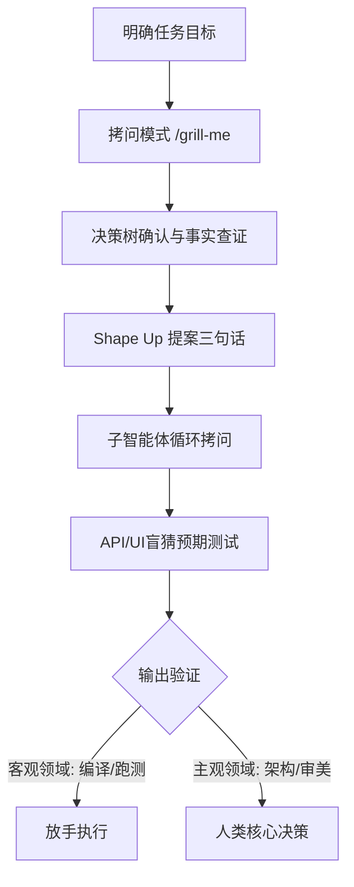

### 认知失调：分裂的科技圈与公开的秘密

如果你在最近的半年时间里，曾经与科技圈、特别是软件开发领域的从业者聊起过大语言模型（Large Language Model: 基于海量文本训练的 AI 系统），你大概率会从他们身上感受到一种极其诡异且强烈的“分裂感”。

这种分裂感在日常生活中表现得淋漓尽致：当大家坐下来聚餐、喝咖啡或者进行技术交流时，每个人似乎都在不遗余力地吐槽大模型。人们抱怨现在的模型这里不行、那里出错，斥责整个AI赛道充斥着资本泡沫，认为AI生成的大多数内容都是低质量的“数字垃圾”，甚至断言这项技术迟早会走向崩溃与消亡。然而，当你悄悄凑过去，看一眼这些正在痛骂AI的工程师们的电脑屏幕时，你又会发现一个完全相反的现实——他们的屏幕上正明晃晃地挂着 **Claude Code** 或 **Cursor**（Cursor: 一款集成了前沿大模型的下一代 AI 辅助代码编辑器）等开发工具，对话框里的上下文历史拉得极长，光标在终端里疯狂闪烁。

这种心口不一的现象并不是个别技术人员的虚伪或双标，它已经演变成为了当前整个科技行业的集体精神状态。这种在公开场合批判、在私下里高频使用的微妙状态，在今年七月中旬于柏林举办的**本地优先**（Local-First: 强调数据存储在本地、离线可用且具备高效同步机制的软件设计范式）大会上，被一位演讲者当众戳破了。

这位讲者名叫**杰里米·西奥查理斯**（Jeremy Theocharis），他是一家工业软件公司的联合创始人兼首席技术官（CTO）。杰里米撰写了一篇引起轩然大波的文章，其标题本身就像是一句毫无保留的坦白：《大语言模型的批评者说的都对，但我照用不误》（The critics of LLMs are right, but I use them anyway）。这篇文章在发表后的第二天便迅速冲上了全球知名开发者社区 Hacker News 的首页，并在广大程序员与技术决策者群体中引发了强烈的共鸣。

这种共鸣的本质非常简单：杰里米替无数在一线挣扎的工程师说出了那句大家心知肚明、却在公开舆论场上无人愿意完整道出的真相。要想真正理解这种认知失调，我们需要从柏林那场大会上的几个戏剧性画面聊起，逐步剖析大模型带给整个技术生态的生存性威胁，进而学习杰里米摸索出的一套“反直觉”的具体用法，并最终探讨一个比技术本身更重要的问题：在被大语言模型重塑的时代，究竟什么才是真正稀缺且不可替代的？

---

### 秩序失控：工具制造者的自我防卫

在柏林本地优先大会的现场，台上的主讲人正站在聚光灯下，面带严肃地逐条批判着大语言模型所带来的负面影响。从无休止的版权争议、对生态环境造成的巨大能源负担，再到互联网上铺天盖地的低质量AI垃圾内容，台上的每一次严厉抨击，都会在台下引发一阵赞同的掌声。

当时，杰里米·西奥查理斯就坐在观众席的中后排。他环顾四周，清楚地看到那些正卖力鼓掌的同行们，其膝盖上的笔记本电脑屏幕里正毫无保留地运行着各种AI编程助手。台上在义愤填膺地声讨，台下在心照不宣地鼓掌，而与此同时，大家手头的工作依然在靠AI进行加速。这是一种所有人都看在眼里、却没有人主动打破的皇帝新衣式的默契。

然而，更具戏剧性的一幕发生在**阿明·罗纳彻**（Armin Ronacher）的演讲问答环节。对于做后端开发或者Python生态的开发者来说，罗纳彻这个名字可谓如雷贯耳，他是大名鼎鼎的 **Flask** Web框架的创作者，也是著名错误监控平台 **Sentry** 的早期核心团队成员，是行业内公认的顶尖软件工程专家。最近，阿明创办了一家名为 Earendil 的公司，致力于开发一个名为 Pi.dev 的开源编程智能体框架。

在问答环节中，杰里米通过大会的 Discord 频道向罗纳彻提出了一个直击痛点的问题：“你们现在还接受社区的 Pull Request（PR: 开发者向开源仓库提交代码合并请求的行为）吗？或者说，你们是如何应对由大语言模型自动生成的大量 PR 和 Issue（问题报告）的？”

罗纳彻在全场观众的注视下，给出了一个冷酷而又无奈的回答：“事实上，对于几乎所有提交过来的 PR 和 Issue，我们现在都直接采取了自动关闭的过滤策略。”但紧接着，他为了安抚台下的开发者，又补充了一句极其耐人寻味的话：“但请你千万不要因此就不敢再向我们提交贡献，因为如果那是人类真正投入心血写出来的东西，它总会自己发光的。”

这是一个充满讽刺与现实张力的画面：**致力于制造 AI 开发工具的顶尖团队，由于自身无法承受 AI 工具所批量生产的垃圾内容的冲击，不得不首先对 AI 的产出关上大门。** 这种防卫行为的出发点并非因为大模型不够聪明，而是因为当所有人都可以零成本、无门槛地利用大模型来批量制造代码和文档时，开源社区维持基本秩序、进行人工审核的成本已经膨胀到了让人无法承受的地步。

正如罗纳彻的公司在官方宗旨页上所写的那样：“在一个冲向AI的世界里，我们相信人类才是最好的智能体（Agent）。”这句宣言背后隐藏的苦涩现实是，如果人类不加节制地退居幕后，将表达与编码的权利完全让渡给算法，那么互联网的公共空间将迅速被信息泡沫所吞噬。在与参会者进行深度交流后，杰里米发现这种因技术失控与工具依赖带来的精神失调是普遍存在的，这让他下定决心，要彻底揭开这层被粉饰的太平。

---

### 四重指控：批评者完全成立的罪状

在杰里米的文章中，第一部分几乎可以被称为一份针对大语言模型的“认罪书”。面对批评者所提出的每一项指控，他都没有做任何无谓的辩护，而是非常坦率地予以了承认，并站在一线开发者的视角进行了更为深刻的剖析。这些指控主要集中在以下四个维度：

#### 1. 垃圾内容（Slop）泛滥与开源信任机制的彻底崩溃
这是目前开发者社区反应最强烈的一点。如今，去 GitHub 等主流开源平台上看一眼，你会发现越来越多的项目开始竖起防御之盾，要么明文规定拒绝接受任何AI辅助生成的代码，要么在接收端加装各种各样的自动化过滤机制。

然而，问题的本质并不在于 AI 生成的代码质量有多糟糕。对于资深的开源项目维护者来说，在过去的几十年里，他们一直在耐心地阅读、修改和重构初级程序员提交的漏洞百出的代码，这早已是开源文化的一部分。**真正遭到破坏的，是人与人之间最基础的“信任”。**

在大语言模型诞生之前，虽然互联网上的贡献者也大多是陌生人，但提交一个 PR 存在着一个天然的物理门槛。写一份言之有物的代码、写清楚问题的修复思路、编写基础的单元测试，这些工作即便对于熟手来说，也需要投入几个小时甚至几天的真实人类时间。这个时间成本就是一种无形的抵押物，它自动将那些心血来潮的捣乱者和低质量的无意义提交过滤掉了。当一个维护者看到一个新人花了几个小时写出的成果时，他会出于尊重，愿意花上几十分钟去认真评审。

然而，大模型将这个抵押物彻底消灭了。如今，任何人都可以注册一个全新的账号，给模型输入一段含糊的提示词，然后用脚本批量向成百上千个开源项目发送 PR。作为维护者，你面对眼前的代码，根本无法分辨这背后究竟是一位人类开发者挑灯夜战一周的结晶，还是一个自动化爬虫程序在后台毫秒级生成的产物。像 **Zig 编程语言** 社区以及著名的 **Gentoo Linux** 发行版，都已经公开宣布完全禁止 AI 生成的任何内容。但杰里米对此并不乐观，因为在实际操作中，目前根本没有技术手段能做到 100% 准确的检测。如果这种信任链条被彻底切断，整个基于志愿共享精神的开源软件大厦将面临前所未有的生存性威胁。

#### 2. 初级工程师培养链条的断裂
在传统的软件工程团队中，存在着一条心照不宣的“新手交换协议”：初级工程师（Junior Developer）负责承担那些技术含量较低、重复性强且枯燥的杂活（例如编写样板代码、更新文档、修补边缘漏洞），而资深工程师（Senior Developer）则通过日常的代码评审（Code Review）和架构设计指导，作为回报，带领新人一步步成长。

大模型的出现直接打破了这种利益平衡。那些枯燥且结构简单的杂活，如今交给大模型去写，不仅几秒钟就能搞定，而且在格式规范和常见错误规避上，做得往往比初级工程师还要稳定和高效。既然如此，企业和资深工程师还有什么动力去招收并培养初级工程师呢？

更糟糕的是，带教的反馈机制也失效了。过去，当新人提交了一份写得很烂的代码时，资深工程师知道这个孩子可能在电脑前抓耳挠腮想了三个小时，虽然结果不完美，但他思考过了。你可以针对他的思考过程进行纠偏。而现在，当你看到一段写得一团糟的代码，你无法判断这到底是他真的花了三个小时认真钻研后卡在了关键认知上，还是他仅仅花了十秒钟进行“氛围编码”（Vibe Coding: 仅凭感觉由AI生成代码、自身不求甚解的开发行为）然后直接复制贴过来的。在无法确认对方投入度的情况下，资深工程师会逐渐失去给出高质量反馈的耐心，导致新人的成长通道被完全堵死。

#### 3. 地缘政治风险与技术“断供”的寒蝉效应
许多人认为基于云端的商业大模型是一种全球共享的基础设施，但事实上，它始终受到地缘政治局势的强力制约。在柏林大会召开的前几个星期，美国政府发布了最新的出口管制指令，导致 AI 巨头 Anthropic 不得不在没有任何预警的情况下，瞬间对所有非美国公民禁用了他们当时最先进的前沿大模型 **Fable 5** 和 **Mythos 5**。

这种说断就断的无情现实，给所有依赖这些API构建业务的团队敲响了警钟。正如经典技术书籍《数据密集型应用系统设计》（Designing Data-Intensive Applications）的作者**马丁·克莱普曼**（Martin Kleppmann）在演讲中所指出的那样：“虽然当前欧洲和美国之间发生严重技术冲突的概率仍然很低，但在去年，这个概率是零，而今年它变成了一个大于零的数字。从零到非零，这个性质的变化本身就足以令人警惕。”

#### 4. 潜移默化的思想同化与文化抹平
当开发人员或研究者开始高频度地向大模型寻求建议、查找资料时，他们实际上在接受一种隐蔽的思想重塑。大模型本质上是一个概率预测机器，它在回答你时，会自然而然地倾向于提供训练集里最符合统计学多数派的观点，有时甚至会夹带模型开发商特意注入的政治立场或文化偏好。

杰里米用了一个极为形象的生活类比：如果你的社交圈里有一个朋友最近总爱使用某个奇怪或小众的词汇，起初你会觉得很别扭，但随着相处时间的推移，你会发现自己甚至整个朋友圈都在不知不觉中开始频繁使用这个词。人和人相处久了，语言和观点会慢慢趋同。而当你每天面对的是一个信息储备量比你大几个数量级、说话永远流畅自信且不知疲倦的AI时，你被它同化的速度和深度将远超想象。你以为自己是在独立思考，但实际上你的思维边界已经在被它悄悄裁剪。此外，推理过程产生的庞大温室气体排放，以及围绕英伟达与各大模型厂商之间疯狂空转的资本游戏，都是随时可能破裂的宏观泡沫。对于这些，杰里米全部予以承认。

---

### 驯化之道：本地化部署与“思考放大器”的实践

既然大模型存在着如此之多的系统性缺陷与伦理风险，我们是否应该彻底因噎废食，回归到纯手工作业的时代？杰里米给出的答案是否定的。他认为，这项技术既然已经被发明出来，它就不会再从人类的历史中消失了。试图抗拒洪流只会被无情冲走，理性的做法是顺应它，并在此过程中想方设法去引导它、塑造它。

#### 本地优先与开放权重模型的独特价值
在对抗地缘政治断供与大厂定价霸权的斗争中，杰里米极为推崇在本地硬件上运行**开放权重模型**（Open-weights Model: 开发者可以自由获取并本地部署的模型）。虽然从纯粹的逻辑推理上限来看，本地模型目前相较于动辄几万亿参数的云端商业巨兽仍有一定差距，但它们的进化速度极其惊人。

最关键的是，一个完全运行在你自己笔记本电脑GPU上的模型，是安全的、属于你个人的资产。没有任何一个远在海外的政府可以通过远程停用API的方式剥夺你使用它的权利。杰里米做出了一个大胆的断言：一旦未来AI行业的资本泡沫破裂，成百上千家依赖烧钱补贴的云端大模型初创公司将会倒闭，整个世界经济甚至会面临不小的冲击，但是那些已经下载到程序员硬盘里、运行在本地设备上的开放权重模型是不会凭空消失的。即便在最坏的时代，程序员们依然能够依靠这些本地模型继续高效地编写代码、生产价值。在本次大会上，凡是涉及到 AI 的议题，绝大多数都在深入探讨本地模型的优化与协同，这本身就代表了前沿技术社群的一种自发抗衡。

#### 区分“AI 垃圾（Slop）”与“人类作品”的黄金法则
在柏林大会上，许多资深的、备受同行尊敬的工程师在展示自己的前沿项目时，会非常大方地在PPT上写道：“是的，这部分的底层逻辑和协议实现我直接交给了 Claude Code。”而台下的观众并没有露出鄙夷的神色，反而送上了热烈的掌声。这其中的关键区别究竟在哪里？

**关键在于，站在台上的那个人，是否愿意把自己的“个人信誉”作为担保物，押在最终的产出上面。** 

如果他们向观众展示的是一段未经测试、充满安全漏洞的 AI slop，他们将当场彻底失去在这个高门槛技术圈子里的立足之地。正因为背负着名誉受损的巨大风险，他们在使用大模型时就绝对不会采取盲信的态度。

正如著名创业导师保罗·格雷厄姆（Paul Graham）所言：“**思考是无法外包的。**”大语言模型最擅长的事情，是放大你已经拥有的东西。如果你脑子里有清晰的业务架构、有严谨的逻辑框架、有独特的审美与观点，那么模型会成为你极其强悍的杠杆，帮助你将这些想法以快十倍、二十倍的速度具象化地呈现出来；但如果你自己脑子里空无一物，指望靠输入简单的几个词让大模型替你做出所有关键决策，那么它只会吐出一大堆表面上看起来无懈可击、实则空洞无物的“漂亮垃圾”。

因此，杰里米在实践中摸索出了一套与绝大多数推销AI提效的厂商完全相反的“反直觉”工作流：**他并不是利用大模型来让自己产出更多数量的代码或文章，相反，他是利用大模型来让自己产出更少、但每一件的品质都达到单凭个人能力无法触及的极致高度。** 他甘愿在每一次迭代中消耗数以百万计的上下文 Token，只为了反复打磨几句最终要呈现在用户面前的文案，或者优化一段核心算法的优雅度。

---

### 实战策略：月烧万刀的开发者工作流

为了实现这种深度的思维协同，杰里米公开了他今年六月份令人咋舌的 Token 账单。在这份账单中：
* **Opus 4.8** 消耗了 **5042 美元**
* **Fable 5** 消耗了 **4179 美元**
* **Sonnet 4.6** 消耗了 **452 美元**
* 单月总计账单高达 **9838.85 美元**（约合人民币七万余元）

虽然这个数额对于普通开发者来说过于高昂，且他后期也通过引入更具性价比的 **GLM 5.2** 等开放模型来执行非核心的纯代码跑测，但这笔巨大的开销确实为他换回了极具价值的工程实践经验。以下是他总结出的五套核心心法：

#### 1. 拷问模式（/grill-me）——对抗模型的顺从性
大模型在人机交互中存在一个极其致命的心理学缺陷：**它从来不主动承认自己没有听懂你的意图，且极度缺乏批判性。** 不管你给出的指令多么荒谬或模糊，它都会顺着你的话继续往下编造，哪怕完全理解错了也绝不主动找你确认。

为了解决这个问题，杰里米设计并高频使用一个名为 `/grill-me`（拷问我）的动作。这个机制受到了前端技术专家马特·波科克（Matt Pocock）的启发，其具体执行逻辑如下：
* **指令下达**：用户输入：“我想实现一个分布式缓存，请拷问我。”
* **单步发问**：模型开始扮演一个严苛的系统架构师，沿着决策树的每一个分支，一次只提出一个关于业务场景或技术细节的具体问题（例如：“你的缓存是否需要支持强一致性？”），并给出它推荐的备选答案。
* **信息解耦**：模型必须自己去读取当前的文件系统、代码库结构和配置环境，绝对不向人类询问可以通过工具直接查明的事实。
* **确认共识**：用户逐一回答问题，在所有决策依赖被理清、双方达成真正的共识之前，大模型被严格禁止编写哪怕一行业务代码。

这种模式的价值根本不在于约束模型，而在于**约束人类自己**。在一个问题接一个问题的拷问下，你不得不将自己脑海中原本模糊、零散的直觉，被迫梳理成一行行逻辑清晰的文字陈述。

#### 2. Shape Up 提案框架——强迫高质量的输入
在正式动笔写文章或者动手敲代码之前，杰里米借鉴了 Basecamp 团队倡导的 Shape Up 项目管理方法，强迫自己必须用极其精炼的语言写清楚三句话：
* **The Problem**：我们要解决的核心问题到底是什么？
* **The Appetite**：我们准备为这次交付付出多少时间与资源成本？我们具体要交付什么？
* **The No-Goes**：我们明确不做什么？边界在哪里？

写满三句话很容易，但要把这三句话写得极其精准、毫无歧义却非常困难。在AI辅助的工作流中，高质量的“输入”决定了“输出”的质量。如果你自己都懒得花时间去阅读和打磨这三句话，那只能说明你的思考还没到位，此时急于求成只会让模型带偏。

#### 3. 子智能体（Sub-agents）循环拷问——把幻觉逼向极限
当需要对一份复杂的系统架构设计或核心代码进行安全审查时，杰里米会采用一种极为激进的“循环拷问”策略。他会将主要的计划或代码锁在当前的主上下文中，然后源源不断地派出一批又一批带有全新、独立上下文的子智能体。

这些子智能体唯一的任务就是“往死里挑毛病”。只要计划中存在哪怕一点点逻辑漏洞或边缘 case 没有考虑到，子智能体就必须指出来。这轮拷问会一直持续进行，直到新派出的子智能体因为实在找不到真实的漏洞，为了完成任务而不得不开始编造莫须有的“幻觉”时，杰里米才知道，这个设计中所有人类可预见的安全隐患和逻辑盲区，已经真正被排查干净了。

#### 4. API与UI的“盲猜”预期测试
在将一个具体的设计方案或API定义喂给大模型之前，杰里米会先不给它看真实的实现，而是给它描述业务场景，让模型去“幻觉”出它预期的API接口或者界面布局长什么样。

因为大模型在本质上是人类互联网公开发表物的统计学投影，它幻觉出来的设计，往往代表了“大多数人类在面对此类问题时最自然的直觉与预期”。如果模型的猜测与你实际的设计高度吻合，就说明你的接口设计具备极佳的易用性与符合直觉的语义表达；如果两者大相径庭，则提示你需要反思当前的设计是否过于晦涩或违背了常规的开发习惯。

#### 5. 划定客观验证与主观判断的边界
在使用模型辅助学习和探索时，必须将领域分为“可客观验证”与“依赖主观判断”两类：
* **可客观验证领域**：如代码能否通过编译、网络协议能否成功解码、单元测试是否能全部跑通。在这些领域，由于有客观的物理反馈作为安全网，你可以放心地让模型带着你去不熟悉的领域冲锋陷阵。
* **依赖主观判断领域**：如软件架构设计美学、系统扩展性的权衡。在这些领域，模型给你的永远是互联网上最流行、最四平八稳的平庸方案，而不是最适合你当前特定约束条件的最优解。在这些领域，方向的舵轮必须牢牢掌握在人类自己手中。

---

### 终极叩问：信任的免疫反应与人类的署名

我们如何在这个连标点符号的异样都会引起读者对“AI Slop”怀疑的时代，重新建立起创作者与读者、开发者与用户之间的信任？

杰里米提出了一个非常质朴却又极其严苛的检验标准，可以作为所有知识工作者的座右铭：
> “这段由你与AI共同协作生产出来的文字或代码，你敢不敢在明知台下坐满了挑剔同行的发布会现场，站在麦克风前，一字不改地朗读出来？”

如果你在朗读之前，心里忍不住犯嘀咕，想要向听众解释：“哦，这里其实有点不通顺，我当时只是想表达另外一个意思，这其实是AI自动生成的……”，那么毫无疑问，这就是 Slop。如果你能够毫无愧色地、铿锵有力地逐字读完，并且愿意在后面签署上你自己的真实姓名，那么不管在这个过程中你使用了多么先进的AI工具，这都是一份值得被尊重的、真正凝聚了人类思考的作品。

从人类技术发展的历史维度来看，任何能够大幅度放大人类产出能力的效率工具在刚刚诞生时，都会引发社会信任体系的强烈排斥。
* 当**印刷术**在欧洲普及之初，社会舆论纷纷指责机器印刷让抄写员精湛的艺术手艺贬值，认为廉价书籍的泛滥会导致低俗文化的流行。
* 当**电子计算器**进入中小学课堂时，数学界和教育界曾痛心疾首地认为这会彻底毁掉下一代人的心算能力与数感。

然而，人类社会最终并没有选择将这些工具封杀，而是通过制度建设和文化演变，逐步为它们长出了全新的“信任机制”。为了应对印刷术带来的垃圾信息泛滥，我们演化出了现代的署名制度、出版社编辑审核机制以及同行评议（Peer Review）制度。

今天，我们看到的 Zig 语言社区对AI代码的拒收、开源维护者对 Issue 的自动关闭，以及读者们日益神经质的挑剔，本质上并不是人类对大模型技术本身的简单排斥，而是在新的、针对AI时代的信任机制尚未完全建立起来之前，技术生态圈自发产生的一种**免疫反应**。

在大语言模型泡沫与喧嚣的底层，依然躺着一件能够切实提升人类思维边界的伟大工具。它能够极大地丰富你的思考，强迫你将模糊的直觉淬炼为坚实的逻辑，但它永远无法、也永远不该替代你的独立思考。

面对大模型带来的认知失调，最不可取的态度是极端的闭眼吹或极端的闭眼黑。承认技术的边界，诚实地面对自己的使用体验，将AI视作心智的放大器，并用你自己的名字与信誉为最终的产出做担保。这，才是我们在大语言模型时代，作为人类开发者与创作者，最体面也最强大的生存方式。