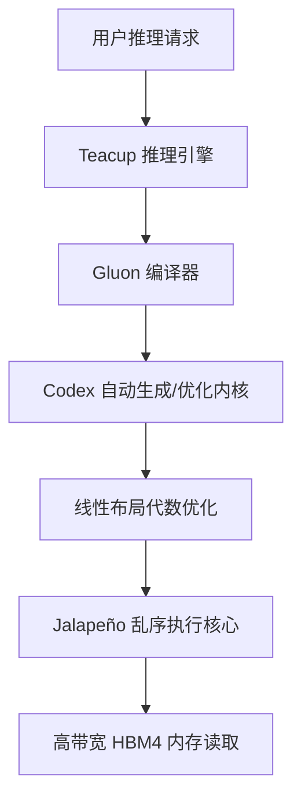

### 破除初代芯片平庸定律

在半导体行业的发展历程中，存在一个几乎被奉为铁律的不成文共识：任何一家企业研发的第一代芯片通常都不具备真正的市场竞争力。初代产品往往只承担验证设计路线和跑通流片工艺的实验性任务，只有到了第二代产品，才有可能真正上场参与商业竞争。然而，**OpenAI**近期在半导体领域的动作，彻底打破了这一被传统芯片巨头垄断的行业规律。在最新举办的**Hot Chips**（半导体行业顶级芯片大会：聚焦高性能微处理器及芯片架构的年度盛会）学术大会上，OpenAI正式亮出了其首款自研推理芯片，内部代号为**Jalapeño**（墨西哥辣椒）。令人瞩目的是，这颗芯片在多项核心基准测试中表现优异，其性能功耗比击败了英伟达几乎所有在产的同类竞品，成为行业关注的焦点。

这颗芯片的诞生并非空中楼阁，其研发历程最早可以追溯到2024年年中。当时，OpenAI选择与全球知名的半导体设计及供应链巨头**博通**（Broadcom：全球领先的模拟与有线/无线通信芯片设计公司）结成合作伙伴，在完全空白的图纸上，针对大语言模型推理任务进行定制化设计。令人惊叹的是，整个项目从团队组建、架构设计到最终流片，仅仅花费了大约16个月的时间。在**专用集成电路**（ASIC: Application-Specific Integrated Circuit，为特定应用需求定制设计的集成电路）领域，这种开发节奏可以说是极其激进且极其罕见的。通常情况下，一颗成熟的芯片从立项、设计、仿真、验证再到流片，保守估计也需要两到三年的周期，而OpenAI通过极佳的执行力将这一周期缩短了将近一半。

在外界的媒体报道中，普遍存在着一个针对Jalapeño的核心误解。许多跟进的新闻媒体引用了OpenAI在发布会上的几句随口描述，便得出结论称这颗芯片是专门为OpenAI自家模型定制和高度优化的，声称其他芯片跑不动的模型只有它能跑。然而，根据业界知名半导体研究机构**SemiAnalysis**受邀前往OpenAI实验室进行实地验证后发表的报告来看，这个说法是完全错误的。Jalapeño实际上是一颗具备高灵活性的**通用推理芯片**（General-purpose Inference Chip：能够高效运行多种不同网络结构和参数规模的大模型推理任务的处理器）。它不仅能运行OpenAI的内部模型，同样能够无缝适配各种开源大模型及多样化的AI工作负载。在实验室的现场演示中，OpenAI甚至半开玩笑地展示了在Jalapeño上运行经典三维射击游戏《毁灭战士》（Doom）的画面，而这个移植过程据说完全是借助其内部的**Codex**（AI辅助编程系统：利用代码大模型自动生成内核代码与系统驱动的工具）通过简单的提示词自动生成的。这充分证明了该芯片不仅在硬件上具备强大的通用计算能力，在软件和编译器的适配性上也达到了极高的水平。

---

### 重新定义能效评估标准

为了客观且精准地衡量Jalapeño在实际生产环境中的表现，OpenAI使用其自研的基准测试套件**InferenceX**（大模型推理能效基准测试：全面衡量硬件吞吐量、延迟以及能效比的测试工具）在实验室进行了多轮实测。在最核心的能效指标，即每兆瓦能耗下的**Token吞吐量**（Token Throughput: 单位时间内处理的文本基本单元数量）上，Jalapeño击败了测试榜单上的所有竞争对手。特别值得一提的是，这个优异的成绩是在Jalapeño没有启用**多Token预测**（MTP: Multi-Token Prediction，一次预测并输出多个Token以提升生成效率的技术）的情况下取得的，而测试图表中的其他芯片则全部使用了各自厂商的最优配置，并且全都开启了MTP功能。这意味着，在其他竞争对手都使出浑身解数、处于“满血”运行状态的前提下，Jalapeño即便相当于“单手作战”，依然在能效比上赢得了胜利。

如果将对比条件调整得更为公平，即所有参与测试的芯片都采用**单Token预测**（STP: Single-Token Prediction，传统的一次仅预测并输出一个Token的生成模式）进行横向对比，Jalapeño展现出来的技术优势则更加明显，直接将所有竞争对手甩开了一大截。在低并发的单用户应用场景中，运行**DeepSeek R1**模型时，Jalapeño跑出了单用户每秒超过700个Token的惊人成绩。需要强调的是，这一系列极其优异的性能表现，全部是在没有依赖**投机解码**（Speculative Decoding: 利用小模型快速草拟、大模型并行验证以降低生成延迟的算法）、没有进行**Prefill和Decode分离部署**（PD Separation: 将大模型推理的输入预填充阶段和输出生成阶段分别部署在不同硬件集群上的架构）的情况下实现的。除了DeepSeek R1之外，现场人员还看到了**Kimi K2.5**以及OpenAI内部测试模型**GPT-OSS**的运行数据，后者在Jalapeño上的运行速度更是达到了每用户每秒约1400个Token。同时，所有参与测试的模型在数学逻辑推理评估集**GSM8k**上的精度表现都与英伟达芯片完全一致，没有任何精度损失。

当然，在分析这些亮眼的数据时，有几个事实前提必须予以明确。当前所有的测试数据和技术图表都是由OpenAI官方提供的，虽然SemiAnalysis团队在实验室亲眼目睹了InferenceX在真实硬件上的运行过程，但他们并没有完整跑完所有的测试套件，也没有看到**AgentX**的完整测试结果。AgentX是比InferenceX更贴近真实复杂生产环境的测试套件，它包含了超长上下文和高频的多轮对话，能够更全面、更严苛地考验系统的**智能路由**（Routing: 根据请求复杂度分配算力资源的机制）和**前缀缓存**（Prefix Caching: 缓存公共Prompt前缀以避免重复计算的技术）等软件组件。此外，直接拿当前的Jalapeño工程样片与英伟达的**Blackwell**系列芯片进行对比也存在一定的不对等性。Jalapeño在设计上采用了目前最先进的**高带宽内存第四代**（HBM4: High Bandwidth Memory 4，提供超千兆字节每秒带宽的三维堆叠内存技术），因此它更合理的对标对象应该是英伟达同样采用HBM4内存的**Vera Rubin**系统。目前，英伟达的Vera Rubin已经开始向部分核心客户出货，而OpenAI的Jalapeño目前仍处于实验室的工程样品阶段。同时，本次测试所使用的模型也并非市场上体量最大、结构最前沿的旗舰级大模型，模型体量越大、结构越新，在全新硬件上进行移植和跑通的难度就呈指数级上升。

---

### 统一计算架构的技术抉择

为了深刻理解OpenAI自研芯片的立项初衷，必须理解他们为何如此执着于“性能功耗比”这一看似单一的技术指标。在当前大模型时代的军备竞赛中，像OpenAI这样的前沿实验室，其算力扩张的瓶颈已经不再是资金预算的多少，也不是机房物理面积的限制，而是数据中心所能获取的电力容量。因此，数据中心每兆瓦电力能够产出多少Token，直接决定了其商业化运营的效率和成本上限。英伟达创始人**黄仁勋**在2026年的Computex大会上也曾表达过类似的观点，他指出，在数据中心拥有固定电力供应（例如1吉瓦）的前提下，每一瓦特能耗所带来的Token吞吐量，本质上就等于公司的营业收入。英伟达在介绍Vera Rubin系统时，也展示了高度相似的收益曲线，强调全球数据中心建设已经全面进入“电力受限”的新常态。

然而，数据中心电力扩容的周期与GPU硬件采购部署的周期，在时间维度上存在着巨大的鸿沟。如果一家公司想要增加GPU的计算卡数量，从下单采购到上架运行可能只需要几个月的时间；但是如果想要对电网进行增容，则涉及与市政公用事业的互联、高压变电基础设施的改造、超大规模冷却系统的重建以及备用发电系统的设计，其周期动辄以年为单位计算。电网建设进度的缓慢已经严重拖累了硬件迭代的步伐，这也是为什么**xAI**的**Colossus 2**超级计算机集群在建设中大量采用了**表后发电**（Behind-the-meter Generation: 绕过公共电网，在数据中心附近直接建设并运行燃气轮机和发电机的自供电模式）方案，因为等待公共电网接入的时间成本是前沿AI公司无法承受的。

在这样严苛的背景下，即便与英伟达同样采用HBM4的Vera Rubin系统相比，Jalapeño依然展现出了极强的能效竞争力。在单Token预测模式下，Jalapeño每兆瓦能耗输出的Token吞吐量，已经超越了Vera Rubin在公开测试中开启多Token预测（MTP）和投机解码后的数据。在**总拥有成本**（TCO: Total Cost of Ownership，包括硬件采购、运营维护、电力折旧等在内的系统生命周期总成本）方面，两者目前处于基本持平的状态。但这其中隐藏着一个巨大的变量：投机解码算法在实际应用中通常能为推理系统带来3倍以上的成本改善，一旦Jalapeño在后续的软件升级中也正式部署了投机解码，其Token生成成本将会显著低于英伟达的Rubin系统。虽然这种TCO优势有一部分来自于博通提供定制设计服务的较低利润率，替代了英伟达原有的超高硬件利润，但更核心的优势依然来自于其创新的架构决策。

在架构设计上，Jalapeño做出了一个让SemiAnalysis团队颇感意外的抉择：它没有采用目前行业流行的Prefill和Decode分离部署方案，而是选择让草稿模型和主模型完全共用同一批芯片和同一套网络架构。虽然在输入输出比例完全固定的理想负载下，Prefill阶段和Decode阶段对硬件资源的诉求不同（Prefill属于计算密集型，Decode属于内存带宽密集型），将它们分离开来进行单独的硬件调优能够提升局部效率。但在真实的生产环境中，用户的流量和请求是瞬息万变的。随着AI应用从知识问答型模型向深度推理型模型，再向复杂的**AI智能体**（AI Agent: 能够自主规划、调用工具并执行复杂任务的智能实体）演进，输入长度、上下文缓存读写和输出Token的比例一直在发生剧烈变化。如果运营方提前将物理芯片划分为Prefill池和Decode池，一旦流量特征发生漂移，极易出现一端算力闲置而另一端严重排队的情况。而Jalapeño的统一架构设计确保了每一颗芯片都能随时服务下一个任意阶段的请求，彻底避免了资源浪费。更重要的是，分离部署会破坏数据的**空间局部性**（Locality: 处理器在访问数据时，倾向于在相邻时间访问相邻物理地址的数据特征），Prefill阶段生成的大量**KV缓存**（Key-Value Cache: 为了避免重复计算，将大模型自注意力机制中历史Token的键值对缓存起来的技术）需要跨网络传输给负责Decode的芯片，这会产生巨大的网络带宽消耗、同步开销和排队延迟，而Jalapeño的统一设计将这些开销降到了最低。

---

### 精密的微架构与芯片规格

从硬件规格的具体参数来看，OpenAI目前在实验室中测试和验证的主要是**A0步进**（A0 Stepping: 芯片研发初期用于功能验证的第一版物理硅片）的工程芯片，尽管该项目立项仅9个月，但性能更优的**B0步进**（B0 Stepping: 经过问题修复和性能优化后，准备用于量产的第二版芯片）已经送往晶圆厂进行制造。B0版本的Jalapeño将采用台积电最先进的**N3P工艺**（台积电3纳米制程工艺的性能增强版），单个计算芯粒能够提供高达13.4 PFLOPs的**MXFP4算力**（MXFP4 Precision: 一种新型窄精度浮点数值格式，用于在保证大模型精度的同时大幅提升算力密度）。作为对比，采用相同工艺和相似面积的英伟达Rubin计算芯粒，其算力为17.5 PFLOPs的NVFP4。然而，Jalapeño的**热设计功耗**（TDP: Thermal Design Power，芯片在最大工作负载下释放的热量和所需消耗的电功率）仅为700瓦，而英伟达Rubin的功耗则高达900瓦至1150瓦。这是因为Jalapeño的设计完全专注于AI推理而非模型训练，不需要为了追求极限的浮点算力而大幅推高芯片功耗。

在内存和I/O带宽方面，Jalapeño每个封装的HBM4内存带宽达到了惊人的15.4 TB/s，其**引脚速度**（Pin Speed: 内存接口芯片引脚的数据传输速率）达到了10 Gbps，略高于英伟达Rubin的9.6 Gbps，其高带宽内存极有可能由**三星**提供。这颗芯片的I/O传输通过一个采用台积电N3E工艺的独立I/O芯粒提供，集成了32路800G的**SerDes**（Serializer/Deserializer: 用于高带宽串行通信的串并转换器接口）。在这32路接口中，有24路用于机架内部的本地超低延迟互联，另外8路则用于机架之间的全局网络扩展，支持构建包含多达2048个计算节点的超大规模多机架计算域。OpenAI在2025年11月便完成了基于台积电**CoWoS**（Chip-on-Wafer-on-Substrate: 台积电主流的先进2.5D三维晶圆级封装技术）的流片，从流片到硅片唤醒并跑通软件仅用了短短3个月的时间，如此高效的硬件Bring-up速度在行业内堪称奇迹。

在具体的微架构设计上，Jalapeño的矩阵乘法引擎采用了与谷歌TPU类似的权重驻留**脉动阵列**（Systolic Array: 一种数据在寄存器网络中定向流动、与相邻节点协同计算的并行处理架构），并使用MXFP数值格式。但与谷歌TPU不同的是，Jalapeño支持更小的计算维度，因此在面对各种异形矩阵乘法（非规则的矩阵形状）时，不会像TPU那样因为矩阵维度不匹配而出现尴尬的零填充，从而避免了严重的性能断崖式下跌。此外，芯片内部还集成了64位标量核心以及FP32和INT32向量核心。OpenAI在设计过程中深度引入了**AI辅助芯片设计**（AI-assisted Chip Design: 利用大模型自动生成硬件描述语言代码并进行物理版图版图优化的技术）方法，使得SIMD计算单元的面积减少了8%，矩阵乘法引擎的面积减少了10%。Jalapeño整体架构的核心理念就是消除一切不必要的固定延迟和系统开销，使芯片在小Batch（小批量）推理和异形输入形状下，也能无限接近硬件的理论计算峰值。

为了在硬件层面实现这一目标，Jalapeño将计算核心与HBM内存划分为多个物理切片，每个计算切片都拥有自己本地的、超低延迟的HBM内存视图，切片之间则通过一条专用的高带宽**集合通信网络**（Collective Network: 用于芯片内部不同计算单元之间进行高性能数据同步的网络）进行连接。这种极简的内存层次结构使得Jalapeño在处理延迟敏感型推理任务时，相比于架构复杂的GPU具有天然的物理优势。GPU由于内存访问必须穿过层层复杂的缓存与内存总线，延迟极大，必须依赖极大的 Batch Size（批处理大小）来分摊和隐藏这些延迟。而在计算核心内部，OpenAI采用了支持**乱序执行**（Out-of-order Execution: 允许处理器不按程序指令的原始顺序、而是根据数据就绪状态并行执行指令的机制）的处理器核心，并配备了L1缓存。这与传统AI加速器通常使用的软件管理暂存存储器结合异步DMA的方案大相径庭。OpenAI的考量在于，通过乱序执行核心和硬件级别的缓存，可以彻底避免GPU上那些为了隐藏指令屏障延迟而不得不堆砌的高工作量。虽然这会更依赖数据预取的准确性，但在AI辅助设计和编译器优化的配合下，这一架构路径已被证明完全可行。

---

### 软件编译栈的颠覆性进化

硬件的强大只是成功的一半，对于自研芯片而言，软件和生态的构建往往是决定成败的生死线。为了彻底摆脱对英伟达**CUDA**（NVIDIA独占的并行计算平台与编程模型生态）的依赖，OpenAI采取了极其激进的策略——他们没有选择去兼容已有的老旧软件，而是从零开始构建了一套极其纯粹的软件栈。在Jalapeño的开发初期，OpenAI甚至像编写汇编语言一样，手写每一个核心计算内核的底层代码。部分核心内核的手写代码量长达3000行，并配有严密的正确性检查和自定义内存分析器。随后，团队将这一工作逐步移交给了内部加强版的Codex系统，并基于名为**Teacup**的内部推理引擎进行自动化迭代。这种自动化的代码生成能力令人惊叹，在Jalapeño跑通DeepSeek R1之前，其编译器内部甚至还没有人工编写的**多头注意力**（MLA: Multi-head Latent Attention，DeepSeek首创的一种通过低秩联合压缩降低KV缓存开销的高效注意力机制）内核实现，而Codex在没有任何人类内核工程师干预的情况下，便自动生成了功能正确且高度优化的MLA内核代码。

在编程语言层面，OpenAI专门为Jalapeño开发了一门名为**Gluon**的专有编程语言。Gluon构建在开源的**Triton**（一种用于编写高效GPU内核的开源领域特定语言）之上，保留了单程序多数据（SPMD）的编程模型，同时向开发者暴露了更底层的硬件抽象。Gluon最独特的设计在于引入了**线性布局代数**（Linear Layout Algebra: 一种利用数学形式化方法定义和转换内存中数据排布格式的理论），通过严密的数学证明来实现可证明正确的布局转换和最优的内存重排。在Gluon的执行模型中，每个程序都会被映射到一个持久化线程中，这暗示着芯片采用了高效的**持久化内核**（Persistent Kernel: 让计算内核常驻硬件执行单元，避免频繁启动和销毁开销的编程模式）编程范式，并配合解耦的数据预取和乱序执行单元，指向了一种纯粹的数据流式编程模型。

在系统集成和机架设计上，OpenAI展现了卓越的工程落地能力。整个系统采用了一种以食物命名的趣味命名体系。在物理机架层面，系统由一个CPU主机机架和一个ASIC计算机架配对组成。主机机架内部装有16个名为**Katsu**（日式炸猪排）的CPU托盘，每个Katsu托盘水平直连到右侧ASIC机架中对应名为**Vindaloo**（印度咖喱）的ASIC计算托盘。每个Katsu主机托盘配备了两颗AMD EPYC系列处理器、1.5 TB的系统内存以及大容量SSD存储，并通过8根外部PCIe直连铜缆与ASIC托盘进行超高带宽的物理互联。整个ASIC机架包含16个Vindaloo托盘和8个名为**Chana**（鹰嘴豆）的扩展交换托盘。每个Vindaloo托盘上集成了8颗Jalapeño芯片，整个机架共计128颗芯片，彼此通过高速铜缆背板连接至Chana交换机。

整个系统的功耗表现控制得相当出色。在实际生产运行中，CPU主机机架的功耗约为31千瓦，ASIC计算机架的功耗约为130千瓦，两部分合计的总功耗约为160千瓦，这基本相当于一个双倍宽度的英伟达GB300机架的功耗水平。在扩展网络方面，Jalapeño可以在单个扩展网络内连接多达2048颗芯片。机架内部的本地域采用6颗102.4T的Tomahawk 6交换芯片提供全连接，单向带宽达4.8 Tb/s；跨机架的全局域则通过铜背板、204.8T交换芯片和光路交换机组合，提供1.6 Tb/s的全局单向带宽。这种高弹性的网络拓扑设计仅占整个系统总成本的10%左右，但它为未来承载10万亿到20万亿超大参数规模的模型，以及支撑200万到400万Token的超长上下文窗口留出了极为宝贵的物理扩展空间。

Jalapeño的成功不仅代表着一颗芯片的诞生，更向整个半导体与人工智能行业释放出了清晰而震撼的信号：前沿的AI实验室凭借极致的软硬件协同设计，完全有能力在短短16个月内跨越传统芯片公司数十年的技术壁垒，做出初代即超越行业巨头的产品。更具戏剧性的是，设计这颗旨在动摇英伟达CUDA帝国的Jalapeño芯片的AI模型，本身正是运行在英伟达的GPU之上的。虽然Jalapeño距离2027年左右的大规模量产和百兆瓦级数据中心的实际落地还有很长的路要走，但这一技术路径的打通，无疑将促使整个大模型行业重新审视自研芯片的战略定位。