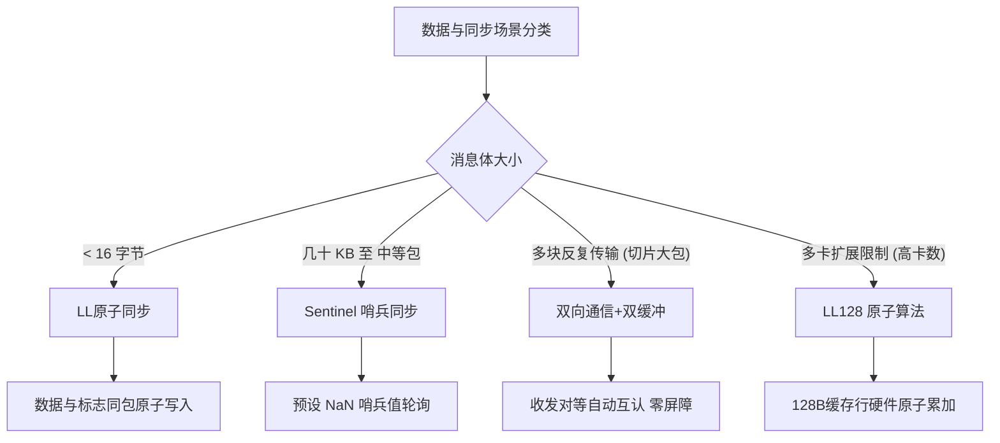

### 大模型推理性能优化的“隐藏角落”

在大语言模型技术高歌猛进的今天，当我们谈论**大模型推理性能优化**的时候，我们到底是在优化什么呢？回顾过去这一年多的行业讨论，大家最关注的焦点通常集中在硬件的账面参数和经典的算法策略上。例如，GPU算力是否足够强悍、显存容量与带宽是否足够庞大、模型量化能不能从8-bit压到4-bit甚至更省几个bit，以及**键值缓存**（KV Cache: 用于存储注意力机制中历史Token生成状态的缓存）的命中率和存储布局能不能再优化一点。这些优化维度当然都极其重要，也是让大模型能够跑起来、跑得省的核心基石。

然而，随着模型参数规模的急剧膨胀以及应用场景对生成速度（Token/s）的极致追求，大模型底层的系统架构正在悄然发生质变。就在最近，**英伟达**（NVIDIA: 全球领先的GPU与AI计算平台提供商）联合**苏黎世联邦理工学院**（ETH Zurich: 世界顶尖的理工科大学）发布了一篇极具震撼力的技术论文，标题非常直接且充满紧迫感——《每一微秒都很重要》（*Every Microsecond Counts*）。这篇论文将优化的目光投向了一个长期被主流视野所忽略、甚至很多人都未曾意识到其存在的隐形环节：当你的模型被拆分在多张GPU上协同运行的时候，这些GPU之间在进行高频的数据交换时，到底浪费了多少时间？

对于非系统层面的开发者来说，“微秒”是一个有些抽象甚至显得过于吹毛求疵的时间单位。一微秒仅仅是百万分之一秒，人类眨一下眼睛的功夫，几十万微秒就已经悄然流逝。如此短暂的时间，真的值得多位顶尖科学家专门写一篇长篇大论去死磕和挖掘吗？但是，如果你正身处大模型推理系统优化的第一线，你就会深刻地明白：在每秒需要处理海量请求的工业级推理集群中，这一微秒一微秒抠出来的通信时间，最终会直接转化为算力利用率的飞跃，进而演变成真金白银的运营成本差距。

---

### 张量并行与AllReduce：推理场景下的通信瓶颈

为了理解这几微秒的价值，我们首先必须把问题放入大模型部署的真实物理场景中。今天的主流开源大模型，无论是70B、405B还是更大规模的混合专家模型，其参数量之大，使得它们几乎不可能被塞进单张GPU的显存里进行高效推理。因此，**张量并行**（Tensor Parallelism: 将模型单层的权重矩阵切分到多张GPU上并行计算的技术）成为了标配。在张量并行模式下，模型的每一层权重都被切分并分布在多张不同的GPU上。当模型生成每一个Token时，每张GPU只负责计算自己分到的那一部分矩阵乘法；但在进入下一层的计算之前，所有GPU必须把各自算出来的部分结果相加，然后将这个累加后的完整结果同步分发给所有参与计算的GPU。

这个将部分结果求和并广播给所有GPU的集合通信操作，在高性能计算中被称为**全归约**（AllReduce: 在多个计算节点间对数据进行归约操作并将结果分发给所有节点的集合通信原语）。

在传统的大模型训练阶段，因为每次输入的数据量非常庞大（Batch Size很大），每次AllReduce操作需要传输的数据包体积极大，通常是几十MB甚至上GB。在这种情况下，决定通信效率的核心因素是**带宽**（Bandwidth: 单位时间内能够传输的数据量），也就是管道有多粗。

然而，到了大模型推理的生成阶段（Decode Phase），尤其是长上下文推理场景，情况就完全反过来了。超长的序列长度意味着KV Cache会吃掉绝大部分的GPU显存，这逼得系统无法开启很大的Batch Size，很多时候甚至是Batch Size等于1在运行。此时，每一步生成Token时，每张GPU产生的中间结果消息体积极小，通常只有几十到几百KB。当消息体积如此之小时，决定通信速度的不再是带宽，而是**通信延迟**（Latency: 启动并完成一次数据交互所需的等待时间）。换句话说，真正拖慢系统速度的，不是你的NVLink物理通道一次能传多少数据，而是一次通信请求发起之后，系统由于协调、握手和同步开销，需要等多久才能真正开始和结束传输。

这篇论文中给出了一个非常直观且具有说服力的实测数据：在包含4张GB200 GPU的先进硬件系统上，如果使用英伟达官方传统的**网络集合通信库**（NCCL: NVIDIA Collective Communications Library）中的Ring（环形）算法来做小消息的AllReduce，其通信延迟大概是11微秒。而研究团队通过全新设计的内核，成功将这个数字压到了惊人的2.37微秒。

2.37微秒是一个什么概念？论文作者专门根据GB200的硬件互联特性，计算了该配置下AllReduce所能达到的物理极限，即所谓的**光速下界**（Speed-of-Light Lower Bound: 硬件在完全消除软件开销时所能达到的理论通信极限延迟），大约在2.2微秒左右。这意味着，新方案做出来的内核，距离物理学意义上的绝对极限仅剩7%的系统开销（Overhead）。

你可能会问，从11微秒降到2.37微秒，省下来的也不过是区区8.6微秒，这能有什么本质改变？答案是：积沙成塔。大模型在推理生成每一个Token时，根据网络深度，往往需要执行几十到上百次这样的AllReduce操作。生成一个Token省下9微秒，生成一百万个Token累积起来的收益就非常可观。如果对于一个日均吞吐量达到万亿Token级别的头部大模型API服务商来说，这一微秒一微秒抠出来的效率，在规模效应下会放大成百万甚至上千万美元的电费与设备折旧成本差距。这笔账算下来，其工程价值无疑是极其巨大的。

---

### 全局内存屏障：被忽视的微秒级元凶

既然这省下来的几微秒如此关键，那么原有的NCCL等主流方案为什么做不到？这些被浪费的时间究竟丢在了哪里？

为了找到根本原因，论文团队对NCCL、NVSHMEM、MSCCL++以及知名推理框架vLLM中自带的自定义通信方案进行了极为严苛的剖析与对比。最终，他们将靶心锁定在了一个在并发编程中极为基础、但在高性能GPU通信中却成为最大瓶颈的操作上——**全局内存屏障**（Global Memory Barrier: 用于协调多处理器间读写顺序、确保内存可见性的同步机制）。

要理解什么是全局内存屏障，我们可以把多张GPU之间的协同通信想象成一群人围坐在一张桌子旁传纸条。为了确保大家在写纸条和读纸条时不会出错（比如某个人还没写完，另一个人就抢过去读，读到了错误或者残缺的信息；或者大家抢着往同一个地方写，导致内容覆盖），这群人必须引入一个同步信号。传统的并发控制策略就是使用显式的内存屏障：每张GPU在完成了自己当前阶段的数据写入后，会在公共共享内存中写入一个“我已完成”的状态标志，然后陷入等待。它必须不断轮询并等待桌子上的所有人都在各自的位置上写下“我也完成了”的标志，只有当所有GPU的信号全部到齐后，大家才被允许共同跨过这条界线，进入下一个阶段的数据读取和处理。

这种机制在逻辑上是无懈可击的，能够确保数据的绝对一致性。然而在微秒级延迟的尺度下，其代价太昂贵了。在GB200这样精密的硬件系统上，一次简单的全局内存屏障操作，其硬件本身的协调开销就高达1微秒左右。

更糟糕的是，很多AllReduce内核在一次完整的通信循环中，需要执行不止一次，而是**两次**屏障：第一次是“数据写完了，等待大家都写入完毕再开始读”；第二次是“数据读完了，等待大家都读取完毕再开始写下一轮数据”。这就意味着，光是用于维持秩序的屏障操作，就会直接消耗掉2微秒以上的时间。当一次小消息AllReduce的物理通信延迟本可以做到5微秒以内时，光是这几次屏障同步就硬生生霸占了40%以上的执行时间。

另一个对可扩展性（Scalability）致命的缺陷在于，全局内存屏障的开销并不是恒定的，它会随着参与计算的GPU数量增加而呈现出**超线性增长**的趋势。因为屏障本质上是所有GPU卡之间进行全对全（All-to-All）的状态信号传播与确认。卡数越多，需要等待的标志点就越多，硬件层面的冲突和协调成本呈指数级上升。当集群规模扩大到64张GPU时，仅仅是这道屏障本身的等待开销就可能飙升到数微秒。对于追求极速的现代推理系统而言，这层因为软件逻辑维持秩序而带来的开销是绝对无法容忍的。

因此，这篇论文要解决的核心技术痛点其实非常聚焦，用一句话概括就是：**如何在不破坏数据正确性、不引发数据竞争条件的前提下，在多卡集合通信过程中彻底干掉全局内存屏障？**

---

### 破局之道：无屏障同步的四大核心机制

针对这个极具挑战性的目标，论文团队展开了深入的研究，系统性地设计并提出了四种精妙的同步与数据传输算法。这四种机制根据数据包大小和卡数规模的不同，各有其独特的适用场景：

#### 1. LL（Low Latency）低延迟原子同步机制

这是专为传输极小尺寸数据包设计的方案。它的核心理念是将**数据与状态标志合二为一**。在LL机制下，系统将通信槽位（Slot）固定划分为16字节的颗粒。其中，前8个字节用于存放真正需要传输的计算数据，而后8个字节则用来存放控制数据有效性的状态标志（Status Flag）。

当发送方GPU向接收方写入数据时，它不是先写入数据再去发送一个通知，而是通过一条**原子写入指令**将这16个字节作为一个不可分割的整体一次性写入接收方的共享内存区。接收方GPU在读取数据时，只需要持续轮询这16字节内存块的后半部分标志。只要观察到标志位发生翻转或变更为目标状态，接收方就能以百分之百的确定性判定前8个字节的数据已经完整且安全地送达。这种巧妙的并包设计彻底免除了单独发送“数据已到达”通知的通信开销。但它的缺点也同样致命：由于16字节里有8字节用作了标记，其有效载荷（Payload）带宽利用率直接减半，因此只适用于极细碎的数据交换。

#### 2. Sentinel（哨兵）同步机制

为了克服LL机制带宽减半的问题，团队设计了面向中小数据包更通用的**哨兵同步机制**。哨兵机制的思路是利用特定的特殊数值作为数据状态的看门人。在通信开始之前，接收方的缓冲区会被预先填充一个在正常计算中绝对不可能出现的特殊值，论文中采用了特定模式的非数（NaN）作为哨兵。

接收方GPU在准备接收数据时，会直接对接收缓存区的目标地址进行轮询。只要轮询读到的值依然是这个预设的NaN哨兵，就代表发送方的数据还没送达；一旦发现该地址的值发生了变化（变成了一个合法的浮点数或非哨兵值），接收方就能立刻断定真实数据已经覆写完成，可以安全地读入并开始下一步计算。哨兵机制不需要在每个数据包里强行塞入一半的无效信息，因而完美保留了通道的满额带宽，更适合稍大一点的消息包。当然，它也存在运行限制：在下一轮通信开始前，缓冲区必须被重新初始化回哨兵值，且要确保传输数据本身绝不会恰好等于哨兵值，否则会导致接收方无限等待从而引发死锁。

#### 3. 双向通信与双缓冲（Double Buffering）机制

前面两种技术很好地解决了一次性数据交互的无屏障同步。但对于体量稍大、必须切分成多个分片进行多轮迭代传输的消息，又该如何防止跑得快的GPU提前写入、导致跑得慢的GPU还没读完的数据被覆盖呢？

研究团队在此引入了**双缓冲**机制，即交替使用两块独立的缓冲区（Buffer 0 和 Buffer 1）。然而，真正的创新在于消除了用于切换缓冲区的显式同步屏障。由于AllReduce操作通常是双向且对称的，GPU在把数据发送给对端的同时，自身也必须接收来自对端的数据。

基于这种对称性，算法做出了精妙的假设：如果GPU A成功收到了GPU B在当前迭代轮次发送过来的数据，这就在物理上证明了GPU B也已经推进到了当前轮次。既然GPU B已经到了这一步，它必然已经完成了上一轮次从GPU A处接收数据的读取工作。因此，GPU A可以安全地断定它在上一轮次使用的缓冲区已经被释放，能够无后顾之忧地直接将其覆写。每一次成功的接收，实质上就充当了下一次发送的安全许可证。这种收发状态的自组织互认，实现了迭代传输过程中真正的**零屏障**。

#### 4. LL128 原子算法

这是本篇论文在算法层面最引人瞩目的创新点，主要针对多卡（如64卡）规模下全局屏障开销超线性膨胀的难题。

LL128原子算法是一个两阶段设计，依次包含规约分散（ReduceScatter）与全收集（AllGather）。它深度绑定了英伟达最新硬件NVLink所提供的128字节缓存行（Cache Line）级别的**硬件原子加法**（Atomic Addition）能力。论文用了一个通俗的比喻：想象多个人要往一张共享便签纸上写下各自的数字并相加，LL128的做法是，将每个GPU的输入数据切分成以128字节（正好契合NVLink缓存行）为单位的块，每个块的前4个字节被开辟为原子计数器（Counter）。

所有GPU同时使用NVLink的硬件原子加指令，直接向共享内存对应块的相同位置叠加自己的计算数据，并在累加数据的同时顺便将计数器的值加1。由于原子操作在硬件层面上具有排他性和不可分割性，即使多张卡同时并发写入，也不会发生数据覆盖错误。此时，每个GPU只需要局部轮询该块对应的计数器。当读到计数器的值等于参与计算的GPU总数$N$时，就说明所有GPU的数据都已经成功累加进去了，此时求和结果就是绝对正确的，可以立刻拿走使用。这个计数器不再是需要大家停下来等齐了再走的全局同步信号，而是由硬件原子操作在数据累加过程中顺理成章、自然达成的一个同步状态。其同步开销不再随着卡数增加而急剧恶化，极大地释放了多卡集群的扩展性潜力。

---

### 统一原语与API设计：将算法转化为工程生产力

如果这些底层的算法需要每一位通信和系统工程师从头用CUDA去手写实现，那么其推广阻力无疑是巨大的。这篇论文的精妙之处不仅在于算法的突破，更在于它为工程界贡献了一套高度抽象、系统化的**可复用通信原语API**。

这套API围绕一个名为 `ncclLLBuffer` 的核心缓冲区对象展开，成功将LL协议、哨兵模式等复杂的底层内存读写细节与同步屏障逻辑封装在内部。对于上层开发者，它只暴露了极具表现力的线程级（Thread-level）API接口：

*   `send(destination, slot, value)`：向指定的对端GPU的特定槽位写入一个值。
*   `recv(source, slot)`：持续轮询对端特定槽位，直至数据有效后读出。
*   `recvReduce(sources, slot)`：同时从多个不同的对端GPU接收数据，并在读取的过程中直接在本地寄存器中完成归约求和，免去了多次写入和读取内存的往返开销。
*   `bcast(destinations, slot, value)`：向所有对端GPU广播数据，在硬件多播（Multicast）能力可用时会自动启用物理层广播。
*   `reset() / resetRange()`：重置缓冲区状态，为下一轮无屏障通信重新铺设哨兵。

这套原语的高效性在论文给出的实例代码中得到了完美的体现。仅仅使用大约**30行CUDA代码**，开发者就能够手写实现一个具备工业级性能的完整一阶段（One-shot）AllReduce内核。每个计算线程只需读取本地计算结果，广播给同伴，接着调用 `recvReduce` 把所有人的值当场归约，写回输出，最后调用 `advanceEpoch` 推进Epoch计数即可。这极大降低了高性能通信算法的研发和调试门槛。

基于这套高表现力的API，团队最终构建了三种专门应对不同应用场景的AllReduce变体：

| 算法变体 | 同步与缓冲策略 | 适用消息体积 | 适用多卡场景 |
| :--- | :--- | :--- | :--- |
| **一阶段LLBuffer算法** | LL或哨兵同步 + 双缓冲 | 64KB 以下极小消息 | 单机/少卡环境 |
| **两阶段LLBuffer算法** | 哨兵同步 + 双缓冲 | 64KB 至 1MB 中等消息 | 单机/少卡环境 |
| **两阶段LL128原子算法** | 硬件原子操作 + L2 Cache同步 | 小到中等消息 | 64卡等高卡数规模扩展 |

---

### 实测数据与业务红利：真金白银的成本优化

为了验证无屏障通信方案的实际威力，研究团队在英伟达最先进的 **NVL72 GB200 集群**上开展了严谨的基准与业务场景测试，对比对象涵盖了行业内的所有顶尖对手（包括NCCL最新对称内存内核、NCCLX CTran、NVSHMEM、MSCCL++，以及vLLM自带的Custom AllReduce）。

在微基准测试（Micro-benchmarks）中，小消息AllReduce延迟直接从NCCL环形算法的11微秒被砍到了2.37微秒，**平均加速比达到4.6倍**，几乎贴着物理极限运行。而在64卡的大规模分布式测试中，带有硬件多播优化的One-shot版本，虽然因为物理网络跨越NVSwitch等硬件导致延迟比光速极限高出70%，但在同等卡数规模下，它的延迟性能依然横扫了所有对比的通信库方案，表现出极强的扩展适应性。

更重要的是，研究团队将这些优化内核无缝集成到了目前最流行的LLM推理引擎 **vLLM** 中，并对三款具有行业代表性的前沿大模型进行了端到端的生成测试：

*   **Llama-3.1-70B**（标准稠密型大模型）
*   **DeepSeek-V3**（拥有海量路由的混合专家模型）
*   **Qwen3-Next**（采用混合注意力机制的新一代架构）

测试结果非常令人振奋：在单机4卡张量并行的部署配置下，模型的**Token间延迟**（ITL: Inter-Token Latency，即生成两个Token之间的平均等待时间）下降了7%到13%。在GB200算力租赁市场定价背景下，百万Token的推理算力成本被压低到了1.81美元的极限水平。

而在双节点8卡部署的跨节点通信场景下，Token生成延迟降低了9%到11%，**每百万Token能够直接节省超过11美元的算力成本**。

这是一个极其惊人的成本账本。对于任何日吞吐量达到数百亿Token、月吞吐量在万亿级别的大型AI服务商而言，采用这套底层通信优化，一个月在服务器带宽与电费上就能直接省下几十万甚至上百万美元。

此外，这套内核的红利不仅能被大模型吃饱，高性能科学计算（HPC）同样能大为受益。在瑞士国家超算中心（CSCS）的Alps超算集群上，研究团队使用该内核运行英伟达的分布式稠密线性代数库 `cuSOLVERMp`。在单节点4张GH200上运行广义对称特征值求解器，无论是32768还是65536的矩阵规模，新内核均带来了一致的系统加速。这充分证明了低延迟通信原语在更广阔的高性能计算生态中的普适价值。

---

### 方案边界与未来展望：在硬件演进中探寻极限

客观来看，这套极其惊艳的无屏障通信方案也有其特定的物理适用边界。

首先，本论文的研究基石是**同一个NVLink扩展域内**（NVLink Domain）的GPU集合通信。也就是说，它解决的是单台服务器内部，或者通过NVSwitch物理互联的高密GPU集群内部的高频小消息交互，并不能直接消除跨机房、跨广域网等宏观网络环境下的全部延迟。

其次，性能最强悍的LL128原子算法、物理多播机制以及对称内存（Symmetric Memory）特性，深度依赖于GB200、NVLink 5和NVSwitch等最新一代硬件提供的硬件特性支持。这意味着，手握老旧GPU集群的开发者并不能直接享受到最极致的优化加成，必须随着硬件架构的迭代才能逐步释放这部分红利。

然而，这篇论文背后的底层思维转变，才是对整个AI基础设施行业最重要的启示：在过去，人们一提到大模型推理优化，满脑子想的都是怎样压榨算力核心的流处理器、怎样用更激进的量化去压缩模型体积。但在大模型多卡分布式运行已成常态的今天，GPU计算之外的协调延迟——即内存同步是否高效、互联通道有没有跑满、GPU是不是常常在空等同伴，正在成为决定系统最终成本的决定性因素。

在系统软件的黄金时代，1微秒曾经被视作可以忽略不计的误差。但今天，在层层网络栈和高频的解码循环中，这1微秒的开销会被成千上万次地无情放大。未来的推理系统突破，不一定完全指望成倍增加的算力，有时候，仅仅需要我们想办法**让那几十张GPU，少等待彼此一小会儿**。