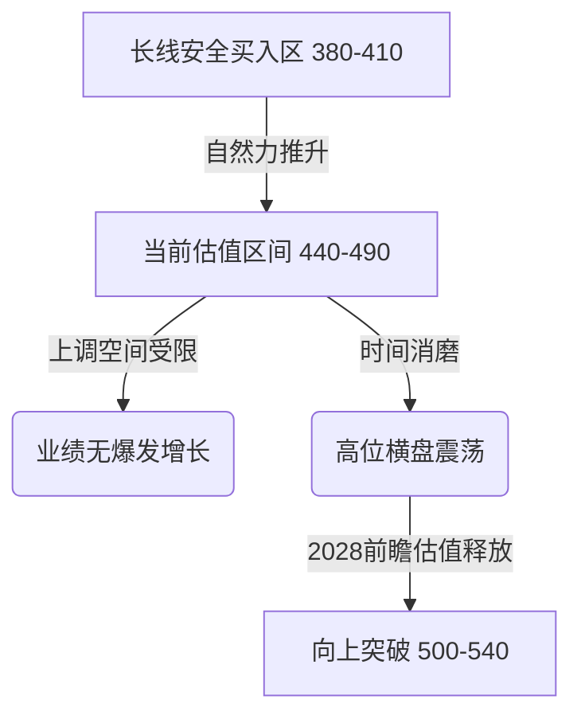

### 宏观就业数据边际变化与美股市场情绪

在当前美东时间2026年8月7日周五晚间，美股市场再次展现出极其独特的韧性。截止收盘，**标普500指数**（S&P 500 Index: 代表美国大盘股整体走势的基准指数）以及纳斯达克指数等四大股指悉数收高，其中以**纳斯达克100指数**（Nasdaq 100 Index: 汇集纳斯达克最大型非金融上市公司的科技股指数）领涨市场。然而，在指数逐步推升的表象之下，市场的成交量却呈现出连续第三个交易日萎缩的态势。这种“价格上扬、量能萎缩”的背离表现，将美股市场重新带回了一种极为经典的博弈格局，即市场参与者所俗称的“你不卖、我便不卖，小碎步缓慢往上推”的融涨状态。

从盘面的微观结构来看，标普500指数的成分股中，大约有三分之二的个股实现了不同程度的上涨。在其划分的十一个核心板块中，仅仅有两个板块录得下跌，其余九个板块则悉数收绿。这种普涨的格局在很大程度上依赖于日内公布的重磅宏观经济指标——**美国非农就业报告**（Non-Farm Payrolls: 反映除农业部门、私人家庭及非营利组织外就业人数变化的月度宏观经济指标）。

这一份出乎市场意料、表现显著疲软的非农就业数据，成为了推动今日资产价格走势的核心燃料。由于就业市场的走软，市场参与者迅速下调了对于**联邦储备系统**（Federal Reserve System: 美国的中央银行系统，简称美联储）未来加息的路径预期。这种鸽派情绪在货币市场与衍生品市场的定价中迅速发酵，不仅为股票价格的推升提供了坚实的估值分母端支撑，同时也推动了美国国债价格和黄金、白银等贵金属价格的同步走高，与此同时，美元指数则在鸽派定价的打压下应声走弱。

如果我们深入剖析这一份非农就业报告的具体细节，可以发现美国七月份的新增就业人数实际上减少了2.3万人。这一数据与此前市场普遍预期的“增加8万人”形成了极其强烈的反差。更令人瞩目的是，此前两个月的历史就业数据净值更是被大幅度向下修正了累计10.3万人之多。

在数据正式公布之前，华尔街的分析师们其实就已经预期到了本次报告可能会伴随着大幅度的数据下修。其底层的核心逻辑在于，六月份最初公布的就业数据在统计时仅仅基于了大约一半的调查回复率。当时，负责数据编制的**美国劳工统计局**（Bureau of Labor Statistics: 负责收集和分析劳工市场及价格数据的联邦机构）在实际回复不足的情况下，大量采用了数学模型的预测值来替代实际的报告数据。也就是说，六月份的初值在很大程度上是一个基于模型估算而来的虚拟数值。虽然市场早已做好了下修的心理准备，但下修幅度高达10.3万人的这一残酷现实，依然超出了绝大多数经济学家的预期。

在细分行业的表现上，疲软态势更加具象化。政府部门的就业人数在七月份减少了5.3万人，而一向作为吸纳就业主力的休闲和酒店行业，其就业人数也萎缩了4万人。此外，剔除政府部门后的私人部门就业人数同样表现欠佳，仅录得3万人的微弱增长，远低于市场先前预期的7.8万人。

在这一片疲软的就业数据中，唯一看似亮眼的是**失业率**（Unemployment Rate: 失业人数占劳动力总人口比例的指标）指标。七月份失业率意外降至4.1%，低于市场预期的4.2%。然而，通过拆解底层指标可以得知，失业率的微幅下降并非源于就业岗位的增加，而是由于**劳动参与率**（Labor Force Participation Rate: 经济活动人口占工作年龄人口的比例）下降了0.1个百分点，退步至61.4%。这意味着大量失去工作的人群选择直接退出劳动力市场，从而在统计口径上稀释了失业率的读数。

与此同时，工资增速数据也同样显得极其温和。平均时薪的环比增长率仅为0.1%，明显低于市场预期的0.3%。这导致年化工资增长率直接降至3.2%，同样低于3.5%的预期水平。由于时薪增幅放缓，劳动力成本推动通胀回升的系统性风险得到了极大程度的缓解。

在此数据落地后，货币市场上的利率互换合约显示，9月份美联储加息的隐含概率迅速从数据公布前的55%下降到了40%至44%的区间。这意味着在当前的宏观图景下，9月份继续加息的概率已经退化为小概率事件。当然，后续依然需要结合多组关键的通胀指标进行综合考量，以判断货币政策的最终锚定点。

---

### 数据中心资本支出周期的历史对比

在当前宏观环境下，自2024年以来蓬勃发展的数据中心与人工智能建设浪潮已经持续了接近三年的时间。在这段漫长的周期中，市场对于美国宏观经济韧性的判断始终在“陷入衰退”、“重新加速”、“高位减速”以及“再度怀疑”的怪圈中循环往复。要厘清这一波由**大语言模型**（Large Language Model: 基于海量文本训练的 AI 系统）和**高性能计算**（High-Performance Computing: 利用超级计算机和并行处理技术解决复杂计算问题的技术）所驱动的资本支出浪潮对美国国内生产总值（GDP）的实际贡献，我们必须将其与美国历史上两次著名的投资狂热进行系统性的量化对比：分别是二十世纪九十年代末至两千年初的**电信浪潮**（Telecom Boom: 世纪之交以光纤网络与互联网基础设施过度建设为特征的投资狂热）与**互联网泡沫**（Dot-com Bubble: 90年代末以互联网科技股估值过度膨胀为特征的资产泡沫），以及二零零五年前后的**房地产投资热潮**（Housing Boom: 二十一世纪初以次级贷款和住宅开发过度膨胀为特征的资产泡沫）。

我们可以通过三张反映历史资本支出占GDP比例变化的图表，来对当前的投资浪潮进行深度剖析：

```mermaid
gantt
    title 资本支出浪潮占 GDP 峰值对比
    dateFormat  X
    axisFormat %
    section 住房繁荣周期 (2005年峰值)
    住宅建设支出占比          :active, 0, 66
    section 当前人工智能浪潮 (2027-2029年预期)
    超大规模数据中心支出占比   :crit, 0, 30
    section 电信光纤建设周期 (2000年峰值)
    电信光纤建设支出占比      :0, 12
```

第一张图表展示了当前市场对于未来的主流预期。从2027年到2029年，超大规模数据中心的资本支出预计将每年占到美国GDP的约3%。而在这一波浪潮启动前，这一比例在2019年仅为微不足道的0.3%，即便在建设速度飞快的2025年，也仅仅占到GDP的1.4%。

第二张图表则将这组预期数据与二十世纪九十年代末的电信和光纤建设高峰期进行了对比。在两千年前后，以**思科**（Cisco: 世纪之交电信基础设施繁荣时期的绝对龙头与网络硬件巨头）为代表的科技巨头经历了巅峰时刻。然而，当时整个电信及光纤建设资本支出在GDP中的占比最高也只达到了1.2%，并在触及该峰值后迅速崩溃。这导致了投资浪潮的戛然而止，并与互联网泡沫的破裂产生共振，将美国经济拖入了温和的衰退之中。可以看出，当前数据中心预期的支出峰值（3%）是当年电信狂热时期的两倍有余。

第三张图表则引入了2005年住房市场繁荣周期的宏观占比数据。彼时，住房建设投资在GDP中的占比达到了惊人的6.6%峰值。与此相比，目前如火如荼的数据中心建设规模虽然庞大，但在宏观经济中的绝对占比仍旧不到当年住房繁荣时期的一半。

通过这三张图表的数据对比，我们可以得出以下多维度的宏观结论：

* **绝对规模介于两者之间**：当前进行的数据中心投资在GDP的绝对占比上，显著超越了当年的电信周期（是其峰值的两倍以上），但仍旧低于当年的住房繁荣周期（不足其峰值的一半）。
* **累计变化幅度前所未有**：在宏观经济学中，相比于单一时间点的占比高低，资本支出占比的**边际变化幅度**（Marginal Delta: 衡量指标变动速度和增幅的微观变量）才是决定GDP增长动能切换的决定性因素。从边际变化来看，本轮数据中心资本支出占比预计将从2023年的0.6%一路上升至2027年的3.1%，净增幅高达2.5个百分点。而在二十世纪九十年代末的电信狂热中，该支出的宏观占比增幅仅仅为0.4个百分点；即便在历时更长的 housing 周期中（自九十年代中期一路累积至2005年），其占比的累计增幅也仅为2.2个百分点。这意味着，本轮人工智能周期的资本支出规模在GDP边际拉动效应上，已经成为历史上面积最大的资本支出周期。
* **上行斜率极其陡峭**：在投资拉动的速度方面，当前的斜率更加惊人。数据中心资本支出预计在短短两年内（2025年至2027年）就要实现从1.4%到3.1%的跨越，增幅达1.7个百分点，折合每年提升约0.85个百分点。作为对比，当年住房市场在最狂热的加速阶段（2002年至2005年），其占比从5.1%攀升至6.6%，三年累计增加1.5个百分点，年均增幅仅为0.5个百分点；而电信浪潮的年均占比增幅仅为0.15个百分点。因此，当前AI周期的建设速度几乎是当年住房繁荣最快阶段的近两倍。

这种短期内极高斜率的资本支出攀升，为整体宏观经济注入了极强的增长动能，也是近年来美股能够持续处于牛市通道的关键基本面支撑。然而，历史的经验告诉我们，任何陡峭的投资曲线都将不可避免地迎来峰值、繁荣平台期以及随后的退潮期。

在投资曲线斜率极高的情况下，退潮的速度将决定整体经济与市场的命运。只要行业在见顶后不发生毁灭性的资本大撤退，而是呈现出一种缓慢、平稳的坡度下行，宏观经济便能够通过其他产业的增长来消化这一空缺，实现所谓的“软着陆”。

然而，一旦出现类似前两个周期的暴烈式退潮，风险将呈几何级数放大。在二零零六年初，住宅建设支出在GDP中的占比尚在6.2%的高位，但到了二零零八年底，这一比例便以极快的退坡速度腰斩至3.0%，直接诱发了席卷全球的金融海啸，导致标普500指数在2008年全年暴跌38%。而两千年前后电信支出的快速退潮虽然绝对额度较小、对实体经济的拖累较为温和，但由于叠加了权益市场的估值泡沫破裂，同样导致标普500指数从两千年初至二零零二年间累计录得了高达44%的巨大跌幅。

---

### 人工智能货币化进程与2028风险前瞻

随着时间不断向2027年以及2028年推进，我们需要开始提防这种陡峭的资本支出曲线在进入繁荣后期的潜在变数。根据历史周期的映射，资本市场的博弈往往领先于实体经济6到12个月。如果我们在2027年下半年或2028年初观察到大型科技公司的资本支出出现过快、过猛的下修迹象，那么春江水暖鸭先知，美股市场极有可能会提前做出剧烈的反应。特别需要注意的是，2028年本身作为大选年，地缘政治与国内政策的博弈本就会显著放大市场的波动性。

在这种宏观叙事下，数据中心建设的可持续性将完全取决于一个核心的前提条件：**AI货币化**（AI Monetization: 将人工智能技术转化为可持续商业收入与利润的过程）的进程必须能够跟上资本支出的步伐。

如果下游的软件应用与服务无法产生足够多的商业化收入来证明上游硬件投资的合理性，那么超大规模云厂商在面临现金流压力时，将别无选择，只能大幅度缩减对于芯片、服务器以及光纤网络的采购。

令人欣慰的是，从最新披露的二季度财务报告来看，四大科技巨头中至少有三家公司的人工智能货币化进程推进得相当顺利，这使得它们在现阶段能够继续维持甚至小幅调升未来的资本支出指引。在扎实的业绩支撑下，以**费城半导体指数**（Philadelphia Semiconductor Index: 衡量全球半导体设计、制造与销售龙头企业表现的行业指数，简称费半）为代表的半导体板块，其底层逻辑依然十分坚实。

因此，对于半导体板块，投资者不应当盲目期待其会出现无序的、非理性的崩溃性大跌。这一轮由业绩驱动的半导体行情与两千年的互联网泡沫存在着本质的区别，当时大批毫无营收的“点康”公司单纯依靠叙事便获得了天文数字的估值，而如今的芯片巨头们则拥有着实打实的利润和惊人的自由现金流。

虽然半导体板块在技术层面上目前在580点这一重要阻力位下方承压，且市场在追高之后产生了一定的筹码分歧，但其作为未来股市上行核心发动机的地位并未发生动摇。在标普500指数与纳斯达克指数相继创出历史新高的背景下，半导体板块与软件板块的短期承压更倾向于是一次良性的、针对前期过度拥挤交易的筹码交换与估值溢价回吐。

在操作层面上，正确的节奏应当是：在市场情绪过热、股价短期急速攀升且技术指标极度超买时，切忌过度盲目追涨，应当主动控制杠杆并适度落袋为安；而在行业经历健康回撤、溢价充分释放之后，则不应过分看空，而是应当在估值底部的筹码密集区耐心分批买入，等待行业基本面的重新点燃与技术面阻力位的最终突破。

---

### 重点个股前瞻估值与技术策略分析

为了更精准地指导实际的投资操作，我们将对几只市场高度关注的核心个股进行前瞻性估值模型与技术图表策略的系统性更新。

#### 1. 联合健康集团（UnitedHealth Group, 股票代码：UNH）

作为美股市场防御性权重股的代表，**联合健康**在过去几个月的走势完全符合我们在四月份做出的结构性预判。当时我们明确指出，UNH在突破下方的平台整理区域后，将一路上攻至440美元至490美元的核心价格区间。然而，一旦股价步入该右侧区间，进一步向上推升的阻力将变得极其巨大。

从最新的前瞻估值模型来看，我们虽然对其盈利预期做出了一定程度的微调，但整体升幅并不大。在当前的业绩增速背景下，如果股价盲目冲破490美元甚至站上500美元，那么其**市盈率**（Price-to-Earnings Ratio: 评估股价水平是否合理的指标）将进入显著高估的区域。资金在缺乏业绩边际加速支撑的情况下，很难有动力在此处发起持续的逼空行情。

因此，联合健康近期的阴跌走势实际上是一种良性的“时间消磨”过程。由于自然力的时间窗口尚未完全打开，股价需要在这个区域通过反复的震荡整理来等待二八年前端估值数据的逐步释放。一旦2028年的业绩预期上调10%左右，其估值上限将自然推升至540美元附近，届时向上的技术突破将水到渠成。对于长线投资者而言，我们在图表上标出的下方380美元至410美元区域依然是极其安全且坚实的长线建仓位置，建议多给予这只慢牛股一些时间。

#### 2. Shopify（Shopify, 股票代码：SHOP）

针对**Shopify**这只高成长弹性的电商SaaS龙头，我们本次不对其财报的微观细节做过多展开，而是聚焦于其最新的前瞻估值逻辑与技术边界。

在估值模型上，我们目前给予Shopify处于其历史高增长阶段相匹配的60倍高额前瞻乘数。基于此乘数测算，其二七年估值的合理上限大约锚定在135美元。这意味着，即便股价经历了一定程度的回调，它在当前的绝对价格层面上依然处于轻微的高估状态，只是相较于其他科技股而言，其高估的溢价幅度已经在可接受的范围内。

在技术面上，Shopify当前最关键的右侧技术分水岭清晰地设立在158美元。一旦多头能够带量突破并站稳在158美元上方，上方的空间将被彻底打开，其下一个中长期的目标将直接锁定在历史新高。

从近期的日线形态观察，虽然财报公布后股价录得跳空高开，但随后并未出现见顶的抛售信号，而是呈现出一种高位缩量横盘的强势整理特征。这表明获利了结的筹码正在被多头从容消化。投资者后续需密切关注158美元的防线，若开盘直接跳空站上该位置，动能将瞬间爆发。而在下方，123美元至128美元区域则构成了强劲的技术与估值双重支撑带。

#### 3. ServiceNow（ServiceNow, 股票代码：NOW）

企业级工作流软件巨头**ServiceNow**在今日成功上演了完美的右侧突破行情。此前我们为市场设定的关键突破买点位于120美元，而今日该股直接以121美元跳空高开，完成了极其强势的跳空突破。在技术分析中，无论是突破还是跌破，以日内开盘价的实际站位为准都是最不易被虚假信号欺骗的研判标准。

突破之后，NOW的股价全天牢牢企稳在高位，放量明显，展示出机构资金强烈的做多共识。针对这一波右侧趋势行情，我们对其支撑与阻力区间进行了多维度的更新：

* **近期整理区间**：125美元至140美元构成了当前股价的直接摩擦带，市价在此处可能会经历短暂的技术性整固。
* **中期目标阻力区**：147美元至159美元是多头在推进过程中首个面临实质性阻力与波段分歧的“赤涨”阻力区。
* **远期极限目标区**：180美元至193美元。若将本轮上行结构全部跑满，180美元至193美元将是这波大级别右侧行情的极限阻力位置。

需要强调的是，这种大级别的结构位突破并不能在短短两三周内一蹴而就，它必须伴随着后续季度业绩的持续兑现。根据前瞻估值，即便给予其30到40倍的高倍估值，其2027年的上限估值也仅在200美元附近。因此，若股价在短期内因情绪推升而急速冲向180美元至193美元，则极易引发估值层面的严重超买，波段交易者应当在此区间果断执行利润锁定。

对于入场点而言，由于突破之后股价与下方强支撑拉开了空间，目前在124美元附近进行波段操作的止损位置相对尴尬（跌破110美元才算趋势走坏，空间达14美元，而向上的第一阻力仅在147美元，盈亏比并不理想）。但从基本面角度看，基于2027年100美元的低倍估值下限，100美元至120美元区间是极为难得的长期安全建仓点，股价一旦在此处获得支撑，想要进一步跌穿并下探至82美元下方的概率极低。

#### 4. 英伟达（NVIDIA, 股票代码：NVDA）

最后，对于全球人工智能算力的绝对核心**英伟达**，目前各项日线与周线级别的技术指标均维持在极佳的良性运行状态中。虽然日线级别随着连续的上涨正在逐步逼近超买区域，但这并不构成投资者盲目做空的理由。

在强劲的趋势行情中，超买的修复往往通过“以涨代跌”的横盘整理或连续创出新高来完成，尤其是在日线级别并未出现**技术背离**（Divergence: 股价创出新高而技术指标未能同步创出新高，暗示动能衰竭的现象）的情况下，超买仅仅是一个情绪高涨的警示，而非趋势反转的信号。

我们维持对于英伟达趋势结构的长期判断：一旦股价能够有效突破216美元这一关键的结构阻力位，整体图表形态将正式确立“上看新高”的右侧看涨逻辑，上方236美元的历史高点将被多头彻底踏在脚下。

由于目前市场的量能无法支持股价进行无序的暴烈拉升，英伟达以“时间换空间”、缓慢爬升的方式去完成均值回归才是最稳妥、最健康的牛市走势。在周线级别金叉已经确立、月线级别**相对强弱指数**（Relative Strength Index: 衡量价格涨跌幅度以评估资产超买或超卖状态的指标，简称RSI）依然具备充足上行空间的前提下，投资者最好的策略是摒弃频繁的短线波段操作，坚定地在中长期持股以迎接新高的到来，避免因微小的技术性回撤而丢掉手中宝贵的核心资产筹码。