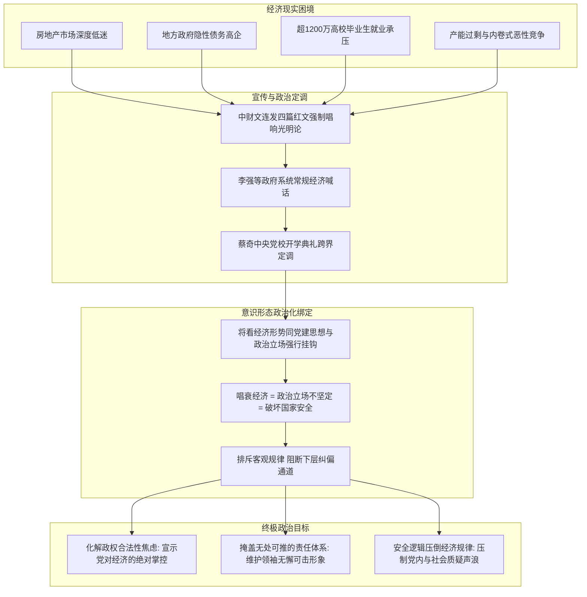

### 全球宏观经济超级周：五大核心经济指标前瞻与央行政策博弈

在新的一周开启之际，全球资本市场迎来了一系列决定未来货币政策走向的关键经济事件与重磅数据发布。纵观未来一周的全球宏观经济日程，有五个最为核心的经济节点值得深入观察与追踪。这些数据不仅直接关系到各大主要经济体的复苏动能，更将成为美联储、欧洲央行以及日本央行在即将到来的议息会议上制定利率政策的关键定价依据。

首先，本周最为重磅的超级数据当属周五（9月4日）美国劳工部即将发布的8月份**非农就业报告**（Non-Farm Payrolls: 衡量美国非农业部门就业人数变化的月度宏观数据）。在美联储已明确将当前货币政策的重心由单边抗击通胀转向兼顾就业市场稳定的大背景下，这份报告中的非农新增就业人数、失业率以及平均时薪的表现，都将直接决定并主导市场对美联储9月中旬联邦公开市场委员会（FOMC）利率决议的预期与定价。特别是考虑到在9月例会召开之前，美国官方将不再发布其他同等重量级的宏观经济数据——对美联储的决策层而言，其核心聚焦的两大指标分别是非农报告与**个人消费支出物价指数**（Personal Consumption Expenditures Price Index / PCE: 美联储最青睐的核心通胀衡量指标），而8月份的PCE数据要在美联储9月议息会议之后才会正式出炉，因此周五出炉的非农就业数据几乎将对美联储9月份是否降息或降息幅度起到一锤定音的关键作用。

紧随其后的是制造业与服务业景气度的前瞻性检验。在周二与周四，美国供应管理协会（ISM）将分别公布8月份美国的制造业与服务业**采购经理人指数**（Purchasing Managers' Index / PMI: 衡量制造业和服务业经济健康状况的综合领先指标）。在这两项数据中，尤其需要重点关注的是周四发布的服务业PMI。鉴于服务业在美国国内生产总值（GDP）中的占比接近80%，该数据将成为全球投资者研判美国第三季度中旬内需动能强弱、评估服务业成本上升压力与整体经济韧性的最关键先行指标。

将视线转向欧洲，9月1日（周二）欧元区将发布8月份**消费者物价指数**（Consumer Price Index / CPI: 衡量居民消费商品及服务价格水平变动的宏观指标）初值。对于定于9月10日召开议息会议的欧洲央行（ECB）决策委员会而言，这是会议前公布的最后一份重磅通胀数据。在近期举行的杰克逊霍尔（Jackson Hole）全球央行年会上，欧洲央行高级官员已直言不讳地对外释放信号，指出9月份极有可能继续推进加息步伐。因此，市场观察的焦点在于：只要欧元区8月份的整体通胀数据没有出现超预期的显著下行，欧洲央行在9月10日落地加息的政策基调就不会发生动摇。

亚洲市场方面，周五（9月4日）日本总务省与厚生劳动省将联合发布一系列关乎民生的核心经济数据，其中最受瞩目的当属7月份**实质薪资与家庭支出报告**。这组数据将对日本央行（BOJ）是否下定决心在10月份实施进一步加息产生决定性影响。近期国际资本市场高度关注美日两国在过去一个月中联手耗资逾900亿美元在外汇市场干预、力挺日元汇率的行动，然而干预措施的效果并不理想；要从根本上扭转日元疲软的颓势，迫切需要日本央行在利率政策上做出更具突破性、更加鹰派的紧缩调整。然而日本央行一直在等待内生性经济动能的确认，周五出炉的薪资与物价能否形成良性循环的实质证据，是日本央行决策者不可或缺的前提条件。

与此同时，中国在未来一周也将陆续公布两组PMI数据，成为评估中国第三季度经济增长动力及9月份走势的重要风向标。按照既定日程，周一上午9时30分，中国国家统计局将公布官方制造业与非制造业（服务业）PMI；周二则将发布主要反映民营与中小企业运营状况的采购经理人指数。尽管相较而言未来一周属于中国宏观经济数据发布的相对淡季，但综合全球视野来看，本周全球金融市场的核心焦点仍将高度锁定在周五美国非农就业报告的最终揭晓上。

### 喜马拉雅山特大泥石流灾害：跨境救援困局与信息透明度争议

自然灾害与地缘环境方面，喜马拉雅山脉中尼边境地区近日遭遇了一场罕见的特大冰川崩塌与泥石流灾害。综合路透社及多方现场报道，由冰川失稳引发的灾难性山洪与泥石流造成了极其惨重的人员伤亡与基础设施损毁，搜救人员正在恶劣的气候条件和持续暴涨的水位中奋力搜救幸存者与失联人员。截至周日，确认的遇难人数已逼近800人关口，另有超过3000人处于失踪状态。

灾难爆发于周三，由特大冰雹、巨型岩石、高浓度泥浆与碎石组成的毁灭性洪流顺着狭窄陡峭的山谷奔腾而下，以惊人的速度席卷了尼泊尔与中国西藏边境交界地带的山谷村落与河流两岸。红十字会初步评估显示，受这场极端灾害直接影响的人口已超过9万人，中国科研机构也迅速将此次灾害的成因与全球**气候变迁**（Climate Change: 全球气候变暖导致的冰川消融与极端天气增多现象）导致的冰川脆弱性加剧关联起来。根据尼泊尔国家灾害管理部门发布的统计通报，仅尼泊尔一侧已有781人遇难、2502人下落不明；而中国官方通报显示，西藏自治区吉隆县境内有16人遇难、546人失联，北京方面同时证实，在紧邻尼泊尔边境的西藏重要过境口岸区域，共有来自23个国家的261名外籍公民目前处于下落不明的状态。

由于喜马拉雅山区地形极其险峻狭窄，加之灾后连降暴雨导致特里苏里河（Trishuli River）水位急剧暴涨，现场搜救工作遭遇了前所未有的困难与次生灾害威胁。当地警方透露，由于水位持续攀升，救援人员与沿岸居民被迫多次向更高地势紧急转移。当前尼泊尔境内的搜救重点高度集中在5座被泥石流严重淹没或冲垮的水力发电厂项目上，尤其是特里苏里水电站项目工地。根据现场调度指挥部掌握的线索，至少约有350名施工作业人员被困在深层作业隧道内无法脱身。尼泊尔军方已动用重型直升机向交通阻断的偏远灾区空投重型挖掘机械与破拆设备，救援先头部队已艰难抵达其中一条主隧道的入口处，正全力清理堆积如山的巨石与泥沙残骸，待通道结构确认安全后，配备便携式氧气装置与红外搜救摄像机的高级搜救队将立即深入隧道内部展开搜救。

面对空前的灾难，尼泊尔外交部发言人切特里公开呼吁国际社会提供特定专业领域的紧急技术援助，涵盖地下隧道攻坚搜救、大规模法医DNA比对、遇难者遗体冷冻保存及高度腐烂遗骸的法医身份鉴定等。截至周六，尼泊尔地方当局已对96具无法辨认身份的遇难者遗体进行了集体安葬，并筹备在周日继续安葬另外100余具遗体。参与搜救的警官坦言，现场寻获的遗体由于遭受极端外力撞击与泥石冲刷，超过半数以上已经面目全非。中国科学团队的模拟测算指出，尼泊尔一侧爆发的特大泥石流以极高流速倾泻，仅用了6至7分钟便冲抵吉隆口岸，现场监控视频记录下了滔天泥石洪流瞬间吞噬大批建筑物、人群惊恐四散奔逃的惨烈画面。

针对中方一侧的灾情通报与应对表现，路透社在专项分析报道中指出了国际社会关注的三个焦点与深层质疑：
1. **数据通报缺乏现场动态细节**：中国官方在灾情发生后虽迅速通报了西藏吉隆县16人死亡、546人失联的静态数字，但通报完全依赖新华社统一口径的定稿电讯，缺乏灾区现场的具体救援进展、地质次生灾害动态以及多方独立交叉验证的开放渠道。
2. **长期信息封闭机制阻碍独立核实**：在此次重大跨国灾害中，灾区信息传播再次遭遇了制度性“信息墙”。长期以来，外国主流媒体、独立非政府组织（NGO）及国际专业救援机构进入西藏地区均面临极其严格的行政审批与准入壁垒。在此次报道中，国际媒体（如法新社、路透社、美联社等）只能在尼泊尔一侧深入特里苏里河谷、加德满都转运医院以及灾民安置点，面对面采访遇难者家属、军方一线指挥员及水电站幸存工人；而中方一侧的具体灾情与被困人员处境，外界始终难以获取真实全面的第一手信息。
3. **边境跨境工程与隧道安全黑箱**：在中尼边境的水电开发与基础设施建设热潮中，双方均在沿线山谷大规模开挖深层隧道。尼泊尔一侧的水电站分布、隧道开凿规模及受灾受损情况均向公众和国际媒体完全公开，而国际观察组织指出的中方在周边区域密集施工的多条关键深水或引水隧道的实际受损程度与人员被困状况，外界至今无法获知任何独立透明的有效信息。这种重大自然灾害应对中的信息封锁与不对称，再次折射出地缘政治管控机制对灾情透明度的深层压制。

### 冰岛公投否决重启入欧谈判：地缘安全诉求与海洋渔业利益的现实博弈

在欧洲政治与地缘版图演变方面，《华尔街日报》报道了一起对欧洲一体化进程带来重大冲击的政治事件：北欧岛国冰岛在竞争极为激烈的全民公投中，正式否决了政府关于重启加入**欧洲联盟**（European Union / 欧盟: 由欧洲多国组成的政治经济一体化国际组织）谈判的提案。这一投票结果不仅粉碎了冰岛现任政府推动入欧的多年努力，更彰显了该国在国家核心经济利益与欧洲超国家主权治理之间的坚定选择。

冰岛这个仅有约40万人口的北极战略要地，围绕是否融入欧盟大家庭的政治辩论已持续了十余年之久。尽管公投前夕的早期民调曾预测支持重启入欧谈判的阵营将以微弱优势胜出，但随着投票日的临近，选民的真实立场发生了决定性逆转。最终计票结果显示，在高达82.5%的合格选民投票率下，52.8%的选民投下了反对票，支持重启谈判的选票仅占47.2%。冰岛总理弗洛斯塔多蒂尔（Frostadóttir）在随后的官方新闻发布会上坦言，这次公投给执政当局带来了极为深刻的政治启示——冰岛民众对目前通过与挪威、列支敦士登共同签署《欧洲经济区协议》（EEA）所确立的既有合作框架感到高度满意，冰岛政府未来将继续立足于该协议深化与欧盟的紧密伙伴关系，而非寻求全方位的政治一体化。欧盟委员会发言人随后亦发表声明，表示充分尊重冰岛人民的民主抉择，并强调冰岛仍将是欧盟不可或缺的核心盟友。

深入剖析冰岛公投否决入欧的深层逻辑，可以从四个维度全面拆解这一重大地缘经济抉择：
* **存量制度红利锁定了极低风险决策空间**：冰岛之所以在临门一脚的关键时刻拒绝跨入欧盟大门，核心原因在于其现行与欧盟的关系模式已经让其近乎完整地享受到了欧盟大市场的绝大部分核心红利。作为《欧洲经济区协议》的缔约国以及**申根区**（Schengen Area: 欧洲取消内部边境管制的国家联盟）成员，冰岛在商品贸易、服务贸易、资本流动以及人员自由往来四大自由支柱上，已全面对接欧盟统一大市场。无论是欧洲大陆游客赴冰岛旅游带来的庞大外汇收入，还是跨境商业合作与投资引流，冰岛均已稳健获取。因此，拒绝全面加入欧盟并不会导致冰岛失去现有的经济利益，这本质上是一个维持高收益、免受新约束的低风险理性决策。
* **捍卫海洋渔业自主权与排斥超国家行政干预**：冰岛人有着极为精明务实的产业算盘。一旦正式加入欧盟，冰岛必须强制接纳欧盟的**共同渔业政策**（Common Fisheries Policy / CFP: 欧盟对各成员国捕捞配额、水域准入和渔业资源进行统一管制的制度体系）。渔业作为冰岛历久弥坚的支柱性产业与经济命脉，冰岛绝不容许将本国富饶的专属经济区捕捞水域向欧盟其他成员国敞开，更无法容忍布鲁塞尔的技术官僚对冰岛的捕捞配额实施指令性再分配。在既有贸易好处一样不少的前提下，全面入欧却要平白让渡渔业控制权，这对于冰岛社会而言是绝不可接受的亏本买卖。
* **城乡认知割裂导致的民调预期偏差**：欧洲主流舆论此前之所以对公投结果感到意外，主要源于民意调查采样中显现的结构性盲区。在首都雷克雅未克等城市化中心，受教育程度较高、从事现代服务业与跨国业务的群体普遍倾向于支持加入欧盟以获得更广泛的欧洲公民身份认同；然而在广袤的沿海渔村、农牧区及外围乡镇，依赖海洋资源与初级产业的选民则呈现出压倒性的反欧立场。这种“都市精英与乡村基层”的深刻认知断层，在欧洲多国选举中反复上演，并在冰岛公投中再次得到了淋漓尽致的体现。
* **欧洲右翼疑欧浪潮提振与北极地缘安全战略受挫**：冰岛公投的结果对整个欧洲政治生态产生了深远的外溢效应。对于法国、英国、德国等欧洲主要国家内部的极右翼政党与**疑欧主义**（Euroscepticism: 对欧洲一体化进程和欧盟超国家权力持怀疑、反对立场的政治思潮）势力而言，冰岛的拒斥无疑注入了一剂强心针，进一步助长了反对布鲁塞尔集权管制的民粹声浪。更为深远的是，在地缘战略层面，随着气候变暖导致北极航道商业价值与军事战略地位空前提升，各大地缘大国在北极地区的角逐日趋白热化。欧盟长期渴望通过正式吸纳冰岛，将其安全防线与战略触角稳固延伸至北极核心圈；冰岛公投的否决使欧盟这一重大地缘雄心遭受了沉重打击，欧洲在极地地缘博弈中的战略布局被迫面临重新调整。

### 极端政治极化与反噬：米罗·杨诺普罗斯遭驱逐出境的戏剧性逻辑

在美国国内政治与跨大西洋舆论场，发生了一起极具政治讽刺意味与戏剧性冲突的突发事件。据彭博社及多家美国主流媒体报道，现年41岁的英国极右翼政治评论员**米罗·杨诺普罗斯**（Milo Yiannopoulos: 曾活跃于美国极右翼民粹阵营的知名英国籍网红与政治活动家）已被美国联邦执法机构正式逮捕并强制遣返回其祖国英国。

美国国土安全部（DHS）官方发言人证实，杨诺普罗斯是在路易斯·阿姆斯特朗新奥尔良国际机场准备离境时，被美国移民与海关执法局（ICE）执法人员当场抓获并迅速启动遣返程序的。官方通报指出，杨诺普罗斯早在2019年5月持合法签证入境美国，但在签证到期后长期非法逾期滞留，严重违反了美国移民法案的相关规定；此后他不仅多次缺席移民法庭的例行听证会，更在联邦法官于7月22日依法签发最终驱逐令后潜逃避匿。极具讽刺意味的是，杨诺普罗斯长期以来一直以极端强硬的反移民政治姿态自居，在各类公开集会与网络言论中，他甚至公开倡导推行比川普政府更为激进严酷的移民执法手段，包括主张在全美各大民生超市入口处常态化设立ICE武装检查站以盘查行人物流。

这一事件之所以在全美政治圈引发轩然大波，根本原因在于其背后强烈的反直觉戏剧张力：一个在全美舞台上嗓门最大、态度最激进的强硬反非法移民鼓吹者，其自身竟然是一个长期逾期居留的非法移民，并最终沦为自己所竭力推崇的铁腕移民政策的直接执法对象。更具宫斗色彩的是，在杨诺普罗斯被捕遣返后，在**MAGA**（Make America Great Again: 川普主导的“让美国再次伟大”保守主义民粹政治运动）右翼阵营中极具号召力的极右翼女网红劳拉·卢默（Laura Loomer）第一时间在社交平台上公开揽功，宣称正是自己掌握确凿证据后主动向联邦调查局（FBI）及ICE进行了实名精准举报，亲手将杨诺普罗斯送上了遣返航班。

梳理杨诺普罗斯在美国政坛的崛起与陨落轨迹，有助于深刻透视美国保守派民粹运动内部的派系倾轧与极端生态演变：
* **借势2016年川普大选风口迅速蹿红**：杨诺普罗斯最早于2016年川普竞选总统期间在美国右翼政治舞台上名声大噪。作为一名外籍人士，他凭借极具攻击性、挑衅性的演说风格以及对传统建制派政治正确的激进践踏，迅速成长为美国新兴“另类右翼”（Alt-Right）青年网络运动的核心旗手之一。在川普首次竞选期间，其竞选团队将杨诺普罗斯视为在年轻世代、高校群体及互联网亚文化圈层中撕裂传统话语体系、聚拢极右民粹势能的关键盟友。当杨诺普罗斯因激进言论遭遇主流媒体围剿与高校抵制时，川普本人亦曾多次公开以“捍卫言论自由”为由为其站台背书。杨诺普罗斯为川普2016年的最终胜选立下了不可忽视的舆论奇兵之功。
* **道德丑闻爆发与保守派主流圈层的决裂**：双方蜜月期在2017年戛然而止。当时杨诺普罗斯在一档播客节目中涉嫌发表美化成年人与未成年男性性关系的极端不当言论，引爆了全美舆论的普遍声讨与跨党派强烈谴责。迫于巨大的道德与商业公关压力，由史蒂夫·班农（Steve Bannon）创立的右翼媒体旗舰**布赖特巴特新闻网**（Breitbart News: 美国著名保守派右翼网络媒体）被迫解除其资深编辑职务，各大知名保守派智库与政治行动委员会也纷纷将其拉入黑名单，杨诺普罗斯自此被迅速边缘化至极右翼政治光谱的阴暗边缘。
* **海湖庄园极端晚宴事件彻底葬送政治互信**：2022年，企图重返政治聚光灯下的杨诺普罗斯一手策划了一场令川普竞选团队极其被动的严重政治公关危机。当时正在积极筹备2024年总统大选的川普在海湖庄园（Mar-a-Lago）频繁会见各界支持者，杨诺普罗斯利用安保与接待漏洞，蓄意引荐臭名昭著的白人至上主义代表人物尼克·富恩特斯（Nick Fuentes）以及深陷反犹言论漩涡的著名说唱歌手坎耶·韦斯特（Kanye West / 现名 Ye）一同前往海湖庄园与川普共进晚餐。该次晚餐被主流媒体曝光后，引爆了全美舆论对川普勾连极端种族主义者的猛烈炮轰，令川普陷入极度尴尬与恼火的境地。更令川普核心团队愤慨的是，杨诺普罗斯在事后公开受访时毫不掩饰其恶意，直言带这两人赴宴就是为了蓄意给川普“制造大麻烦”以施加政治报复。海湖庄园晚餐事件彻底斩断了川普团队与杨诺普罗斯之间的最后一丝联系。

杨诺普罗斯最终在极右翼同僚的告密举报下被铁腕遣返，不仅勾勒出一个投机政客从政治宠儿沦为阶下囚的宿命轨迹，更深刻揭示了当下美国极右翼民粹阵营内部为争夺话语权与影响力所展开的毫无底线的内斗与政治反噬。

### 资本迁徙与制度竞争：中国超级富豪离岸财富的“新加坡—迪拜”大回流

在国际金融与跨境财富管理领域，中国高净值群体的资产配置动向再度成为全球资本市场关注的焦点。美国全国广播公司商业频道（CNBC）发表了题为《中国超级富豪曾逃离新加坡，如今他们又回来了》的深度调查报道，详尽披露了中国顶级富豪阶层在过去数年间犹如惊弓之鸟般在全球多个金融枢纽之间四处转移、东躲西藏的隐秘资本迁徙路径。

追溯这一轮财富迁徙的历史脉络：2019年香港政治局势发生根本性转变，加之随后数年中国大陆实施的极度严苛的疫情封控措施，使得拥有普通法系背景、政治环境长期稳定且税制优惠的新加坡，瞬间成为中国顶级富豪转移离岸资产、设立**单一家族办公室**（Single Family Office / SFO: 专为单一超高净值家族提供全方位财富管理、税务筹划与资产保护的专属机构）的首选避风港。然而，这一涌入热潮在2024年前后遭遇剧烈拐点——大批中国富豪的家族办公室纷纷关停注销或撤离新加坡，除极少数回流香港外，绝大多数资本迅速分流转向了日本东京以及中东阿联酋的迪拜。然而进入2026年下半年，CNBC最新的资本流向追踪显示，这些曾高调撤离新加坡的中国超级富豪，如今正悄然将庞大的资产管理网络重新搬回新加坡。

这种近乎戏剧性的资本“折返跑”，其背后的驱动因素与利益博弈主要由以下三个核心层面构成：
1. **2024年离境潮的根源：新加坡监管收紧与透明度风暴**：中国富豪当初之所以从新加坡撤离，核心诱因在于新加坡金融管理局（MAS）在接连查获多起涉及数百亿的特大洗钱跨国大案后，对离岸金融与财富管理体系实施了史无前例的强力监管整顿。新加坡监管当局全面收紧了对离岸信托、大额保单及证券经纪账户的穿透式合规审查与反洗钱（AML）尽职调查，对家族办公室提出了极其严苛的资产穿透与透明度信息披露要求——政府监管机构不仅要求实时掌握家族办公室底层资金的真实来源与实际流向，更强制规定家族办公室必须聘用一定比例的无关联外部独立专业投资人员，严厉杜绝家族成员内部“近亲繁殖”、设立空壳公司做假账或掩盖非法资金的行为。对于习惯了资金隐秘运作、将财富安全建立在“绝对隐私”基础上的中国富豪而言，这种高压监管带来了极度的不适与焦虑。当香港局势步入所谓的“常态化治理”后，富豪们发现留在新加坡面临着过多的合规约束与财务裸露风险，因而大举将资金抽逃转向对离岸资金来者不拒、监管门槛极低且免税政策宽松的阿联酋迪拜。
2. **2026年重返新加坡的动因：跨境安全威慑与中东地缘动荡**：中国富豪最终选择无奈回流新加坡，主要受到两股强大外力的无情挤压：
   * **北京全球追税与跨境执法长臂管辖的深层恐慌**：随着中国地方财政压力加剧与经济基本面下行，中共财税与纪检安全部门明显扩大了对高净值人群海外离岸财富的穿透式清查，以严打海外逃税、追查离岸信托及非法资金外逃为名，在全球范围内对中国富豪的资产构筑天罗地网。在这一背景下，迪拜与新加坡在法治制度层面的真实差距暴露无遗。阿联酋在政治与安全层面高度依赖同北京的经贸合作，中国公安与国家安全机构在迪拜几乎能够畅行无阻地开展非正式的跨国跨境抓捕、资产冻结与人员劝返，阿联酋当局往往提供高度配合与制度便利；相比之下，新加坡虽然也会在合法司法协助框架下处理引渡请求，但其立足于严格的普通法审判程序与司法独立审查，能够为合法资产提供远高于中东威权体制的程序性保护屏障。面对人身安全与资产被北京连根拔起的实质性威胁，迪拜的“低监管天堂”瞬间演变为“高风险捕鼠夹”，富豪们更不敢将资产置于香港的管辖半径之内，只得仓皇逃回新加坡寻求法治庇护。
   * **中东地缘政治与战火外溢风险急剧攀升**：随着中东局势持续恶化以及围绕伊朗的军事冲突与代理人战争频频爆发，迪拜作为区域航运与金融中枢屡次遭遇无人机袭击威胁；加之美国与西方盟国针对伊朗逃避制裁网络的全球金融围剿全面升级，深度卷入中东非正规金融通道的阿联酋面临着极大的二级制裁风险。两害相权取其轻，面对战火动荡与合规封杀，新加坡高度确定、法治透明的制度环境重新展现出无可替代的避险安全价值。
3. **新加坡当局的政策妥协与战术微调**：中国富豪的回心转意，离不开新加坡政府在宏观利益驱动下的主动政策调整。面对大批富豪外流导致的私人财富管理市场缩水，新加坡金融管理局在2026年7月审时度势地适度放宽了部分单一家族办公室申请特定税收优惠政策（如13O/13U税收激励计划）的严苛准入门槛：一方面在家族办公室核心管理人员的任职资格上做出了弹性妥协，允许家族内部成员与亲属担任一定职务而无需完全受制于外部人员配额；另一方面在反洗钱宏观底线不动摇的前提下，适度简化了部分投资项目的资金流向穿透备案与行政审批流程。这种制度性“网开一面”，为惊魂未定的中国离岸资本重新打开了一条兼顾安全与税收利益的回归通道。

在探讨国际金融中心更替的议题时，华语舆论场常有一种声音，认为随着香港由昔日的“国际金融中心”沦为某种意义上的“国际金融中心遗址”，实行民主自由制度的台湾理应顺理成章地承接香港转移出来的金融中枢功能。然而现实情况是，即便面对日本首相亲自赴海外招商抢夺国际金融人才与资金的激烈竞争，台湾在承接区域性金融中心地位上却始终收效甚微。深入剖析台湾无法取代香港或新加坡的内在机制，主要源于三大根本性制度与结构壁垒：
* **实体制造业与出口导向型经济结构的天然限制**：台湾的宏观经济命脉深深植根于高科技制造业与大规模实体出口（以半导体、电子元器件为主导）。这种产业结构决定了台湾中央银行的首要货币政策目标必须是维持新台币汇率的相对平稳，全力护航外向型制造业的出口价格竞争力。若像香港或新加坡那样推行完全自由化、无管制的资本无限流动与离岸金融运作，天量国际投机资本与热钱的跨境大进大出必将剧烈冲击新台币汇率体系，引发汇率剧烈震荡并对台湾的实体制造业根基造成毁灭性打击。因此，台湾在宏观审慎框架下不敢、也不能彻底放开外汇管制，其金融管制的刚性是由其国家实体产业底座所内生决定的。
* **高税负成本对离岸财富缺乏制度吸引力**：在税制竞争力维度上，台湾与传统国际离岸金融中心存在巨大差距。香港与新加坡之所以能吸纳全球海量家族信托与私人财富，关键在于其极具竞争力的超低税率——香港与新加坡的企业所得税率仅维持在16.5%至17%之间，个人所得税最高边际税率仅为15%至22%，且对资本利得、海外分红及遗产通常实行免税或极低税收政策。反观台湾，营利事业所得税率为20%，个人综合所得税最高边际税率高达40%，加之海外所得最低税负制等税收稽征安排，使得全球超高净值阶层在台湾进行财富沉淀与信托设立的税收摩擦成本极高，不仅无法吸引中国大陆的外逃资金，甚至连台湾本岛的本土顶级富豪也普遍倾向于将离岸资产设立在香港或新加坡。
* **大陆法系在复杂跨国金融衍生交易中的制度短板**：全球绝大多数主流国际金融中心（伦敦、纽约、香港、新加坡）无一例外均建立在英美**普通法系**（Common Law: 以判例法为核心、具有极高商业契约灵活性与长期司法裁判沉淀的法律体系）之上。普通法系历经数百年商业实践积累，在应对极其复杂精密的跨国离岸信托架构、跨国杠杆并购、衍生金融产品纠纷以及跨境破产清算时，展现出了无可比拟的契约自由度与裁判预期确定性，深受国际机构投资者与高净值个人的信赖。而台湾承袭的是大陆法系（成文法体系），法律条文具有较强的刚性与法定主义约束，在面对瞬息万变、高度创新的全球离岸金融工具与复杂跨境诉讼纠纷时，难以像普通法系法庭那样高效、灵活地无缝对接国际资本市场的规则需求。

### 蔡奇跨界喊话“经济形势”：中共意识形态管控升级与合法性焦虑解析

最后聚焦于当前中国政坛最具风向标意义的核心政治异动。在中共最高领导人习近平启程前往吉尔吉斯斯坦出席上海合作组织（SCO）峰会并同俄罗斯总统普京举行双边会晤之际，身处北京最高权力中枢的中共中央政治局常委、中央书记处书记、兼任中央党校校长的**蔡奇**，成为国际舆论与各大外媒深度解读中国内政走势的绝对焦点。

据彭博社及新华社公开报道，8月29日中共中央党校（国家行政学院）隆重举行2026年秋季学期开学典礼。在中共党内主管全盘党务与意识形态大权的蔡奇出席典礼并发表主旨讲话，中共中央政治局委员、中央组织部部长李干杰亦同台出席。在长篇讲话中，蔡奇在照例强调“深入学习贯彻习近平新时代中国特色社会主义思想与党建思想”等常规党内政治教条之外，极其罕见地将讲话核心重心全面引向宏观经济领域，言辞严厉地要求全党各级领导干部必须“正确认识和把握当前的经济形势与任务”、“强信心、稳预期，统筹高质量发展和高水平安全”，并强调要“自觉把思想和行动高度统一到党中央的决策部署上来，自觉站在全局高度想问题、办事情”。

这一由主管党务与意识形态的最高官僚就经济形势公开发表定调性训话的举动，在海内外引发了强烈震动。深入剖析这一政治表态背后的政治脉络与深层机理，可从以下三个核心维度进行系统性解构：

#### 一、中央党校开学节点的特殊政治象征与最高权力的代际背书

在中共严密的权力运行机制中，中央党校每年举办的春季与秋季开学典礼绝非寻常的教学活动，而是具有极高政治敏感度与政策风向标意义的重要政治仪式。该场合汇聚了全党最具实权的省部级主要领导干部以及作为“接班人梯队”重点培养的中青年干部培训班（中青班）全体核心学员，历来是最高领袖向全党高级官僚统一部署战略意图、明确政治站位的核心讲坛。

回顾过往数年的最高权力出场轨迹：
* 2021年，习近平亲自出席秋季学期开学典礼并讲授“开学第一课”，全面强化党性忠诚要求；
* 2022年春季，在中共二十大召开前夕的关键权力布局阶段，习近平再次亲自出席中青班开班式并发表全面动员讲话；
* 2023年春季开学典礼，适逢中共建党逢十周年等重要政治节点前夕，习近平再度亲临党校发表战略部署；
* 2024年，习近平依然按惯例亲自出席了秋季开学典礼；
* 2025年与2026年，习近平连续两次缺席中央党校秋季开学典礼，转由兼任党校校长的政治局常委蔡奇挑大梁发表全局性训话。

在最高领袖因出访缺席的关键权力节点上，蔡奇在这一至关重要的全党精英集训讲坛上所发表的讲话，其所释放的不仅是其个人权柄的膨胀，更是代表最高权力意志向全党官僚体系发出的强制性政治通牒。

#### 二、“中财文”四篇重磅红文与官方“光明论”的叙事重构

蔡奇此番之所以在党校开学典礼上高调整肃“经济形势认知”，其直接政治背景源于中共中央宣传机器近期掀起的一场声势浩大的“经济光明论”舆论攻势。在此之前，中共中央机关报《人民日报》在头版及要闻版连续刊发了四篇以署名“**中财文**”发表的重磅理论文章。在中共严密的政治话语谱系中，“中财文”绝非寻常记者编辑的评论随笔，而是**中央财经委员会办公室**（负责中共最高层经济决策与宏观战略起草的核心机构）向全党全国传达最高领袖经济意图的专属权威笔名。

系统梳理这四篇红文的核心论调与话语逻辑，可以清晰透视官方叙事与客观现实之间的深刻脱节：
1. **第一篇《中国经济韧性与活力》**：竭力宣扬中国在全球供应链与产业链中的绝对优势，大篇幅列举长三角新能源汽车产业集群与珠三角智能机器人产业园的产能实力，并在毫无充分市场数据支撑的情况下，断言中国房地产市场已经全面实现“筑底回稳”，宣称地方政府隐性债务风险正在通过财政置换得到“有序化解”，中小金融机构风险已然全面收敛，守住了“不发生系统性金融风险的底线”。
2. **第二篇《中国是世界经济增长的积极贡献者和强大的稳定锚》**：针对国际社会广泛批评的中国制造业严重产能过剩及其低价对外倾销现象（即西方主流政经界提出的“中国经济冲击论”与“产业挤压论”）展开全面驳斥与话语包装，强调中国对全球经济增长的贡献率长年稳定在30%左右，将自身塑造为全球经济复苏无可争议的“第一引擎”与“稳定基石”。
3. **第三篇《上半年经济增长4.7%说明了什么》**：面对中国社会各界对二季度经济增速显著放缓、微观体感极度冰冷的普遍悲观情绪，该文强行拔高4.7%的GDP增长数据，将其定性为“完全符合宏观预期、含金量极高且极具韧性”的发展答卷。
4. **第四篇《如何推动高质量发展行稳致远》**：试图从顶层设计上回答全党面临的“怎么干”问题，开出了包括加大逆周期宏观调节、加快专项国债与财政支出进度、全面整治国内低价无序的“内卷式恶性竞争”，以及全力防范化解超1200万高校毕业生严峻就业压力与房地产债务风险等一揽子政策清单。

这四篇看似信心爆棚的话语宣誓，恰恰以一种“此地无银三百两”的逆向方式，全面坐实了当前中国经济在民营投资断崖式下滑、内卷恶性竞争加剧、企业账款严重拖欠、房地产泡沫破裂以及青年失业率爆表等全方位的严峻现实困境。官方试图通过强力舆论定调，强行在严峻现实与虚幻的光明叙事之间构筑一道不可逾越的话语屏障。

#### 三、经济问题政治化与安全泛化背后的三重执政逻辑

结合蔡奇在中央党校的最新讲话，中共高层在对待经济问题上的思维方式已发生质的蜕变——其核心特征在于**将单纯的宏观经济与市场规律问题高度政治化、意识形态化和国家安全化**。蔡奇在党校讲坛上，极其直白地将“能否正确看待当前经济形势”与“是否深入贯彻习近平总书记党建思想”强行捆绑在一起。这一举动向全党官僚发出了极为危险的信号：在当前的政治语境下，任何基于客观市场数据对经济下行、房地产危机或债务暴雷所展开的客观分析与负面评估，都不再被视为单纯的学术或业务探讨，而是被直接定性为“政治立场不坚定、同党中央离心离德”的严重政治错误。

从纯粹的经济学常识来看，主管党务与意识形态的常委跨界对宏观经济指手画脚本身就是一种严重的逆向指标——只有当微观经济现实已恶化到常规经济技术官僚手段完全失灵、体制内部质疑四起的极端地步时，意识形态的“打棍子、扣帽子”机制才会作为终极压制工具被紧急推上台前。深入剖析中共最高层为何如此病态地执迷于强行规训全党与社会大众“如何看经济”，其背后贯穿着三条高度自洽却极其扭曲的政治逻辑链条：
* **执政合法性焦虑下的神话维持**：不同于现代民主国家通过周期性自由选举获得执政授权，中共的执政根基在后革命时代高度绑定于其所许诺的“持续经济增长与发展红利”。长期以来，官方宣传机器向全民反复灌输“只有在党的坚强领导下中国经济才能创造奇迹”的救世主神话。然而，市场经济内生具有自身的周期性规律，必然伴随着繁荣与萧条的周期交替。一旦经济增长神话破灭、民生陷入艰难，中共深层执政正当性便会遭遇根本性动摇。为了掩盖这一系统性矛盾，掌权者绝不能承认经济体制本身存在问题，而是通过发动意识形态机器，强制宣布“经济形势一片大好”，将一切现实苦难归咎于民众认知偏差或外部敌对势力的刻意唱衰。
* **无处可推的责任体系与领袖无误论的必然推论**：在高度极权化的“一尊”政治体制下，最高领袖全面接管了一切领域的顶层决策权，“定于一尊”的权力结构必然导致责任体系的极端集中化。当权力无法下放、缺乏分权制衡机制时，任何对经济政策失误（如粗暴打压教培与互联网产业、动态清零重创民生、房地产救市无方）的公开承认，都将不可避免地层层上溯，直接演变为对最高领袖个人执政能力与历史威望的严厉拷问。在领袖绝对不容置疑、党中央永远光荣正确的极权政治假定下，整个官僚体系形成了一套闭环的避责逻辑：既然最高决策者绝不可能犯错，那么现实中暴露出的所有经济危机便只能被强行定义为“局部暂时的波动”甚至“根本不存在的问题”。承认困难等同于追究责任，因此必须在源头上消灭指出问题的人。
* **国家安全泛化对客观经济规律的全面吞噬**：在当下的执政理念中，“总体国家安全观”被赋予了凌驾于一切客观规律之上的绝对地位，安全逻辑全面压倒了经济发展的内在逻辑。在最高掌权者的思维框架中，任何对中国经济增速放缓、外资撤离、财政枯竭的公开讨论，都已被直接上升为“配合境外敌对势力打认知战、唱衰中国以危害国家政治与政权安全”的严重敌对行为。当经济议题被彻底武装化、安全化之后，社会大众与党内官僚便被彻底剥夺了基于常识与数据进行理性探讨的可能。经济问题不再需要经济手段去解决，取而代之的是依靠专政机器与意识形态大棒来封杀负面舆论、噤声专业意见。

综上所述，无论是蔡奇在中央党校的越界喊话，还是官方喉舌对“经济光明论”的歇斯底里式灌输，其真正的受众从来都不是普通的中国百姓，而是体制内庞大的官僚机器。其根本目的绝非探讨如何振兴经济，而是要在经济寒冬全面降临的严峻时刻，通过意识形态的高压电网，严防党内各级官僚对最高领袖的政治权威产生丝毫的动摇与怀疑。当一个国家的经济治理彻底沦为维系极权个人崇拜与政治安全的牺牲品时，这种对常识的公然践踏与对客观规律的蛮横抗拒，本身就是一种极具破坏性的体制性腐败。